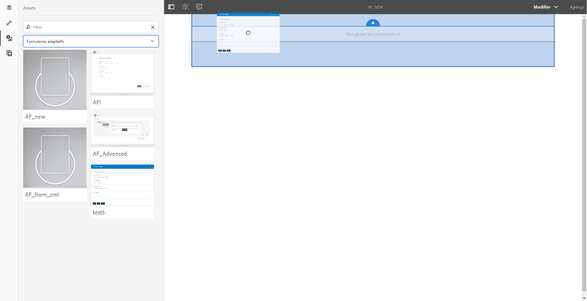

# Créer un formulaire adaptatif à l’aide d’un jeu de formulaires adaptatifs{#create-an-adaptive-form-using-a-set-of-adaptive-forms}

<span class="preview"> Adobe recommande d’utiliser les [composants principaux](https://experienceleague.adobe.com/docs/experience-manager-core-components/using/adaptive-forms/introduction.html?lang=fr) de capture de données modernes et extensibles pour [créer de nouveaux formulaires adaptatifs](/help/forms/using/create-an-adaptive-form-core-components.md) ou [ajouter des formulaires adaptatifs à des pages AEM Sites](/help/forms/using/create-or-add-an-adaptive-form-to-aem-sites-page.md). Ces composants représentent une avancée significative dans la création de formulaires adaptatifs, ce qui garantit des expériences utilisateur impressionnantes. Cet article décrit l’ancienne approche de la création de formulaires adaptatifs à l’aide de composants de base. </span>

## Vue d’ensemble {#overview}

Dans un workflow, tel qu’une demande d’ouverture de compte bancaire, vos utilisateurs et utilisatrices remplissent plusieurs formulaires. Au lieu de leur demander de remplir un jeu de formulaires, vous pouvez empiler les formulaires et créer un grand formulaire (formulaire parent). Lorsque vous ajoutez un formulaire adaptatif au grand formulaire, il est ajouté sous la forme d&#39;un panneau (formulaire enfant). Vous additionnez un jeu de formulaires enfants pour créer un formulaire parent. Vous pouvez afficher ou masquer les panneaux en fonction de l’entrée de l’utilisateur ou l’utilisatrice. Les boutons du formulaire parent, tels que Envoyer et Réinitialiser, remplacent les boutons du formulaire enfant. Pour ajouter un formulaire adaptatif dans le formulaire parent, vous pouvez faire glisser et déposer le formulaire adaptatif depuis l’explorateur de ressources (comme des fragments de formulaire adaptatif).

Les fonctions disponibles sont :

* Création indépendante
* Affichage/Masquage des formulaires pertinents
* Chargement différé

Certaines fonctionnalités, telles que la création indépendante et le chargement différé, améliorent nettement les performances par rapport à l’utilisation de composants individuels pour créer le formulaire parent.

>[!NOTE]
>
>Vous ne pouvez pas utiliser des formulaires ou des fragments adaptatifs basés sur XFA en tant que formulaires enfant ou parent.

## En arrière-plan {#behind-the-scenes}

Vous pouvez ajouter des formulaires et des fragments adaptatifs basés sur XSD dans le formulaire parent. La structure du formulaire parent est la même que celle d’un [formulaire adaptatif](../../forms/using/prepopulate-adaptive-form-fields.md) courant. Lorsque vous ajoutez un formulaire adaptatif en tant que formulaire enfant, il est ajouté sous la forme d’un panneau dans le formulaire parent. Les données d’un formulaire enfant lié sont stockées sous les données racines `data` de la section `afBoundData` du schéma XML du formulaire parent.

Par exemple, vos clientes et clients remplissent le formulaire de demande. Les deux premiers champs du formulaire sont le nom et l’identité. Son XML est :

```xml
<afData>
    <afUnboundData>
        <data />
    </afUnboundData>
    <afBoundData>
        <data xmlns:xfa="https://www.xfa.org/schema/xfa-data/1.0/">
            <applicantName>Sarah Rose</applicantName>
            <applicantId>1234</applicantId>
        </data>
    </afBoundData>
</afData>
```

Vous ajoutez un autre formulaire à la demande qui permet aux clientes et clients de remplir leur adresse professionnelle. Le schéma racine du formulaire enfant est `officeAddress`. Appliquez `bindref` `/application/officeAddress` ou `/officeAddress`. Si `bindref` n’est pas fourni, le formulaire enfant est ajouté comme sous-arborescence `officeAddress`. Examinez le XML du formulaire ci-dessous : 

```xml
<afData>
    <afUnboundData>
        <data />
    </afUnboundData>
    <afBoundData>
        <data xmlns:xfa="https://www.xfa.org/schema/xfa-data/1.0/">
            <applicantName>Sarah Rose</applicantName>
            <applicantId>1234</applicantId>
            <officeAddress>
                <addressLine>1, Geometrixx City</addressLine>
                <zip>11111</zip>
            </officeAddress>
        </data>
    </afBoundData>
</afData>
```

Si vous insérez un autre formulaire qui permet à vos clients de fournir une adresse, appliquez `bindref` `/application/houseAddress or /houseAddress.`. Le XML ressemble à ceci :

```xml
<afData>
    <afUnboundData>
        <data />
    </afUnboundData>
    <afBoundData>
        <data xmlns:xfa="https://www.xfa.org/schema/xfa-data/1.0/">
            <applicantName>Sarah Rose</applicantName>
            <applicantId>1234</applicantId>
            <officeAddress>
                <addressLine>1, Geometrixx City</addressLine>
                <zip>11111</zip>
            </officeAddress>
            <houseAddress>
                <addressLine>2, Geometrixx City</addressLine>
                <zip>11111</zip>
            </houseAddress>
        </data>
    </afBoundData>
</afData>
```

Si vous souhaitez conserver le même nom de sous-racine comme schéma racine (`Address` dans cet exemple), utilisez des bindrefs indexés.

Par exemple, vous pouvez appliquer les bindrefs `/application/address[1]` ou `/address[1]` et `/application/address[2]` ou `/address[2]`. Le XML du formulaire est :

```xml
<afData>
    <afUnboundData>
        <data />
    </afUnboundData>
    <afBoundData>
        <data xmlns:xfa="https://www.xfa.org/schema/xfa-data/1.0/">
            <applicantName>Sarah Rose</applicantName>
            <applicantId>1234</applicantId>
            <address>
                <addressLine>1, Geometrixx City</addressLine>
                <zip>11111</zip>
            </address>
            <address>
                <addressLine>2, Geometrixx City</addressLine>
                <zip>11111</zip>
            </address>
        </data>
    </afBoundData>
</afData>
```

Vous pouvez modifier la sous-arborescence par défaut du formulaire ou du fragment adaptatif à l’aide de la propriété `bindRef`. La propriété `bindRef` vous permet de spécifier le chemin qui pointe vers un emplacement dans l’arborescence du schéma XML.

Si le lien du formulaire enfant est annulé, ses données sont stockées sous les données racines `data` de la section `afUnboundData` du schéma XML du formulaire parent.

Vous pouvez ajouter plusieurs fois un formulaire adaptatif en tant que formulaire enfant. Assurez-vous que le `bindRef` est modifié correctement, de sorte que chaque instance utilisée du formulaire adaptatif pointe vers une sous-racine différente sous les données racines.

>[!NOTE]
>
>Si des formulaires ou des fragments différents sont associés à la même sous-racine, les données sont remplacées.

## Ajout d’un formulaire adaptatif en tant que formulaire enfant à l’aide de l’explorateur de ressources {#adding-an-adaptive-form-as-a-child-form-using-asset-browser}

Effectuez les étapes suivantes pour ajouter un formulaire adaptatif en tant que formulaire enfant à l’aide de l’explorateur de ressources.

1. Ouvrez le formulaire parent en mode d’édition.
1. Dans la barre latérale, cliquez sur **Ressources** . Sous Ressources, sélectionner **Formulaire adaptatif** dans la liste déroulante.
   [](assets/asset-1.png)

1. Glissez et déposez le formulaire adaptatif que vous souhaitez ajouter en tant que formulaire enfant.
   [](assets/drag-drop-1.png). Le formulaire adaptatif que vous déposez est ajouté en tant que formulaire enfant.
