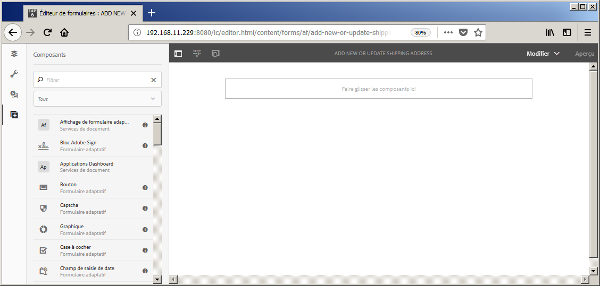
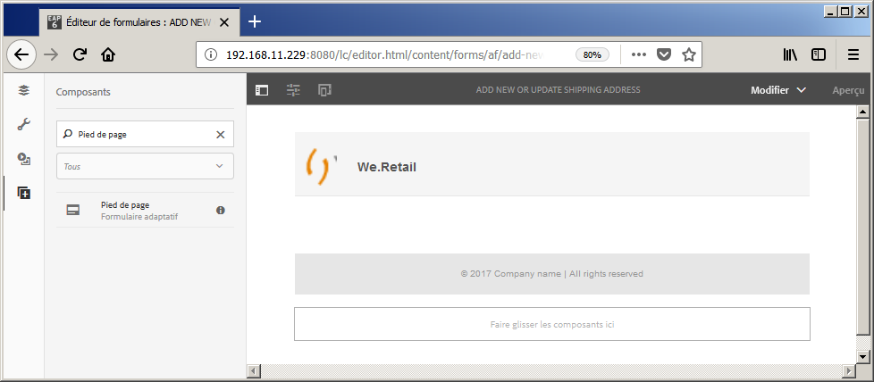
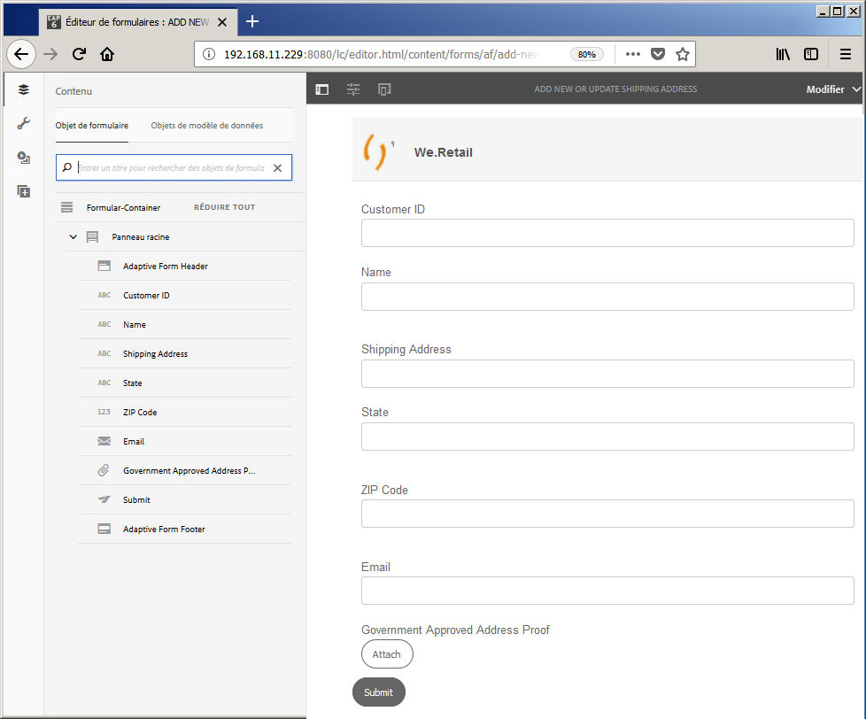

# Didacticiel : création d’un formulaire adaptatif {#do-not-publish-tutorial-create-an-adaptive-form}

Ce didacticiel est une étape de la série [Création de votre premier formulaire adaptatif](/help/forms/using/create-your-first-adaptive-form.md). Il est recommandé de suivre la série dans l’ordre chronologique pour comprendre, exécuter et démontrer le cas d’utilisation complet du didacticiel.

## À propos du didacticiel {#about-the-tutorial}

Les formulaires adaptatifs sont des formulaires dynamiques et réactifs nouvelle génération. Vous pouvez utiliser des formulaires adaptatifs pour offrir des expériences personnalisées. Vous pouvez également intégrer des formulaires adaptatifs à [!DNL Adobe Analytics] pour les statistiques d’utilisation et à [!DNL Adobe Campaign] pour la Gestion de campagne. Pour plus d’informations sur les fonctionnalités des formulaires adaptatifs, voir [Présentation de la création de formulaires adaptatifs](/help/forms/using/introduction-forms-authoring.md).

Il est plus facile de créer et de gérer des formulaires en suivant un processus approprié. Dans cet article, vous apprenez à :

* [Créer un formulaire adaptatif permettant à un client d’ajouter une adresse de livraison](/help/forms/using/create-adaptive-form.md#step-create-the-adaptive-form)

* [Mettre en forme les champs d’un formulaire adaptatif pour afficher et accepter les informations d’un client](/help/forms/using/create-adaptive-form.md#step-add-header-and-footer)

* [Créer une action d’envoi pour envoyer un courrier électronique contenant du contenu de formulaire](/help/forms/using/create-adaptive-form.md#step-add-components-to-capture-and-display-information)
* [Prévisualiser et envoyer un formulaire adaptatif](/help/forms/using/create-adaptive-form.md)

À la fin de l’article, vous disposerez d’un formulaire similaire au suivant :\

## Étape 1 : création du formulaire adaptatif {#step-create-the-adaptive-form}

1. Connectez-vous à l’instance d’auteur AEM et accédez à **[!UICONTROL Adobe Experience Manager]** > **[!UICONTROL Formulaires]** > **[!UICONTROL Formulaires et documents]**. L’URL par défaut est [http://localhost:4502/aem/forms.html/content/dam/formsanddocuments](http://localhost:4502/aem/forms.html/content/dam/formsanddocuments).
1. Appuyez sur **[!UICONTROL Créer]** et sélectionner le **[!UICONTROL Formulaire adaptatif]**. Une option permettant de sélectionner un modèle s’affiche. Cliquez sur le modèle **[!UICONTROL Vide]** pour le sélectionner, puis appuyez sur **[!UICONTROL Suivant]**.

1. L’option **[!UICONTROL Ajouter des propriétés]** s’affiche. Les champs **[!UICONTROL Titre]** et **[!UICONTROL Nom]** sont obligatoires :

   * **Titre :** indiquez  `Add new or update shipping address` dans le champ  **** Titre. Le champ Titre spécifie le nom d’affichage du formulaire. Le titre vous permet d’identifier le formulaire dans l’interface utilisateur AEM [!DNL Forms].
   * **Nom :** indiquez  `shipping-address-add-update-form` dans le  **** champ Nom. Le champ Nom indique le nom du formulaire. Un nœud portant le nom indiqué est alors créé dans le référentiel. Lorsque vous commencez à saisir un titre, une valeur pour le champ de nom est automatiquement générée. Vous pouvez modifier la valeur suggérée. Le champ de nom peut contenir uniquement des caractères alphanumériques, des traits d’union et des tirets bas. Toutes les entrées non valides sont remplacées par un tiret.

1. Appuyez sur **[!UICONTROL Create]** (Créer). Un formulaire adaptatif est créé et une boîte de dialogue pour ouvrir le formulaire à modifier s’affiche. Appuyez sur **[!UICONTROL Ouvrir]** pour ouvrir le formulaire nouvellement créé dans un nouvel onglet. Le formulaire s’ouvre pour modification. Il affiche également la barre latérale permettant de personnaliser le formulaire nouvellement créé selon vos besoins.

   Pour plus d’informations sur l’interface de création de formulaires adaptatifs et les composants disponibles, voir [Présentation de la création de formulaires adaptatifs](/help/forms/using/creating-adaptive-form.md).

   

## Étape 2 : ajout d’un en-tête et d’un pied de page {#step-add-header-and-footer}

AEM [!DNL Forms] fournit de nombreux composants pour afficher des informations sur un formulaire adaptatif. Les composants d’en-tête et de pied de page contribuent à une apparence cohérente du formulaire. Un en-tête comprend généralement le logo d’une entreprise, le titre du formulaire et un résumé. Un pied de page contient généralement des informations de copyright, ainsi que des liens vers d’autres pages.

1. Appuyez sur  > . L’explorateur de composants s’affiche. Faites glisser et déposez le composant **[!UICONTROL En-tête]** de l’explorateur de composants vers le formulaire adaptatif.
1. Appuyez sur **[!UICONTROL Logo]**. La barre d’outils s’affiche. Appuyez sur  dans la barre d’outils, tapez **We.Retail**, puis appuyez sur .

1. Appuyez sur l’image. La barre d’outils s’affiche. Appuyez sur . L’explorateur de propriétés s’ouvre sur la partie gauche de l’écran. **[!UICONTROL Recherchez]** et téléchargez l’image du logo. Appuyez sur . L’image apparaît dans l’en-tête.

   Vous pouvez appuyer sur Obtenir le fichier pour télécharger le logo utilisé dans cet article si vous n’en avez pas.

   [Obtenir le fichier](assets/logo.png)

1. Faites glisser le composant **[!UICONTROL Pied de page]** de  vers le formulaire adaptatif. A ce stade, le formulaire ressemble à ce qui suit :

   

## Étape 3 : ajout de composants pour capturer et afficher les informations {#step-add-components-to-capture-and-display-information}

Les composants sont les blocs de construction d’un formulaire adaptatif. AEM [!DNL Forms] fournit de nombreux composants pour capturer et afficher des informations dans un formulaire adaptatif. Vous pouvez faire glisser les composants de  vers un formulaire. Pour en savoir plus sur les composants disponibles et les fonctionnalités correspondantes, voir [Présentation de la création de formulaires adaptatifs](/help/forms/using/introduction-forms-authoring.md).

1. Faites glisser le composant **[!UICONTROL Zone numérique]** vers le formulaire adaptatif. Placez-le avant le composant de pied de page. Ouvrez les propriétés du composant, remplacez **[!UICONTROL Titre]** du composant par **`Customer ID`**, **[!UICONTROL Nom de l’élément]** par **`customer_ID`**, activez l’option **[!UICONTROL Champ requis]**, activez l’option **[!UICONTROL Utiliser le type d’entrée numérique HTML5]** et appuyez sur .
1. Faites glisser trois composants de la zone de texte vers le formulaire adaptatif. Placez-les avant le pied de page. Définissez les propriétés suivantes pour ces zones de texte. :

   <table> 
    <tbody> 
     <tr> 
      <td><b>Propriété</b></td> 
      <td><b>Zone de texte 1 </b></td> 
      <td><b>Zone de texte 2 </b></td> 
      <td><b>Zone de texte 3</b></td> 
     </tr> 
     <tr> 
      <td>Titre</td> 
      <td>Nom  </td> 
      <td>Adresse d’expédition</td> 
      <td>État</td> 
     </tr> 
     <tr> 
      <td>Nom de l’élément</td> 
      <td>customer_Name  </td> 
      <td>customer_Shipping_Address</td> 
      <td>customer_State</td> 
     </tr> 
     <tr> 
      <td>Champ obligatoire</td> 
      <td>Activé</td> 
      <td>Activé</td> 
      <td>Activé</td> 
     </tr> 
     <tr> 
      <td>Permettre des lignes multiples  </td> 
      <td>Désactivé</td> 
      <td>Activé</td> 
      <td>Désactivé</td> 
     </tr> 
    </tbody> 
   </table>

1. Faites glisser un composant de **[!UICONTROL Zone numérique]** avant le composant de pied de page. Ouvrez les propriétés du composant, définissez les valeurs répertoriées dans le tableau ci-dessous, appuyez sur .

   | Propriétés | Valeur |
   |---|---|
   | Titre | Code postal |
   | Nom de l’élément | customer_ZIPCode |
   | Nombre maximal de chiffres | 6 |
   | Champ obligatoire | Activé |
   | Type de modèle d’affichage | Aucun modèle |

1. Faites glisser un composant **[!UICONTROL Courrier électronique]** avant le composant de pied de page. Ouvrez les propriétés du composant, définissez les valeurs répertoriées dans le tableau ci-dessous, puis appuyez sur .

   | Propriétés | Valeur |
   |---|---|
   | Titre | Courrier électronique |
   | Nom de l’élément | customer_Email |
   | Champ obligatoire | Activé |

1. Faites glisser un composant **[!UICONTROL Pièce jointe]** avant le composant de pied de page. Ouvrez les propriétés du composant, définissez les valeurs répertoriées dans le tableau ci-dessous, puis appuyez sur .

   <table> 
    <tbody> 
     <tr> 
      <td><b>Propriétés</b></td> 
      <td><b>Valeur</b></td> 
     </tr> 
     <tr> 
      <td>Titre</td> 
      <td>Preuve d’adresse approuvée par le gouvernement  </td> 
     </tr> 
     <tr> 
      <td>Nom de l’élément</td> 
      <td>customer_Address_Proof</td> 
     </tr> 
     <tr> 
      <td>Champ obligatoire</td> 
      <td>Activé</td> 
     </tr> 
    </tbody> 
   </table>

1. Faites glisser un composant **[!UICONTROL Bouton Envoyer]** vers le formulaire adaptatif. Placez-le avant le composant de pied de page. Ouvrez les propriétés du composant, remplacez Nom de l’élément par `address_addition_update_submit`, appuyez sur . La mise en page du formulaire est complète et le formulaire a l’apparence suivante :

   

## Étape 4 : configuration de l’action d’envoi du formulaire adaptatif {#step-configure-submit-action-for-the-adaptive-form}

Une action d’envoi est déclenchée lorsqu’un utilisateur clique sur le bouton Envoyer d’un formulaire adaptatif. Vous pouvez utiliser une action d’envoi pour enregistrer des données de formulaire dans le référentiel local, envoyer des données de formulaire vers un point de fin REST, envoyer des données de formulaire par courrier électronique, et plus encore. Les formulaires adaptatifs fournissent quelques actions d’envoi prêtes à l’emploi. Pour plus d’informations, voir [Configuration de l’action Envoyer](/help/forms/using/configuring-submit-actions.md).

En suivant les étapes ci-dessous, vous pouvez configurer l’action Envoyer par messagerie et l’action Envoyer de démonstration du formulaire :

1. Configurez le serveur de courrier électronique. Pour plus d’informations, reportez-vous à la section [Configuration des notifications par courrier électronique](/help/sites-administering/notification.md).

1. Appuyez sur **[!UICONTROL Conteneur de formulaire]** dans le navigateur de contenu et appuyez sur . L’explorateur de propriétés s’ouvre sur la partie gauche de l’écran.
1. Accédez à **[!UICONTROL Envoi]** > **[!UICONTROL Action d’envoi]**. Sélectionnez **[!UICONTROL Envoyer un courrier électronique]**. Spécifiez les valeurs suivantes et appuyez sur .

   | Propriétés | Valeur |
   |--- |--- |
   | Origine | `donotreply@weretail.com` |
   | To | `${customer_Email}` |
   | Objet | Accusé de réception : vous avez ajouté l’adresse de livraison sur le site Web de We.Retail. |
   | Modèle de courrier électronique | Bonjour `${customer_Name}`, L&#39;adresse suivante est ajoutée en tant qu&#39;adresse de livraison pour votre compte :  `${customer_Name}`, `${customer_Shipping_Address}`, `${customer_State}`, `${customer_ZIPCode}`  Regards, We.Retail |
   | Inclure les pièces jointes | Activé |

   Votre formulaire est prêt. Vous pouvez à présent prévisualiser le formulaire et tester la fonctionnalité. Si vous avez utilisé le nom mentionné dans le didacticiel et accédé au formulaire sur l’ordinateur exécutant AEM serveur [!DNL Forms], le formulaire est disponible à l’adresse [http://localhost:4502/editor.html/content/forms/af/shipping-address-add-update-form.html](http://localhost:4502/editor.html/content/forms/af/shipping-address-add-update-form.html).

## Étape 5 : prévisualisation et envoi du formulaire adaptatif {#step-preview-and-submit-the-adaptive-form}

Vous pouvez utiliser l’option **[!UICONTROL Aperçu]** pour évaluer l’apparence et le comportement d’un formulaire. Vous pouvez envoyer un formulaire en mode aperçu et vérifier les validations appliquées à un formulaire. Si une erreur s’affiche lorsqu’un champ obligatoire est laissé vide, par exemple.

Les formulaires adaptatifs permettent également d’émuler l’expérience d’un formulaire pour différents appareils. Par exemple, iPhone, iPad et appareils de bureau. Vous pouvez utiliser les options **[!UICONTROL Prévisualisation]** et **[!UICONTROL Émulateur]**  conjointement les unes avec les autres pour prévisualisation un formulaire pour des périphériques de différentes tailles d’écran.

1. Appuyez sur l’option **[!UICONTROL Aperçu]** sur le côté droit de l’éditeur de formulaires. Le formulaire s’ouvre en mode aperçu. Si vous avez utilisé le nom mentionné dans le didacticiel, l’URL de l’aperçu du formulaire est [http://localhost:4502/content/dam/formsanddocuments/shipping-address-add-update-form/jcr:content?wcmmode=disabled](http://localhost:4502/content/dam/formsanddocuments/shipping-address-addition-updation-form/jcr:content?wcmmode=disabled)
1. Utilisez  pour vue l’aspect du formulaire sur divers périphériques.
1. Remplissez les champs du formulaire et appuyez sur **[!UICONTROL Envoyer]**. Le formulaire est envoyé et vous êtes redirigé vers la **page de remerciement** par défaut. Vous pouvez également spécifier une page de remerciement personnalisée. Pour plus de détails, voir [Configuration de la page de redirection](/help/forms/using/configuring-redirect-page.md).

Le formulaire adaptatif pour l’ajout d’une adresse est prêt. Si vous avez utilisé le nom mentionné dans le didacticiel et accédé au formulaire sur l’ordinateur exécutant AEM Forms Server, le formulaire est disponible à l’adresse [http://localhost:4502/editor.html/content/forms/af/shipping-address-add-update-form.html](http://localhost:4502/editor.html/content/forms/af/shipping-address-add-update-form.html).
