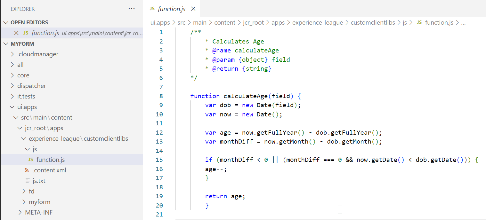
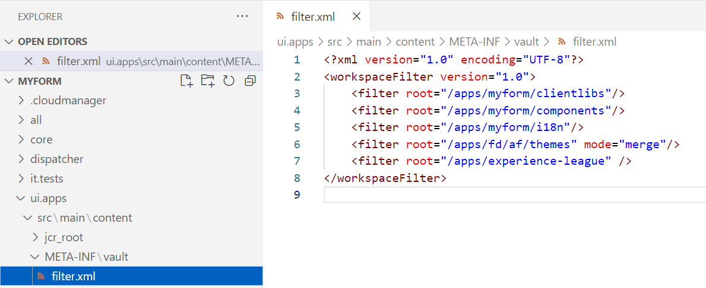

# Fonctions personnalisées dans les composants principaux de Forms adaptatif

<span class="preview"> Cet article contient le contenu des fonctionnalités du programme d’adoption précoce. Ces fonctions de préversion sont accessibles uniquement via notre [canal de version préliminaire](https://experienceleague.adobe.com/en/docs/experience-manager-65/content/release-notes/release-notes#forms). Les fonctionnalités du programme de version préliminaire sont les suivantes :
<!-- * Optional parameter support in Custom Functions-->
* Fonction de mise en cache des fonctions personnalisées
* Prise en charge des objets de champ et d’objet de portée globale pour les fonctions personnalisées
* Prise en charge des fonctionnalités JavaScript modernes telles que les fonctions de gauche et de flèche (prise en charge ES10)

Assurez-vous de définir la variable [dernière version de formulaire](https://github.com/adobe/aem-core-forms-components/tree/release/650) sur votre environnement de composants principaux AEM Forms pour utiliser les fonctionnalités de version préliminaire dans les fonctions personnalisées. </span>


| Version | Lien de l’article |
| -------- | ---------------------------- |
| AEM 6.5 | Cet article |
| AEM as a Cloud Service | [Cliquez ici](https://experienceleague.adobe.com/fr/docs/experience-manager-cloud-service/content/forms/adaptive-forms-authoring/authoring-adaptive-forms-core-components/create-an-adaptive-form-on-forms-cs/create-and-use-custom-functions) |

## Présentation

AEM Forms 6.5 comprend des fonctions JavaScript qui vous permettent de définir des règles métier complexes à l’aide de l’éditeur de règles. Bien qu’AEM Forms offre une variété de fonctions personnalisées d’usine, de nombreux cas d’utilisation nécessitent la définition de vos propres fonctions personnalisées à utiliser dans plusieurs formulaires. Ces fonctions personnalisées améliorent les fonctionnalités des formulaires en permettant la manipulation et le traitement des données saisies pour répondre à des besoins spécifiques. En outre, elles permettent une modification dynamique du comportement du formulaire en fonction de critères prédéfinis.

### Utilisation de fonctions personnalisées {#uses-of-custom-function}

Les avantages des fonctions personnalisées dans les composants principaux de Forms adaptatif sont les suivants :


* **Gestion des données**: les fonctions personnalisées gèrent et traitent les données saisies dans les champs de formulaires.
* **Traitement des données**: les fonctions personnalisées aident à traiter les données saisies dans les champs de formulaires.
* **Validation des données**: les fonctions personnalisées vous permettent d’effectuer des vérifications personnalisées sur les entrées de formulaire et de fournir des messages d’erreur spécifiés.
* **Comportement dynamique**: les fonctions personnalisées vous permettent de contrôler le comportement dynamique de vos formulaires en fonction de conditions spécifiques. Vous pouvez, par exemple, afficher/masquer des champs, modifier les valeurs de champ ou ajuster dynamiquement la logique du formulaire.
* **Intégration**: vous pouvez utiliser des fonctions personnalisées pour l’intégration à des API ou services externes. Il permet de récupérer des données provenant de sources externes, d’envoyer des données à des points de terminaison Rest externes ou d’effectuer des actions personnalisées basées sur des événements externes.

Les fonctions personnalisées sont essentiellement des bibliothèques clientes ajoutées dans le fichier JavaScript. Une fois que vous avez créé une fonction personnalisée, elle est disponible dans l’éditeur de règles et peut être sélectionnée par l’utilisateur dans un formulaire adaptatif. Les fonctions personnalisées sont identifiées par les annotations JavaScript dans l’éditeur de règles.

### Annotations JavaScript prises en charge pour une fonction personnalisée {#js-annotations}

**Les annotations JavaScript fournissent des métadonnées pour le code JavaScript.**. Il comprend des commentaires commençant par des symboles spécifiques, par exemple : `/**` et `@`. Les annotations fournissent des informations importantes sur les fonctions, variables et autres éléments du code. Le formulaire adaptatif prend en charge les annotations JavaScript suivantes pour les fonctions personnalisées :

#### Nom

La variable **Nom** est utilisé pour identifier la fonction personnalisée dans l’éditeur de règles d’un formulaire adaptatif. Les syntaxes suivantes sont utilisées pour nommer une fonction personnalisée :

* `@name [functionName] <Function Name>`
* `@function [functionName] <Function Name>`
* `@func [functionName] <Function Name>`

>[!NOTE]
>`[functionName]` est le nom de la fonction. Les espaces ne sont pas autorisés.
>`<Function Name>` est le nom d’affichage de la fonction dans l’éditeur de règles d’Adaptive Forms.
>Si le nom de la fonction est identique à celui de la fonction elle-même, vous pouvez l’omettre. `[functionName]` de la syntaxe .

#### Paramètre

La variable **Paramètre** est une liste d’arguments utilisés par les fonctions personnalisées. Une fonction peut prendre en charge plusieurs paramètres. Les syntaxes suivantes sont utilisées pour définir un paramètre dans une fonction personnalisée :

* `@param {type} name <Parameter Description>`
* `@argument` `{type} name <Parameter Description>`
* `@arg` `{type}` `name <Parameter Description>`

  `{type}` représente le type de paramètre. Les types de paramètres autorisés sont les suivants :

   * string : représente une seule valeur de chaîne.
   * number : représente une seule valeur numérique.
   * boolean : représente une seule valeur booléenne (true ou false).
   * string[]: représente un tableau de valeurs de chaîne.
   * nombre[]: représente un tableau de valeurs numériques.
   * boolean[]: représente un tableau de valeurs booléennes.
   * date : représente une seule valeur de date.
   * date[]: représente un tableau de valeurs de date.
   * array : représente un tableau générique contenant des valeurs de différents types.
   * object : représente l’objet de formulaire transmis à une fonction personnalisée au lieu de transmettre directement sa valeur.
   * scope : représente l’objet global, qui contient des variables en lecture seule telles que des instances de formulaire, des instances de champ cible et des méthodes permettant d’effectuer des modifications dans les fonctions personnalisées. Il est déclaré comme dernier paramètre dans les annotations JavaScript et n’est pas visible par l’éditeur de règles d’un formulaire adaptatif. Le paramètre scope accède à l’objet du formulaire ou du composant pour déclencher la règle ou l’événement requis pour le traitement du formulaire. Pour plus d’informations sur l’objet Globals et son utilisation, voir [cliquez ici](/help/forms/using/create-and-use-custom-functions-core-components.md#field-and-global-scope-objects-in-custom-functions-support-field-and-global-objects)

Le type de paramètre est **non sensible à la casse** Les espaces et ne sont pas autorisés dans le nom du paramètre.

`<Parameter Description>` contient des détails sur l’objectif du paramètre. Il peut avoir plusieurs mots.

<!--

**Optional Parameters**
By default, all parameters are mandatory. You can define a parameter as optional by either adding `=` after the parameter type or enclosing the parameter name in `[]`. Parameters defined as optional in JavaScript annotations are displayed as optional in the rule editor.
To define a variable as an optional parameter, you can use the any of the following syntaxes:
  
* `@param {type=} Input1`

In the above line of code, `Input1` is an optional parameter without any default value. To declare optional parameter with default value:

`@param {string=<value>} input1`
        
`input1` as an optional parameter with the default value set to `value`. 

* `@param {type} [Input1]`

In the above line of code, `Input1` is an optional parameter without any default value. To declare optional parameter with default value:

`@param {array} [input1=<value>]`

    `input1` is an optional parameter of array type with the default value set to `value`. 
    Ensure that the parameter type is enclosed in curly brackets {} and the parameter name is enclosed in square brackets []. 

Consider the following code snippet, where input2 is defined as an optional parameter:

```javascript

        /**
         * optional parameter function
         * @name OptionalParameterFunction
         * @param {string} input1 
         * @param {string=} input2 
         * @return {string}
        */
        function OptionalParameterFunction(input1, input2) {
        let result = "Result: ";
        result += input1;
        if (input2 !== null) {
            result += " " + input2;
        }
        return result;
        }
```

The following illustration displays using the `OptionalParameterFunction` csutom function in the rule editor:


You can save the rule without specifying a value for required parameters, but the rule is not executed and displays a warning message as:


When user leaves the optional parameter empty, then the "Undefined" value is passed to the custom function for the optional parameter.

To learn more about how to define optional parameters in JSDocs, [click here](https://jsdoc.app/tags-param).

-->

#### Type de retour

Le type de retour spécifie le type de valeur que la fonction personnalisée renvoie après l’exécution. Les syntaxes suivantes sont utilisées pour définir un type de retour dans une fonction personnalisée :

* `@return {type}`
* `@returns {type}`
  `{type}` représente le type de retour de la fonction. Les types de retour autorisés sont les suivants :
* string : représente une seule valeur de chaîne.
* number : représente une seule valeur numérique.
* boolean : représente une seule valeur booléenne (true ou false).
* string[]: représente un tableau de valeurs de chaîne.
* nombre[]: représente un tableau de valeurs numériques.
* boolean[]: représente un tableau de valeurs booléennes.
* date : représente une seule valeur de date.
* date[]: représente un tableau de valeurs de date.
* array : représente un tableau générique contenant des valeurs de différents types.
* object : représente l’objet de formulaire au lieu de sa valeur directement.

Le type de retour n’est pas sensible à la casse.

#### Privée

La fonction personnalisée, déclarée comme privée, n’apparaît pas dans la liste des fonctions personnalisées de l’éditeur de règles d’un formulaire adaptatif. Par défaut, les fonctions personnalisées sont publiques. La syntaxe permettant de déclarer une fonction personnalisée comme étant privée est `@private`.

<!--
#### Member

  Syntax: `@memberof namespace`
  Attaches a namespace to the function.
-->

<!--

#### This

   Syntax: `@this currentComponent`

   Use @this to refer to the Adaptive Form component on which the rule is written. 
  
   The following example is based on the field value. In the following example, the rule hides a field in the form. The `this` portion of `this.value` refers to underlying Adaptive Form component, on which the rule is written.

   ```
      /**
      * @function myTestFunction
      * @this currentComponent
      * @param {scope} scope in which code inside function will be executed.
      */
      myTestFunction = function (scope) {
         if(this.value == "O"){
               scope.age.visible = true;
         } else {
            scope.age.visible = false;
         }
      }

   ```

    >[!NOTE]
    >
    >Comments before custom function are used for summary. Summary can extend to multiple lines until a tag is encountered. Limit the size to a single for a concise description in the rule builder.

-->

<!--

## Function declaration supported types {#function-declaration-supported-types}

**Function Statement**

```javascript
function area(len) {
    return len*len;
}
```

This function is included without `jsdoc` comments.

**Function Expression**

```javascript
var area;
//Some codes later
/** */
area = function(len) {
    return len*len;
};
```

**Function Expression and Statement**

```javascript
var b={};
/** */
b.area = function(len) {
    return len*len;
}
```

**Function Declaration as Variable**

```javascript
/** */
var x1,
    area = function(len) {
        return len*len;
    },
    x2 =5, x3 =true;
```

Limitation: custom function picks only the first function declaration from the variable list, if together. You can use function expression for every function declared.

**Function Declaration as Object**

```javascript
var c = {
    b : {
        /** */
        area : function(len) {
            return len*len;
        }
    }
};
```
-->

## Instructions relatives à la création de fonctions personnalisées {#considerations}

Pour répertorier les fonctions personnalisées dans l’éditeur de règles, vous pouvez utiliser l’un des formats suivants :

### Instruction de fonction avec ou sans commentaires jsdoc

Vous pouvez créer une fonction personnalisée avec ou sans commentaires jsdoc.

```javascript
    function functionName(parameters) 
        {
            // code to be executed
        }
```

Si l’utilisateur n’ajoute aucune annotation JavaScript à la fonction personnalisée, elle est répertoriée dans l’éditeur de règles par son nom de fonction. Toutefois, il est recommandé d’inclure des annotations JavaScript pour améliorer la lisibilité des fonctions personnalisées.


### Fonction de flèche avec annotations JavaScript ou commentaire obligatoires

Vous pouvez créer une fonction personnalisée à l’aide d’une syntaxe de fonction de flèche :

```javascript
    /**
    * test function
    * @name testFunction 
    * @param {string} a parameter description
    * @param {string=} b parameter description
    * @return {string}
    */
    testFunction = (a, b) => {
    return a + b;
    };
    /** */
    testFunction1=(a) => (return a)
    /** */
    testFunction2 = a => a + 100;
    
```

Si l’utilisateur n’ajoute aucune annotation JavaScript à la fonction personnalisée, celle-ci n’est pas répertoriée dans l’éditeur de règles d’un formulaire adaptatif.

### Expression de fonction avec annotations ou commentaire JavaScript obligatoires

Pour répertorier les fonctions personnalisées dans l’éditeur de règles d’un formulaire adaptatif, créez des fonctions personnalisées au format suivant :

```javascript
    /**
    * test function
    * @name testFunction 
    * @param {string} input1 parameter description
    * @param {string=} input2 parameter description
    * @return {string}
    */
    testFunction = function(input1,input2)
        {
            // code to be executed
        }
```

Si l’utilisateur n’ajoute aucune annotation JavaScript à la fonction personnalisée, celle-ci n’est pas répertoriée dans l’éditeur de règles d’un formulaire adaptatif.

### Conditions préalables à la création d’une fonction personnalisée

Avant de commencer à ajouter une fonction personnalisée à votre Forms adaptatif, assurez-vous que les logiciels suivants sont installés sur votre ordinateur :

* **Éditeur de texte brut (IDE)**: bien que tout éditeur de texte brut puisse fonctionner, un environnement de développement intégré (IDE) comme Microsoft Visual Studio Code offre des fonctionnalités avancées pour faciliter la modification.

* **Git :** Ce système de contrôle de version est requis pour la gestion des modifications de code. Si vous ne l’avez pas installé, téléchargez-le à partir de https://git-scm.com.


## Créer une fonction personnalisée {#create-custom-function}

Les étapes de création de fonctions personnalisées sont les suivantes :
1. [Création d’une bibliothèque côté client à l’aide de l’AEM Project Archetype et ajout d’une fonction personnalisée](#create-client-library-archetype)
OU
   [Création de fonctions personnalisées via CRXDE](#create-add-custom-function)
1. [Ajout d’une bibliothèque cliente à un formulaire adaptatif](#add-client-library)
1. [Utilisation d’une fonction personnalisée dans un formulaire adaptatif](#use-custom-functions)


### Création d’une bibliothèque cliente à l’aide de l’archétype de projet AEM{#create-client-library-archetype}

Vous pouvez ajouter des fonctions personnalisées en ajoutant une bibliothèque cliente au projet créé. [utilisation de l’archétype de projet AEM](https://experienceleague.adobe.com/en/docs/experience-manager-core-components/using/developing/archetype/using#getting-started).
Si vous disposez d’un projet <!--and have already the project structure as shown in the image below,--> vous pouvez ajouter directement des [fonctions personnalisées](#create-add-custom-function) à votre projet local.

<!---->

Après avoir créé un projet Archetype ou utilisé un projet existant, créez une bibliothèque cliente. Pour créer une bibliothèque cliente, procédez comme suit :

**Ajouter un dossier de bibliothèque cliente**

Pour ajouter un nouveau dossier de bibliothèque cliente à [AEM répertoire du projet], procédez comme suit :

1. Ouvrez le [AEM répertoire du projet] dans un éditeur.

   

1. Localiser `ui.apps`.
1. Ajoutez un nouveau dossier. Par exemple, ajoutez un dossier nommé comme `experience-league`.
1. Accédez à `/experience-league/` et ajouter un `ClientLibraryFolder`. Par exemple, créez un dossier de bibliothèques clientes nommé comme `customclientlibs`.

   L’emplacement est : `[AEM project directory]/ui.apps/src/main/content/jcr_root/apps/`

**Ajout de fichiers et de dossiers au dossier Bibliothèque cliente**

Ajoutez ce qui suit au dossier de bibliothèque cliente ajouté :

* `.content.xml` approuvé
* `js.txt` approuvé
* `js` folder

`Location is: [AEMaaCS project directory]/ui.apps/src/main/content/jcr_root/apps/experience-league/customclientlibs/`

1. Dans le `.content.xml` ajoutez les lignes de code suivantes :

   ```javascript
   <?xml version="1.0" encoding="UTF-8"?>
   <jcr:root xmlns:cq="http://www.day.com/jcr/cq/1.0" xmlns:jcr="http://www.jcp.org/jcr/1.0"
   jcr:primaryType="cq:ClientLibraryFolder"
   categories="[customfunctionscategory]"/>
   ```

   >[!NOTE]
   >
   > Vous pouvez choisir n’importe quel nom pour `client library folder` et `categories` .

1. Dans le `js.txt` ajoutez les lignes de code suivantes :

   ```javascript
         #base=js
       function.js
   ```

1. Dans le `js` , ajoutez le fichier javascript en tant que `function.js` qui inclut les fonctions personnalisées :

   ```javascript
   /**
       * Calculates Age
       * @name calculateAge
       * @param {object} field
       * @return {string} 
   */
   
   function calculateAge(field) {
   var dob = new Date(field);
   var now = new Date();
   
   var age = now.getFullYear() - dob.getFullYear();
   var monthDiff = now.getMonth() - dob.getMonth();
   
   if (monthDiff < 0 || (monthDiff === 0 && now.getDate() < dob.getDate())) {
   age--;
   }
   
   return age;
   }
   ```

1. Enregistrez les fichiers.



**Inclure le nouveau dossier dans filter.xml**:

1. Accédez au `/ui.apps/src/main/content/META-INF/vault/filter.xml` dans votre [Répertoire du projet AEMaaCS].

1. Ouvrez le fichier et ajoutez la ligne suivante à la fin :

   `<filter root="/apps/experience-league" />`
1. Enregistrez le fichier.

   

1. Créez le dossier de bibliothèques clientes nouvellement créé dans votre environnement AEM en suivant les étapes indiquées dans [Création de section](https://github.com/adobe/aem-project-archetype/tree/develop/src/main/archetype#how-to-build).

## Création et déploiement de fonctions personnalisées via CRXDE{#create-add-custom-function}

Si vous utilisez le dernier module complémentaire AEM Forms et Forms, vous pouvez créer une fonction personnalisée via CRXDE pour utiliser les dernières mises à jour des fonctions personnalisées. Pour ce faire, procédez comme suit :

<!---->


1. Connectez-vous à `http://server:port/crx/de/index.jsp#`.
1. Créez un dossier sous le dossier `/apps`. Par exemple, créez un dossier nommé `experience-league`.
1. Enregistrez vos modifications.
1. Accédez au dossier créé et créez un noeud de type `cq:ClientLibraryFolder` sous `clientlibs`.
1. Accédez au dossier `clientlibs` nouvellement créé et ajoutez les propriétés `allowProxy` et `categories` :

   

   >[!NOTE]
   >
   > Vous pouvez utiliser le nom de votre choix à la place de `customfunctionsdemo`.

1. Enregistrez vos modifications.

1. Créez un dossier appelé `js` sous le dossier `clientlibs`.
1. Créez un fichier JavaScript appelé `functions.js` sous le `js` dossier.
1. Créez un fichier appelé `js.txt` sous le dossier `clientlibs`.
1. Enregistrez vos modifications.
La structure de dossiers créée ressemble à ce qui suit :

   
1. Double-cliquez sur le fichier `functions.js` pour ouvrir l’éditeur. Le fichier comprend le code de la fonction personnalisée.
Ajoutons le code suivant au fichier JavaScript pour calculer l’âge en fonction de la date de naissance (AAAA-MM-JJ).

   ```javascript
       /**
            * Calculates Age
            * @name calculateAge 
            * @return {string} 
       */
   
       function calculateAge(dateOfBirthString) {
       var dob = new Date(dateOfBirthString);
       var now = new Date();
   
       var age = now.getFullYear() - dob.getFullYear();
       var monthDiff = now.getMonth() - dob.getMonth();
   
       if (monthDiff < 0 || (monthDiff === 0 && now.getDate() < dob.getDate())) {
       age--;
       }
   
       return age;
       }
   ```

1. Enregistrez `function.js`.
1. Accédez à `js.txt` et ajoutez le code suivant :

   ```javascript
       #base=js
       functions.js
   ```

1. Enregistrez le fichier `js.txt`.

Vous pouvez vous référer aux [fonction personnalisée](/help/forms/using/assets/customfunction.zip) dossier. Téléchargez et installez ce dossier sur votre instance AEM.

Désormais, vous pouvez utiliser la fonction personnalisée dans votre formulaire adaptatif en ajoutant la bibliothèque cliente.

## Ajout d’une bibliothèque cliente dans un formulaire adaptatif{#add-client-library}

Une fois que vous avez déployé votre bibliothèque cliente dans votre environnement AEM Forms, utilisez ses fonctionnalités dans votre formulaire adaptatif. Pour ajouter la bibliothèque cliente dans votre formulaire adaptatif

1. Ouvrez votre formulaire en mode d’édition. Pour ouvrir un formulaire en mode d’édition, sélectionnez-le, puis **[!UICONTROL Modifier]**.
1. Ouvrez l’explorateur de contenu, puis sélectionnez le composant **[!UICONTROL Conteneur de guide]** de votre formulaire adaptatif.
1. Cliquez sur l’icône Propriétés du conteneur de guide . La fenêtre du conteneur de formulaires adaptatifs s’ouvre.
1. Ouvrez le **[!UICONTROL De base]** et sélectionnez le nom du **[!UICONTROL catégorie de bibliothèque cliente]** dans la liste déroulante (dans ce cas, sélectionnez `customfunctionscategory`).

   

1. Cliquez sur **[!UICONTROL Terminé]**.

Vous pouvez maintenant créer une règle pour utiliser des fonctions personnalisées dans l’éditeur de règles :


Maintenant, comprenons comment configurer et utiliser une fonction personnalisée à l’aide de la fonction [Service Invoke de l’éditeur de règles dans AEM Forms 6.5](/help/forms/using/rule-editor-core-components.md#invoke-form-data-model-service-invoke)

## Utilisation d’une fonction personnalisée dans un formulaire adaptatif {#use-custom-functions}

Dans un formulaire adaptatif, vous pouvez utiliser [Fonctions personnalisées dans l’éditeur de règles](/help/forms/using/rule-editor-core-components.md).
Ajoutons le code suivant au fichier JavaScript (`Function.js` ) pour calculer l’âge en fonction de la date de naissance (AAAA-MM-JJ). Création d’une fonction personnalisée en tant que `calculateAge()` qui prend la date de naissance comme entrée et renvoie l’âge :

```javascript
    /**
        * Calculates Age
        * @name calculateAge
        * @param {object} field
        * @return {string} 
    */

    function calculateAge(field) {
    var dob = new Date(field);
    var now = new Date();

    var age = now.getFullYear() - dob.getFullYear();
    var monthDiff = now.getMonth() - dob.getMonth();

    if (monthDiff < 0 || (monthDiff === 0 && now.getDate() < dob.getDate())) {
    age--;
    }

    return age;
    }
```

Dans l’exemple ci-dessus, lorsque l’utilisateur saisit la date de naissance au format (AAAA-MM-JJ), la fonction personnalisée `calculateAge` est appelée et renvoie l’âge.


Prévisualisons le formulaire pour observer comment les fonctions personnalisées sont implémentées par le biais de l’éditeur de règles :


>[!NOTE]
>
> Vous pouvez vous référer aux [fonctions personnalisées](/help/forms/using/assets/customfunctions.zip) dossier. Téléchargez et installez ce dossier dans votre instance AEM à l’aide du [Gestionnaire de modules](https://experienceleague.adobe.com/en/docs/experience-manager-65/content/sites/administering/contentmanagement/package-manager).

### Prise en charge des fonctions asynchrones dans les fonctions personnalisées {#support-of-async-functions}

Les fonctions personnalisées asynchrones n’apparaissent pas dans la liste de l’éditeur de règles. Cependant, il est possible d’appeler des fonctions asynchrones dans des fonctions personnalisées créées à l’aide d’expressions de fonction synchrones.


>[!NOTE]
>
> L’avantage de l’appel de fonctions asynchrones dans les fonctions personnalisées est que les fonctions asynchrones permettent l’exécution simultanée de plusieurs tâches, avec le résultat de chaque fonction utilisée dans les fonctions personnalisées.

Consultez le code ci-dessous pour découvrir comment nous pouvons appeler des fonctions asynchrones à l’aide de fonctions personnalisées :

```javascript
    
    async function asyncFunction() {
    const response = await fetch('https://petstore.swagger.io/v2/store/inventory');
    const data = await response.json();
    return data;
    }

    /**
    * callAsyncFunction
    * @name callAsyncFunction callAsyncFunction
    */
    function callAsyncFunction() {
    asyncFunction()
        .then(responseData => {
        console.log('Response data:', responseData);
        })
        .catch(error => {
         console.error('Error:', error);
    });
}
```

Dans l’exemple ci-dessus, la fonction asyncFunction est une `asynchronous function`. Il effectue une opération asynchrone en effectuant une `GET` demande à `https://petstore.swagger.io/v2/store/inventory`. Il attend la réponse en utilisant `await`, analyse le corps de la réponse au format JSON à l’aide de la variable `response.json()`, puis renvoie les données. La variable `callAsyncFunction` est une fonction personnalisée synchrone qui appelle la fonction `asyncFunction` et affiche les données de réponse dans la console. Bien que la variable `callAsyncFunction` est synchrone, elle appelle la fonction asynchroneFunction asynchrone et gère son résultat avec `then` et `catch` des instructions.

Pour en voir le fonctionnement, nous allons ajouter un bouton et créer une règle pour le bouton qui appelle la fonction asynchrone lors d’un clic sur un bouton.


Reportez-vous à l’illustration de la fenêtre de console ci-dessous pour démontrer que lorsque l’utilisateur clique sur la variable `Fetch` bouton, fonction personnalisée `callAsyncFunction` est appelé, ce qui appelle à son tour une fonction asynchrone. `asyncFunction`. Inspect dans la fenêtre de la console pour afficher la réponse lorsque vous cliquez sur le bouton :


Explorons les fonctionnalités des fonctions personnalisées.

## Diverses fonctionnalités des fonctions personnalisées

Vous pouvez utiliser des fonctions personnalisées pour ajouter des fonctions personnalisées aux formulaires. Ces fonctions prennent en charge diverses fonctionnalités, telles que l’utilisation de champs spécifiques, l’utilisation de champs globaux ou la mise en cache. Cette flexibilité vous permet de personnaliser les formulaires en fonction des besoins de votre entreprise.

### Objets de champ et de portée globale dans les fonctions personnalisées {#support-field-and-global-objects}

Les objets de champ font référence aux composants ou éléments individuels d’un formulaire, tels que les champs de texte et les cases à cocher. L’objet Globals contient des variables en lecture seule, telles que l’instance de formulaire, l’instance de champ cible et des méthodes permettant de modifier le formulaire dans des fonctions personnalisées.

>[!NOTE]
>
> La variable `param {scope} globals` doit être le dernier paramètre et il ne s’affiche pas dans l’éditeur de règles d’un formulaire adaptatif.

<!-- Let us look at the following code snippet:

```JavaScript
   
    /**
    * updateDateTime
    * @name updateDateTime
    * @param {object} field
    * @param {scope} globals
    */
    function updateDateTime(field, globals) {
    // Accessing the Date object from the global scope
    var currentDate = new Date();
    // Formatting the date and time
    var formattedDateTime = currentDate.toLocaleString();
    // Updating the field value with the formatted date and time using setProperty.
    globals.functions.setProperty(field, {value: formattedDateTime});
    }
```

In the above code snippet, a custom function named `updateDateTime` takes parameters such as a field object and a global object. The field represents the textbox object where the formatted date and time value is displayed within the form. -->

Découvrez comment les fonctions personnalisées utilisent les objets champ et global à l’aide d’un `Contact Us` formulaire utilisant des cas d’utilisation différents.


#### **Cas d’utilisation**: affichez un panneau à l’aide de la fonction `SetProperty` règle

Ajoutez le code suivant dans la fonction personnalisée, comme expliqué dans la section [create-custom-function](#create-custom-function) pour définir le champ de formulaire comme `Required`.

```javascript
    
    /**
    * enablePanel
    * @name enablePanel
    * @param {object} field1
    * @param {object} field2
    * @param {scope} globals 
    */

    function enablePanel(field1,field2, globals)
    {
       if(globals.functions.validate(field1).length === 0)
       {
       globals.functions.setProperty(field2, {visible: true});
       }
    }
```

>[!NOTE]
>
> * Vous pouvez configurer les propriétés de champ à l’aide des propriétés disponibles dans `[form-path]/jcr:content/guideContainer.model.json`.
> * Modifications apportées au formulaire à l’aide de la fonction `setProperty` de l’objet Globals sont de nature asynchrone et ne sont pas reflétées lors de l’exécution de la fonction personnalisée.

Dans cet exemple, la validation de la variable `personaldetails` s’affiche lorsque vous cliquez sur le bouton. Si aucune erreur n’est détectée dans le panneau, un autre panneau, la variable `feedback` devient visible lorsque vous cliquez sur le bouton.

Créons une règle pour le `Next` , qui valide la variable `personaldetails` et crée la variable `feedback`  visible lorsque l’utilisateur clique sur le panneau `Next` bouton .


Reportez-vous à l’illustration ci-dessous pour démontrer où la variable `personaldetails` est validé lorsque vous cliquez sur le bouton `Next` bouton . Dans le cas contraire, tous les champs de la variable `personaldetails` sont validées, la variable `feedback` devient visible.


Si des erreurs sont présentes dans les champs de la variable `personaldetails` , elles s’affichent au niveau du champ lorsque vous cliquez sur le `Next` et le bouton `feedback` reste invisible.


#### **Cas d’utilisation**: validez le champ.

Ajoutez le code suivant dans la fonction personnalisée, comme expliqué dans la section [create-custom-function](#create-custom-function) pour valider le champ.

```javascript
    /**
    * validateField
    * @name validateField
    * @param {object} field
    * @param {scope} globals
    */
    function validateField(field,globals)
    {
    
        globals.functions.validate(field);
    
    }   
```

>[!NOTE]
>
> Si aucun argument n’est transmis dans la variable `validate()` , il valide le formulaire.

Dans cet exemple, un modèle de validation personnalisé est appliqué au `contact` champ . Les utilisateurs doivent saisir un numéro de téléphone commençant par `10` suivie de `8` des chiffres. Si l’utilisateur saisit un numéro de téléphone qui ne commence pas par `10` ou contient plus ou moins `8` chiffres, un message d’erreur de validation s’affiche lorsque vous cliquez sur le bouton :


L’étape suivante consiste à créer une règle pour le `Next` qui valide la variable `contact` sur le bouton cliquez.


Reportez-vous à l’illustration ci-dessous pour démontrer que si l’utilisateur saisit un numéro de téléphone qui ne commence pas par `10`, un message d’erreur s’affiche au niveau du champ :


Si l’utilisateur saisit un numéro de téléphone valide et tous les champs de la variable `personaldetails` sont validées, la variable `feedback` s’affiche à l’écran :


#### **Cas d’utilisation**: réinitialisation d’un panneau

Ajoutez le code suivant dans la fonction personnalisée, comme expliqué dans la section [create-custom-function](#create-custom-function) pour réinitialiser le panneau.

```javascript
    /**
    * resetField
    * @name  resetField
    * @param {string} input1
    * @param {object} field
    * @param {scope} globals 
    */
    function  resetField(field,globals)
    {
    
        globals.functions.reset(field);
    
    }
```

>[!NOTE]
>
> Si aucun argument n’est transmis dans la variable `reset()` , il valide le formulaire.

Dans cet exemple, la variable `personaldetails` réinitialise le panneau lorsque vous cliquez sur `Clear` bouton . L’étape suivante consiste à créer une règle pour la variable `Clear` pour réinitialiser le panneau sur le bouton.


Consultez l’illustration ci-dessous pour afficher que si l’utilisateur clique sur le bouton `clear` , le bouton `personaldetails` réinitialisations du panneau :


#### **Cas d’utilisation**: pour afficher un message personnalisé au niveau du champ et marquer le champ comme non valide

Vous pouvez utiliser la variable `markFieldAsInvalid()` pour définir un champ comme non valide et définir un message d’erreur personnalisé au niveau du champ. La variable `fieldIdentifier` peut être `fieldId`, ou `field qualifiedName`, ou `field dataRef`. La valeur de l’objet nommé `option` peut être `{useId: true}`, `{useQualifiedName: true}`, ou `{useDataRef: true}`.
Les syntaxes utilisées pour marquer le champ comme non valide et définir un message personnalisé sont les suivantes :

* `globals.functions.markFieldAsInvalid(field.$id,"[custom message]",{useId: true});`
* `globals.functions.markFieldAsInvalid(field.$qualifiedName, "[custom message]", {useQualifiedName: true});`
* `globals.functions.markFieldAsInvalid(field.$dataRef, "[custom message]", {useDataRef: true});`

Ajoutez le code suivant dans la fonction personnalisée, comme expliqué dans la section [create-custom-function](#create-custom-function) pour activer le message personnalisé au niveau du champ.

```javascript
    /**
    * customMessage
    * @name customMessage
    * @param {object} field
    * @param {scope} globals 
    */
    function customMessage(field, globals) {
    const minLength = 15;
    const comments = field.$value.trim();
    if (comments.length < minLength) {
        globals.functions.markFieldAsInvalid(field.$id, "Comments must be at least 15 characters long.", { useId: true });
    }
}
```

Dans cet exemple, si l’utilisateur saisit moins de 15 caractères dans la zone de texte des commentaires, un message personnalisé s’affiche au niveau du champ.

L’étape suivante consiste à créer une règle pour la variable `comments` field :


Voir la démonstration ci-dessous pour afficher la saisie de commentaires négatifs dans la variable `comments` déclenche l’affichage d’un message personnalisé au niveau du champ :


Si l’utilisateur saisit plus de 15 caractères dans la zone de texte des commentaires, le champ est validé et le formulaire est envoyé :


#### **Cas d’utilisation**: envoi de données modifiées au serveur

La ligne de code suivante :
`globals.functions.submitForm(globals.functions.exportData(), false);` sert à envoyer les données de formulaire après manipulation.
* Le premier argument est celui des données à soumettre.
* Le deuxième argument indique si le formulaire doit être validé avant envoi. Il s’agit de `optional` et définissez sur `true` par défaut.
* Le troisième argument est le suivant : `contentType` de l’envoi, qui est également facultatif avec la valeur par défaut comme `multipart/form-data`. Les autres valeurs peuvent être `application/json` et `application/x-www-form-urlencoded`.

Ajoutez le code suivant dans la fonction personnalisée, comme expliqué dans la section [create-custom-function](#create-custom-function) pour envoyer les données manipulées sur le serveur :

```javascript
    /**
    * submitData
    * @name submitData
    * @param {object} field
    * @param {scope} globals 
    */
    function submitData(globals)
    {
    
    var data = globals.functions.exportData();
    if(!data.comments) {
    data.comments = 'NA';
    }
    console.log('After update:{}',data);
    globals.functions.submitForm(data, false);
    }
```

Dans cet exemple, si l’utilisateur quitte la fonction `comments` textbox vide, le champ `NA` est envoyée au serveur lors de l’envoi du formulaire.

Créez maintenant une règle pour le `Submit` qui envoie les données :


Reportez-vous à l’illustration du `console window` ci-dessous pour démontrer que si l’utilisateur quitte la fonction `comments` textbox vide, puis la valeur comme `NA` est envoyé au serveur :


Vous pouvez également vérifier la fenêtre de la console pour visualiser les données envoyées au serveur :


<!--

#### **Use Case**: Display form submission and failure messages for custom submit action 

Add the following line of code as explained in the [create-custom-function ](#create-custom-function) section, to customize the submission or failure message for form submissions and display the form submission messages in a modal box:

```javascript
/**
 * Handles the success response after a form submission.
 *
 * @param {scope} globals - This object contains a read-only form instance, target field instance, triggered event, and methods for performing form modifications within custom functions.
 * @returns {void}
 */
function customSubmitSuccessHandler(globals) {
    var event = globals.event;
    var submitSuccessResponse = event.payload.body;
    var form = globals.form;

    if (submitSuccessResponse) {
        if (submitSuccessResponse.redirectUrl) {
            window.location.href = encodeURI(submitSuccessResponse.redirectUrl);
        } else if (submitSuccessResponse.thankYouMessage) {
            showModal("success", submitSuccessResponse.thankYouMessage);
        }
    }
}

/**
 * Handles the error response after a form submission.
 *
 * @param {string} customSubmitErrorMessage - The custom error message.
 * @param {scope} globals - This object contains a read-only form instance, target field instance, triggered event, and methods for performing form modifications within custom functions.
 * @returns {void}
 */
function customSubmitErrorHandler(customSubmitErrorMessage, globals) {
    showModal("error", customSubmitErrorMessage);
}
function showModal(type, message) {
    // Remove any existing modals
    var existingModal = document.getElementById("modal");
    if (existingModal) {
        existingModal.remove();
    }

    // Create the modal dialog
    var modal = document.createElement("div");
    modal.setAttribute("id", "modal");
    modal.setAttribute("class", "modal");

    // Create the modal content
    var modalContent = document.createElement("div");
    modalContent.setAttribute("class", "modal-content");

    // Create the modal header
    var modalHeader = document.createElement("div");
    modalHeader.setAttribute("class", "modal-header");
    modalHeader.innerHTML = "<h2>" + (type === "success" ? "Thank You" : "Error") + "</h2>";

    // Create the modal body
    var modalBody = document.createElement("div");
    modalBody.setAttribute("class", "modal-body");
    modalBody.innerHTML = "<p class='" + type + "-message'>" + message + "</p>";

    // Create the modal footer
    var modalFooter = document.createElement("div");
    modalFooter.setAttribute("class", "modal-footer");

    // Create the close button
    var closeButton = document.createElement("button");
    closeButton.setAttribute("class", "close-button");
    closeButton.innerHTML = "Close";
    closeButton.onclick = function() {
        modal.remove();
    };

    // Append the elements to the modal content
    modalFooter.appendChild(closeButton);
    modalContent.appendChild(modalHeader);
    modalContent.appendChild(modalBody);
    modalContent.appendChild(modalFooter);

    // Append the modal content to the modal
    modal.appendChild(modalContent);

    // Append the modal to the document body
    document.body.appendChild(modal);
}
```

In this example, when the user uses the `customSubmitSuccessHandler` and `customSubmitErrorHandler` custom functions, the success and failure messages are displayed in a modal. The JavaScript function `showModal(type, message)` is used to dynamically create and display a modal dialog box on a screen.

Now, create a rule for successful form submission:


Refer to the illustration below to demonstrate that when the form is submitted successfully, the success message is displayed in a modal:


 
Similarly, let us create a rule for failed form submissions:


Refer to the illustration below to demonstrate that when the form submission fails, the error message is displayed in a modal:


To display form submission success and failure in a default manner, the `Default submit Form Success Handler` and `Default submit Form Error Handler` functions are available out of the box.

In case, the custom submit action fails to perform as expected in existing AEM projects or forms, refer to the [troubleshooting](#troubleshooting) section.

-->

## Prise en charge de la mise en cache d’une fonction personnalisée

Les Forms adaptatives implémentent la mise en cache pour les fonctions personnalisées afin d’améliorer le temps de réponse lors de la récupération de la liste des fonctions personnalisées dans l’éditeur de règles. Un message sous la forme `Fetched following custom functions list from cache` apparaît dans la variable `error.log` fichier .


Si les fonctions personnalisées sont modifiées, la mise en cache est invalidée et elle est analysée.

## Résolution des problèmes {#troubleshooting}

* L’utilisateur doit s’assurer que la variable [La version du composant principal et de la spécification est définie sur la dernière version.](https://github.com/adobe/aem-core-forms-components/tree/release/650). Toutefois, pour les projets et formulaires AEM existants, d’autres étapes sont à suivre :

   * Pour le projet AEM, l’utilisateur doit remplacer toutes les instances de `submitForm('custom:submitSuccess', 'custom:submitError')` avec `submitForm()` et déployez le projet.

   * Pour les formulaires existants, si les gestionnaires d’envoi personnalisés ne fonctionnent pas correctement, l’utilisateur doit ouvrir et enregistrer la variable `submitForm` sur la règle **Envoyer** à l’aide de l’éditeur de règles. Cette action remplace la règle existante de `submitForm('custom:submitSuccess', 'custom:submitError')` avec `submitForm()` dans le formulaire.


* Si le fichier JavaScript contenant du code pour les fonctions personnalisées comporte une erreur, les fonctions personnalisées ne sont pas répertoriées dans l’éditeur de règles d’un formulaire adaptatif. Pour vérifier la liste des fonctions personnalisées, vous pouvez accéder au `error.log` pour l’erreur. En cas d’erreur, la liste des fonctions personnalisées apparaît vide :

  

  En l’absence d’erreur, la fonction personnalisée est récupérée et apparaît dans la variable `error.log` fichier . Un message sous la forme `Fetched following custom functions list` apparaît dans la variable `error.log` fichier :

  

## Considérations

* La variable `parameter type` et `return type` ne pas prendre en charge `None`.

* Les fonctions qui ne sont pas prises en charge dans la liste des fonctions personnalisées sont les suivantes :
   * Fonctions du générateur
   * Fonctions asynchrones/attendues
   * Définitions des méthodes
   * Méthodes de classe
   * Paramètres par défaut
   * Paramètres REST


