# Création de correspondance{#create-correspondence}

## Créez une correspondance dans l’interface utilisateur Création de correspondance {#create-correspondence-in-the-create-correspondence-user-interface}

Après la création d’un modèle de lettre [dans Correspondence Management](../../forms/using/create-letter.md), l’utilisateur/agent/expert en assurance final peut ouvrir la lettre dans l’interface utilisateur de création de correspondance et créer une correspondance en saisissant des données, en configurant le contenu et en gérant les pièces jointes. Enfin, l’agent ou l’expert en assurance peut gérer le contenu en mode Aperçu et envoyer la lettre.

### Afficher l’aperçu d’une correspondance {#preview-a-correspondence}

Sélectionnez la lettre à prévisualiser en procédant comme suit :

1. Sur la page Lettres, appuyez sur **Sélectionner**.
1. Sélectionnez la lettre appropriée en appuyant dessus.

   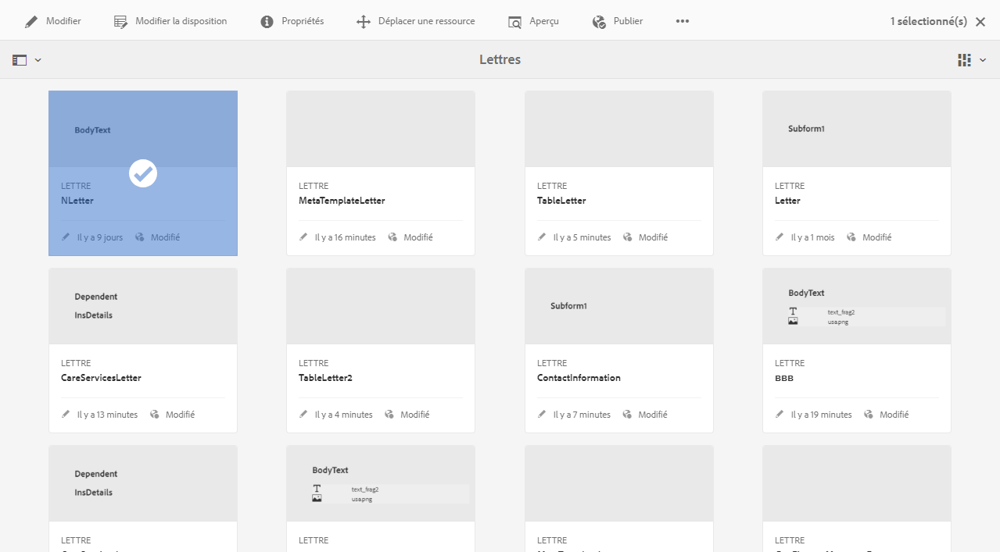

   Sélectionner une lettre

1. Pour une lettre basée sur un dictionnaire de données, sélectionnez **Prévisualisation** > **Prévisualisation**. Ou pour une lettre qui n’est pas basée sur un dictionnaire de données, sélectionnez **Aperçu**. Vous pouvez également survoler une lettre (sans la sélectionner) et appuyer sur l’icône d’aperçu de la lettre pour la prévisualiser.

   >[!NOTE]
   >
   >Si aucun dictionnaire de données n’est associé à la lettre, l’aperçu de la lettre s’affiche. Sinon, si la lettre est basée sur un dictionnaire de données, Correspondence Management affiche les options de Prévisualisation et de personnalisation dans le menu Prévisualisation et vous pouvez sélectionner l’une des deux options. Vous pouvez également associer des données de test à un dictionnaire de données. Lorsque le [dictionnaire de données est associé à des données de test](../../forms/using/data-dictionary.md#p-working-with-test-data-p), puis en sélectionnant l&#39;option de prévisualisation, la prévisualisation normale s&#39;ouvre avec les données de test renseignées.

1. Pour pouvoir générer une correspondance lors de sa prévisualisation, vous devez être administrateur ou faire partie de l’un des groupes suivants :

   * forms-users (pour prévisualiser sur instance d’auteur)
   * cm-agent-users (pour le rendu sur une instance de publication)

   Si vous ne disposez pas des autorisations requises, contactez votre administrateur pour obtenir des droits d’accès appropriés. Pour plus d&#39;informations sur la création et l&#39;ajout d&#39;utilisateurs à des groupes, voir [Ajouter des utilisateurs ou des groupes à un groupe](/help/sites-administering/security.md). Si vous essayez de générer une correspondance sans disposer des autorisations appropriées, la page d’erreur 404 s’affiche.

1. Si vous avez sélectionné **Aperçu**> **Personnalisation**, une boîte de dialogue s&#39;ouvre. Dans la boîte de dialogue, sélectionnez un fichier de données correspondant au dictionnaire de données avec lequel la lettre doit être prévisualisation, puis sélectionnez **Prévisualisation**. Un fichier de données est créé à partir d’un dictionnaire de données pour une lettre particulière. Pour plus d’informations sur le fichier de données, voir [Dictionnaire de données](../../forms/using/data-dictionary.md#p-working-with-test-data-p).

   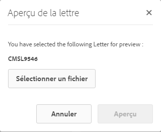

1. L’aperçu HTML de la lettre (aperçu de formulaires mobiles) s’ouvre sur l’onglet Données actif par défaut.

   Pour plus d’informations sur les formulaires mobiles et les fonctionnalités qu’ils prennent en charge, voir [Différences de fonctionnalités entre Forms mobile et les PDF forms](https://helpx.adobe.com/fr/livecycle/help/mobile-forms/feature-differentiation-mobile-forms-pdf.html).

   Il existe trois onglets : données, contenu et pièces jointes. S’il n’existe pas d’éléments de données (variables d’espace réservé et champs de mise en page), la lettre s’ouvre alors directement dans l’onglet Contenu. L’onglet de pièces jointes est disponible uniquement lorsque des pièces jointes sont présentes ou que l’accès à la bibliothèque est activé.

   >[!NOTE]
   >
   >Pour plus d’informations sur le basculement entre le mode de rendu HTML ou PDF de la prévisualisation de lettres, voir [Modifier le mode de rendu de la lettre](#changerenditionmode). Pour plus d’informations sur la prise en charge du format PDF dans Correspondence Management et AEM, voir [Arrêt des modules externes de navigateur NPAPI et son impact](https://helpx.adobe.com/fr/aem-forms/kb/discontinuation-of-npapi-plugins-impact-on-aem-forms.html) et [PDF forms vers le format Forms HTML5](https://helpx.adobe.com/fr/aem-forms/kb/pdf-forms-to-html5-forms.html).

### Saisir des données {#enterdata}

Sous l’onglet Données, renseignez les champs de mise en page et les espaces réservés disponibles.

1. Entrez les données et les variables de contenu dans les champs requis. Renseignez tous les champs obligatoires signalés par un astérisque (*) pour activer le bouton **Envoyer**.

   Appuyez sur une valeur de champ de données dans l’aperçu de lettre HTML pour mettre en surbrillance le champ de données correspondant dans l’onglet Données.

   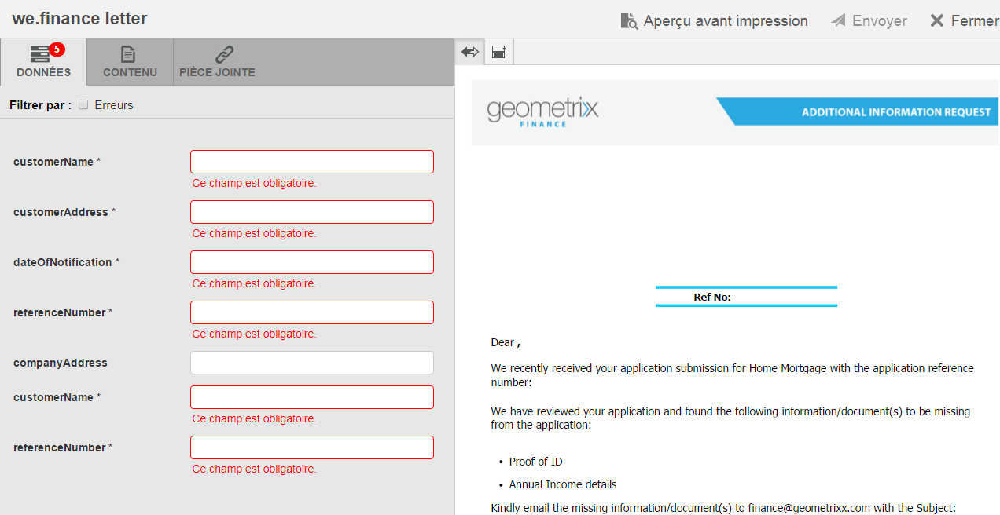 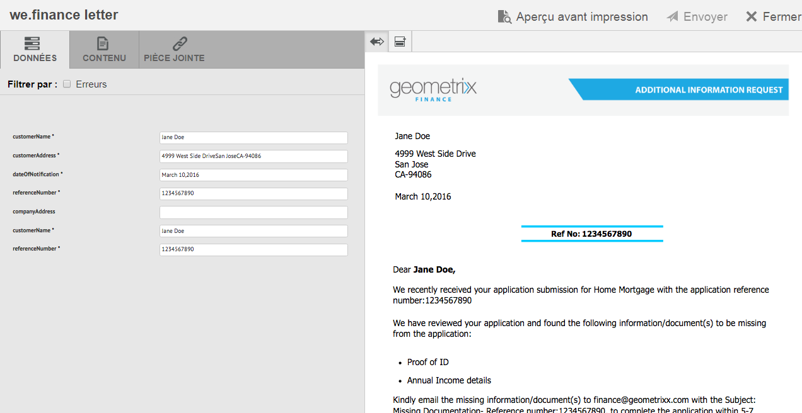

### Gérer le contenu {#managecontent}

Dans l’onglet Contenu, vous pouvez gérer du contenu tel que des fragments de documents et des variables de contenu dans la lettre.

1. Sélectionnez **Contenu**. Correspondence Management affiche l’onglet de contenu de la lettre.

   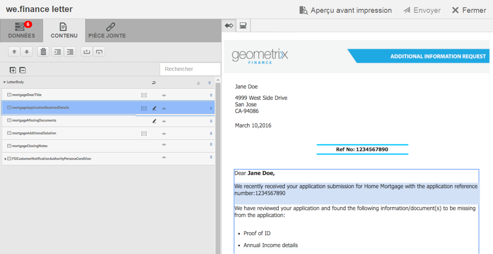

1. Modifiez les modules de contenu, selon les besoins, dans l’onglet Contenu. Pour centrer l’attention sur le module de contenu approprié dans la hiérarchie des contenus, vous pouvez appuyer sur la ligne ou le paragraphe approprié dans l’aperçu de la lettre ou appuyer sur le module de contenu directement dans la hiérarchie Contenu.

   Par exemple, la ligne « Nous avons passé en revue… » est choisie dans le graphique ci-dessous et le module de contenu approprié est choisi dans l’onglet Contenu.

   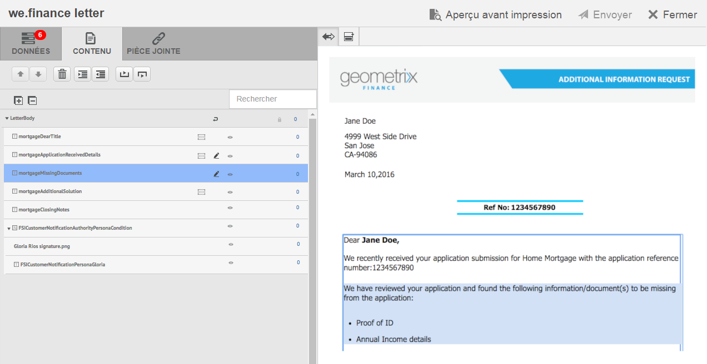

   Dans l’onglet Contenu ou Données, en appuyant sur Mettre en surbrillance les modules sélectionnés ( ) dans le coin supérieur gauche de la prévisualisation de lettre HTML, vous pouvez désactiver ou activer la fonctionnalité d’accès au module de contenu/données lorsque le texte, le paragraphe ou le champ de données approprié est sélectionné dans la prévisualisation de lettre.

   Pour plus d’informations sur les actions disponibles pour divers modules dans l’interface utilisateur de création de correspondance, voir [Actions et informations disponibles dans l’interface utilisateur de création de correspondance](#actions-and-info-available-in-the-create-correspondence-content-tab).

1. Pour localiser plusieurs modules de contenu, utilisez le champ Rechercher. Saisissez tout ou partie du nom ou titre du module de contenu pour le rechercher dans la correspondance.
1. Appuyez sur l’icône Afficher ( ) devant une liste, un texte, une condition ou une zone de cible pour l’afficher ou le masquer dans la lettre.
1. Pour modifier un module de texte modifiable ou en ligne, appuyez sur l&#39;icône **Modifier** appropriée ( ) ou cliquez sur le module de texte approprié en doublon dans la prévisualisation de lettre.

   Le système affiche un éditeur de texte pour modifier et formater le texte.

   Le vérificateur orthographique par défaut dans les vérifications orthographiques des navigateurs dans l’éditeur de texte. Pour gérer les vérifications d’orthographe et de grammaire, vous pouvez modifier les paramètres du vérificateur orthographique de votre navigateur ou installer des modules/adjonctions externes de navigateur pour vérifier l’orthographe et la grammaire.

   Vous pouvez également utiliser les divers raccourcis clavier de l’éditeur de texte pour gérer, modifier et mettre en forme du texte. Pour plus d’informations sur les raccourcis clavier [Éditeur de texte](/help/forms/using/keyboard-shortcuts.md#correspondence-management) dans Raccourcis clavier de Correspondence Management.

   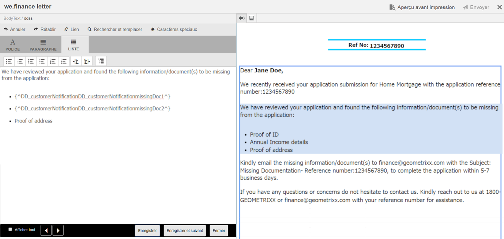

   Vous souhaiterez peut-être réutiliser un ou plusieurs paragraphes de texte existant dans une autre application de document. Vous pouvez directement copier et coller du texte, par exemple du texte issu de MS Word, de pages HTML ou de toute autre application.

   Vous pouvez copier et coller un ou plusieurs paragraphes de texte dans un module de texte modifiable. Par exemple, vous pouvez disposer d’un document MS Word contenant une liste à puces de preuves de résidence acceptables comme suit :

   

   Vous pouvez directement copier et coller le texte à partir du document MS Word vers un module de texte modifiable. La mise en forme, telle que la liste à puces, la police et la couleur du texte, est conservée dans le module de texte.

   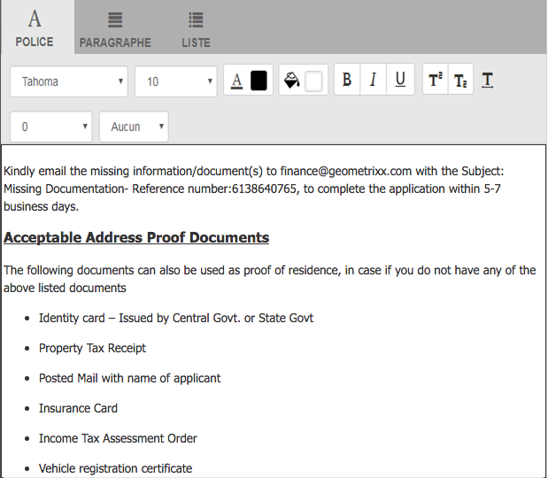

   >[!NOTE]
   >
   >Toutefois, la mise en forme du texte collé présente certaines [restrictions](https://helpx.adobe.com/aem-forms/kb/cm-copy-paste-text-limitations.html).

   Vous pouvez mettre le texte et les chiffres en retrait dans votre lettre à l’aide de la touche de tabulation. Par exemple, vous pouvez utiliser la touche de tabulation pour l’alignement de plusieurs colonnes de texte dans une liste dans un format tabulaire.

   

   Exemple : vous pouvez utiliser la touche de tabulation pour aligner plusieurs colonnes de texte sous forme de tableau.

   >[!NOTE]
   >
   >Pour plus d’informations sur la configuration de l’interlettrage pour vos modules de texte et vos lettres, voir [Plus d’informations sur l’utilisation de l’interlettrage pour organiser le texte](https://helpx.adobe.com/aem-forms/kb/cm-tab-spacing-limitations.html).

1. Si nécessaire, insérez des caractères spéciaux dans la correspondance. Vous pouvez, par exemple, utiliser la palette des caractères spéciaux pour insérer les caractères suivants :

   * Symboles de devise tels que €, ¥ et £
   * Symboles mathématiques tels que Δ, √,  et ^
   * Symboles de ponctuation tels que ‟ et&quot;

   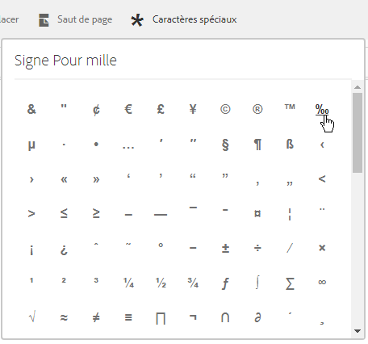

   Correspondence Management offre une prise en charge intégrée de 210 caractères spéciaux. L’administrateur peut [ajouter la prise en charge de caractères spéciaux supplémentaires/personnalisés en personnalisant](../../forms/using/custom-special-characters.md).

1. Pour mettre en surbrillance\mettre en évidence des parties de texte dans un module incorporé modifiable, sélectionnez le texte et appuyez sur Couleur de surbrillance.

   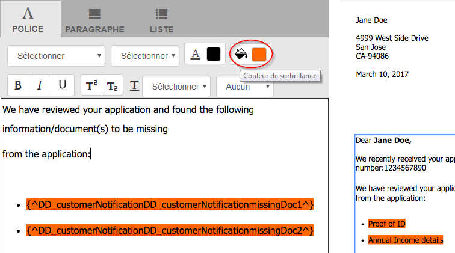

   Vous pouvez soit appuyer directement sur une couleur de base `**[A]**` présente dans la palette Couleurs de base, soit appuyer sur **Sélectionner** après avoir utilisé le curseur `**[B]**` pour choisir l’ombrage approprié de la couleur.

   Vous pouvez également accéder à l’onglet Avancé pour sélectionner la teinte, la luminosité et la saturation `**[C]**` appropriée afin de créer la couleur précise, puis appuyer sur Sélectionner `**[D]**` pour appliquer la couleur de mise en surbrillance du texte.

   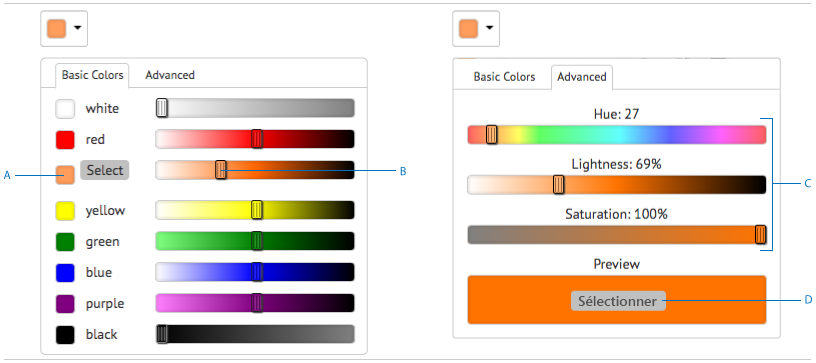

1. Apportez les modifications appropriées au contenu et au format et appuyez sur **Enregistrer**. Appuyez sur ( ) pour passer d’un module de texte modifiable à l’autre, ou appuyez sur **Enregistrer et suivant** pour enregistrer les modifications et passez au module de texte modifiable suivant.
1. Le système affiche également les variables vides pour chacune des branches. Lorsqu’il n’y a aucune variable vide, le chiffre 0 est indiqué pour les variables vides. S’il y a des variables vides, vous pouvez appuyer sur une branche pour la développer et rechercher la variable vide. Utilisez la barre d’outils de contenu pour supprimer du contenu, augmenter ou diminuer le retrait du contenu, et insérer des sauts de page avant ou après le contenu.

   Vous pouvez insérer des sauts de page au-dessus et en dessous des modules de données, même s’ils font partie de listes et de conditions.

1. Appuyez sur Ouvrir/Fermer la variable de contenu ( ) pour ouvrir les variables de contenu et les remplir correctement.
1. Lorsque vous renseignez la variable vide correctement, le nombre de variables vides est défini sur 0.

   Dans l’interface utilisateur Création de correspondance, le nombre de variables vides est affiché à chaque niveau de la hiérarchie de tout module qui contient au moins une variable. Si un module contient des variables vides, le nombre est affiché au niveau de la variable, du module, de la zone cible et du modèle de lettre.

   Le nombre de variables vides inclut :

   * Uniquement des variables du dictionnaire de données non protégées et d’espace réservé. Le nombre de variables n’inclut pas les variables de mise en page ou du dictionnaire de données protégées.
   * Champs obligatoires.
   * Champs de mise en page s’ils sont obligatoires et liés à l’utilisateur.
   * Uniquement les instances de variables uniques. Si un module, une zone de cible ou un modèle de lettre contient au moins deux instances de la même variable, le nombre affiché est 1 (un). Toutefois, pour chacune des instances, le nombre affiché est 1.

   Le nombre de variables vides ne comprend pas les modules non sélectionnés. Si un module est inclus dans un modèle de lettre, mais n’est pas dans la lettre, le nombre de variables vides de ce module n’est pas affiché.

   Pour la zone cible, le module et la variable, le nombre est affiché à droite de chaque objet dans le modèle de lettre. Cependant, pour le modèle complet, le nombre s’affiche dans la barre d’état de création de correspondance.

   Les modules d’un modèle de lettre affichent le nombre de variables vides comme décrit ci-dessous :

   * **** TexteAffiche la somme des variables d’espace réservé vides uniques et des éléments du dictionnaire de données contenus dans le module de texte.
   * **** ConditionAffiche la somme des variables de condition vides uniques contenues dans la condition et des variables contenues dans les modules résultants.
   * **** ListAffiche la somme de toutes les variables vides uniques contenues dans les modules affectés à la liste.
   * **Cible** areaAffiche la somme de toutes les variables vides uniques contenues dans les modules affectés à la cible area.

   Notez ce qui suit concernant les variables avec des valeurs par défaut :

   * Un champ de variable booléenne est défini par défaut sur *false*. Toutefois, la variable est considérée comme vide. Cela signifie que le nombre de variables inclut tous les champs de variable booléenne avec la valeur *false*.

   * Un champ de variable numérique est défini par défaut sur *0 (zéro)*. Toutefois, la variable est considérée comme vide. Cela signifie que le nombre de variables inclut tous les champs de variable numérique avec la valeur *0 (zéro)*.

#### Actions et informations disponibles dans l’onglet Contenu de la création de correspondance {#actions-and-info-available-in-the-create-correspondence-content-tab}

**Zone cible**

* Insertion d’une ligne vide : permet d’insérer une nouvelle ligne vide.
* Insertion de texte en ligne : permet d’insérer un nouveau module de texte.
* Verrouillage d’ordre (information) : indique que l’ordre du contenu ne peut pas être modifié.
* Valeurs vides (information) : indique le nombre de variables vides dans la zone cible.

**Module**

* Sélection (icône représentant un œil) : permet d’inclure ou d’exclure le module de la lettre.
* Ignorer les puces (applicable pour les modules de liste et leurs modules enfants) : ignore les puces dans un module particulier.
* Saut de page avant (applicable pour les modules enfants de la zone cible) : insère un saut de page avant le module.
* Saut de page après (applicable pour les modules enfants de la zone de cible) : Insère un saut de page avant le module.
* Valeurs vides (information) : indique le nombre de variables vides dans la zone cible.
* Modification (modules de texte uniquement) : ouvrez l’éditeur de texte enrichi pour modifier le module de texte.
* Panneau de données (modules de texte et de condition) : permet de déverrouiller toutes les variables du module.

**Module de liste**

* Insertion d’une ligne vide : permet d’insérer une nouvelle ligne vide.
* Bibliothèque de contenu : ouvre la bibliothèque de contenu pour ajouter des modules à la liste.
* Paramètre de liste (liste imbriquée uniquement) :
* Verrouillage d’ordre (information) : indique que l’ordre des éléments de la liste ne peut pas être modifié.

### Gestion des pièces jointes {#manage-attachments}

1. Sélectionnez **les pièces jointes**. Correspondence Management affiche les pièces jointes disponibles, telles qu’elles ont été configurées lors de la création du modèle de lettre.
1. Vous pouvez choisir de ne pas envoyer une pièce jointe avec la lettre en appuyant sur l’icône Afficher et en appuyant sur la croix dans la pièce jointe pour la supprimer de la lettre. Pour les pièces jointes spécifiées, lors de la création d’un modèle de lettre, comme étant obligatoires, les icônes Afficher et Supprimer sont désactivées.
1. Appuyez sur l’icône Accès à la bibliothèque ( ) pour accéder à la bibliothèque de contenu et insérer des fichiers DAM en tant que pièces jointes.

   >[!NOTE]
   >
   >L’icône d’accès à la bibliothèque n’est disponible que si l’accès à la bibliothèque a été activé lors de la création de la lettre.

1. Si l’ordre des pièces jointes n’a pas été verrouillé lors de la création de la correspondance, vous pouvez réorganiser les pièces jointes en sélectionnant une pièce jointe et en appuyant sur les flèches montantes et descendantes.

   Pour plus d’informations, consultez [Livraison des pièces jointes](#attachmentdelivery).

### Gestion du contenu dans l’aperçu et envoi de la lettre  {#manage-content-in-preview-and-submit-the-letter}

Vous pouvez effectuer des modifications relatives à la mise en page et au contenu pour vous assurer que la lettre apparaît exactement comme vous le souhaitez et l’envoyer aux différents post-processus.

1. Pour mettre en surbrillance tout le contenu modifiable de la lettre, appuyez sur **Mettre en surbrillance les sections modifiables**.

   Les contenus modifiables de la lettre sont mis en surbrillance avec un arrière-plan gris.

   

1. Modifiez les modules de contenu, selon les besoins, dans l’onglet Contenu. Pour centrer l’attention sur le module de contenu approprié dans la hiérarchie des contenus, vous pouvez appuyer sur la ligne ou le paragraphe approprié dans l’aperçu de la lettre ou appuyer sur le module de contenu directement dans la hiérarchie Contenu.

   Par exemple, la ligne « Pour accéder à… » est sélectionnée dans le graphique ci-dessous et le module de contenu correspondant est sélectionné dans l’onglet Contenu.

   En appuyant sur Mettre en surbrillance les modules sélectionnés dans le contenu ( ), vous pouvez désactiver ou activer la fonctionnalité de mise en surbrillance du module de contenu dans l’onglet Contenu lorsque le texte, le paragraphe ou le champ de données approprié est sélectionné dans la prévisualisation de lettre.

   Pour plus d’informations sur les actions disponibles pour divers modules dans l’interface utilisateur de création de correspondance, voir [Actions et informations disponibles dans l’interface utilisateur de création de correspondance](#actions-and-info-available-in-the-create-correspondence-content-tab).

1. Pour ajouter un saut de page à la lettre, appuyez à l’endroit où vous souhaitez insérer un saut de page et sélectionnez Saut de page avant ou Saut de page après ( ).

   Un espace réservé explicite de saut de page est inséré dans la lettre. Pour voir comment un saut de page explicite affecte la lettre, reportez-vous à l’aperçu PDF aplati.

   >[!NOTE]
   >
   >Les formulaires mobiles ne prenant pas en charge les sauts de page, les en-têtes et les pieds de page apparaissent qu’une seule fois. En revanche, vous pouvez définir explicitement les en-têtes et pieds de page dans la mise en page (par page) pour qu’ils s’affichent dans l’aperçu des formulaires mobiles. En outre, les pages vierges dans la lettre, le cas échéant, n’apparaissent pas dans l’aperçu de formulaires pour périphériques mobiles.

   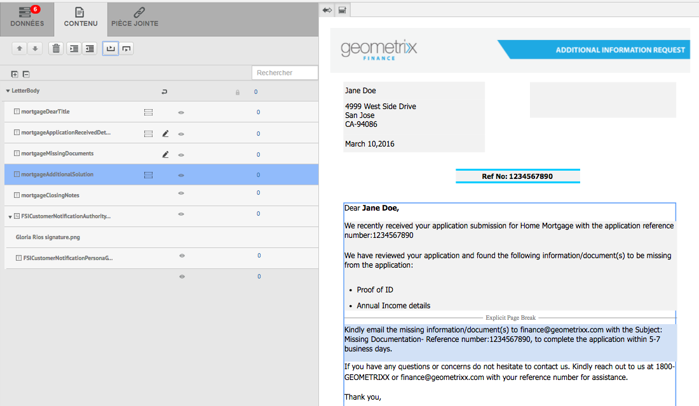

1. Pour enregistrer la lettre en tant que brouillon, que vous pouvez continuer d’utiliser ultérieurement, appuyez sur Enregistrer en tant que brouillon. Pour utiliser cette option, votre lettre doit être[ publiée](../../forms/using/publishing-unpublishing-forms.md#publishanasset). Pour plus d’informations, voir Instance Brouillon sous [Enregistrement de brouillons et envoi d’instances de lettre](#savingdrafts).

   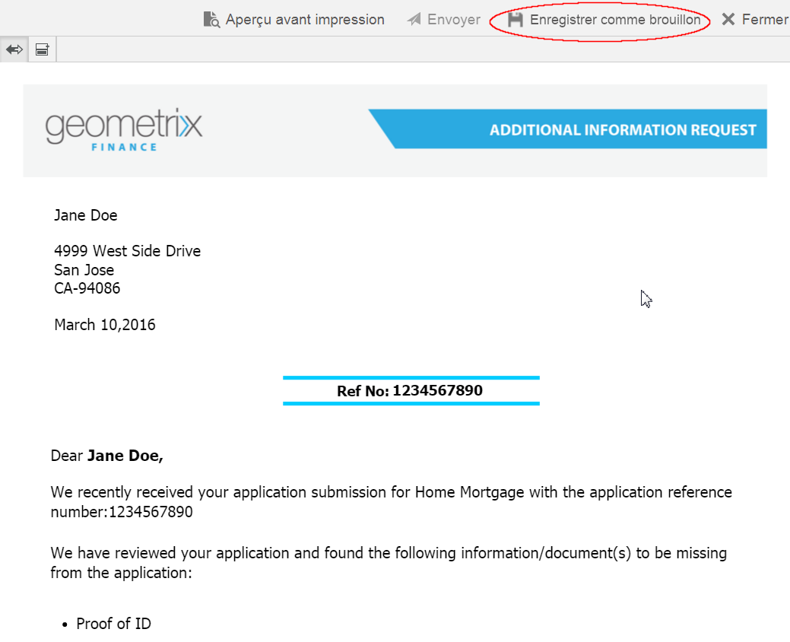

   La boîte de dialogue Nom du brouillon de la lettre s’affiche avec l’ID d’instance de lettre. Vous pouvez également modifier cet ID. Notez l’ID de lettre, puis appuyez sur **Terminer**. Vous pouvez utiliser cet ID ultérieurement pour [recharger le brouillon de la lettre](submit-letter-topostprocess.md#reloaddraft).

1. Pour prévisualisation la lettre en tant que PDF aplati avec la disposition et les sauts de page exacts tels qu’ils seront envoyés, appuyez sur la Prévisualisation ( ).

   La lettre s’affiche sous forme de fichier PDF aplati. Le fichier PDF aplati est la représentation exacte de la lettre telle qu’elle sera envoyée, avec les polices, les pauses et la mise en page appropriées de la lettre.

   >[!NOTE]
   >
   >Si vous utilisez le type de rendu Mozilla Firefox et HTML pour prévisualiser la lettre sous la forme d’un fichier PDF aplati, veillez à utiliser le module externe natif du navigateur et non le module externe d’Acrobat. Pour sélectionner le module externe natif du navigateur, accédez aux paramètres de Mozilla Firefox et, pour le type de contenu PDF, sélectionnez Aperçu dans Firefox.

1. Si la prévisualisation PDF aplatie est satisfaisante, appuyez sur **Envoyer** pour envoyer la lettre. Ou pour apporter des modifications à la lettre, appuyez sur **Prévisualisation de sortie** pour revenir à la prévisualisation de l’interface utilisateur de création de correspondance de la lettre pour apporter des modifications à la lettre. Lorsque vous appuyez sur Envoyer, si la configuration Gestion des instances de lettre est activée sur l’instance de publication, l’instance d’envoi de lettre est générée.

   Pour plus d’informations, voir Instance Brouillon sous Enregistrement de brouillons et envoi d’instances de lettre.

   Vous pouvez également enregistrer la lettre en tant que brouillon pour apporter des modifications à la lettre ultérieurement.

   Après avoir apporté les modifications requises, vous pouvez envoyer la lettre depuis l’aperçu HTML5 ou appuyez de nouveau sur Aperçu pour revoir la sortie PDF aplati.

   Pour plus d’informations sur les différences entre les formulaires HTML5 et les PDF forms, voir [Différences de caractéristiques entre les formulaires HTML5 et les PDF forms](../../forms/using/feature-differentiation-html5-forms-pdf-forms.md).

## Enregistrement des brouillons et envoi d’instances de lettre {#savingdrafts}

Lorsqu’une lettre est rendue dans l’interface utilisateur de création de correspondance, vous pouvez enregistrer la lettre comme étant en cours de consultation.

Il existe deux types d’instances de lettre pouvant être enregistrées : instance Brouillon ou instance Envoyer.

* **Instance Brouillon** : l’instance Brouillon capture l’état actuel de la lettre que vous prévisualisez. Pour enregistrer une instance Brouillon, assurez-vous d’abord que la lettre et tous les actifs auxquels la lettre fait référence sont à l’état Publié. Pour plus d’informations sur la publication d’une lettre, voir [Publication d’un actif](../../forms/using/publishing-unpublishing-forms.md#publishanasset). Vous devez publier une lettre avant de pouvoir l’enregistrer en tant que brouillon, car lorsque vous publiez une lettre, vous créez une version de la lettre, de ses actifs dépendants et de données à ce stade. La version publiée d’une lettre ne peut pas être modifiée par vous ou un autre utilisateur et peut être restaurée ultérieurement sans aucune incompatibilité inattendue à partir de la version publiée. Vous pouvez retourner à cette instance plus tard et reprendre où vous en étiez.

* **Instance Envoyer** : l’instance Envoyer capture l’état de la lettre envoyée. L’instance Envoyer stocke l’état PDF de l’instance de lettre après son post-traitement avec les données saisies par l’utilisateur dans l’interface utilisateur de création de correspondance.

Ces instances peuvent être enregistrées uniquement lorsque la lettre est en cours de consultation sur l’instance Publication. Par défaut, l’enregistrement sur les instances est désactivé. Pour activer l’enregistrement des instances de lettre, effectuez les étapes suivantes.

1. Dans AEM, ouvrez Configuration de la console Web Adobe Experience Manager pour votre serveur à l’aide de l’URL suivante : https://&lt;serveur>:&lt;port>/&lt;chemin_contexte>/system/console/configMgr
1. Recherchez **[!UICONTROL Configurations de Correspondence Management]** et cliquez dessus.
1. Cochez la configuration **[!UICONTROL Gestion des instances de lettre sur Publication]**, puis cliquez sur **[!UICONTROL Enregistrer]**.

Lorsque l’enregistrement des instances de lettre est activé, vous avez la possibilité de sélectionner l’emplacement où enregistrer les instances de lettre. Il existe deux options pour enregistrer les instances de lettre : enregistrement local ou enregistrement à distance.

### Enregistrement local {#local-save}

Les instances de lettre sont enregistrées sur l’instance de publication et répliquées de manière inversée sur l’instance d’auteur.

### Enregistrement à distance {#remote-save}

Cette option est destinée aux personnes ayant des inquiétudes quant à l’enregistrement des données utilisateur sur les instances Publication, ce qui est généralement le cas hors du pare-feu d’entreprise. Lorsque l’enregistrement à distance est activé, les instances de lettre ne sont pas enregistrées sur l’instance Publication mais sont enregistrées à distance sur l’auteur de traitement spécifié via les configurations LiveCycle Client SDK.

#### Activer l’enregistrement à distance  {#enable-remote-save}

1. Dans AEM, ouvrez Configuration de la console Web Adobe Experience Manager pour votre serveur à l’aide de l’URL suivante : `https://<server>:<port>/<contextpath>/system/console/configMgr`
1. Recherchez **[!UICONTROL Configurations de Correspondence Management]** et cliquez dessus.
1. Recherchez la configuration **[!UICONTROL Enregistrement à distance]**, cochez-la, puis cliquez sur **[!UICONTROL Enregistrer]**.

#### Spécifiez les paramètres d’auteur de traitement {#specify-processing-author-settings}

1. Dans AEM, ouvrez Configuration de la console Web Adobe Experience Manager pour votre serveur à l’aide de l’URL suivante : `https://<server>:<port>/<contextpath>/system/console/configMgr`

   

1. Sur cette page, recherchez Adobe LiveCycle Client SDK Configuration et développez-le en cliquant dessus.

1. Dans l’URL du serveur de traitement, saisissez le nom de votre serveur de LiveCycle, fournissez les informations de connexion, puis cliquez sur **Enregistrer**.

   

1. Si nécessaire, définissez le nom d’utilisateur et le mot de passe avec lesquels accéder au serveur.

#### Livraison des pièces jointes {#attachmentdelivery}

* Les pièces jointes de la lettre sont disponibles après le processus dans le PDF, qui est créé après l’envoi de la lettre.
* Si la lettre est rendue à l’aide des API côté serveur sous la forme d’un PDF, interactif ou non, alors le PDF rendu contient des pièces jointes au format PDF.
* Si un post-traitement associé à un modèle de lettre est chargé dans le cadre des opérations d’envoi ou de finalisation de correspondance à l’aide de l’interface utilisateur Création de correspondance, les pièces jointes sont transmises en tant que liste &lt;com.adobe.idp.Document> dans le paramètre AttachmentDocs.
* Les mécanismes de livraison prêts à l’emploi, tels que l’envoi par courrier électronique et l’impression, livrent les pièces jointes avec le PDF de la correspondance générée.

## Modes de rendu d’aperçu de lettre : Aperçu de formulaires pour périphériques mobiles et aperçu au format PDF  {#rendition-modes-of-letter-preview-mobile-forms-preview-and-pdf-preview}

Dans AEM Forms, la solution Correspondence Management affiche une lettre en tant que document HTML dans l’IU Création de correspondance. Toutefois, la solution Correspondence Management prend toujours en charge le retour à un aperçu au format PDF au lieu de l’aperçu HTML. Pour plus d’informations sur le basculement entre les modes d’aperçu HTML et PDF, consultez [Changement de mode de rendu de lettre](#changerenditionmode).

Vous trouverez ci-dessous les avantages et les fonctionnalités disponibles dans l’aperçu HTML et PDF.

**Avantages de l’aperçu HTML/formulaires mobile** 

* **Appuyez sur une valeur de champ de données pour mettre en surbrillance le champ de données correspondant** : dans l’interface utilisateur Création de correspondance, vous pouvez appuyer sur une valeur de champ de données de la lettre pour mettre en surbrillance le champ de données correspondant dans l’onglet Données. Pour plus d’informations, consultez [Saisir des données](#enterdata).

* **Prise en charge du navigateur** : retrait graduel de la prise en charge des navigateurs NPAPI, ce qui affecte l’aperçu PDF de la lettre. L’aperçu des formulaires mobiles/HTML d’une lettre n’est pas affecté par ce problème.
* **Mettre en surbrillance le contenu modifiable dans une lettre** : dans l’interface utilisateur Création de correspondance, vous pouvez appuyer sur Mettre en surbrillance le contenu modifiable pour mettre en surbrillance tout le contenu modifiable de la lettre en gris. Pour plus d’informations, consultez [Gestion du contenu](#managecontent).

`<li>` `<li>Benefits of HTML preview  <ul>   <li>Right to left</li>   <li>NPAPI</li>   <li>Highlight Editable Content</li>  </ul> </li>` `<li>Benefits of PDF preview  <ul>   <li>Page Break</li>   <li>Final Preview</li>  </ul> </li>`
`<li>` `<li>Benefits of HTML preview  <ul>   <li>Right to left</li>   <li>NPAPI</li>   <li>Highlight Editable Content</li>  </ul> </li>` `<li>Benefits of PDF preview  <ul>   <li>Page Break</li>   <li>Final Preview</li>  </ul> </li>`  **Avantages de l’aperçu PDF**

* **Saut de page** : dans l’aperçu au format PDF, vous pouvez afficher précisément comment les sauts de page dans la lettre affectent sa sortie.
* **Aperçu final** : dans l’aperçu au format PDF, vous pouvez afficher le formatage et l’aspect exacts de la lettre telle qu’elle apparaîtra à sa sortie.

Pour plus d’informations sur la prise en charge des scripts dans des formulaires PDF, reportez-vous à la section [Prise en charge des scripts](https://help.adobe.com/en_US/livecycle/11.0/ScriptingSupport/index.html).

Pour plus d’informations sur la prise en charge des scripts dans les formulaires HTML5, voir [Prise en charge des scripts pour les formulaires HTML5](/help/forms/using/scripting-support.md).

### Changement du mode de rendu d’une lettre {#changerenditionmode}

Par défaut, l’interface utilisateur Création de correspondance utilise des formulaires HTML ou des formulaires mobiles pour rendre l’aperçu d’une lettre. L’aperçu des formulaires mobiles n’a aucun problème de rendu dans un navigateur, car il utilise le module externe natif du navigateur et ne requiert aucun module externe supplémentaire. Vous pouvez changer le mode de prévisualisation de lettre en PDF. Toutefois, les contraintes de navigateur peuvent créer des problèmes pour les différentes fonctionnalités de l’aperçu au format PDF interactif de la lettre.

Pour plus d&#39;informations sur la compatibilité des navigateurs avec la prévisualisation de lettres, voir [Suppression des plug-ins de navigateur NPAPI et son impact](https://helpx.adobe.com/aem-forms/kb/discontinuation-of-npapi-plugins-impact-on-aem-forms.html).

Pour changer le mode d’aperçu de la lettre, effectuez les étapes suivantes :

1. Accédez à `https://[system]:'port'/system/console/configMgr` et, si nécessaire, connectez-vous en tant qu’administrateur.
1. Accédez à **[!UICONTROL Configurations de Correspondence Management]** > **[!UICONTROL Type de rendu]** et sélectionnez **Rendu HTML** (par défaut) ou **Rendu PDF**.
1. Cliquez sur **[!UICONTROL Enregistrer]**.

