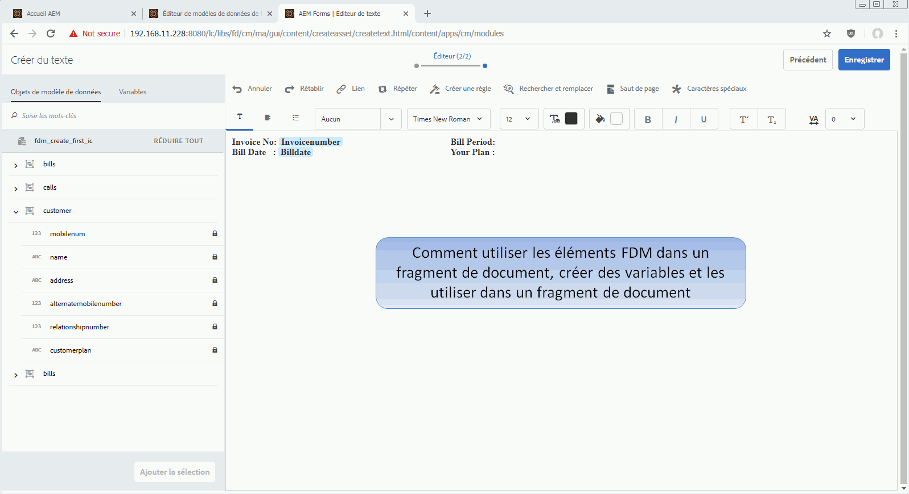

# Didacticiel : Créer des fragments de document{#tutorial-create-document-fragments}

Ce didacticiel est une étape de la série [Créer votre première série de communications interactives](/help/forms/using/create-your-first-interactive-communication.md). Il est recommandé de suivre la série dans l’ordre chronologique pour comprendre, exécuter et démontrer le cas d’utilisation complet du didacticiel.

Les fragments de document sont des composants réutilisables d’une correspondance utilisés pour composer une communication interactive. Les fragments de document sont composés des types suivants :

* Texte : un actif de texte est un élément de contenu constitué d&#39;un ou de plusieurs paragraphes de texte. Un paragraphe peut être statique ou dynamique.
* Liste - Liste est un groupe de fragments de document, y compris du texte, des listes, des conditions et des images.
* Condition : les conditions vous permettent de définir le contenu à inclure dans la communication interactive en fonction des données reçues du modèle de données de formulaire.

Ce didacticiel vous guide tout au long des étapes nécessaires pour créer plusieurs fragments de document de texte en fonction de l’anatomie fournie dans la section [Planification de la communication interactive](/help/forms/using/planning-interactive-communications.md). À la fin de ce didacticiel, vous serez capable de :

* Créer des fragments de document
* Créer des variables
* Créer et appliquer des règles

Voici la liste des fragments de document créés dans ce didacticiel :

* [Informations de facturation](../../forms/using/create-document-fragments.md#step-create-bill-details-text-document-fragment)
* [Informations sur le client](../../forms/using/create-document-fragments.md#step-create-customer-details-text-document-fragment)
* [Récapitulatif de facturation](../../forms/using/create-document-fragments.md#step-create-bill-summary-text-document-fragment)
* [Récapitulatif des frais](../../forms/using/create-document-fragments.md#step-create-summary-of-charges-text-document-fragment)

Chaque fragment de document comprend des champs avec du texte statique, des données reçues du modèle de données de formulaire et des données saisies à l’aide de l’interface utilisateur de l’agent. Tous ces champs ont été décrits dans la section [Planification de la communication interactive](/help/forms/using/planning-interactive-communications.md).

Lors de la création de fragments de document dans ce didacticiel, des variables sont créées pour les champs recevant des données à l’aide de l’interface utilisateur de l’agent.

Utilisez **FDM_Create_First_IC**, comme décrit dans la section [Créer un modèle de données de formulaire](../../forms/using/create-form-data-model0.md), comme modèle de données de formulaire pour créer des fragments de document dans ce didacticiel.

## Étape 1 : Créer un fragment de document texte contenant des informations de facturation {#step-create-bill-details-text-document-fragment}

Le fragment de document contenant des informations de facturation comprend les champs suivants :

| Champ | Source de données |
|---|---|
| N° de facture | Interface utilisateur de l’agent |
| Période de facturation | Interface utilisateur de l’agent |
| Date de facturation | Interface utilisateur de l’agent |
| Votre planification | Modèle de données de formulaire |

Exécutez les étapes suivantes pour créer des variables pour les champs avec l’interface utilisateur de l’agent en tant que source de données, créer du texte statique et utiliser des éléments de modèle de données de formulaire dans le fragment de document :

1. Sélectionnez **[!UICONTROL Formulaires]** >**[!UICONTROL Fragments de document]**.

1. Sélectionnez **Créer** > **Texte**.
1. Saisissez les informations suivantes :

   1. Saisissez **bill_details_first_ic** comme nom dans le champ **Titre**. Le titre se génère automatiquement dans le champ **Nom**.

   1. Sélectionnez un **modèle de données de formulaire** dans la section **Modèle de données**.

   1. Sélectionnez **FDM_Create_First_IC** comme modèle de données de formulaire et appuyez sur **Sélectionner**.

   1. Appuyez sur **Next** (Suivant).

1. Sélectionnez l’onglet **Variables** dans le volet gauche, puis appuyez sur **Créer**.
1. Dans la section **Créer une variable** :

   1. Saisissez **Invoicenumber** comme nom de la variable.
   1. Sélectionnez **Chaîne** comme type.
   1. Appuyez sur **Créer**.

   

   Répétez les étapes 4 et 5 pour créer les variables suivantes :

   * Billperiod : type de chaîne
   * BillDate : type de date

   

1. Créez du texte statique pour les champs suivants à l’aide du volet de droite :

   * N° de facture
   * Période de facturation
   * Date de facturation
   * Votre planification

   

1. Placez le curseur en regard du champ **N° de facture** et cliquez deux fois sur la variable **InvoiceNumber** de l’onglet **Variables** dans le volet de gauche.
1. Placez le curseur en regard du champ **Période de facturation** et cliquez sur la variable **Période d&#39;facturation** en maintenant le doublon enfoncé.
1. Placez le curseur en regard du champ **Date de facturation** et cliquez sur la variable **Date de facturation** en cliquant sur le doublon.
1. Sélectionnez l’onglet **Objets de modèle de données** dans le volet gauche.
1. Placez le curseur en regard du champ **Votre plan** et cliquez avec le doublon sur la propriété **client** > **plan client**.

   

1. Cliquez sur **Enregistrer** pour créer un fragment de document texte contenant des informations de facturation.

## Étape 2 : Créer un fragment de document texte contenant des informations personnalisées {#step-create-customer-details-text-document-fragment}

Le fragment de document contenant des informations personnalisées comprend les champs suivants :

| Champ | Source de données |
|---|---|
| Nom du client | Modèle de données de formulaire |
| Adresse | Modèle de données de formulaire |
| Lieu de livraison | Interface utilisateur de l’agent |
| Code du pays | Interface utilisateur de l’agent |
| Numéro de mobile | Modèle de données de formulaire |
| Autre numéro de téléphone | Modèle de données de formulaire |
| Numéro de relation | Modèle de données de formulaire |
| Nombre de connexions | Interface utilisateur de l’agent |

Exécutez les étapes suivantes pour créer des variables pour les champs avec l’interface utilisateur de l’agent en tant que source de données, créer du texte statique et utiliser des éléments de modèle de données de formulaire dans le fragment de document :

1. Sélectionnez **[!UICONTROL Formulaires]** >**[!UICONTROL Fragments de document]**.
1. Sélectionnez **Créer** > **Texte**.
1. Saisissez les informations suivantes :

   1. Entrez **customer_details_first_ic** comme nom dans le champ **Titre**. Le titre se génère automatiquement dans le champ **Nom**.

   1. Sélectionnez un **modèle de données de formulaire** dans la section **Modèle de données**.

   1. Sélectionnez **FDM_Create_First_IC** comme modèle de données de formulaire et appuyez sur **Sélectionner**.

   1. Appuyez sur **Next** (Suivant).

1. Sélectionnez l’onglet **Variables** dans le volet gauche, puis appuyez sur **Créer**.
1. Dans la section **Créer une variable** :

   1. Entrez **Fournit** comme nom de la variable.
   1. Sélectionnez **Chaîne** comme type.
   1. Appuyez sur **Créer**.

   Répétez les étapes 4 et 5 pour créer les variables suivantes :

   * Statecode : type de numéro
   * Numberconnections : type de numéro

1. Sélectionnez l&#39;onglet **Objets de modèle de données**, placez le curseur dans le volet de droite, puis cliquez sur la propriété **customer** > **name** en maintenant le doublon enfoncé.
1. Appuyez sur Entrée pour déplacer le curseur sur la ligne suivante et cliquez en doublon sur la propriété **customer** > **address**.
1. Créez du texte statique pour les champs suivants à l’aide du volet de droite :

   * Numéro de mobile
   * Autre numéro de téléphone
   * Lieu de livraison
   * Numéro de relation
   * Code du pays
   * Nombre de connexions

   

1. Placez le curseur en regard du champ **Numéro mobile** et cliquez sur la propriété **client** > **mobilenum** en cliquant sur le doublon.
1. Placez le curseur en regard du champ **Autre numéro de contact** et cliquez sur la propriété ** customer*** > **alternatemobilenumber** en maintenant le doublon enfoncé.
1. Placez le curseur en regard du champ **Numéro de relation** et cliquez sur la propriété **client** > **numéro de relation** en cliquant sur le doublon.
1. Sélectionnez l&#39;onglet **Variables**, placez le curseur en regard du champ **Lieu d&#39;approvisionnement** et cliquez sur la variable **Fourniture** en appuyant sur le doublon.
1. Placez le curseur en regard du champ **Code d’état** et cliquez sur la variable **Code d’état** en maintenant le doublon enfoncé.
1. Placez le curseur en regard du champ **Nombre de connexions** et cliquez sur la variable **Numberconnections** en doublon.

   

1. Cliquez sur **Enregistrer** pour créer le fragment de document de texte Détails du client.

## Étape 3 : Créer le fragment de document texte de récapitulatif de facturation {#step-create-bill-summary-text-document-fragment}

Le fragment de document de synthèse des factures comprend les champs suivants :

| Champ | Source de données |
|---|---|
| Solde précédent | Interface utilisateur de l’agent |
| Paiements | Interface utilisateur de l’agent |
| Ajustements | Interface utilisateur de l’agent |
| Facturation de la période en cours | Modèle de données de formulaire |
| Montant dû | Interface utilisateur de l’agent |
| Échéance | Interface utilisateur de l’agent |

Exécutez les étapes suivantes pour créer des variables pour les champs avec l’interface utilisateur de l’agent en tant que source de données, créer du texte statique et utiliser des éléments de modèle de données de formulaire dans le fragment de document :

1. Sélectionnez **[!UICONTROL Formulaires]** >**[!UICONTROL Fragments de document]**.
1. Sélectionnez **Créer** > **Texte**.
1. Saisissez les informations suivantes :

   1. Entrez **bill_summary_first_ic** comme nom dans le champ **Title**. Le titre se génère automatiquement dans le champ **Nom**.

   1. Sélectionnez un **modèle de données de formulaire** dans la section **Modèle de données**.

   1. Sélectionnez **FDM_Create_First_IC** comme modèle de données de formulaire et appuyez sur **Sélectionner**.

   1. Appuyez sur **Next** (Suivant).

1. Sélectionnez l’onglet **Variables** dans le volet gauche, puis appuyez sur **Créer**.
1. Dans la section **Créer une variable** :

   1. Entrez **Prééquilibre** comme nom de la variable.
   1. Sélectionnez **Numéro** comme type.
   1. Appuyez sur **Créer**.

   Répétez les étapes 4 et 5 pour créer les variables suivantes :

   * Payments : type de numéro
   * Ajustements : type de numéro
   * Amountdue : type de numéro
   * Duedate : type de date

1. Créez du texte statique pour les champs suivants à l’aide du volet de droite :

   * Solde précédent
   * Paiements
   * Ajustements
   * Facturation de la période en cours
   * Montant dû
   * Échéance
   * Les frais de retard de paiement après l’échéance sont de 20 $.

   

1. Placez le curseur en regard du champ **Solde précédent** et cliquez sur la variable **Balance précédente** en maintenant le doublon enfoncé.
1. Placez le curseur en regard du champ **Paiements** et cliquez sur la variable **Paiements** en cliquant sur le doublon.
1. Placez le curseur en regard du champ **Ajustements** et cliquez sur la variable **Ajustements** en maintenant le doublon enfoncé.
1. Placez le curseur en regard du champ **Montant dû** et cliquez sur la variable **Montant dû** en cliquant sur le doublon.
1. Placez le curseur en regard du champ **Date d’échéance** et cliquez sur la variable **Date d’échéance** avec le doublon-clic.
1. Sélectionnez l&#39;onglet **Objets de modèle de données**, placez le curseur en regard du champ **Facturer la période de facturation actuelle** dans le volet de droite, puis cliquez sur la propriété **nomenclatures** > **usagecharges** en appuyant sur le doublon.

   

1. Cliquez sur **Enregistrer** pour créer le fragment de document de texte Détails du client.

## Étape 4 : Créer le fragment de document texte de récapitulatif des frais {#step-create-summary-of-charges-text-document-fragment}

Le fragment Résumé du document des frais inclut les champs suivants :

| Champ | Source de données |
|---|---|
| Frais d’appel | Modèle de données de formulaire |
| Frais de conférence téléphonique | Modèle de données de formulaire |
| Frais de SMS | Modèle de données de formulaire |
| Frais d’Internet mobile | Modèle de données de formulaire |
| Frais d’itinérance nationale | Modèle de données de formulaire |
| Frais d’itinérance internationale | Modèle de données de formulaire |
| Frais de services à valeur ajoutée | Modèle de données de formulaire |
| Frais totaux | Modèle de données de formulaire |
| TOTAL À PAYER | Modèle de données de formulaire |

Exécutez les étapes suivantes pour créer du texte statique et utiliser des éléments de modèle de données de formulaire dans le fragment de document :

1. Sélectionnez **[!UICONTROL Formulaires]** >**[!UICONTROL Fragments de document]**.
1. Sélectionnez **Créer** > **Texte**.
1. Saisissez les informations suivantes :

   1. Entrez **summary_charges_first_ic** comme nom dans le champ **Titre**. Le titre se génère automatiquement dans le champ Nom.

   1. Sélectionnez un **modèle de données de formulaire** dans la section **Modèle de données**.

   1. Sélectionnez **FDM_Create_First_IC** comme modèle de données de formulaire et appuyez sur **Sélectionner**.

   1. Appuyez sur **Next** (Suivant).

1. Créez du texte statique pour les champs suivants à l’aide du volet de droite :

   * Frais d’appel
   * Frais de conférence téléphonique
   * Frais de SMS
   * Frais d’Internet mobile
   * Frais d’itinérance nationale
   * Frais d’itinérance internationale
   * Frais de services à valeur ajoutée
   * Frais totaux
   * TOTAL À PAYER

   

1. Sélectionnez l’onglet **Objets de modèle de données**.
1. Placez le curseur en regard du champ **Frais d’appel** et cliquez sur la propriété **nomenclatures** > **nomenclatures** en cliquant sur le doublon.
1. Placez le curseur en regard du champ **Frais d&#39;appel de conférence** et cliquez sur la propriété **factures** > **frais de convocation** en cliquant sur le doublon.
1. Placez le curseur en regard du champ **Frais de SMS** et cliquez sur la propriété **factures** > **smscharges** en doublon-clic.
1. Placez le curseur en regard du champ **Frais d&#39;Internet mobile** et cliquez sur la propriété **factures** > **internets** en cliquant sur le doublon.
1. Placez le curseur en regard du champ **Frais d’itinérance nationale** et cliquez sur la propriété **nomenclatures** > **nomenclatures nationales** en doublon-clic.
1. Placez le curseur en regard du champ **Frais d’itinérance internationale** et cliquez sur la propriété **nomenclatures** > **nomennl** en doublon-clic.
1. Placez le curseur en regard du champ **Frais de services Ajoutés de valeur** et cliquez sur la propriété **nomenclatures** > **zone** en doublon.
1. Placez le curseur en regard du champ **Total Charges** et cliquez sur la propriété **nomenclatures** > **usagecharges** en cliquant sur le doublon.
1. Placez le curseur en regard du champ **TOTAL PAYABLE** et cliquez sur la propriété **nomenclatures** > **usagecharges** en cliquant sur le doublon.

   

1. Sélectionnez le texte de la ligne **Frais de services Ajoutés** et appuyez sur **Créer une règle** pour créer une condition sur laquelle la ligne s&#39;affiche dans la communication interactive :
1. La fenêtre contextuelle **Créer une règle** s’affiche :

   1. Sélectionnez **Modèles de données et variables** puis **bills** > **callcharges**.

   1. Sélectionnez **est inférieur à** comme opérateur.
   1. Sélectionnez **Nombre** et entrez la valeur **60**.

   En fonction de cette condition, la ligne Frais de services à valeur ajoutée ne s’affiche que si la valeur du champ Frais d’appel est inférieure à 60.

   

1. Cliquez sur **Enregistrer** pour créer le fragment de document de texte Résumé des frais.
