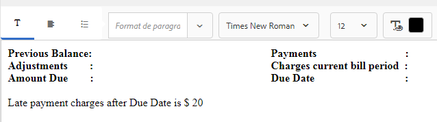

# Didacticiel : Créer des fragments de document{#tutorial-create-document-fragments}

This tutorial is a step in the [Create your first Interactive Communication](/help/forms/using/create-your-first-interactive-communication.md) series. Il est recommandé de suivre la série dans l’ordre chronologique pour comprendre, exécuter et démontrer le cas d’utilisation complet du didacticiel.

Les fragments de document sont des composants réutilisables d’une correspondance utilisés pour composer une communication interactive. Les fragments de document sont composés des types suivants :

* Texte : un actif de texte est un élément de contenu constitué d’un ou de plusieurs paragraphes de texte. Un paragraphe peut être statique ou dynamique.
*  -  est un groupe de fragments de, y compris du texte, desconditions, des conditions et des images.
* Condition : les conditions vous permettent de définir le contenu à inclure dans la communication interactive en fonction des données reçues du modèle de données de formulaire.

This tutorial walks you through the steps to create multiple text document fragments based on the anatomy provided in [Plan the Interactive Communication](/help/forms/using/planning-interactive-communications.md) section. À la fin de ce didacticiel, vous serez capable de :

* Créer des fragments de document
* Créer des variables
* Créer et appliquer des règles

Voici la liste des fragments de document créés dans ce didacticiel :

* [Informations de facturation](../../forms/using/create-document-fragments.md#step-create-bill-details-text-document-fragment)
* [Informations sur le client](../../forms/using/create-document-fragments.md#step-create-customer-details-text-document-fragment)
* [Récapitulatif de facturation](../../forms/using/create-document-fragments.md#step-create-bill-summary-text-document-fragment)
* [Récapitulatif des frais](../../forms/using/create-document-fragments.md#step-create-summary-of-charges-text-document-fragment)

Chaque fragment de document comprend des champs avec du texte statique, des données reçues du modèle de données de formulaire et des données saisies à l’aide de l’interface utilisateur de l’agent. All these fields have been depicted in the [Plan the Interactive Communication](/help/forms/using/planning-interactive-communications.md) section.

Lors de la création de fragments de document dans ce didacticiel, des variables sont créées pour les champs recevant des données à l’aide de l’interface utilisateur de l’agent.

Use **FDM_Create_First_IC**, as described in the [Create form data model](../../forms/using/create-form-data-model0.md) section, as the form data model to create document fragments in this tutorial.

## Étape 1 : Créer un fragment de document texte contenant des informations de facturation {#step-create-bill-details-text-document-fragment}

Le fragment de document contenant des informations de facturation comprend les champs suivants :

| Field (Champ) | Source de données |
|---|---|
| N° de facture | Interface utilisateur de l’agent |
| Période de facturation | Interface utilisateur de l’agent |
| Date de facturation | Interface utilisateur de l’agent |
| Votre planification | Modèle de données de formulaire |

Exécutez les étapes suivantes pour créer des variables pour les champs avec l’interface utilisateur de l’agent en tant que source de données, créer du texte statique et utiliser des éléments de modèle de données de formulaire dans le fragment de document :

1. Sélectionnez **[!UICONTROL Formulaires]** >**[!UICONTROL Fragments de document]**.

1. Sélectionnez **Créer** > **Texte**.
1. Saisissez les informations suivantes :

   1. Saisissez **bill_details_first_ic** comme nom dans le champ **Titre**. Le titre se génère automatiquement dans le champ **Nom**.

   1. Sélectionnez un **modèle de données de formulaire** dans la section **Modèle de données**.

   1. Sélectionnez **FDM_Create_First_IC** comme modèle de données de formulaire et appuyez sur **Sélectionner**.

   1. Appuyez sur **Next** (Suivant).

1. Sélectionnez l’onglet **Variables** dans le volet gauche, puis appuyez sur **Créer**.
1. Dans la section **Créer une variable** :

   1. Saisissez **Invoicenumber** comme nom de la variable.
   1. Sélectionnez **Chaîne** comme type.
   1. Appuyez sur **Create** (Créer). 
   

   Répétez les étapes 4 et 5 pour créer les variables suivantes :

   * Billperiod : type de chaîne
   * BillDate : type de date
   

1. Créez du texte statique pour les champs suivants à l’aide du volet de droite :

   * N° de facture
   * Période de facturation
   * Date de facturation
   * Votre planification
   

1. Placez le curseur en regard du champ **N° de facture** et cliquez deux fois sur la variable **InvoiceNumber** de l’onglet **Variables** dans le volet de gauche.
1. Place the cursor next to the **Bill Period** field and double-click the **Billperiod** variable.
1. Place the cursor next to the **Bill Date** field and double-click the **Bill Date** variable.
1. Sélectionnez l’onglet **Objets de modèle de données** dans le volet gauche.
1. Place the cursor next to the **Your Plan** field and double-click the **customer** > **customerplan** property.

   

1. Cliquez sur **Enregistrer** pour créer un fragment de document texte contenant des informations de facturation.

## Étape 2 : Créer un fragment de document texte contenant des informations personnalisées {#step-create-customer-details-text-document-fragment}

Le fragment de document contenant des informations personnalisées comprend les champs suivants :

| Field (Champ) | Source de données |
|---|---|
| Nom du client | Modèle de données de formulaire |
| Adresse | Modèle de données de formulaire |
| Lieu de livraison | Interface utilisateur de l’agent |
| Code du pays | Interface utilisateur de l’agent |
| Numéro de mobile | Modèle de données de formulaire |
| Autre numéro de téléphone | Modèle de données de formulaire |
| Numéro de relation | Modèle de données de formulaire |
| Nombre de connexions | Interface utilisateur de l’agent |

Exécutez les étapes suivantes pour créer des variables pour les champs avec l’interface utilisateur de l’agent en tant que source de données, créer du texte statique et utiliser des éléments de modèle de données de formulaire dans le fragment de document :

1. Sélectionnez **[!UICONTROL Formulaires]** >**[!UICONTROL Fragments de document]**.
1. Sélectionnez **Créer** > **Texte**.
1. Saisissez les informations suivantes :

   1. Enter **customer_details_first_ic** as the name in the **Title** field. Le titre se génère automatiquement dans le champ **Nom**.

   1. Sélectionnez un **modèle de données de formulaire** dans la section **Modèle de données**.

   1. Sélectionnez **FDM_Create_First_IC** comme modèle de données de formulaire et appuyez sur **Sélectionner**.

   1. Appuyez sur **Next** (Suivant).

1. Sélectionnez l’onglet **Variables** dans le volet gauche, puis appuyez sur **Créer**.
1. Dans la section **Créer une variable** :

   1. Enter **Placesupply** as the name of the variable.
   1. Sélectionnez **Chaîne** comme type.
   1. Appuyez sur **Create** (Créer). 
   Répétez les étapes 4 et 5 pour créer les variables suivantes :

   * Statecode : type de numéro
   * Numberconnections : type de numéro

1. Select the **Data Model Objects** tab, place the cursor in the right pane, and double-click the **customer** > **name** property.
1. Press Enter to move the cursor to the next line and double-click the **customer** > **address** property.
1. Créez du texte statique pour les champs suivants à l’aide du volet de droite :

   * Numéro de mobile
   * Autre numéro de téléphone
   * Lieu de livraison
   * Numéro de relation
   * Code du pays
   * Nombre de connexions
   

1. Place the cursor next to the **Mobile Number** field and double-click the **customer** > **mobilenum** property.
1. Place the cursor next to the **Alternate Contact Number** field and double-click the** customer** > **alternatemobilenumber** property.
1. Place the cursor next to the **Relationship Number** field and double-click the **customer** > **relationshipnumber** property.
1. Select the **Variables** tab, place the cursor next to the **Place of Supply** field and double-click the **Placesupply** variable.
1. Place the cursor next to the **State Code** field and double-click the **Statecode** variable.
1. Place the cursor next to the **Number of Connections** field and double-click the **Numberconnections** variable.

   

1. Click **Save** to create the Customer Details text document fragment.

## Étape 3 : Créer le fragment de document texte de récapitulatif de facturation {#step-create-bill-summary-text-document-fragment}

Le fragment de Résumé de facture comprend les champs suivants :

| Field (Champ) | Source de données |
|---|---|
| Solde précédent | Interface utilisateur de l’agent |
| Paiements | Interface utilisateur de l’agent |
| Ajustements | Interface utilisateur de l’agent |
| Facturation de la période en cours | Modèle de données de formulaire |
| Montant dû | Interface utilisateur de l’agent |
| Échéance | Interface utilisateur de l’agent |

Exécutez les étapes suivantes pour créer des variables pour les champs avec l’interface utilisateur de l’agent en tant que source de données, créer du texte statique et utiliser des éléments de modèle de données de formulaire dans le fragment de document :

1. Sélectionnez **[!UICONTROL Formulaires]** >**[!UICONTROL Fragments de document]**.
1. Sélectionnez **Créer** > **Texte**.
1. Saisissez les informations suivantes :

   1. Enter **bill_summary_first_ic** as the name in the **Title** field. Le titre se génère automatiquement dans le champ **Nom**.

   1. Sélectionnez un **modèle de données de formulaire** dans la section **Modèle de données**.

   1. Sélectionnez **FDM_Create_First_IC** comme modèle de données de formulaire et appuyez sur **Sélectionner**.

   1. Appuyez sur **Next** (Suivant).

1. Sélectionnez l’onglet **Variables** dans le volet gauche, puis appuyez sur **Créer**.
1. Dans la section **Créer une variable** :

   1. Enter **Previousbalance** as the name of the variable.
   1. Select **Number** as type.
   1. Appuyez sur **Create** (Créer). 
   Répétez les étapes 4 et 5 pour créer les variables suivantes :

   * Payments : type de numéro
   * Ajustements : type de numéro
   * Amountdue : type de numéro
   * Duedate : type de date

1. Créez du texte statique pour les champs suivants à l’aide du volet de droite :

   * Solde précédent
   * Paiements
   * Ajustements
   * Facturation de la période en cours
   * Montant dû
   * Échéance
   * Les frais de retard de paiement après l’échéance sont de 20 $.
   

1. Place the cursor next to the **Previous Balance** field and double-click the **Previousbalance** variable.
1. Place the cursor next to the **Payments** field and double-click the **Payments** variable.
1. Place the cursor next to the **Adjustments** field and double-click the **Adjustments** variable.
1. Place the cursor next to the **Amount Due** field and double-click the **Amountdue** variable.
1. Place the cursor next to the **Due Date** field and double-click the **Duedate** variable.
1. Select the **Data Model Objects** tab, place the cursor next to the **Charges current bill period** field in the right pane, and double-click the **bills** > **usagecharges** property.

   

1. Click **Save** to create the Customer Details text document fragment.

## Étape 4 : Créer le fragment de document texte de récapitulatif des frais {#step-create-summary-of-charges-text-document-fragment}

Le fragment Résumé des frais  inclut les champs suivants :

| Field (Champ) | Source de données |
|---|---|
| Frais d’appel | Modèle de données de formulaire |
| Frais de conférence téléphonique | Modèle de données de formulaire |
| Frais de SMS | Modèle de données de formulaire |
| Frais d’Internet mobile | Modèle de données de formulaire |
| Frais d’itinérance nationale | Modèle de données de formulaire |
| Frais d’itinérance internationale | Modèle de données de formulaire |
| Frais de services à valeur ajoutée | Modèle de données de formulaire |
| Frais totaux | Modèle de données de formulaire |
| TOTAL À PAYER | Modèle de données de formulaire |

Exécutez les étapes suivantes pour créer du texte statique et utiliser des éléments de modèle de données de formulaire dans le fragment de document :

1. Sélectionnez **[!UICONTROL Formulaires]** >**[!UICONTROL Fragments de document]**.
1. Sélectionnez **Créer** > **Texte**.
1. Saisissez les informations suivantes :

   1. Enter **summary_charges_first_ic** as the name in the **Title** field. Le titre se génère automatiquement dans le champ Nom.

   1. Sélectionnez un **modèle de données de formulaire** dans la section **Modèle de données**.

   1. Sélectionnez **FDM_Create_First_IC** comme modèle de données de formulaire et appuyez sur **Sélectionner**.

   1. Appuyez sur **Next** (Suivant).

1. Créez du texte statique pour les champs suivants à l’aide du volet de droite :

   * Frais d’appel
   * Frais de conférence téléphonique
   * Frais de SMS
   * Frais d’Internet mobile
   * Frais d’itinérance nationale
   * Frais d’itinérance internationale
   * Frais de services à valeur ajoutée
   * Frais totaux
   * TOTAL À PAYER
   

1. Sélectionnez l’onglet **Objets de modèle de données**.
1. Place the cursor next to the **Call Charges** field and double-click the **bills** > **callcharges** property.
1. Place the cursor next to the **Conference Call Charges** field and double-click the **bills** > **confcallcharges** property.
1. Place the cursor next to the **SMS Charges** field and double-click the **bills** > **smscharges** property.
1. Place the cursor next to the **Mobile Internet Charges** field and double-click the **bills** > **internetcharges** property.
1. Place the cursor next to the **National Roaming Charges** field and double-click the **bills** > **roamingnational** property.
1. Place the cursor next to the **International Roaming Charges** field and double-click the **bills** > **roamingintnl** property.
1. Place the cursor next to the **Value Added Services Charges** field and double-click the **bills** > **vas** property.
1. Place the cursor next to the **Total Charges** field and double-click the **bills** > **usagecharges** property.
1. Place the cursor next to the **TOTAL PAYABLE** field and double-click the **bills** > **usagecharges** property.

   

1. Select the text in the **Value Added Services Charges** row and tap **Create Rule** to create a condition based on which the row is displayed in the Interactive Communication:
1. La fenêtre contextuelle **Créer une règle** s’affiche :

   1. Sélectionnez **Modèles de données et variables** puis **bills** > **callcharges**.

   1. Sélectionnez **est inférieur à** comme opérateur.
   1. Sélectionnez **Nombre** et entrez la valeur **60**.
   En fonction de cette condition, la ligne Frais de services à valeur ajoutée ne s’affiche que si la valeur du champ Frais d’appel est inférieure à 60.

   

1. Click **Save** to create the Summary of charges text document fragment.
