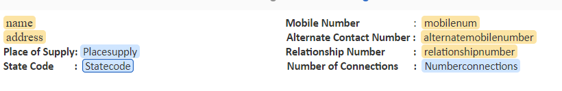

# Didacticiel : Créer des fragments de document{#tutorial-create-document-fragments}

Ce tutoriel fait partie de la série [Création de votre première communication interactive](/help/forms/using/create-your-first-interactive-communication.md). Adobe recommande de suivre la série dans l’ordre chronologique pour comprendre, exécuter et montrer le cas d’utilisation complet du tutoriel.

Les fragments de document sont des composants réutilisables d’une correspondance qui sont utilisés pour composer une communication interactive. Les fragments de document sont composés des types suivants :

* Texte : une ressource texte est un élément de contenu comprenant un ou plusieurs paragraphes de texte. Un paragraphe peut être statique ou dynamique.
* Liste : la liste est un groupe de fragments du document, incluant du texte, des listes, des conditions et des images.
* Condition : les conditions vous permettent de définir le contenu à inclure dans la communication interactive en fonction des données reçues du formulaire de modèle de données.

Ce tutoriel vous guide à travers les étapes pour créer plusieurs fragments de document de texte en fonction de la structure fournie à la section [Planifier la communication interactive](/help/forms/using/planning-interactive-communications.md). À la fin de ce tutoriel, vous devriez pouvoir effectuer les opérations suivantes :

* Créer des fragments de document
* Créer des variables
* Créer et appliquer des règles

Voici la liste des fragments de document créés dans ce didacticiel :

* [Informations de facturation](../../forms/using/create-document-fragments.md#step-create-bill-details-text-document-fragment)
* [Informations sur le client](../../forms/using/create-document-fragments.md#step-create-customer-details-text-document-fragment)
* [Récapitulatif de facturation](../../forms/using/create-document-fragments.md#step-create-bill-summary-text-document-fragment)
* [Récapitulatif des frais](../../forms/using/create-document-fragments.md#step-create-summary-of-charges-text-document-fragment)

Chaque fragment de document comprend des champs avec du texte statique, des données reçues du modèle de données de formulaire et des données saisies à l’aide de l’interface utilisateur de l’agent. Tous ces champs ont été décrits dans la section [Planifier la communication interactive](/help/forms/using/planning-interactive-communications.md).

Lors de la création de fragments de document dans ce didacticiel, des variables sont créées pour les champs recevant des données à l’aide de l’interface utilisateur de l’agent.

Utilisez **FDM_Create_First_IC** comme décrit dans la section [Créer un modèle de données de formulaire](../../forms/using/create-form-data-model0.md), comme le modèle de données de formulaire pour créer des fragments de document dans ce tutoriel.

## Étape 1 : Créer le fragment de document texte de récapitulatif de facturation {#step-create-bill-details-text-document-fragment}

Le fragment de document de récapitulatif de facturation comprend les champs suivants :

| Champ | Source de données |
|---|---|
| N° de facture | Interface utilisateur de l’agent |
| Période de facturation | Interface utilisateur de l’agent |
| Date de facturation | Interface utilisateur de l’agent |
| Votre plan | Modèle de données de formulaire |

Pour créer des variables pour les champs dont la source de données est l’interface utilisateur de l’agent, créer du texte statique et utiliser des éléments de modèle de données de formulaire dans le fragment de document, procédez comme suit :

1. Sélectionnez **[!UICONTROL Formulaires]** > **[!UICONTROL Fragments de document]**.

1. Sélectionnez **Créer** > **Texte**.
1. Saisissez les informations suivantes :

   1. Saisissez **bill_details_first_ic** comme nom dans le champ **Titre**. Le titre est automatiquement renseigné dans le champ **Nom**.

   1. Sélectionnez **modèle de données de formulaire** dans la section **Modèle de données**.

   1. Sélectionnez **FDM_Create_First_IC** comme modèle de données de formulaire et choisissez **Sélectionner**.

   1. Sélectionnez **Suivant**.

1. Sélectionnez l’onglet **Variables** dans le volet gauche, puis sélectionnez **Créer**.
1. Dans la section **Créer une variable** :

   1. Saisissez **Invoicenumber** comme nom de la variable.
   1. Sélectionnez **Chaîne** comme type.
   1. Sélectionnez **Créer**.

   

   Répétez les étapes 4 et 5 pour créer les variables suivantes :

   * Billperiod : type de chaîne
   * BillDate : type de date

   

1. Créez du texte statique pour les champs suivants à l’aide du volet de droite :

   * N° de facture
   * Période de facturation
   * Date de facturation
   * Votre plan

   

1. Placez le curseur en regard du champ **N° de facture** et cliquez deux fois sur la variable **InvoiceNumber** de l’onglet **Variables** dans le volet de gauche.
1. Placez le curseur en regard du champ **Période de facturation**, puis double-cliquez sur la variable **Billperiod**.
1. Placez le curseur en regard du champ **Date de facturation**, puis double-cliquez sur la variable **Bill Date**.
1. Sélectionnez l’onglet **Objets de modèle de données** dans le volet gauche.
1. Placez le curseur en regard du champ **Votre planification**, puis double-cliquez sur la propriété **customer** > **customerplan**.

   

1. Cliquez sur **Enregistrer** pour créer un fragment de document texte contenant des informations de facturation.

## Étape 2 : créer un fragment de document texte contenant des coordonnées clientes {#step-create-customer-details-text-document-fragment}

Le fragment de document contenant des coordonnées clientes comprend les champs suivants :

| Champ | Source de données |
|---|---|
| Nom de la cliente/du client | Modèle de données de formulaire |
| Adresse | Modèle de données de formulaire |
| Lieu de livraison | Interface utilisateur de l’agent |
| Code du pays | Interface utilisateur de l’agent |
| Numéro de mobile | Modèle de données de formulaire |
| Autre numéro de téléphone | Modèle de données de formulaire |
| Nombre de relations | Modèle de données de formulaire |
| Nombre de connexions | Interface utilisateur de l’agent |

Pour créer des variables pour les champs dont la source de données est l’interface utilisateur de l’agent, créer du texte statique et utiliser des éléments de modèle de données de formulaire dans le fragment de document, procédez comme suit :

1. Sélectionnez **[!UICONTROL Formulaires]** > **[!UICONTROL Fragments de document]**.
1. Sélectionnez **Créer** > **Texte**.
1. Saisissez les informations suivantes :

   1. Saisissez **customer_details_first_ic** comme nom dans le champ **Titre**. Le titre se remplit automatiquement dans le champ **Nom**.

   1. Sélectionnez **modèle de données de formulaire** dans la section **Modèle de données**.

   1. Sélectionnez **FDM_Create_First_IC** comme modèle de données de formulaire et choisissez **Sélectionner**.

   1. Sélectionnez **Suivant**.

1. Sélectionnez l’onglet **Variables** dans le volet gauche, puis sélectionnez **Créer**.
1. Dans la section **Créer une variable** :

   1. Saisissez **Placesupply** comme nom de la variable.
   1. Sélectionnez **Chaîne** comme type.
   1. Sélectionnez **Créer**.

   Répétez les étapes 4 et 5 pour créer les variables suivantes :

   * Statecode : type de numéro
   * Numberconnections : type de numéro

1. Sélectionnez l’onglet **Objets de modèle de données**, placez le curseur dans le volet de droite, double-cliquez sur la propriété **client** > **name**.
1. Cliquez sur Entrée pour déplacer le curseur sur la ligne suivante et double-cliquez sur la propriété **client** > **address**.
1. Créez du texte statique pour les champs suivants à l’aide du volet de droite :

   * Numéro de mobile
   * Autre numéro de téléphone
   * Lieu de livraison
   * Nombre de relations
   * Code du pays
   * Nombre de connexions

   

1. Placez le curseur en regard du champ **Numéro de mobile** et double-cliquez sur la propriété **client** > **mobilenum**.
1. Placez le curseur en regard du champ **Autre numéro de téléphone** et double-cliquez sur la propriété client > **alternatemobilenumber**.
1. Placez le curseur en regard du champ **Numéro de relation** et double-cliquez sur la propriété **client** > **relationshipnumber**.
1. Sélectionnez l’onglet **Variables**, placez le curseur en regard du champ **Lieu des prestations** et double-cliquez sur la variable **Placesupply**.
1. Placez le curseur en regard du champ **Code du pays** et double-cliquez sur la variable **Statecode**.
1. Placez le curseur en regard du champ **Nombre de connexions** et double-cliquez sur la variable **Numberconnections**.

   

1. Cliquez sur **Enregistrer** pour créer un fragment de document texte contenant les coordonnées clientes.

## Étape 3 : créer le fragment de document texte de récapitulatif de facturation {#step-create-bill-summary-text-document-fragment}

Le fragment de document de récapitulatif de facturation comprend les champs suivants :

| Champ | Source de données |
|---|---|
| Solde précédent | Interface utilisateur de l’agent |
| Paiements | Interface utilisateur de l’agent |
| Ajustements | Interface utilisateur de l’agent |
| Facturation de la période en cours | Modèle de données de formulaire |
| Montant dû | Interface utilisateur de l’agent |
| Échéance | Interface utilisateur de l’agent |

Pour créer des variables pour les champs dont la source de données est l’interface utilisateur de l’agent, créer du texte statique et utiliser des éléments de modèle de données de formulaire dans le fragment de document, procédez comme suit :

1. Sélectionnez **[!UICONTROL Formulaires]** > **[!UICONTROL Fragments de document]**.
1. Sélectionnez **Créer** > **Texte**.
1. Saisissez les informations suivantes :

   1. Saisissez **bill_summary_first_ic** comme nom dans le champ **Titre**. Le titre se remplit automatiquement dans le champ **Nom**.

   1. Sélectionnez **modèle de données de formulaire** dans la section **Modèle de données**.

   1. Sélectionnez **FDM_Create_First_IC** comme modèle de données de formulaire et choisissez **Sélectionner**.

   1. Sélectionnez **Suivant**.

1. Sélectionnez l’onglet **Variables** dans le volet gauche, puis sélectionnez **Créer**.
1. Dans la section **Créer une variable** :

   1. Saisissez **Previousbalance** comme nom de la variable.
   1. Sélectionnez **Numéro** comme type.
   1. Sélectionnez **Créer**.

   Répétez les étapes 4 et 5 pour créer les variables suivantes :

   * Payments : type de numéro
   * Ajustements : type de numéro
   * Amountdue : type de numéro
   * Duedate : type de date

1. Créez du texte statique pour les champs suivants à l’aide du volet de droite :

   * Solde précédent
   * Paiements
   * Ajustements
   * Facturation de la période en cours
   * Montant dû
   * Échéance
   * Les frais de retard de paiement après l’échéance sont de 20 $.

   

1. Placez le curseur en regard du champ **Solde précédent** et double-cliquez sur la variable **Previousbalance**.
1. Placez le curseur en regard du champ **Paiements** et double-cliquez sur la variable **Payments**.
1. Placez le curseur en regard du champ **Réglages** et double-cliquez sur la variable **Adjustments**.
1. Placez le curseur en regard du champ **Montant dû** et double-cliquez sur la variable **Amountdue**.
1. Placez le curseur en regard du champ **Date d’échéance** et double-cliquez sur la variable **Duedate**.
1. Sélectionnez l’onglet **Objets de modèle de données**, placez le curseur en regard du champ **Facturation de la période en cours** dans le volet de droite, puis double-cliquez sur la propriété **factures** > **usagecharges**.

   

1. Cliquez sur **Enregistrer** pour créer un fragment de document texte contenant les coordonnées clientes.

## Étape 4 : créer le fragment de document texte de récapitulatif des frais {#step-create-summary-of-charges-text-document-fragment}

Le fragment de document récapitulatif des frais comprend les champs suivants :

| Champ | Source de données |
|---|---|
| Frais d’appel | Modèle de données de formulaire |
| Frais de conférence téléphonique | Modèle de données de formulaire |
| Frais de SMS | Modèle de données de formulaire |
| Frais d’Internet mobile | Modèle de données de formulaire |
| Frais d’itinérance nationale | Modèle de données de formulaire |
| Frais d’itinérance internationale | Modèle de données de formulaire |
| Frais de services à valeur ajoutée | Modèle de données de formulaire |
| Frais totaux | Modèle de données de formulaire |
| TOTAL À PAYER | Modèle de données de formulaire |

Pour créer du texte statique et utiliser des éléments de modèle de données de formulaire dans le fragment de document, procédez comme suit :

1. Sélectionnez **[!UICONTROL Formulaires]** > **[!UICONTROL Fragments de document]**.
1. Sélectionnez **Créer** > **Texte**.
1. Saisissez les informations suivantes :

   1. Saisissez **summary_charges_first_ic** comme nom dans le champ **Titre**. Le titre se génère automatiquement dans le champ Nom.

   1. Sélectionnez un **modèle de données de formulaire** dans la section **Modèle de données**.

   1. Sélectionnez **FDM_Create_First_IC** comme modèle de données de formulaire et choisissez **Sélectionner**.

   1. Sélectionnez **Suivant**.

1. Créez du texte statique pour les champs suivants à l’aide du volet de droite :

   * Frais d’appel
   * Frais de conférence téléphonique
   * Frais de SMS
   * Frais d’Internet mobile
   * Frais d’itinérance nationale
   * Frais d’itinérance internationale
   * Frais de services à valeur ajoutée
   * Frais totaux
   * TOTAL À PAYER

   

1. Sélectionnez l’onglet **Objets de modèle de données**.
1. Placez le curseur en regard du champ **Frais d’appel** et double-cliquez sur la propriété **factures** > **callcharges**.
1. Placez le curseur en regard du champ **Frais de conférence téléphonique** et double-cliquez sur la propriété **factures** > **confcallcharges**.
1. Placez le curseur en regard du champ **Frais de SMS** et double-cliquez sur la propriété **factures** > **smscharges**.
1. Placez le curseur en regard du champ **Frais d’Internet mobile** et double-cliquez sur la propriété **factures** > **internetcharges**.
1. Placez le curseur en regard du champ **Frais d’itinérance nationale** et double-cliquez sur la propriété **factures** > **roamingnational**.
1. Placez le curseur en regard du champ **Frais d’itinérance internationale** et double-cliquez sur la propriété **factures** > **roamingintnl**.
1. Placez le curseur en regard du champ **Services à valeur ajoutée** et double-cliquez sur la propriété **factures** > **vas**.
1. Placez le curseur en regard du champ **Frais totaux** et double-cliquez sur la propriété **factures** > **usagecharges**.
1. Placez le curseur en regard du champ **TOTAL À PAYER** et double-cliquez sur la propriété **factures** > **usagecharges**.

   

1. Sélectionnez le texte dans la ligne **Frais de services à valeur ajoutée** et sélectionnez **Créer une règle** afin de créer une condition basée sur la ligne affichée dans la communication interactive :
1. Dans la fenêtre contextuelle **Créer une règle** :

   1. Sélectionnez **Modèles et variables de données** puis **bills** > **callcharges**.

   1. Sélectionnez **est inférieur à** comme opérateur.
   1. Sélectionnez **Nombre** et entrez la valeur **60**.

   Selon cette condition, la ligne Frais de services à valeur ajoutée ne s’affiche que si la valeur du champ Frais d’appel est inférieure à 60.

   

1. Cliquez sur **Enregistrer** pour créer un fragment de document texte de récapitulatif des frais.
