# Didacticiel : créer un modèle de données de formulaire {#tutorial-create-form-data-model}

Ce didacticiel est une étape de la série [Création de votre premier formulaire adaptatif](../../forms/using/create-your-first-adaptive-form.md). Il est recommandé de suivre la série dans l’ordre chronologique pour comprendre, exécuter et démontrer le cas d’utilisation complet du didacticiel.

## À propos du didacticiel {#about-the-tutorial}

Le module d’intégration des données AEM Forms vous permet de créer un modèle de données de formulaire à partir de sources de données principales disparates, telles que les  d’utilisateurs AEM, les services Web RESTful, les services Web SOAP, les services OData et les bases de données relationnelles. Vous pouvez configurer des objets et des services de modèle de données dans un modèle de données de formulaire et les associer à un formulaire adaptatif. Les champs de formulaire adaptatif sont liés aux propriétés de l’objet du modèle de données. Les services vous permettent de préremplir le formulaire adaptatif et d’écrire les données de formulaire soumises dans l’objet de modèle de données.

Pour plus d’informations sur l’intégration des données de formulaire et sur le modèle de données du formulaire, voir [Intégration de données AEM Forms](../../forms/using/data-integration.md).

Ce didacticiel vous décrit étape par étape le processus de préparation, création, configuration et association d’un modèle de données de formulaire avec un formulaire adaptatif. À la fin de ce didacticiel, vous serez capable de :

* [Configurer la base de données MySQL comme source de données](#config-database)
* [Créer un modèle de données de formulaire à l’aide de la base de données MySQL](#create-fdm)
* [Configurer un modèle de données de formulaire](#config-fdm)
* [Tester le modèle de données de formulaire](#test-fdm)

Le modèle de données de formulaire se présentera comme ceci :

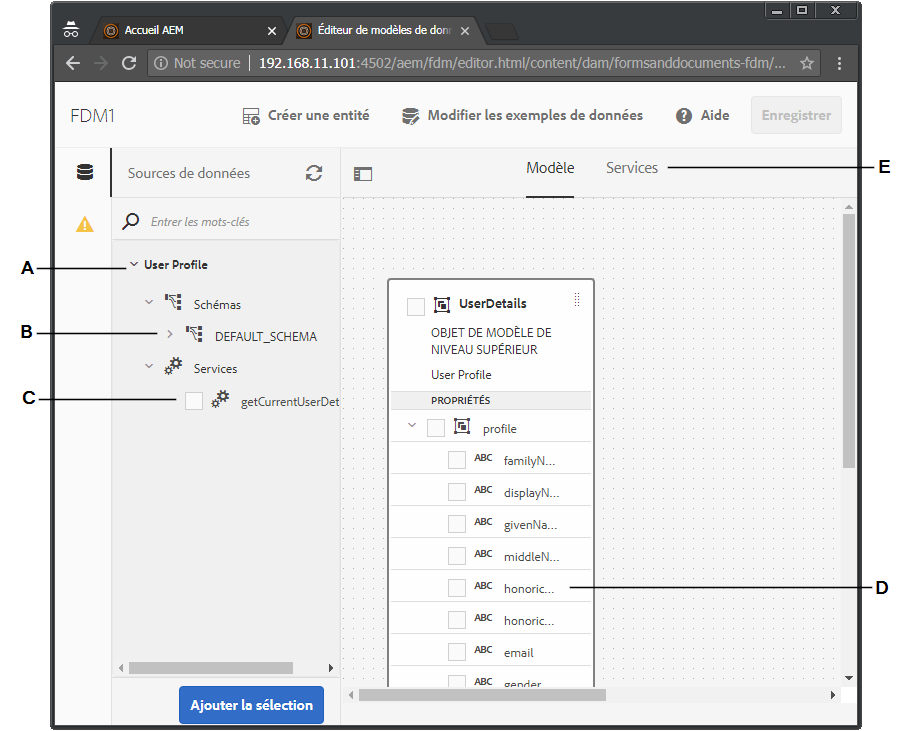

**A.** Sources de données configurées **B.** de source de données  **C.** Services disponibles **D.** Objets de modèle de données **E.** Services configurés

## Conditions préalables {#prerequisites}

Avant de commencer, vérifiez que vous disposez des éléments suivants :

* Base de données MySQL avec des exemples de données comme indiqué dans la section Conditions préalables de [Création de votre premier formulaire adaptatif](../../forms/using/create-your-first-adaptive-form.md)
* OSGi bundle for MySQL JDBC driver as explained in [Bundling the JDBC Database Driver](/help/sites-developing/jdbc.md#bundling-the-jdbc-database-driver)
* Adaptive form as explained in the first tutorial [Create an adaptive form](/help/forms/using/create-adaptive-form.md)

## Étape 1 : Configurer la base de données MySQL comme source de données {#config-database}

Vous pouvez configurer différents types de sources de données pour créer un modèle de données de formulaire. Pour ce didacticiel, nous allons configurer la base de données MySQL que vous avez configurée et remplie avec des exemples de données. Pour plus d’informations sur les autres sources de données prises en charge et sur leur configuration, reportez-vous à la section [Intégration de données AEM Forms](../../forms/using/data-integration.md).

Procédez comme suit pour configurer votre base de données MySQL :

1. Installez le pilote JDBC pour la base de données MySQL en tant que lot OSGi :

   1. Connectez-vous à l’instance d’auteur AEM Forms en tant qu’administrateur et accédez aux bundles de la console web d’AEM. The default URL is [https://localhost:4502/system/console/bundles](https://localhost:4502/system/console/bundles).

   1. Tap **Install/Update**. Une boîte de dialogue **Télécharger/installer les bundles** s’affiche.

   1. Appuyez sur **Choisir un fichier** pour rechercher et sélectionner le bundle OSGi du pilote JDBC MySQL. Select **Start Bundle** and **Refresh Packages**, and tap **Install or Update**. Assurez-vous que le pilote JDBC d’Oracle Corporation pour MySQL est actif. Le pilote est installé.

1. Configurer la base de données MySQL comme source de données :

   1. Go to AEM web console at [https://localhost:4502/system/console/configMgr](https://localhost:4502/system/console/configMgr).
   1. Recherchez la configuration **Apache Sling Connection Pooled DataSource**. Appuyez pour ouvrir la configuration en mode édition.
   1. Dans la boîte de dialogue de configuration, indiquez ce qui suit :

      * **Nom de la source de données :** vous pouvez spécifier un nom. Spécifiez par exemple **WeRetailMySQL**.
      * **Nom de la propriété de service de source de données** : spécifiez le nom de la propriété de service contenant le nom de la source de données. Il est spécifié lors de l’enregistrement de l’instance de source de données en tant que service OSGi. Par exemple, **datasource.name**.
      * **Classe de pilote JDBC** : spécifiez le nom de la classe Java du pilote JDBC. Pour la base de données MySQL, spécifiez **com.mysql.jdbc.Driver**.
      * **URI de connexion JDBC** : spécifiez l’URL de connexion de la base de données. Pour la base de données MySQL s’exécutant sur le port 3306 et le  Web, l’URL est : `jdbc:mysql://'server':3306/weretail?autoReconnect=true&useUnicode=true&characterEncoding=utf-8`
      * **Nom d’utilisateur :** nom d’utilisateur de la base de données. Il est nécessaire d’activer le pilote JDBC pour établir une connexion avec la base de données.
      * **Mot de passe :** mot de passe de la base de données. Il est nécessaire d’activer le pilote JDBC pour établir une connexion avec la base de données.
      * **Test lors de l’emprunt :** activez l’option **Test lors de l’emprunt.**
      * **Test lors du renvoi :** activez l’option **Test lors du renvoi.**
      * **Requête de validation :** spécifiez une requête SQL SELECT pour valider les connexions du pool. La requête doit renvoyer au moins une ligne. Par exemple, **sélectionnez * depuis customerdetails**.
      * **Isolation de transaction** : définissez la valeur sur **READ_COMMITTED**.
      Leave other properties with default [values](https://tomcat.apache.org/tomcat-7.0-doc/jdbc-pool.html) and tap **Save**.
   Une configuration similaire à la suivante est créée.

   

## Étape 2 : Créer un modèle de données de formulaire {#create-fdm}

AEM Forms provides an intuitive user interface to [create a form data model](data-integration.md) from configured data sources. Vous pouvez utiliser plusieurs sources de données dans un modèle de données de formulaire. Dans notre cas d’utilisation, nous utiliserons la source de données MySQL configurée.

Procédez comme suit pour créer un modèle de données de formulaire :

1. Dans l’instance d’auteur AEM, accédez à **Forms** (Formulaires) > **Data Integrations** (Intégrations de données).
1. Appuyez sur **Create** (Créer) > **Form Data Model** (Modèle de données de formulaire).
1. Dans la boîte de dialogue Créer un modèle de données de formulaire, spécifiez un **nom** pour le modèle de données de formulaire. Par exemple, **customer-shipping-billing-details**. Appuyez sur **Next** (Suivant).
1. L’écran Sélectionner la source de données répertorie toutes les sources de données configurées. Select **WeRetailMySQL** data source and tap **Create**.

   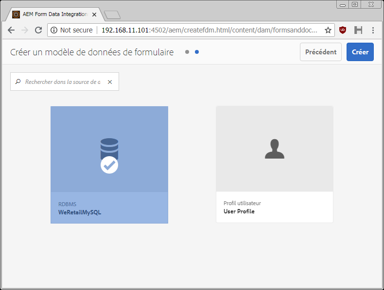

The **customer-shipping-billing-details** form data model is created.

## Étape 3 : Configurer un modèle de données de formulaire {#config-fdm}

La configuration d’un modèle de données de formulaire comprend :

* L’ajout d’objets et de services de modèle de données
* La configuration des services de lecture et d’écriture pour les objets de modèle de données

Procédez comme suit pour configurer le modèle de données de formulaire :

1. On AEM author instance, navigate to **Forms** > **Data Integrations**. The default URL is [https://localhost:4502/aem/forms.html/content/dam/formsanddocuments-fdm](https://localhost:4502/aem/forms.html/content/dam/formsanddocuments-fdm).
1. The **customer-shipping-billing-details** form data model you created earlier is listed here. Ouvrez-le en mode d’édition.

   La source de données sélectionnée **WeRetailMySQL** est configurée dans le modèle de données de formulaire.

   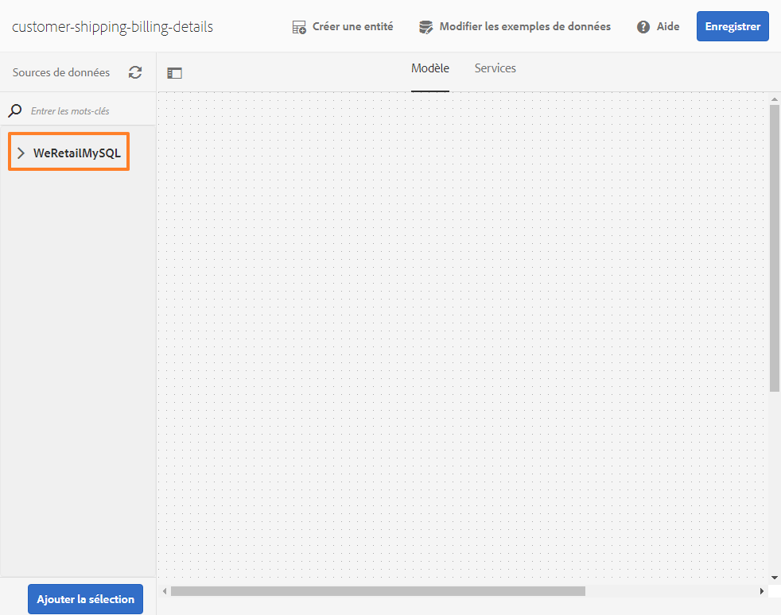

1. Développez l’arborescence de la source de données WeRailMySQL. Select the following data model objects and services from **weretail** > **customerdetails** schema to form data model:

   * **Objets de modèle de données**:

      * id
      * nom est
      * shippingAddress
      * city
      * state
      * zipcode
   * **Services :**

      * get
      * mise à jour
   Appuyez sur **Ajouter la sélection** pour ajouter des objets et des services de modèle de données sélectionnés au modèle de données de formulaire.

   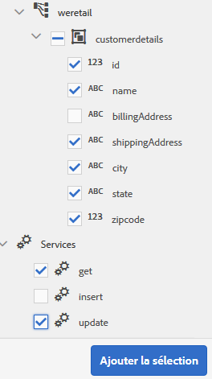

   >[!NOTE]
   >
   >Les services get, update et insert par défaut pour les sources de données JDBC sont fournis prêts à l’emploi avec le modèle de données de formulaire.

1. Configurez les services de lecture et d’écriture pour les objets de modèle de données.

   1. Sélectionnez l’objet de modèle de données **customerdetails** et appuyez sur **Modifier les propriétés**.
   1. Sélectionnez **get** dans la liste déroulante Service de lecture. L’argument **id** qui est la clé principale de l’objet de modèle de données customerdetails est ajouté automatiquement. Appuyez sur  et configurez l’argument comme suit.

      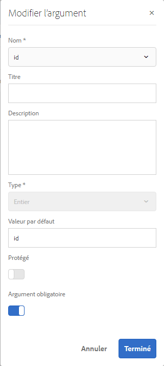

   1. De même, sélectionnez **update** en tant que Service d’écriture. L’objet **customerdetails** est ajouté automatiquement en tant qu’argument. L’argument est configuré comme suit.

      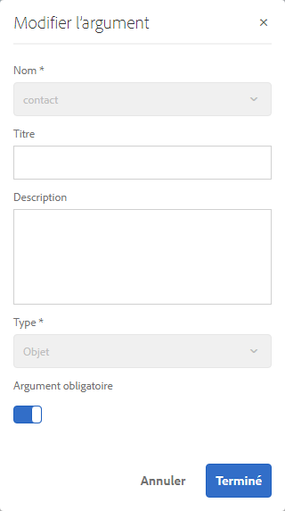

      Ajoutez et configurez l’argument **id** comme suit.

      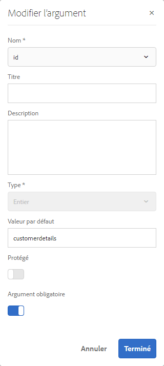

   1. Appuyez sur **Terminé** pour enregistrer les propriétés de l’objet de modèle de données. Then, tap **Save** to save the form data model.

      Les services **get** et **update** sont ajoutés en tant que services par défaut pour l’objet de modèle de données.

      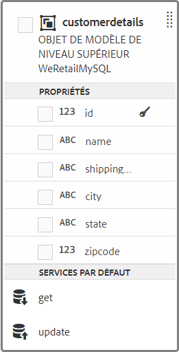

1. Accédez à l’onglet **Services** et configurez les services **get** et **update**.

   1. Select the **get** service and tap **Edit Properties**. La boîte de dialogue Propriétés s’ouvre.
   1. Spécifiez les éléments suivants dans la boîte de dialogue Modifier les propriétés :

      * **Titre** : spécifiez le titre du service. Par exemple : extraire l’adresse d’expédition.
      * **Description** : spécifiez la description contenant le fonctionnement détaillé du service. Par exemple :

         Ce service récupère l’adresse de livraison et les autres détails du client dans la base de données MySQL.

      * **Objet de modèle de sortie** : sélectionnez le schéma contenant les données du client. Par exemple :

         de détails personnalisés

      * **Revenir au tableau** : désactivez l’option **Revenir au tableau**.
      * **Arguments** : sélectionnez l’argument nommé **ID**.
      Appuyez sur **Done** (Terminé). Le service de récupération des détails des clients de la base de données MySQL est configuré.

      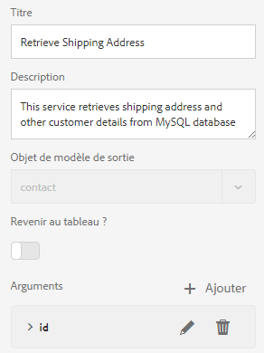

   1. Select the **update** service and tap **Edit Properties**. La boîte de dialogue Propriétés s’ouvre.

   1. Spécifiez les éléments suivants dans la boîte de dialogue Modifier les propriétés :

      * **Titre** : spécifiez le titre du service. Par exemple, Mettre à jour l’adresse de livraison.
      * **Description** : spécifiez la description contenant le fonctionnement détaillé du service. Par exemple :

         Ce service met à jour l&#39;adresse de livraison et les champs associés dans la base de données MySQL

      * **Objet de modèle d’entrée** : sélectionnez le schéma contenant les données du client. Par exemple :

         de détails personnalisés

      * **Type de sortie** : sélectionnez **VALEUR BOOLEENNE**.

      * **Arguments** : sélectionnez l’argument nommé **ID** et **customerdetails**.
      Appuyez sur **Done** (Terminé). Le service **update** permettant de mettre à jour les détails du client dans la base de données MySQL est configuré.

      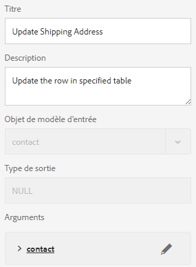

L’objet et les services de modèle de données dans le modèle de données de formulaire sont configurés. Vous pouvez à présent tester le modèle de données de formulaire.

## Étape 4 : tester le modèle de données de formulaire {#test-fdm}

Vous pouvez tester l’objet et les services du modèle de données pour vérifier que le modèle de données de formulaire est correctement configuré.

Procédez comme suit pour effectuer le test :

1. Accédez à l’onglet **Modèle**, sélectionnez l’objet de modèle de données **customerdetails** et appuyez sur **Tester l’objet de modèle**.
1. Dans la fenêtre **Tester le modèle/service**, sélectionnez **Objet de modèle de lecture** dans le menu déroulant **Sélectionner le modèle/service**.
1. Dans la section **customerdetails**, spécifiez une valeur pour l’argument **id** qui existe dans la base de données MySQL configurée et appuyez sur **Test**.

   Les détails du client associés à l’ID spécifié sont récupérés et affichés dans la section **Sortie**, comme indiqué ci-dessous.

   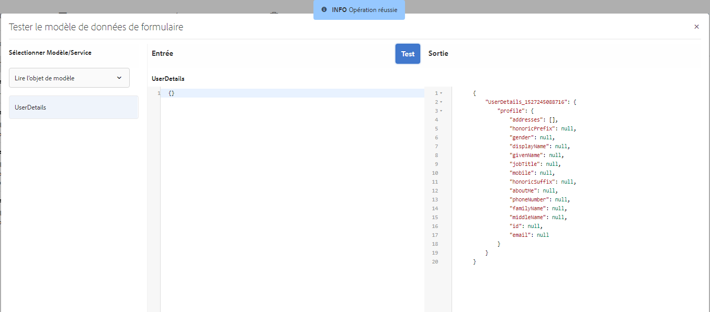

1. De même, vous pouvez tester l’objet de modèle et les services Écriture.

   Dans l’exemple suivant, le service update met à jour les informations relatives à l’adresse de l’ID 7102715 dans la base de données.

   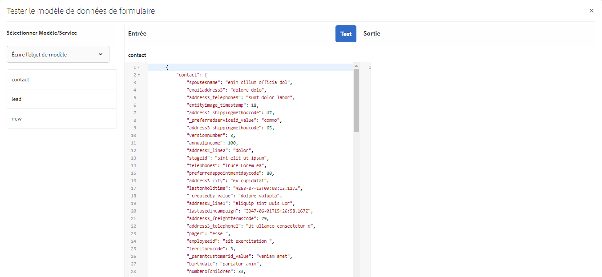

   À présent, si vous testez à nouveau le service de lecture de modèle pour l’ID 7107215, il récupérera et affichera les détails du client mis à jour comme indiqué ci-dessous.

   
