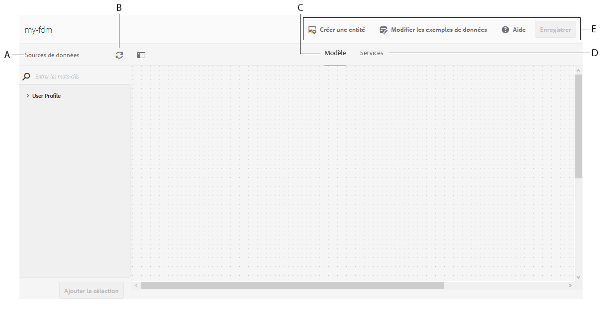

# Créer un modèle de données de formulaire{#create-form-data-model}

L’intégration de données d’AEM Forms fournit une interface utilisateur intuitive permettant de créer et d’utiliser des modèles de données de formulaire. Un modèle de données de formulaire se base sur les sources de données pour l’échange des données ; toutefois, vous pouvez créer un modèle de données de formulaire avec ou sans source de données. Il existe deux approches de création d’un modèle de données de formulaire, selon que vous avez ou non configuré les sources de données :

* **Utilisation de sources de données préconfigurées** : si vous avez configuré les sources de données comme décrit dans [Configurer les sources de données](../../forms/using/configure-data-sources.md), vous pouvez les sélectionner lors de la création d’un modèle de données de formulaire. Tous les objets, les services et les propriétés de modèle de données provenant des sources de données sélectionnées sont alors disponibles dans le modèle de données de formulaire.

* **Sans sources de données** : si vous n’avez pas configuré les sources de données pour votre modèle de données du formulaire, vous pouvez toujours le créer sans sources de données. Vous pouvez utiliser le modèle de données de formulaire pour créer des formulaires adaptatifs et une communication interactive et les tester à l’aide des exemples de données. Lorsque des sources de données sont disponibles, vous pouvez lier le modèle de données de formulaire à des sources de données qui se reflèteront automatiquement dans les formulaires adaptatifs et les communications interactives associées.

>[!NOTE]
>
>Vous devez être membre des deux groupes **fdm-author** et **forms-user** pour pouvoir créer et utiliser le modèle de données de formulaire. Contactez votre administrateur AEM pour devenir membre des groupes.

## Créer un modèle de données de formulaire {#data-sources}

Assurez-vous d’avoir configuré les sources de données que vous prévoyez d’utiliser dans le modèle de données de formulaire comme décrit dans la section [Configuration des sources de données](../../forms/using/configure-data-sources.md). Procédez comme suit pour créer un modèle de données de formulaire basé sur des sources de données configurées :

1. Dans l’instance d’auteur AEM, accédez à **[!UICONTROL Forms (Formulaires) > Data Integrations]** (Intégrations de données).
1. Appuyez sur **[!UICONTROL Créer > Modèle de données de formulaire]**.
1. Dans la boîte de dialogue Créer un modèle de données de formulaire :

   * Attribuez un nom au modèle de données de formulaire.
   * (**Facultatif**) Spécifiez le titre, la description et les balises du modèle de données de formulaire.
   * (**Facultatif et applicable uniquement si les sources de données sont configurées**) Cochez l’icône en regard du champ **[!UICONTROL Configuration de la source de données]** et sélectionnez le nœud de configuration où se trouvent les services cloud pour les sources de données que vous voulez utiliser. Ceci restreint la liste des sources de données que vous pouvez sélectionner à la page suivante parmi les sources disponibles dans le nœud de configuration sélectionné. Cependant, toutes les bases de données JDBC et les sources de données des profils d’utilisateurs AEM sont répertoriées par défaut. Si vous ne sélectionnez pas de nœud de configuration, les sources de données de tous les nœuds de configuration sont répertoriées.

   Appuyez sur **[!UICONTROL Suivant]**.

1. (**Applicable uniquement si des sources de données sont configurées**) L’écran **[!UICONTROL Sélectionner la source de données]** répertorie les sources de données disponibles, le cas échéant. Sélectionnez les sources de données que vous souhaitez utiliser dans le modèle de données de formulaire.
1. Appuyez sur **[!UICONTROL Créer]** et, dans la boîte de dialogue de confirmation, appuyez sur **[!UICONTROL Ouvrir]** pour ouvrir l’éditeur de modèle de données de formulaire.

Examinons les différents composants de l’interface utilisateur de l’éditeur de modèle de données de formulaire.

**A. Sources de données** Répertorie les sources de données dans un modèle de données de formulaire. Développez une source de données pour afficher ses objets et services de modèle de données.

**B. Actualiser les** définitions de source de données Récupère toutes les modifications apportées aux définitions de source de données à partir des sources de données configurées et les met à jour dans l’onglet Sources de données de l’éditeur de modèle de données de formulaire.

**C. Modèle** Zone de contenu dans laquelle les objets de modèle de données ajoutés apparaissent.

**D. Services** Zone de contenu dans laquelle les opérations ou services de source de données ajoutés s’affichent.

**E. Barre d’outils** Outils pour l’utilisation d’un modèle de données de formulaire. La barre d’outils affiche plus d’options en fonction de l’objet sélectionné dans le modèle de données de formulaire.

**F. Ajouter la sélection** Ajoute les objets et les services de modèle de données sélectionnés au modèle de données de formulaire.

Pour plus d’informations sur l’éditeur de modèle de données de formulaire et sur la manière dont vous pouvez l’utiliser pour modifier et configurer le modèle de données de formulaire, voir [Utilisation du modèle de données de formulaire](../../forms/using/work-with-form-data-model.md).

## Mise à jour des sources de données {#update}

Pour ajouter ou mettre à jour des sources de données dans un modèle de données de formulaire existant, procédez comme suit.

1. Accédez à **[!UICONTROL Forms > Intégrations de données]**, sélectionnez le modèle de données de formulaire dans lequel vous souhaitez ajouter ou mettre à jour des sources de données, puis appuyez sur **[!UICONTROL Propriétés]**.
1. Dans les propriétés du modèle de données de formulaire, accédez à l’onglet **[!UICONTROL Mettre à jour la source]**.

   Dans l’onglet Mettre à jour la source :

   * Appuyez sur l’icône de navigation dans le champ **[!UICONTROL Configuration contextuelle]** et sélectionnez un nœud de configuration où se trouve la configuration cloud de la source de données que vous voulez utiliser. Si vous ne sélectionnez pas de nœud, les configurations cloud qui se trouvent uniquement dans le nœud `global` sont répertoriées lorsque vous appuyez sur **[!UICONTROL Ajouter des sources]**.

   * Pour ajouter une nouvelle source de données, appuyez sur **[!UICONTROL Ajouter des sources]** et sélectionnez les sources de données à ajouter au modèle de données de formulaire. Toutes les sources de données configurées en `global` et le nœud de configuration sélectionné, le cas échéant, s’affichent.

   * Pour remplacer une source de données existante par une autre source de données du même type, appuyez sur l’icône **[!UICONTROL Modifier]** de la source de données et sélectionnez-en une dans la liste des sources de données disponibles.
   * Pour supprimer une source de données existante, appuyez sur l’icône **[!UICONTROL Supprimer]** de la source de données. L’icône Supprimer est désactivée si un objet de modèle de données dans la source de données est ajouté au modèle de données de formulaire.

   

1. Appuyez sur **[!UICONTROL Enregistrer et fermer]** pour enregistrer les mises à jour.

>[!NOTE]
>
>Lorsque vous ajoutez de nouvelles sources de données ou que vous mettez à jour les sources de données existantes dans un modèle de données de formulaire, assurez-vous de mettre à jour les références de liaison, le cas échéant, dans les formulaires adaptatifs et les communications interactives qui utilisent le modèle de données de formulaire mis à jour.

## Étapes suivantes {#next-steps}

Vous disposez maintenant d’un modèle de données de formulaire auquel des sources de données ont été ajoutées. Vous pouvez ensuite modifier le modèle de données de formulaire pour ajouter et configurer les objets et services du modèle de données, ajouter des associations entre les objets du modèle de données, modifier les propriétés, ajouter des objets et propriétés du modèle de données personnalisés, générer des exemples de données, etc.

Pour plus d’informations, reportez-vous à la section [Utilisation d’un modèle de données de formulaire](../../forms/using/work-with-form-data-model.md).
