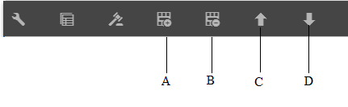

# Créer une communication interactive{#create-an-interactive-communication}

## Présentation {#overview}

Les communications interactives centralisent et gèrent la création, l’assemblage et la livraison de correspondances sécurisées, personnalisées et interactives. Utilisez l’impression en tant que canal principal pour le Web. Vous pouvez minimiser les efforts fournis lors de la création de la sortie web de la communication interactive.

### Conditions préalables {#prerequisites}

Les conditions préalables à la création d’une communication interactive sont les suivantes :

* Configurez un [modèle de données de formulaire](/help/forms/using/data-integration.md) contenant des données de test ou une source de données réelle, telle qu’une instance de Microsoft® Dynamics.
* Ensure that you have the [Document fragments](/help/forms/using/document-fragments.md).
* Ensure that you have [Templates for print and web channel](/help/forms/using/web-channel-print-channel.md).
* Assurez-vous de disposer du [thème](/help/forms/using/themes.md) requis pour le canal web.

## Créer une communication interactive {#createic}

1. Connectez-vous à l’instance d’auteur AEM et accédez à **[!UICONTROL Adobe Experience Manager]** > **[!UICONTROL Formulaires]** > **[!UICONTROL Formulaires et documents]**.
1. Tap **[!UICONTROL Create]** and select **[!UICONTROL Interactive Communication]**. La page Créer une communication interactive s’affiche.

   

1. Saisissez les informations suivantes :  :

   * **[!UICONTROL Titre]** : entrez le titre de la communication interactive.
   * **[!UICONTROL Nom]**: Le nom de la communication interactive est dérivé du titre que vous saisissez. Modifiez-le, si nécessaire.
   * **[!UICONTROL Description]** : entrez une description de la communication interactive.
   * **[!UICONTROL Modèle]** de données de formulaire : Recherchez et sélectionnez le modèle de données de formulaire. For more information on Form Data Model, see [AEM Forms Data Integration](/help/forms/using/data-integration.md).

   * **[!UICONTROL Service]** de préremplissage : Sélectionnez le service de préremplissage pour récupérer les données et préremplir la communication interactive.
   * **[!UICONTROL Post-traitement Type]**: Vous pouvez sélectionner le processus AEM ou Forms à déclencher lors de l’envoi de la communication interactive. Sélectionnez le type de processus à déclencher.

   * **[!UICONTROL Post-traitement]** : sélectionnez le nom du processus à déclencher. Lorsque vous sélectionnez le flux de travaux AEM, fournissez le chemin de pièce jointe, le chemin de mise en page, le chemin PDF, le chemin d’impression des données et le chemin de données Web.
   * **[!UICONTROL Balises]**: Sélectionnez les balises à appliquer à la communication interactive. Vous pouvez également saisir un nom de balise nouveau ou personnalisé et appuyer sur Entrée pour créer la balise.
   * **[!UICONTROL Auteur]** : le nom de l’auteur est automatiquement extrait du nom de l’utilisateur connecté.
   * **[!UICONTROL Date de publication :]** entrez la date de publication de la communication interactive.
   * **[!UICONTROL Date]** d’annulation de publication : Entrez la date d’annulation de la publication de la communication interactive.

1. Appuyez sur **[!UICONTROL Next]** (Suivant). L’écran de spécification des informations relatives aux canaux web et d’impression s’affiche.
1. Entrez la commande suivante :

   * **[!UICONTROL Imprimer]** : sélectionnez cette option pour générer le canal d’impression de la communication interactive.
   * **[!UICONTROL Imprimer le modèle]**: Recherchez et sélectionnez un fichier XDP comme modèle d’impression.
   * **[!UICONTROL Web]**: Sélectionnez cette option pour générer le  Web ou la sortie réactive d’Interactive Communication.
   * **[!UICONTROL Modèle]** Web de communication interactive : Recherchez et sélectionnez le modèle Web.
   * **[!UICONTROL Thème]** et **[!UICONTROL Sélectionner le thème]**: Recherchez et sélectionnez le thème pour mettre en forme le Web  de la communication interactive. Pour plus d’informations, voir [Thèmes dans AEM Forms](/help/forms/using/themes.md).

   * **[!UICONTROL Utiliser Imprimer comme gabarit pour les]** Web : Sélectionnez cette option pour créer le Web  synchronisé avec le d’impression . L’utilisation du canal d’impression comme page principale du canal web garantit que le contenu et la liaison des données du canal web sont dérivés du canal d’impression et que les modifications apportées au canal d’impression sont répercutées sur le canal web lorsque vous appuyez sur Synchroniser. Les auteurs sont toutefois autorisés à interrompre l’héritage pour des composants spécifiques dans le canal web, selon les besoins. Pour plus d’informations, consultez [Synchroniser le canal web avec le canal d’impression](../../forms/using/create-interactive-communication.md#synchronize).
Si vous sélectionnez l’option **[!UICONTROL Utiliser l’impression comme modèle pour les]** Web, vous pouvez sélectionner l’un des modes suivants pour générer des  de Web :

      * **[!UICONTROL Mise en page]** automatique : Sélectionnez ce mode pour générer automatiquement des espaces réservés, du contenu et des liaisons de données pour les  de Web à partir du  d’impression.
      * **[!UICONTROL Organiser** manuellement : Sélectionnez ce mode pour sélectionner manuellement et ajouter des éléments Imprimer  au Web  à l’aide du contenu maître disponible dans l’onglet Sources **[!UICONTROL de]** données. Pour plus d&#39;informations, reportez-vous à la section [Sélection d&#39;éléments de  d&#39;impression pour créer du contenu](#selectprintchannelelements) de Web.
   For more information on print channel and web channel, see [Print channel and web channel](/help/forms/using/web-channel-print-channel.md).

1. Appuyez sur **[!UICONTROL Create]** (Créer). La communication interactive est créée et une boîte d’alerte s’affiche. Tap **[!UICONTROL Edit]** to start building the contents of the Interactive Communication as explained in [Add contents using Interactive Communication authoring user interface](#step2). Alternatively, you can tap **[!UICONTROL Done]** and choose to edit the Interactive Communication later.

## Ajouter du contenu à la communication interactive {#step2}

Après avoir créé une communication interactive, vous pouvez utiliser l’interface de création de communication interactive pour construire son contenu.

For more information on the Interactive Communication authoring interface, see [Introduction to Interactive Communication authoring](/help/forms/using/introduction-interactive-communication-authoring.md).

1. The Interactive Communication authoring interface is launched when you Tap Edit as mentioned in [Create Interactive Communication](#createic). Alternatively, you can navigate to an existing Interactive Communication asset on AEM, select it, and tap **[!UICONTROL Edit]** to launch the Interactive Communication authoring interface.

   Par défaut, le d’impression de la communication interactive s’affiche, sauf si la communication interactive est  uniquement sur le Web. Le Imprimer de la communication interactive affiche  zones de, telles que disponibles dans le modèle deformulaire XDP/d’impression  sélectionné. Vous pouvez ajouter des composants ou des ressources dans ces zones et champs cibles.

1. With the Print channel selected, select the **[!UICONTROL Components]** tab. Les composants suivants sont disponibles dans le canal d’impression :

   | **Composant** | **Fonctionnalité** |
   |---|---|
   | Graphique | Ajoute un graphique que vous pouvez utiliser dans Interactive Communication pour la représentation visuelle des données bidimensionnelles récupérées à partir d’une collection de modèles de données de formulaire. For more information, see [Using charts in Interactive Communications](/help/forms/using/chart-component-interactive-communications.md). |
   | Fragment de document | Permet d’ajouter un composant réutilisable, tel que du texte, des  ou une condition, à une communication interactive. Le composant ajouté peut être basé sur un modèle de données de formulaire ou sans modèle de données de formulaire. |
   | Image | Permet d’insérer une image. |

   Faites glisser les composants dans votre communication interactive et configurez-les selon les besoins.

   Vous pouvez également utiliser les opérations d’annulation et de rétablissement lors de la création d’une communication interactive pour les  d’impression et de Web.

   Utilisez l’opération Annuler pour ignorer la dernière action effectuée et l’opération Rétablir pour incorporer à nouveau l’action ignorée. Par exemple, si vous avez inséré une image ou créé une liaison de données dans une communication interactive et que vous devez la supprimer, utilisez l’opération Annuler.

   

   Les options Annuler et Rétablir s’affichent dans la barre d’outils de la page de l’interface utilisateur de création. L’option Annuler s’affiche uniquement après l’exécution d’une action. L’option Rétablir s’affiche dans la barre d’outils de la page uniquement après une opération d’annulation. Ces actions sont réinitialisées lors de l’actualisation de la page.

1. Lorsque le canal d’impression est sélectionné, accédez à l’onglet **[!UICONTROL Ressources]** et appliquez le filtre pour afficher uniquement les ressources souhaitées.

   A l’aide de l’explorateur Ressources, vous pouvez également faire glisser et déposer directement des ressources dans les zones  du Interactive Communication.

   

1. Glissez-déposez les fragments de document dans la communication interactive. Vous trouverez ci-dessous les types de fragments de document que vous pouvez utiliser dans le canal d’impression de la communication interactive.

<table>
 <tbody>
  <tr>
   <td><strong>Type de fragment de document</strong></td>
   <td><strong>Exemple d’objectif</strong></td>
  </tr>
  <tr>
   <td><a href="/help/forms/using/texts-interactive-communications.md" target="_blank">Text (Texte)</a></td>
   <td>Texte d’ajout de l’adresse électronique du destinataire, et du corps du texte de la lettre </td>
  </tr>
  <tr>
   <td><a href="/help/forms/using/conditions-interactive-communications.md" target="_blank">Condition</a></td>
   <td>Condition pour l’ajout de l’image d’en-tête adaptée à la communication en fonction du type de stratégie : standard ou premium.   </td>
  </tr>
  <tr>
   <td>Liste</td>
   <td>Groupe de fragments du document, notamment le texte, les conditions, les autres listes et les images.   </td>
  </tr>
 </tbody>
</table>

Vous pouvez également remplacer la liaison entre une zone de  et un fragment de  de en déposant le nouveau fragment sur la zone de  de l’ **[!UICONTROL onglet Ressources]** . L’ombrage de couleur bleue de la zone  du lors du déplacement du fragment indique que le fragment de  peut être déposé dans la zone de  de l’objet.

Pour plus d’informations sur les fragments de document, reportez-vous à la section [Fragments de document](/help/forms/using/document-fragments.md).

L’interface de création vous permet de faire la distinction entre les champs et variables liés et non liés dans une communication interactive. L’interface met en surbrillance les champs et variables non liés à l’aide d’une bordure orange.

De plus, lorsque vous passez la souris sur ces éléments, une info-bulle s’affiche avec le message Champ (Non lié) ou Variable (Non lié).

Une variable non liée utilisée dans un fragment  peut parfois ne pas s’afficher dans l’interface de création. Cela peut se produire en raison d’une règle de texte en ligne dans un fragment  ou dans le cas d’un fragment de condition. Dans ce cas, une info-bulle, surlignée en bleu, s’affiche dans le fragment . L’info-bulle affiche le nombre de variables non liées utilisées dans un fragment de .

Appuyez sur le fragment  de, appuyez sur  (Configurer), puis sur **[!UICONTROL Properties]** dans le panneau latéral d’Interactive Communication. La section **[!UICONTROL Variables et Objets]** de modèle de données  les variables, y compris les variables masquées, et les objets de modèle de données utilisés dans les  de. Utilisez l’icône  (Modifier) en regard de chaque objet ou variable de modèle de données pour modifier les propriétés.

1. To set up binding of variables, tap a variable and select  (Configure) and then set up the binding properties in the Properties panel in the sidebar.

   * **Aucun** : l’agent remplira la valeur de la variable.
   * **Fragment de texte** : si cette option est sélectionnée, vous pouvez rechercher et sélectionner un fragment de document texte dont le contenu est rendu dans le champ. Seuls ces fragments de document texte peuvent être liés à des variables qui ne contiennent aucune variable.
   * **Objet de modèle de données** : sélectionnez une propriété de modèle de données de formulaire dont la valeur est renseignée dans le champ.
   * **Valeur par défaut :** Vous pouvez définir une valeur par défaut pour la variable à l’aide de ce champ. La valeur s’affiche lorsque vous  la communication interactive ou dans l’interface utilisateur de l’agent.
   * **Modèle d’affichage :** Vous pouvez également définir un format d’affichage pour une variable. Sélectionnez l’une des options prédéfinies dans le déroulant **Type** pour appliquer un format d’affichage à une variable. Sélectionnez **Personnalisé** pour définir un modèle d’affichage qui n’est pas disponible dans le  du. Pour plus d’informations, voir Modèles [d’affichage des](../../forms/using/create-interactive-communication.md#datadisplaypatterns)données.
   Accédez à [Variables et Objets](../../forms/using/create-interactive-communication.md#hiddenvariables) de modèle de données pour configurer la liaison des variables masquées dans le fragment  de.

   Vous pouvez également faire glisser des éléments de source de données ou des fragments de de texte pour configurer la liaison de variables.  Pour créer une liaison avec l’un des éléments de source de données, sélectionnez l’onglet Sources **de** données et faites glisser l’élément vers le nom de la variable. L’élément et la variable de source de données doivent être du même type pour que la liaison soit correctement configurée. Si vous faites glisser un élément de source de données vers une variable déjà liée, le nouvel élément remplace le précédent pour créer une nouvelle liaison avec la variable. De même, sélectionnez l’onglet **Ressources** et faites glisser le fragment de de texte  vers le nom de la variable pour configurer la liaison entre eux. Le fragment de de texte ne doit contenir aucune variable.

1. Pour l’ajout d’un tableau, lorsque le canal d’impression est sélectionné, appliquez le filtre pour afficher uniquement les fragments de mise en page dans l’onglet **[!UICONTROL Ressources]**. Glissez-déposez le fragment de mise en page requis dans la communication interactive. Un fragment de mise en page est basé sur un fichier XDP et peut être utilisé pour créer des mises en page graphiques ou des tableaux statiques et dynamiques dans Interactive Communication qui sont renseignés avec des données dynamiques.

   Exemple : un tableau de mise en page pour l’affichage de la prime brute, du pourcentage de remise fidélité et de la disponibilité de l’assistance routière d’urgence pour les anciennes et les nouvelles stratégies.

   Pour plus d’informations sur les fragments de mise en page, reportez-vous à la section [Fragments de document](/help/forms/using/document-fragments.md).

1. Lorsque le canal d’impression est sélectionné, appliquez le filtre d’affichage des images dans l’onglet **[!UICONTROL Ressources]**. Glissez et déposez les images requises dans la communication interactive, par exemple pour le logo de l’entreprise.

   Ensuite, gérez les éléments suivants dans la communication interactive :

   * [Ajout et configuration de graphiques](/help/forms/using/chart-component-interactive-communications.md)
   * [Synchronisation du canal web avec le canal d’impression](../../forms/using/create-interactive-communication.md#synchronize)

      * Synchronisation automatique
      * Annuler l’héritage
      * Réactiver l’héritage
      * Synchroniser
   * [Pièces jointes et accès à la bibliothèque](../../forms/using/create-interactive-communication.md#attachmentslibrary)
   * [Propriétés du champ XDP/mise en page](../../forms/using/create-interactive-communication.md#xdplayoutfieldproperties)
   * [Ajouter des règles aux composants](../../forms/using/create-interactive-communication.md#rules)

1. Switch to **[!UICONTROL Web Channel]**. Le Web apparaît dans l’éditeur de communication interactive. Lorsque vous passez du canal d’impression au canal web pour la première fois, la synchronisation automatique a lieu. For more information, see [Synchronizing web channel from the print channel](../../forms/using/create-interactive-communication.md#synchronize).

   Comme nous utilisons le canal d’impression comme base pour le canal web dans cet exemple, les espaces réservés, le contenu et la liaison de données du canal d’impression sont synchronisés avec le canal web. Vous pouvez toutefois modifier et personnaliser le contenu spécifique dans le Web . [Annulez l’héritage](#cancelinheritance) pour les zones et variables de  de qui ont été générées à l’aide du d’impression pour pouvoir personnaliser le contenu.

   

   Appuyez sur le fragment  de, appuyez sur  (Configurer), puis sur **[!UICONTROL Properties]** dans le panneau latéral d’Interactive Communication. La section **[!UICONTROL Variables et Objets]** de modèle de données  les variables, y compris les variables masquées, et les objets de modèle de données utilisés dans les  de. Utilisez l’icône  (Modifier) en regard de chaque objet ou variable de modèle de données pour modifier les propriétés. En outre, pour les fragments de  de qui ont été générés  automatiquement dans le Web à l’aide de l’ d’impression, utilisez l’icône  (Annuler l’héritage) en regard de chaque objet et variable de modèle de données pour [annuler l’héritage](#cancelinheritance) et pouvoir les modifier.

1. Pour ajouter des composants supplémentaires dans le canal web, lorsque le canal web est sélectionné, appuyez sur **[!UICONTROL Composants]**. Faites glisser des composants dans le Web de votre communication interactive, le cas échéant, et procédez à leur configuration.

   | Composants | Fonctionnalité |
   |---|---|
   | Graphique | Ajoute un graphique que vous pouvez utiliser dans Interactive Communication pour la représentation visuelle des données bidimensionnelles récupérées à partir d’une collection de modèles de données de formulaire. For more information, see [Using chart component](../../forms/using/chart-component-interactive-communications.md). |
   | Fragment de document | Permet d’ajouter un composant, un texte, un  ou une condition réutilisable à une communication interactive. Le composant réutilisable que vous ajoutez à une communication interactive peut être basé sur un modèle de données de formulaire ou sans modèle de données de formulaire. |
   | Image | Permet d’insérer une image. |
   | Panneau | Permet d’ajouter un [panneau](../../forms/using/create-interactive-communication.md#add-panel-component-to-the-web-channel) à la communication interactive. |
   | Tableau | Ajoute un tableau qui permet de classer les données par lignes et par colonnes. |
   | Zone cible | Insère une zone cible dans un canal web pour organiser les composants spécifiques au canal web. La zone cible est un conteneur standard permettant de regrouper des composants spécifiques au canal web. |
   | Text (Texte) | Ajoute le texte enrichi au canal web d’une communication interactive. Le texte peut également utiliser des objets de modèle de données de formulaire pour rendre le contenu dynamique. |
   | Bouton | Permet d’ajouter un [bouton](../../forms/using/create-interactive-communication.md#add-button-component-to-the-web-channel) à la communication interactive. Vous pouvez utiliser le composant Bouton pour accéder à d’autres communications interactives, à des formulaires adaptatifs, à d’autres ressources telles que des images ou des fragments de  de ou à une URL externe. |
   | Séparateur | Permet d’insérer une ligne horizontale dans une communication interactive. Utilisez ce composant pour distinguer les sections d’une correspondance. Par exemple, vous pouvez utiliser le composant Séparateur pour faire la distinction entre les sections Détails du client et Détails de la carte de crédit dans un relevé de carte de crédit. |

1. Au besoin, insérez des ressources dans votre canal web.

   You can [preview your Interactive Communication](#previewic) to see what the print and web outputs of the Interactive Communication look like and continue making changes, as required.

## Prévisualiser la communication interactive {#previewic}

You can use the **Preview option** to evaluate appearance of the Interactive Communication. Le Web d’Interactive Communication permet également d’émuler l’expérience d’une communication interactive pour divers périphériques. Par exemple, iPhone, iPad et appareils de bureau. You can use both **Preview** and **Emulator**  options in conjunction with each other to preview the web outputs for devices of different screen sizes. Les exemples de données dans l’aperçu sont renseignés à partir du modèle de données de formulaires spécifié.

1. Sélectionnez le canal (d’impression ou web) à prévisualiser et appuyez sur Aperçu. La communication interactive s’affiche.

   >[!NOTE]
   >
   >L’aperçu est rempli avec les exemples de données du modèle de données de formulaire spécifié. For more information on previewing the Interactive Communication with some other data or using the prefill service, see [Use form data model](/help/forms/using/using-form-data-model.md) and [Work with form data model](/help/forms/using/work-with-form-data-model.md).

1. For the web channel, use  to view how the Interactive Communication looks on various devices.

   

Further, you can [Prepare and send Interactive Communication using the Agent UI](/help/forms/using/prepare-send-interactive-communication.md).

## Configure properties in Interactive Communication  {#configure-properties-in-interactive-communication}

### Pièces jointes et accès à la bibliothèque {#attachmentslibrary}

Dans le canal d’impression, vous pouvez configurer les pièces jointes et l’accès à la bibliothèque pour permettre à l’agent de gérer les pièces jointes dans l’interface utilisateur de l’agent pour la communication interactive :

1. Dans le canal d’impression, mettez en surbrillance le conteneur de documents et appuyez sur **Propriétés**.

   

   Le panneau Propriétés s’affiche dans la barre latérale.

   

1. Développez les **pièces jointes** et spécifiez les propriétés suivantes :

   * **[!UICONTROL Autoriser l’accès à la bibliothèque]** : sélectionnez cette option pour permettre à l’agent d’accéder à la bibliothèque dans l’interface utilisateur de l’agent. Si cette option est activée, l’agent peut ajouter des fichiers depuis la bibliothèque tout en préparant la communication interactive.
   * **[!UICONTROL Autoriser la réorganisation des pièces jointes]** : sélectionnez cette option pour permettre à l’agent de réorganiser les pièces jointes avec la communication interactive.
   * **[!UICONTROL Nombre max de pièces jointes autorisé]** : spécifiez le nombre maximum de pièces jointes autorisées avec la communication interactive.
   * **[!UICONTROL Fichiers à joindre]**: Appuyez sur **[!UICONTROL Ajouter]** et parcourez l’arborescence pour sélectionner les fichiers à joindre et spécifiez les éléments suivants :

      * **[!UICONTROL Joindre ce fichier au document par défaut]** : vous pouvez modifier cette option si seule la pièce jointe n’est pas obligatoire.
      * **[!UICONTROL Obligatoire :]** l’agent ne pourra pas supprimer la pièce jointe dans l’interface utilisateur de l’agent.
   

1. Appuyez sur **[!UICONTROL Done]** (Terminé). 

### Propriétés du champ XDP/mise en page {#xdplayoutfieldproperties}

1. While editing the Print channel of an Interactive Communication, hover over a field, which is built in the Print channel template, and select  (Configure).

   La boîte de dialogue Propriétés s’affiche dans la barre latérale.

   

1. Indiquez les informations suivantes :

   * **[!UICONTROL Nom]** : nom du nœud JCR.
   * **[!UICONTROL Titre]** : entrez un titre qui sera visible pour l’agent dans l’interface utilisateur de l’agent et dans l’arborescence du conteneur de documents.
   * **[!UICONTROL Type de liaison]** : sélectionnez l’un des types de liaison suivants pour le champ.

      * Aucun : l’agent remplira la valeur de la propriété.
      * Fragment de texte : si cette option est sélectionnée, vous pouvez rechercher et sélectionner un fragment de document texte dont le contenu est rendu dans le champ. Vous pouvez également faire glisser le fragment de de texte  vers le nom du champ pour configurer la liaison entre eux. Le fragment de de texte ne doit contenir aucune variable.
      * Objet de modèle de données : sélectionnez une propriété de modèle de données de formulaire dont la valeur est renseignée dans le champ. Vous pouvez également sélectionner l’onglet Sources **de** données et faire glisser la propriété vers le champ.
   * **[!UICONTROL Valeurs par défaut]** : la valeur par défaut veille à ce que le champ ne soit pas vide lorsqu’aucune valeur n’est fournie par l’objet de modèle de données ou le fragment de texte spécifié. Si aucun type de liaison de données n’est défini, la valeur par défaut est préremplie dans la zone.
   * **[!UICONTROL Modèle]** d’affichage : Vous pouvez également définir un format d’affichage pour un champ. Sélectionnez l’une des options prédéfinies dans le déroulant **Type** pour appliquer un format d’affichage à un champ. Sélectionnez **Personnalisé** pour définir un modèle d’affichage qui n’est pas disponible dans le  du. Pour plus d’informations, voir Formats d’affichage des [données.](../../forms/using/create-interactive-communication.md#datadisplaypatterns)

   * **[!UICONTROL Modifiable par l’agent]** : sélectionnez cette option pour permettre à l’agent de modifier la valeur du champ de l’interface utilisateur de l’agent. Ce paramètre n’est pas applicable si le type de liaison est Fragment de texte.
   * **[!UICONTROL Libellé]** : spécifiez une chaîne de texte affichée avec le champ dans l’interface utilisateur de l’agent. Ce paramètre n’est pas applicable si le type de liaison est Fragment de texte.
   * **[!UICONTROL Info-bulle]**: Entrez une chaîne de texte visible lorsque vous passez la souris sur l&#39;agent dans l&#39;interface utilisateur de l&#39;agent. Ce paramètre n’est pas applicable si le type de liaison est Fragment de texte.
   * **[!UICONTROL Obligatoire]** : sélectionnez cette option pour que le champ soit obligatoire pour l’agent. Ce paramètre n’est pas applicable si le type de liaison est Fragment de texte.
   * **[!UICONTROL Permettre des lignes multiples]** : sélectionnez ce champ pour activer les lignes de texte multiples comme entrée dans le champ. Ce paramètre n’est pas applicable si le type de liaison est Fragment de texte.

1. Appuyez sur .

### Formats d’affichage des données {#datadisplaypatterns}

L’interface de création vous permet de définir des modèles d’affichage de données pour les champs, les variables et les éléments de modèle de données de formulaire disponibles lors de la création d’une communication interactive pour l’impression et les  Web.

Pour configurer le modèle d’affichage des données, appuyez sur l’élément, sélectionnez  (Configurer) et configurez le modèle d’affichage dans le panneau **[!UICONTROL Propriétés]** de la barre latérale. Sélectionnez une option prédéfinie dans le déroulant **[!UICONTROL Type]** pour  le modèle associé au type sélectionné. Sélectionnez **[!UICONTROL Personnalisé]** dans le déroulant **[!UICONTROL Type]** pour définir un modèle qui n’est pas disponible dans le  de. La modification des valeurs dans le champ **[!UICONTROL Modèle]** modifie automatiquement le type en **[!UICONTROL Personnalisé]**.

Pour appliquer le modèle d’affichage, le nombre de caractères ou de chiffres définis dans le champ Modèle doit correspondre ou dépasser les caractères ou chiffres définis dans la valeur des champs, variables et éléments du modèle de données de formulaire. For more information, see [example](../../forms/using/create-interactive-communication.md#greaternumberofdigits).

Vous pouvez redéfinir le modèle d’affichage d’un champ, d’une variable ou d’un élément de modèle de données de formulaire après avoir généré du contenu Web à partir du d’impression. Par conséquent, un élément peut avoir différents modèles d’affichage définis pour les  d’impression et de Web. Si vous ne définissez pas de modèle d’affichage pour un élément dans le d’impression et générez automatiquement du contenu Web à l’aide de l’ d’impression, la liaison de données définie pour l’élément dans le **[!UICONTROL modèle d’affichage  définit les options de modèle d’affichage disponibles dans le déroulant Type]** . S’il n’existe aucune liaison définie pour l’élément, le type de données de l’élément définit les options de modèle d’affichage disponibles. Si, par exemple, vous créez une liaison de données de type Numéro pour un élément dans les  d’impression, les options de modèle d’affichage disponibles dans le déroulant **[!UICONTROL Type]** sont de type Numéro dans divers formats.

Passez en mode **** ou ouvrez l’interface utilisateur de l’agent pour  le modèle d’affichage appliqué à ces éléments.

Le tableau suivant  un exemple des valeurs qui s’affichent suite à la définition du modèle d’affichage des données pour une variable :

| Type | Valeur par défaut | Modèle d’affichage | Afficher la valeur | Description |
|---|---|---|---|---|
| Numéro de sécurité sociale | 123456789 | text{999-99-9999} | 123-45-6789 | Le nombre de chiffres dans le champ de valeur par défaut correspond au nombre de chiffres dans le champ Modèle. La valeur basée sur le modèle s’affiche correctement. |
| Numéro de sécurité sociale | 1234567 | text{999-99-9999} | 1-23-4567 | Le nombre de chiffres dans le champ de valeur par défaut est inférieur au nombre de chiffres dans le champ Modèle. Le modèle s’applique aux 7 chiffres disponibles. |
| Numéro de sécurité sociale | 1234567890 | text{999-99-9999} | 1234567890 | Le nombre de chiffres dans le champ de valeur par défaut est supérieur au nombre de chiffres dans le champ Modèle. Par conséquent, la valeur d’affichage n’est pas modifiée. |

Si aucun modèle d’affichage n’est spécifié pour une variable ou un élément de modèle de données de formulaire, la configuration  globale du fragment de  est utilisée par défaut.

Si vous n’appliquez pas de modèle d’affichage à une variable de type de données numérique, le d’impression affiche le modèle en fonction de la configuration de fragment  globale. Si vous appliquez des modifications à la configuration de fragment de global par défaut, l’interface utilisateur de l’agent affiche toujours le modèle en fonction des séparateurs par défaut définis pour le paramètre régional.

De même, pour les champs, si le modèle d’affichage n’est pas spécifié, le modèle défini lors de la création du modèle d’impression (XDP) est appliqué au champ. S’il n’existe aucun modèle lors de la création du modèle d’impression, les modèles par défaut basés sur les spécifications XFA sont appliqués aux champs.

En outre, si le modèle d’affichage spécifié est incorrect ou ne peut pas être appliqué, les modèles par défaut basés sur les spécifications XFA sont appliqués aux champs, variables ou éléments de modèle de données de formulaire.

## Appliquer des règles à des composants de communication interactive {#rules}

To conditionalize components or content in the interactive communcation, tap the component/piece of content and select  (Create Rule) to launch Rule Editor.

Pour en savoir plus, voir:

* [Éditeur de règles](/help/forms/using/rule-editor.md)
* [Présentation de la création Interactive Communication](/help/forms/using/introduction-interactive-communication-authoring.md)

## Utilisation des tableaux {#tables}

### Tableaux dynamiques dans la communication interactive {#dynamic-tables-in-interactive-communication}

Vous pouvez ajouter des tableaux dynamiques dans Interactive Communication à l’aide de fragments de mise en page. Les étapes suivantes utilisent un exemple de relevé de carte de crédit pour illustrer l’utilisation d’un fragment de mise en page dans le but de créer un tableau dynamique dans une communication interactive.

1. Assurez-vous que le fragment de mise en page nécessaire à la création du tableau est disponible dans AEM.
1. Dans le d’impression de votre communication interactive, faites glisser et déposez un fragment de mise en page (avec un tableau à plusieurs colonnes) dans une zone  de à partir du navigateur de ressources.

   

   Un tableau s’affiche dans la zone Communication interactive.

   

1. Spécifiez la liaison de données pour chacune des cellules du tableau. Pour créer une ligne répétable, insérez les propriétés du modèle de données de formulaire dans la ligne appartenant à une propriété de collection commune.

   1. Tap a cell in the table and select  (Configure).

      La boîte de dialogue Propriétés s’affiche dans la barre latérale.

      

   1. Configurez les propriétés :

      * **[!UICONTROL Nom]** : nom du nœud JCR.
      * **[!UICONTROL Titre]**: Entrez un titre qui sera visible dans l’éditeur de communication interactive.
      * **[!UICONTROL Type de liaison]** : sélectionnez l’un des types de liaison suivants pour le champ.

         * **[!UICONTROL Aucun]**
         * **[!UICONTROL Objet]** de modèle de données : La valeur d’une propriété de modèle de données de formulaire est renseignée dans le champ. Vous pouvez également sélectionner l’onglet Sources **de** données et faire glisser la propriété vers le champ.
      * **[!UICONTROL Objet]** de modèle de données : Propriété de modèle de données de formulaire dont la valeur est renseignée dans le champ.
      * **[!UICONTROL Valeur]** par défaut : La valeur par défaut garantit que le champ n’est pas vide lorsqu’aucune valeur n’est fournie par l’objet de modèle de données spécifié. La valeur par défaut est préremplie dans le champ.

      * **[!UICONTROL Modifiable par l’agent]** : sélectionnez cette option pour permettre à l’agent de modifier la valeur du champ de l’interface utilisateur de l’agent.
   1. Appuyez sur .

1. de la communication interactive pour afficher le tableau généré avec les données.

   

### Tableaux de canal web uniquement {#webchanneltables}

Appuyez sur le panneau racine dans le modèle Web et appuyez sur **+** pour ajouter un composant **Tableau** à la communication interactive. Un tableau comprenant deux lignes est inséré dans la communication interactive. La première ligne du tableau représente l’en-tête Tableau.

#### Ajouter des lignes et des colonnes au tableau {#addrowscolumnstable}

**Pour ajouter ou supprimer des colonnes :**

1. Appuyez sur la zone de texte par défaut dans la rangée d’en-tête du tableau pour de la barre d’outils du composant.
1. Sélectionnez **Ajouter Colonne** ou **Supprimer la colonne** pour ajouter ou supprimer respectivement des colonnes de tableau.

**Pour ajouter ou supprimer des lignes :**

1. Appuyez sur l’une des lignes du tableau pour dans la barre d’outils du composant. Vous pouvez également sélectionner une rangée de tableau à l’aide de l’explorateur de contenu dans le panneau latéral d’Interactive Communication.
1. Sélectionnez **Ajouter rangée** ou **Supprimer rangée** pour ajouter ou supprimer des rangées de tableau, respectivement. Utilisez les options **Déplacer vers le haut** et **Déplacer vers le bas** de la barre d’outils pour réorganiser les rangées du tableau.

**A.** Ajouter ligne **B.** Supprimer la ligne **C.** Monter **D.** Déplacer vers le bas

#### Ajouter ou modifier du texte dans les cellules du tableau {#addedittexttable}

1. Sélectionnez la zone de texte par défaut dans la cellule du tableau et appuyez sur  (Modifier).
1. Tapez le texte dans la cellule du tableau et appuyez sur  pour l’enregistrer.

#### Créer une liaison entre les cellules du tableau et les éléments d’objet de modèle de données {#createbindingtablecells}

1. Sélectionnez la zone de texte par défaut dans la ligne du tableau et appuyez sur  (Modifier).
1. Appuyez sur le  déroulant Objets de modèle de données et sélectionnez la propriété.
1. Appuyez sur pour enregistrer et créer une liaison entre la cellule du tableau et la propriété d’objet de modèle de données.

#### Création d’un hyperlien pour le texte dans la cellule du tableau {#createhyperlinktable}

1. Sélectionnez la zone de texte par défaut dans la cellule du tableau et appuyez sur  (Modifier).
1. Sélectionnez le texte dans la cellule du tableau et appuyez sur l’icône Hyperlien.
1. Specify the URL in the **Path** field.
1. Tap  to save the hyperlink properties.

#### Création de tableaux dynamiques {#createdynamictables}

Vous pouvez créer un tableau dynamique de Web uniquement dans une communication interactive à l’aide d’une propriété de modèle de données de type collection. Un tel tableau représente les propriétés enfants d’une propriété de collection. Vous ne pouvez modifier que les propriétés de formatage des différentes cellules du tableau.

1. Passez à la  du Web, puis choisissez d’afficher le navigateur Sources de données.
1. Glissez-déposez une propriété de collection dans un sous-formulaire. Un tableau est créé dans le sous-formulaire.
1. Prévisualisez le tableau dans l’aperçu web de la communication interactive.

#### Tri des colonnes d’un tableau {#sortcolumns}

Vous pouvez trier les données en fonction de n’importe quelle colonne d’un tableau dans Interactive Communication. Les valeurs de la colonne peuvent être triées par ordre croissant ou décroissant.

Le tri peut être appliqué aux colonnes de tableaux contenant les éléments suivants :

* Texte statique
* Propriétés de l’objet de modèle de données
* Combinaison de texte statique et de propriétés d’objet de modèle de données

Pour activer le tri :

1. Select the table and tap  (Configure). Vous pouvez également sélectionner le tableau à l’aide de l’explorateur de **contenu** dans le panneau latéral d’Interactive Communication.
1. Sélectionnez **Activer le tri.**
1. Tap  to save the table properties. Les icônes de tri, les flèches vers le haut et vers le bas, dans les en-têtes de colonne, indiquent que le tri a été activé.

   

1. Passez en mode **** pour  la sortie. Le tableau est automatiquement trié en fonction de la première colonne du tableau.
1. Cliquez sur l’en-tête de colonne pour trier les valeurs en fonction de la colonne.

   Un en-tête de colonne avec une flèche vers le haut représente que :

   * est triée en fonction de cette colonne.
   * les valeurs de la colonne sont affichées dans l’ordre croissant.
   

   De même, un en-tête de colonne avec une flèche vers le bas représente que les valeurs de la colonne sont affichées dans l’ordre décroissant.

## Modifier les propriétés de communication interactive {#edit-interactive-communication-properties}

Une fois que vous avez créé une communication interactive, vous pouvez modifier ses propriétés ultérieurement.

Utilisez la page **Propriétés** pour :

* Modifiez les valeurs des champs spécifiés lors de la création de la communication interactive, tels que Titre et Description.
* Ajouter ou supprimez le Web  pour une communication interactive existante.
* , téléchargement ou suppression de la communication interactive
* Ouvrez l’interface utilisateur [de l’](/help/forms/using/prepare-send-interactive-communication.md)agent.

Pour accéder à la page **Propriétés** :

1. Connectez-vous à l’instance d’auteur AEM et accédez à **Adobe Experience Manager** > **Formulaires** > **Formulaires et documents**.
1. Sélectionnez Communication interactive et appuyez sur **Propriétés**.
1. Sélectionnez l’onglet **Général** pour modifier les champs **Titre** et **Description** .

### Ajouter ou supprimer le Web {#add-or-delete-the-web-channel}

Exécutez les étapes suivantes pour ajouter le  Web pour une communication interactive existante :

1. Dans la page **Propriétés** , sélectionnez l’onglet **du** .
1. Cochez la case **Web** et sélectionnez un modèle pour le  Web.
1. Sélectionnez **Utiliser l’impression comme modèle pour les** Web pour activer la synchronisation entre le Web et le  d’impression.
1. Tap **Save &amp; Close** to save the changes.

   De même, vous pouvez appuyer sur la case à cocher **Web** dans l’onglet de **** pour supprimer le Web  de la communication interactive.

## Composant Bouton Ajouter au Web {#add-button-component-to-the-web-channel}

Vous pouvez ajouter un bouton en tant que composant au Web  de la communication interactive. Définissez des règles à l’aide de l’éditeur [de](../../forms/using/rule-editor.md) règles afin de pouvoir accéder à d’autres communications interactives, à des formulaires adaptatifs, à d’autres ressources telles que des images ou des fragments de , ou à une URL externe lorsque vous appuyez sur le bouton.

Pour ajouter un bouton et définir des règles dessus :

1. Appuyez sur le panneau racine dans le modèle Web et appuyez sur **+** pour ajouter le composant **Bouton** à la communication interactive.
1. Appuyez sur le composant de bouton et appuyez  sur pour définir des règles lorsque vous appuyez sur le bouton.
1. Dans la section **Quand** , sélectionnez **cliqué** dans l’état du déroulant du bouton.
1. In the **Then** section:

   1. Sélectionnez une action dans le  déroulant. Par exemple, sélectionnez **Naviguer vers** comme type d’action.

   1. Spécifiez l’URL de la communication interactive, du formulaire adaptatif, d’un fichier ou d’une page Web. Par exemple, spécifiez l’URL au format suivant pour accéder à une autre communication interactive : https://&lt;nom du serveur>:&lt;port>/editor.html/content/forms/af/&lt;nom de la communication interactive>//&lt;nom du - impression ou web>.html
   1. Spécifiez l’option permettant d’ouvrir le fichier dans le même onglet, le nouvel onglet ou la nouvelle fenêtre.
   1. Tap **Done** and then tap **Close** to save the rule.
   De même, vous pouvez sélectionner d’autres options disponibles dans le déroulant de type d’action, telles que le service d’appel et le formulaire d’envoi. For more information, see [rule editor](../../forms/using/rule-editor.md).

1.  la communication interactive et appuyez sur le bouton pour  la communication interactive, le formulaire adaptatif, un fichier ou une page Web spécifiée à l’étape 4(b).

## Composant du panneau Ajouter au Web {#add-panel-component-to-the-web-channel}

Le composant Panneau est un espace réservé pour regrouper d’autres composants et contrôle la disposition d’un groupe de composants (accordéons et onglets) dans la communication interactive. Un composant de panneau vous permet également de permettre la répétition d’un groupe de composants pour l’utilisateur final, par exemple dans plusieurs entrées requises pour remplir les informations d’identification.

Pour ajouter un composant Panneau au Web, procédez comme suit :

1. Insérez le composant **Panneau** dans le Web à l’aide de l’une des options suivantes :

   * Appuyez sur un composant, appuyez sur **+** et sélectionnez le composant **Panneau** .

   * Dans le panneau du navigateur de **composants** , faites glisser et déposez le composant **Panneau** sur la communication interactive.

   * Appuyez sur le **panneau** dans le panneau du navigateur de **contenu** et appuyez sur **Ajouter Panneau** enfant. La sélection de l’option Panneau **enfant** Ajouter affiche la boîte de dialogue Panneau **enfant** Ajouter. Entrez le titre et une description et un nom facultatifs pour le composant Panneau.

1. Appuyez sur le panneau depuis le navigateur de **contenu** pour effectuer d’autres actions sur le panneau, telles que configurer, modifier des règles, copier, supprimer et insérer un composant.

   Vous pouvez également faire glisser un panneau dans l’explorateur de **contenu** pour refléter le changement de structure de la communication interactive dans le volet de droite.

## Synchronisation du canal web avec canal d’impression {#synchronize}

Lorsque vous sélectionnez Imprimer comme gabarit pour les  Web lors de la création d&#39;une communication interactive, le Web est créé en synchronisation avec le  d&#39;impression et le contenu et la liaison de données du Web sont dérivés de l&#39;application d&#39;impression et les modifications apportées dans led&#39;impression peuvent être répercutées dans le dictionnaire Web lorsque vous appuyez sur Synchroniser.

Les auteurs sont toutefois autorisés à interrompre l’héritage pour des composants dans le canal web, selon les besoins.

 d&#39;impression 

### Synchronisation automatique {#autosync}

Si vous sélectionnez l’option **[!UICONTROL Utiliser l’impression comme modèle pour les]** Web, vous pouvez sélectionner l’un des modes suivants pour générer des  de Web :

* **[!UICONTROL Mise en page]** automatique : Sélectionnez ce mode pour générer automatiquement des espaces réservés, du contenu et des liaisons de données pour les  de Web à partir du  d’impression.
* **[!UICONTROL Organiser]** manuellement : Sélectionnez ce mode pour sélectionner manuellement et ajouter des éléments Imprimer  au Web  à l’aide du contenu maître disponible dans l’onglet Sources de données. Pour plus d&#39;informations, reportez-vous à la section [Sélection d&#39;éléments de  d&#39;impression pour créer du contenu](#selectprintchannelelements) de Web.

>[!NOTE]
>
>La synchronisation des canaux synchronise uniquement les fragments de document, les images, les conditions, les listes et les fragments de disposition du canal d’impression au canal web. Les sous-formulaires ou les noeuds parents qui incluent ces éléments ne sont pas synchronisés.

### Sélectionnez Imprimer les éléments  pour créer le contenu  du Web {#selectprintchannelelements}

Si vous sélectionnez Imprimer en tant que gabarit lors de la création d’une communication interactive et que vous ne sélectionnez pas l’option de synchronisation automatique, vous pouvez également faire glisser des éléments de  d’impression vers l’interface de création  du Web.

Accédez à Sources **de** données > Contenu **** principal pour  les éléments  du d’impression. Faites glisser et déposez les zones, les champs ou les tableaux du vers l&#39;interface de création  du Web. Un cercle bleu en regard du nom de l’élément indique que l’élément Imprimer le  a déjà été inclus dans le  du Web.

### Annuler l’héritage {#cancelinheritance}

Dans le canal web, les composants sont inclus dans les zones cible.

Hover over the relevant target area or variable in the web channel and select  (Cancel Inheritance) and then in the Cancel Inheritance dialog, tap **[!UICONTROL Yes]**.

L’héritage des composants dans la zone cible est annulé et vous pouvez maintenant les modifier selon vos besoins.

### Réactiver l’héritage {#re-enable-inheritance}

Dans le canal web, vous pouvez réactiver l’héritage d’un composant si vous l’avez annulé. To re-enable inheritance, hover over the boundary of the relevant target area, which includes the component, and tap .

La boîte de dialogue Inverser l’héritage s’affiche.

Si nécessaire, sélectionnez **[!UICONTROL Synchroniser la page après avoir inversé l’héritage]**. Sélectionnez cette option pour synchroniser l’ensemble de la communication interactive. Si vous ne sélectionnez pas cette option, seule la zone de  appropriée est synchronisée lors de la restauration de l’héritage.

Appuyez sur **[!UICONTROL Oui]**.

### Synchroniser {#synchronize-1}

Si vous utilisez l&#39;option Imprimer comme modèle pour les  Web et que vous apportez des modifications à l&#39; d&#39;impression, vous pouvez synchroniser le contenu pour apporter les modifications nouvellement apportées au  Web.

1. Pour synchroniser le Web avec le  d&#39;impression, basculez sur le  d&#39;impression et appuyez sur l&#39;icône Plus d&#39;options.

   

1. Utilisez l’une des méthodes suivantes :

   * **[!UICONTROL Synchroniser avec Imprimer]**: Synchronise le contenu uniquement pour les zones  du dans lesquelles l’héritage n’est pas annulé.
   * **[!UICONTROL Réinitialiser]**: Synchronise le contenu du Web  avec le  d&#39;impression et ignore toutes les modifications apportées au Web.

### Utiliser la barre d’outils de composant pour effectuer des actions sur les composants hérités {#componenttoolbar}

Une fois que vous avez généré automatiquement du contenu dans le Web  à l’aide de l’option Synchroniser, vous pouvez exécuter plus d’actions sur les composants sans annuler l’héritage.

Appuyez sur le composant pour  les options suivantes :

* **Copier :** Copiez un composant et collez-le à d’autres emplacements dans la communication interactive.
* **Couper :** Déplacez un composant d’un emplacement à un autre dans Interactive Communication.
* **Insérer un composant :** Insérez un composant au-dessus du composant sélectionné.
* **Coller :** Collez le composant coupé ou copié à l’aide des options décrites ci-dessus.
* **Groupe :** Sélectionnez plusieurs composants si vous souhaitez couper, copier ou coller plusieurs composants ensemble.
* **Parent :** Sélectionnez le parent d’un composant.
* **SOM   :**  l’de  [SOM](../../forms/using/using-som-expressions-adaptive-forms.md) pour le composant.

* **Associer des objets dans le panneau :** Regroupez les composants d’un panneau pour pouvoir effectuer des opérations simultanément sur ces composants. Pour plus d’informations, voir [Associer des objets dans le panneau](#groupobjectspanel).

* **Annuler l&#39;héritage :** [Annulez l’héritage](#cancelinheritance) des composants dans la zone  du pour les modifier.

### Group objects in Panel {#groupobjectspanel}

L’interface de création de Web facilite le regroupement des composants dans un panneau pour pouvoir effectuer des opérations simultanément sur ces composants. L’onglet **Contenu**  les composants regroupés en tant qu’éléments enfants du panneau dans l’arborescence de contenu.

1. Appuyez sur un composant et sélectionnez l’opération Groupe ( ).
1. Sélectionnez plusieurs composants et appuyez sur **Associer des objets dans le panneau**.

   

1. Dans la boîte de dialogue **Associer les objets dans le panneau** , attribuez un nom au panneau.
1. Entrez un titre et une description facultatifs pour le panneau.
1. Cliquez sur .

   Les composants regroupés s’affichent sous forme d’éléments enfants du panneau dans l’arborescence de contenu.

   

