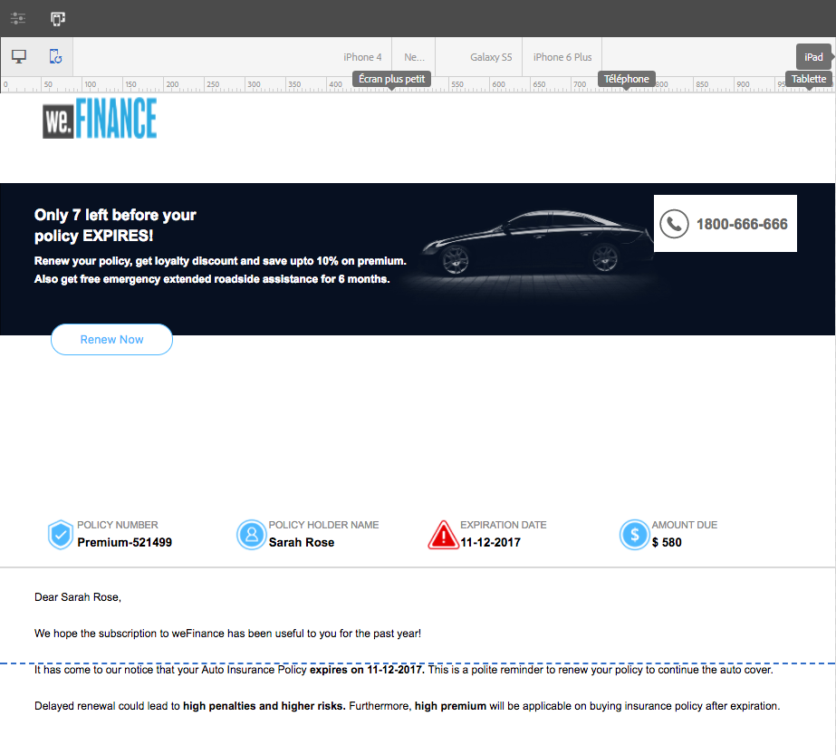
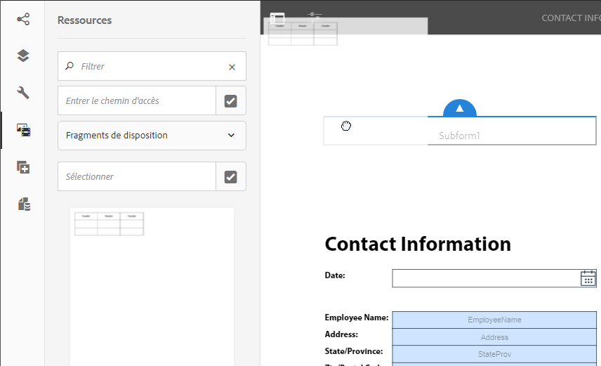

# Créer une communication interactive{#create-an-interactive-communication}

## Présentation {#overview}

Les communications interactives centralisent et gèrent la création, l’assemblage et la diffusion de correspondances sécurisées, personnalisées et interactives. Utilisez l’impression en tant que canal principal pour le web. Vous pouvez minimiser les efforts fournis lors de la création de la sortie web de la communication interactive.

### Prérequis {#prerequisites}

Les conditions préalables à la création d’une communication interactive sont les suivantes :

* Configurez un [modèle de données de formulaire](/help/forms/using/data-integration.md) contenant des données de test ou une source de données réelle, telle qu’une instance de Microsoft® Dynamics.
* Assurez-vous de disposer des [fragments de document](/help/forms/using/document-fragments.md).
* Assurez-vous de disposer de [modèles de canal d’impression et de canal web](/help/forms/using/web-channel-print-channel.md).
* Assurez-vous de disposer du [thème](/help/forms/using/themes.md) requis pour le canal web.

## Créer une communication interactive {#createic}

1. Connectez-vous à l’instance d’auteur AEM et accédez à **[!UICONTROL Adobe Experience Manager]** > **[!UICONTROL Formulaires]** > **[!UICONTROL Formulaires et documents]**.
1. Sélectionnez **[!UICONTROL Créer]** et sélectionnez **[!UICONTROL Communication interactive]**. La page Créer une communication interactive s’affiche.

   

1. Saisissez les informations ci-après.  :

   * **[!UICONTROL Titre]** : entrez le titre de la communication interactive.
   * **[!UICONTROL Nom]** : le nom de la communication interactive est dérivé du titre que vous avez entré. Modifiez-le, si nécessaire.
   * **[!UICONTROL Description]** : entrez une description de la communication interactive.
   * **[!UICONTROL Modèle de données de formulaire]** : recherchez et sélectionnez le modèle de données de formulaire. Pour plus d’informations sur le modèle de données de formulaire, consultez [Intégration de données AEM Forms](/help/forms/using/data-integration.md).

   * **[!UICONTROL Service de préremplissage]** : sélectionnez le service de préremplissage pour récupérer les données et préremplissez la communication interactive.
   * **[!UICONTROL Type de post-traitement]** : sélectionnez le workflow AEM ou Forms à déclencher lors de l’envoi de la communication interactive. Sélectionnez le type de processus à déclencher.

   * **[!UICONTROL Post-traitement]** : sélectionnez le nom du processus à déclencher. Lorsque vous sélectionnez le workflow AEM, fournissez le chemin d’accès de la pièce jointe, le chemin d’accès à la mise en page, le chemin d’accès au fichier PDF, le chemin d’accès aux données d’impression et le chemin de données web.
   * **[!UICONTROL Balises]** : sélectionnez les balises à appliquer à la communication interactive. Vous pouvez également saisir un nom de balise nouveau ou personnalisé et appuyer sur Entrée pour créer la balise.
   * **[!UICONTROL Auteur]** : le nom de l’auteur est automatiquement extrait du nom de l’utilisateur connecté.
   * **[!UICONTROL Date de publication :]** entrez la date de publication de la communication interactive.
   * **[!UICONTROL Date de dépublication]** : entrez la date de dépublication de la communication interactive.

1. Sélectionnez **[!UICONTROL Suivant]**. L’écran de spécification des informations relatives aux canaux web et d’impression s’affiche.
1. Entrez la commande suivante :

   * **[!UICONTROL Imprimer]** : sélectionnez cette option pour générer le canal d’impression de la communication interactive.
   * **[!UICONTROL Modèle d’impression]** : recherchez et sélectionnez un XDP comme modèle d’impression.
   * **[!UICONTROL Web]** : sélectionnez cette option pour générer le canal web ou la sortie réactive de la communication interactive.
   * **[!UICONTROL Modèle web de communication interactive]** : recherchez et sélectionnez le modèle web.
   * **[!UICONTROL Thème]** et **[!UICONTROL Sélectionner un thème]** : recherchez et sélectionnez le thème pour définir le style de canal web de la communication interactive. Pour plus d’informations, voir [Thèmes dans AEM Forms](/help/forms/using/themes.md).

   * **[!UICONTROL Utiliser l’impression en tant que page principale pour le canal web]** : sélectionnez cette option pour créer le canal web en synchronisation avec le canal d’impression. L’utilisation du canal d’impression comme page principale du canal web garantit que le contenu et la liaison des données du canal web sont dérivés du canal d’impression et que les modifications apportées au canal d’impression sont répercutées sur le canal web lorsque vous appuyez sur Synchroniser. Les auteurs sont toutefois autorisés à interrompre l’héritage pour des composants spécifiques dans le canal web, selon les besoins. Pour plus d’informations, consultez [Synchroniser le canal web avec le canal d’impression](../../forms/using/create-interactive-communication.md#synchronize).
Si vous sélectionnez l’option **[!UICONTROL Utiliser l’impression comme Principal pour le canal web]**, vous pouvez sélectionner l’un des modes suivants pour générer le canal web :

      * **[!UICONTROL Disposition automatique]** : sélectionnez ce mode pour générer automatiquement des espaces réservés, du contenu et des liaisons de données pour le canal web à partir du canal d’impression.
      * **[!UICONTROL Organisation manuelle]** : sélectionnez ce mode pour sélectionner manuellement et ajouter des éléments du canal d’impression au canal web à l’aide du contenu principal disponible dans l’onglet **[!UICONTROL Sources de données]**. Pour plus d’informations, voir [Sélectionner les éléments du canal d’impression pour créer le contenu du canal web](#selectprintchannelelements).

   Pour plus d’informations sur le canal d’impression et le canal web, consultez [Canal d’impression et canal web](/help/forms/using/web-channel-print-channel.md).

1. Sélectionnez **[!UICONTROL Créer]**. La communication interactive est créée et un message d’alerte s’affiche. Sélectionnez **[!UICONTROL Modifier]** pour commencer à créer le contenu de la communication interactive, comme expliqué dans [Ajouter du contenu à l’aide de l’interface utilisateur de création de communication interactive](#step2). Vous pouvez également sélectionner **[!UICONTROL Terminé]** et choisir de modifier ultérieurement la communication interactive.

## Ajouter du contenu à la communication interactive {#step2}

Après avoir créé une communication interactive, vous pouvez utiliser l’interface de création de la communication interactive pour développer son contenu.

Pour en savoir plus sur l’interface de création de la communication interactive, consultez [Introduction à la création d’une communication interactive](/help/forms/using/introduction-interactive-communication-authoring.md).

1. L’interface de création de la communication interactive se lance lorsque vous sélectionnez Modifier comme indiqué dans [Créer une communication interactive](#createic). Vous pouvez également accéder à une ressource de communication interactive existante sur AEM, la sélectionner, puis sélectionner **[!UICONTROL Modifier]** pour lancer l’interface de création de la communication interactive.

   Par défaut, le canal d’impression de la communication interactive s’affiche, sauf si la communication interactive se trouve uniquement sur le canal web. Le canal d’impression de la communication interactive affiche les zones cibles, disponibles dans le modèle de canal d’impression/XDP sélectionné. Vous pouvez ajouter des composants ou des ressources dans ces zones et champs cibles.

1. Lorsque le canal d’impression est sélectionné, sélectionnez l’onglet **[!UICONTROL Composants]**. Les composants suivants sont disponibles dans le canal d’impression :

   | **Composant** | **Fonctionnalité** |
   |---|---|
   | Graphique | Ajoute un graphique que vous pouvez utiliser dans une communication interactive pour la représentation visuelle des données bidimensionnelles extraites d’une collection de modèles de données de formulaire. Pour en savoir plus, consultez la rubrique [Utiliser des graphiques dans les communications interactives](/help/forms/using/chart-component-interactive-communications.md). |
   | Fragment de document | Vous permet d’ajouter un composant réutilisable, comme du texte, une liste ou une condition, à une communication interactive. Le composant ajouté peut être basé sur un modèle de données de formulaire ou sans modèle de données de formulaire. |
   | Image | Permet d’insérer une image. |

   Faites glisser et déposez les composants dans votre communication interactive et configurez-les selon vos besoins.

   Vous pouvez également utiliser les opérations d’annulation et de rétablissement lors de la création d’une communication interactive pour les canaux d’impression et web.

   Utilisez l’opération d’annulation pour ignorer la dernière action effectuée et l’opération de rétablissement pour incorporer à nouveau l’action ignorée. Par exemple, si vous avez inséré une image ou créé une liaison de données dans une communication interactive et que vous devez la supprimer, utilisez l’opération d’annulation.

   

   Les options Annuler et Rétablir s’affichent dans la barre d’outils de la page de l’interface utilisateur de création. L’option Annuler s’affiche uniquement après l’exécution d’une action. L’option Rétablir s’affiche sur la barre d’outils de la page uniquement après avoir effectué une opération d’annulation. Ces actions sont réinitialisées lors de l’actualisation de la page.

1. Lorsque le canal d’impression est sélectionné, accédez à l’onglet **[!UICONTROL Ressources]** et appliquez le filtre pour afficher uniquement les ressources souhaitées.

   L’explorateur de ressources vous permet également de faire glisser-déposer directement des ressources dans les zones cibles de la communication interactive.

   

1. Glissez-déposez les fragments de document dans la communication interactive. Vous trouverez ci-dessous les types de fragments de document que vous pouvez utiliser dans le canal d’impression de la communication interactive.

<table>
 <tbody>
  <tr>
   <td><strong>Type de fragment de document</strong></td>
   <td><strong>Exemple d’objectif</strong></td>
  </tr>
  <tr>
   <td><a href="/help/forms/using/texts-interactive-communications.md" target="_blank">Texte</a></td>
   <td>Texte d’ajout de l’adresse électronique du destinataire, et du corps du texte de la lettre </td>
  </tr>
  <tr>
   <td><a href="/help/forms/using/conditions-interactive-communications.md" target="_blank">Condition</a></td>
   <td>Condition pour l’ajout de l’image d’en-tête adaptée à la communication en fonction du type de politique : standard ou premium. <br /> </td>
  </tr>
  <tr>
   <td>Liste</td>
   <td>Groupe de fragments du document, notamment le texte, les conditions, les autres listes et les images. <br /> </td>
  </tr>
 </tbody>
</table>

Vous pouvez également remplacer la liaison entre une zone cible et un fragment de document en déposant le nouveau fragment sur la zone cible à l’aide de l’onglet **[!UICONTROL Ressources]**. L’ombrage bleu qu’affiche la zone cible lors du déplacement du fragment indique que le fragment de document peut être déposé dans la zone cible.

Pour plus d’informations sur les fragments de document, reportez-vous à la section [Fragments de document](/help/forms/using/document-fragments.md).

L’interface de création vous permet de faire la distinction entre les champs non liés, les champs liés et les variables dans une communication interactive. L’interface met en surbrillance les champs non liés et les variables à l’aide d’une bordure orange.


En outre, lorsque vous placez le pointeur de la souris sur ces éléments, une info-bulle s’affiche avec le message Champ (non lié) ou Variable (non lié).

Une variable non liée utilisée dans un fragment de document peut parfois ne pas s’afficher dans l’interface de création. Cela peut se produire en raison d’une règle de texte intégrée dans un fragment de document ou dans le cas d’un fragment de condition. Dans ce cas, une info-bulle, mise en surbrillance en bleu, s’affiche dans le fragment de document. L’info-bulle affiche le nombre de variables non liées utilisées dans un fragment de document.


Sélectionnez le fragment de document, puis  (Configurer) ; sélectionnez ensuite **[!UICONTROL Propriétés]** à partir du sidekick de la communication interactive. La section **[!UICONTROL Variables et objets de modèle de données]** répertorie les variables, y compris les variables masquées, et les objets de modèle de données utilisés dans les fragments de document. Utilisez l’icône  (Modifier) en regard de chaque objet ou variable de modèle de données pour modifier les propriétés.

1. Pour configurer la liaison des variables, sélectionnez une variable et sélectionnez  (Configurer), puis configurez les propriétés de liaison dans le panneau Propriétés de la barre latérale.

   * **Aucun** : l’agent remplira la valeur de la variable.
   * **Fragment de texte** : si cette option est sélectionnée, vous pouvez rechercher et sélectionner un fragment de document texte dont le contenu est rendu dans le champ. Seuls ces fragments de document texte peuvent être liés à des variables qui ne contiennent aucune variable.
   * **Objet de modèle de données** : sélectionnez une propriété de modèle de données de formulaire dont la valeur est renseignée dans le champ.
   * **Valeur par défaut :** vous pouvez définir une valeur par défaut pour la variable à l’aide de ce champ. La valeur s’affiche lorsque vous prévisualisez la communication interactive ou dans l’interface utilisateur de l’agent.
   * **Modèle d’affichage :** vous pouvez également définir un format d’affichage pour une variable. Sélectionnez l’une des options prédéfinies dans la liste déroulante **Type** pour appliquer un format d’affichage à une variable. Sélectionnez **Personnalisé** pour définir un modèle d’affichage qui n’est pas disponible dans la liste. Pour plus d’informations, voir [Modèles d’affichage des données](../../forms/using/create-interactive-communication.md#datadisplaypatterns).

   Accédez à [Variables et objets de modèle de données](../../forms/using/create-interactive-communication.md#hiddenvariables) pour configurer la liaison de variables masquées dans le fragment de document.

   Vous pouvez également faire glisser des éléments de source de données ou des fragments de document texte pour configurer la liaison de variables.  Pour créer une liaison avec l’un des éléments de source de données, sélectionnez l’onglet **Sources de données** et effectuez un glisser-déposer de l’élément dans le nom de la variable. L’élément et la variable de source de données doivent être du même type pour configurer la liaison avec succès. Si vous faites glisser un élément de source de données vers une variable déjà liée, le nouvel élément remplace l’élément précédent pour créer une liaison avec la variable. De même, sélectionnez l’onglet **Ressources** et faites glisser et déposez le fragment de document texte dans le nom de variable pour configurer la liaison entre eux. Le fragment de document texte ne doit contenir aucune variable.

1. Pour l’ajout d’un tableau, lorsque le canal d’impression est sélectionné, appliquez le filtre pour afficher uniquement les fragments de disposition dans l’onglet **[!UICONTROL Ressources]**. Glissez-déposez le fragment de disposition requis dans la communication interactive. Un fragment de mise en page est basé sur un XDP et peut être utilisé pour créer des mises en page graphiques ou des tableaux statiques et dynamiques dans la communication interactive qui sont ensuite remplis de données dynamiques.

   Exemple : un tableau de mise en page pour l’affichage de la prime brute, du pourcentage de remise fidélité et de la disponibilité de l’assistance routière d’urgence pour les anciennes et les nouvelles stratégies.

   Pour plus d’informations sur les fragments de mise en page, reportez-vous à la section [Fragments de document](/help/forms/using/document-fragments.md).

1. Lorsque le canal d’impression est sélectionné, appliquez le filtre d’affichage des images dans l’onglet **[!UICONTROL Ressources]**. Glissez et déposez les images requises dans la communication interactive, par exemple pour le logo de l’entreprise.

   Ensuite, gérez les éléments suivants dans la communication interactive :

   * [Ajout et configuration de graphiques](/help/forms/using/chart-component-interactive-communications.md)
   * [Synchronisation du canal web avec le canal d’impression](../../forms/using/create-interactive-communication.md#synchronize)

      * Synchronisation automatique
      * Annuler l’héritage
      * Réactiver l’héritage
      * Synchroniser

   * [Pièces jointes et accès à la bibliothèque](../../forms/using/create-interactive-communication.md#attachmentslibrary)
   * [Propriétés du champ XDP/mise en page](../../forms/using/create-interactive-communication.md#xdplayoutfieldproperties)
   * [Ajouter des règles aux composants](../../forms/using/create-interactive-communication.md#rules)

1. Basculez vers **[!UICONTROL Canal web]**. Le canal web s’affiche dans l’éditeur de communication interactive. Lorsque vous passez du canal d’impression au canal web pour la première fois, la synchronisation automatique a lieu. Pour plus d’informations, consultez la section [Synchroniser le canal web depuis le canal d’impression](../../forms/using/create-interactive-communication.md#synchronize).

   Comme nous utilisons le canal d’impression comme base pour le canal web dans cet exemple, les espaces réservés, le contenu et la liaison de données du canal d’impression sont synchronisés avec le canal web. Toutefois, vous pouvez modifier et personnaliser le contenu spécifique du canal web selon vos besoins. [Annulez l’héritage](#cancelinheritance) pour les zones cible et les variables générées à l’aide du canal d’impression afin de pouvoir personnaliser le contenu.

   

   Sélectionnez le fragment de document, puis  (Configurer) ; sélectionnez ensuite **[!UICONTROL Propriétés]** à partir du sidekick de la communication interactive. La section **[!UICONTROL Variables et objets de modèle de données]** répertorie les variables, y compris les variables masquées, et les objets de modèle de données utilisés dans les fragments de document. Utilisez l’icône  (Modifier) en regard de chaque objet ou variable de modèle de données pour modifier les propriétés. En outre, pour les fragments de document qui ont été [auto-générés](#synchronize) dans le canal web à l’aide du canal d’impression, utilisez l’icône  (Annuler l’héritage) en regard de chaque objet et variable de modèle de données pour [annuler l’héritage](#cancelinheritance) et pouvoir effectuer des modifications.

1. Pour ajouter des composants supplémentaires dans le canal Web, lorsque le canal Web est sélectionné, sélectionnez **[!UICONTROL Composants]**. Faites glisser et déposez les composants dans le canal web de votre communication interactive selon vos besoins et continuez à les configurer.

   | Composants | Fonctionnalité |
   |---|---|
   | Graphique | Ajoute un graphique que vous pouvez utiliser dans une communication interactive pour la représentation visuelle des données bidimensionnelles extraites d’une collection de modèles de données de formulaire. Pour en savoir plus, voir [Utiliser le composant de graphique](../../forms/using/chart-component-interactive-communications.md). |
   | Fragment de document | Vous permet d’ajouter un composant réutilisable, du texte, une liste ou une condition à une communication interactive. Le composant réutilisable que vous ajoutez à une communication interactive peut être basé sur modèle de données de formulaire ou sans modèle de données de formulaire. |
   | Image | Permet d’insérer une image. |
   | Panneau | Permet d’ajouter un [Panneau](../../forms/using/create-interactive-communication.md#add-panel-component-to-the-web-channel) à la communication interactive. |
   | Tableau | Ajoute un tableau qui permet de classer les données par lignes et par colonnes. |
   | Zone cible | Insère une zone cible dans un canal web pour organiser les composants spécifiques au canal web. La zone cible est un conteneur standard permettant de regrouper des composants spécifiques au canal web. |
   | Texte | Ajoute le texte enrichi au canal web d’une communication interactive. Le texte peut également utiliser des objets de modèle de données de formulaire pour rendre le contenu dynamique. |
   | Bouton | Vous permet d’ajouter un [Bouton](../../forms/using/create-interactive-communication.md#add-button-component-to-the-web-channel) à la communication interactive. Vous pouvez utiliser le composant Bouton pour accéder à d’autres communications interactives, d’autres formulaires adaptatifs ou d’autres ressources telles que des images ou des fragments de document, ou encore à une URL externe. |
   | Séparateur | Vous permet d’insérer une ligne horizontale dans une communication interactive. Utilisez ce composant pour faire la distinction entre les sections d’une correspondance. Vous pouvez, par exemple, utiliser le composant Séparateur pour faire la distinction entre les sections Détails du client et Détails de carte de crédit dans un relevé de carte de crédit. |

1. Au besoin, insérez des ressources dans votre canal web.

   Vous pouvez [prévisualiser votre communication interactive](#previewic) pour voir à quoi ressemblent les impressions et sorties web de la communication interactive et continuer à apporter des modifications, si nécessaire.

## Prévisualiser la communication interactive {#previewic}

Vous pouvez utiliser l’**option Prévisualisation** pour évaluer l’apparence de la communication interactive. Le canal web de la communication interactive fournit également une option permettant d’émuler l’expérience d’une communication interactive pour différents appareils. Par exemple, iPhone, iPad et appareils de bureau. Vous pouvez utiliser les options **Aperçu** et  d’**émulateur** conjointement pour visualiser un aperçu des sorties web pour les appareils dotés de tailles d’écran différentes. Les exemples de données dans l’aperçu sont renseignés à partir du modèle de données de formulaires spécifié.

1. Sélectionnez le canal (d’impression ou web) à prévisualiser et appuyez sur Aperçu. La communication interactive s’affiche.

   >[!NOTE]
   >
   >L’aperçu est rempli avec les exemples de données du modèle de données de formulaire spécifié. Pour plus d’informations sur la prévisualisation de la communication interactive avec d’autres données ou l’utilisation du service de préremplissage, consultez les sections [Utiliser un modèle de données de formulaire](/help/forms/using/using-form-data-model.md) et [Travailler avec un modèle de données de formulaire](/help/forms/using/work-with-form-data-model.md).

1. Pour le canal web, utilisez  pour visualiser l’apparence de la communication interactive sur différents appareils.

   

Vous pouvez en outre [préparer et envoyer la communication interactive via l’interface utilisateur de l’agent](/help/forms/using/prepare-send-interactive-communication.md).

## Configurer les propriétés d’une communication interactive  {#configure-properties-in-interactive-communication}

### Pièces jointes et accès à la bibliothèque {#attachmentslibrary}

Dans le canal d’impression, vous pouvez configurer les pièces jointes et l’accès à la bibliothèque pour permettre à l’agent de gérer les pièces jointes dans l’interface utilisateur de l’agent pour la communication interactive :

1. Dans le canal d’impression, mettez en surbrillance le conteneur de documents et sélectionnez **Propriétés**.

   

   Le panneau Propriétés s’affiche dans la barre latérale.

   

1. Développez les **pièces jointes** et spécifiez les propriétés suivantes :

   * **[!UICONTROL Autoriser l’accès à la bibliothèque]** : sélectionnez cette option pour permettre à l’agent d’accéder à la bibliothèque dans l’interface utilisateur de l’agent. Si cette option est activée, l’agent peut ajouter des fichiers depuis la bibliothèque tout en préparant la communication interactive.
   * **[!UICONTROL Autoriser la réorganisation des pièces jointes]** : sélectionnez cette option pour permettre à l’agent de réorganiser les pièces jointes avec la communication interactive.
   * **[!UICONTROL Nombre max de pièces jointes autorisé]** : spécifiez le nombre maximum de pièces jointes autorisées avec la communication interactive.
   * **[!UICONTROL Fichiers à joindre]** : sélectionnez **[!UICONTROL Ajouter]** puis recherchez et sélectionnez les fichiers à joindre et spécifiez les éléments suivants :

      * **[!UICONTROL Joindre ce fichier au document par défaut]** : vous pouvez modifier cette option si seule la pièce jointe n’est pas obligatoire.
      * **[!UICONTROL Obligatoire :]** l’agent ne pourra pas supprimer la pièce jointe dans l’interface utilisateur de l’agent.

   

1. Sélectionnez **[!UICONTROL Terminé]**.

### Propriétés du champ XDP/mise en page {#xdplayoutfieldproperties}

1. Lors de la modification du canal d’impression d’une communication interactive, passez le curseur sur un champ intégré dans le modèle de canal d’impression et sélectionnez  (Configurer).

   La boîte de dialogue Propriétés s’affiche dans la barre latérale.

   

1. Indiquez les informations suivantes :

   * **[!UICONTROL Nom]** : nom du nœud JCR.
   * **[!UICONTROL Titre]** : entrez un titre qui sera visible pour l’agent dans l’interface utilisateur de l’agent et dans l’arborescence du conteneur de documents.
   * **[!UICONTROL Type de liaison]** : sélectionnez l’un des types de liaison suivants pour le champ.

      * Aucun : l’agent remplira la valeur de la propriété.
      * Fragment de texte : si cette option est sélectionnée, vous pouvez rechercher et sélectionner un fragment de document texte dont le contenu est rendu dans le champ. Vous pouvez également faire glisser et déposer le fragment de document texte dans le nom du champ pour configurer la liaison entre eux. Le fragment de document texte ne doit contenir aucune variable.
      * Objet de modèle de données : sélectionnez une propriété de modèle de données de formulaire dont la valeur est renseignée dans le champ. Vous pouvez également sélectionner l’onglet **Sources de données** et faire glisser et déposer la propriété dans le champ.

   * **[!UICONTROL Valeurs par défaut]** : la valeur par défaut veille à ce que le champ ne soit pas vide lorsqu’aucune valeur n’est fournie par l’objet de modèle de données ou le fragment de texte spécifié. Si aucun type de liaison de données n’est défini, la valeur par défaut est préremplie dans la zone.
   * **[!UICONTROL Modèle d’affichage]** : vous pouvez également définir un format d’affichage pour un champ. Sélectionnez l’une des options prédéfinies dans la liste déroulante **Type** pour appliquer un format d’affichage à un champ. Sélectionnez **Personnalisé** pour définir un modèle d’affichage qui n’est pas disponible dans la liste. Pour plus d’informations, voir [Modèles d’affichage de données](../../forms/using/create-interactive-communication.md#datadisplaypatterns).

   * **[!UICONTROL Modifiable par l’agent]** : sélectionnez cette option pour permettre à l’agent de modifier la valeur du champ de l’interface utilisateur de l’agent. Ce paramètre n’est pas applicable si le type de liaison est Fragment de texte.
   * **[!UICONTROL Libellé]** : spécifiez une chaîne de texte affichée avec le champ dans l’interface utilisateur de l’agent. Ce paramètre n’est pas applicable si le type de liaison est Fragment de texte.
   * **[!UICONTROL Info-bulle]** : entrez une chaîne de texte qui sera visible au passage de la souris sur l’agent dans l’interface utilisateur de l’agent. Ce paramètre n’est pas applicable si le type de liaison est Fragment de texte.
   * **[!UICONTROL Obligatoire]** : sélectionnez cette option pour que le champ soit obligatoire pour l’agent. Ce paramètre n’est pas applicable si le type de liaison est Fragment de texte.
   * **[!UICONTROL Permettre des lignes multiples]** : sélectionnez ce champ pour activer les lignes de texte multiples comme entrée dans le champ. Ce paramètre n’est pas applicable si le type de liaison est Fragment de texte.

1. Sélectionnez .

### Modèles d’affichage de données {#datadisplaypatterns}

L’interface de création vous permet de définir des modèles d’affichage de données pour les champs, les variables et les éléments de modèle de données de formulaire disponibles lors de la création d’une communication interactive pour les canaux d’impression et web.

Pour configurer le modèle d’affichage de données, sélectionnez l’élément, puis  (Configurer) et configurez le modèle d’affichage dans le panneau **[!UICONTROL Propriétés]** de la barre latérale. Sélectionnez une option prédéfinie dans la liste déroulante **[!UICONTROL Type]** pour afficher le modèle associé au type sélectionné. Sélectionnez **[!UICONTROL Personnalisé]** dans la liste déroulante **[!UICONTROL Type]** pour définir un modèle qui n’est pas disponible dans la liste. La modification des valeurs dans le champ **[!UICONTROL Modèle]** modifie automatiquement le type en **[!UICONTROL Personnalisé]**.

Pour appliquer le modèle d’affichage, le nombre de caractères ou de chiffres définis dans le champ Modèle doit correspondre ou dépasser le nombre de caractères ou de chiffres défini dans la valeur des champs, les variables et les éléments de modèle de données de formulaire. Pour plus d’informations, voir [Exemple](../../forms/using/create-interactive-communication.md#greaternumberofdigits).


Vous pouvez redéfinir le modèle d’affichage d’un champ, d’une variable ou d’un élément de modèle de données de formulaire après avoir généré du contenu web à partir du canal d’impression. Par conséquent, différents modèles d’affichage peuvent être définis pour les canaux d’impression et web d’un élément. Si vous ne définissez pas de modèle d’affichage pour un élément du canal d’impression et que vous générez automatiquement du contenu web à l’aide du canal d’impression, la liaison de données définie pour l’élément du canal d’impression définit les options de modèle d’affichage disponibles dans la liste déroulante **[!UICONTROL Type]**. Si aucune liaison n’est définie pour l’élément, le type de données de l’élément définit les options de modèle d’affichage disponibles. Par exemple, si vous créez une liaison de données de type Nombre pour un élément du canal d’impression, les options de modèle d’affichage disponibles dans la liste déroulante **[!UICONTROL Type]** sont de type Nombre dans divers formats.

Basculez vers le mode **Prévisualisation** ou ouvrez l’interface utilisateur de l’agent pour afficher le modèle d’affichage appliqué à ces éléments.

Le tableau suivant présente un exemple de valeurs qui s’affichent suite à la définition du modèle d’affichage des données d’une variable :

| Type | Valeur par défaut | Modèle d’affichage | Valeur d’affichage | Description |
|---|---|---|---|---|
| Numéro de sécurité sociale | 123456789 | text{999-99-9999} | 123-45-6789 | Le nombre de chiffres du champ de valeur par défaut correspond au nombre de chiffres du champ Modèle. La valeur basée sur le modèle s’affiche correctement. |
| Numéro de sécurité sociale | 1234567 | text{999-99-9999} | 1-23-4567 | Le nombre de chiffres du champ de valeur par défaut est inférieur au nombre de chiffres du champ Modèle. Le modèle s’applique aux 7 chiffres disponibles. |
| Numéro de sécurité sociale | 1234567890 | text{999-99-9999} | 1234567890 | Le nombre de chiffres du champ de valeur par défaut est supérieur au nombre de chiffres du champ Modèle. Par conséquent, la valeur d’affichage ne change pas. |

Si aucun modèle d’affichage n’est spécifié pour une variable ou un élément de modèle de données de formulaire, la [configuration globale de fragment de document](https://helpx.adobe.com/fr/experience-manager/6-5/forms/using/interactive-communication-configuration-properties.html) est utilisée par défaut.

Si vous n’appliquez pas de modèle d’affichage à une variable de type de données numérique, l’aperçu d’impression affiche le modèle en fonction de la configuration globale du fragment de document. Si vous appliquez des modifications à la configuration globale de fragment de document par défaut, l’interface utilisateur de l’agent affiche toujours le modèle en fonction des séparateurs par défaut définis pour le paramètre régional.

De même, pour les champs, si le modèle d’affichage n’est pas spécifié, le modèle défini lors de la création du modèle d’impression (XDP) est appliqué au champ. S’il n’existe aucun modèle lors de la création du modèle d’impression, les modèles par défaut basés sur les spécifications XFA sont appliqués aux champs.

En outre, si le modèle d’affichage spécifié est incorrect ou ne peut pas être appliqué, les modèles par défaut basés sur les spécifications XFA sont appliqués aux champs, variables ou éléments de modèle de données de formulaire.

## Appliquer des règles à des composants de communication interactive {#rules}

Pour conditionner les composants ou le contenu dans la communication interactive, sélectionnez le composant/l’élément de contenu et sélectionnez  (Créer une règle) pour lancer l’éditeur de règles.

Pour en savoir plus, voir:

* [Éditeur de règles](/help/forms/using/rule-editor.md)
* [Introduction à la création d’une communication interactive](/help/forms/using/introduction-interactive-communication-authoring.md)

## Utilisation des tableaux {#tables}

### Tableaux dynamiques dans la communication interactive {#dynamic-tables-in-interactive-communication}

Vous pouvez ajouter des tableaux dynamiques dans une communication interactive en utilisant des fragments de disposition. Les étapes suivantes utilisent un exemple de relevé de carte de crédit pour illustrer l’utilisation d’un fragment de mise en page dans le but de créer un tableau dynamique dans une communication interactive.

1. Assurez-vous que le fragment de mise en page nécessaire à la création du tableau est disponible dans AEM.
1. Dans le canal d’impression de votre communication interactive, faites un glisser-déposer d’un fragment de disposition (avec un tableau à plusieurs colonnes) dans une zone cible à partir de l’explorateur des ressources.

   

   Un tableau s’affiche dans la zone Communication interactive.

   

1. Spécifiez la liaison de données pour chacune des cellules du tableau. Pour créer une ligne répétable, insérez les propriétés du modèle de données de formulaire dans la ligne appartenant à une propriété de collection commune.

   1. Sélectionnez une cellule du tableau, puis  (Configurer).

      La boîte de dialogue Propriétés s’affiche dans la barre latérale.

      

   1. Configurez les propriétés :

      * **[!UICONTROL Nom]** : nom du nœud JCR.
      * **[!UICONTROL Titre]** : entrez un titre qui sera visible dans l’éditeur de la communication interactive.
      * **[!UICONTROL Type de liaison]** : sélectionnez l’un des types de liaison suivants pour le champ.

         * **[!UICONTROL Aucune]**
         * **[!UICONTROL Objet de modèle de données]** : une valeur de propriété de modèle de données de formulaire est renseignée dans le champ. Vous pouvez également sélectionner l’onglet **Sources de données**, puis faire glisser et déposer la propriété dans le champ.

      * **[!UICONTROL Objet de modèle de données]** : la propriété de modèle de données de formulaire dont la valeur est renseignée dans le champ.
      * **[!UICONTROL Valeur par défaut]** : la valeur par défaut veille à ce que le champ ne soit pas vide lorsqu’aucune valeur n’est fournie par l’objet de modèle de données spécifié. La valeur par défaut est préremplie dans le champ.

      * **[!UICONTROL Modifiable par l’agent]** : sélectionnez cette option pour permettre à l’agent de modifier la valeur du champ de l’interface utilisateur de l’agent.

   1. Sélectionnez .

1. Prévisualisez la communication interactive pour afficher le tableau rendu avec les données.

   

### Tableaux de canal web uniquement {#webchanneltables}

Sélectionnez le panneau racine dans le modèle web, puis **+** pour ajouter un composant **Tableau** à la communication interactive. Un tableau comprenant deux lignes est inséré dans la communication interactive. La première ligne du tableau représente l’en-tête du tableau.

#### Ajouter des lignes et des colonnes au tableau {#addrowscolumnstable}

**Ajouter ou supprimer des colonnes :**

1. Sélectionnez la zone de texte par défaut dans la ligne d’en-tête du tableau pour afficher la barre d’outils du composant.
1. Sélectionnez **Ajouter une colonne** ou **Supprimer une colonne** pour ajouter ou supprimer des colonnes de tableau, respectivement.


**Ajouter ou supprimer des lignes :**

1. Sélectionnez l’une des lignes du tableau pour afficher la barre d’outils du composant. Vous pouvez également sélectionner une ligne de tableau à l’aide de l’Explorateur de contenu dans le sidekick de la communication interactive.
1. Sélectionnez **Ajouter une ligne** ou **Supprimer une ligne** pour ajouter ou supprimer des lignes de tableau, respectivement. Utilisez les options **Déplacer vers le haut** et **Déplacer vers le bas** disponibles dans la barre d’outils pour réorganiser les lignes du tableau.


**A.** Ajouter une ligne **B.** Supprimer une ligne **C.** Déplacer vers le haut **D.** Déplacer vers le bas

#### Ajouter ou modifier du texte dans les cellules du tableau {#addedittexttable}

1. Sélectionnez la zone de texte par défaut dans la cellule du tableau, puis  (Modifier).
1. Saisissez le texte dans la cellule du tableau, puis sélectionnez  pour enregistrer.

#### Créer une liaison entre les cellules de tableau et les éléments d’objet de modèle de données {#createbindingtablecells}

1. Sélectionnez la zone de texte par défaut dans la ligne du tableau, puis  (Modifier).
1. Sélectionnez la liste déroulante des objets de modèle de données et sélectionnez la propriété.
1. Sélectionnez pour enregistrer et créer une liaison entre la cellule du tableau et la propriété de l’objet de modèle de données.


#### Créer un hyperlien pour le texte dans la cellule du tableau {#createhyperlinktable}

1. Sélectionnez la zone de texte par défaut dans la cellule du tableau, puis sélectionnez  (Modifier).
1. Sélectionnez le texte dans la cellule du tableau, puis l’icône Hyperlien.
1. Spécifiez l’URL dans le champ **Chemin d’accès**.
1. Sélectionnez  pour enregistrer les propriétés de l’hyperlien.


#### Créer des tableaux dynamiques {#createdynamictables}

Vous pouvez créer un tableau dynamique de canal web uniquement dans une communication interactive à l’aide d’une propriété de modèle de données de type collection. Ce type de tableau est une représentation des propriétés enfant d’une propriété de collection. Vous ne pouvez modifier que les propriétés de formatage des différentes cellules du tableau.

1. Passez au canal web, puis choisissez d’afficher l’explorateur des sources de données.
1. Glissez-déposez une propriété de collection dans un sous-formulaire. Un tableau est créé dans le sous-formulaire.
1. Prévisualisez le tableau dans l’aperçu web de la communication interactive.

#### Tri des colonnes d’un tableau {#sortcolumns}

Vous pouvez trier les données en fonction de n’importe quelle colonne d’un tableau du formulaire adaptatif. Les valeurs de la colonne peuvent être triées par ordre croissant ou décroissant.

Le tri peut être appliqué aux colonnes du tableau contenant :

* Du texte statique
* Des propriétés d’objet de modèle de données
* Une combinaison de texte statique et de propriétés d’objet de modèle de données

Pour activer le tri :

1. Sélectionnez le tableau, puis  (Configurer). Vous pouvez également sélectionner le tableau à l’aide de l’explorateur de **Contenu** dans le sidekick de la communication interactive.
1. Sélectionnez **Activer le tri.**
1. Sélectionnez  pour enregistrer les propriétés du tableau. Les icônes de tri, les flèches vers le haut et vers le bas, dans les en-têtes de colonnes, indiquent que le tri a été activé.

   

1. Passez au mode **Prévisualisation** pour voir le rendu. Le tableau est automatiquement trié en fonction de la première colonne du tableau.
1. Appuyez sur l’en-tête de colonne pour trier les valeurs en fonction de la colonne.

   Un en-tête de colonne avec une flèche vers le haut représente :

   * tableau trié en fonction de cette colonne.
   * les valeurs de la colonne s’affichent dans l’ordre croissant.

   

   De même, un en-tête de colonne avec une flèche vers le bas indique que les valeurs de la colonne sont affichées dans l’ordre décroissant.

## Modifier les propriétés d’une communication interactive {#edit-interactive-communication-properties}

Une fois que vous avez créé une communication interactive, vous pouvez modifier ses propriétés ultérieurement.

Utilisez la page **Propriétés** pour :

* Modifier les valeurs des champs spécifiés lors de la création de la communication interactive, tels que le titre et la description.
* Ajouter ou supprimer un canal web d’une communication interactive existante.
* Prévisualiser, télécharger ou supprimer la communication interactive.
* Ouvrez l’[Interface utilisateur de l’agent](/help/forms/using/prepare-send-interactive-communication.md).

Pour accéder à la page **Propriétés** :

1. Connectez-vous à l’instance d’auteur AEM et accédez à **Adobe Experience Manager** > **Formulaires** > **Formulaires et documents**.
1. Sélectionnez la communication interactive, puis **Propriétés**.
1. Sélectionnez l’onglet **Général** pour modifier les champs **Titre** et **Description**.

### Ajouter ou supprimer le canal web {#add-or-delete-the-web-channel}

Exécutez les étapes suivantes pour ajouter le canal web à une communication interactive existante :

1. Sur la page **Propriétés**, sélectionnez l’onglet **Canaux**.
1. Sélectionnez la case à cocher **Web**, puis choisissez un modèle pour le canal web.
1. Sélectionner **Utiliser Imprimer en tant que page principale pour le canal web** pour activer la synchronisation entre le canal web et le canal d’impression.
1. Sélectionnez **Enregistrer et fermer** pour enregistrer les modifications.

   De même, vous pouvez cocher la case **Web** dans l’onglet **Canaux** pour supprimer le canal web de la communication interactive.

## Ajouter un composant Bouton au canal web {#add-button-component-to-the-web-channel}

Vous pouvez ajouter un bouton en tant que composant au canal web de la communication interactive. Définissez des règles à l’aide de l’[éditeur de règles](../../forms/using/rule-editor.md) pour accéder à d’autres communications interactives, formulaires adaptatifs et d’autres ressources telles que des images ou des fragments de document, ou à une URL externe en sélectionnant le bouton.

Pour ajouter un bouton et définir des règles sur celui-ci :

1. Sélectionnez le panneau racine dans le modèle web, puis **+** pour ajouter le composant **Bouton** à la communication interactive.
1. Sélectionnez le composant Bouton, puis  pour définir des règles de sélection du bouton.
1. Dans la section **When**, sélectionnez **clicked** dans la liste déroulante du statut du bouton.
1. Dans la section **Then** :

   1. Sélectionnez une action dans la liste déroulante. Par exemple, sélectionnez **Accéder à** comme type d’action.

   1. Spécifiez l’URL de la communication interactive, du formulaire adaptatif, d’une ressource ou d’une page web. Par exemple, spécifiez l’URL au format suivant pour accéder à une autre communication interactive : https://&lt;nom-serveur>:&lt;port>/editor.html/content/forms/af/&lt;nom de la communication interactive>/channels/&lt;nom du canal - impression ou web>.htm.
   1. Spécifiez l’option permettant d’ouvrir la ressource dans le même onglet, le nouvel onglet ou la nouvelle fenêtre.
   1. Sélectionnez **Terminé**, puis **Fermer** pour enregistrer la règle.

   De même, vous pouvez sélectionner d’autres options disponibles dans la liste déroulante de type d’action, telles qu’Appeler le service et Envoyer le formulaire. Pour plus d’informations, voir [Éditeur de règles](../../forms/using/rule-editor.md).

1. Prévisualisez la communication interactive et sélectionnez le bouton pour afficher la communication interactive, le formulaire adaptatif, une ressource ou une page web spécifiée à l’étape 4(b).

## Ajouter un composant Panneau au canal web {#add-panel-component-to-the-web-channel}

Le composant Panneau est un espace réservé pour regrouper d’autres composants et contrôle la disposition d’un groupe de composants, tels qu’accordéon et onglets, dans la communication interactive. Un composant de panneau vous donne également la possibilité de permettre la répétition d’un groupe de composants pour l’utilisateur ou l’utilisatrice, par exemple dans plusieurs entrées requises pour remplir des informations d’identification pédagogiques.

Suivez les étapes ci-après pour ajouter un composant Panneau au canal web :

1. Insérez le composant **Panneau** dans le canal web à l’aide de l’une des options suivantes :

   * Sélectionnez un composant, **+**, puis le composant **Panneau**.

   * Dans le panneau de l’explorateur de **Composant**, glissez-déposez le composant **Panneau** sur la communication interactive.

   * Sélectionnez **Panneau** dans le panneau de l’explorateur de **Contenu**, puis **Ajouter un panneau enfant**. Sélectionner l’option **Ajouter un panneau enfant** permet d’afficher la boîte de dialogue **Ajouter un panneau enfant**. Saisissez le titre, ainsi qu’une description et un nom facultatifs pour le composant Panneau.

1. Sélectionnez le panneau à partir de l’explorateur de **Contenu** pour effectuer d’autres actions, telles que configurer, modifier des règles, copier, supprimer et insérer des composants.

   Vous pouvez également faire glisser et déposer un panneau dans l’explorateur de **Contenu** pour refléter la modification de la structure de la communication interactive dans le volet de droite.

## Synchronisation du canal web avec canal d’impression {#synchronize}

Lorsque vous sélectionnez Imprimer en tant que page principale du canal web lors de la création d’une communication interactive, le canal web est créé en synchronisation avec le canal d’impression, et le contenu et la liaison des données du canal web sont dérivés du canal d’impression. Les modifications apportées au canal d’impression sont répercutées sur le canal web lorsque vous sélectionnez Synchroniser.

Les auteurs sont toutefois autorisés à interrompre l’héritage pour des composants dans le canal web, selon les besoins.

 

### Synchronisation automatique {#autosync}

Si vous sélectionnez l’option **[!UICONTROL Utiliser Imprimer en tant que page principale pour le canal web]**, vous pouvez sélectionner l’un des modes suivants pour générer le canal web :

* **[!UICONTROL Disposition automatique]** : sélectionnez ce mode pour générer automatiquement des espaces réservés, du contenu et des liaisons de données pour le canal web à partir du canal d’impression.
* **[!UICONTROL Organiser manuellement]** : utilisez ce mode pour sélectionner et ajouter manuellement des éléments de canal d’impression au canal web à l’aide du contenu principal disponible dans l’onglet Sources de données. Pour plus d’informations, voir [Sélectionner les éléments du canal d’impression pour créer le contenu du canal web](#selectprintchannelelements).


>[!NOTE]
>
>La synchronisation des canaux synchronise uniquement les fragments de document, les images, les conditions, les listes et les fragments de disposition du canal d’impression au canal web. Les sous-formulaires ou les nœuds parents comprenant ces éléments ne sont pas synchronisés.

### Sélectionner des éléments du canal d’impression pour créer le contenu du canal web {#selectprintchannelelements}

Si vous sélectionnez Imprimer en tant que page principale lors de la création de la communication interactive et ne sélectionnez pas l’option de synchronisation automatique, vous pouvez également faire glisser des éléments du canal d’impression vers l’interface de création du canal web.

Accédez à **Sources de données** > **Contenu de la page principal** pour afficher les éléments du canal d’impression. Glissez-déposez les zones, champs ou tableaux cibles dans l’interface de création de canal web. Une icône en forme de cercle bleu en regard du nom de l’élément indique que l’élément Canal d’impression a déjà été inclus dans le canal web.


### Annuler l’héritage {#cancelinheritance}

Dans le canal web, les composants sont inclus dans les zones cible.

Pointez sur la zone cible pertinente dans le canal Web et sélectionnez  (Annuler l’héritage) ; sélectionnez ensuite **[!UICONTROL Oui]** dans la boîte de dialogue Annuler l’héritage.

L’héritage des composants dans la zone cible est annulé et vous pouvez maintenant les modifier selon vos besoins.

### Réactiver l’héritage {#re-enable-inheritance}

Dans le canal web, vous pouvez réactiver l’héritage d’un composant si vous l’avez annulé. Pour réactiver l’héritage, pointez sur la limite de la zone cible pertinente incluant le composant et sélectionnez .

La boîte de dialogue Inverser l’héritage s’affiche.


Si nécessaire, sélectionnez **[!UICONTROL Synchroniser la page après avoir rétabli l’héritage]**. Sélectionnez cette option pour synchroniser l’ensemble de la communication interactive. Si vous ne sélectionnez pas cette option, seule la zone cible concernée est synchronisée lors du rétablissement de l’héritage.

Sélectionnez **[!UICONTROL Oui]**.

### Synchroniser {#synchronize-1}

Si vous utilisez Imprimer en tant que page principale pour le canal Web et si vous modifiez le canal d’impression, vous pouvez synchroniser le contenu pour insérer les nouvelles modifications dans le canal Web.

1. Pour synchroniser le canal Web avec le canal d’impression, passez au canal Web et sélectionnez l’icône Plus d’options.

   

1. Effectuez l’une des actions suivantes :

   * **[!UICONTROL Synchroniser avec l’impression]** : synchronise le contenu uniquement pour les zones cibles dans lesquelles l’héritage n’est pas annulé.
   * **[!UICONTROL Réinitialiser]** : synchronise le contenu du canal web avec le canal d’impression et ignore toutes les modifications apportées au canal web.

### Utiliser la barre d’outils de composant pour effectuer des actions sur les composants hérités {#componenttoolbar}

Une fois que vous disposez d’un contenu généré automatiquement dans le canal web à l’aide de l’option Synchroniser, vous pouvez effectuer d’autres actions sur les composants sans annuler l’héritage.


Sélectionnez le composant pour afficher les options suivantes :

* **Copier :** permet de copier un composant et de le coller ailleurs dans la communication interactive.
* **Couper :** permet de déplacer un composant d’un emplacement à un autre dans la communication interactive.
* **Insérer le composant :** permet d’insérer un composant au-dessus du composant sélectionné.
* **Coller :** permet de coller le composant coupé ou copié à l’aide des options décrites ci-dessus.
* **Grouper :** permet de sélectionner plusieurs composants si vous voulez couper, copier ou coller plusieurs composants ensemble.
* **Apparenter :** permet de sélectionner le parent d’un composant.
* **Afficher l’expression SOM :** permet d’afficher la variable [expression SOM](../../forms/using/using-som-expressions-adaptive-forms.md) pour le composant.

* **Regrouper des objets dans un panneau :** permet de regrouper les composants dans un panneau pour pouvoir effectuer des opérations simultanément sur ces composants. Pour plus d’informations, voir [Regrouper des objets dans un panneau](#groupobjectspanel).

* **Annuler l’héritage :** [permet d’annuler l’héritage](#cancelinheritance) des composants de la zone cible pour les modifier.

### Regrouper les objets dans un panneau {#groupobjectspanel}

L’interface de création de canal web facilite le regroupement des composants dans un panneau pour pouvoir effectuer simultanément des opérations sur ces composants. L’onglet **Contenu** répertorie les composants regroupés en tant qu’éléments enfants du panneau dans l’arborescence de contenu.

1. Sélectionnez un composant et sélectionnez l’opération Groupe ().
1. Sélectionnez plusieurs composants puis **Regrouper des objets dans un panneau**.

   

1. Dans la boîte de dialogue **Regrouper des objets dans un panneau**, saisissez un nom pour le panneau.
1. Saisissez un titre et une description facultatifs pour le panneau.
1. Cliquez sur .

   Les composants regroupés s’affichent en tant qu’éléments enfants du panneau dans l’arborescence de contenu.

   

## Format de sortie pour le canal d’impression {#output-format-print-channel}

Utilisez l’API PrintChannel pour définir le format de sortie du canal d’impression d’une communication interactive. Si vous ne définissez pas de format de sortie, AEM Forms génère la sortie au format PDF.

```javascript
//options for rendering print channel of a multi-channel document
PrintChannelRenderOptions renderOptions = new PrintChannelRenderOptions();
PrintDocument printDocument = printChannel.render(renderOptions);
```

Pour générer la sortie dans un autre format, indiquez le type de format de sortie. Pour obtenir la liste des types de format de sortie pris en charge, consultez la section [API PrintChannel](https://helpx.adobe.com/fr/experience-manager/6-5/forms/javadocs/com/adobe/fd/output/api/PrintConfig.html).

Par exemple, vous pouvez utiliser l’exemple suivant pour définir PCL comme format de sortie pour une communication interactive :

```javascript
//options for rendering print channel of a multi-channel document
PrintChannelRenderOptions renderOptions = new PrintChannelRenderOptions();
renderOptions.setRenderFormat(PrintConfig.HP_PCL_5e);
PrintDocument printDocument = printChannel.render(renderOptions);
```
