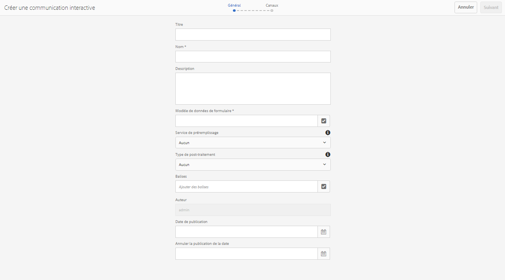
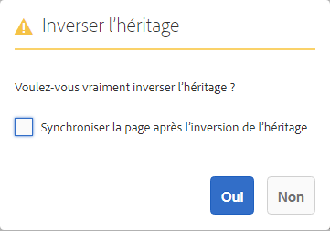

# Créer une communication interactive{#create-an-interactive-communication}

## Présentation {#overview}

Les communications interactives centralisent et gèrent la création, l’assemblage et la livraison de correspondances sécurisées, personnalisées et interactives. Utilisez l’impression en tant que canal principal pour le Web. Vous pouvez minimiser les efforts fournis lors de la création de la sortie web de la communication interactive.

### Conditions préalables {#prerequisites}

Les conditions préalables à la création d’une communication interactive sont les suivantes :

* Configurez un [modèle de données de formulaire](/help/forms/using/data-integration.md) contenant des données de test ou une source de données réelle, telle qu’une instance de Microsoft® Dynamics.
* Vérifiez que vous disposez des [fragments de Document](/help/forms/using/document-fragments.md).
* Vérifiez que vous disposez de [modèles pour l’impression et le canal Web](/help/forms/using/web-channel-print-channel.md).
* Assurez-vous de disposer du [thème](/help/forms/using/themes.md) requis pour le canal web.

## Créer une communication interactive {#createic}

1. Connectez-vous à l’instance d’auteur AEM et accédez à **[!UICONTROL Adobe Experience Manager]** > **[!UICONTROL Formulaires]** > **[!UICONTROL Formulaires et documents]**.
1. Appuyez sur **[!UICONTROL Créer]** et sélectionnez **[!UICONTROL Communication interactive]**. La page Créer une communication interactive s’affiche.

   

1. Saisissez les informations suivantes :  :

   * **[!UICONTROL Titre]** : entrez le titre de la communication interactive.
   * **[!UICONTROL Nom]** : Le nom de la communication interactive est dérivé du titre que vous saisissez. Modifiez-le, si nécessaire.
   * **[!UICONTROL Description]** : entrez une description de la communication interactive.
   * **[!UICONTROL Modèle]** de données de formulaire : Recherchez et sélectionnez le modèle de données de formulaire. Pour plus d’informations sur le modèle de données de formulaire, voir [Intégration de données AEM Forms](/help/forms/using/data-integration.md).

   * **[!UICONTROL Service]** de préremplissage : Sélectionnez le service de préremplissage pour récupérer les données et préremplir la communication interactive.
   * **[!UICONTROL Post-traitement Type]** : Vous pouvez sélectionner AEM ou Forms Workflow à déclencher lors de l’envoi de la communication interactive. Sélectionnez le type de processus à déclencher.

   * **[!UICONTROL Post-traitement]** : sélectionnez le nom du processus à déclencher. Lorsque vous sélectionnez AEM flux de travail, fournissez les options Chemin de pièce jointe, Chemin de mise en page, Chemin PDF, Chemin d’accès aux données d’impression et Chemin de données Web.
   * **[!UICONTROL Balises]** : Sélectionnez les balises à appliquer à la communication interactive. Vous pouvez également saisir un nom de balise nouveau ou personnalisé et appuyer sur Entrée pour créer la balise.
   * **[!UICONTROL Auteur]** : le nom de l’auteur est automatiquement extrait du nom de l’utilisateur connecté.
   * **[!UICONTROL Date de publication :]** entrez la date de publication de la communication interactive.
   * **[!UICONTROL Date]** d&#39;annulation de publication : Entrez la date d&#39;annulation de la publication de la communication interactive.

1. Appuyez sur **[!UICONTROL Next]** (Suivant). L’écran de spécification des informations relatives aux canaux web et d’impression s’affiche.
1. Entrez la commande suivante :

   * **[!UICONTROL Imprimer]** : sélectionnez cette option pour générer le canal d’impression de la communication interactive.
   * **[!UICONTROL Imprimer le modèle]** : Recherchez et sélectionnez un fichier XDP comme modèle d’impression.
   * **[!UICONTROL Web]** : Sélectionnez cette option pour générer le canal Web ou la sortie réactive d’Interactive Communication.
   * **[!UICONTROL Modèle]** Web de communication interactive : Recherchez et sélectionnez le modèle Web.
   * **** Thème et  **[!UICONTROL Sélectionner le thème]** : Recherchez et sélectionnez le thème pour mettre en forme le canal Web de la communication interactive. Pour plus d’informations, voir [Thèmes dans AEM Forms](/help/forms/using/themes.md).

   * **[!UICONTROL Utiliser l&#39;impression comme Principal pour le Canal]** Web : Sélectionnez cette option pour créer le canal Web en synchronisation avec le canal d’impression. L’utilisation du canal d’impression comme page principale du canal web garantit que le contenu et la liaison des données du canal web sont dérivés du canal d’impression et que les modifications apportées au canal d’impression sont répercutées sur le canal web lorsque vous appuyez sur Synchroniser. Les auteurs sont toutefois autorisés à interrompre l’héritage pour des composants spécifiques dans le canal web, selon les besoins. Pour plus d’informations, consultez [Synchroniser le canal web avec le canal d’impression](../../forms/using/create-interactive-communication.md#synchronize).
Si vous sélectionnez l&#39;option **[!UICONTROL Utiliser l&#39;impression en tant que Principal pour le Canal Web]**, vous pouvez sélectionner l&#39;un des modes suivants pour générer un canal Web :

      * **[!UICONTROL Mise en page]** automatique : Sélectionnez ce mode pour générer automatiquement des espaces réservés, du contenu et des liaisons de données pour le canal Web à partir du canal d&#39;impression.
      * **[!UICONTROL Organiser]** manuellement : Sélectionnez ce mode pour sélectionner manuellement et ajouter des éléments de canal d&#39;impression au canal Web à l&#39;aide du contenu maître disponible dans l&#39;onglet  **[!UICONTROL Sources de]** données. Pour plus d&#39;informations, voir [Sélectionner des éléments de canal d&#39;impression pour créer du contenu de canal Web](#selectprintchannelelements).

   Pour plus d&#39;informations sur le canal imprimé et le canal Web, voir [canal d&#39;impression et canal Web](/help/forms/using/web-channel-print-channel.md).

1. Appuyez sur **[!UICONTROL Create]** (Créer). La communication interactive est créée et une boîte d’alerte s’affiche. Appuyez sur **[!UICONTROL Modifier]** pour début de la création du contenu de la communication interactive comme expliqué dans [Ajouter le contenu à l&#39;aide de l&#39;interface utilisateur de création de communication interactive](#step2). Vous pouvez également appuyer sur **[!UICONTROL Terminé]** et choisir de modifier la communication interactive ultérieurement.

## Ajouter du contenu à la communication interactive {#step2}

Après avoir créé une communication interactive, vous pouvez utiliser l’interface de création de communication interactive pour construire son contenu.

Pour plus d’informations sur l’interface de création de communications interactives, voir [Introduction à la création de communications interactives](/help/forms/using/introduction-interactive-communication-authoring.md).

1. L’interface de création Interactive Communication est lancée lorsque vous appuyez sur Modifier comme mentionné dans [Créer une communication interactive](#createic). Vous pouvez également accéder à une ressource de communication interactive existante sur AEM, la sélectionner et appuyer sur **[!UICONTROL Modifier]** pour lancer l’interface de création de communication interactive.

   Par défaut, le canal d’impression de la communication interactive s’affiche, sauf si la communication interactive est en canal Web uniquement. Le canal d’impression de la communication interactive affiche les zones de cible disponibles dans le modèle de canal XDP/impression sélectionné. Vous pouvez ajouter des composants ou des ressources dans ces zones et champs cibles.

1. Le canal d&#39;impression étant sélectionné, sélectionnez l&#39;onglet **[!UICONTROL Composants]**. Les composants suivants sont disponibles dans le canal d’impression :

   | **Composant** | **Fonctionnalité** |
   |---|---|
   | Graphique | Ajoute un graphique que vous pouvez utiliser dans la communication interactive pour la représentation visuelle des données bidimensionnelles récupérées à partir d’une collection de modèles de données de formulaire. Pour plus d&#39;informations, voir [Utilisation de graphiques dans les communications interactives](/help/forms/using/chart-component-interactive-communications.md). |
   | Fragment de document | Permet d’ajouter un composant réutilisable, tel que du texte, une liste ou une condition, à une communication interactive. Le composant ajouté peut être basé sur un modèle de données de formulaire ou sans modèle de données de formulaire. |
   | Image | Permet d’insérer une image. |

   Faites glisser les composants dans votre communication interactive et configurez-les selon les besoins.

   Vous pouvez également utiliser les opérations d&#39;annulation et de rétablissement lors de la création d&#39;une communication interactive pour les canaux Web et d&#39;impression.

   Utilisez l’opération d’annulation pour ignorer la dernière action exécutée et l’opération de rétablissement pour incorporer à nouveau l’action ignorée. Par exemple, si vous avez inséré une image ou créé une liaison de données dans une communication interactive et que vous devez la supprimer, utilisez l’opération d’annulation.

   

   Les options d’annulation et de rétablissement s’affichent sur la barre d’outils de la page d’interface utilisateur de création. L’option Annuler s’affiche uniquement après avoir exécuté une action. L’option Rétablir s’affiche sur la barre d’outils de la page uniquement après avoir effectué une opération d’annulation. Ces actions sont réinitialisées lors de l’actualisation de la page.

1. Lorsque le canal d’impression est sélectionné, accédez à l’onglet **[!UICONTROL Ressources]** et appliquez le filtre pour afficher uniquement les ressources souhaitées.

   L’explorateur d’actifs vous permet également de faire glisser des ressources directement dans les zones de la cible de communications interactives.

   

1. Glissez-déposez les fragments de document dans la communication interactive. Vous trouverez ci-dessous les types de fragments de document que vous pouvez utiliser dans le canal d’impression de la communication interactive.

<table>
 <tbody>
  <tr>
   <td><strong>Type de fragment de document</strong></td>
   <td><strong>Exemple d’objectif</strong></td>
  </tr>
  <tr>
   <td><a href="/help/forms/using/texts-interactive-communications.md" target="_blank">Text (Texte)</a></td>
   <td>Texte d’ajout de l’adresse électronique du destinataire, et du corps du texte de la lettre </td>
  </tr>
  <tr>
   <td><a href="/help/forms/using/conditions-interactive-communications.md" target="_blank">Condition</a></td>
   <td>Condition pour l’ajout de l’image d’en-tête adaptée à la communication en fonction du type de stratégie : standard ou premium.   </td>
  </tr>
  <tr>
   <td>Liste</td>
   <td>Groupe de fragments du document, notamment le texte, les conditions, les autres listes et les images.   </td>
  </tr>
 </tbody>
</table>

Vous pouvez également remplacer la liaison entre une zone de cible et un fragment de document en déposant le nouveau fragment sur la zone de cible à l’aide de l’onglet **[!UICONTROL Ressources]**. L’ombrage de couleur bleue de la zone de cible lors du déplacement du fragment indique que le fragment de document peut être déposé dans la zone de cible.

Pour plus d’informations sur les fragments de document, reportez-vous à la section [Fragments de document](/help/forms/using/document-fragments.md).

L’interface de création vous permet de faire la distinction entre les champs et variables liés et non liés au sein d’une communication interactive. L’interface met en surbrillance les champs et variables non liés à l’aide d’une bordure orange.

En outre, lorsque vous placez le pointeur de la souris sur ces éléments, une info-bulle s’affiche avec le message Champ (Unbound) ou Variable (Unbound).

Une variable non liée utilisée dans un fragment de document peut parfois ne pas s’afficher dans l’interface de création. Cela peut se produire en raison d’une règle de texte inséré dans un fragment de document ou dans le cas d’un fragment de condition. Dans ce cas, une info-bulle, surlignée en bleu, s’affiche dans le fragment de document. L’info-bulle affiche le nombre de variables non liées utilisées dans un fragment de document.

Appuyez sur le fragment de document, appuyez sur  (Configurer), puis sur **[!UICONTROL Properties]** dans le panneau latéral de la communication interactive. La section **[!UICONTROL Variables et objets de modèle de données]** liste les variables, y compris les variables masquées, et les objets de modèle de données utilisés dans les fragments de document. Utilisez l&#39;icône  (Modifier) en regard de chaque objet ou variable de modèle de données pour modifier les propriétés.

1. Pour configurer la liaison des variables, appuyez sur une variable et sélectionnez  (Configurer), puis configurez les propriétés de liaison dans le panneau Propriétés de la barre latérale.

   * **Aucun** : l’agent remplira la valeur de la variable.
   * **Fragment de texte** : si cette option est sélectionnée, vous pouvez rechercher et sélectionner un fragment de document texte dont le contenu est rendu dans le champ. Seuls ces fragments de document texte peuvent être liés à des variables qui ne contiennent aucune variable.
   * **Objet de modèle de données** : sélectionnez une propriété de modèle de données de formulaire dont la valeur est renseignée dans le champ.
   * **Valeur par défaut :** vous pouvez définir une valeur par défaut pour la variable à l’aide de ce champ. La valeur s’affiche lorsque vous prévisualisation la communication interactive ou dans l’interface utilisateur de l’agent.
   * **Modèle d’affichage :** vous pouvez également définir un format d’affichage pour une variable. Sélectionnez l’une des options prédéfinies dans la liste déroulante **Type** pour appliquer un format d’affichage à une variable. Sélectionnez **Personnalisé** pour définir un modèle d’affichage qui n’est pas disponible dans la liste. Pour plus d’informations, voir [Formats d’affichage des données](../../forms/using/create-interactive-communication.md#datadisplaypatterns).

   Accédez à [Variables et objets de modèle de données](../../forms/using/create-interactive-communication.md#hiddenvariables) pour configurer la liaison des variables masquées dans le fragment de document.

   Vous pouvez également faire glisser des éléments de source de données ou des fragments de document de texte pour configurer la liaison de variables.  Pour créer une liaison avec l’un des éléments de source de données, sélectionnez l’onglet **Sources de données** et faites glisser l’élément vers le nom de la variable. L’élément et la variable de source de données doivent être du même type pour configurer la liaison avec succès. Si vous faites glisser un élément de source de données vers une variable déjà liée, le nouvel élément remplace le précédent pour créer une nouvelle liaison avec la variable. De même, sélectionnez l’onglet **Ressources** et faites glisser le fragment de document de texte vers le nom de la variable pour configurer la liaison entre eux. Le fragment de document de texte ne doit contenir aucune variable.

1. Pour l’ajout d’un tableau, lorsque le canal d’impression est sélectionné, appliquez le filtre pour afficher uniquement les fragments de mise en page dans l’onglet **[!UICONTROL Ressources]**. Glissez-déposez le fragment de mise en page requis dans la communication interactive. Un fragment de mise en page est basé sur un fichier XDP et peut être utilisé pour créer des mises en page graphiques ou des tableaux statiques et dynamiques dans Interactive Communication qui sont renseignés avec des données dynamiques.

   Exemple : un tableau de mise en page pour l’affichage de la prime brute, du pourcentage de remise fidélité et de la disponibilité de l’assistance routière d’urgence pour les anciennes et les nouvelles stratégies.

   Pour plus d’informations sur les fragments de mise en page, reportez-vous à la section [Fragments de document](/help/forms/using/document-fragments.md).

1. Lorsque le canal d’impression est sélectionné, appliquez le filtre d’affichage des images dans l’onglet **[!UICONTROL Ressources]**. Glissez et déposez les images requises dans la communication interactive, par exemple pour le logo de l’entreprise.

   Ensuite, gérez les éléments suivants dans la communication interactive :

   * [Ajout et configuration de graphiques](/help/forms/using/chart-component-interactive-communications.md)
   * [Synchronisation du canal web avec le canal d’impression](../../forms/using/create-interactive-communication.md#synchronize)

      * Synchronisation automatique
      * Annuler l’héritage
      * Réactiver l’héritage
      * Synchroniser
   * [Pièces jointes et accès à la bibliothèque](../../forms/using/create-interactive-communication.md#attachmentslibrary)
   * [Propriétés du champ XDP/mise en page](../../forms/using/create-interactive-communication.md#xdplayoutfieldproperties)
   * [Ajouter des règles aux composants](../../forms/using/create-interactive-communication.md#rules)

1. Accédez à **[!UICONTROL Canal Web]**. Le canal Web s’affiche dans l’éditeur de communication interactive. Lorsque vous passez du canal d’impression au canal web pour la première fois, la synchronisation automatique a lieu. Pour plus d’informations, voir [Synchronisation du canal Web à partir du canal d’impression](../../forms/using/create-interactive-communication.md#synchronize).

   Comme nous utilisons le canal d’impression comme base pour le canal web dans cet exemple, les espaces réservés, le contenu et la liaison de données du canal d’impression sont synchronisés avec le canal web. Cependant, vous pouvez modifier et personnaliser le contenu spécifique dans le canal Web. [Annulez l’](#cancelinheritance) héritage des zones de cible et des variables générées à l’aide du canal d’impression pour pouvoir personnaliser le contenu.

   

   Appuyez sur le fragment de document, appuyez sur  (Configurer), puis sur **[!UICONTROL Properties]** dans le panneau latéral de la communication interactive. La section **[!UICONTROL Variables et objets de modèle de données]** liste les variables, y compris les variables masquées, et les objets de modèle de données utilisés dans les fragments de document. Utilisez l&#39;icône  (Modifier) en regard de chaque objet ou variable de modèle de données pour modifier les propriétés. En outre, pour les fragments de document qui ont été générés [automatiquement](#synchronize) dans le canal Web à l&#39;aide du canal d&#39;impression, utilisez l&#39;icône  (Annuler l&#39;héritage) en regard de chaque objet de modèle de données et de chaque variable dans [annuler l&#39;héritage](#cancelinheritance) et pour pouvoir les modifier.

1. Pour ajouter des composants supplémentaires dans le canal web, lorsque le canal web est sélectionné, appuyez sur **[!UICONTROL Composants]**. Faites glisser les composants dans le canal Web de votre communication interactive selon les besoins et procédez à leur configuration.

   | Composants | Fonctionnalité |
   |---|---|
   | Graphique | Ajoute un graphique que vous pouvez utiliser dans la communication interactive pour la représentation visuelle des données bidimensionnelles récupérées à partir d’une collection de modèles de données de formulaire. Pour plus d’informations, voir [Utilisation du composant de graphique](../../forms/using/chart-component-interactive-communications.md). |
   | Fragment de document | Permet d’ajouter un composant, un texte, une liste ou une condition réutilisable à une communication interactive. Le composant réutilisable que vous ajoutez à une communication interactive peut être basé sur un modèle de données de formulaire ou sans modèle de données de formulaire. |
   | Image | Permet d’insérer une image. |
   | Panneau | Permet d’ajouter un [panneau](../../forms/using/create-interactive-communication.md#add-panel-component-to-the-web-channel) à la communication interactive. |
   | Tableau | Ajoute un tableau qui permet de classer les données par lignes et par colonnes. |
   | Zone cible | Insère une zone cible dans un canal web pour organiser les composants spécifiques au canal web. La zone cible est un conteneur standard permettant de regrouper des composants spécifiques au canal web. |
   | Text (Texte) | Ajoute le texte enrichi au canal web d’une communication interactive. Le texte peut également utiliser des objets de modèle de données de formulaire pour rendre le contenu dynamique. |
   | Bouton | Permet d’ajouter un [bouton](../../forms/using/create-interactive-communication.md#add-button-component-to-the-web-channel) à la communication interactive. Vous pouvez utiliser le composant Bouton pour accéder à d’autres ressources Interactive Communications, de formulaires adaptatifs, telles que des images ou des fragments de document, ou à une URL externe. |
   | Séparateur | Permet d’insérer une ligne horizontale dans une communication interactive. Utilisez ce composant pour distinguer les sections d&#39;une correspondance. Par exemple, vous pouvez utiliser le composant Séparateur pour faire la distinction entre les sections Détails du client et Détails de carte de crédit dans un relevé de carte de crédit. |

1. Au besoin, insérez des ressources dans votre canal web.

   Vous pouvez [prévisualisation votre communication interactive](#previewic) pour voir à quoi ressemblent les sorties imprimées et Web de la communication interactive et continuer à apporter les modifications nécessaires.

## Prévisualiser la communication interactive {#previewic}

Vous pouvez utiliser l&#39;option **Prévisualisation** pour évaluer l&#39;aspect de la communication interactive. Le canal Web de la communication interactive offre également une option permettant d’émuler l’expérience d’une communication interactive pour divers périphériques. Par exemple, iPhone, iPad et appareils de bureau. Vous pouvez utiliser les options **Prévisualisation** et **Émulateur**  conjointement les unes aux autres pour prévisualisation des sorties Web pour des périphériques de différentes tailles d’écran. Les exemples de données dans l’aperçu sont renseignés à partir du modèle de données de formulaires spécifié.

1. Sélectionnez le canal (d’impression ou web) à prévisualiser et appuyez sur Aperçu. La communication interactive s’affiche.

   >[!NOTE]
   >
   >L’aperçu est rempli avec les exemples de données du modèle de données de formulaire spécifié. Pour plus d’informations sur l’aperçu de la communication interactive avec d’autres données ou sur l’utilisation du service de préremplissage, voir [Utiliser le modèle de données de formulaire](/help/forms/using/using-form-data-model.md) et [Utiliser le modèle de données de formulaire](/help/forms/using/work-with-form-data-model.md).

1. Pour le canal Web, utilisez  pour vue de l’aspect de la communication interactive sur divers périphériques.

   

De plus, vous pouvez [Préparer et envoyer des communications interactives à l&#39;aide de l&#39;interface utilisateur de l&#39;agent](/help/forms/using/prepare-send-interactive-communication.md).

## Configurer les propriétés dans Interactive Communication {#configure-properties-in-interactive-communication}

### Pièces jointes et accès à la bibliothèque {#attachmentslibrary}

Dans le canal d’impression, vous pouvez configurer les pièces jointes et l’accès à la bibliothèque pour permettre à l’agent de gérer les pièces jointes dans l’interface utilisateur de l’agent pour la communication interactive :

1. Dans le canal d’impression, mettez en surbrillance le conteneur de documents et appuyez sur **Propriétés**.

   

   Le panneau Propriétés s’affiche dans la barre latérale.

   

1. Développez les **pièces jointes** et spécifiez les propriétés suivantes :

   * **[!UICONTROL Autoriser l’accès à la bibliothèque]** : sélectionnez cette option pour permettre à l’agent d’accéder à la bibliothèque dans l’interface utilisateur de l’agent. Si cette option est activée, l’agent peut ajouter des fichiers depuis la bibliothèque tout en préparant la communication interactive.
   * **[!UICONTROL Autoriser la réorganisation des pièces jointes]** : sélectionnez cette option pour permettre à l’agent de réorganiser les pièces jointes avec la communication interactive.
   * **[!UICONTROL Nombre max de pièces jointes autorisé]** : spécifiez le nombre maximum de pièces jointes autorisées avec la communication interactive.
   * **[!UICONTROL Fichiers à joindre]** : Appuyez sur  **** Ajouter et parcourez l’écran pour sélectionner les fichiers à joindre et spécifiez les éléments suivants :

      * **[!UICONTROL Joindre ce fichier au document par défaut]** : vous pouvez modifier cette option si seule la pièce jointe n’est pas obligatoire.
      * **[!UICONTROL Obligatoire :]** l’agent ne pourra pas supprimer la pièce jointe dans l’interface utilisateur de l’agent.

   

1. Appuyez sur **[!UICONTROL Done]** (Terminé). 

### Propriétés du champ XDP/mise en page {#xdplayoutfieldproperties}

1. Lors de la modification du canal d’impression d’une communication interactive, passez la souris sur un champ, qui est créé dans le modèle canal d’impression, et sélectionnez  (Configurer).

   La boîte de dialogue Propriétés s’affiche dans la barre latérale.

   

1. Indiquez les informations suivantes :

   * **[!UICONTROL Nom]** : nom du nœud JCR.
   * **[!UICONTROL Titre]** : entrez un titre qui sera visible pour l’agent dans l’interface utilisateur de l’agent et dans l’arborescence du conteneur de documents.
   * **[!UICONTROL Type de liaison]** : sélectionnez l’un des types de liaison suivants pour le champ.

      * Aucun : l’agent remplira la valeur de la propriété.
      * Fragment de texte : si cette option est sélectionnée, vous pouvez rechercher et sélectionner un fragment de document texte dont le contenu est rendu dans le champ. Vous pouvez également faire glisser le fragment de document de texte vers le nom du champ pour configurer la liaison entre eux. Le fragment de document de texte ne doit contenir aucune variable.
      * Objet de modèle de données : sélectionnez une propriété de modèle de données de formulaire dont la valeur est renseignée dans le champ. Vous pouvez également sélectionner l’onglet **Sources de données** et faire glisser la propriété sur le champ.
   * **[!UICONTROL Valeurs par défaut]** : la valeur par défaut veille à ce que le champ ne soit pas vide lorsqu’aucune valeur n’est fournie par l’objet de modèle de données ou le fragment de texte spécifié. Si aucun type de liaison de données n’est défini, la valeur par défaut est préremplie dans la zone.
   * **[!UICONTROL Modèle]** d&#39;affichage : Vous pouvez également définir un format d’affichage pour un champ. Sélectionnez l’une des options prédéfinies dans la liste déroulante **Type** pour appliquer un format d’affichage à un champ. Sélectionnez **Personnalisé** pour définir un modèle d’affichage qui n’est pas disponible dans la liste. Pour plus d’informations, voir [Formats d’affichage des données](../../forms/using/create-interactive-communication.md#datadisplaypatterns).

   * **[!UICONTROL Modifiable par l’agent]** : sélectionnez cette option pour permettre à l’agent de modifier la valeur du champ de l’interface utilisateur de l’agent. Ce paramètre n’est pas applicable si le type de liaison est Fragment de texte.
   * **[!UICONTROL Libellé]** : spécifiez une chaîne de texte affichée avec le champ dans l’interface utilisateur de l’agent. Ce paramètre n’est pas applicable si le type de liaison est Fragment de texte.
   * **[!UICONTROL Info-bulle]** : Entrez une chaîne de texte visible lorsque vous passez la souris sur l&#39;agent dans l&#39;interface utilisateur de l&#39;agent. Ce paramètre n’est pas applicable si le type de liaison est Fragment de texte.
   * **[!UICONTROL Obligatoire]** : sélectionnez cette option pour que le champ soit obligatoire pour l’agent. Ce paramètre n’est pas applicable si le type de liaison est Fragment de texte.
   * **[!UICONTROL Permettre des lignes multiples]** : sélectionnez ce champ pour activer les lignes de texte multiples comme entrée dans le champ. Ce paramètre n’est pas applicable si le type de liaison est Fragment de texte.

1. Appuyez sur .

### Modèles d&#39;affichage des données {#datadisplaypatterns}

L’interface de création vous permet de définir des modèles d’affichage de données pour les champs, les variables et les éléments de modèle de données de formulaire disponibles lors de la création d’une communication interactive pour l’impression et les canaux Web.

Pour configurer le modèle d’affichage des données, appuyez sur l’élément, sélectionnez  (Configurer) et configurez le modèle d’affichage dans le panneau **[!UICONTROL Propriétés]** de la barre latérale. Sélectionnez une option prédéfinie dans la liste déroulante **[!UICONTROL Type]** pour vue le modèle associé au type sélectionné. Sélectionnez **[!UICONTROL Personnalisé]** dans la liste déroulante **[!UICONTROL Type]** pour définir un modèle qui n&#39;est pas disponible dans la liste. La modification des valeurs dans le champ **[!UICONTROL Modèle]** modifie automatiquement le type en **[!UICONTROL Personnalisé]**.

Pour appliquer le modèle d’affichage, le nombre de caractères ou de chiffres définis dans le champ Modèle doit correspondre ou dépasser les caractères ou chiffres définis dans la valeur des champs, variables et éléments du modèle de données de formulaire. Pour plus d’informations, voir [exemple](../../forms/using/create-interactive-communication.md#greaternumberofdigits).

Vous pouvez redéfinir le modèle d’affichage d’un champ, d’une variable ou d’un élément de modèle de données de formulaire après avoir généré du contenu Web à partir du canal d’impression. Par conséquent, un élément peut avoir différents modèles d’affichage définis pour les canaux Web et imprimés. Si vous ne définissez pas de modèle d’affichage pour un élément dans le canal d’impression et que vous générez automatiquement du contenu Web à l’aide du canal d’impression, la liaison de données définie pour l’élément dans le canal d’impression définit les options de modèle d’affichage disponibles dans la liste déroulante **[!UICONTROL Type]**. Si aucune liaison n’est définie pour l’élément, le type de données de l’élément définit les options de modèle d’affichage disponibles. Par exemple, si vous créez une liaison de données de type Numéro pour un élément du canal d’impression, les options de modèle d’affichage disponibles dans la liste déroulante **[!UICONTROL Type]** sont de type Numéro dans divers formats.

Passez en mode **Prévisualisation** ou ouvrez l&#39;interface utilisateur de l&#39;agent pour vue au modèle d&#39;affichage appliqué à ces éléments.

Le tableau suivant liste un exemple des valeurs qui s’affichent suite à la définition du modèle d’affichage des données pour une variable :

| Type | Valeur par défaut | Modèle d’affichage | Afficher la valeur | Description |
|---|---|---|---|---|
| Numéro de sécurité sociale | 123456789 | text{999-99-9999} | 123-45-6789 | Le nombre de chiffres dans le champ de valeur par défaut correspond au nombre de chiffres dans le champ Modèle. La valeur basée sur le modèle s’affiche correctement. |
| Numéro de sécurité sociale | 1234567 | text{999-99-9999} | 1-23-4567 | Le nombre de chiffres dans le champ de valeur par défaut est inférieur au nombre de chiffres dans le champ Modèle. Le modèle s’applique aux 7 chiffres disponibles. |
| Numéro de sécurité sociale | 1234567890 | text{999-99-9999} | 1234567890 | Le nombre de chiffres dans le champ de valeur par défaut est supérieur au nombre de chiffres dans le champ Modèle. Par conséquent, la valeur d’affichage n’est pas modifiée. |

Si aucun modèle d’affichage n’est spécifié pour une variable ou un élément de modèle de données de formulaire, la [configuration de fragment de document global](https://helpx.adobe.com//experience-manager/6-5/forms/using/interactive-communication-configuration-properties.html) est utilisée par défaut.

Si vous n’appliquez pas de modèle d’affichage à une variable de type de données numérique, la prévisualisation d’impression affiche le modèle en fonction de la configuration globale du fragment de document. Si vous appliquez des modifications à la configuration de fragment de document global par défaut, l’interface utilisateur de l’agent affiche toujours le modèle en fonction des séparateurs par défaut définis pour les paramètres régionaux.

De même, pour les champs, si le modèle d’affichage n’est pas spécifié, le modèle défini lors de la création du modèle d’impression (XDP) est appliqué au champ. S’il n’existe aucun modèle lors de la création du modèle d’impression, les modèles par défaut basés sur les spécifications XFA sont appliqués aux champs.

En outre, si le modèle d’affichage spécifié est incorrect ou ne peut pas être appliqué, les modèles par défaut basés sur les spécifications XFA sont appliqués aux champs, variables ou éléments de modèle de données de formulaire.

## Appliquer des règles à des composants de communication interactive {#rules}

Pour conditionnaliser les composants ou le contenu dans la communication interactive, appuyez sur le composant/élément de contenu et sélectionnez  (Créer une règle) pour lancer l’éditeur de règles.

Pour en savoir plus, voir:

* [Éditeur de règles](/help/forms/using/rule-editor.md)
* [Présentation de la création de communications interactives](/help/forms/using/introduction-interactive-communication-authoring.md)

## Utilisation des tableaux {#tables}

### Tableaux dynamiques dans la communication interactive {#dynamic-tables-in-interactive-communication}

Vous pouvez ajouter des tableaux dynamiques dans la communication interactive à l’aide de fragments de mise en page. Les étapes suivantes utilisent un exemple de relevé de carte de crédit pour illustrer l’utilisation d’un fragment de mise en page dans le but de créer un tableau dynamique dans une communication interactive.

1. Assurez-vous que le fragment de mise en page nécessaire à la création du tableau est disponible dans AEM.
1. Dans le canal d’impression de votre communication interactive, faites glisser et déposez un fragment de mise en page (avec un tableau à plusieurs colonnes) dans une zone de Cible à partir du navigateur de ressources.

   

   Un tableau s’affiche dans la zone Communication interactive.

   

1. Spécifiez la liaison de données pour chacune des cellules du tableau. Pour créer une ligne répétable, insérez les propriétés du modèle de données de formulaire dans la ligne appartenant à une propriété de collection commune.

   1. Appuyez sur une cellule du tableau et sélectionnez  (Configurer).

      La boîte de dialogue Propriétés s’affiche dans la barre latérale.

      

   1. Configurez les propriétés :

      * **[!UICONTROL Nom]** : nom du nœud JCR.
      * **[!UICONTROL Titre]** : Saisissez un titre qui sera visible dans l’éditeur de communication interactive.
      * **[!UICONTROL Type de liaison]** : sélectionnez l’un des types de liaison suivants pour le champ.

         * **[!UICONTROL Aucune]**
         * **[!UICONTROL Objet]** de modèle de données : La valeur d’une propriété de modèle de données de formulaire est renseignée dans le champ. Vous pouvez également sélectionner l’onglet **Sources de données** et faire glisser la propriété sur le champ.
      * **[!UICONTROL Objet]** de modèle de données : Propriété de modèle de données de formulaire dont la valeur est renseignée dans le champ.
      * **[!UICONTROL Valeur]** par défaut : La valeur par défaut permet de s’assurer que le champ n’est pas vide lorsqu’aucune valeur n’est fournie par l’objet de modèle de données spécifié. La valeur par défaut est préremplie dans le champ.

      * **[!UICONTROL Modifiable par l’agent]** : sélectionnez cette option pour permettre à l’agent de modifier la valeur du champ de l’interface utilisateur de l’agent.
   1. Appuyez sur .

1. Prévisualisation la communication interactive pour afficher le tableau rendu avec les données.

   

### Tableaux de canal web uniquement {#webchanneltables}

Appuyez sur le panneau racine du modèle Web et appuyez sur **+** pour ajouter un composant **Tableau** à la communication interactive. Un tableau comprenant deux lignes est inséré dans la communication interactive. La première rangée du tableau représente l’en-tête Tableau.

#### Ajouter des lignes et des colonnes au tableau {#addrowscolumnstable}

**Pour ajouter ou supprimer des colonnes :**

1. Appuyez sur la zone de texte par défaut de la rangée d’en-tête du tableau pour vue à la barre d’outils des composants.
1. Sélectionnez **Ajouter la colonne** ou **Supprimer la colonne** pour ajouter ou supprimer des colonnes de tableau, respectivement.

**Pour ajouter ou supprimer des rangées :**

1. Appuyez sur l’une des rangées du tableau pour vue à la barre d’outils des composants. Vous pouvez également sélectionner une rangée de tableau à l’aide de l’explorateur de contenu dans le panneau latéral d’Interactive Communication.
1. Sélectionnez **Ajouter la rangée** ou **Supprimer la rangée** pour ajouter ou supprimer des rangées de tableau, respectivement. Utilisez les options **Déplacer vers le haut** et **Déplacer vers le bas** disponibles dans la barre d’outils pour réorganiser les rangées du tableau.

**A.** Ajouter la ligne  **B.** Supprimer la ligne  **C.** Monter vers  **D.** Descendre vers le bas

#### Ajouter ou modifier du texte dans les cellules du tableau {#addedittexttable}

1. Sélectionnez la zone de texte par défaut dans la cellule du tableau et appuyez sur  (Modifier).
1. Saisissez le texte dans la cellule du tableau et appuyez sur  pour l’enregistrer.

#### Créer une liaison entre les cellules du tableau et les éléments d’objet du modèle de données {#createbindingtablecells}

1. Sélectionnez la zone de texte par défaut dans la ligne du tableau et appuyez sur  (Modifier).
1. Appuyez sur la liste déroulante Objets de modèle de données et sélectionnez la propriété.
1. Appuyez sur pour enregistrer et créer une liaison entre la cellule de tableau et la propriété d’objet de modèle de données.

#### Créer un hyperlien pour le texte dans la cellule de tableau {#createhyperlinktable}

1. Sélectionnez la zone de texte par défaut dans la cellule du tableau et appuyez sur  (Modifier).
1. Sélectionnez le texte dans la cellule du tableau et appuyez sur l’icône Hyperlien.
1. Spécifiez l’URL dans le champ **Chemin**.
1. Appuyez sur  pour enregistrer les propriétés de l’hyperlien.

#### Créer des tables dynamiques {#createdynamictables}

Vous pouvez créer un tableau dynamique de canal Web uniquement dans une communication interactive à l’aide d’une propriété de modèle de données de type collection. Un tel tableau est une représentation des propriétés enfants d’une propriété de collection. Vous ne pouvez modifier que les propriétés de formatage des différentes cellules du tableau.

1. Accédez au canal Web, puis choisissez d’afficher le navigateur Sources de données.
1. Glissez-déposez une propriété de collection dans un sous-formulaire. Un tableau est créé dans le sous-formulaire.
1. Prévisualisez le tableau dans l’aperçu web de la communication interactive.

#### Trier les colonnes d&#39;un tableau {#sortcolumns}

Vous pouvez trier les données en fonction de n’importe quelle colonne d’un tableau dans la communication interactive. Les valeurs de la colonne peuvent être triées par ordre croissant ou décroissant.

Le tri peut être appliqué aux colonnes de tableaux contenant :

* Texte statique
* Propriétés de l’objet de modèle de données
* Combinaison de texte statique et de propriétés d’objet de modèle de données

Pour activer le tri :

1. Sélectionnez le tableau et appuyez sur  (Configurer). Vous pouvez également sélectionner le tableau à l’aide du navigateur **Contenu** dans le panneau latéral de la communication interactive.
1. Sélectionnez **Activer le tri.**
1. Appuyez sur  pour enregistrer les propriétés du tableau. Les icônes de tri, les flèches vers le haut et vers le bas, dans les en-têtes de colonnes, indiquent que le tri a été activé.

   

1. Passez au mode **Prévisualisation** pour vue de la sortie. Le tableau est automatiquement trié en fonction de la première colonne du tableau.
1. Cliquez sur l’en-tête de colonne pour trier les valeurs en fonction de la colonne.

   Un en-tête de colonne avec une flèche vers le haut représente que :

   * est triée en fonction de cette colonne.
   * les valeurs de la colonne s’affichent dans l’ordre croissant.

   

   De même, un en-tête de colonne avec une flèche vers le bas représente que les valeurs de la colonne sont affichées dans l’ordre décroissant.

## Modifier les propriétés de communication interactive {#edit-interactive-communication-properties}

Une fois que vous avez créé une communication interactive, vous pouvez modifier ses propriétés ultérieurement.

Utilisez la page **Propriétés** pour :

* Modifiez les valeurs des champs spécifiés lors de la création de la communication interactive, tels que Titre et Description.
* Ajouter ou supprimer un canal Web pour une communication interactive existante.
* Prévisualisation, téléchargement ou suppression de la communication interactive
* Ouvrez l&#39;[interface utilisateur de l&#39;agent](/help/forms/using/prepare-send-interactive-communication.md).

Pour accéder à la page **Propriétés** :

1. Connectez-vous à l’instance d’auteur AEM et accédez à **Adobe Experience Manager** > **Formulaires** > **Formulaires et documents**.
1. Sélectionnez la communication interactive et appuyez sur **Propriétés**.
1. Sélectionnez l’onglet **Général** pour modifier les champs **Titre** et **Description**.

### Ajouter ou supprimer le canal Web {#add-or-delete-the-web-channel}

Exécutez les étapes suivantes pour ajouter le canal Web d’une communication interactive existante :

1. Sur la page **Propriétés**, sélectionnez l&#39;onglet **Canaux**.
1. Cochez la case **Web** et sélectionnez un modèle pour le canal Web.
1. Sélectionnez **Utiliser l&#39;impression comme Principal pour le Canal Web** pour activer la synchronisation entre le canal Web et le canal d&#39;impression.
1. Appuyez sur **Enregistrer et fermer** pour enregistrer les modifications.

   De même, vous pouvez appuyer sur la case **Web** de l&#39;onglet **Canaux** pour supprimer le canal Web de la communication interactive.

## Composant Bouton d&#39;Ajoute au canal Web {#add-button-component-to-the-web-channel}

Vous pouvez ajouter un bouton en tant que composant au canal Web de la communication interactive. Définissez des règles à l’aide de l’[éditeur de règles](../../forms/using/rule-editor.md) pour pouvoir accéder à d’autres communications interactives, formulaires adaptatifs, autres ressources telles que des images ou des fragments de document, ou à une URL externe lorsque vous appuyez sur le bouton.

Pour ajouter un bouton et définir des règles sur celui-ci :

1. Appuyez sur le panneau racine du modèle Web et appuyez sur **+** pour ajouter le composant **Button** à la communication interactive.
1. Appuyez sur le composant de bouton et appuyez sur  pour définir des règles sur le bouton.
1. Dans la section **Lorsque**, sélectionnez **a cliqué** dans l’état de la liste déroulante des boutons.
1. Dans la section **Alors** :

   1. Sélectionnez une action dans la liste déroulante. Par exemple, sélectionnez **Naviguer jusqu’à** comme type d’action.

   1. Spécifiez l’URL de la communication interactive, du formulaire adaptatif, d’un fichier ou d’une page Web. Par exemple, spécifiez l’URL au format suivant pour accéder à une autre communication interactive : https://&lt;nom du serveur>:&lt;port>/editor.html/content/forms/af/&lt;nom de la communication interactive>/canaux/&lt;nom du canal - impression ou web>.html
   1. Spécifiez l’option permettant d’ouvrir le fichier dans le même onglet, le nouvel onglet ou la nouvelle fenêtre.
   1. Appuyez sur **Terminé**, puis sur **Fermer** pour enregistrer la règle.

   De même, vous pouvez sélectionner d’autres options disponibles dans la liste déroulante de type d’action, telles que le service d’appel et le formulaire d’envoi. Pour plus d’informations, voir [éditeur de règles](../../forms/using/rule-editor.md).

1. Prévisualisation de la communication interactive et appuyez sur le bouton pour vue de la communication interactive, du formulaire adaptatif, d’un fichier ou d’une page Web spécifiée à l’étape 4 b).

## Ajouter le composant Panneau au canal Web {#add-panel-component-to-the-web-channel}

Le composant Panneau est un espace réservé pour regrouper d’autres composants et contrôle la disposition d’un groupe de composants (accordéons et onglets) dans la communication interactive. Un composant de panneau vous permet également de permettre la répétition d’un groupe de composants pour l’utilisateur final, par exemple dans plusieurs entrées requises pour remplir les informations d’identification.

Pour ajouter un composant Panneau au canal Web, procédez comme suit :

1. Insérez le composant **Panneau** dans le canal Web à l’aide de l’une des options suivantes :

   * Appuyez sur un composant, appuyez sur **+** et sélectionnez le composant **Panneau**.

   * Dans le panneau de navigation **Composant**, faites glisser et déposez le composant **Panneau** sur la communication interactive.

   * Appuyez sur le **panneau** dans le panneau de navigation **Contenu** et appuyez sur **Ajouter le panneau enfant**. La sélection de l&#39;option **Ajouter le panneau enfant** affiche la boîte de dialogue **Ajouter le panneau enfant**. Saisissez le titre et une description et un nom facultatifs pour le composant Panneau.

1. Appuyez sur le panneau à partir du navigateur **Contenu** pour effectuer d’autres actions sur le panneau, telles que configurer, modifier des règles, copier, supprimer et insérer un composant.

   Vous pouvez également faire glisser un panneau dans le navigateur **Contenu** pour refléter la modification de la structure de la communication interactive dans le volet de droite.

## Synchronisation du canal web avec canal d’impression {#synchronize}

Lorsque vous sélectionnez l&#39;option Imprimer en tant que Principal pour le Canal Web lors de la création d&#39;une communication interactive, le canal Web est créé en synchronisation avec le canal d&#39;impression et le contenu et la liaison de données du canal Web sont dérivés du canal d&#39;impression et les modifications apportées au canal d&#39;impression peuvent être répercutées dans le canal Web lorsque vous appuyez sur Synchroniser.

Les auteurs sont toutefois autorisés à interrompre l’héritage pour des composants dans le canal web, selon les besoins.

 

### Synchronisation automatique {#autosync}

Si vous sélectionnez l&#39;option **[!UICONTROL Utiliser l&#39;impression en tant que Principal pour le Canal Web]**, vous pouvez sélectionner l&#39;un des modes suivants pour générer un canal Web :

* **[!UICONTROL Mise en page]** automatique : Sélectionnez ce mode pour générer automatiquement des espaces réservés, du contenu et des liaisons de données pour le canal Web à partir du canal d&#39;impression.
* **[!UICONTROL Organiser]** manuellement : Sélectionnez ce mode pour sélectionner manuellement et ajouter des éléments de canal d&#39;impression au canal Web à l&#39;aide du contenu maître disponible dans l&#39;onglet Sources de données. Pour plus d&#39;informations, voir [Sélectionner des éléments de canal d&#39;impression pour créer du contenu de canal Web](#selectprintchannelelements).

>[!NOTE]
>
>La synchronisation des canaux synchronise uniquement les fragments de document, les images, les conditions, les listes et les fragments de disposition du canal d’impression au canal web. Les sous-formulaires ou noeuds parents qui incluent de tels éléments ne sont pas synchronisés.

### Sélectionnez Imprimer les éléments de canal pour créer du contenu de canal Web {#selectprintchannelelements}

Si vous sélectionnez l’option Imprimer en tant que gabarit lors de la création de la communication interactive et que vous ne sélectionnez pas l’option de synchronisation automatique, vous pouvez également faire glisser des éléments de canal d’impression vers l’interface de création de canal Web.

Accédez à **Sources de données** > **Contenu du Principal** pour vue des éléments du canal d&#39;impression. Faites glisser les zones de cible, les champs ou les tableaux vers l&#39;interface de création de canal Web. Un cercle bleu en regard du nom de l’élément indique que l’élément canal d’impression a déjà été inclus dans le canal Web.

### Annuler l’héritage {#cancelinheritance}

Dans le canal web, les composants sont inclus dans les zones cible.

Passez la souris sur la zone ou la variable de cible appropriée dans le canal Web et sélectionnez  (Annuler l’héritage), puis, dans la boîte de dialogue Annuler l’héritage, appuyez sur **[!UICONTROL Oui]**.

L’héritage des composants dans la zone cible est annulé et vous pouvez maintenant les modifier selon vos besoins.

### Réactiver l’héritage {#re-enable-inheritance}

Dans le canal web, vous pouvez réactiver l’héritage d’un composant si vous l’avez annulé. Pour réactiver l’héritage, passez la souris sur la limite de la zone de cible concernée, qui inclut le composant, et appuyez sur .

La boîte de dialogue Inverser l’héritage s’affiche.

Si nécessaire, sélectionnez **[!UICONTROL Synchroniser la page après avoir inversé l’héritage]**. Sélectionnez cette option pour synchroniser l’ensemble de la communication interactive. Si vous ne sélectionnez pas cette option, seule la zone de cible appropriée est synchronisée lors du rétablissement de l’héritage.

Appuyez sur **[!UICONTROL Oui]**.

### Synchroniser {#synchronize-1}

Si vous utilisez l&#39;impression en tant que Principal pour le Canal Web et apportez des modifications au canal d&#39;impression, vous pouvez synchroniser le contenu pour apporter les modifications nouvellement apportées au canal Web.

1. Pour synchroniser le canal Web avec le canal d&#39;impression, passez au canal Web et appuyez sur l&#39;icône Plus d&#39;options.

   

1. Utilisez l’une des méthodes suivantes :

   * **[!UICONTROL Synchroniser avec l&#39;impression]** : Synchronise le contenu uniquement pour les zones de cible dans lesquelles l’héritage n’est pas annulé.
   * **[!UICONTROL Réinitialiser]** : Synchronise le contenu du canal Web avec le canal d&#39;impression et ignore toutes les modifications apportées au canal Web.

### Utilisez la barre d&#39;outils de composants pour effectuer des actions sur les composants hérités {#componenttoolbar}

Une fois que vous avez généré automatiquement du contenu dans le canal Web à l’aide de l’option Synchroniser, vous pouvez exécuter plus d’actions sur les composants sans annuler l’héritage.

Appuyez sur le composant pour vue aux options suivantes :

* **Copier :** Copiez un composant et collez-le ailleurs dans la communication interactive.
* **Couper :** permet de déplacer un composant d’un emplacement à un autre dans la communication interactive.
* **Insérer un composant :** Insérez un composant au-dessus du composant sélectionné.
* **Coller :** Collez le composant que vous avez coupé ou copié à l’aide des options décrites ci-dessus.
* **Groupe :** sélectionnez plusieurs composants si vous souhaitez couper, copier ou coller plusieurs composants ensemble.
* **Parent :** sélectionnez le parent d’un composant.
* **Vue de l’Expression SOM :** Vue de l’ [expression ](../../forms/using/using-som-expressions-adaptive-forms.md) SOM du composant.

* **Regrouper des objets dans le panneau :** regroupez les composants d’un panneau pour pouvoir effectuer des opérations simultanément sur ces composants. Pour plus d’informations, voir [Regrouper des objets dans Panel](#groupobjectspanel).

* **Annuler l&#39;héritage :** [annulez l&#39;](#cancelinheritance) héritage des composants dans la zone de cible pour les modifier.

### Regrouper des objets dans le panneau {#groupobjectspanel}

L’interface de création de canal Web facilite le regroupement des composants dans un panneau pour pouvoir effectuer des opérations simultanément sur ces composants. L&#39;onglet **Contenu** liste les composants regroupés en éléments enfants du panneau dans l&#39;arborescence de contenu.

1. Appuyez sur un composant et sélectionnez l&#39;opération Groupe ( ).
1. Sélectionnez plusieurs composants et appuyez sur **Regrouper des objets dans Panel**.

   

1. Dans la boîte de dialogue **Associer les objets dans le panneau**, entrez un nom pour le panneau.
1. Saisissez un titre et une description facultatifs pour le panneau.
1. Cliquez sur .

   Les composants regroupés s’affichent sous forme d’éléments enfants du panneau dans l’arborescence de contenu.

   

