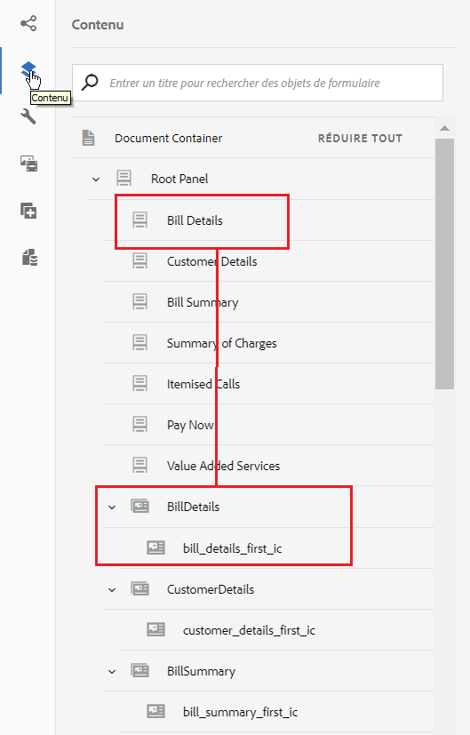

# Didacticiel : Créer une communication interactive {#tutorial-create-interactive-communication}

Ce didacticiel est une étape de la série [Créer votre première série de communications interactives](/help/forms/using/create-your-first-interactive-communication.md). Il est recommandé de suivre la série dans l’ordre chronologique pour comprendre, exécuter et démontrer le cas d’utilisation complet du didacticiel.

Une fois que vous avez créé tous les blocs de construction, tels que le modèle de données de formulaire, les fragments de document, les modèles et les thèmes pour la version web, vous pouvez commencer à créer une communication interactive.

Les communications interactives peuvent être fournies par deux canaux : impression et web. Vous pouvez également créer une communication interactive en configurant le canal d’impression comme option principale. L’impression comme option principale pour le canal web garantit que le contenu, l’héritage et la liaison des données du canal web sont dérivés du canal d’impression. Elle garantit également que les modifications apportées dans le canal d’impression sont synchronisées dans le canal web. Les auteurs de communication interactive sont toutefois autorisés à interrompre l’héritage pour des composants spécifiques dans le canal web.

Ce didacticiel vous guide pas à pas dans la création de communications interactives pour les canaux d’impression et web. À la fin de ce didacticiel, vous serez capable de :

* Créer une communication interactive pour le canal d’impression
* Créer une communication interactive pour le canal web
* Créer des communications interactives pour les versions impression et web avec l’impression comme option principale

## Créer des communications interactives pour les versions impression et web sans aucune synchronisation {#create-interactive-communications-for-print-and-web-with-no-synchronization}

### Créer une communication interactive pour le canal d’impression {#create-interactive-communication-for-print-channel}

Voici la liste des ressources qui ont déjà été créées dans ce didacticiel et qui sont nécessaires à la création de la communication interactive pour le canal d’impression :

**Imprimer le modèle:** [create_first_ic_print_template](../../forms/using/create-templates-print-web.md)

**Modèle de données de formulaire:** [FDM_Create_First_IC](../../forms/using/create-form-data-model0.md)

**Document de fragments :** [bill_details_first_ic, customer_details_first_ic, bill_summary_first_ic, summary_charges_first_ic](../../forms/using/create-document-fragments.md)

**Fragments de mise en page :** [table_lf](../../forms/using/create-templates-print-web.md)

**Images :** PayNow et ValueAddedServices

1. Connectez-vous à l’instance d’auteur AEM et accédez à **[!UICONTROL Adobe Experience Manager]** > **[!UICONTROL Formulaires]** > **[!UICONTROL Formulaires et documents]**.
1. Appuyez sur **Créer** et sélectionnez **Communication interactive**. L&#39;assistant **Créer une communication interactive** s&#39;affiche.
1. Spécifiez **create_first_ic** dans les champs **Titre** et **Nom**. Sélectionnez **FDM_Create_First_IC** comme modèle de données de formulaire et appuyez sur **Suivant**.
1. Dans l&#39;Assistant **Canaux** :

   1. Spécifiez **create_first_ic_print_template** comme modèle d’impression et appuyez sur **Sélectionner**. Assurez-vous que la case **Utiliser l&#39;impression comme Principal pour le Canal Web** n&#39;est pas cochée.

   1. Spécifiez le dossier **Create_First_IC_templates** > **Create_First_IC_Web_Template** comme modèle Web et appuyez sur **Sélectionner**.

   1. Appuyez sur **Créer**.

   Un message de confirmation s’affiche pour confirmer que la communication interactive a été créée correctement.

1. Appuyez sur **Modifier** pour ouvrir la communication interactive dans le volet droit.
1. Accédez à l&#39;onglet **Ressources** et appliquez le filtre pour n&#39;afficher que les fragments de document dans le volet de gauche.
1. Faites glisser les fragments de documents suivants vers leurs zones cibles dans la communication interactive :

   | Fragment de document | Zone cible |
   |---|---|
   | bill_details_first_ic | BillDetails |
   | customer_details_first_ic | CustomerDetails |
   | bill_summary_first_ic | BillSummary |
   | summary_charges_first_interactive_communication | Frais |

   

1. Appuyez sur **Graphiques** dans la zone cible et appuyez sur **+** pour ajouter un composant **Graphique.**
1. Appuyez sur le composant de graphique et sélectionnez  (Configurer). Les propriétés du graphique s’affichent dans le volet gauche :

   1. Spécifiez un nom pour le diagramme.
   1. Sélectionnez **Diagramme circulaire** dans la liste déroulante **Type de graphique**.
   1. Sélectionnez la propriété **calltype** à partir du type d’objet du modèle de données **Calls** dans la section **Axe X**. Appuyez sur .
   1. Sélectionnez **Fréquence** dans la liste déroulante **Fonctions**.
   1. Sélectionnez la propriété **calltype** dans le type d&#39;objet de modèle de données **appels** de la section **Axe Y**. Appuyez sur .
   1. Appuyez sur  pour enregistrer les propriétés du graphique.

1. Accédez à l&#39;onglet **Ressources** et appliquez le filtre pour n&#39;afficher que les fragments de mise en page dans le volet de gauche. Faites glisser le fragment de mise en page **table_lf** dans la zone cible **Appels détaillés**.
1. Sélectionnez le champ de texte dans la colonne **Date** et appuyez sur  (Configurer).
1. Sélectionnez **Objet du modèle de données** dans la liste déroulante **Type de liaison** et sélectionnez **calls** > **calldate**. Appuyez deux fois sur  pour enregistrer les propriétés.

   De même, créez une liaison avec **calltime**, **callnumber**, **callduration** et **callcharges** pour les champs texte dans les colonnes **Heure**, **Numéro**, **Durée** et **Frais**.

1. Appuyez sur **Zone de cible PayNow**, puis sur **+** pour ajouter un composant **Image**.
1. Appuyez sur le composant Image et sélectionnez  (Configurer). Les propriétés de l’image s’affichent dans le volet gauche :

   1. Spécifiez **PayNow** comme nom de l’image dans le champ **Nom**.
   1. Appuyez sur **Télécharger**, sélectionnez l’image enregistrée sur le système de fichiers local, puis appuyez sur **Ouvrir**.
   1. Appuyez sur  pour enregistrer les propriétés de l’image.

1. Répétez les étapes 13 et 14 pour ajouter l’image **ValueAddedServices** à la zone de cible **ValueAddedServices**.

### Créer une communication interactive pour canal web {#create-interactive-communication-for-web-channel}

Voici la liste des ressources qui ont déjà été créées dans ce didacticiel et qui sont nécessaires à la création de la communication interactive pour le canal web :

**Modèle Web:** [Create_First_IC_Web_Template](../../forms/using/create-templates-print-web.md)

**Modèle de données de formulaire:** [FDM_Create_First_IC](../../forms/using/create-form-data-model0.md)

**Document de fragments :** [bill_details_first_ic, customer_details_first_ic, bill_summary_first_ic, summary_charges_first_ic](../../forms/using/create-document-fragments.md)

**Images :** PayNowWeb et ValueAddedServicesWeb

1. Connectez-vous à l’instance d’auteur AEM et accédez à **[!UICONTROL Adobe Experience Manager]** > **[!UICONTROL Formulaires]** > **[!UICONTROL Formulaires et documents]**.
1. Appuyez sur **Créer** et sélectionnez **Communication interactive**. L&#39;assistant **Créer une communication interactive** s&#39;affiche.
1. Spécifiez **create_first_ic** dans les champs **Titre** et **Nom**. Sélectionnez **FDM_Create_First_IC** comme modèle de données de formulaire et appuyez sur **Suivant**.
1. Dans l&#39;Assistant **Canaux** :

   1. Spécifiez **create_first_ic_print_template** comme modèle d’impression et appuyez sur **Sélectionner**. Assurez-vous que la case **Utiliser l&#39;impression comme Principal pour le Canal Web** n&#39;est pas cochée.

   1. Spécifiez le dossier **Create_First_IC_templates** > **Create_First_IC_Web_Template** comme modèle Web et appuyez sur **Sélectionner**.

   1. Appuyez sur **Créer**.

   Un message de confirmation s’affiche pour confirmer que la communication interactive a été créée correctement.

1. Appuyez sur **Modifier** pour ouvrir la communication interactive dans le volet droit.
1. Appuyez sur l&#39;onglet **Canaux** dans le volet de gauche et appuyez sur **Web**.
1. Accédez à l&#39;onglet **Ressources** et appliquez le filtre pour n&#39;afficher que les fragments de document dans le volet de gauche.
1. Faites glisser les fragments de documents suivants vers leurs zones cibles dans la communication interactive :

   | Fragment de document | Zone cible |
   |---|---|
   | bill_details_first_ic | Détails de la facture |
   | customer_details_first_ic | Détails du client |
   | bill_summary_first_ic | BillSummary |
   | summary_charges_first_interactive_communication | Frais |

1. Appuyez sur **Résumé des frais** zone de cible, puis sur **+** pour ajouter un composant **Graphique**.
1. Appuyez sur le composant de graphique et sélectionnez  (Configurer). Les propriétés du graphique s’affichent dans le volet gauche :

   1. Spécifiez un nom pour le diagramme.
   1. Sélectionnez **Diagramme circulaire** dans la liste déroulante **Type de graphique**.

   1. Sélectionnez la propriété **calltype** à partir du type d’objet du modèle de données **Calls** dans la section **Axe X**. Appuyez sur .

   1. Sélectionnez **Fréquence** dans la liste déroulante **Fonctions**.

   1. Sélectionnez la propriété **calltype** dans le type d&#39;objet de modèle de données **appels** de la section **Axe Y**. Appuyez sur .

   1. Appuyez sur  pour enregistrer les propriétés du graphique.

1. Sélectionnez l’onglet **Sources de données** dans le volet gauche et faites glisser l’objet de modèle de données **calls** vers la zone cible **Appels détaillés**. Toutes les propriétés de l&#39;objet de modèle de données **appels** s&#39;affichent sous forme de colonnes de tableau dans la zone de cible **Appels analysés** du volet de droite.

   Selon le cas d’utilisation, vous avez besoin des colonnes Date d’appel, Heure d’appel, Numéro d’appel, Durée d’appel et Frais d’appel dans le tableau.

   

1. Sélectionnez **Mobilenum** en-tête de colonne de table et **Autres options** > **Supprimer la colonne**. De même, supprimez la colonne **calltype**.
1. Sélectionnez l&#39;en-tête de colonne de la table **Calldate** et appuyez sur  (Modifier) pour renommer le texte en **Date d&#39;appel**. De même, renommez les autres en-têtes des colonnes du tableau.
1. Selon le cas d’utilisation, insérez un bouton **Payer maintenant** dans la communication interactive qui permet à l’utilisateur d’effectuer le paiement en cliquant sur le bouton. Effectuez les étapes suivantes pour insérer le bouton :

   1. Appuyez sur **Payez maintenant** zone de cible, puis sur **+** pour ajouter un composant **Texte**.

   1. Appuyez sur le composant de texte et appuyez sur  (Modifier).
   1. Renommez le texte avec **Payer maintenant**.
   1. Sélectionnez le texte et appuyez sur l’icône Hyperlien.
   1. Spécifiez l’URL de paiement dans le champ **Chemin d’accès**.
   1. Sélectionnez **Nouvel onglet** dans la liste déroulante **Cible**.

   1. Appuyez sur  pour enregistrer les propriétés de l’hyperlien.

1. Sélectionnez **Style** dans la liste déroulante en regard de l’option **Aperçu**.

   

1. Personnalisez le texte de l’hyperlien pour l’afficher en tant que bouton dans la communication interactive en suivant les étapes suivantes :

   1. Appuyez sur le composant de texte et sélectionnez  (Modifier).
   1. Dans la section **Bordure**, spécifiez **1,5 px** comme **largeur de bordure**, sélectionnez **Solide** comme **style de bordure** et spécifiez **46 px** comme **rayon de bordure**.

   1. Sélectionnez Rouge comme couleur d’arrière-plan pour le bouton dans la section **Arrière-plan**.
   1. Dans le champ **Marge** de la section **Dimensions et position**, appuyez sur l’icône **Modifier simultanément** et définissez la marge de **droite** à **450 px**. Les zones Haut, Bas et Gauche sont définies comme vides.

   

1. Appuyez sur **Payez maintenant** zone de cible, puis sur **+** pour ajouter un composant **Image**.
1. Appuyez sur le composant Image et sélectionnez  (Configurer). Les propriétés de l’image s’affichent dans le volet gauche :

   1. Spécifiez **PayNow** comme nom de l’image dans le champ **Nom**.

   1. Appuyez sur **Télécharger**, sélectionnez l&#39;image **PayNowWeb** enregistrée sur le système de fichiers local, puis appuyez sur **Ouvrir**.

   1. Appuyez sur  pour enregistrer les propriétés de l’image.

1. Selon le cas d’utilisation, insérez un bouton **S’abonner** dans la communication interactive qui permet à l’utilisateur de s’abonner aux services à valeur ajoutée en cliquant sur le bouton.

   Répétez les étapes 13 à 17 pour ajouter un bouton **S’abonner** à la zone de cible **Value Ajouté Services** et ajoutez l’image **ValueAddedServicesWeb**.

## Créer des communications interactives pour les versions impression et web avec synchronisation automatique {#create-interactive-communications-for-print-and-web-with-auto-synchronization}

Vous pouvez également créer une communication interactive en activant la synchronisation automatique entre les canaux d’impression et web. Pour activer la synchronisation automatique, sélectionnez Impression comme option principale lors de la création de la communication interactive. La sélection d’Impression comme option principale garantit que le contenu, l’héritage et la liaison des données du canal web sont dérivés du canal d’impression. Elle garantit également que les modifications apportées dans le canal d’impression sont répercutées dans le canal web.

Exécutez les étapes suivantes pour dériver le contenu du canal web à l’aide du canal d’impression :

1. Connectez-vous à l’instance d’auteur AEM et accédez à **[!UICONTROL Adobe Experience Manager]** > **[!UICONTROL Formulaires]** > **[!UICONTROL Formulaires et documents]**.
1. Appuyez sur **Créer** et sélectionnez **Communication interactive**. L&#39;assistant **Créer une communication interactive** s&#39;affiche.
1. Spécifiez **create_first_ic** dans les champs **Titre** et **Nom**. Sélectionnez **FDM_Create_First_IC** comme modèle de données de formulaire et appuyez sur **Suivant**.
1. Dans l&#39;Assistant **Canaux** :

   1. Spécifiez **create_first_ic_print_template** comme modèle d’impression et appuyez sur **Sélectionner**.

   1. Cochez la case **Utiliser l&#39;impression comme Principal pour le Canal Web**.
   1. Spécifiez le dossier **Create_First_IC_templates** > **Create_First_IC_Web_Template** comme modèle Web et appuyez sur **Sélectionner**.

   1. Appuyez sur **Créer**.

   Un message de confirmation s’affiche pour confirmer que la communication interactive a été créée correctement.

1. Appuyez sur **Modifier** pour ouvrir la communication interactive dans le volet droit.
1. Exécutez les étapes 6 à 15 de la section [Créer une communication interactive pour le canal d&#39;impression](../../forms/using/create-interactive-communication0.md#create-interactive-communication-for-print-channel).
1. Appuyez sur l’onglet **Canaux** dans le volet gauche et appuyez sur **Web** pour générer automatiquement du contenu pour le canal web à partir du canal d’impression.
1. Comme la case à cocher **Utiliser l&#39;impression comme Principal pour le Canal Web** est cochée à l&#39;étape 4, le contenu et les liaisons sont générés automatiquement pour le canal Web à partir du canal d&#39;impression.

   Le contenu du canal d’impression est inséré sous le contenu du modèle de canal web. Pour modifier le contenu du canal web qui a été généré automatiquement à partir du canal d’impression, vous pouvez annuler l’héritage pour toute zone cible.

   Passez la souris sur la zone de cible appropriée dans le canal Web et sélectionnez  (Annuler l’héritage), puis dans la boîte de dialogue **Annuler l’héritage**, appuyez sur **Oui**.

   

   Si vous avez annulé l’héritage d’un composant, vous pouvez le réactiver. Pour réactiver l’héritage, passez la souris sur la limite de la zone de cible concernée, qui inclut le composant, et appuyez sur .

1. Sélectionnez l’onglet **Contenu** dans le volet gauche.
1. Faites glisser le contenu du canal web généré automatiquement dans les panneaux existants du modèle web à l’aide de l’arborescence de contenu. Voici la liste des composants qui doivent être réorganisés :

   * Composant Informations de facturation dans le panneau Informations de facturation
   * Composant Informations sur le client dans le panneau Informations sur le client
   * Composant Récapitulatif de facturation dans le panneau Récapitulatif de facturation
   * Composant Récapitulatif des frais dans le panneau Récapitulatif des frais
   * Fragment de mise en page (tableau) dans le panneau Appels détaillés

   

1. Répétez les étapes 13 à 18 de la section [Créer une communication interactive pour canal web](../../forms/using/create-interactive-communication0.md#create-interactive-communication-for-web-channel) pour insérer les hyperliens **Payer maintenant** et **S’abonner** dans le canal web de la communication interactive.

