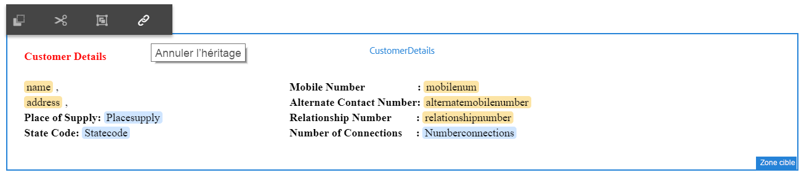

# Didacticiel : Créer une communication interactive {#tutorial-create-interactive-communication}

This tutorial is a step in the [Create your first Interactive Communication](/help/forms/using/create-your-first-interactive-communication.md) series. Il est recommandé de suivre la série dans l’ordre chronologique pour comprendre, exécuter et démontrer le cas d’utilisation complet du didacticiel.

Une fois que vous avez créé tous les blocs de construction, tels que le modèle de données de formulaire, les fragments de document, les modèles et les thèmes pour la version web, vous pouvez commencer à créer une communication interactive.

Les communications interactives peuvent être fournies par deux canaux : impression et web. Vous pouvez également créer une communication interactive en configurant le canal d’impression comme option principale. L’impression comme option principale pour le canal web garantit que le contenu, l’héritage et la liaison des données du canal web sont dérivés du canal d’impression. Elle garantit également que les modifications apportées dans le canal d’impression sont synchronisées dans le canal web. Les auteurs de communication interactive sont toutefois autorisés à interrompre l’héritage pour des composants spécifiques dans le canal web.

Ce didacticiel vous guide pas à pas dans la création de communications interactives pour les canaux d’impression et web. À la fin de ce didacticiel, vous serez capable de :

* Créer une communication interactive pour le canal d’impression
* Créer une communication interactive pour le canal web
* Créer des communications interactives pour les versions impression et web avec l’impression comme option principale

## Créer des communications interactives pour les versions impression et web sans aucune synchronisation {#create-interactive-communications-for-print-and-web-with-no-synchronization}

### Créer une communication interactive pour le canal d’impression {#create-interactive-communication-for-print-channel}

Voici la liste des ressources qui ont déjà été créées dans ce didacticiel et qui sont nécessaires à la création de la communication interactive pour le canal d’impression :

**Imprimer le modèle :** [create_first_ic_print_template](../../forms/using/create-templates-print-web.md)

**Modèle de données de formulaire :** [FDM_Create_First_IC](../../forms/using/create-form-data-model0.md)

**Fragments de Document :** [bill_details_first_ic, customer_details_first_ic, bill_summary_first_ic, summary_charges_first_ic](../../forms/using/create-document-fragments.md)

**Fragments de mise en page :** [table_lf](../../forms/using/create-templates-print-web.md)

**Images :** PayNow et ValueAddedServices

1. Connectez-vous à l’instance d’auteur AEM et accédez à **[!UICONTROL Adobe Experience Manager]** > **[!UICONTROL Formulaires]** > **[!UICONTROL Formulaires et documents]**.
1. Tap **Create** and select **Interactive Communication**. The **Create Interactive Communication** wizard is displayed.
1. Spécifiez **create_first_ic** dans les champs **Titre** et **Nom**. Select **FDM_Create_First_IC** as the Form Data Model and tap **Next**.
1. In the **Channels** wizard:

   1. Specify **create_first_ic_print_template** as the Print template and tap **Select**. Ensure that the **Use Print as Master for Web Channel** checkbox is not selected.

   1. Specify **Create_First_IC_templates** folder > **Create_First_IC_Web_Template** as the Web template and tap **Select**.

   1. Appuyez sur **Créer**. 

   Un message de confirmation s’affiche pour confirmer que la communication interactive a été créée correctement.

1. Appuyez sur **Modifier** pour ouvrir la communication interactive dans le volet droit.
1. Go to the **Assets** tab and apply the filter to display only the document fragments in the left pane.
1. Faites glisser les fragments de documents suivants vers leurs zones cibles dans la communication interactive :

   | Fragment de document | Zone cible |
   |---|---|
   | bill_details_first_ic | BillDetails |
   | customer_details_first_ic | CustomerDetails |
   | bill_summary_first_ic | BillSummary |
   | summary_charges_first_interactive_communication | Frais |

   

1. Appuyez sur **Graphiques** dans la zone cible et appuyez sur **+** pour ajouter un composant **Graphique.**
1. Tap the Chart component and select  (Configure). Les propriétés du graphique s’affichent dans le volet gauche :

   1. Spécifiez un nom pour le diagramme.
   1. Sélectionnez **Diagramme circulaire** dans la liste déroulante **Type de graphique**.
   1. Sélectionnez la propriété **calltype** à partir du type d’objet du modèle de données **Calls** dans la section **Axe X**. Appuyez sur .
   1. Sélectionnez **Fréquence** dans la liste déroulante **Fonctions**.
   1. Select the **calltype** property from the **calls** data model object type in the **Y-axis** section. Appuyez sur .
   1. Tap  to save the chart properties.

1. Go to the **Assets** tab and apply the filter to display only the layout fragments in the left pane. Faites glisser le fragment de mise en page **table_lf** dans la zone cible **Appels détaillés**.
1. Select the Text Field in the **Date** column and tap  (Configure).
1. Sélectionnez **Objet du modèle de données** dans la liste déroulante **Type de liaison** et sélectionnez **calls** > **calldate**. Tap  twice to save the properties.

   De même, créez une liaison avec **calltime**, **callnumber**, **callduration** et **callcharges** pour les champs texte dans les colonnes **Heure**, **Numéro**, **Durée** et **Frais**.

1. Tap **PayNow** target area, and tap **+** to add an **Image** component.
1. Tap the Image component and select  (Configure). Les propriétés de l’image s’affichent dans le volet gauche :

   1. Spécifiez **PayNow** comme nom de l’image dans le champ **Nom**.
   1. Appuyez sur **Télécharger**, sélectionnez l’image enregistrée sur le système de fichiers local, puis appuyez sur **Ouvrir**.
   1. Tap  to save the image properties.

1. Repeat steps 13 and 14 to add **ValueAddedServices** image to the **ValueAddedServices** target area.

### Créer une communication interactive pour canal web {#create-interactive-communication-for-web-channel}

Voici la liste des ressources qui ont déjà été créées dans ce didacticiel et qui sont nécessaires à la création de la communication interactive pour le canal web :

**Modèle Web :** [Create_First_IC_Web_Template](../../forms/using/create-templates-print-web.md)

**Modèle de données de formulaire :** [FDM_Create_First_IC](../../forms/using/create-form-data-model0.md)

**Fragments de Document :** [bill_details_first_ic, customer_details_first_ic, bill_summary_first_ic, summary_charges_first_ic](../../forms/using/create-document-fragments.md)

**Images :** PayNowWeb et ValueAddedServicesWeb

1. Connectez-vous à l’instance d’auteur AEM et accédez à **[!UICONTROL Adobe Experience Manager]** > **[!UICONTROL Formulaires]** > **[!UICONTROL Formulaires et documents]**.
1. Tap **Create** and select **Interactive Communication**. The **Create Interactive Communication** wizard is displayed.
1. Spécifiez **create_first_ic** dans les champs **Titre** et **Nom**. Select **FDM_Create_First_IC** as the Form Data Model and tap **Next**.
1. In the **Channels** wizard:

   1. Specify **create_first_ic_print_template** as the Print template and tap **Select**. Ensure that the **Use Print as Master for Web Channel** checkbox is not selected.

   1. Specify **Create_First_IC_templates** folder > **Create_First_IC_Web_Template** as the Web template and tap **Select**.

   1. Appuyez sur **Créer**. 

   Un message de confirmation s’affiche pour confirmer que la communication interactive a été créée correctement.

1. Appuyez sur **Modifier** pour ouvrir la communication interactive dans le volet droit.
1. Tap the **Channels** tab from the left pane and tap **Web**.
1. Go to the **Assets** tab and apply the filter to display only the document fragments in the left pane.
1. Faites glisser les fragments de documents suivants vers leurs zones cibles dans la communication interactive :

   | Fragment de document | Zone cible |
   |---|---|
   | bill_details_first_ic | BillDetails |
   | customer_details_first_ic | CustomerDetails |
   | bill_summary_first_ic | BillSummary |
   | summary_charges_first_interactive_communication | Frais |

1. Tap **Summary of Charges** target area, and tap **+** to add a **Chart** component.
1. Tap the Chart component and select  (Configure). Les propriétés du graphique s’affichent dans le volet gauche :

   1. Spécifiez un nom pour le diagramme.
   1. Sélectionnez **Diagramme circulaire** dans la liste déroulante **Type de graphique**.

   1. Sélectionnez la propriété **calltype** à partir du type d’objet du modèle de données **Calls** dans la section **Axe X**. Appuyez sur .

   1. Sélectionnez **Fréquence** dans la liste déroulante **Fonctions**.

   1. Select the **calltype** property from the **calls** data model object type in the **Y-axis** section. Appuyez sur .

   1. Tap  to save the chart properties.

1. Sélectionnez l’onglet **Sources de données** dans le volet gauche et faites glisser l’objet de modèle de données **calls** vers la zone cible **Appels détaillés**. All properties in the **calls** data model object are displayed as table columns in the **Itemised Calls** target area in the right pane.

   Selon le cas d’utilisation, vous avez besoin des colonnes Date d’appel, Heure d’appel, Numéro d’appel, Durée d’appel et Frais d’appel dans le tableau.

   

1. Select **Mobilenum** table column heading and select **More options** > **Delete column**. De même, supprimez la colonne **calltype**.
1. Select the **Calldate** table column heading and tap  (Edit) to rename the text to **Call Date**. De même, renommez les autres en-têtes des colonnes du tableau.
1. Selon le cas d’utilisation, insérez un bouton **Payer maintenant** dans la communication interactive qui permet à l’utilisateur d’effectuer le paiement en cliquant sur le bouton. Effectuez les étapes suivantes pour insérer le bouton :

   1. Tap **Pay Now** target area, and tap **+** to add a **Text** component.

   1. Tap the text component and tap  (Edit).
   1. Renommez le texte avec **Payer maintenant**.
   1. Sélectionnez le texte et appuyez sur l’icône Hyperlien.
   1. Spécifiez l’URL de paiement dans le champ **Chemin d’accès**.
   1. Sélectionnez **Nouvel onglet** dans la liste déroulante **Cible**.

   1. Tap  to save the hyperlink properties.

1. Sélectionnez **Style** dans la liste déroulante en regard de l’option **Aperçu**.

   

1. Personnalisez le texte de l’hyperlien pour l’afficher en tant que bouton dans la communication interactive en suivant les étapes suivantes :

   1. Tap the text component and select  (Edit).
   1. Dans la section **Bordure**, spécifiez **1,5 px** comme **largeur de bordure**, sélectionnez **Solide** comme **style de bordure** et spécifiez **46 px** comme **rayon de bordure**.

   1. Sélectionnez Rouge comme couleur d’arrière-plan pour le bouton dans la section **Arrière-plan**.
   1. Dans le champ **Marge** de la section **Dimensions et position**, appuyez sur l’icône **Modifier simultanément** et définissez la marge de **droite** à **450 px**. Les zones Haut, Bas et Gauche sont définies comme vides.

   

1. Tap **Pay Now** target area, and tap **+** to add an **Image** component.
1. Tap the Image component and select  (Configure). Les propriétés de l’image s’affichent dans le volet gauche :

   1. Spécifiez **PayNow** comme nom de l’image dans le champ **Nom**.

   1. Tap **Upload**, select the **PayNowWeb** image saved on the local file system, and tap **Open**.

   1. Tap  to save the image properties.

1. Based on the use case, insert a **Subscribe** button in the Interactive Communication that provides the user an option to subscribe to the value added services by clicking the button.

   Repeat steps 13 - 17 to add a **Subscribe** button to the **Value Added Services** target area and add the **ValueAddedServicesWeb** image.

## Créer des communications interactives pour les versions impression et web avec synchronisation automatique {#create-interactive-communications-for-print-and-web-with-auto-synchronization}

Vous pouvez également créer une communication interactive en activant la synchronisation automatique entre les canaux d’impression et web. Pour activer la synchronisation automatique, sélectionnez Impression comme option principale lors de la création de la communication interactive. La sélection d’Impression comme option principale garantit que le contenu, l’héritage et la liaison des données du canal web sont dérivés du canal d’impression. Elle garantit également que les modifications apportées dans le canal d’impression sont répercutées dans le canal web.

Exécutez les étapes suivantes pour dériver le contenu du canal web à l’aide du canal d’impression :

1. Connectez-vous à l’instance d’auteur AEM et accédez à **[!UICONTROL Adobe Experience Manager]** > **[!UICONTROL Formulaires]** > **[!UICONTROL Formulaires et documents]**.
1. Tap **Create** and select **Interactive Communication**. The **Create Interactive Communication** wizard is displayed.
1. Spécifiez **create_first_ic** dans les champs **Titre** et **Nom**. Select **FDM_Create_First_IC** as the Form Data Model and tap **Next**.
1. In the **Channels** wizard:

   1. Specify **create_first_ic_print_template** as the Print template and tap **Select**.

   1. Select the **Use Print as Master for Web Channel** checkbox.
   1. Specify **Create_First_IC_templates** folder > **Create_First_IC_Web_Template** as the Web template and tap **Select**.

   1. Appuyez sur **Créer**. 

   Un message de confirmation s’affiche pour confirmer que la communication interactive a été créée correctement.

1. Appuyez sur **Modifier** pour ouvrir la communication interactive dans le volet droit.
1. Execute steps 6 - 15 of [Create Interactive Communication for Print channel](../../forms/using/create-interactive-communication0.md#create-interactive-communication-for-print-channel) section.
1. Appuyez sur l’onglet **Canaux** dans le volet gauche et appuyez sur **Web** pour générer automatiquement du contenu pour le canal web à partir du canal d’impression.
1. As the **Use Print as Master for Web Channel** checkbox is selected in step 4, the content and bindings are auto-generated for Web channel from the Print channel.

   Le contenu du canal d’impression est inséré sous le contenu du modèle de canal web. Pour modifier le contenu du canal web qui a été généré automatiquement à partir du canal d’impression, vous pouvez annuler l’héritage pour toute zone cible.

   Hover over the relevant target area in the web channel and select  (Cancel Inheritance) and then in the **Cancel Inheritance** dialog, tap **Yes**.

   

   Si vous avez annulé l’héritage d’un composant, vous pouvez le réactiver. To re-enable inheritance, hover over the boundary of the relevant target area, which includes the component, and tap .

1. Sélectionnez l’onglet **Contenu** dans le volet gauche.
1. Faites glisser le contenu du canal web généré automatiquement dans les panneaux existants du modèle web à l’aide de l’arborescence de contenu. Voici la liste des composants qui doivent être réorganisés :

   * Composant Informations de facturation dans le panneau Informations de facturation
   * Composant Informations sur le client dans le panneau Informations sur le client
   * Composant Récapitulatif de facturation dans le panneau Récapitulatif de facturation
   * Composant Récapitulatif des frais dans le panneau Récapitulatif des frais
   * Fragment de mise en page (tableau) dans le panneau Appels détaillés

   

1. Répétez les étapes 13 à 18 de la section [Créer une communication interactive pour canal web](../../forms/using/create-interactive-communication0.md#create-interactive-communication-for-web-channel) pour insérer les hyperliens **Payer maintenant** et **S’abonner** dans le canal web de la communication interactive.

