# Créer une lettre {#create-letter}

## Flux de travaux de Correspondence Management {#correspondence-management-workflow}

Le flux d’envoi de Correspondance Management se divise en quatre phases :

1. Création d’un modèle
1. Création de fragments de document
1. Création de lettre
1. Post-traitement

### Création d’un modèle {#template-creation}

Le graphique suivant illustre un flux de travaux type pour la création d’un modèle de correspondance.

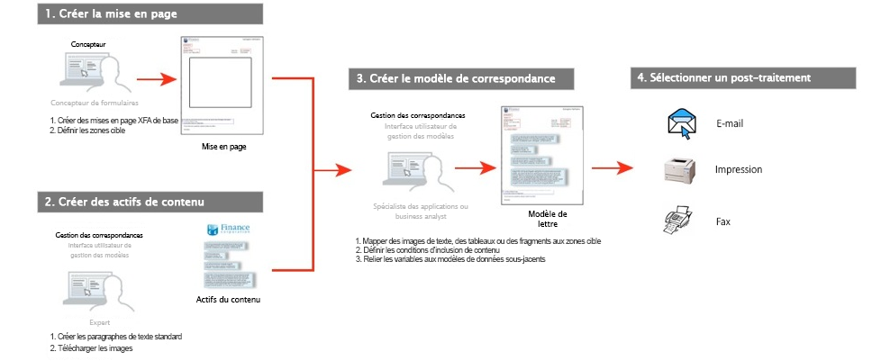

Dans ce flux de travaux : 

1. Les concepteurs de formulaire créent des mises en page et des mises en page de fragments à l’aide d’Adobe Forms Designer et les téléchargent vers un référentiel CRX. Les mises en page contiennent des champs de formulaire classiques, des fonctions de mise en page (en-têtes et pieds de page, par exemple) et des « zones cibles » vides où placer du contenu. Les spécialistes d’applications interviennent ensuite pour mapper le contenu requis vers ces zones cible. En savoir plus sur[ la conception de la mise en page](/help/forms/using/layout-design-details.md).
1. Des experts spécialisés dans les services juridique, financier ou marketing créent et téléchargent du contenu tel que des clauses de protection légale ou des conditions générales, ainsi que des images, comme des logos, réutilisés dans divers modèles de correspondance.
1. Les spécialistes d’applications créent des modèles de correspondance. Le spécialiste d’application

   * Mappe des clauses et des images vers les zones cible des modèles de mise en page ;
   * définit les conditions et règles de l’inclusion de contenu ;
   * relie les champs et variables de la mise en page aux modèles de données sous-jacents. 

1. Auteur : prévisualise la lettre et l’envoie en post-traitement. En savoir plus sur[ le post-traitement](/help/forms/using/submit-letter-topostprocess.md).

#### Utilisation de modèles de lettre fournis avec Correspondence Management {#using-letter-templates-provided-with-correspondence-management}

Au lieu de créer un modèle de mise en forme entièrement nouveau, vous pouvez choisir de modifier et réutiliser des modèles fournis par Correspondence Management. Vous pouvez utiliser Designer pour modifier rapidement l’identité graphique et les données et les champs de contenu des modèles en fonction des besoins de votre entreprise. Pour plus d’informations sur les modèles Correspondence Management, voir [Modèles de lettre de référence](/help/forms/using/reference-cm-layout-templates.md).

### Création de fragments de document {#document-fragment-creation}

Les fragments de document sont les parties\composants réutilisables d&#39;une correspondance avec laquelle vous pouvez composer des lettres\une correspondance.

Les fragments de document sont composés des types suivants :

#### Texte {#text}

Un actif de texte est un élément de contenu comprenant un ou plusieurs paragraphes de texte. Un paragraphe peut être statique ou dynamique. Un paragraphe dynamique contient des références à des éléments de données dont les valeurs sont fournies au moment de l’exécution.

#### Liste {#list}

 de est une série de fragments de , y compris du texte, des  (le même ne peut pas être &quot;ajouté en soi&quot;), des conditions et des images. L’ordre des éléments de la liste peut être fixe ou modifiable. Lors de la création d’une lettre, vous pouvez utiliser certains ou la totalité des éléments de liste pour reproduire un modèle d’éléments réutilisable.

#### Condition {#condition}

Les conditions vous permettent de définir le contenu à inclure lors de la création d’une correspondance, en fonction des données fournies. La condition est décrite en termes de variables de contrôle. Les variables peuvent être soit un élément de dictionnaire de données, soit un espace réservé. Lorsque vous ajoutez une condition, vous pouvez choisir d’inclure un actif en fonction de la valeur de la variable de contrôle. Les conditions produisent une seule sortie, basée sur une expression. La première expression utilisée est vraie selon la variable de condition actuellement utilisée. Sa valeur devient la sortie produite par la condition.

#### Fragment de disposition {#layout-fragment}

Un fragment de mise en page est une mise en page pouvant être utilisée dans une ou plusieurs lettres. Un fragment de mise en page est utilisé pour créer des schémas reproductibles, en particulier des tableaux dynamiques. La mise en page peut contenir des champs de formulaire types tels qu’« Adresse » et « Numéro de référence ». Elle contient également des sous-formulaires vides indiquant les zones cible. The layouts (XDPs) are created in Designer and then are [uploaded to Forms and Documents](/help/forms/using/get-xdp-pdf-documents-aem.md).

### Création de lettre {#letter-creation}

Il existe deux manières de générer la correspondance à envoyer à vos clients : création par l’utilisateur et création par le système.

#### Création par l&#39;utilisateur {#user-driven}

Les employés en contact avec la clientèle comme les experts en assurances ou les chargés d’assistance peuvent créer de la correspondance personnalisée. Dans une interface simple et intuitive présentant une mise en page simple de courrier, les utilisateurs peuvent ajouter du texte facultatif, personnaliser le contenu modifiable tout en prévisualisant la correspondance en temps réel. Ils peuvent ensuite envoyer la correspondance personnalisée à un processus d’arrière-plan.

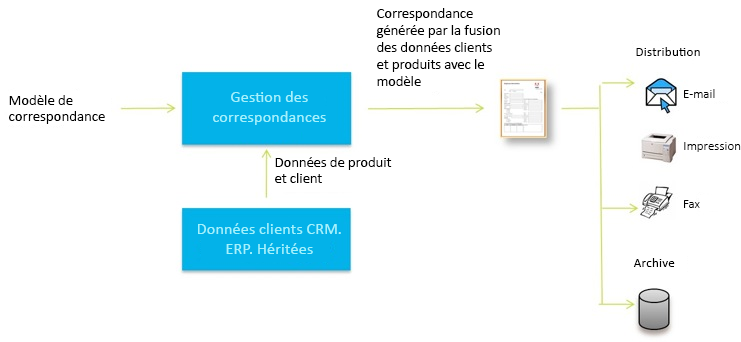

#### Création par le système {#system-driven}

La génération des correspondances est automatisée, basée sur des déclencheurs d’événement. Par exemple, un rappel envoyé à un citoyen l’invitant à faire une déclaration anticipée d’impôt est généré par la fusion du modèle prédéfini avec les données du citoyen. La lettre finale peut être envoyée par courrier électronique, imprimée, télécopiée ou archivée.

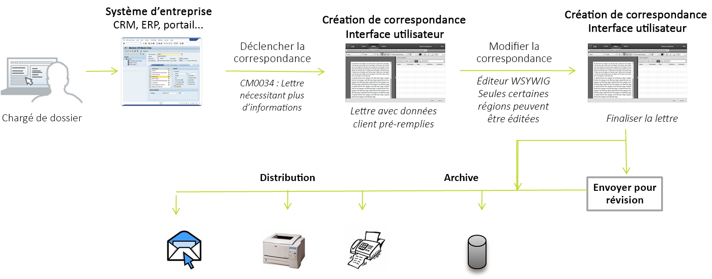

### Post processing {#post-processing}

La correspondance finalisée pourra être envoyée à un processus d’arrière-plan à des fins de post-traitement. La correspondance pourra être :

1. traitée pour être envoyée par courrier électronique ou par fax, ou pour être imprimée par lots, ou encore pour être placée dans un dossier à des fins d’impression ou d’envoi par courrier électronique ;.
1. Soumise à révision et approbation.
1. Sécurisée par l’application de signatures numériques, de certification, de chiffrement ou de gestion des droits numériques.
1. Convertie en PDF où il est possible d’effectuer une recherche et qui contient toutes les métadonnées nécessaires à l’archivage et l’audit.
1. Incluse dans un portfolio PDF qui comprend d’autres documents tels que des supports marketing. Le portfolio PDF peut ensuite être envoyé comme correspondance finale.

### Architecture de la solution Correspondence Management {#correspondence-management-solution-architecture}

Le graphique suivant présente un aperçu d’un exemple d’architecture de la solution de lettres.

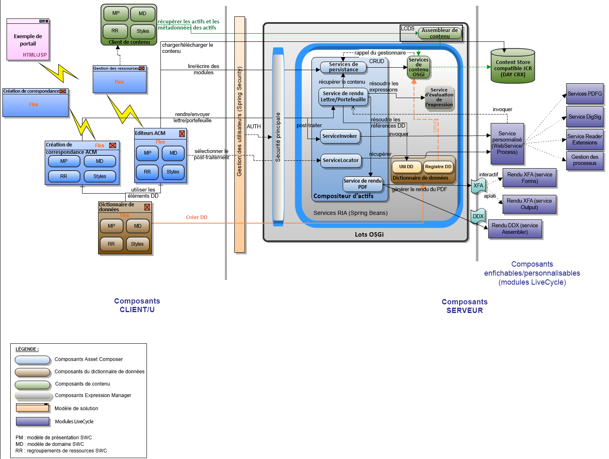

## Découpage d&#39;une lettre {#deconstructing-a-letter}

Le présent avis d&#39;annulation  est un exemple typique de correspondance :

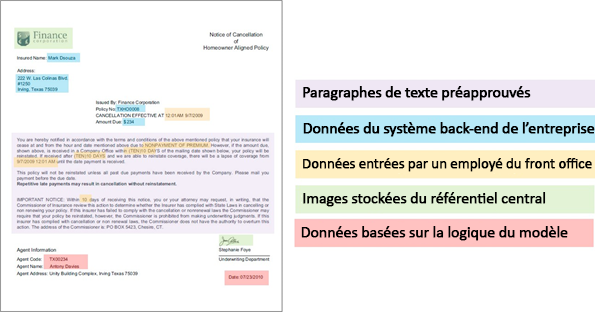

<table> 
 <tbody> 
  <tr> 
   <td><strong>Eléments de lettre</strong></td> 
   <td><strong>Description</strong></td> 
   <td><strong>Formée avec</strong></td> 
  </tr> 
  <tr> 
   <td>Des données des systèmes d’arrière-plan de l’entreprise</td> 
   <td>Des données provenant de systèmes d’arrière-plan de l’entreprise. Les données sont fusionnées dynamiquement avec le modèle de correspondance.</td> 
   <td>Le  fichier de données est créé à partir d’un dictionnaire de données</td> 
  </tr> 
  <tr> 
   <td>Données  entrées par un employé du front office</td> 
   <td>Données pouvant être fournies par un employé du front office, qui personnalise la lettre avant de l’envoyer.  </td> 
   <td>
Eléments DD non protégés Paragraphes modifiables Variables/espaces réservés  
 </td> 
  </tr> 
  <tr> 
   <td>Paragraphes de texte  prévalidés.</td> 
   <td>Contenu du texte prévalidé. Le contenu du texte est en général rédigé par des experts dans les domaines financier, légal ou commercial qui comprennent le contexte commercial de la lettre. Le contenu comme l’en-tête, le pied de page, les clauses de non-responsabilité et les formules de politesse sont communes à la plupart des lettres. Toutefois, certains contenus, tels que la « cause de cessation », sont spécifiques à la lettre particulière.</td> 
   <td>
Textes\Listes  Conditions\Mise en page
 
 
 </td> 
  </tr> 
  <tr> 
   <td>Données  basées sur une logique personnalisée ?</td> 
   <td>Pour certaines lettres, comme une lettre pour demander plus d’informations sur une réclamation, les utilisateurs, comme l’expert en assurance, peuvent ajouter du texte personnalisé.</td> 
   <td>Fragment de   document de type Condition </td> 
  </tr> 
  <tr> 
   <td>Images stockées  du référentiel central</td> 
   <td>Images (logos et signatures). Les images comme les logos de l’entreprise sont présentes dans la majorité des correspondances. Les images de signatures sont quant à elles spécifiques à la lettre et à la personne au nom de laquelle est envoyé le courrier.</td> 
   <td>
Images stockées dans les ressources AEM (DAM)  
 
 
 </td> 
  </tr> 
 </tbody> 
</table>

## Analyse d&#39;une lettre avant sa construction {#analyze-a-letter-before-you-construct-it}

Analysez chaque lettre pour déceler ses différentes composantes. C’est au spécialiste de l’application qu’il revient d’analyser les correspondances qui sont générées.

* Les parties de la correspondance qui sont statiques et celles qui sont dynamiques ; Les variables qui sont remplies à partir des sources de données d’arrière-plan ou par les utilisateurs finaux ;
* l’ordre dans lequel apparaissent les différents paragraphes de texte dans la correspondance, par exemple si les paragraphes peuvent être modifiés par un utilisateur de l’entreprise lors de la création de la correspondance ;
* si la correspondance est générée par le système ou s’il faut qu’un utilisateur final la modifie ; le nombre de correspondances générées par le système et le nombre de celles nécessitant l’intervention d’un utilisateur ;
* la fréquence de changement de la correspondance modèle. Sera-t-elle mise à jour tous les ans, tous les trimestres, ou uniquement en cas de modification de la législation ? Quel type de changements est-il attendu ? Les changements consistent-ils à corriger des erreurs typographiques, à modifier une mise en page, à ajouter des champs supplémentaires ou d’autres paragraphes, etc. ?
* Lorsque vous planifiez les besoins de votre correspondance, constituez la liste des nouveaux modèles de correspondance. Pour chaque modèle de correspondance, vous avez besoin des éléments suivants :

   * des clauses de texte, des images et des tableaux ;
   * des valeurs de données provenant des systèmes d’arrière-plan ;
   * la mise en page et les mises en page fragmentées de la correspondance ;
   * l’ordre dans lequel le contenu apparaît dans la lettre et les règles d’inclusion et d’exclusion de contenu ;

* les conditions dans lesquelles des utilisateurs professionnels, comme les experts en sinistres ou les chargés d’assistance, sont amenés à modifier tout ou partie du contenu de la lettre.
* Les scénarios décrivent l’expérience des utilisateurs, les conditions requises et les avantages de l’utilisation de la solution Lettres.
* Ils fournissent également : les compétences et les outils requis pour le projet ;
* les recommandations relatives à la planification de l’implémentation ; ``un bon aperçu général de l’implémentation.

## Avantages de l’analyse {#benefits-of-performing-the-analysis}

**Réutilisation** du contenu Vous disposez d’un consolidé du nouveau contenu nécessaire pour générer de la correspondance. Une grande partie des contenus (en-têtes, pieds de page, clauses de protection légale et introductions) est commune à de nombreux courriers et peut être réutilisée entre différents courriers. Il suffit alors que ces contenus communs soient créés et approuvés une seule fois par des experts pour pouvoir être réutilisés par la suite dans un grand nombre de courriers.

**Création du dictionnaire** de données Des valeurs de données telles que &quot;ID client&quot; et &quot;Nom du client&quot; sont communes à de nombreuses lettres. Vous pouvez établir une liste consolidée de toutes ces valeurs de données. En règle générale, l’on consulte une personne de l’équipe middleware de l’entreprise lors de la planification de la structure. Ces valeurs de données constituent la base à partir de laquelle est créé le dictionnaire de données.

**Obtention de données à partir de systèmes** d’arrière-plan d’entreprise Vous connaîtrez également toutes les valeurs de données nécessaires et d’où proviennent les données du système d’entreprise. Vous pouvez ensuite architecturer l’implémentation permettant d’extraire les données du système d’entreprise pour alimenter la solution Lettres.

**Estimation de la complexité des lettres** Il est important de déterminer à quel point il sera complexe de créer une correspondance particulière. Cette analyse permet de déterminer le temps et les ensembles de compétences nécessaires pour créer les modèles de lettre. Cela vous permettra ensuite d’estimer les ressources et les coûts nécessaires à l’implémentation de la solution Lettres.

## Complexité de la correspondance {#correspondence-complexity}

La complexité de la correspondance peut être déterminée grâce à l’analyse des paramètres suivants :

**Complexité** de la mise en page Quelle est la complexité de la mise en page ? Des lettres comme l’avis d’annulation ont des mises en page simples. tandis que des courriers comme les demandes de confirmation de couverture ont une mise en page complexe avec plusieurs tableaux et plus de soixante champs de formulaire. La création de mises en page complexes requiert plus de temps et nécessite des compétences avancées de maquettiste.

**Nombre de paragraphes et de conditions** Un contrat de prêt peut comporter 10 pages et plus de 40 clauses de texte. Bon nombre de ces clauses dépendraient de &quot;paramètres de prêt&quot;. Selon les termes et conditions exacts, les clauses seront incluses dans le contrat ou au contraire en seront exclues. La création de ce type de courrier nécessite une planification rigoureuse et une définition méticuleuse des conditions complexes.

Le tableau qui suit expose quelques règles utiles pour la classification de vos lettres :

<table> 
 <tbody> 
  <tr> 
   <td>
<strong>Niveau de complexité</strong>
 </td> 
   <td>
<strong>Complexité de la mise en page (subjective)</strong>
 </td> 
   <td>
<strong>Nombre de paragraphes de texte</strong>
 </td> 
   <td>
<strong>Nombre de textes conditionnels ou d’images</strong>
 </td> 
   <td>
<strong>Compétences requises</strong>
 </td> 
  </tr> 
  <tr> 
   <td>
Faible complexité
 </td> 
   <td>
Faible. La mise en page comporte peu de champs de formulaire (moins de quinze).
 
Généralement une page.
 </td> 
   <td>
8
 </td> 
   <td>
1
 </td> 
   <td>
Compétences Designer moyennes.
 </td> 
  </tr> 
  <tr> 
   <td>
Complexité moyenne
 </td> 
   <td>
Mise en page à complexité moyenne. Comprend des structures comme des tableaux. Généralement plus d’une page.
 </td> 
   <td>
16
 </td> 
   <td>
2
 </td> 
   <td>
Compétences Designer moyennes.
 
 
 
Possibilité de créer des expressions complexes à l’aide d’interfaces utilisateur.
 </td> 
  </tr> 
  <tr> 
   <td>
Complexité élevée
 </td> 
   <td>
Mise en page complexe. Peut dépasser les trois pages. Contient des tableaux et plus de soixante champs de formulaire.
 </td> 
   <td>
40
 </td> 
   <td>
8
 </td> 
   <td>
Compétences Designer de niveau expert.
 
 
 
Possibilité de créer des expressions complexes à l’aide d’interfaces utilisateur.
 </td> 
  </tr> 
 </tbody> 
</table>

## Présentation de la création d’une lettre {#overview-of-creating-a-letter}

1. Sélectionnez la mise en page appropriée qui sert de base à la lettre et créez une lettre.
1. Ajoutez à la lettre des modules de données ou des fragments de mise en page et configurez-les.
1. Sélectionnez l’aperçu de la correspondance.
1. Modifiez et configurez les champs, les variables, le contenu et les pièces jointes.

### Conditions préalables {#prerequisites}

Vous devez d’abord avoir les éléments suivants correctement configurés pour créer une correspondance :

* [Package de compatibilité](compatibility-package.md). Install the Compatibility Package to view the **Letters** option on the **Forms** page.
* La lettre XDP ([mise en page](/help/forms/using/document-fragments.md)).
* Autres XDP ([fragment de mise en page](document-fragments.md#document-fragments)) qui constituent des parties de la lettre. Les xdp\mises en page sont créés dans [Designer](https://help.adobe.com/en-US/AEMForms/6.1/DesignerHelp/).
* The relevant [data dictionary](/help/forms/using/data-dictionary.md) (Optional).
* Les [modules de données](/help/forms/using/document-fragments.md) à utiliser dans la correspondance.
* [Les données](/help/forms/using/data-dictionary.md#p-working-with-test-data-p) de test sont le fichier XML contenant les données de test. Des données de test sont requises si vous utilisez un dictionnaire de données.

## Création d’un modèle de lettre {#create-a-letter-template}

### Choisissez une mise en page et entrez les propriétés de lettre {#select-a-layout-and-enter-the-letter-properties}

1. Sélectionnez **Formulaires** > **Lettres**.

1. Select **Create > Letter**. Correspondence Management affiche les mises en page disponibles (XDP). Ces mises en page proviennent de Designer. Les mises en forme incluent également les modèles de lettre prêts à l’emploi de Correspondence Management. Pour plus d’informations sur les modèles Correspondence Management, voir [Modèles de lettre de référence](/help/forms/using/reference-cm-layout-templates.md). To add your own layouts, create XDP (layout) files in Designer and then [upload them to AEM Forms](/help/forms/using/get-xdp-pdf-documents-aem.md).

   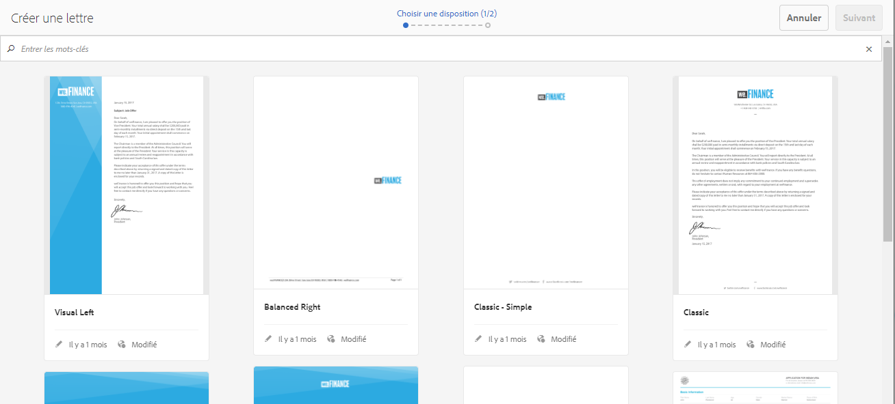

1. Select a layout by tapping it and tap **Next**.

   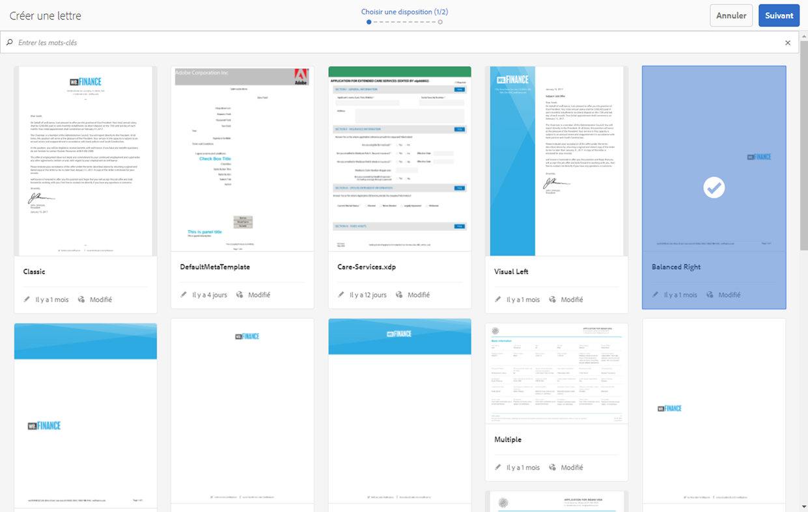

1. Enter the properties for the Correspondence and tap **Save:**

   * **Titre (facultatif) :** Entrez le titre de la lettre. Le titre ne doit pas nécessairement être unique et peut contenir des caractères spéciaux et des caractères dans une autre langue que l’anglais.
   * **Nom :** Nom unique de la lettre. Deux lettres ne peuvent en aucun cas porter le même nom. Dans le champ nom, vous ne pouvez entrer que les caractères, les chiffres et les tirets d’anglais. Le champ Nom est automatiquement renseigné en fonction du champ Titre. Les caractères spéciaux, les espaces, les chiffres et les caractères non anglais saisis dans le champ Titre sont remplacés par des tirets dans le champ Nom. Bien que la valeur du champ Titre soit automatiquement copiée dans Nom, vous pouvez la modifier.
   * **Description (facultatif) :** Décrivez la lettre à titre de référence.
   * **Dictionnaire de données (facultatif)**: Le dictionnaire de données peut être associé à la correspondance. Les actifs que vous insérerez ultérieurement dans cette correspondance doivent avoir le même dictionnaire de données que celui choisi pour cette même correspondance ou ne pas avoir de dictionnaire de données.
   * **Balises (facultatif) :** Sélectionnez les balises à appliquer à la correspondance. Vous pouvez également saisir un nom de balise nouveau ou personnalisé et appuyer sur Entrée pour créer la balise.
   * **Post-traitement (facultatif) :** Sélectionnez le post-processus à appliquer au modèle de lettre. Il existe des post-processus prêts à l’emploi ainsi que ceux que vous avez créés grâce à AEM, comme l’envoi par courrier électronique et l’impression.
   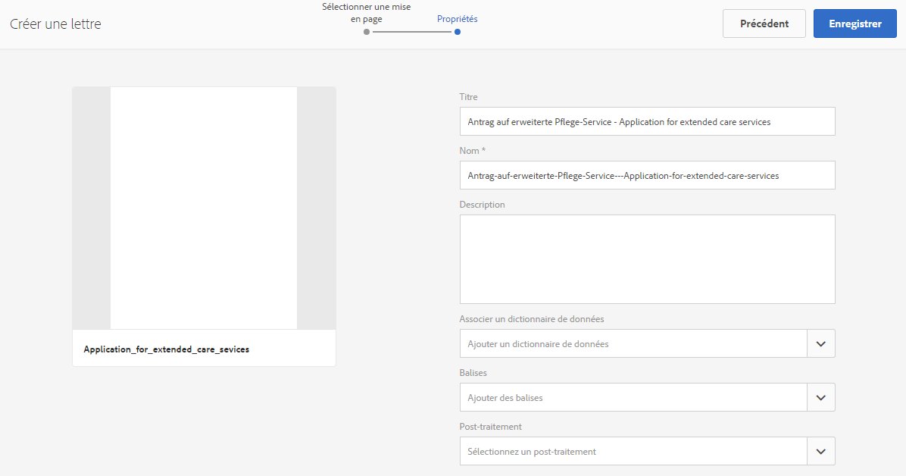

1. Le système affiche le message suivant : « Lettre créée avec succès » (in the alert message) Tap **Open** to configure the data modules and layout fragments in it. Or tap **Done** to go back to the previous page.

   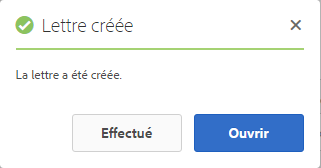

   **Suivant**: Lorsque vous appuyez sur **Ouvrir**, Correspondence Management affiche une représentation de la mise en page avec tous les composants de la mise en page (XDP) répertoriés. Passez ensuite à l’insertion des [modules de données et des fragments de mise en page et à leur configuration](/help/forms/using/create-letter.md#p-insert-data-modules-and-layout-fragments-in-a-letter-and-configure-them-p).

### Insérez des modules de données et des fragments de mise en page dans une lettre puis configurez-les. {#insert-data-modules-and-layout-fragments-in-a-letter-and-configure-them}

Après avoir créé une correspondance, lorsque vous appuyez sur Ouvrir, Correspondence Management affiche une représentation de la mise en page répertoriant tous les sous-formulaires/zones de  de la mise en page (XDP). Dans chaque zone cible, vous pouvez choisir d’insérer un module de données ou un fragment de mise en page (puis des modules de données dans le fragment de mise en page).

>[!NOTE]
>
>Vous pouvez également appuyer sur l’icône Modifier d’une lettre dans la page Lettres pour insérer des modules de données et des fragments de mise en page dans une lettre avant de les configurer.

1. Tap **Insert** for each of the subforms and select Data Modules or a Layout Fragment to insert in each of the subforms.

   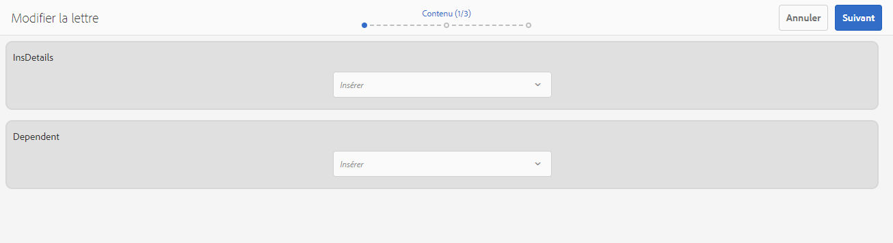

1. Sélectionnez le module de données ou le fragment de mise en page de ces options pour chacun des sous-formulaires puis sélectionnez les modules de données ou les fragments de mise en page à insérer. Un fragment de mise en page vous permet d’insérer d’autres modules de données ou fragments de mise en page dans le formulaire selon sa conception (jusqu’à quatre niveaux).

   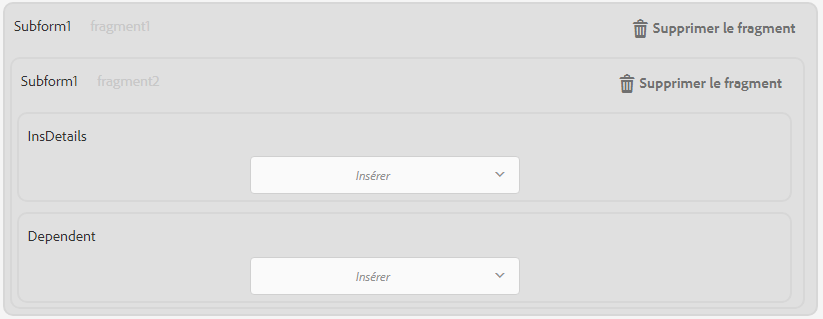

1. Si vous insérez un fragment de mise en page, le nom du fragment de mise en page s’affiche dans le sous-formulaire. Et selon le fragment sélectionné, les sous-formulaires imbriqués s’affichent dans le sous-formulaire.
1. Après avoir inséré les modules de données sélectionnés dans la mise en page, vous pouvez appuyer sur Configurer le mode et définir les éléments suivants pour chaque module après avoir appuyé sur l’icône Modifier :

   1. **Modifiable** : lorsque cette option est sélectionnée, le contenu peut être modifié dans l’interface utilisateur de création de correspondance. Marquez le contenu comme modifiable uniquement s’il doit obligatoirement être modifié par un utilisateur de l’entreprise (un expert en assurance, par exemple).
   1. **Obligatoire** : lorsque cette option est sélectionnée, le contenu est obligatoire dans l’interface utilisateur de création de correspondance.
   1. **Sélectionné** : lorsque cette option est sélectionnée, le contenu est sélectionné par défaut dans l’interface utilisateur de création de correspondance.
   1. **Retrait** : permet d’augmenter ou diminuer le retrait du module et du contenu de la lettre. La mise en retrait est spécifiée par niveaux, en commençant par 0. Chaque niveau correspond à un retrait de 36 points. Pour en savoir plus sur la personnalisation des formulaires, voir **[!UICONTROL Configurations de Correspondence Management]** dans [Flux de travaux des formulaires](submit-letter-topostprocess.md#formsworkflow).
   1. **Saut de page avant** : si vous activez le Saut de page avant, le contenu de CE module s’affichera toujours sur une nouvelle page.
   1. **Saut de page après** : si vous activez le Saut de page après pour un module spécifique, le contenu du module SUIVANT s’affichera toujours sur une nouvelle page.
   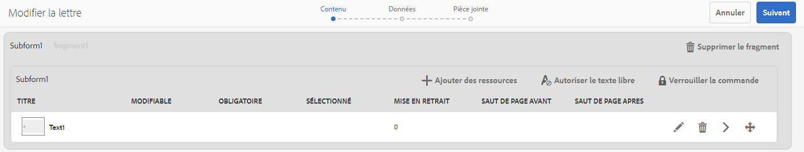

1. Pour modifier un module, appuyez sur l’icône Modifier située en regard de celui-ci. After editing the modules, tap **Save**.

   Dans cette page, vous pouvez également procéder comme suit pour les sous-formulaires :

   1. **Autoriser le texte** libre : Si l’option Autoriser le texte libre est activée, l’utilisateur peut ajouter du texte en ligne dans une lettre dans le  CCR. Dans la vue CCR, une action « T » est activée pour ces zones cible. Le texte libre est activé dans cette action et lorsque l’utilisateur appuie dessus, le nom et la description du texte lui seront demandés. En appuyant sur OK, ce texte s’ouvre en mode de modification où l’utilisateur peut ajouter du texte. Il s’agit donc du même fonctionnement que pour d’autres modules de texte
   1. **Verrouillage de l’ordre** : verrouille l’ordre des sous-formulaires dans la lettre. L’auteur n’est pas autorisé à réorganiser les sous-formulaires et composants lors de la création de la lettre.
   Dans cette page, vous pouvez également procéder comme suit pour chaque actif des sous-formulaires :

   1. **Modifiez l’ordre des ressources**: faites glisser et déposez un fichier contenant l’icône de réorganisation d’un fichier ( ).
   1. **Suppression d’actifs** : appuyez sur l’icône de suppression en regard d’un actif pour le supprimer.
   1. **de ressources**: Appuyez sur l’icône Afficher le  ( ) en regard d’un fichier.

1. Appuyez sur **Next** (Suivant).
1. La page de données détaille la façon dont les champs de données et les variables sont utilisés dans le modèle. Les données peuvent être associées à des sources de données comme un dictionnaire de données ou des entrées utilisateur. Chaque champ définit des propriétés que le dictionnaire de données associe aux données ou aux légendes affichées pour les champs d’entrée utilisateur.

   Liaison :

   * Les éléments de **champ** peuvent être associés à un élément littéral ou de dictionnaire de données, à un actif ou encore à une valeur spécifiée par l’utilisateur. Vous pouvez également ignorer un élément de champ en l’associant à l’option Ignorer.
   * Les éléments de **variable** peuvent être associés à un élément littéral ou de dictionnaire de données, un champ, une variable, un actif ou encore à une valeur spécifiée par l’utilisateur.
   Voici quelques champs de liaison importants :

   * **Multiligne**: Vous pouvez spécifier si la saisie de données d’un champ ou d’une variable est multiligne. Si vous sélectionnez cette option, la zone de saisie du champ ou de la variable s’affiche en tant que zone d’entrée multiligne dans la vue Edition de données. Le champ ou la variable est également multiligne dans les vues Données et Contenu de l’interface utilisateur de création de correspondance. Le champ d’entrée multiligne est identique au champ de saisie de commentaire dans un TextModule. L’option multiligne est disponible uniquement pour les champs et variables avec un type de liaison Utilisateur ou Eléments du dictionnaire de données non protégés.
   * **Facultatif**: Vous pouvez spécifier si la valeur du champ ou de la variable est facultative ou non. L’option de champ facultative est disponible pour les champs et variables avec un type de liaison Utilisateur ou Eléments du dictionnaire de données non protégés.

   * **Validation** de champ/variable : Pour une validation améliorée de la valeur d’un champ ou d’une variable, vous pouvez affecter un validateur au champ ou à la variable. Cette option est disponible uniquement pour les champs et variables avec un type de liaison Utilisateur ou Eléments du dictionnaire de données non protégés.
   * **Légende** et **Info-bulle** : la légende est le libellé du champ qui s’affiche avant le champ dans l’interface utilisateur CCR. Cette option est disponible pour les champs et variables avec un type de liaison Utilisateur ou Eléments du dictionnaire de données non protégés.
   Voici les types de validation que vous pouvez utiliser pour les champs :

   * **Validation des chaînes** : utilisez la validation des chaînes pour spécifier la longueur minimale et maximale de la chaîne saisie dans le champ ou la variable. Lorsque vous créez une validation des chaînes, veillez à spécifier des paramètres de validation valides. Saisissez une longueur valide pour les valeurs minimales et maximales. Dans la validation des chaînes, vous pouvez spécifier la longueur minimale et maximale de la valeur qui peut être saisie. Si la valeur saisie ne correspond pas à la longueur minimale et maximale spécifiées, le champ correspondant de l’interface utilisateur CCR apparaît en rouge.

   * **Validation des nombres** : utilisez la validation des nombres pour spécifier les valeurs numériques minimales et maximales saisies dans un champ ou une variable. Lorsque vous créez une validation des nombres, veillez à spécifier des paramètres de validation valides. Entrez des valeurs numériques pour les valeurs minimale et maximale.

   * **Validation des expressions régulières** : utilisez la validation des expressions régulières pour définir une expression régulière permettant de valider la valeur d’un champ ou d’une variable. Vous pouvez également personnaliser le message d’erreur. Lorsque vous créez une validation des expressions régulières, veillez à spécifier une expression régulière valide.
   >[!NOTE]
   >
   >La validation des champs et des variables est disponible uniquement pour les champs ou variables avec un type de liaison Utilisateur ou Eléments du dictionnaire de données non protégés.

   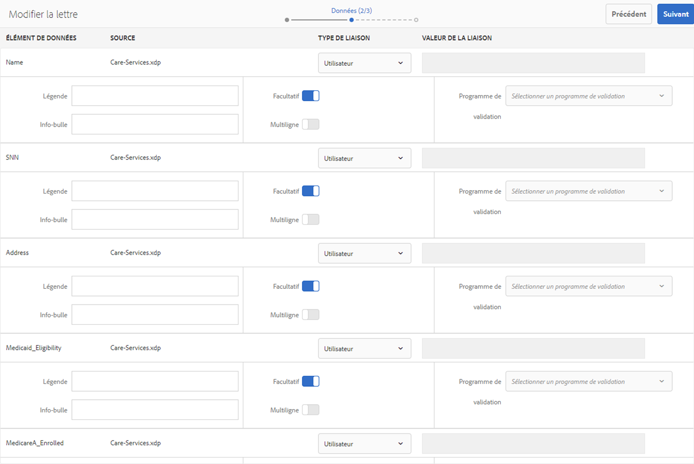

1. After specifying linkage, tap **Next**. Correspondence Management affiche l’écran Pièces jointes.

### Installez les pièces jointes {#set-up-the-attachments}

1. Sélectionnez **Ajouter un actif**.
1. In the Select Asset screen, tap the assets to attach with the letter and tap **Done**. Les actifs doivent d’abord être chargés dans Actifs. Il est recommandé de joindre uniquement des  PDF et Microsoft Office, mais vous pouvez également joindre des images. For more information on uploading assets in DAM, see [Uploading Assets](/help/assets/managing-assets-touch-ui.md).
1. To lock the order of the assets in the list so that the Claims Adjustor cannot change the order, tap **Lock Order**. Si vous ne sélectionnez pas cette option, l’utilisateur pourra modifier l’ordre des éléments de la liste.
1. To change the order of the assets, drag-and-drop an asset holding the reorder icon for an asset ( ).
1. Tap **Edit** in front of an attachment and specify an attachment as Mandatory if you do not want the author to be able to delete it. Indiquez qu’une pièce jointe est sélectionnée si vous souhaitez qu’elle soit présélectionnée dans l’interface CCR.
1. Sélectionnez **Accès à la bibliothèque** pour donner accès à la bibliothèque. Si Accès à la bibliothèque est activé, l’expert en sinistre peut accéder à la bibliothèque de contenu lors de la création d’une lettre et insérer des pièces jointes.
1. Select **Attachments Configuration** and specify the maximum number of attachments.

1. Appuyez sur **Enregistrer**. Votre correspondance est créée et répertoriée dans la page Lettres.

Après la création d’un modèle de lettre dans Correspondence Management, l’utilisateur final/agent/expert en sinistre peut ouvrir la lettre dans l’interface utilisateur CCR et créer une correspondance en saisissant des données, en configurant le contenu et en gérant les pièces jointes. For more information, see [Create Correspondence](/help/forms/using/create-correspondence.md).

## Types de liaison disponibles pour chaque champ {#types-of-linkage-available-for-each-of-the-fields}

Le tableau suivant décrit les types de liaison disponibles pour les différents types de champs.

Les valeurs suivantes du tableau

* **Oui** : le type de champ de la colonne située le plus à gauche prend en charge ce type de mappage
* **Non**: Le type de champ dans la colonne la plus à gauche ne prend pas en charge ce type de mappage
* **S/O**: Le type de champ dans la colonne la plus à gauche n’est pas applicable

<table> 
 <tbody> 
  <tr> 
   <td> </td> 
   <td><strong>Littéral</strong></td> 
   <td><strong>Mise à jour </strong></td> 
   <td><strong>Dictionnaire de données</strong></td> 
   <td><strong>Ignorer</strong></td> 
   <td><strong>Utilisateur</strong></td> 
   <td><strong>Field (Champ)</strong></td> 
   <td><strong>Variable</strong></td> 
  </tr> 
  <tr> 
   <td><strong>date</strong></td> 
   <td>Oui</td> 
   <td>Non</td> 
   <td>Oui</td> 
   <td>Oui</td> 
   <td>Oui</td> 
   <td>N/D</td> 
   <td>N/D</td> 
  </tr> 
  <tr> 
   <td><strong>l’heure.</strong></td> 
   <td>Oui</td> 
   <td>Non</td> 
   <td>Oui</td> 
   <td>Oui</td> 
   <td>Oui</td> 
   <td>N/D</td> 
   <td>N/D</td> 
  </tr> 
  <tr> 
   <td><strong>datetime</strong></td> 
   <td>Oui</td> 
   <td>Non</td> 
   <td>Oui</td> 
   <td>Oui</td> 
   <td>Oui</td> 
   <td>N/D</td> 
   <td>N/D</td> 
  </tr> 
  <tr> 
   <td><strong>integer</strong></td> 
   <td>Oui</td> 
   <td>Non</td> 
   <td>Oui</td> 
   <td>Oui</td> 
   <td>Oui  </td> 
   <td>N/D</td> 
   <td>N/D</td> 
  </tr> 
  <tr> 
   <td><strong>float</strong></td> 
   <td>Oui</td> 
   <td>Non</td> 
   <td>Oui</td> 
   <td>Oui</td> 
   <td>Oui  </td> 
   <td>N/A</td> 
   <td>N/A  </td> 
  </tr> 
  <tr> 
   <td><strong>richtext</strong></td> 
   <td>Oui</td> 
   <td>Texte seul</td> 
   <td>Oui</td> 
   <td>Oui</td> 
   <td>Oui</td> 
   <td>N/D</td> 
   <td>N/D</td> 
  </tr> 
  <tr> 
   <td><strong></strong> texte brut <strong></strong></td> 
   <td>Oui</td> 
   <td>Texte seul</td> 
   <td>Oui</td> 
   <td>Oui</td> 
   <td>Oui</td> 
   <td>N/D</td> 
   <td>N/D</td> 
  </tr> 
  <tr> 
   <td><strong>image</strong></td> 
   <td>Non</td> 
   <td>image seule</td> 
   <td>Non</td> 
   <td>Oui</td> 
   <td>Non</td> 
   <td>N/D</td> 
   <td>N/D</td> 
  </tr> 
  <tr> 
   <td><strong>signature</strong></td> 
   <td>Non</td> 
   <td>Non</td> 
   <td>Non  </td> 
   <td>Oui</td> 
   <td>Non</td> 
   <td>N/A</td> 
   <td>N/A  </td> 
  </tr> 
 </tbody> 
</table>

## Création d’une copie d’un modèle de lettre {#createcopylettertemplate}

Vous pouvez utiliser un modèle de lettre existant pour créer rapidement un modèle de lettre avec des propriétés, un contenu et des actifs hérités similaires, tels que des fragments de document et un dictionnaire de données. Pour ce faire, copiez et collez une lettre.

1. Dans la page Lettres, sélectionnez une ou plusieurs lettres. L’interface utilisateur affiche l’icône Copier.
1. Appuyez sur Copier. L’interface utilisateur affiche l’icône Coller. Vous pouvez également accéder au contenu d’un dossier avant de coller. Différents dossiers peuvent contenir des actifs portant les mêmes noms. Pour plus d’informations sur les dossiers, voir [Dossiers et organisation des actifs](/help/forms/using/import-export-forms-templates.md#folders-and-organizing-assets).
1. Appuyez sur Coller. La boîte de dialogue Coller s’affiche. Si vous copiez et collez des lettres au même endroit, le système attribue automatiquement des noms et des titres aux nouvelles copies des lettres, mais vous pouvez modifier les titres et les noms des lettres.
1. Si nécessaire, modifiez le titre et le nom sous lesquels vous souhaitez enregistrer la copie de la lettre.
1. Appuyez sur Coller. La copie de la lettre est créée. À présent, vous pouvez effectuer les modifications nécessaires dans la lettre que vous venez de créer.

