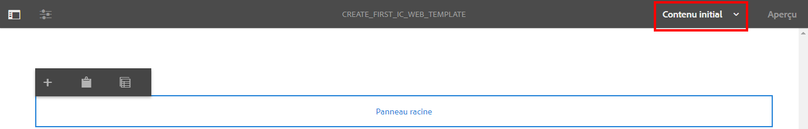

# Didacticiel : Créer des modèles{#tutorial-create-templates}

Ce tutoriel fait partie de la série [Création de votre première communication interactive](/help/forms/using/create-your-first-interactive-communication.md). Il est recommandé de suivre la série dans l’ordre chronologique pour comprendre, exécuter et démontrer le cas d’utilisation complet du tutoriel.

Pour créer une communication interactive, vous devez disposer de modèles disponibles sur le serveur AEM pour les canaux d’impression et web.

Les modèles pour le canal d’impression sont créés dans Adobe Forms Designer et chargés sur le serveur AEM. Ces modèles sont ensuite disponibles pour être utilisés lors de la création d’une communication interactive.

Les modèles pour le canal web sont créés dans AEM. Les auteurs et les administrateurs de modèles peuvent créer, modifier et activer des modèles web. Une fois créés et activés, ces modèles sont disponibles pour être utilisés lors de la création d’une communication interactive.

Ce tutoriel vous guide pas à pas dans la création de modèles pour les canaux d’impression et web, afin qu’ils soient disponibles lors de la création de communications interactives. À la fin de ce didacticiel, vous serez capable de :

* Créer des modèles XDP pour le canal d’impression à l’aide d’Adobe Forms Designer
* Charger les modèles XDP sur le serveur AEM Forms
* Créer et activer des modèles pour le canal web

## Créer un modèle pour le canal d’impression {#create-template-for-print-channel}

Créez et gérez un modèle pour le canal d’impression de la communication interactive à l’aide des tâches suivantes :

* [Créer un modèle XDP en utilisant Forms Designer](../../forms/using/create-templates-print-web.md#create-xdp-template-using-forms-designer)
* [Charger un modèle XDP sur le serveur AEM Forms](../../forms/using/create-templates-print-web.md#upload-xdp-template-to-the-aem-forms-server)
* [Créer un modèle XDP pour des fragments de disposition](../../forms/using/create-templates-print-web.md#create-xdp-template-for-layout-fragments)

### Créer un modèle XDP en utilisant Forms Designer {#create-xdp-template-using-forms-designer}

En fonction du [cas d’utilisation](/help/forms/using/create-your-first-interactive-communication.md) et de la [structure](/help/forms/using/planning-interactive-communications.md), créez les sous-formulaires suivants dans le modèle XDP :

* Informations de facturation : comprend un fragment de document.
* Informations sur la cliente ou le client : comprend un fragment de document.
* Récapitulatif de facturation : comprend un fragment de document.
* Résumé : comprend un fragment de document (sous-formulaire Frais) et un graphique (sous-formulaire Graphiques).
* Appels détaillés : comprend un tableau (fragment de disposition)
* Payer maintenant : comprend une image
* Services à valeur ajoutée : comprend une image

Ces sous-formulaires sont affichés en tant que zones cibles dans le modèle d’impression après le chargement du fichier XDP sur le serveur Forms. Toutes les entités telles que des fragments de document, des graphiques, des fragments de disposition et des images sont ajoutées aux zones cibles lors de la création de la communication interactive.

Pour créer un modèle XDP pour le canal d’impression, procédez comme suit :

1. Ouvrez Forms Designer, puis sélectionnez **Fichier** > **Nouveau** > **Utiliser un formulaire vierge,** select **Suivant**, puis sélectionnez **Terminer** pour ouvrir le formulaire à des fins de création de modèle.

   Assurez-vous que les options **Bibliothèque d’objets** et **Objet** sont sélectionnées dans le menu **Fenêtre**.

1. Faites glisser le composant **Sous-formulaire** de la **bibliothèque d’objets** vers le formulaire.
1. Sélectionnez le sous-formulaire pour afficher les options correspondantes dans la fenêtre **Objet** dans le volet de droite.
1. Sélectionnez l’onglet **Sous-formulaire** puis **Distribué** dans la liste déroulante **Contenu**. Pour ajuster la longueur, faites glisser le point d’entrée gauche du sous-formulaire.
1. Dans l’onglet **Liaisons** :

   1. Spécifiez **billdetails** dans le champ **Nom**.

   1. Sélectionnez **Aucune liaison de données** dans la liste déroulante **Liaison de données**.

   

1. De même, sélectionnez le sous-formulaire racine et l’onglet **Sous-formulaire**, puis sélectionnez **Distribué** dans la liste déroulante **Contenu**. Dans l’onglet **Liaisons** :

   1. Spécifiez **TelecaBill** dans le champ **Nom**.

   1. Sélectionnez **Aucune liaison de données** dans la liste déroulante **Liaison de données**.

   

1. Répétez les étapes 2 à 5 pour créer les sous-formulaires suivants :

   * BillDetails
   * CustomerDetails
   * BillSummary
   * Résumé : sélectionnez l’onglet **Sous-formulaire**, puis **Positionné** dans la liste déroulante **Contenu** de ce sous-formulaire. Insérez les sous-formulaires suivants dans le sous-formulaire **Résumé**.

      * Frais
      * Graphiques

   * ItemisedCalls
   * PayNow
   * ValueAddedServices

   Pour gagner du temps, vous pouvez également copier et coller des sous-formulaires existants pour créer d’autres sous-formulaires.

   Pour déplacer le sous-formulaire **Graphiques** vers la droite du sous-formulaire Frais, sélectionnez le sous-formulaire **Graphiques** dans le volet gauche, puis l’onglet **Disposition** et indiquez une valeur pour le champ **AnchorX**. La valeur doit être supérieure à la valeur du champ **Largeur** pour le sous-formulaire **Frais**. Sélectionnez le sous-formulaire **Frais**, puis l’onglet **Disposition** pour afficher la valeur du champ **Largeur**.

1. Faites glisser l’objet **Texte** de la **bibliothèque d’objets** vers le formulaire et saisissez le texte **Composez le XXXX pour vous abonner** dans la zone.
1. Cliquez avec le bouton droit de la souris sur l’objet texte dans le volet de gauche, sélectionnez **Renommer l’objet** et saisissez le nom de l’objet texte **S’abonner**.

   

1. Sélectionnez **Fichier** > **Enregistrer sous** pour enregistrer le fichier sur le système de fichiers local :

   1. Accédez à l’emplacement où vous pouvez enregistrer le fichier et spécifiez le nom **create_first_ic_print_template**.
   1. Sélectionnez **.xdp** dans la liste déroulante **Type**.

   1. Sélectionnez **Enregistrer**.

### Charger un modèle XDP sur le serveur AEM Forms {#upload-xdp-template-to-the-aem-forms-server}

Une fois que vous avez créé un modèle XDP à l’aide de Forms Designer, vous devez le charger sur le serveur AEM Forms pour qu’il soit disponible lors de la création de la communication interactive.

1. Sélectionnez **[!UICONTROL Formulaires]** > **[!UICONTROL Formulaires et documents]**.
1. Sélectionner **Créer** > **Téléchargement du fichier**.

   Naviguez et sélectionnez le **create_first_ic_print_template** template (XDP) et select **Ouvrir** pour importer le modèle XDP sur le serveur AEM Forms.

### Créer un modèle XDP pour des fragments de disposition {#create-xdp-template-for-layout-fragments}

Pour créer un fragment de disposition pour le canal d’impression de la communication interactive, créez un XDP à l’aide de Forms Designer et chargez-le sur le serveur AEM Forms.

1. Ouvrez Forms Designer, puis sélectionnez **Fichier** > **Nouveau** > **Utiliser un formulaire vierge,** select **Suivant**, puis sélectionnez **Terminer** pour ouvrir le formulaire à des fins de création de modèle.

   Assurez-vous que les options **Bibliothèque d’objets** et **Objet** sont sélectionnées dans le menu **Fenêtre**.

1. Faites glisser le composant **Tableau** de la **bibliothèque d’objets** vers le formulaire.
1. Dans la boîte de dialogue Insérer un tableau :

   1. Spécifiez **5** comme nombre de colonnes.
   1. Spécifiez **1** comme nombre de rangées de contenu.
   1. Cochez la case **Inclure la rangée d’en-tête dans le tableau**.
   1. Appuyez sur **OK**.

1. Sélectionner **+** dans le volet de gauche en regard de **Tableau** 1 et clic droit **Cell1** et sélectionnez **Rename Object** to **Date**.

   De même, renommez respectivement **Cell2**, **Cell3**, **Cell4** et **Cell5** en **Heure**, **Numéro**, **Durée** et **Frais**.

1. Cliquez sur les champs de texte d’en-tête dans l’**affichage Designer** et renommez-les comme suit : **Heure**, **Numéro**, **Durée** et **Frais**.

   

1. Sélectionnez **Rangée 1** dans le volet gauche et sélectionnez **Objet** > **Liaison** > **Rangée pour chaque élément**.

   

1. Faites glisser le composant **Champ de texte** de la **bibliothèque d’objets** vers l’**affichage Designer**.

   

   De même, faites glisser le composant **Champ de texte** vers les lignes **Heure**, **Numéro**, **Durée** et **Frais**.

1. Sélectionnez **Fichier** > **Enregistrer sous** pour enregistrer le fichier sur le système de fichiers local :

   1. Accédez à l’emplacement où vous pouvez enregistrer le fichier et spécifiez le nom **table_lf**.
   1. Sélectionnez **.xdp** dans la liste déroulante **Type**.

   1. Sélectionnez **Enregistrer**.

   Une fois que vous avez créé un modèle XDP pour le fragment de disposition à l’aide de Forms Designer, vous devez le [charger](../../forms/using/create-templates-print-web.md#upload-xdp-template-to-the-aem-forms-server) sur le serveur AEM Forms pour qu’il soit disponible lors de la création des fragments de disposition.

## Créer un modèle pour le canal web {#create-template-for-web-channel}

Créez et gérez un modèle pour le canal web de la communication interactive à l’aide des tâches suivantes :

* [Créer un dossier pour les modèles](../../forms/using/create-templates-print-web.md#create-folder-for-templates)
* [Créer le modèle](../../forms/using/create-templates-print-web.md#create-the-template)
* [Activer le modèle](../../forms/using/create-templates-print-web.md#enable-the-template)
* [Activer les boutons dans les communications interactives](../../forms/using/create-templates-print-web.md#enabling-buttons-in-interactive-communications)

### Créer un dossier pour les modèles {#create-folder-for-templates}

Pour créer un modèle de canal web, définissez un dossier dans lequel vous pouvez enregistrer les modèles créés. Une fois que vous avez créé un modèle dans ce dossier, vous devez l’activer pour permettre aux utilisateurs et utilisatrices de formulaires de créer le canal web d’une communication interactive en fonction du modèle.

Pour créer un dossier pour les modèles modifiables, procédez comme suit :

1. Sélectionner **Outils**  > **Explorateur de configuration**.
   * Pour plus d’informations, consultez la documentation relative au [Navigateur de configuration](/help/sites-administering/configurations.md).
1. Dans la page du navigateur de configuration, sélectionnez **Créer**.
1. Dans le **Créer une configuration** dialog, spécifiez **Create_First_IC_templates** comme titre du dossier, cochez **Modèles modifiables**, puis sélectionnez **Créer**.

   

   Le dossier **Create_First_IC_templates** est créé et répertorié sur la page du **navigateur de configuration**.

### Créer le modèle {#create-the-template}

En fonction du [cas d’utilisation](/help/forms/using/create-your-first-interactive-communication.md) et de la [structure](/help/forms/using/planning-interactive-communications.md), créez les panneaux suivants dans le modèle web :

* Informations de facturation : comprend un fragment de document.
* Informations sur la cliente ou le client : comprend un fragment de document.
* Récapitulatif de facturation : comprend un fragment de document.
* Résumé des frais : comprend un fragment de document et un graphique (disposition en deux colonnes)
* Appels détaillés : comprend un tableau
* Payer maintenant : comprend un bouton et une image **Payer maintenant**
* Services à valeur ajoutée : comprend un bouton et une image **S’abonner**.

Toutes les entités telles que des fragments de document, des graphiques, des tableaux, des images et des boutons sont ajoutées lors de la création de la communication interactive.

Pour créer un modèle pour le canal web dans le dossier **Create_First_IC_templates** procédez comme suit :

1. Accédez au dossier de modèle approprié en sélectionnant le dossier **Outils** > **Modèles** > **Create_First_IC_templates**.
1. Sélectionnez **Créer**.
1. Sur le **Sélection d’un type de modèle** assistant de configuration, sélectionnez **Communication interactive - Canal web** et sélectionnez **Suivant**.
1. Dans l’assistant de configuration **Détails du modèle**, spécifiez comme titre pour le modèle **Create_First_IC_Web_Template**. Spécifiez une description facultative et sélectionnez **Créer**.

   Un message de confirmation indiquant que **Create_First_IC_Web_Template** sʼaffiche.

1. Sélectionner **Ouvrir** pour ouvrir le modèle dans l’éditeur de modèles.
1. Sélectionnez **Contenu initial** dans la liste déroulante en regard de l’option **Aperçu**.

   

1. Sélectionner **Panneau racine** puis sélectionnez **+** pour afficher la liste des composants à ajouter au modèle.
1. Pour ajouter un panneau au-dessus du **Panneau racine**, sélectionnez **Panneau** dans la liste.
1. Sélectionnez l’onglet **Contenu** dans le volet gauche. Le nouveau panneau ajouté à l’étape 8 est affiché sous le **panneau racine** dans l’arborescence de contenu.

   

1. Sélectionnez le panneau, puis sélectionnez  (Configuration).
1. Dans le volet Propriétés :

   1. Spécifiez **billdetails** dans le champ Nom.
   1. Spécifiez **Informations de facturation** dans le champ Titre.
   1. Sélectionnez **1** dans la liste déroulante **Nombre de colonnes**.

   1. Pour enregistrer les propriétés, sélectionnez .

   Le nom du panneau est mis à jour vers **Informations de facturation** dans l’arborescence de contenu.

1. Répétez les étapes 7 à 11 pour ajouter des panneaux avec les propriétés suivantes au modèle :

   | Nom | Titre | Nombre de colonnes |
   |---|---|---|
   | customerdetails | Informations sur le client ou la cliente | 1 |
   | billsummary | Résumé de facturation | 1 |
   | summarycharges | Récapitulatif des frais | 2 |
   | itemisedcalls | Appels détaillés | 1 |
   | paynow | Payer maintenant | 2 |
   | vas | Services à valeur ajoutée | 1 |

   L’image suivante illustre l’arborescence de contenu après l’ajout de tous les panneaux au modèle :

   

### Activer le modèle {#enable-the-template}

Une fois que vous avez créé le modèle web, vous devez l’activer pour utiliser le modèle lors de la création de la communication interactive.

Pour activer le modèle web, procédez comme suit :

1. Sélectionner **Outils**  > **Modèles**.
1. Accédez au **Create_First_IC_Web_Template** modèle, sélectionnez-le, puis sélectionnez **Activer**.
1. Sélectionner **Activer** pour confirmer.

   Le modèle est activé et son statut s’affiche comme Activé. Vous pouvez utiliser ce modèle lors de la création de la communication interactive pour le canal web.

### Activer les boutons dans les communications interactives {#enabling-buttons-in-interactive-communications}

En fonction du cas d’utilisation, vous devez inclure les boutons **Payer maintenant** et **S’abonner** (composants de formulaires adaptatifs) dans la communication interactive. Pour activer l’utilisation de ces boutons dans la communication interactive, procédez comme suit :

1. Sélectionnez **Structure** dans la liste déroulante en regard de l’option **Prévisualisation**.
1. Sélectionnez la variable **Conteneur de documents** panneau racine à l’aide de l’arborescence de contenu et sélectionnez **Stratégie** pour sélectionner les composants autorisés à être utilisés dans la communication interactive.

   

1. Dans l’onglet **Composants autorisés** de la section **Propriétés**, sélectionnez **Bouton** à partir des composants de **formulaire adaptatif**.

   

1. Pour enregistrer les propriétés, sélectionnez .
