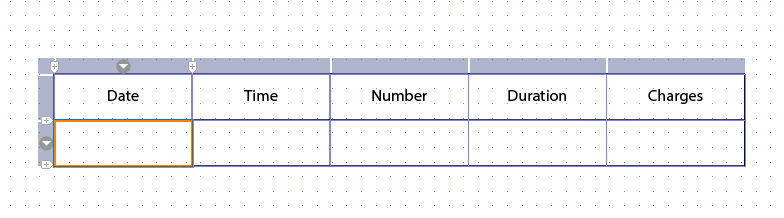

# Didacticiel : Créer des modèles{#tutorial-create-templates}

Ce didacticiel est une étape de la série [Créer votre première série de communications interactives](/help/forms/using/create-your-first-interactive-communication.md). Il est recommandé de suivre la série dans l’ordre chronologique pour comprendre, exécuter et démontrer le cas d’utilisation complet du didacticiel.

Pour créer une communication interactive, vous devez disposer de modèles disponibles sur le serveur AEM pour les canaux d’impression et web.

Les modèles pour le canal d’impression sont créés dans Adobe Forms Designer et téléchargés sur le serveur AEM. Ces modèles sont ensuite disponibles pour être utilisés lors de la création d’une communication interactive.

Les modèles pour le canal web sont créés dans AEM. Les auteurs et les administrateurs de modèles peuvent créer, modifier et activer des modèles web. Une fois créés et activés, ces modèles sont disponibles pour être utilisés lors de la création d’une communication interactive.

Ce didacticiel vous guide pas à pas dans la création de modèles pour les canaux d’impression et web, afin qu’ils soient disponibles lors de la création de communications interactives. À la fin de ce didacticiel, vous serez capable de :

* Créer des modèles XDP pour le canal d’impression à l’aide d’Adobe Forms Designer
* Télécharger les modèles XDP sur le serveur AEM Forms
* Créer et activer des modèles pour le canal web

## Créer un modèle pour le canal d’impression {#create-template-for-print-channel}

Créez et gérez un modèle pour le canal d’impression de la communication interactive à l’aide des tâches suivantes :

* [Créer un modèle XDP en utilisant Forms Designer](../../forms/using/create-templates-print-web.md#create-xdp-template-using-forms-designer)
* [Télécharger le modèle XDP sur le serveur AEM Forms](../../forms/using/create-templates-print-web.md#upload-xdp-template-to-the-aem-forms-server)
* [Créer un modèle XDP pour des fragments de mise en page](../../forms/using/create-templates-print-web.md#create-xdp-template-for-layout-fragments)

### Créer un modèle XDP en utilisant Forms Designer  {#create-xdp-template-using-forms-designer}

Sur la base des [cas d’utilisation](/help/forms/using/create-your-first-interactive-communication.md) et [anatomie](/help/forms/using/planning-interactive-communications.md), créez les sous-formulaires suivants dans le modèle XDP :

* Informations de facturation : comprend un fragment de document
* Détails du client : Inclut un fragment de document
* Résumé de la facture : Inclut un fragment de document
* Résumé : Comprend un fragment de document (sous-formulaire Frais) et un graphique (sous-formulaire Graphiques).
* Appels analysés : Inclut un tableau (fragment de mise en page)
* Payer maintenant : Inclut une image
* Services à valeur Ajoutée : Inclut une image

Ces sous-formulaires sont affichés en tant que zones cibles dans le modèle d’impression après le téléchargement du fichier XDP sur le serveur Forms. Toutes les entités telles que des fragments de document, des graphiques, des fragments de mise en page et des images sont ajoutées aux zones cibles lors de la création de la communication interactive.

Exécutez les étapes suivantes pour créer un modèle XDP pour le canal d’impression :

1. Ouvrez Forms Designer, sélectionnez **Fichier** > **Nouveau** > **Utilisez un formulaire vide,** appuyez sur **Suivant**, puis appuyez sur **Terminer** pour ouvrir le formulaire en vue de la création du modèle.

   Assurez-vous que les options **Bibliothèque d’objets** et **Objet** sont sélectionnées dans le menu **Fenêtre**.

1. Faites glisser le composant **Sous-formulaire** de la **bibliothèque d’objets** vers le formulaire.
1. Sélectionnez le sous-formulaire pour afficher les options correspondantes dans la fenêtre **Objet** dans le volet de droite.
1. Sélectionnez l’onglet **Sous-formulaire** et **Distribué** dans la liste déroulante **Contenu**. Faites glisser l’extrémité gauche du sous-formulaire pour ajuster la longueur.
1. Dans l’onglet **Liaisons** :

   1. Spécifiez **BillDetails** dans le champ **Name**.

   1. Sélectionnez **Aucune liaison de données** dans la liste déroulante **Liaison de données**.

   

1. De même, sélectionnez le sous-formulaire racine, sélectionnez l’onglet **Sous-formulaire**, puis **Distribué** dans la liste déroulante **Contenu**. Dans l’onglet **Liaisons** :

   1. Spécifiez **TélécaBill** dans le champ **Nom**.

   1. Sélectionnez **Aucune liaison de données** dans la liste déroulante **Liaison de données**.

   

1. Répétez les étapes 2 à 5 pour créer les sous-formulaires suivants :

   * BillDetails
   * CustomerDetails
   * BillSummary
   * Résumé : sélectionnez l’onglet **Sous-formulaire** et **Positionné** dans la liste déroulante **Contenu** de ce sous-formulaire. Insérez les sous-formulaires suivants dans le sous-formulaire **Résumé**.

      * Frais
      * Graphiques
   * ItemisedCalls
   * PayNow
   * ValueAddedServices

   Pour gagner du temps, vous pouvez également copier et coller des sous-formulaires existants pour créer de nouveaux sous-formulaires.

   Pour déplacer le sous-formulaire **Graphiques** vers la droite du sous-formulaire Frais, sélectionnez le sous-formulaire **Graphiques** dans le volet de gauche, sélectionnez l’onglet **Mise en page** et spécifiez une valeur pour le champ **AncrageX**. La valeur doit être supérieure à la valeur du champ **Largeur** pour le sous-formulaire **Frais**. Sélectionnez le sous-formulaire **Frais** et sélectionnez l’onglet **Mise en page** pour afficher la valeur du champ **Largeur.**

1. Faites glisser l’objet **Texte** de la **bibliothèque d’objets** vers le formulaire et saisissez le texte **Composez le XXXX pour vous abonner** dans la zone.
1. Cliquez avec le bouton droit de la souris sur l’objet texte dans le volet de gauche, sélectionnez **Renommer l’objet** et saisissez le nom de l’objet texte **S’abonner**.

   

1. Sélectionnez **Fichier** > **Enregistrer sous** pour enregistrer le fichier sur le système de fichiers local :

   1. Accédez à l’emplacement où vous souhaitez enregistrer le fichier et spécifiez le nom **create_first_ic_print_template**.
   1. Sélectionnez **.xdp** dans la liste déroulante **Type**.

   1. Appuyez sur **Enregistrer**.

### Télécharger le modèle XDP sur le serveur AEM Forms  {#upload-xdp-template-to-the-aem-forms-server}

Une fois que vous avez créé un modèle XDP à l’aide de Forms Designer, vous devez le télécharger sur le serveur AEM Forms pour qu’il soit disponible lors de la création de la communication interactive.

1. Sélectionnez **[!UICONTROL Formulaires]** > **[!UICONTROL Formulaires et documents]**.
1. Appuyez sur **Create** (Créer) > **File Upload** (Téléchargement de fichier). 

   Recherchez et sélectionnez le modèle **create_first_ic_print_template** (XDP) et appuyez sur **Ouvrir** pour importer le modèle XDP sur le serveur AEM Forms.

### Créer un modèle XDP pour des fragments de mise en page {#create-xdp-template-for-layout-fragments}

Pour créer un fragment de mise en page pour le canal d’impression de la communication interactive, créez un XDP à l’aide de Forms Designer et chargez-le sur le serveur AEM Forms.

1. Ouvrez Forms Designer, sélectionnez **Fichier** > **Nouveau** > **Utilisez un formulaire vide,** appuyez sur **Suivant**, puis appuyez sur **Terminer** pour ouvrir le formulaire en vue de la création du modèle.

   Assurez-vous que les options **Bibliothèque d’objets** et **Objet** sont sélectionnées dans le menu **Fenêtre**.

1. Faites glisser le composant **Tableau** de la **Bibliothèque d’objets** vers le formulaire.
1. Dans la boîte de dialogue Insérer un tableau :

   1. Spécifiez **5** comme nombre de colonnes.
   1. Spécifiez **1** comme nombre de rangées de contenu.
   1. Cochez la case **Inclure la rangée d’en-tête dans le tableau**.
   1. Onglet **OK**.

1. Appuyez sur **+** dans le volet gauche en regard du **Tableau** 1 et cliquez avec le bouton droit de la souris sur **Cell1**, sélectionnez **Renommer l’objet** et remplacez le nom Cell1 par **Date**.

   De même, renommez respectivement **Cell2**, **Cell3**, **Cell4** et **Cell5** en **Heure**, **Numéro**, **Durée** et **Frais**.

1. Cliquez sur les champs de texte En-tête de la **Vue Designer** et renommez-les en **Time**, **Number**, **Duration** et **Frais**.

   

1. Sélectionnez **Rangée 1** dans le volet gauche et sélectionnez **Objet** > **Liaison** > **Rangée pour chaque élément**.

   

1. Faites glisser le composant **Champ de texte** de la **Bibliothèque d’objets** vers la **Vue Designer**.

   

   De même, faites glisser le composant **Champ de texte** vers les rangées **Heure**, **Numéro**, **Durée** et **Frais**.

1. Sélectionnez **Fichier** > **Enregistrer sous** pour enregistrer le fichier sur le système de fichiers local :

   1. Accédez à l’emplacement d’enregistrement du fichier et spécifiez le nom **table_lf**.
   1. Sélectionnez **.xdp** dans la liste déroulante **Type**.

   1. Appuyez sur **Enregistrer**.
   Une fois que vous avez créé un modèle XDP pour le fragment de mise en page à l’aide de Forms Designer, vous devez le [télécharger](../../forms/using/create-templates-print-web.md#upload-xdp-template-to-the-aem-forms-server) sur le serveur AEM Forms pour qu’il soit disponible lors de la création des fragments de mise en page.

## Créer un modèle pour le canal web  {#create-template-for-web-channel}

Créez et gérez un modèle pour le canal web de la communication interactive à l’aide des tâches suivantes :

* [Créer un dossier pour les modèles](../../forms/using/create-templates-print-web.md#create-folder-for-templates)
* [Créer le modèle](../../forms/using/create-templates-print-web.md#create-the-template)
* [Activer le modèle](../../forms/using/create-templates-print-web.md#enable-the-template)
* [Activer les boutons dans les communications interactives](../../forms/using/create-templates-print-web.md#enabling-buttons-in-interactive-communications)

### Créer un dossier pour les modèles {#create-folder-for-templates}

Pour créer un modèle de canal web, définissez un dossier dans lequel vous pouvez enregistrer les modèles créés. Une fois que vous avez créé un modèle dans un dossier, vous devez l’activer pour permettre aux utilisateurs de formulaires de créer le canal web d’une communication interactive en fonction du modèle.

Exécutez les étapes suivantes pour créer un dossier pour les modèles modifiables :

1. Appuyez sur **Outils**  > **Navigateur de configuration**.
   * Pour plus d’informations, consultez la documentation de [Navigateur de configuration](/help/sites-administering/configurations.md).
1. Dans la page Navigateur de configuration, appuyez sur **Créer**.
1. Dans la boîte de dialogue **Créer une configuration**, spécifiez **Create_First_IC_templates** comme titre du dossier, cochez **Modèles modifiables**, puis appuyez sur **Créer**.

   

   Le dossier **Create_First_IC_templates** est créé et répertorié sur la page **Navigateur de configuration**.

### Créer le modèle {#create-the-template}

Sur la base des [cas d&#39;utilisation](/help/forms/using/create-your-first-interactive-communication.md) et [anatomie](/help/forms/using/planning-interactive-communications.md), créez les panneaux suivants dans le modèle Web :

* Informations de facturation : comprend un fragment de document
* Détails du client : Inclut un fragment de document
* Résumé de la facture : Inclut un fragment de document
* Résumé des frais : Comprend un fragment de document et un graphique (mise en page à deux colonnes)
* Appels ciblés : Inclut un tableau
* Payer maintenant : Comprend un bouton **Payer maintenant** et une image.
* Services à valeur Ajoutée : Inclut une image et un bouton **S’abonner**.

Toutes les entités telles que des fragments de document, des graphiques, des tableaux, des images et des boutons sont ajoutées lors de la création de la communication interactive.

Exécutez les étapes suivantes pour créer un modèle pour le canal web dans le dossier **Create_First_IC_templates** :

1. Accédez au dossier de modèles approprié en sélectionnant **Outils** > **Modèles** > **Créer_premiers_modèles_IC**.
1. Appuyez sur **Créer**.
1. Dans l&#39;assistant de configuration **Choisir un type de modèle**, sélectionnez **Communication interactive - Canal Web** et appuyez sur **Suivant**.
1. Dans l’assistant de configuration **Détails du modèle**, spécifiez **Create_First_IC_Web_Template** comme titre de modèle. Spécifiez une description facultative et appuyez sur **Créer**.

   Un message de confirmation indiquant que le **Create_First_IC_Web_Template** est affiché.

1. Appuyez sur **Ouvrir** pour ouvrir le modèle dans l’éditeur de modèles.
1. Sélectionnez **Contenu initial** dans la liste déroulante en regard de l’option **Aperçu**.

   

1. Appuyez sur **Panneau racine**, puis sur **+** pour vue la liste des composants que vous pouvez ajouter au modèle.
1. Sélectionnez **Panneau** dans la liste pour ajouter un panneau au-dessus du **panneau racine**.
1. Sélectionnez l’onglet **Contenu** dans le volet gauche. Le nouveau panneau ajouté à l’étape 8 est affiché sous le **panneau racine** dans l’arborescence de contenu.

   

1. Sélectionnez le panneau et appuyez sur  (Configurer).
1. Dans le panneau Propriétés :

   1. Spécifiez **billdetails** dans le champ Nom.
   1. Spécifiez **Information de facturation** dans le champ Titre.
   1. Sélectionnez **1** dans la liste déroulante **Nombre de colonnes**.

   1. Appuyez sur  (Enregistrer) pour enregistrer les propriétés.

   Le nom du panneau est mis à jour vers **Information de facturation** dans l’arborescence de contenu.

1. Répétez les étapes 7 à 11 pour ajouter des panneaux avec les propriétés suivantes au modèle :

   | Nom | Titre | Nombre de colonnes |
   |---|---|---|
   | customerdetails | Informations sur le client | 1 |
   | billsummary | Récapitulatif de facturation | 1 |
   | summarycharges | Récapitulatif des frais | 2 |
   | itemisedcalls | Appels détaillés | 1 |
   | PayNow | Payez maintenant | 2 |
   | vas | Services à valeur ajoutée | 1 |

   L’image suivante illustre l’arborescence de contenu après l’ajout de tous les panneaux au modèle :

   

### Activer le modèle {#enable-the-template}

Une fois que vous avez créé le modèle web, vous devez l’activer pour utiliser le modèle lors de la création de la communication interactive.

Effectuez les étapes suivantes pour activer le modèle web :

1. Appuyez sur **Outils**  > **Modèles**.
1. Accédez au modèle **Create_First_IC_Web_Template**, sélectionnez-le, puis appuyez sur **Activer**.
1. Appuyez de nouveau sur **Activer** pour confirmer.

   Le modèle est activé et son statut s’affiche comme Activé. Vous pouvez utiliser ce modèle lors de la création de la communication interactive pour le canal web.

### Activer les boutons dans les communications interactives  {#enabling-buttons-in-interactive-communications}

En fonction du cas d’utilisation, vous devez inclure les boutons **Payer maintenant** et **S’abonner** (composants de formulaires adaptatifs) dans la communication interactive. Pour activer l’utilisation de ces boutons dans la communication interactive, procédez comme suit :

1. Sélectionnez **Structure** dans la liste déroulante en regard de l&#39;option **Prévisualisation**.
1. Sélectionnez le panneau racine **Conteneur de documents** en utilisant l’arborescence de contenu et appuyez sur **Stratégie** pour sélectionner les composants qui sont autorisés à être utilisés dans la communication interactive.

   

1. Dans l’onglet **Composants autorisés** de la section **Propriétés**, sélectionnez **Bouton** à partir des composants de **formulaire adaptatif**.

   

1. Appuyez sur  pour enregistrer les propriétés.