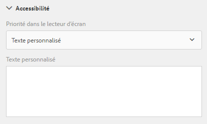

# Création de formulaires adaptatifs accessibles{#creating-accessible-adaptive-forms}

## Présentation {#introduction}

Un formulaire accessible est un formulaire utilisable par tout le monde, y compris par les utilisateurs souffrant de handicaps. La Forms adaptative comprend un certain nombre de fonctions et de fonctionnalités qui améliorent la convivialité pour les utilisateurs ayant des capacités différentes. L’intégration d’options d’accessibilité dans des formulaires adaptatifs ne permet pas seulement d’élargir l’audience. Il s’agit en effet d’une exigence lors de la diffusion de documents dans des régions où le respect des normes d’accessibilité constitue une obligation. AEM Forms aide les développeurs à se conformer à ces normes d’accessibilité.

Lors de la création d’un formulaire adaptatif, l’auteur doit tenir compte des points suivants pour créer un formulaire adaptatif accessible :

* Vérification du formulaire à l’aide de l’outil de test d’accessibilité ANDI (Accessible Name and Description Inspecteur)
* Fournir des libellés appropriés pour les commandes de formulaire
* Fournir des équivalents textuels pour les images
* Fournir un contraste de couleur suffisant
* S’assurer que les commandes de formulaire sont accessibles à l’aide du clavier

## Condition requise

Pour créer un formulaire adaptatif accessible, vous avez besoin d’un outil d’accessibilité tel que **Inspecteur de nom et de description accessible (ANDI)** et d’un thème de formulaire adaptatif **développé pour résoudre les problèmes d’accessibilité**.

### Téléchargement et installation de l’outil de test d’accessibilité

L’outil ANDI (Accessible Name and Description Inspecteur) permet d’identifier et de corriger les problèmes de conformité liés à l’accessibilité dans le contenu Web. Il s&#39;agit de l&#39;outil recommandé sous les directives Trusted Tester v5 du Département de la Sécurité Intérieure. Il est développé par le Département de la &#x200B; de la sécurité sociale des États-Unis pour vérifier la conformité du contenu Web à la section 508. L&#39;outil :

* Aide à détecter les problèmes d’accessibilité &#x200B; sur une page Web
* Fournit des suggestions pour améliorer l’accessibilité &#x200B;
* Détecte les problèmes d’accessibilité du clavier et de contraste de couleur
* Identifie clairement le contenu du lecteur d’écran en conformité avec les normes.

ANDI fonctionne avec tous les principaux navigateurs Internet. Pour obtenir des instructions détaillées sur la configuration et l&#39;utilisation de l&#39;outil, consultez la [documentation ANDI](https://www.ssa.gov/accessibility/andi/help/install.html).

### Téléchargement et installation du thème Ultramarine accessible

Le thème Ultramarine-Accessible est un thème de référence. Il permet de démontrer comment corriger le contraste de couleur et d’autres problèmes liés à l’accessibilité dans un formulaire adaptatif. L’Adobe recommande de créer un thème personnalisé pour l’environnement de production en fonction des styles approuvés par votre organisation. Effectuez les étapes suivantes pour télécharger le thème sur votre instance AEM :

1. Téléchargez le module thématique.
1. Accédez à **[!UICONTROL Experience Manager]** > **[!UICONTROL Navigation]**  > **[!UICONTROL Forms]** sur votre instance AEM.
1. Appuyez sur **[!UICONTROL Create]** (Créer) > **[!UICONTROL File Upload]** (Téléchargement de fichier). Sélectionnez et téléchargez le fichier x Ultramarine-Accessible-Theme.zip. Il télécharge le thème sur votre instance AEM.

## Rendre un formulaire adaptatif accessible

Vous devez vous concentrer sur quatre aspects clés : navigation au clavier, contraste de couleur, texte alternatif significatif pour les images et libellés appropriés pour les contrôles de formulaires afin de rendre un formulaire adaptatif accessible. Effectuez les étapes suivantes pour rendre vos formulaires adaptatifs existants accessibles :

### 1. Appliquer un thème accessible et effectuer des corrections supplémentaires

Appliquez le thème accessible en Ultramarine à votre formulaire adaptatif existant. Pour appliquer le thème :

1. Ouvrez le formulaire adaptatif pour le modifier.
1. Sélectionnez un composant et appuyez sur l’icône parent. Dans le menu contextuel, appuyez sur **[!UICONTROL Conteneur de formulaire adaptatif]**, puis sur l’icône Configurer.
1. Sélectionnez le thème Ultramarine-Accessible dans le navigateur de propriétés et appuyez sur l&#39;icône **[!UICONTROL Enregistrer]**.
1. Actualisez la fenêtre du navigateur. Le thème est appliqué au formulaire adaptatif.

Après avoir appliqué un thème accessible, effectuez les correctifs supplémentaires répertoriés ci-dessous. Les correctifs s’ajoutent aux correctifs d’accessibilité couverts dans le thème accessible :

1. Ajoutez un texte de remplacement significatif pour l’image de logo dans le formulaire adaptatif.

   Fournissez un texte de remplacement significatif pour les images dans les composants d’en-tête et de pied de page du modèle de formulaire adaptatif. Lorsque vous corrigez le modèle et l’utilisez pour créer un formulaire adaptatif, les formulaires adaptatifs héritent de tous les correctifs d’accessibilité appliqués à l’en-tête et au pied de page du modèle.  Pour un formulaire adaptatif existant, effectuez les modifications au niveau du formulaire adaptatif. Les modifications apportées à un modèle de formulaire adaptatif ne sont pas automatiquement transférées vers un formulaire adaptatif existant.

1. Ajoutez un composant d’en-tête contenant le nom du formulaire au formulaire adaptatif. Si votre conception de formulaire spécifie un nom de société, ajoutez un composant d’en-tête distinct pour le nom de la société.

   La plupart des outils d’accessibilité informent les utilisateurs de la hiérarchie du contenu afin de les aider à comprendre la structure de la page Web. Définissez différents niveaux d’en-tête pour le nom de l’organisation et le texte du nom du formulaire sur le formulaire adaptatif afin de fournir une structure hiérarchique à ce texte. En outre, utilisez un composant Texte avant chaque panneau et section avec un niveau d’en-tête approprié pour créer une hiérarchie.

   

1. Modifiez la couleur d’arrière-plan du pied de page pour utiliser un contraste approprié conformément aux normes d’accessibilité afin d’améliorer la visibilité et la lisibilité du texte. Vous pouvez utiliser ANDI pour rechercher des problèmes de contraste de couleur dans votre formulaire. En outre, n’utilisez pas de police très petite. Les petites polices sont difficiles à lire.

1. Remplacez les composants switch et image choice de votre formulaire adaptatif existant par le composant choice (radio).

1. Remplacez le composant d’exécution numérique pas à pas de votre formulaire adaptatif existant par le composant de zone numérique.

1. Remplacez le champ de saisie de date par le champ de sélecteur de date.

1. Définissez des modèles d’affichage, de validation et de modification pour le composant de sélecteur de date. Définissez également un message d’erreur de validation personnalisé. Par exemple, vous avez spécifié une date non valide. Le format correct de la date est AAAA-MM-JJ.

1. Définissez le texte d’accessibilité personnalisé pour le composant Sélecteur de date. Par exemple, entrez votre date de naissance. Les lecteurs d’écran lisent ces textes d’accessibilité personnalisés.

1. Utilisez une description courte plutôt qu’une description longue pour les composants de formulaire adaptatif. Une description longue ajoute le bouton d’aide. Assurez-vous que le formulaire adaptatif ne comporte pas de bouton d’aide.

1. Ajoutez du texte d’accessibilité personnalisé à toutes les cellules en lecture seule des tableaux. Désactivez également toutes les cellules de tableaux en lecture seule.

1. Supprimez les champs de signature tactile, le cas échéant, dans le formulaire adaptatif. Configurez le formulaire adaptatif pour qu’il utilise l’Adobe Sign pour une expérience de signature numérique transparente.

### 2. Fournir des libellés appropriés pour les contrôles de formulaire {#provide-proper-labels-for-form-controls}

Le libellé ou le titre d’un composant de formulaire identifie ce qu’il représente. Par exemple, le texte « Prénom » indique à l’utilisateur qu’il doit saisir son prénom dans une zone de texte. Pour être accessible sur des lecteurs d’écran, le libellé est associé, par programmation, à un composant de formulaire. La commande de formulaire peut également être assortie d’informations d’accessibilité supplémentaires.

Le libellé perçu par les lecteurs d’écran ne doit pas nécessairement être identique à la légende visuelle. Dans certains cas, vous pouvez être plus précis quant au rôle exact de la commande. Pour chaque objet de champ d’un formulaire, les options d’accessibilité permettent de spécifier ce que le lecteur d’écran annonce pour identifier le champ de formulaire.

Pour utiliser l’option d’accessibilité, procédez comme suit :

1. Sélectionnez un composant et appuyez sur .
1. Cliquez sur **[!UICONTROL Accessibilité]** dans la barre latérale pour sélectionner l’option d’accessibilité de votre choix.

### Options d’accessibilité dans des composants de formulaire {#accessibility-options-in-form-components}

**Les auteurs de** formulaires texte personnalisés fournissent le contenu dans l’option d’accessibilité Champ de texte personnalisé. La technologie d’assistance, telle que les lecteurs d’écran, utilise ce texte personnalisé. L’utilisation du paramètre Titre constitue la meilleure option dans la majorité des cas. N’envisagez la création d’un texte personnalisé pour lecteur d’écran que lorsque l’utilisation du titre ou d’une brève description s’avère impossible.

**Brève** descriptionPour la majorité des composants, la brève description s’affiche au moment de l’exécution lorsque l’utilisateur place le pointeur de la souris sur le composant. Vous pouvez définir cette option dans le champ approprié, sous l’option du contenu d’aide.

**** TitreUtilisez cette option pour permettre à l’AEM Forms d’utiliser le libellé visuel associé au champ de formulaire comme texte de lecteur d’écran.

**** NomVous pouvez spécifier une valeur dans le champ Nom de l’onglet Liaison. Le nom ne peut pas contenir d’espaces.

**** AucunSi vous sélectionnez Aucun, l’objet de formulaire n’a pas de nom dans le formulaire publié. Aucun n’est pas un paramètre recommandé pour les contrôles de formulaire.

>[!NOTE]
>
>* Dans le cas de la case d’option et de la case à cocher, deux options seulement sont possibles dans le cadre de l’accessibilité à savoir : Texte personnalisé et Titre.
>* Pour les formulaires adaptatifs basés sur XFA, l’option d’accessibilité est héritée des options d’accessibilité définies dans le fichier XDP. Les info-bulles du fichier XDP sont associées au champ Brève description et Légende correspond à Titre. Les autres options fonctionnent normalement.

### 3. Fournir des équivalents textuels pour les images {#provide-text-equivalents-for-images}

Pour certains utilisateurs, les images permettent une compréhension plus facile. Cependant, lorsqu’un lecteur d’écran est utilisé, les images réduisent l’accessibilité du formulaire. Si vous optez pour l’utilisation d’images, veuillez fournir des descriptions textuelles pour l’ensemble des images.

Assurez-vous que le texte décrit l’objet et son rôle dans le formulaire. Un lecteur d’écran lit ce texte alternatif lorsqu’il rencontre une image. Un texte alternatif doit toujours être spécifié pour une image.

Sélectionnez un composant d’image et appuyez sur . Dans la barre latérale, sous Propriétés, indiquez le texte alternatif d’une image.

### 4. Fournir un contraste de couleur suffisant {#provide-sufficient-color-contrast}

Dans le cadre des fonctions d’accessibilité, il convient de tenir compte de quelques points supplémentaires concernant l’utilisation des couleurs. Les auteurs de formulaires peuvent utiliser des couleurs pour améliorer l’apparence des formulaires, en mettant en surbrillance différents composants. Cependant, une utilisation inappropriée des couleurs peut rendre le formulaire difficile à lire, voire totalement illisible, pour des personnes souffrant de certains handicaps.

Les utilisateurs ayant une déficience visuelle s’appuient sur le contraste prononcé entre le texte et l’arrière-plan pour lire du contenu numérique. En l’absence de contraste suffisant, la lecture d’un formulaire peut s’avérer difficile, voire impossible, pour certains utilisateurs.

Il est conseillé d’utiliser la police et les couleurs d’arrière-plan par défaut, à savoir : contenu noir sur fond blanc. Si vous modifiez les couleurs par défaut, optez pour une couleur de premier plan foncée sur un arrière-plan clair, ou inversement.

Pour plus d’informations sur la modification du contraste de couleur et du thème des formulaires adaptatifs, reportez-vous à [Création de thèmes personnalisés pour les formulaires adaptatifs](/help/forms/using/creating-custom-adaptive-form-themes.md).

### 5. Assurez-vous que les commandes de formulaire sont accessibles au clavier {#ensure-that-form-controls-are-keyboard-accessible}

Un formulaire accessible peut être rempli complètement en utilisant uniquement le clavier ou un périphérique de saisie équivalent. Certains utilisateurs ayant une mobilité réduite ou une déficience visuelle sont parfois contraints de n’utiliser que le clavier. De plus, de nombreux utilisateurs préfèrent saisir leurs données au moyen du clavier plutôt que de la souris. En proposant différents modes de saisie des données, vous créez également des formulaires qui répondent aux préférences de l’ensemble des utilisateurs.

Les raccourcis clavier suivants sont disponibles dans AEM Forms.

| Action | Raccourci clavier |
|---|---|
| Déplacer le curseur vers l’avant dans un formulaire | Onglet |
| Déplacer le curseur vers l’arrière dans un formulaire | Maj+Touche de tabulation |
| Accéder au panneau suivant | Alt+Flèche Droite |
| Revenir au panneau précédent | Alt+Flèche Gauche |
| Réinitialiser les données saisies dans un formulaire | Alt+R |
| Envoyer un formulaire | Alt+S |

## Utiliser l&#39;outil d&#39;accessibilité pour identifier les problèmes d&#39;accessibilité restants

L’Inspecteur de nom et de description accessible (ANDI) vous aide à identifier et à corriger les problèmes liés à la conformité à l’accessibilité dans un formulaire adaptatif. Pour rechercher les problèmes d’accessibilité dans un formulaire adaptatif à l’aide de l’outil ANDI :

1. Ouvrez le formulaire adaptatif en mode prévisualisation.
1. Cliquez sur l&#39;icône de l&#39;outil ANDI en signet. L’outil ANDI analyse le formulaire adaptatif et affiche les problèmes d’accessibilité. Pour plus d&#39;informations sur l&#39;utilisation de l&#39;outil, consultez la [documentation de l&#39;ANDI](https://www.ssa.gov/accessibility/andi/help/howtouse.html).
1. Examiner et résoudre les problèmes signalés par l&#39;ANDI.