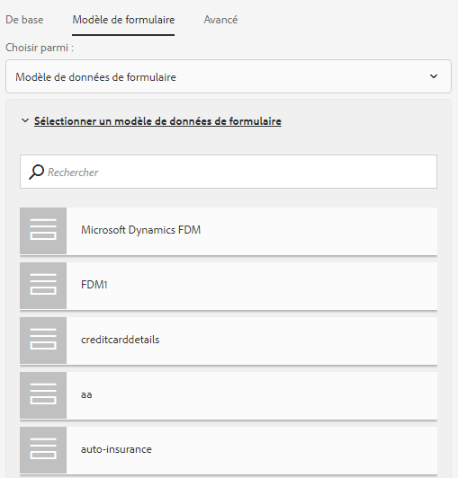

# Création d’un formulaire adaptatif {#creating-an-adaptive-form}

 Adobe recommande d’utiliser les [composants principaux](https://experienceleague.adobe.com/docs/experience-manager-core-components/using/adaptive-forms/introduction.html?lang=fr) de capture de données modernes et extensibles pour [créer de nouveaux formulaires adaptatifs](/help/forms/using/create-an-adaptive-form-core-components.md) ou [ajouter des formulaires adaptatifs à des pages AEM Sites](/help/forms/using/create-or-add-an-adaptive-form-to-aem-sites-page.md). Ces composants représentent une avancée significative dans la création de formulaires adaptatifs, ce qui garantit des expériences utilisateur impressionnantes. Cet article décrit l’ancienne approche de la création de formulaires adaptatifs à l’aide de composants de base. 

| Version | Lien de l’article |
| -------- | ---------------------------- |
| AEM as a Cloud Service | [Cliquez ici](https://experienceleague.adobe.com/docs/experience-manager-cloud-service/content/forms/adaptive-forms-authoring/authoring-adaptive-forms-foundation-components/create-an-adaptive-form-on-forms-cs/creating-adaptive-form.html?lang=fr) |
| AEM 6.5 | Cet article |

## Créer un formulaire adaptatif {#strong-create-an-adaptive-form-strong}

Pour créer un formulaire adaptatif, suivez la procédure décrite ci-après.

1. Accédez à l’instance d’auteur [!DNL Experience Manager Forms] à `https://'[server]:[port]'/<custom-context-if-any>.`.

1. Entrez vos informations d’identification dans la page de connexion d’Experience Manager.

   Une fois connecté, dans le coin supérieur gauche, sélectionnez **[!UICONTROL Adobe Experience Manager]** > **[!UICONTROL Formulaires]** > **[!UICONTROL Formulaires et documents]**.

   >[!NOTE]
   >
   >Dans le cadre d’une installation par défaut, l’identifiant est `admin` et le mot de passe est `admin`.

1. Sélectionnez **[!UICONTROL Créer]**, puis **[!UICONTROL Formulaire adaptatif]**.
1. Une option permettant de sélectionner un modèle s’affiche. Pour plus d’informations sur les modèles, voir [Modèles de formulaires adaptatifs](creating-adaptive-form.md#p-adaptive-form-templates-p). Sélectionnez un modèle puis Suivant.
1. Une option Ajouter des propriétés s’affiche. Spécifiez les valeurs des champs de propriété suivants. Les champs Titre et Nom sont obligatoires :

   * **[!UICONTROL Titre]** : indique le nom d’affichage du formulaire. Le titre vous permet d’identifier le formulaire dans l’interface utilisateur [!DNL Experience Manager Forms] d’AEM Forms.
   * **[!UICONTROL Nom :]** indique le nom du formulaire. Un nœud portant le nom spécifié est créé dans le référentiel. Lorsque vous commencez à saisir un titre, la valeur du champ Nom est automatiquement générée. Vous pouvez modifier la valeur suggérée. Le champ Nom ne peut contenir que des caractères alphanumériques, des traits d’union et des traits de soulignement. Toutes les entrées non valides sont remplacées par un trait d’union.
   * **[!UICONTROL Description :]** indique des informations détaillées relatives au formulaire.
   * **[!UICONTROL Balises :]** indique les balises pour individualiser le formulaire adaptatif. Les balises aident à rechercher le formulaire. Pour créer des balises, saisissez les nouveaux noms de balise dans la boîte de dialogue **[!UICONTROL Balises.]**

1. Vous pouvez créer un formulaire adaptatif basé sur l’un des modèles de formulaire suivants :

   * [Modèle de données de formulaire](#fdm)
   * [Modèle de formulaire XFA](#create-an-adaptive-form-based-on-an-xfa-form-template)
   * [Schéma XML ou JSON](#create-an-adaptive-form-based-on-xml-or-json-schema)
   * Aucun ou sans modèle de formulaire

   Vous pouvez configurer ces informations via l’onglet **[!UICONTROL Modèle de formulaire]** figurant sur la page **[!UICONTROL Ajouter des propriétés]**. Par défaut, le modèle de formulaire sélectionné est **[!UICONTROL Aucun]**.

1. Sélectionnez **[!UICONTROL Créer]**. Un formulaire adaptatif est créé et une boîte de dialogue pour ouvrir le formulaire à modifier s’affiche.

   Une fois que vous avez fini de spécifier toutes les propriétés, cliquez sur **[!UICONTROL Créer]**. Un formulaire adaptatif est créé et une boîte de dialogue pour ouvrir le formulaire à modifier s’affiche.

   Une fois que vous avez fini de spécifier toutes les propriétés, cliquez sur **[!UICONTROL Créer]**. Un formulaire adaptatif est créé et une boîte de dialogue pour ouvrir le formulaire à modifier s’affiche.

1. Sélectionnez **[!UICONTROL Ouvrir]** pour ouvrir le formulaire nouvellement créé dans un nouvel onglet. Le formulaire s’ouvre pour être modifié et affiche le contenu disponible dans le modèle. Il affiche également la barre latérale permettant de personnaliser le formulaire nouvellement créé selon vos besoins.

   En fonction du type de formulaire adaptatif, les éléments de formulaire présents dans le modèle de formulaire XFA, le schéma XML ou le schéma JSON associé sont affichés dans l’onglet **[!UICONTROL Objets de modèle de données]** de l’**[!UICONTROL explorateur de contenu]** dans la barre latérale. Vous pouvez également faire glisser et déposer ces éléments pour créer votre formulaire adaptatif.

   Pour plus d’informations sur l’interface de création de formulaires adaptatifs et les composants disponibles, voir [Présentation de la création de formulaires adaptatifs](introduction-forms-authoring.md).

   >[!NOTE]
   >
   >Autorisez les fenêtres contextuelles dans votre navigateur pour ouvrir le formulaire nouvellement créé dans un nouvel onglet.

## Créer un formulaire adaptatif en fonction du modèle de données de formulaire {#fdm}

[[!DNL Experience Manager Forms] L’intégration de données](data-integration.md) vous permet d’intégrer plusieurs sources de données et de rassembler leurs entités et services pour créer un modèle de données de formulaire. Il s’agit d’une extension du schéma JSON. Vous pouvez utiliser un modèle de données de formulaire pour créer un formulaire adaptatif. Les entités ou les objets de modèle de données configurés dans un modèle de données de formulaire sont disponibles en tant qu’objets de modèle de données pour la création de formulaire. Ils sont associés à des sources de données respectives et utilisés pour pré-remplir un formulaire et écrire les données envoyées dans les sources de données respectives. Vous pouvez également appeler des services configurés dans un modèle de données de formulaire à l’aide des règles de formulaire adaptatif.

Pour utiliser un modèle de données de formulaire pour créer un formulaire adaptatif :

1. Dans l’onglet Modèle de formulaire de l’écran Ajouter des propriétés, sélectionnez **[!UICONTROL Modèle de données de formulaire]** dans la liste déroulante **[!UICONTROL Sélectionner à partir de]**.

   

1. Cliquez pour développer **[!UICONTROL Sélectionner le modèle de données de formulaire]**. Tous les modèles de données de formulaire disponibles sont répertoriés.

   Sélectionnez un modèle de données de formulaire.

   

>[!NOTE]
>
>Vous pouvez également remplacer le modèle de données de formulaire par un formulaire adaptatif. Pour obtenir des instructions détaillées, consultez la page [Modifier les propriétés du modèle de formulaire d’un formulaire adaptatif](#edit-form-model).

## Créer un formulaire adaptatif basé sur un modèle de formulaire XFA {#create-an-adaptive-form-based-on-an-xfa-form-template}

Vous pouvez réutiliser vos modèles de formulaire XFA pour créer des formulaires adaptatifs. Pour les réutiliser, chargez et associez un modèle de formulaire XFA à un formulaire adaptatif. Les éléments du modèle de formulaire (formulaire XFA) sont disponibles dans l’outil de recherche de contenu au moment de la création des formulaires adaptatifs. Dans l’outil de recherche de contenu, vous pouvez faire glisser et déposer les éléments de modèle de formulaire sur le formulaire.

<!-- >>[!NOTE]
>
>[Upload the XFA Form Template](get-xdp-pdf-documents-aem.md) to AEM Forms before you start creating an adaptive form based on the form template.

Do the following to use an XFA form template as form model for your adaptive form:

1. On the **[!UICONTROL Add Properties]** page, open the **[!UICONTROL Form Model]** tab.
1. In the Form Model tab, from the drop-down list, select **[!UICONTROL Form Templates]**. All the form templates that are uploaded to the repository via AEM Forms UI are listed for selection. Select a template from the list.

   
**Figure:** *Selecting a form template*

   >[!NOTE]
   >
   >You can also change the form template for an adaptive form. For detailed steps, see [Edit Form Model properties of an adaptive form](#edit-form-model). -->

## Créer un formulaire adaptatif en fonction du schéma XML ou JSON {#create-an-adaptive-form-based-on-xml-or-json-schema}

Les schémas XML et JSON représentent la structure dans laquelle les données sont générées ou utilisées par le système principal de votre organisation. Vous pouvez associer un schéma à un formulaire adaptatif et utiliser ses éléments pour ajouter du contenu dynamique à un formulaire adaptatif. Les éléments du schéma sont disponibles dans l’onglet Objet du modèle de données du navigateur de contenu pour la création de formulaires adaptatifs. Vous pouvez faire glisser et déposer les éléments du schéma pour créer le formulaire.

Consultez les documents suivants pour découvrir comment concevoir un schéma XML ou JSON pour la création de formulaires adaptatifs.

* [Création de formulaires adaptatifs à l’aide d’un schéma XML](adaptive-form-xml-schema-form-model.md)
* [Création de formulaires adaptatifs à l’aide d’un schéma JSON](adaptive-form-json-schema-form-model.md)

Procédez comme suit pour utiliser un schéma XML ou JSON comme modèle de formulaire pour un formulaire adaptatif :

1. À l’étape **[!UICONTROL Ajouter des propriétés]** de la page de création de formulaires adaptatifs, sélectionnez l’onglet **[!UICONTROL Modèle de formulaire]**.
1. Dans l’onglet Modèle de formulaire, sélectionnez **[!UICONTROL Schéma]** dans le champ déroulant **[!UICONTROL Choisir parmi]**.

1. Cliquez sur **[!UICONTROL Sélectionner un schéma]** et effectuez l’une des opérations suivantes :

   * **[!UICONTROL Charger à partir du disque]** : sélectionnez cette option, puis Charger une définition de schéma pour parcourir et charger un schéma XML ou un schéma JSON à partir de votre système de fichiers. Le fichier de schéma chargé se trouve avec le formulaire et n’est pas accessible aux autres formulaires adaptatifs.
   * **[!UICONTROL Rechercher dans le référentiel]** : sélectionnez cette option pour effectuer un choix dans la liste des fichiers de définition de schéma disponibles dans le référentiel. Sélectionnez le fichier de schéma XML ou JSON comme modèle de formulaire. Le schéma sélectionné est associé au formulaire par référence et est accessible pour une utilisation dans d’autres formulaires adaptatifs.

   >[!CAUTION]
   >
   >Assurez-vous que le nom de fichier du schéma JSON se termine par **.schema.json**. Par exemple : mySchema.schema.json

   
   **Figure :** *Sélection d’un schéma XML ou JSON*

1. (Pour le schéma XML uniquement) Après avoir sélectionné ou chargé un schéma XML, spécifiez un élément racine du fichier XSD sélectionné à mapper avec le formulaire adaptatif.

   
   **Figure :** *Sélection de l’élément racine XSD*

>[!NOTE]
>
>Vous pouvez également remplacer le schéma par un formulaire adaptatif. Pour obtenir des instructions détaillées, consultez la page [Modifier les propriétés du modèle de formulaire d’un formulaire adaptatif](#edit-form-model).

## Modèles de formulaires adaptatifs {#adaptive-form-templates}

Un modèle fournit une structure de base et définit l’apparence, c’est-à-dire la disposition et les styles, d’un formulaire adaptatif. Il comporte des composants pré-formatés contenant certaines propriétés et une certaine structure de contenu. <!-- Out of the box, AEM Forms provides some adaptive form templates. To get the complete template package including advanced templates, you need to install the AEM Forms add-on package. For more information, see [Installing AEM Forms add-on package](installing-configuring-aem-forms-osgi.md).-->

En outre, vous pouvez utiliser l’éditeur de modèle pour créer vos propres modèles. Pour plus d’informations sur l’utilisation de modèles, consultez [Modèles de formulaires adaptatifs](template-editor.md).

>[!NOTE]
>
>Lorsque vous ouvrez un formulaire adaptatif créé à l’aide du modèle avancé pour l’édition, un message d’erreur s’affiche. Le modèle avancé comporte un composant Étape de signature et Adobe Sign est activé pour ce dernier par défaut. Créez et sélectionnez une [configuration de cloud Adobe Sign](adobe-sign-integration-adaptive-forms.md) et [configurez un ou une signataire](working-with-adobe-sign.md#addsignerstoanadaptiveform) pour résoudre l’erreur.

## Modifier les propriétés du modèle de formulaire d’un formulaire adaptatif {#edit-form-model}

Les formulaires adaptatifs sont créés sans modèle de formulaire (en utilisant l’option Aucun pour le modèle de formulaire) ou en utilisant un modèle de formulaire tel qu’un schéma XML ou JSON ou un modèle de données de formulaire. Vous pouvez changer le modèle de formulaire en formulaire adaptatif en remplaçant Aucun par un autre modèle de formulaire. Pour un formulaire adaptatif basé sur un modèle de formulaire, vous pouvez choisir un autre modèle de formulaire, un schéma XML, un schéma JSON ou un modèle de données de formulaire pour le même modèle de formulaire. Cependant, vous ne pouvez pas passer d’un modèle de formulaire à un autre.

1. Sélectionnez le formulaire adaptatif, puis l’icône **Propriétés**.
1. Ouvrez l’onglet **[!UICONTROL Modèle de formulaire]** et effectuez l’une des actions suivantes.

   * Si le formulaire adaptatif ne dispose pas de modèle de formulaire, vous pouvez choisir un autre modèle de formulaire et, en conséquence, sélectionner un modèle de formulaire, un schéma XML ou JSON ou un modèle de données de formulaire.
   * Si le formulaire adaptatif est basé sur un modèle de formulaire, vous pouvez choisir un autre modèle de formulaire, un schéma XML ou JSON ou un modèle de données de formulaire pour le même modèle de formulaire.

1. Sélectionnez **[!UICONTROL Enregistrer]** pour enregistrer les propriétés.

## Enregistrer automatiquement un formulaire adaptatif {#auto-save-an-adaptive-form}

Par défaut, le contenu d’un formulaire adaptatif est enregistré sur une action utilisateur, comme appuyer sur le bouton Enregistrer. Vous pouvez configurer un formulaire adaptatif pour démarrer automatiquement l’enregistrement du contenu en fonction d’un événement ou d’un intervalle de temps. L’option d’enregistrement automatique est utile pour :

* Enregistrement automatique du contenu pour les utilisateurs et utilisatrices anonymes et connectés
* Enregistrement du contenu d’un formulaire sans intervention ou avec une intervention minimale de l’utilisateur ou de l’utilisatrice
* Commencer à enregistrer le contenu d’un formulaire en fonction d’un événement utilisateur
* Enregistrer le contenu d’un formulaire à plusieurs reprises après un intervalle de temps spécifié

### Activer l’enregistrement automatique d’un formulaire adaptatif {#enable-auto-save-for-an-adaptive-form}

Par défaut, l’option d’enregistrement automatique n’est pas activée. Vous pouvez l’activer depuis l’onglet Enregistrement automatique d’un formulaire adaptatif. L’onglet Enregistrement automatique fournit également plusieurs autres options de configuration. Effectuez les étapes suivantes afin d’activer et de configurer l’option d’enregistrement automatique pour un formulaire adaptatif :

1. Pour accéder à la section d’enregistrement automatique dans les propriétés, sélectionnez un composant, puis sélectionnez  > **[!UICONTROL Conteneur de formulaires adaptatifs]**, puis .
1. Dans la section **[!UICONTROL Sauvegarde automatique]**, **[!UICONTROL activez]** l’option d’enregistrement automatique.
1. Dans la boîte de dialogue **[!UICONTROL Événement de formulaire adaptatif]**, spécifiez 1 ou TRUE pour lancer automatiquement l’enregistrement du formulaire lorsque celui-ci est chargé dans le navigateur. Vous pouvez également spécifier une expression conditionnelle pour un événement qui, lorsqu’il est déclenché et renvoie true, commence l’enregistrement du contenu du formulaire.
1. Spécifiez le déclencheur. L’enregistrement automatique est déclenché en fonction de votre configuration. Vous avez le choix entre :

   * **[!UICONTROL Basé sur l’heure :]** sélectionnez l’option pour commencer à enregistrer le contenu selon un intervalle de temps spécifié.
   * **[!UICONTROL Basé sur les événements :]** sélectionnez l’option pour commencer à enregistrer le contenu sur la base d’un événement déclenché.

   Lorsque vous sélectionnez un déclencheur, la zone Configuration de la stratégie est activée. La zone Configuration de la stratégie vous permet d’effectuer les opérations suivantes :

   * Spécifiez un intervalle de temps si vous sélectionnez un déclencheur **[!UICONTROL basé sur l’heure]**.
   * Spécifiez un nom d’événement si vous sélectionnez un déclencheur **[!UICONTROL basé sur un événement.]**

   <!-- You can also create and add your own custom strategy to the list. For details, see [Implement a custom strategy to autosave the forms](auto-save-an-adaptive-form.md#p-implement-a-custom-strategy-to-enable-autosave-for-adaptive-forms-p). -->

1. (Enregistrement automatique basé sur un moment uniquement) Exécutez les étapes suivantes pour configurer les options de l’enregistrement automatique basé sur un moment.

   1. Dans le champ **[!UICONTROL Enregistrement automatique sur cet intervalle]**, indiquez l’intervalle en secondes. Le formulaire est enregistré à plusieurs reprises après écoulement du nombre de secondes spécifié dans la zone d’intervalle.

1. (Enregistrement automatique basé sur un événement uniquement) Exécutez les étapes suivantes pour configurer les options d’enregistrement automatique basé sur un événement.

   1. Dans la zone **[!UICONTROL Enregistrement automatique après cet événement]**, spécifiez un événement [GuideBridge](https://helpx.adobe.com/fr/aem-forms/6/javascript-api/GuideBridge.html). Le formulaire est enregistré chaque fois que l’expression renvoie TRUE.

1. (Facultatif) Pour enregistrer automatiquement le contenu pour des utilisateurs anonymes, sélectionnez l’option **[!UICONTROL Activer l’enregistrement automatique pour les utilisateurs anonymes]**, puis cliquez sur **[!UICONTROL OK]**.

   >[!NOTE]
   >
   >Pour que l’option d’enregistrement automatique fonctionne pour les utilisateurs anonymes, assurez-vous de configurer le service de configuration commun aux formulaires pour autoriser tous les utilisateurs à prévisualiser, vérifier et signer des formulaires.
   >
   >Pour configurer le service, accédez à la configuration de la console web d’Adobe Experience Manager à l’adresse `https://'[server]:[port]'system/console/configMgr`, modifiez le **[!UICONTROL service de configuration commun aux formulaires]**, sélectionnez l’option **[!UICONTROL Tous les utilisateurs]** dans le champ **[!UICONTROL Autoriser]** et enregistrez la configuration.
