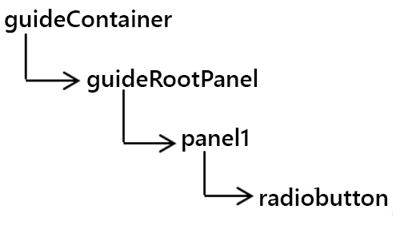
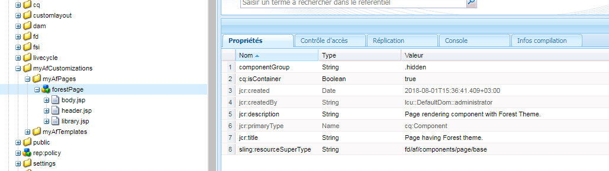

# Création de thèmes de formulaires adaptatifs personnalisés {#creating-custom-adaptive-form-themes}

>[!CAUTION]
>
>Les AEM Forms offrent la possibilité [d’éditeur](/help/forms/using/themes.md) de thème pour créer et modifier des [thèmes](/help/forms/using/themes.md)de formulaires adaptatifs. Exécutez les étapes répertoriées dans cet article, uniquement si vous avez effectué une mise à niveau à partir d’une version qui ne comporte pas d’éditeur [de](/help/forms/using/themes.md) thème et si vous avez déjà investi dans des thèmes créés à l’aide de fichiers Less/CSS (méthode d’éditeur de thème préalable).

## Conditions préalables {#prerequisites}

* Connaissance du cadre LESS (allégé CSS)
* Comment créer une bibliothèque cliente dans Adobe Experience Manager
* [Création d’un modèle de formulaire adaptatif](/help/forms/using/custom-adaptive-forms-templates.md) pour utiliser le thème que vous créez

## Thème de formulaire adaptatif {#adaptive-form-theme}

Un **thème de formulaire adaptatif** est une bibliothèque cliente AEM utilisée pour définir les styles, c’est-à-dire l’apparence d’un formulaire adaptatif.

Vous créez un **modèle adaptatif** et vous appliquez le thème au modèle. Ensuite, vous utilisez ce modèle personnalisé pour créer un **formulaire adaptatif**.



## Création d’un thème de formulaire adaptatif {#to-create-an-adaptive-form-theme}

>[!NOTE]
>
>La procédure suivante est décrite avec des exemples de noms d’objets AEM comme le nœud, les propriétés et les dossiers.
>
>Si vous procédez comme suit en utilisant les noms, le modèle résultant ressemble normalement à l’instantané suivant : 

**de formulaire adaptatif sur le thème Forêt Figure :** *Exemple de thème de forêt*

1. Create a node of type `cq:ClientLibraryFolder` under the `/apps`node.

   Par exemple, créez le nœud suivant :

   `/apps/myAfThemes/forestTheme`

1. Ajoutez une propriété à chaîne multi-valeur `categories` au nœud et définissez correctement sa valeur.

   Par exemple, définissez la propriété sur :`af.theme.forest` .

   

1. Add two folders, `less` and `css`, and a file `css.txt` to the node created in step 1:

   * `less` folder: Contient les fichiers `less` variables dans lesquels vous définissez les `less` variables et `less mixins` qui sont utilisées pour gérer les styles .css.

      Ce dossier se compose de fichiers de variables `less`, de fichiers mixin `less` et de fichiers `less` de définition utilisant les mixins et les variables. Et tous ces fichiers less sont ensuite importés dans styles.less.

   * dossier`css` :   : contient les fichiers .css dans lesquels vous définissez les styles statiques à utiliser dans le thème.

   **Fichiers de variables less** : ce sont les fichiers où vous définissez ou remplacez les variables utilisées lors de la définition des styles CSS.

   Les formulaires adaptatifs fournissent des variables en standard définies dans les fichiers .less suivants :

   * `/apps/clientlibs/fd/af/guidetheme/common/less/globalvariables.less`
   * `/apps/clientlibs/fd/af/guidetheme/common/less/layoutvariables.less`

   Les formulaires adaptatifs offrent également des variables tierces définies dans :

   `/apps/clientlibs/fd/af/third-party/less/variables.less`

   Vous pouvez utiliser les variables less fournies avec les formulaires adaptatifs, vous pouvez remplacer ces variables ou créer de nouvelles variables less.

   >[!NOTE]
   >
   >Lors de l’importation des fichiers du pré-processeur less, spécifiez le chemin d’accès relatif des fichiers dans l’instruction d’importation.

   Exemples de variables de remplacement :

   ```css
   @button-background-color: rgb(19, 102, 44);
   @button-border-color: rgb(19, 102, 44);
   @button-border-size: 0px;
   @button-padding: 10px 15px;
   @button-font-color: #ffffff;
   ```

   To override the `less`variables:

   1. Importer les variables de formulaire adaptatif par défaut :

      `/apps/clientlibs/fd/af/guidetheme/common/less/globalvariables.less/apps/clientlibs/fd/af/guidetheme/common/less/layoutvariables.less`

   1. Importez ensuite le fichier less contenant les variables remplacées.

   Exemples de définitions de nouvelles variables :

   ```css
   @button-focus-bg-color: rgb(40, 208, 90);
   @button-hover-bg-color: rgb(30, 156, 67);
   ```

   **Fichiers mixin less :** Vous pouvez définir les fonctions qui acceptent les variables comme arguments. Les styles résultants constituent la sortie de ces fonctions. Utilisez ces mixins dans différents styles, pour éviter de répéter les styles CSS.

   Les formulaires adaptatifs fournissent des mixins en standard définis dans :

   * `/apps/clientlibs/fd/af/guidetheme/common/less/adaptiveforms-mixins.less`

   Les formulaires adaptatifs offrent également des mixins tiers définis dans :

   * `/apps/clientlibs/fd/af/third-party/less/mixins.less`

   Exemple de définition de mixin : 

   ```css
   .rounded-corners (@radius) {
     -webkit-border-radius: @radius;
     -moz-border-radius: @radius;
     -ms-border-radius: @radius;
     -o-border-radius: @radius;
     border-radius: @radius;
   }
   
   .border(@color, @type, @size) {
      border: @color @size @type;
   }
   ```

   **Fichier Styles.less :** Utilisez ce fichier pour inclure tous les fichiers less (variables, mixins, styles) que vous devez utiliser dans la bibliothèque cliente.

   Dans l’exemple de fichier`styles.less`   suivant, les instructions d’importation peuvent être placées dans n’importe quel ordre.

   Les instructions pour importer les fichiers .less suivants sont obligatoires :

   * `globalvariables.less`
   * `layoutvariables.less`
   * `components.less`
   * `layouts.less`

   ```css
   @import "../../../clientlibs/fd/af/guidetheme/common/less/globalvariables.less";
   @import "../../../clientlibs/fd/af/guidetheme/common/less/layoutvariables.less";
   @import "forestTheme-variables";
   @import "../../../clientlibs/fd/af/guidetheme/common/less/components.less";
   @import "../../../clientlibs/fd/af/guidetheme/common/less/layouts.less";
   
   /* custom styles */
   
   .guidetoolbar {
     input[type="button"], button, .button {
       .rounded-corners (@button-radius);
       &:hover {
         background-color: @button-hover-bg-color;
       }
       &:focus {
         background-color: @button-focus-bg-color;
       }
     }
   }
   
   form {
       background-image: url(../images/forest.png);
    background-repeat: no-repeat;
    background-size: 100%;
   }
   ```

   Le dossier `css.txt` contient les chemins des fichiers .css à télécharger pour la bibliothèque.

   Par exemple :

   ```javascript
   #base=/apps/clientlibs/fd/af/third-party/css
   bootstrap.css
   
   #base=less
   styles.less
   
   #base=/apps/clientlibs/fd/xfaforms/xfalib/css
   datepicker.css
   listboxwidget.css
   scribble.css
   dialog.css
   ```

   >[!NOTE]
   >
   >Le fichier styles.less n’est pas obligatoire. Cela signifie que vous n’avez pas besoin de créer ce fichier, si vous n’avez défini des styles, des variables ou des mixins personnalisés.
   >
   >Cependant, si vous ne créez pas un fichier style.less, dans le fichier css.txt, vous devez annuler la mise en commentaire pour la ligne suivante :
   >
   >**`#base=less`**
   >
   >Et commenter la ligne suivante :
   >
   >**`styles.less`**

## Pour utiliser un thème dans un formulaire adaptatif {#to-use-a-theme-in-an-adaptive-form}

Après avoir créé un thème de formulaire adaptatif, effectuez les étapes suivantes pour utiliser ce thème dans un formulaire adaptatif : 

1. Pour inclure le thème créé dans [Création d’un thème de formulaire adaptatif](/help/forms/using/creating-custom-adaptive-form-themes.md#p-to-create-an-adaptive-form-theme-p), créez une page personnalisée de type `cq:Component`.

   Par exemple, `/apps/myAfCustomizations/myAfPages/forestPage`

   1. Add a `sling:resourceSuperType` property and set its value as `fd/af/components/page/base`.

      

   1. Pour utiliser un thème dans la page, vous devez ajouter au nœud un fichier de remplacement library.jsp.

      Importez ensuite le thème créé dans la section Création d’un thème de formulaire adaptatif de cet article.

      L’exemple de fragment de code suivant importe le thème `af.theme.forest` .

      ```jsp
      <%@include file="/libs/fd/af/components/guidesglobal.jsp"%>
      <cq:includeClientLib categories="af.theme.forest"/>
      ```

   1. **Facultatif** : dans la page personnalisée, remplacez les fichiers header.jsp, footer.jsp, et body.jsp le cas échéant.

1. Create a cutom template (for example: `/apps/myAfCustomizations/myAfTemplates/forestTemplate`) whose the jcr:content points to custom page created in the previous step (for example: `myAfCustomizations/myAfPages/forestPage)`.

   

1. Créez un formulaire adaptatif en utilisant le modèle créé à l’étape précédente. L’apparence du formulaire adaptatif est définie par le thème créé dans la section Création d’un formulaire adaptatif de cet article.

