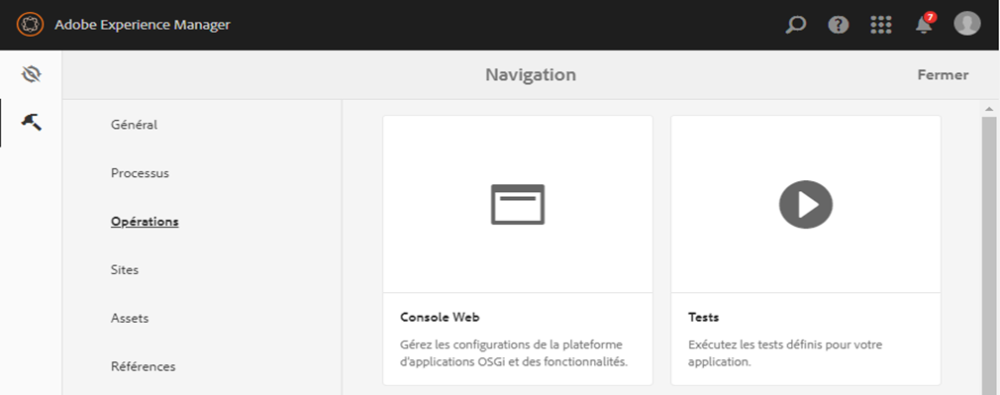

# Création de thèmes de formulaires adaptatifs personnalisés {#creating-custom-adaptive-form-themes}

>[!CAUTION]
>
>Adobe Experience Manager (AEM) Forms fournit les [Éditeur de thème](/help/forms/using/themes.md) possibilité de créer et de modifier des formulaires adaptatifs [thèmes](/help/forms/using/themes.md). Effectuez les étapes répertoriées dans cet article uniquement si vous avez effectué une mise à niveau à partir d’une version qui n’a pas de [Éditeur de thème](/help/forms/using/themes.md) et vous disposez d’un investissement dans les thèmes créés à l’aide de fichiers less/CSS (méthode d’éditeur de pré-thème).

## Prérequis {#prerequisites}

* Bien connaître la structure LESS (Leaner CSS)
* Création d’une bibliothèque cliente dans Adobe Experience Manager
* [Créer un modèle de formulaire adaptatif](/help/forms/using/custom-adaptive-forms-templates.md) pour utiliser le thème que vous créez

## Thème de formulaire adaptatif {#adaptive-form-theme}

Un **thème de formulaire adaptatif** est une bibliothèque cliente AEM que vous utilisez pour définir les styles (apparence) d’un formulaire adaptatif.

Vous pouvez créer une **modèle adaptatif** et appliquez le thème au modèle. Vous pouvez ensuite utiliser ce modèle personnalisé pour créer une **formulaire adaptatif**.


## Pour créer un thème de formulaire adaptatif {#to-create-an-adaptive-form-theme}

>[!NOTE]
>
>La procédure suivante est décrite à l’aide d’exemples de noms pour des objets AEM tels que les noeuds, les propriétés et les dossiers.
>
>Si vous procédez comme suit en utilisant les noms, le modèle résultant ressemble normalement à l’instantané suivant : 


**Figure :** *Exemple de thème Forêt*

1. Créez un nœud de type `cq:ClientLibraryFolder` sous le nœud `/apps`.

   Par exemple, créez le nœud suivant :

   `/apps/myAfThemes/forestTheme`

1. Ajoutez une propriété à chaîne multi-valeur `categories` au nœud et définissez correctement sa valeur.

   Par exemple, définissez la propriété sur : `af.theme.forest`.

   

1. Ajoutez deux dossiers, `less` et `css`, et un fichier `css.txt` au nœud créé à l’étape 1 :

   * Le dossier `less` contient les fichiers de variables `less` dans lesquels vous définissez les variables `less` et les éléments `less mixins` utilisés pour gérer les styles .css.

     Ce dossier est constitué de `less` fichiers variables, `less` fichiers mixin, `less` des fichiers définissant des styles à l’aide de mixins et de variables. Et tous ces `less` Les fichiers sont ensuite importés dans styles.less.

   * dossier`css` : contient les fichiers .css dans lesquels vous définissez les styles statiques à utiliser dans le thème.

   **Fichiers de variables less**: il s’agit des fichiers dans lesquels vous définissez ou remplacez les variables utilisées pour définir les styles CSS.

   Les formulaires adaptatifs fournissent des variables prêtes à l’emploi définies dans les `.less` files :

   * `/apps/clientlibs/fd/af/guidetheme/common/less/globalvariables.less`
   * `/apps/clientlibs/fd/af/guidetheme/common/less/layoutvariables.less`

   Les formulaires adaptatifs offrent également des variables tierces définies dans :

   `/apps/clientlibs/fd/af/third-party/less/variables.less`

   Vous pouvez utiliser la variable `less` variables fournies avec les formulaires adaptatifs, vous pouvez remplacer ces variables ou créer des `less` .

   >[!NOTE]
   >
   >Lors de l’importation des fichiers du préprocesseur less, spécifiez le chemin d’accès relatif des fichiers dans l’instruction d’importation.

   Exemples de variables de remplacement :

   ```css
   @button-background-color: rgb(19, 102, 44);
   @button-border-color: rgb(19, 102, 44);
   @button-border-size: 0px;
   @button-padding: 10px 15px;
   @button-font-color: #ffffff;
   ```

   Pour remplacer les variables `less` :

   1. Importez les variables de formulaire adaptatif par défaut :

      `/apps/clientlibs/fd/af/guidetheme/common/less/globalvariables.less/apps/clientlibs/fd/af/guidetheme/common/less/layoutvariables.less`

   1. Importez ensuite le fichier less contenant les variables remplacées.

   Exemples de définitions de nouvelles variables :

   ```css
   @button-focus-bg-color: rgb(40, 208, 90);
   @button-hover-bg-color: rgb(30, 156, 67);
   ```

   **Fichiers mixin less :** Vous pouvez définir les fonctions qui acceptent les variables comme arguments. La sortie de ces fonctions est les styles résultants. Utilisez ces mixins dans différents styles afin d’éviter la répétition de styles CSS.

   Les formulaires adaptatifs fournissent des mixins prêts à l’emploi définis dans :

   * `/apps/clientlibs/fd/af/guidetheme/common/less/adaptiveforms-mixins.less`

   Les formulaires adaptatifs offrent également des mixins tiers définis dans :

   * `/apps/clientlibs/fd/af/third-party/less/mixins.less`

   Exemple de définition de mixin : 

   ```css
   .rounded-corners (@radius) {
     -webkit-border-radius: @radius;
     -moz-border-radius: @radius;
     -ms-border-radius: @radius;
     -o-border-radius: @radius;
     border-radius: @radius;
   }
   
   .border(@color, @type, @size) {
      border: @color @size @type;
   }
   ```

   **Fichier Styles.less :** Utilisez ce fichier pour inclure tous les `less` fichiers (variables, mixins, styles) que vous devez utiliser dans la bibliothèque cliente.

   Dans l’exemple de fichier`styles.less` suivant, les instructions d’importation peuvent être placées dans n’importe quel ordre.

   Les instructions pour importer les éléments suivants `.less` Les fichiers sont obligatoires :

   * `globalvariables.less`
   * `layoutvariables.less`
   * `components.less`
   * `layouts.less`

   ```css
   @import "../../../clientlibs/fd/af/guidetheme/common/less/globalvariables.less";
   @import "../../../clientlibs/fd/af/guidetheme/common/less/layoutvariables.less";
   @import "forestTheme-variables";
   @import "../../../clientlibs/fd/af/guidetheme/common/less/components.less";
   @import "../../../clientlibs/fd/af/guidetheme/common/less/layouts.less";
   
   /* custom styles */
   
   .guidetoolbar {
     input[type="button"], button, .button {
       .rounded-corners (@button-radius);
       &:hover {
         background-color: @button-hover-bg-color;
       }
       &:focus {
         background-color: @button-focus-bg-color;
       }
     }
   }
   
   form {
       background-image: url(../images/forest.png);
    background-repeat: no-repeat;
    background-size: 100%;
   }
   ```

   Le dossier `css.txt` contient les chemins des fichiers .css à télécharger pour la bibliothèque.

   Par exemple :

   ```javascript
   #base=/apps/clientlibs/fd/af/third-party/css
   bootstrap.css
   
   #base=less
   styles.less
   
   #base=/apps/clientlibs/fd/xfaforms/xfalib/css
   datepicker.css
   listboxwidget.css
   scribble.css
   dialog.css
   ```

   >[!NOTE]
   >
   >Le fichier styles.less n’est pas obligatoire. Cela signifie que vous n’avez pas besoin de créer ce fichier si vous n’avez défini aucun style, variable ou mixin personnalisé.
   >
   >Cependant, si vous ne créez pas de fichier style.less, dans le fichier css.txt, vous devez annuler la mise en commentaire de la ligne suivante :
   >
   >**`#base=less`**
   >
   >Et commenter la ligne suivante :
   >
   >**`styles.less`**

## Pour utiliser un thème dans un formulaire adaptatif {#to-use-a-theme-in-an-adaptive-form}

Après avoir créé un thème de formulaire adaptatif, effectuez les étapes suivantes pour utiliser ce thème dans un formulaire adaptatif : 

1. Pour inclure le thème créé dans [Création d’un thème de formulaire adaptatif](/help/forms/using/creating-custom-adaptive-form-themes.md#p-to-create-an-adaptive-form-theme-p), créez une page personnalisée de type `cq:Component`.

   Par exemple, `/apps/myAfCustomizations/myAfPages/forestPage`

   1. Ajoutez une propriété `sling:resourceSuperType` et définissez sa valeur sur `fd/af/components/page/base`.

      

   1. Pour utiliser un thème dans la page, vous devez ajouter au noeud un fichier de remplacement library.jsp.

      Vous pouvez ensuite importer le thème créé dans la section Pour créer un thème de formulaire adaptatif de cet article.

      L’exemple de fragment de code suivant importe le thème `af.theme.forest`.

      ```jsp
      <%@include file="/libs/fd/af/components/guidesglobal.jsp"%>
      <cq:includeClientLib categories="af.theme.forest"/>
      ```

   1. **Facultatif** : dans la page personnalisée, remplacez les fichiers header.jsp, footer.jsp, et body.jsp le cas échéant.

1. Créez un modèle personnalisé (par exemple : `/apps/myAfCustomizations/myAfTemplates/forestTemplate`) dont le jcr:content pointe vers la page personnalisée créée à l’étape précédente (par exemple : `myAfCustomizations/myAfPages/forestPage)`.

   

1. Créez un formulaire adaptatif à l&#39;aide du modèle créé à l&#39;étape précédente. L’aspect du formulaire adaptatif est défini par le thème créé dans la section Pour créer un thème de formulaire adaptatif de cet article.
