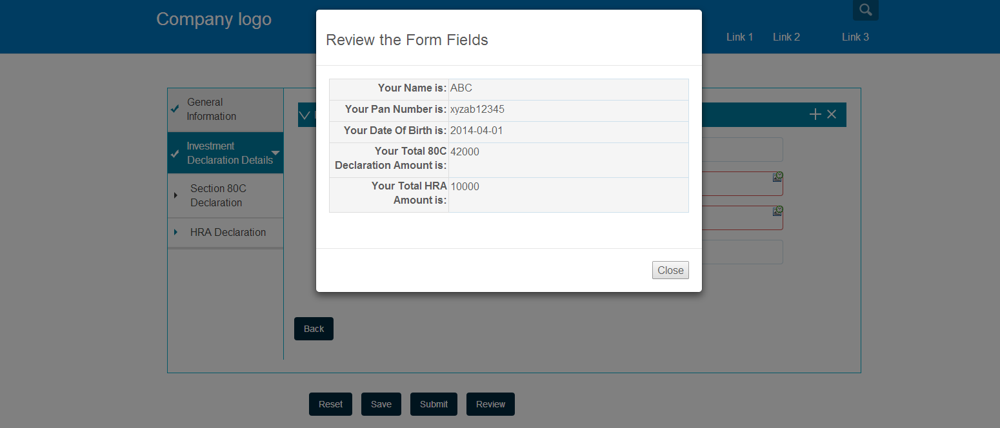

# Création d’une action de barre d’outils personnalisée{#creating-a-custom-toolbar-action}

## Conditions préalables {#prerequisite}

Avant de créer une action de barre d’outils personnalisée, reportez-vous aux sections [Utilisation de bibliothèques côté client](/help/sites-developing/clientlibs.md) et [Développement avec CRXDE Lite](/help/sites-developing/developing-with-crxde-lite.md) pour vous familiariser avec ces concepts.

## Qu’est-ce qu’une action ?{#what-is-an-action-br} 

Un formulaire adaptatif propose une barre d’outils qui permet à un auteur de formulaires de configurer un ensemble d’options. Ces options sont définies comme des actions pour le formulaire adaptatif. Cliquez sur le bouton Modifier de la barre d’outils pour que le panneau définisse les actions prises en charge par les formulaires adaptatifs.


Outre l’ensemble d’actions proposé par défaut, vous pouvez créer des actions personnalisées dans la barre d’outils. Vous pouvez, par exemple, ajouter une action qui permet à l’utilisateur de parcourir tous les champs d’un formulaire adaptatif avant d’envoyer ce dernier.

## Steps to create a custom action in an adaptive forms {#steps}

La procédure ci-dessous illustre la création d’une action personnalisée dans la barre d’outils. Elle décrit la création d’un bouton permettant aux utilisateurs finaux de parcourir tous les champs d’un formulaire adaptatif avant d’envoyer un formulaire complété.

1. All the default actions supported by adaptive forms are present in `/libs/fd/af/components/actions` folder. Dans CRXDE, copiez le `fileattachmentlisting` noeud de `/libs/fd/af/components/actions/fileattachmentlisting` à `/apps/customaction`.

1. After copying the node to `apps/customaction` folder, rename the node name to `reviewbeforesubmit`. Also, change the `jcr:title` and `jcr:description` properties of the node.

   La propriété `jcr:title` contient le nom de l’action qui s’affiche dans la boîte de dialogue de la barre d’outils. La propriété `jcr:description` contient davantage d’informations qui s’affichent lorsqu’un utilisateur place le pointeur de la souris sur l’action.

   

1. Sélectionnez `cq:template` le noeud dans `reviewbeforesubmit` le noeud. Ensure that the value of `guideNodeClass` property is `guideButton` and change `jcr:title` property accordingly.
1. Change the type property in the `cq:Template` node. Dans l’exemple proposé, transformez la propriété de type en bouton.

   La valeur de type est ajoutée en tant que classe CSS dans le code HTML généré du composant. Les utilisateurs peuvent se servir de cette classe CSS pour appliquer un style à leurs actions. Le style par défaut pour les appareils mobiles et fixes (ordinateurs de bureau) est fourni pour les valeurs de type Bouton, Envoyer, Réinitialiser et Enregistrer.

1. Sélectionnez l’action personnalisée dans la boîte de dialogue de barre d’outils de modification du formulaire adaptatif. Un bouton Révision s’affiche dans la barre d’outils du panneau.

    

1. Pour fournir des fonctionnalités au bouton Révision, ajoutez du code JavaScript et CSS, ainsi que du code côté serveur, dans le fichier init.jsp situé dans le nœud `reviewbeforesubmit`.

   Ajoutez le code suivant dans le fichier `init.jsp`.

   ```jsp
   <%@include file="/libs/fd/af/components/guidesglobal.jsp" %>
   <guide:initializeBean name="guideField" className="com.adobe.aemds.guide.common.GuideButton"/>
   
   <c:if test="${not isEditMode}">
           <cq:includeClientLib categories="reviewsubmitclientlibruntime" />
   </c:if>
   
   <%--- BootStrap Modal Dialog  --------------%>
   <div class="modal fade" id="reviewSubmit" tabindex="-1">
       <div class="modal-dialog">
           <div class="modal-content">
               <div class="modal-header">
                   <h3>Review the Form Fields</h3>
               </div>
               <div class="modal-body">
                   <div class="modal-list">
                       <table class="table table-bordered">
                           <tr class="name">
                               <td class="reviewlabel col-md-3 active">
                                   <label>Your Name is: </label>
                               </td>
                           </tr>
                           <tr class="pan">
                               <td class="reviewlabel col-md-3 active">
                                   <label>Your Pan Number is: </label>
                               </td>
                           </tr>
                           <tr class="dob">
                               <td class="reviewlabel col-md-3 active">
                                   <label>Your Date Of Birth is: </label>
                               </td>
                           </tr>
                           <tr class="80cdeclaration">
                               <td class="reviewlabel col-md-3 active">
                                   <label>Your Total 80C Declaration Amount is: </label>
                               </td>
                           </tr>
                           <tr class="rentpaid">
                               <td class="reviewlabel col-md-3 active">
                                   <label>Your Total HRA Amount is: </label>
                               </td>
                           </tr>
                       </table>
                   </div>
               </div><!-- /.modal-body -->
               <div class="modal-footer">
                   <div class="fileAttachmentListingCloseButton col-md-2 col-xs-2 col-sm-2">
                       <button data-dismiss="modal">Close</button>
                   </div>
               </div>
           </div><!-- /.modal-content -->
       </div><!-- /.modal-dialog -->
   </div><!-- /.modal -->
   ```

   Ajoutez le code suivant dans le fichier `ReviewBeforeSubmit.js`.

   ```javascript
   /*anonymous function to handle show of review before submit view */
   $(function () {
       if($("div.reviewbeforesubmit button[id*=reviewbeforesubmit]").length > 0) {
           $("div.reviewbeforesubmit button[id*=reviewbeforesubmit]").click(function(){
               // Create the options object to be passed to the getElementProperty API
               var options = {},
                   result = [];
               options.somExpressions = [];
               options.propertyName = "value";
               guideBridge.visit(function(model){
                   if(model.name === "name" || model.name === "pan" || model.name === "dateofbirth" || model.name === "total" || model.name === "totalmonthlyrent"){
                           options.somExpressions.push(model.somExpression);
                   }
               }, this);
               result = guideBridge.getElementProperty(options);
   
               $('#reviewSubmit .reviewlabel').each(function(index, item){
                   var data = ((result.data[index] == null) ? "No Data Filled" : result.data[index]);
                   if($(this).next().hasClass("reviewlabelvalue")){
                       $(this).next().html(data);
                   } else {
                       $(this).after($("<td></td>").addClass("reviewlabelvalue col-md-6 active").html(data));
                   }
               });
               // added because in mobile devices it was causing problem of backdrop
               $("#reviewSubmit").appendTo('body');
               $("#reviewSubmit").modal("show");
           });
       }
   });
   ```

   Ajoutez le code suivant dans le fichier `ReviewBeforeSubmit.css`.

   ```css
   .modal-list .reviewlabel {
       white-space: normal;
       text-align: right;
       padding:2px;
   }
   
   .modal-list .reviewlabelvalue {
       border: #cde0ec 1px solid;
       padding:2px;
   }
   
   /* Adding icon for this action in mobile devices */
   /* This is the glyphicon provided by bootstrap eye-open */
   /* .<type> .iconButton-icon */
   .reviewbeforesubmit .iconButton-icon {
       position: relative;
       top: -8px;
       font-family: 'Glyphicons Halflings';
       font-style: normal;
   }
   
   .reviewbeforesubmit .iconButton-icon:before {
       content: "\e105"
   }
   ```

1. Pour vérifier les fonctionnalités de l’action personnalisée, ouvrez le formulaire adaptatif en mode Aperçu et cliquez sur Révision dans la barre d’outils.

   >[!NOTE]
   >
   >La bibliothèque `GuideBridge` n’est pas chargée en mode de création. Cette action personnalisée ne fonctionne donc pas dans ce mode.

   

## Exemples {#samples}

L’archive suivante contient un module de contenu, qui comprend un formulaire adaptatif associé à la démonstration ci-dessus de l’action de barre d’outils personnalisée.

[Obtenir le fichier](assets/customtoolbaractiondemo.zip)
