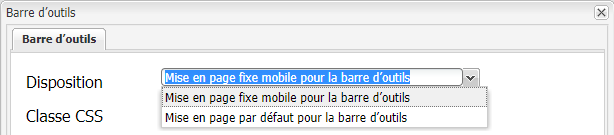
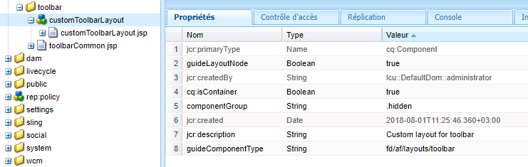
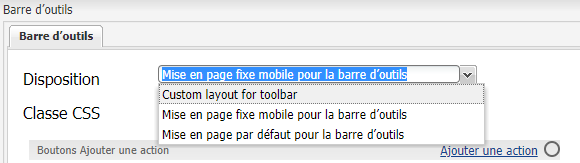

# Création d’une mise en page de barre d’outils personnalisée{#creating-custom-toolbar-layout}

## Dispositions de barre d’outils {#layout}

Lorsque vous créez un formulaire adaptatif, vous pouvez spécifier une disposition de barre d’outils pour celui-ci. La disposition de barre d’outils définit les commandes et la disposition de la barre d’outils dans le formulaire.

La disposition de barre d’outils dépend fortement du traitement côté client piloté par du code JavaScript et CSS complexe. Organiser et optimiser la diffusion de ce code est une opération qui peut se révéler complexe. Pour résoudre ce problème, AEM fournit des dossiers de bibliothèque côté client qui permettent de stocker le code côté client dans le référentiel, de le classer dans des catégories et de définir quand et comment chaque catégorie de code doit être diffusée au client. Le système de bibliothèque côté client se charge alors de la génération des liens appropriés dans la page web finale pour charger le code correct. Pour plus d’informations, consultez [Fonctionnement des bibliothèques côté client dans AEM.](/help/sites-developing/clientlibs.md)


Exemple de mise en page de la barre d’outils

Les formulaires adaptatifs fournissent un ensemble de dispositions prêtes à l’emploi :



Mises en page de barre d’outils prêtes à l’emploi

Vous pouvez en outre créer une disposition de barre d’outils personnalisée.

La procédure suivante décrit les étapes pour créer une barre d’outils personnalisée qui affiche trois actions dans la barre d’outils et d’autres actions dans une liste déroulante de la barre d’outils.

Le package de contenu joint contient le code complet décrit ci-dessous. Une fois le package de contenu installé, ouvrez `/content/forms/af/CustomLayoutDemo.html` pour afficher la démonstration relative à la mise en page de la barre d’outils personnalisée.

CustomToolbarLayoutDemo.zip

[Obtenir le fichier](assets/customtoolbarlayoutdemo.zip)
Démonstration relative à la mise en page de la barre d’outils personnalisée

## Pour créer une disposition de barre d’outils personnalisée {#layout-1}

1. Créez un dossier pour stocker vos dispositions de barre d’outils. Par exemple :

   `/apps/customlayout/toolbar`.

   Pour créer une mise en page personnalisée, vous pouvez utiliser (et personnaliser) une des mises en page de barre d’outils prêtes à l’emploi disponibles dans le dossier suivant :

   `/libs/fd/af/layouts/toolbar`

   Par exemple, copiez le nœud `mobileFixedToolbarLayout` du dossier `/libs/fd/af/layouts/toolbar` vers le dossier `/apps/customlayout/toolbar`.

   Copiez également le fichier toolbarCommon.jsp dans le dossier `/apps/customlayout/toolbar`.

   >[!NOTE]
   >
   >Le dossier que vous créez pour stocker les mises en page personnalisées peut être créé avec le dossier `apps`.

1. Renommez le nœud copié, de `mobileFixedToolbarLayout` à `customToolbarLayout.`.

   Fournissez également une description appropriée pour le nœud. Par exemple, remplacez le jcr:description du nœud par **Disposition personnalisée pour la barre d’outils**.

   La propriété `guideComponentType` du nœud détermine le type de mise en page. Dans le cas présent, le type de mise en page est toolbar. Il apparaît par conséquent dans la liste déroulante de sélection des mises en page de barre d’outils.

   

   Nœud avec description appropriée

   Votre nouvelle mise en page de barre d’outils personnalisée s’affiche dans la configuration de la boîte de dialogue **Barre d’outils du formulaire adaptatif**.

   

   Liste des mises en page de barre d’outils

   >[!NOTE]
   >
   >La description mise à jour à l’étape précédente s’affiche dans la liste déroulante Disposition.

1. Sélectionnez cette disposition de barre d’outils personnalisée, puis cliquez sur OK.

   Ajoutez clientlib (JavaScript et css) dans le nœud `/etc/customlayout` et incluez la référence de clientlib dans le `customToolbarLayout.jsp`.

   

   Chemin d’accès au fichier customToolbarLayout.css

   Échantillon `customToolbarLayout.jsp` :

   ```jsp
   <%@include file="/libs/fd/af/components/guidesglobal.jsp" %>
   <cq:includeClientLib categories="customtoolbarlayout" />
   <c:if test="${isEditMode}">
           <cq:includeClientLib categories="customtoolbarlayoutauthor" />
   </c:if>
   <div class="guidetoolbar mobileToolbar mobilecustomToolbar" data-guide-position-class="guide-element-hide">
       <div data-guide-scroll-indicator="true"></div>
       <%@include file="../toolbarCommon.jsp" %>
   </div>
   ```

   >[!NOTE]
   >
   >Ajoutez la classe guidetoolbar pour la disposition. Le style prêt à l’emploi de la barre d’outils est défini conformément à la classe guidetoolbar.

   Échantillon `toolBarCommon.jsp` :

   ```jsp
   <%@taglib prefix="fn" uri="https://java.sun.com/jsp/jstl/functions"%>
   <%--------------------
   This code iterates over all the tool bar items using the guideToolbar bean.
   If the number of toolbar items are more than 3, then we create a dropdown menu using bootstrap for other actions present in the toolbar.
   In both desktop and mobile devices, the layout is different.
   ---------------------------------%>
   
   <c:forEach items="${guideToolbar.items}" var="toolbarItem" varStatus="loop">
       <c:choose>
         <c:when test="${loop.index gt 2}">
      <c:choose>
       <c:when test="${loop.index eq 3}">
                     <div class="btn-group dropdown">
                       <button type="button" class="btn btn-primary dropdown-toggle label" data-toggle="dropdown">Actions <span class="caret"></code></button>
                       <button type="button" class="btn btn-primary dropdown-toggle icon" data-toggle="dropdown"><span class="glyphicon glyphicon-th-list"></code></button>
             <ul class="dropdown-menu" role="menu">
                           <li>
                               <div id="${toolbarItem.id}_guide-item">
                                 <sling:include path="${toolbarItem.path}" resourceType="${toolbarItem.resourceType}"/>
                              </div>
                           </li>
                           <c:if test="${loop.index eq (fn:length(guideToolbar.items)-1)}">
                                </ul>
                                </div>
                           </c:if>
       </c:when>
       <c:when test="${loop.index eq (fn:length(guideToolbar.items)-1)}">
                          <li>
                                     <div id="${toolbarItem.id}_guide-item">
                                         <sling:include path="${toolbarItem.path}" resourceType="${toolbarItem.resourceType}"/>
                                     </div>
                           </li>
                       </ul>
                     </div>
   
       </c:when>
       <c:otherwise>
         <li>
          <div id="${toolbarItem.id}_guide-item">
           <sling:include path="${toolbarItem.path}" resourceType="${toolbarItem.resourceType}"/>
          </div>
         </li>
       </c:otherwise>
      </c:choose>
         </c:when>
         <c:otherwise>
     <div id="${toolbarItem.id}_guide-item">
           <sling:include path="${toolbarItem.path}" resourceType="${toolbarItem.resourceType}"/>
        </div>
         </c:otherwise>
    </c:choose>
   </c:forEach>
   ```

   CSS présent dans le nœud clientlib :

   ```css
   .mobilecustomToolbar .dropdown {
       display: inline-block;
   }
   
   .mobilecustomToolbar .dropdown {
       float: right;
   }
   
   .mobilecustomToolbar .dropdown > button {
      padding: 6px 12px;
   }
   
   .mobilecustomToolbar .dropdown .guideFieldWidget, .mobilecustomToolbar .dropdown .guideFieldWidget button {
       width: 100%;
   }
   
   .mobilecustomToolbar .dropdown .caret{
       border-bottom: 6px solid;
       border-right: 6px solid transparent;
       border-left: 6px solid transparent;
    border-top: transparent;
   }
   
   .mobilecustomToolbar .dropdown-menu{
    top: auto;
    bottom: 100%;
   }
   
   .mobilecustomToolbar .btn-group {
    vertical-align: super;
   }
   
   .mobilecustomToolbar .glyphicon {
    font-size: 24px;
   }
   
   @media (max-width: 767px){
   
    .mobilecustomToolbar .dropdown .guideButton .iconButton-icon {
      display: none;
       }
   
       .mobilecustomToolbar .dropdown .guideButton .iconButton-label {
      display: inline-block;
       }
   
       .mobilecustomToolbar .dropdown .guideButton button {
      background-color: #013853;
       }
   
    .mobilecustomToolbar .btn-group {
     vertical-align: top;
    }
   
   }
   ```

>[!NOTE]
>
>La description mise à jour à l’étape précédente s’affiche dans la liste déroulante Disposition.


Vue de bureau de la barre d’outils avec mise en page personnalisée
