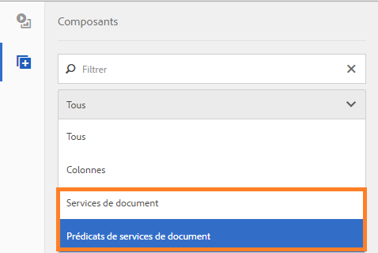
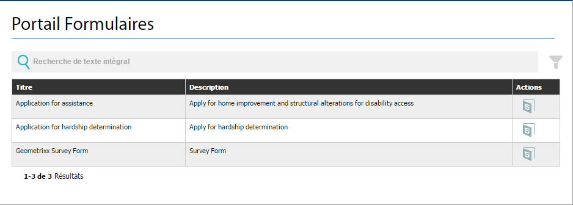
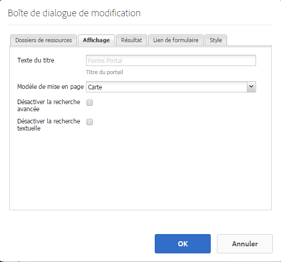
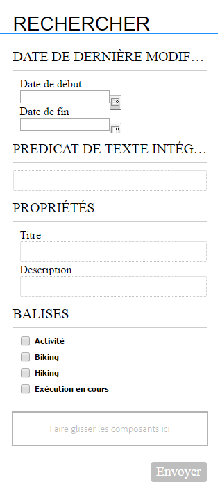
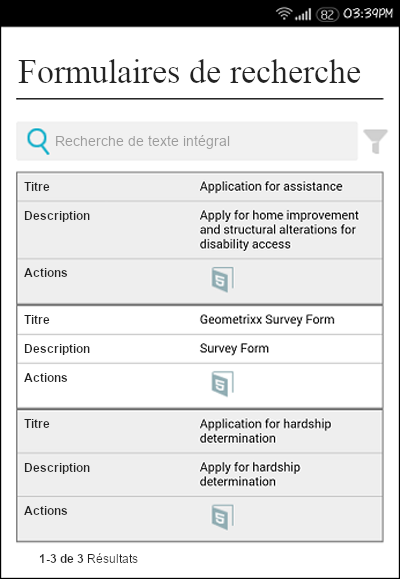

# Création d’une page de portail Formulaires{#creating-a-forms-portal-page}

| Version | Lien de l’article |
| -------- | ---------------------------- |
| AEM as a Cloud Service | [Cliquez ici](https://experienceleague.adobe.com/docs/experience-manager-cloud-service/content/forms/adaptive-forms-authoring/authoring-adaptive-forms-foundation-components/configure-forms-portal.html?lang=fr) |
| AEM 6.5 | Cet article |

Les composants du portail Formulaires permettent aux développeurs et développeuses web de créer et de personnaliser un portail de formulaires sur les sites web créés à l’aide d’Adobe Experience Manager (AEM). Pour obtenir un aperçu rapide du portail Formulaires, consultez [Présentation de la publication de formulaires sur un portail](../../forms/using/introduction-publishing-forms.md).

## Prérequis {#prerequisites}

Les composants du portail Formulaires ne sont pas disponibles par défaut. Assurez-vous que les catégories de composants du portail Formulaires suivantes sont activées comme décrit dans la section [Activer des composants du portail Formulaires](/help/forms/using/enabling-forms-portal-components.md).

**Document Services** : comprend les composants Search &amp; Lister, Link et Drafts and Submissions.

**Prédicats de services de document** : comprend les composants Prédicat de date, Prédicat de texte intégral, Prédicat de propriétés et Prédicat de balises. Ces composants sont utilisés pour configurer la recherche dans le composant Search &amp; Lister.

Une fois qu’elles sont activées sur une page de sites AEM, ces catégories de composants peuvent être utilisées dans l’explorateur de composants.

Catégories de composants du portail Formulaires

## Composant Search &amp; Lister {#search-amp-lister-component}

Le composant Search &amp; Lister, disponible dans la catégorie de composants Document Services, est utilisé pour répertorier les formulaires sur une page et implémenter la recherche sur les formulaires répertoriés. Le composant comprend deux volets :

* Volet de liste dans lequel les formulaires sont répertoriés.
* Volet de recherche dans lequel vous ajoutez la fonctionnalité de recherche.

Vous pouvez faire glisser le composant Search &amp; Lister depuis la catégorie de composants Document Services dans le navigateur de composants sur la page. Une fois ajouté, le composant se présente comme suit.

Composant Search &amp; Lister dans une page avec une disposition Grille

### Volet Liste {#list-pane}

La zone de liste contient vos formulaires répertoriés. Le composant Search &amp; Lister fournit différentes options de configuration à utiliser pour contrôler l’affichage de formulaires dans le volet Liste.

Pour configurer le volet Liste , sélectionnez le composant Search and Lister , puis sélectionnez . La boîte de dialogue **[!UICONTROL Modifier le composant]** s’ouvre.

Volet Liste en mode d’édition

La boîte de dialogue **Modifier** comprend plusieurs onglets fournissant des options de configuration décrites dans le tableau ci-dessous. Sélectionner **OK** pour enregistrer la configuration, une fois cette opération terminée.

<table>
 <tbody>
  <tr>
   <th>Tabulation</th>
   <th>Configuration</th>
   <th>Description</th>
  </tr>
  <tr>
   <td><strong>Dossiers des actifs</strong></code></td>
   <td>Ajouter un élément</td>
   <td>Configure les dossiers dans lesquels les ressources sont chargées à l’aide de l’interface utilisateur d’AEM Forms. Par défaut, il répertorie toutes les ressources chargées. Pour plus d’informations sur l’interface utilisateur d’AEM Forms, voir <a href="../../forms/using/introduction-managing-forms.md" target="_blank">Présentation de la gestion des formulaires</a>.</td>
  </tr>
  <tr>
   <td>
<strong>Affichage</strong></code>
 </td>
   <td>Texte du titre</td>
   <td>Titre du composant Search &amp; Lister. Le titre par défaut est : <strong>Portail Formulaires.</strong></td>
  </tr>
  <tr>
   <td> </td>
   <td>Modèle de mise en page</td>
   <td>Mise en page des ressources. </td>
  </tr>
  <tr>
   <td> </td>
   <td>Désactiver la recherche avancée</td>
   <td>Lorsque cette option est activée, l’icône de recherche avancée est masquée.</td>
  </tr>
  <tr>
   <td> </td>
   <td>Désactiver la recherche de texte</td>
   <td>Lorsque cette option est activée, la barre de recherche en texte intégral est masquée.</td>
  </tr>
  <tr>
   <td><strong>Résultat</strong></code></td>
   <td>Nombre de résultats par page</td>
   <td>Configure le nombre maximal de formulaires à afficher sur une page.</td>
  </tr>
  <tr>
   <td> </td>
   <td>Texte des résultats</td>
   <td>
Configure le texte des résultats (par exemple, 1-12 sur 601 <strong>résultats</strong>). La valeur par défaut est <strong>Résultats</strong>.
 
Par exemple, si vous indiquez <strong>Formulaires</strong> dans ce champ et que le nombre total est de 601 formulaires, le texte des résultats devient 1-12 de 601 <strong>Formulaires</strong>.
 </td>
  </tr>
  <tr>
   <td> </td>
   <td>Texte de la page</td>
   <td>
Configure le texte de la page (par exemple, <strong>Page </strong>1 de 51). La valeur par défaut est <strong>Page</strong>.
 
Par exemple, si vous indiquez <strong>Formulaire de demande</strong> dans ce champ et qu’il y a 51 pages, le texte de la page devient <strong>Formulaire de demande</strong> 1 de 51.
 </td>
  </tr>
  <tr>
   <td> </td>
   <td>Texte de</td>
   <td>
Remplace le mot <strong>de</strong> par le texte spécifié (Page 1 <strong>de</strong>51). La valeur par défaut est <strong>de</strong>.
 
Par exemple, si vous spécifiez <strong>sur</strong> dans ce champ, le texte est remplacé par Page 1 <strong>sur </strong>51.
 </td>
  </tr>
  <tr>
   <td><strong>Lien de formulaire</strong></code></td>
   <td>Type de rendu</td>
   <td>Contrôle la liste des formulaires en fonction du type de rendu spécifié. Les options disponibles sont PDF et HTML. Par exemple, si vous sélectionnez uniquement HTML comme type de rendu, les formulaires PDF sont exclus du filtre.</td>
  </tr>
  <tr>
   <td> </td>
   <td>Profil HTML</td>
   <td>Configure le profil HTML à utiliser pour le rendu. Tous les profils disponibles sont répertoriés dans la liste déroulante.</td>
  </tr>
  <tr>
   <td> </td>
   <td>URL d’envoi</td>
   <td>
Configure un servlet vers lequel les données de formulaire sont envoyées.
 
<strong>Remarque :</strong><em>l’URL d’envoi d’un formulaire peut être spécifiée à divers emplacements et l’ordre de priorité s’établit comme suit :</em>

    <ol>
     <li><em>La valeur Submit URL intégrée dans le formulaire (dans le bouton d’envoi) a la priorité la plus élevée.</em></li>
     <li><em>Dans l’ordre des priorités, la valeur Submit URL mentionnée dans l’interface utilisateur d’AEM Forms arrive en deuxième position.</em></li>
     <li><em>La valeur Submit URL mentionnée dans Forms Portal a la priorité la plus faible.</em></li>
    </ol> </td>
  </tr>
  <tr>
   <td> </td>
   <td>Info-bulle HTML Render Action</td>
   <td>Configure le texte de l’info-bulle qui s’affiche lorsque le pointeur de la souris survole  (l’icône HTML5).</td>
  </tr>
  <tr>
   <td> </td>
   <td>Info-bulle PDF Render Action</td>
   <td>Configure le texte de l’info-bulle qui s’affiche lorsque le pointeur de la souris survole  (l’icône PDF).</td>
  </tr>
  <tr>
   <td><strong>Style</strong></code></td>
   <td>Type de style</td>
   <td>Vous permet de spécifier <strong>Aucun style, Style par défaut</strong> ou <strong>Style personnalisé</strong> pour répertorier les formulaires.</td>
  </tr>
  <tr>
   <td> </td>
   <td>Chemin d’accès au style personnalisé</td>
   <td>Si vous avez sélectionné l’option Personnalisé dans Type de style, accédez à la feuille CSS personnalisée pour en spécifier le chemin ou sélectionnez Par défaut.</td>
  </tr>
 </tbody>
</table>

### Volet Recherche {#search-pane}

La zone de recherche vous permet d’ajouter les composants Date Predicate (attribut de date), Full Text Predicate (attribut de texte intégral) et Tags predicate (attribut d’étiquette) dans la catégorie Document Services Predicates du sidekick d’AEM. Ces composants implémentent la fonction de recherche pour permettre aux utilisateurs d’effectuer une recherche dans les formulaires répertoriés.

**Conseil :** *vous pouvez contrôler la liste des formulaires affichée sur votre portail de formulaires en fonction d’un paramètre prédéfini et masquer la fonctionnalité de recherche pour les utilisateurs finaux. Pour contrôler la liste des formulaires, utilisez les attributs pour appliquer des filtres de recherche. Vous pouvez également spécifier la valeur de filtre par défaut et désactiver la recherche dans l’onglet Affichage de la boîte de dialogue Modification du composant.*

Panneau de recherche avec les attributs Date, Texte complet, Propriétés et Balises

#### Prédicat de la date {#date-predicate}

Une fois ajouté, l’attribut de date permet d’effectuer une recherche dans les formulaires répertoriés en fonction de la durée de leur modification.

Pour configurer l’attribut de prédicat de date :

1. Sélectionnez le composant, puis sélectionnez . La boîte de dialogue Edit (Modification du composant) s’ouvre.
1. Indiquez les informations suivantes :

   * **Type** : la seule option disponible est **Date de la dernière modification**.

   * **Texte** : libellé ou légende pour l’attribut de date. La valeur par défaut est **Date de la dernière modification**.

   * **Libellé Date de début** : libellé ou légende correspondant au champ de date de début.
   * **Libellé Date de fin** : libellé ou légende correspondant au champ de date de fin.
   * **Masquer** : permet d’appliquer le filtre de date par défaut permettant de répertorier les formulaires. 

1. Sélectionner **OK**

#### Prédicat de texte intégral {#full-text-predicate}

Le composant Prédicat de texte intégral permet d’effectuer une recherche de texte intégral sur les données de formulaire, telles que le nom et la description. Les utilisateurs et utilisatrices peuvent effectuer des recherches dans n’importe quelle chaîne de texte pour renvoyer les formulaires dont le nom ou la description contient le texte.

Pour configurer le composant Prédicat de texte intégral, procédez comme suit :

1. Sélectionnez le composant, puis sélectionnez . La boîte de dialogue Edit (Modification du composant) s’ouvre.
1. Indiquez le titre dans le champ **Titre principal**.
1. Sélectionner **Ok**

#### Prédicat de propriétés {#properties-predicate}

Le composant Prédicat de propriétés permet d’effectuer une recherche dans les formulaires en fonction des propriétés du formulaire, telles que le titre, l’auteur ou l’autrice et la description.

Pour configurer le composant Prédicat de propriétés, procédez comme suit :

1. Sélectionnez le composant, puis sélectionnez . La boîte de dialogue Edit (Modification du composant) s’ouvre.
1. Dans l’onglet Général, indiquez le libellé de la recherche. La valeur par défaut est **Propriétés**.

1. Dans l’onglet Options, sélectionnez **Ajouter un élément.**
1. Sélectionnez une propriété dans la liste déroulante et spécifiez un libellé de recherche pour la propriété dans le champ situé sous la liste déroulante.
1. Répétez l’étape 4 pour ajouter d’autres propriétés. Vous pouvez également indiquer une valeur de filtre par défaut pour répertorier les formulaires basés sur les critères spécifiés et masquer la propriété pour les recherches effectuées par les utilisateurs finaux. Cochez la case Hide (Masquer) d’une propriété et spécifiez la valeur de filtre par défaut.
Par exemple, si vous souhaitez afficher les formulaires dont le titre contient le mot « voyage », sélectionnez Masquer à côté de la propriété de titre. Spécifiez également « Voyage » dans la zone de texte Valeur de filtre par défaut.

1. Sélectionner **OK**

#### Prédicat de balises {#tags-predicate}

Le composant Prédicat de balises permet d’effectuer une recherche dans les formulaires en fonction des balises définies dans Forms Manager.

Pour configurer le composant Prédicat de balises, procédez comme suit :

1. Sélectionnez le composant, puis sélectionnez . La boîte de dialogue Edit (Modification du composant) s’ouvre.
1. Sélectionnez la flèche vers le bas située en regard du champ Balises .
1. Sélectionner les balises appropriées
1. Sélectionner **OK**

Les balises sélectionnées s’affichent dans le volet Rechercher, avec les cases à cocher de sélection. Les utilisateurs peuvent affiner leur recherche en fonction des balises.

## Répertorier les formulaires sur une page {#list-forms-on-a-page-br}

Pour répertorier les formulaires sur une page, ajoutez le composant **[!UICONTROL Search &amp; Lister]** à la page et configurer le **[!UICONTROL volet Liste]**. Pour permettre aux utilisateurs finaux et utilisatrices finales de rechercher des formulaires avec la date, le texte et les balises, ajoutez un composant **[!UICONTROL Volet Rechercher]**.

Pour lier un formulaire à partir de n’importe quel emplacement de la page, utilisez le composant Lien. Pour en savoir plus sur le composant Link, consultez la section [Intégrer le composant Link dans une page](../../forms/using/embedding-link-component-page.md).

Pour répertorier les formulaires qui sont à l’état de brouillon et ceux qui sont déjà envoyés, utilisez le composant **[!UICONTROL Brouillons et envois]**. Pour plus d’informations, voir [Personnalisation du composant Brouillons et envois](../../forms/using/draft-submission-component.md).

## Compatibilité avec les appareils mobiles {#mobile-device-friendliness}

Le composant Search &amp; Lister du Portail Formulaires est compatible avec les appareils mobiles et s’adapte en conséquence. Les trois vues par défaut (grille, carte et panneau) s’adaptent en fonction de lʼappareil utilisé pour consulter le site, à condition que la page web s’adapte également. Search &amp; Lister n’est qu’un simple composant et ne contrôle pas le style au niveau de la page.

L’image suivante montre le composant Search &amp; Lister lorsqu’il est ouvert sur un appareil mobile :

Composant Search &amp; Lister

## Personnalisation d’une page Forms Portal {#customizing-a-forms-portal-page-br}

Vous pouvez personnaliser une page du portail de formulaires pour donner un aspect spécifique à la page. Vous pouvez également ajouter des métadonnées pour améliorer l’expérience de recherche, pour modifier la disposition de la page, ou encore ajouter des styles CSS personnalisés. Pour en savoir plus, consultez la section [Personnaliser les modèles pour les composants Forms Portal](../../forms/using/customizing-templates-forms-portal-components.md).

L’interface utilisateur d’AEM Forms vous permet d’ajouter des métadonnées personnalisées aux formulaires. Les métadonnées personnalisées se révèlent particulièrement utiles pour mettre à la disposition des utilisateurs et utilisatrices un environnement permettant de répertorier et de rechercher des formulaires. Pour en savoir plus sur les métadonnées personnalisées, consultez la section [Personnaliser les modèles pour les composants Forms Portal](../../forms/using/customizing-templates-forms-portal-components.md).

Le Portail Formulaires propose des actions de rendu prêtes à l’emploi. Vous pouvez personnaliser le Portail Formulaires afin d’ajouter d’autres actions. Pour en savoir plus, consultez [Ajout d’une action personnalisée sur des éléments de liste de formulaire.](../../forms/using/add-custom-action-form-lister.md)

## Articles connexes

* [Activer des composants du portail Formulaires](/help/forms/using/enabling-forms-portal-components.md)
* [Créer une page du portail Formulaires](/help/forms/using/creating-form-portal-page.md)
* [Affichage de la liste des formulaires sur une page Web à l’aide d’API](/help/forms/using/listing-forms-webpage-using-apis.md)
* [Utiliser le composant Brouillons et Envois](/help/forms/using/draft-submission-component.md)
* [Personnaliser le stockage des brouillons de formulaires et des formulaires envoyés](/help/forms/using/draft-submission-component.md)
* [Exemple d’intégration d’un composant brouillons &amp; envois à la base de données](/help/forms/using/integrate-draft-submission-database.md)
* [Personnalisation de modèles pour les composants Forms Portal](/help/forms/using/customizing-templates-forms-portal-components.md)
* [Présentation de la publication de formulaires sur un portail](/help/forms/using/introduction-publishing-forms.md)
