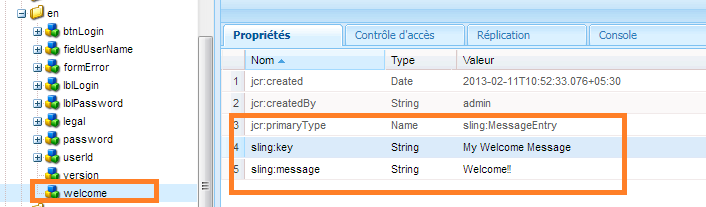

# Création d’un écran de connexion{#creating-a-new-login-screen}

Vous pouvez modifier l’écran de connexion de tous les modules AEM Forms qui utilisent l’écran de connexion AEM Forms. Par exemple, les modifications affectent à la fois l’écran de connexion de Forms Manager et de l’espace de travail AEM Forms.

## Condition requise {#prerequisite}

1. Log in at `/lc/crx/de` with Administrator permissions.
1. Procédez comme suit :

   1. Répliquer la structure hiérarchique : de `/libs/livecycle/core/content` à `/apps/livecycle/core/content`. Conservez les mêmes propriétés (nœud/dossier) et contrôle d’accès.

   1. Copy the content folder: from `/libs/livecycle/core` to `/apps/livecycle/core`.

   1. Delete the contents of `/apps/livecycle/core` folder.

1. Procédez comme suit :

   1. Répliquer la structure hiérarchique : de `/libs/livecycle/core/components/login` à `/apps/livecycle/core/components/login`. Conservez les mêmes propriétés (nœud/dossier) et contrôle d’accès.

   1. Copy the components folder: from `/libs/livecycle/core` to `/apps/livecycle/core`.

   1. Delete the contents of the folder: `/apps/livecycle/core/components/login`.

### Ajout d’un nouveau paramètre régional {#adding-a-new-locale}

1. Copiez le `i18n` dossier :

   * de `/libs/livecycle/core/components/login`
   * vers `/apps/livecycle/core/components/login`

1. Delete all the folders inside `i18n` except one, say `en`.

1. Sur le dossier `en`, procédez comme suit :

   1. Donnez au dossier le nom du paramètre régional que vous souhaitez prendre en charge. Par exemple, `ar`.

   1. Change the property `jcr:language` value to `ar`(for the `ar` folder).
   >[!NOTE]
   >
   >Si le paramètre régional est une combinaison de code langue-pays, tel que `ar-DZ`, modifiez le nom du dossier et la valeur de la propriété en `ar-DZ`.

1. Copier `login.jsp`:

   * de `/libs/livecycle/core/components/login`
   * vers `/apps/livecycle/core/components/login`

1. Modify the following snippet of code for `/apps/livecycle/core/components/login/login.jsp`:

***Le paramètre régional est un code de langue***

```
String browserLocale = "en";
       for(int i=0; i<locales.length; i++)
       {
           String prioperty = locales[i];
           if(prioperty.trim().startsWith("en")) {
               browserLocale = "en";
               break;
           }
           if(prioperty.trim().startsWith("de")){
               browserLocale = "de";
               break;
           }
           if(prioperty.trim().startsWith("ja")){
               browserLocale = "ja";
               break;
           }
           if(prioperty.trim().startsWith("fr")){
               browserLocale = "fr";
               break;
           }
       }

   To

   String browserLocale = "en";
       for(int i=0; i<locales.length; i++)
       {
           String prioperty = locales[i];
           if(prioperty.trim().startsWith("ar")) {
               browserLocale = "ar";
               break;
           }
           if(prioperty.trim().startsWith("en")) {
               browserLocale = "en";
               break;
           }
           if(prioperty.trim().startsWith("de")){
               browserLocale = "de";
               break;
           }
           if(prioperty.trim().startsWith("ja")){
               browserLocale = "ja";
               break;
           }
           if(prioperty.trim().startsWith("fr")){
               browserLocale = "fr";
               break;
           }
       }
```


***Le paramètre régional est un code langue-pays***

```
String browserLocale = "en";
       for(int i=0; i<locales.length; i++)
       {
           String prioperty = locales[i];
           if(prioperty.trim().startsWith("en")) {
               browserLocale = "en";
               break;
           }
           if(prioperty.trim().startsWith("de")){
               browserLocale = "de";
               break;
           }
           if(prioperty.trim().startsWith("ja")){
               browserLocale = "ja";
               break;
           }
           if(prioperty.trim().startsWith("fr")){
               browserLocale = "fr";
               break;
           }
       }

   To

   String browserLocale = "en";
       for(int i=0; i<locales.length; i++)
       {
           String prioperty = locales[i];
           if(prioperty.trim().equalsIgnoreCase("ar-DZ")) {
               browserLocale = "ar-DZ";
               break;
           }
           if(prioperty.trim().startsWith("en")) {
               browserLocale = "en";
               break;
           }
           if(prioperty.trim().startsWith("de")){
               browserLocale = "de";
               break;
           }
           if(prioperty.trim().startsWith("ja")){
               browserLocale = "ja";
               break;
           }
           if(prioperty.trim().startsWith("fr")){
               browserLocale = "fr";
               break;
           }
       }
```

***Pour modifier le paramètre régional par défaut***

```
String browserLocale = "en";
   for(int i=0; i<locales.length; i++)

   To

   String browserLocale = "ar";
   for(int i=0; i<locales.length; i++)
```

### Ajout de nouveau texte ou modification du texte existant {#adding-new-text-or-modifying-existing-text}

1. Copier `i18n` le dossier :

   * de `/libs/livecycle/core/components/login`
   * vers `/apps/livecycle/core/components/login`

1. Modifiez la valeur de la propriété `sling:message` du nœud (sous le dossier du code du paramètre régional souhaité) pour laquelle vous souhaitez modifier le texte. La traduction est effectuée via la clé mentionnée dans la valeur de la propriété `sling:key` du nœud.

1. Pour ajouter une nouvelle paire clé-valeur, effectuez les opérations suivantes : Vérifiez un exemple dans la capture d’écran qui suit.

   1. Créez un nœud de type `sling:MessageEntry` ou copiez un nœud existant et renommez-le, sous tous les dossiers de paramètres régionaux.
   1. Copier `login.jsp` :

      * de `/libs/livecycle/core/components/login`

      * vers `/apps/livecycle/core/components/login`
   1. Modify `/apps/livecycle/core/components/login/login.jsp` to incorporate the newly added text.

   


```
<div class="loginContent">
                       <span class="loginFlow"></code>
                       <span class="loginVersion"><%= i18n.get("Version: 11.0.0") %></code>
                       <span class="loginTitle"><%= i18n.get("Login") %></code>
                       <% if (loginFailed) {%>

   To

   <div class="loginContent">
                       <span class="loginFlow"></code>
                       <span class="loginVersion"><%= i18n.get("My Welcome Message") %></code>
                       <span class="loginVersion"><%= i18n.get("Version: 11.0.0") %></code>
                       <span class="loginTitle"><%= i18n.get("Login") %></code>
                       <% if (loginFailed) {%>
```

### Ajout d’un nouveau style ou modification d’un style existant {#adding-new-style-or-modifying-existing-style}

1. Copy `login` node:

   * de `/libs/livecycle/core/content`
   * vers `/apps/livecycle/core/content`

1. Supprimer des fichiers `login.js` et `jquery-1.8.0.min.js`, du noeud `/apps/livecycle/core/content/login.`
1. Modifiez les styles définis dans le fichier CSS.
1. Pour ajouter de nouveaux styles :

   1. Ajouter de nouveaux styles à `/apps/livecycle/core/content/login/login.css`
   1. Copier `login.jsp`

      * de `/libs/livecycle/core/components/login`

      * vers `/apps/livecycle/core/components/login`
   1. Modify `/apps/livecycle/core/components/login/login.jsp` to incorporate the newly added styles.


Par exemple :

* Add the following to `/apps/livecycle/core/content/login/login.css`.

```
css.newLoginContentArea {
    width: 700px;
    padding: 100px 0px 0px 100px;
   }
```

* Modifiez en suivant dans `/apps/livecycle/core/components/login.jsp`.

```
<div class="loginContentArea">

   To

   <div class="newLoginContentArea">
```

>[!NOTE]
>
>If the existing images in `/apps/livecycle/core/content/login` (copied from `/libs/livecycle/core/content/login`) are removed, then remove the corresponding references in CSS.


### Ajoutez de nouvelles images {#add-new-images}

1. Suivez les étapes pour Ajouter un nouveau style ou modifier le style existant (comme indiqué ci-dessus).
1. Add new images in `/apps/livecycle/core/content/login`. Pour ajouter une image :

   1. Installez le client WebDAV.
   1. Navigate to `/apps/livecycle/core/content/login` folder, using webDAV client. For more information, see: [https://dev.day.com/docs/en/crx/current/how_to/webdav_access.html](https://docs.adobe.com/docs/en/crx/current/how_to/webdav_access.html).

   1. Ajoutez de nouvelles images.

1. Ajoutez de nouveaux styles `/apps/livecycle/core/content/login/login.css,` correspondant aux nouvelles images ajoutées dans `/apps/livecycle/core/content/login`.
1. Use the new styles in `login.jsp` at `/apps/livecycle/core/components`.

Par exemple :

* Add the following to `/apps/livecycle/core/content/login/login.css`

```
css.newLoginContainerBkg {
    background-image: url(my_Bg.gif);
    background-repeat: no-repeat;
    background-position: left top;
    width: 727px;
   }
```

* Modifiez en suivant dans `/apps/livecycle/core/components/login.jsp`.

```
<div class="loginContainerBkg">

   To

   <div class="newLginContainerBkg">
```

