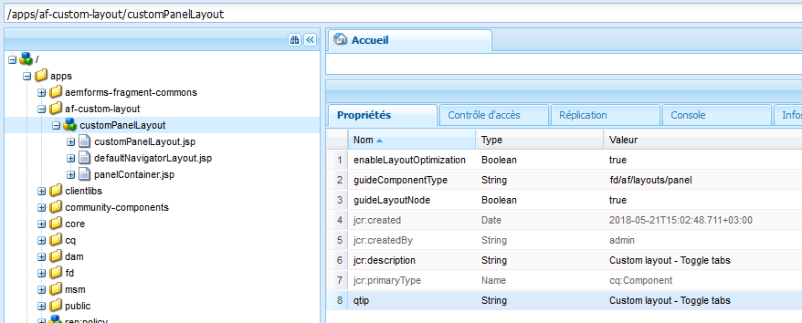
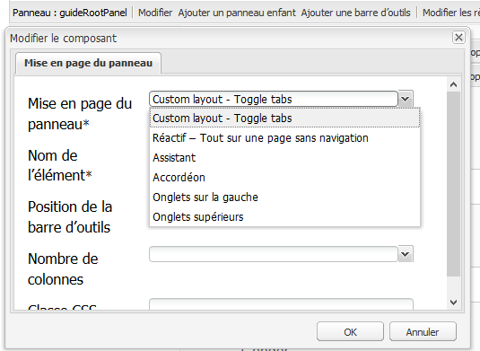

# Création de composants de disposition personnalisés pour les formulaires adaptatifs{#creating-custom-layout-components-for-adaptive-forms}

## Condition préalable {#prerequisite}

Connaissance des dispositions qui vous permet de créer et utiliser une disposition personnalisée. Voir [Modification de la disposition du panneau](../../forms/using/layout-capabilities-adaptive-forms.md).

## Composant de disposition de panneau de formulaire adaptatif {#adaptive-form-panel-layout-component}

Le composant Disposition de panneau de formulaire adaptatif contrôle la disposition des composants d’un formulaire adaptatif dans un panneau par rapport à l’interface utilisateur.

## Création d’une disposition de panneau personnalisée  {#creating-a-custom-panel-layout}

1. Accédez à l’emplacement `/crx/de`.
1. Copiez une mise en page de panneau de l’emplacement `/libs/fd/af/layouts/panel` (par exemple, `tabbedPanelLayout`) vers `/apps` (par exemple, `/apps/af-custom-layout`).
1. Renommez la mise en page que vous avez copiée en `customPanelLayout`. Modifiez les propriétés des noeuds `qtip` et `jcr:description`. Par exemple, remplacez-les par `Custom layout - Toggle tabs`.

qtip



>[!NOTE]
>
>La définition de la propriété `guideComponentType`sur la valeur `fd/af/layouts/panel` détermine que la disposition est une disposition de panneau.

1. Renommez le fichier `tabbedPanelLayout.jsp` sous la nouvelle mise en page en customPanelLayout.jsp.
1. Pour ajouter de nouveaux styles et un nouveau comportement, créez une bibliothèque cliente sous le nœud `etc`. Par exemple, créez à l’emplacement /etc/af-custom-layout-clientlib le nœud client-library. Attribuez au nœud la propriété de catégories af.panel.custom. Elle comporte les fichiers .css et .js suivants :

   ```css
   /** CSS defining new styles used by custom layout **/
   
   .menu-nav {
       background-color: rgb(198, 38, 76);
       height: 30px;
    width: 30px;
    font-size: 2em;
    color: white;
       -webkit-transition: -webkit-transform 1s;  /* For Safari 3.1 to 6.0 */
    transition: transform 1s;
   }
   
   .tab-content {
    border: 1px solid #08b1cf;
   }
   
   .custom-navigation {
       -webkit-transition: width 1s, height 1s, -webkit-transform 1s;  /* For Safari 3.1 to 6.0 */
    transition: width 1s, height 1s, transform 1s;
   }
   
   .panel-name {
       padding-left: 30px;
       font-size: 20px;
   }
   
   @media (min-width: 992px) {
    .nav-close {
     width: 0px;
       }
   }
   
   @media (min-width: 768px) and (max-width: 991px) {
    .nav-close {
     height: 0px;
       }
   }
   
   @media (max-width: 767px) {
    .menu-nav, .custom-navigation {
        display: none;
       }
   }
   ```

   ```javascript
   /** function for toggling the navigators **/
   var toggleNav = function () {
   
       var nav = $('.custom-navigation');
       if (nav) {
           nav.toggleClass('nav-close');
       }
   }
   
   /** function to populate the panel title **/
   $(window).on('load', function() {
       if (window.guideBridge) {
           window.guideBridge.on("elementNavigationChanged",
           function (evntName, evnt) {
                       var activePanelSom = evnt.newText,
                           activePanel = window.guideBridge._guideView.getView(activePanelSom);
                       $('.panel-name').html(activePanel.$itemNav.find('a').html());
                   }
           );
       }
   });
   ```

1. Pour améliorer l’aspect et le comportement, vous pouvez inclure une balise `client library`.

   Par ailleurs, mettez à jour les chemins d’accès aux scripts inclus dans les fichiers .jsp. Par exemple, mettez à jour le fichier `customPanelLayout.jsp` comme suit :

   ```html
   <%-- jsp encapsulating navigator container and panel container divs --%>
   
   <%@include file="/libs/fd/af/components/guidesglobal.jsp"%>
   <cq:includeClientLib categories="af.panel.custom"/>
   <div>
       <div class="row">
           <div class="col-md-2 col-sm-2 hidden-xs menu-nav glyphicon glyphicon-align-justify" onclick="toggleNav();"></div>
           <div class="col-md-10 col-sm-10 hidden-xs panel-name"></div>
       </div>
       <div class="row">
           <div class="col-md-2 hidden-xs guide-tab-stamp-list custom-navigation">
               <cq:include script = "/apps/af-custom-layout/customPanelLayout/defaultNavigatorLayout.jsp" />
           </div>
           <div  class="col-md-10">
               <c:if test="${fn:length(guidePanel.description) > 0}">
                   <div class="<%=GuideConstants.GUIDE_PANEL_DESCRIPTION%>">
                       ${guide:encodeForHtml(guidePanel.description,xssAPI)}
                           <cq:include script="/libs/fd/af/components/panel/longDescription.jsp"/>
                   </div>
               </c:if>
               <cq:include script = "/apps/af-custom-layout/customPanelLayout/panelContainer.jsp"/>
           </div>
       </div>
   </div>
   ```

   Le fichier `/apps/af-custom-layout/customPanelLayout/defaultNavigatorLayout.jsp` :

   ```html
   <%-- jsp governing the navigation part --%>
   
   <%@include file="/libs/fd/af/components/guidesglobal.jsp"%>
   <%@ page import="com.adobe.aemds.guide.utils.StyleUtils" %>
   <%-- navigation tabs --%>
   <ul id="${guidePanel.id}_guide-item-nav-container" class="tab-navigators tab-navigators-vertical in"
       data-guide-panel-edit="reorderItems" role="tablist">
       <c:forEach items="${guidePanel.items}" var="panelItem">
           <c:set var="isNestedLayout" value="${guide:hasNestablePanelLayout(guidePanel,panelItem)}"/>
           <li id="${panelItem.id}_guide-item-nav" title="${guide:encodeForHtmlAttr(panelItem.navTitle,xssAPI)}" data-path="${panelItem.path}" role="tab" aria-controls="${panelItem.id}_guide-item">
               <c:set var="panelItemCss" value="${panelItem.cssClassName}"/>
               <% String panelItemCss = (String) pageContext.getAttribute("panelItemCss");%>
               <a data-guide-toggle="tab" class="<%= StyleUtils.addPostfixToClasses(panelItemCss, "_nav") %> guideNavIcon nested_${isNestedLayout}">${guide:encodeForHtml(panelItem.navTitle,xssAPI)}</a>
               <c:if test="${isNestedLayout}">
                   <guide:initializeBean name="guidePanel" className="com.adobe.aemds.guide.common.GuidePanel"
                       resourcePath="${panelItem.path}" restoreOnExit="true">
                       <sling:include path="${panelItem.path}"
                                      resourceType="/apps/af-custom-layout/customPanelLayout/defaultNavigatorLayout.jsp"/>
                   </guide:initializeBean>
               </c:if>
               <em></em>
           </li>
       </c:forEach>
   </ul>
   ```

   Mise à jour de `/apps/af-custom-layout/customPanelLayout/panelContainer.jsp` :

   ```html
   <%-- jsp governing the panel content --%>
   
   <%@include file="/libs/fd/af/components/guidesglobal.jsp"%>
   
   <div id="${guidePanel.id}_guide-item-container" class="tab-content">
       <c:if test="${guidePanel.hasToolbar && (guidePanel.toolbarPosition == 'Top') }">
           <sling:include path="${guidePanel.toolbar.path}"/>
       </c:if>
   
   <c:forEach items="${guidePanel.items}" var="panelItem">
       <div class="tab-pane" id="${panelItem.id}_guide-item" role="tabpanel">
           <c:set var="isNestedLayout" value="${guide:hasNestablePanelLayout(guidePanel,panelItem)}"/>
           <c:if test="${isNestedLayout}">
               <c:set var="guidePanelResourceType" value="/apps/af-custom-layout/customPanelLayout/panelContainer.jsp" scope="request"/>
           </c:if>
           <sling:include path="${panelItem.path}" resourceType="${panelItem.resourceType}"/>
       </div>
   </c:forEach>
   <c:if test="${guidePanel.hasToolbar && (guidePanel.toolbarPosition == 'Bottom')}">
       <sling:include path="${guidePanel.toolbar.path}"/>
   </c:if>
   </div>
   ```

1. Ouvrez un formulaire adaptative en mode création. La disposition de panneau que vous avez définie est ajoutée à la liste pour la configuration des dispositions de panneau.

     

Exemple de ZIP pour une disposition de panneau personnalisée et un formulaire adaptatif l’utilisant.

[Obtenir le fichier](assets/af-custom-layout.zip)
