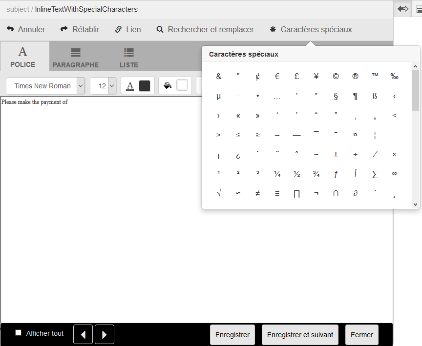

# Caractères spéciaux personnalisés dans Correspondence Management{#custom-special-characters-in-correspondence-management}

## Présentation {#overview}

Correspondence Management offre une prise en charge par défaut et intégrée de 210 caractères spéciaux que vous pouvez facilement insérer sous forme de lettres.

Vous pouvez par exemple insérer les caractères spéciaux suivants :

* Symboles de devise tels que €, ¥ et £
* Symboles mathématiques tels que Δ, √,  et ^
* Symboles de ponctuation comme ‟ et&quot;

Vous pouvez insérer des caractères spéciaux sous forme de lettres :

* Dans l’[éditeur de texte](/help/forms/using/document-fragments.md#createtext)
* Dans un module [modifiable, intégré dans une correspondance](../../forms/using/create-correspondence.md#managecontent)

L’administrateur peut ajouter la prise en charge de plus de caractères/de caractères spéciaux grâce à la personnalisation. Cet article fournit les instructions vous permettant d’ajouter la prise en charge de caractères spéciaux personnalisés supplémentaires.

## Ajouter ou modifier la prise en charge des caractères spéciaux personnalisés dans Correspondence Management {#creatingfolderstructure}

Procédez comme suit pour ajouter la prise en charge des caractères spéciaux personnalisés :

1. Accédez à `https://'[server]:[port]'/[ContextPath]/crx/de` et connectez-vous en tant qu’administrateur.
1. Dans le dossier d’applications, créez un dossier nommé **[!UICONTROL specialcharacters]** avec un chemin/une structure similaires au dossier specialcharacters (situé dans le dossier textEditorConfig sous libs) :

   1. Cliquez avec le bouton droit sur le dossier **specialcharacters** à l’emplacement suivant et sélectionnez **Noeud d’incrustation** :

      `/libs/fd/cm/ma/gui/configuration/textEditorConfig/specialcharacters`

   1. Assurez-vous que la boîte de dialogue du nœud de recouvrement possède les valeurs suivantes :

      **Chemin d’accès :** /libs/fd/cm/ma/gui/configuration/textEditorConfig/specialcharacters

      **Emplacement de l’incrustation:** /apps/

      **Faire correspondre les types de noeud:** coché

      >[!NOTE]
      >
      >N&#39;apportez aucune modification à la branche /libs. Toutes les modifications que vous apportez risquent d’être perdues, car cette branche est exposée aux modifications chaque fois que vous :
      >
      >
      >
      >    * Effectuez une mise à niveau sur votre instance
      >    * Appliquez un correctif
      >    * Configurez un feature pack

   1. Cliquez sur **OK**, puis sur **Enregistrer tout**. Le dossier specialcharacters est créé dans le chemin d’accès spécifié.

      Après avoir créé le recouvrement, vérifiez les balises de structure de nœud. Chaque nœud créé dans /apps à l’aide du recouvrement doit présenter la même classe et les mêmes propriétés que celles définies dans /libs pour ce nœud. Si une propriété ou une balise est manquante dans la structure de nœud sous l’emplacement /apps, synchronisez ses balises avec le nœud correspondant situé sous /libs.

1. Vérifiez que le nœud **[!UICONTROL textEditorConfig]** est doté des valeurs et propriétés suivantes :

   | Nom | Type | Valeur |
   |---|---|---|
   | cmConfigurationType | Chaîne | cmTextEditorConfiguration |
   | cssPath | Chaîne | /libs/fd/cm/ma/gui/components/admin/createasset/textcontrol/clientlibs/textcontrol |

1. Cliquez avec le bouton droit sur le dossier **[!UICONTROL specialcharacters]** à l’emplacement suivant et sélectionnez **Créer > Noeud enfant**, puis cliquez sur **Enregistrer tout** :

   /apps/fd/cm/ma/gui/configuration/textEditorConfig/specialcharacters/&lt;YourChildNode>

1. Actualisez la page de l’interface utilisateur Éditeur de texte\Création de correspondance. Le nœud que vous avez ajouté apparaît en dernier dans la liste des caractères spéciaux de l’interface utilisateur.
1. Cliquez sur **Enregistrer tout**.
1. Apportez les modifications nécessaires aux caractères spéciaux :

<table>
 <tbody>
  <tr>
   <td><strong>To...</strong></td>
   <td><strong>Effectuez les étapes suivantes</strong></td>
  </tr>
  <tr>
   <td>Ajouter un caractère spécial personnalisé</td>
   <td>
    <ol>
     <li>Ajoutez un noeud enfant sous "/apps/fd/cm/ma/gui/configuration/textEditorConfig/specialcharacters" avec les propriétés obligatoires.</li>
     <li>Cliquez sur Enregistrer tout</li>
     <li>Actualisez la page de l’interface utilisateur Éditeur de texte\Création de correspondance pour afficher les modifications.</li>
    </ol> </td>
  </tr>
  <tr>
   <td>Mettez à jour les propriétés d’un caractère spécial existant.</td>
   <td>
    <ol>
     <li>Recouvrez le nœud pour qu’il soit mis à jour comme expliqué ci-dessus et vérifiez les balises et les classes.</li>
     <li>Remplacez toutes les valeurs, telles que caption, value, endValue et multipleCaption. </li>
     <li>Cliquez sur Enregistrer tout. </li>
     <li>Actualisez la page de l’interface utilisateur Éditeur de texte\Création de correspondance pour afficher les modifications.</li>
    </ol> </td>
  </tr>
  <tr>
   <td>Masquer un caractère spécial</td>
   <td>
    <ol>
     <li>Recouvrez le noeud à masquer sous "/apps/fd/cm/ma/gui/configuration/textEditorConfig/specialcharacters".</li>
     <li>Ajoutez la propriété sling:hideResource (booléenne) au noeud (sous apps) à masquer. </li>
     <li>Cliquez sur Enregistrer tout. </li>
     <li>Actualisez la page de l’interface utilisateur Éditeur de texte\Création de correspondance pour afficher les modifications.  </li>
    </ol> </td>
  </tr>
  <tr>
   <td>Masquer plusieurs caractères spéciaux</td>
   <td>
    <ol>
     <li>Ajoutez la propriété "sling:hideChildren (String or String[])" sur "/apps/fd/cm/ma/gui/configuration/textEditorConfig/specialcharacters". </li>
     <li>Ajoutez des noms de nœud (caractères spéciaux à masquer) sous forme de valeurs pour la propriété sling:hideChildren. </li>
     <li>Cliquez sur Enregistrer tout. </li>
     <li>Actualisez la page de l’interface utilisateur Éditeur de texte\Création de correspondance pour afficher les modifications.  </li>
    </ol> </td>
  </tr>
  <tr>
   <td>Classement des caractères spéciaux</td>
   <td>
    <ol>
     <li>Ajoutez un noeud enfant sous "/apps/fd/cm/ma/gui/configuration/textEditorConfig/specialcharacters" avec les propriétés obligatoires. </li>
     <li>Ajoutez la propriété « sling:orderBefore (String) » au nœud enfant qui vient d’être créé. </li>
     <li>Ajoutez le nom du nœud comme valeur devant laquelle le caractère spécial récemment ajouté doit être affiché. </li>
     <li>Cliquez sur Enregistrer tout. </li>
     <li>Actualisez la page de l’interface utilisateur Éditeur de texte\Création de correspondance pour afficher les modifications.  </li>
    </ol> </td>
  </tr>
 </tbody>
</table>

