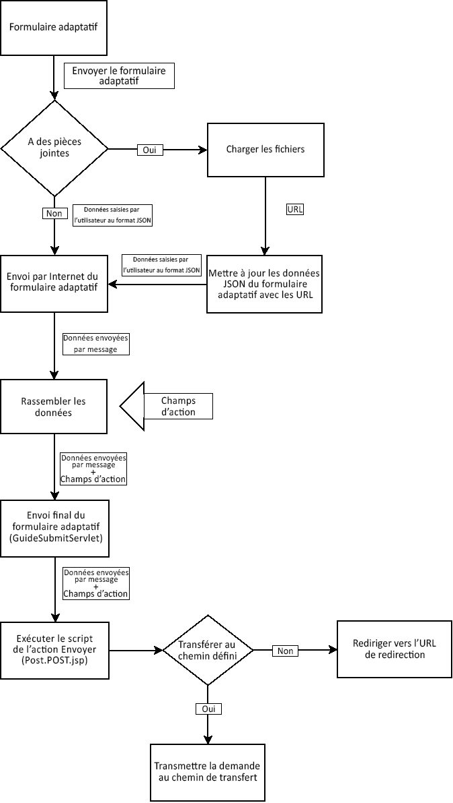
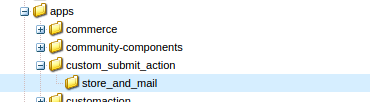
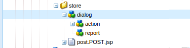
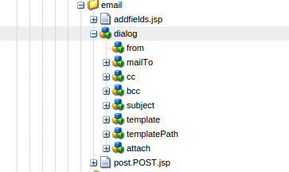
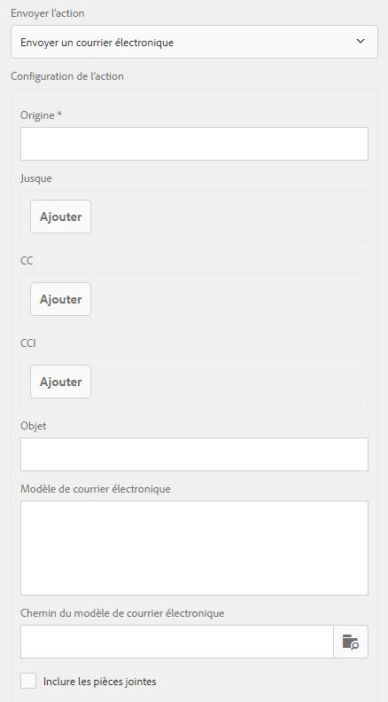

# Création d’une action Envoyer personnalisée pour les formulaires adaptatifs{#writing-custom-submit-action-for-adaptive-forms}

Les formulaires adaptatifs nécessitent des actions d’envoi pour traiter les données spécifiées par l’utilisateur. Une action Envoyer détermine la tâche exécutée sur les données envoyées à l’aide d’un formulaire adaptatif. Adobe Experience Manager (AEM) includes [OOTB Submit actions](../../forms/using/configuring-submit-actions.md) that demonstrate custom tasks you can perform using the user-submitted data. Vous pouvez par exemple effectuer des tâches comme envoyer un courrier électronique ou stocker les données.

## Processus d&#39;une action Envoyer {#workflow-for-a-submit-action}

The flowchart depicts the workflow for a Submit action that is triggered when you click the **[!UICONTROL Submit]** button in an adaptive form. Les fichiers du composant Pièce jointe sont téléchargés sur le serveur, et les données de formulaire sont mises à jour avec les URL des fichiers téléchargés. Sur le client, les données sont stockées au format JSON. Le client envoie une requête Ajax à une servlet interne qui transforme les données spécifiées et les renvoie au format XML. Le client assemble ces données avec des champs d’action. Il envoie les données à la servlet finale (servlet Guide Submit) par le biais d’une action d’envoi de formulaire. La servlet transfère ensuite le contrôle à l’action Envoyer. L’action Envoyer peut transférer la requête vers une ressource sling différente ou rediriger le navigateur vers une autre URL.



### Format des données XML {#xml-data-format}

The XML data is sent to the servlet using the **`jcr:data`** request parameter. Les actions Envoyer peuvent accéder au paramètre pour traiter les données. Le code ci-après décrit le format des données XML. The fields that are bound to the Form model appear in the **`afBoundData`** section. Les champs non liés apparaissent dans la section `afUnoundData`. For more information about the format of the `data.xml` file, see [Introduction to prepopulating adaptive form fields](../../forms/using/prepopulate-adaptive-form-fields.md).

```xml
<?xml ?>
<afData>
<afUnboundData>
<data>
<field1>value</field2>
<repeatablePanel>
    <field2>value</field2>
</repeatablePanel>
<repeatablePanel>
    <field2>value</field2>
</repeatablePanel>
</data>
</afUnboundData>
<afBoundData>
<!-- xml corresponding to the Form Model /XML Schema -->
</afBoundData>
</afData>
```

### Champs d&#39;action {#action-fields}

A Submit action can add hidden input fields (using the HTML [input](https://developer.mozilla.org/en/docs/Web/HTML/Element/Input) tag) to the rendered form HTML. Ces champs masqués peuvent contenir les valeurs dont il a besoin lors du traitement de l’envoi du formulaire. Lors de l’envoi du formulaire, ces valeurs de champ sont reportées en tant que paramètres de requête que l’action Envoyer peut utiliser lors de la gestion de l’envoi. Les champs d’entrée sont appelés champs d’action.

For example, a Submit action that also captures the time taken to fill a form can add the hidden input fields `startTime` and `endTime`.

Un script peut fournir les valeurs des champs `startTime` et `endTime` lors du rendu du formulaire et avant l’envoi du formulaire. Le script de l’action Envoyer `post.jsp` peut ensuite accéder à ces champs à l’aide des paramètres de requête et calculer le temps total nécessaire au remplissage du formulaire.

### Pièces jointes {#file-attachments}

Les actions Envoyer peuvent également utiliser les pièces jointes que vous téléchargez à l’aide du composant Pièce jointe. Les scripts des actions Envoyer peuvent accéder à ces fichiers à l’aide de la chaîne [RequestParameter](https://sling.apache.org/apidocs/sling5/org/apache/sling/api/request/RequestParameter.html). The [isFormField](https://sling.apache.org/apidocs/sling5/org/apache/sling/api/request/RequestParameter.html#isFormField()) method of the API helps identify whether the request parameter is a file or a form field. Vous pouvez effectuer une itération sur les paramètres de requête dans une action Envoyer pour identifier les paramètres de pièce jointe.

L’exemple de code ci-après identifie les pièces jointes de la requête. Next, it reads the data into the file using the [Get API](https://sling.apache.org/apidocs/sling5/org/apache/sling/api/request/RequestParameter.html#get()). Enfin, il crée un objet de Document à l’aide des données et l’ajoute à une liste.

```java
RequestParameterMap requestParameterMap = slingRequest.getRequestParameterMap();
for (Map.Entry<String, RequestParameter[]> param : requestParameterMap.entrySet()) {
    RequestParameter rpm = param.getValue()[0];
    if(!rpm.isFormField()) {
        fileAttachments.add(new Document(rpm.get()));
    }
}
```

### Chemin de transfert et URL de redirection {#forward-path-and-redirect-url}

Après avoir exécuté l’action requise, la servlet Submit transfère la requête vers le chemin de transfert. Une action utilise l’API setForwardPath pour définir le chemin de transfert dans la servlet Guide Submit.

Si l’action ne fournit pas de chemin de transfert, la servlet Submit redirige le navigateur à l’aide de l’URL de redirection. L’auteur configure l’URL de redirection à l’aide de la configuration de la page Merci dans la boîte de dialogue Modifier le formulaire adaptatif. Vous pouvez également configurer l’URL de redirection via l’action Envoyer ou l’API setRedirectUrl de la servlet Guide Submit. Les paramètres de requête envoyés à l’URL de redirection peuvent aussi être configurés à l’aide de l’API setRedirectParameters de la servlet Guide Submit.

>[!NOTE]
>
>Un auteur fournit l’URL de redirection (à l’aide de la configuration de la page Merci). [Les actions](../../forms/using/configuring-submit-actions.md) Envoyer prêtes à l&#39;emploi utilisent l&#39;URL de redirection pour rediriger le navigateur à partir de la ressource référencée par le chemin de transfert.
>
>Vous pouvez écrire une action Envoyer personnalisée qui transfère une requête vers une ressource ou une servlet. Adobe recommande que le script qui effectue la gestion des ressources pour le chemin de transfert redirige la requête vers l’URL de redirection une fois le traitement terminé.

## Action Envoyer {#submit-action}

Une action Envoyer est un sling:Folder qui comprend les éléments suivants :

* **addfields.jsp** : ce script fournit les champs d’action qui sont ajoutés au fichier HTML lors du rendu. Utilisez ce script pour ajouter les paramètres d’entrée masqués requis lors de l’envoi au script post.POST.jsp.
* **dialog.xml** : ce script est similaire à la boîte de dialogue Composant CQ. Il fournit des informations de configuration personnalisées par l’auteur. Les champs s’affichent dans l’onglet Actions Envoyer de la boîte de dialogue Modifier le formulaire adaptatif lorsque vous sélectionnez l’action Envoyer.
* **post.POST.jsp**: La servlet Submit appelle ce script avec les données que vous envoyez et les données supplémentaires des sections précédentes. Toute mention relative à l’exécution d’une action dans cette page implique l’exécution du script post.POST.jsp. Pour enregistrer l’action Envoyer avec les formulaires adaptatifs à afficher dans la boîte de dialogue Modifier le formulaire adaptatif, ajoutez les propriétés suivantes à sling:Folder :

   * **guideComponentType** de type chaîne et valeur **fd/af/components/guidesubmittype**
   * **guideDataModel** de type String qui spécifie le type de formulaire adaptatif pour lequel l’action Envoyer est applicable. **xfa** est pris en charge pour les formulaires adaptatifs basés sur XFA, tandis que **xsd** est pris en charge pour les formulaires adaptatifs basés sur XSD. **basic** est pris en charge pour les formulaires adaptatifs qui n’utilisent pas XDP ou XSD. Pour afficher l’action sur plusieurs types de formulaire adaptatif, ajoutez les chaînes correspondantes. Séparez chaque chaîne par une virgule. For example, to make an action visible on XFA- and XSD-based adaptive forms, specify the values **xfa** and **xsd** respectively.

   * **jcr:description** de type String. La valeur de cette propriété s’affiche dans la liste d’actions Envoyer de l’onglet Actions Envoyer de la boîte de dialogue Modifier le formulaire adaptatif. The OOTB actions are present in the CRX repository at the location **/libs/fd/af/components/guidesubmittype**.

## Création d&#39;une action Envoyer personnalisée {#creating-a-custom-submit-action}

Pour créer une action Envoyer personnalisée qui enregistre les données dans le référentiel CRX et envoie ensuite un courrier électronique, suivez la procédure ci-après. Le formulaire adaptatif contient l’action Envoyer Stocker le contenu (obsolète) qui enregistre les données dans le référentiel CRX. In addition, CQ provides a [Mail](https://docs.adobe.com/docs/en/cq/current/javadoc/com/day/cq/mailer/package-summary.html) API that can be used to send emails. Before using the Mail API, [configure](https://docs.adobe.com/docs/en/cq/current/administering/notification.html?wcmmode=disabled#Configuring the Mail Service) the Day CQ Mail service through the system console. Vous pouvez réutiliser l’action Stocker le contenu (obsolète) pour stocker les données dans le référentiel. L’action Stocker le contenu (obsolète) se trouve à l’emplacement /libs/fd/af/components/guidesubmittype/store dans le référentiel CRX.

1. Connectez-vous à CRXDE Lite à l’adresse https://&lt;serveur>:&lt;port>/crx/de/index.jsp. Créez un nœud avec la propriété sling:Folder et le nom store_and_mail dans le dossier /apps/custom_submit_action. Créez le dossier custom_submit_action, le cas échéant.

   

1. **Fournissez les champs de configuration obligatoires.**

   Ajoutez la configuration requise par l&#39;action Stocker. Copiez le nœud **cq:dialog** de l’action Stocker à l’emplacement /libs/fd/af/components/guidesubmittype/store dans le dossier d’action à l’emplacement /apps/custom_submit_action/store_and_email.

   

1. **Fournissez des champs de configuration pour demander à l’auteur la configuration de courrier électronique.**

   Le formulaire adaptatif contient également une action Courrier électronique qui permet d’envoyer des messages électroniques aux utilisateurs. Personnalisez cette action selon vos besoins. Accédez à /libs/fd/af/components/guidesubmittype/email/dialog. Copiez les noeuds du noeud cq:dialog dans le noeud cq:dialog de votre action Envoyer (/apps/custom_submit_action/store_and_email/dialog).

   

1. **Rendez l’action accessible dans la boîte de dialogue Modifier le formulaire adaptatif.**

   Ajoutez les propriétés suivantes au nœud store_and_email :

   * **guideComponentType****** de type chaîne et valeur **fd/af/components/guidesubmittype**

   * **guideDataModel** de type **String** et valeur **xfa, xsd, basic**

   * **jcr:description** de type **chaîne** et valeur **Store and Email Action**

1. Ouvrez un formulaire adaptatif. Cliquez sur le bouton **Modifier** en regard de **Démarrer** pour ouvrir la boîte de dialogue **Modifier** du conteneur de formulaires adaptatifs. La nouvelle action s’affiche sous l’onglet **Actions Envoyer**. Selecting the **Store and Email Action** displays the configuration added in the dialog node.

   

1. **Utilisez l’action pour effectuer une tâche.**

   Ajoutez le script post.POST.jsp à votre action. (/apps/custom_submit_action/store_and_mail/).

   Exécutez l&#39;action Stocker prête à l&#39;emploi (script post.POST.jsp). Use the [FormsHelper.runAction](https://docs.adobe.com/docs/en/cq/current/javadoc/com/day/cq/wcm/foundation/forms/FormsHelper.html#runAction(java.lang.String, java.lang.String, org.apache.sling.api.resource.Resource, org.apache.sling.api.SlingHttpServletRequest, org.apache.sling.api.SlingHttpServletResponse)) API that CQ provides in your code to run the Store action. Ajoutez le code suivant à votre fichier JSP :

   `FormsHelper.runAction("/libs/fd/af/components/guidesubmittype/store", "post", resource, slingRequest, slingResponse);`

   Pour envoyer le courriel, le code lit l&#39;adresse électronique du destinataire à partir de la configuration. Pour récupérer la valeur de configuration dans le script de l’action, lisez les propriétés de la ressource actuelle à l’aide du code ci-après. Vous pouvez également lire les autres fichiers de configuration.

   `ValueMap properties = ResourceUtil.getValueMap(resource);`

   `String mailTo = properties.get("mailTo");`

   Utilisez enfin l’API de messagerie CQ pour envoyer le courrier électronique. Use the [SimpleEmail](https://commons.apache.org/proper/commons-email/apidocs/org/apache/commons/mail/SimpleEmail.html) class to create the Email Object as depicted below:

   >[!NOTE]
   >
   >Vérifiez que le fichier JSP porte le nom post.POST.jsp.

   ```java
   <%@include file="/libs/fd/af/components/guidesglobal.jsp" %>
   <%@page import="com.day.cq.wcm.foundation.forms.FormsHelper,
          org.apache.sling.api.resource.ResourceUtil,
          org.apache.sling.api.resource.ValueMap,
                   com.day.cq.mailer.MessageGatewayService,
     com.day.cq.mailer.MessageGateway,
     org.apache.commons.mail.Email,
                   org.apache.commons.mail.SimpleEmail" %>
   <%@taglib prefix="sling"
                   uri="https://sling.apache.org/taglibs/sling/1.0" %>
   <%@taglib prefix="cq"
                   uri="https://www.day.com/taglibs/cq/1.0"
   %>
   <cq:defineObjects/>
   <sling:defineObjects/>
   <%
           String storeContent =
                       "/libs/fd/af/components/guidesubmittype/store";
           FormsHelper.runAction(storeContent, "post", resource,
                                   slingRequest, slingResponse);
    ValueMap props = ResourceUtil.getValueMap(resource);
    Email email = new SimpleEmail();
    String[] mailTo = props.get("mailto", new String[0]);
    email.setFrom((String)props.get("from"));
           for (String toAddr : mailTo) {
               email.addTo(toAddr);
      }
    email.setMsg((String)props.get("template"));
    email.setSubject((String)props.get("subject"));
    MessageGatewayService messageGatewayService =
                       sling.getService(MessageGatewayService.class);
    MessageGateway messageGateway =
                   messageGatewayService.getGateway(SimpleEmail.class);
    messageGateway.send(email);
   %>
   ```

   Sélectionnez l’action dans le formulaire adaptatif. L’action envoie un courrier électronique et stocke les données.

