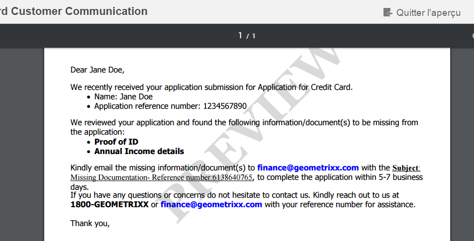

# Filigrane personnalisé dans l’aperçu de la lettre PDF{#custom-watermark-in-letter-pdf-preview}

## Présentation {#overview}

Dans l’interface utilisateur de création de correspondance, les utilisateurs d’agent prévisualisent la correspondance dans la forme finale dans laquelle elle est envoyée en post-traitement, comme pour l’envoi par courrier électronique ou l’impression.

Pour éviter l’utilisation non autorisée de ces données, les entreprises peuvent ajouter un filigrane à l’aperçu PDF. Le filigrane par défaut, « APERÇU », apparaît sur le PDF.

Pour activer le filigrane dans l’aperçu PDF, sélectionnez l’option **[!UICONTROL Appliquer le filigrane]** pendant l’aperçu dans **[!UICONTROL Configurations de Correspondence Management]** à l’adresse https://&#39;[server]:[port]&#39;/system/console/configMgr.



Vous pouvez utiliser les étapes suivantes pour personnaliser le texte et l’apparence du filigrane :

## Personnalisation du filigrane dans l’aperçu PDF dans l’interface utilisateur de création de correspondance {#customizewatermark-}

1. Accédez à `https://'[server]:[port]'/[ContextPath]/crx/de` et connectez-vous en tant qu’administrateur.
1. Dans le dossier d’applications, créez un dossier nommé **[!UICONTROL previewwatermark]** avec un chemin/une structure semblables au dossier previewwatermark dans le dossier libs :

   1. Cliquez avec le bouton droit sur le dossier **previewwatermark** à l’emplacement suivant et sélectionnez **Noeud de recouvrement** :

      `/libs/fd/cm/configFiles/previewwatermark`

   1. Assurez-vous que la boîte de dialogue du nœud de recouvrement possède les valeurs suivantes :

      **Chemin d’accès :** /libs/fd/cm/configFiles/previewwatermark

      **Emplacement de la superposition :** /apps/

      **Faire correspondre les types de noeud :** coché

      >[!NOTE]
      >
      >N’effectuez pas de modifications dans la branche /libs. Toutes les modifications que vous apportez risquent d’être perdues, car cette branche est exposée aux modifications chaque fois que vous :
      >
      >    
      >    
      >    * Effectuez une mise à niveau sur votre instance
      >    * Appliquez un correctif
      >    * Configurez un feature pack


   1. Cliquez sur **OK**, puis sur **Enregistrer tout**. Le dossier **[!UICONTROL previewwatermark]** est créé dans le chemin spécifié.


1. Copiez et collez le fichier ddx du dossier &quot;/libs/fd/cm/configFiles/previewwatermark&quot; dans le dossier &quot;/apps/fd/cm/configFiles/previewwatermark&quot;, puis cliquez sur **[!UICONTROL Enregistrer tout]**.
1. Apportez les modifications souhaitées dans le fichier ddx sous /apps/fd/cm/configFiles/previewwatermark/.

   ```xml
   <DDX xmlns="https://ns.adobe.com/DDX/1.0/">
    <PDF result="output.pdf">
     <PDF source="input.pdf"/>
           <Watermark opacity="15%" rotation="45">
            <StyledText>
                     <p font-family="Georgia" font-size="70pt" color="black" font-weight="bold">
                         PREVIEW
                    </p>
            </StyledText>
           </Watermark>
    </PDF>
   </DDX>
   ```

   Pour plus d’informations sur la personnalisation de l’aspect, du texte et de l’alignement du filigrane, voir Ajout et suppression de filigranes et d’arrière-plans dans le document [Guide de référence du service Assembler et du DDX](https://help.adobe.com/en_US/livecycle/11.0/ddxRef.pdf) .

   >[!NOTE]
   >
   >Dans le fichier ddx, les références au résultat et à la source doivent rester identiques à output.pdf et input.pdf. Le nom du fichier ddx doit également rester identique.

1. Cliquez sur **Enregistrer tout**.
