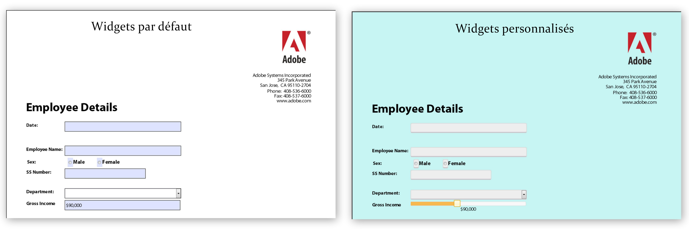

# Créer des apparences personnalisées dans les formulaires HTML5{#create-custom-appearances-in-html-forms}

Vous pouvez ajouter des widgets personnalisés aux formulaires pour périphériques mobiles. Vous pouvez étendre les widgets jQuery existants ou développer vos propres widgets personnalisés. XFA engine uses various widgets, see [Appearance framework for adaptive and HTML5 forms](/help/forms/using/introduction-widgets.md) for detailed information.



Exemple d’un widget par défaut et d’un widget personnalisé

## Intégration de widgets personnalisés dans des formulaires HTML5 {#integrating-custom-widgets-with-html-forms}

### Création d&#39;un profil{#create-a-profile-nbsp}

Vous pouvez créer un profil ou choisir un profil existant pour ajouter un widget personnalisé. Pour plus d’informations sur la création de profils, voir [Création d’un profil personnalisé](/help/forms/using/custom-profile.md).

### Création d’un widget {#create-a-widget}

Les formulaires HTML5 fournissent une implémentation de la structure de widgets qui peut être étendue pour créer de nouveaux widgets. L’implémentation est un widget jQuery *abstractWidget* qui peut être étendu afin d’écrire un nouveau widget. Le nouveau widget peut être rendu fonctionnel uniquement par l’extension/le remplacement des fonctions mentionnées ci-dessous.

<table>
 <tbody>
  <tr>
   <td>Fonction/classe</td>
   <td>Description</td>
  </tr>
  <tr>
   <td>render</td>
   <td>La fonction de rendu renvoie l’objet jQuery à l’élément HTML par défaut du widget. L’élément HTML par défaut doit être d’un type pouvant être actif. Par exemple, &lt;a&gt;, &lt;input&gt; et &lt;li&gt;. L’élément renvoyé est utilisé comme $userControl. Si $userControl spécifie la contrainte ci-dessus, les fonctions de la classe AbstractWidget fonctionnent comme prévu, sinon certaines des API courantes (focus, clic) nécessitent des modifications. </td>
  </tr>
  <tr>
   <td>getEventMap</td>
   <td>Renvoie un mappage pour convertir les événements HTML en événements XFA. <br /> {<br /> flou : XFA_EXIT__,<br /> }<br /> Cet exemple montre que le flou est un  HTML et que XFA_EXIT_ est le XFA correspondant. </td>
  </tr>
  <tr>
   <td>getOptionsMap</td>
   <td>Renvoie un mappage qui fournit des détails sur l’action à exécuter lors de la modification d’une option. Les clés sont les options fournies au widget et les valeurs sont les fonctions qui sont appelées chaque fois qu'une modification de cette option est détectée. Le widget fournit des gestionnaires pour toutes les options courantes (à l’exception de value et displayValue)</td>
  </tr>
  <tr>
   <td>getCommitValue</td>
   <td>La structure de Widget charge la fonction à chaque fois que la valeur du widget est enregistrée dans XFAModel (par exemple sur l’événement de sortie d’un objet textField). L’implémentation doit renvoyer la valeur enregistrée dans le widget. Le gestionnaire est fourni avec la nouvelle valeur de l’option.</td>
  </tr>
  <tr>
   <td>showValue</td>
   <td>Par défaut, lors de l’événement d’entrée dans XFA, la rawValue du champ s’affiche. Cette fonction est appelée pour afficher la rawValue à l’utilisateur. </td>
  </tr>
  <tr>
   <td>showDisplayValue</td>
   <td>Sur l’événement de sortie dans XFA, la valeur formattedValue du champ s’affiche par défaut. Cette fonction est appelée pour afficher la formattedValue à l’utilisateur. </td>
  </tr>
 </tbody>
</table>

Pour créer votre propre widget, dans le profil créé précédemment, ajoutez les références du fichier Javascript qui contient les fonctions remplacées et les nouvelles fonctions ajoutées. For example, the *sliderNumericFieldWidget* is a widget for numeric Fields. Pour utiliser le widget dans votre profil dans la section d’en-tête, incluez la ligne suivante :

```
window.formBridge.registerConfig("widgetConfig" , widgetConfigObject);
```

### Enregistrement du widget personnalisé avec le moteur de script XFA  {#register-custom-widget-with-xfa-scripting-engine-nbsp}

When the custom widget code is ready, register the widget with the scripting engine by using `registerConfig`API for [Form Bridge](/help/forms/using/form-bridge-apis.md). widgetConfigObject est utilisé comme entrée.

```
window.formBridge.registerConfig("widgetConfig",
        {
        ".<field-identifier>":"<name-of-the-widget>"
        }
    );
```

#### widgetConfigObject {#widgetconfigobject}

La configuration du widget est fournie sous la forme d’un objet JSON (ensemble de paires clé/valeur) où la clé identifie les champs et la valeur représente le widget à utiliser avec ces champs. Voici un exemple de configuration :

*{*

*“identifier1” : “customwidgetname”, “identifier2” : “customwidgetname2”,
..
}*

où &quot;identifier&quot; est un sélecteur CSS jQuery qui représente un champ particulier, un ensemble de champs d’un type particulier ou tous les champs. Le suivant  la valeur de l’identifiant dans différents cas :

| Type d’identificateur | formulaire | Description |
|---|---|---|
| Champ particulier avec le nom fieldname | Identificateur : « div.fieldname » | Toutes les zones appelées « fieldname » sont générées à l’aide du widget. |
| Tous les champs de type &quot;type&quot; (où type est NumericField, DateField, etc.) : | Identificateur : « div.type » | Pour Timefield et DateTimeField, le type est textfield, car ces champs ne sont pas pris en charge. |
| Tous les champs | Identificateur : &quot;div.field&quot; |  |
