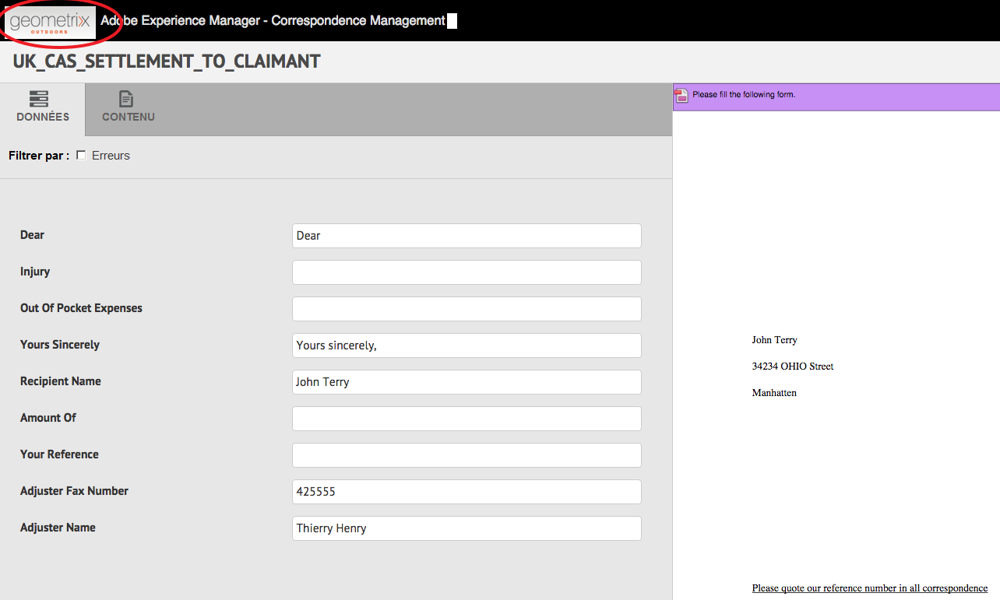
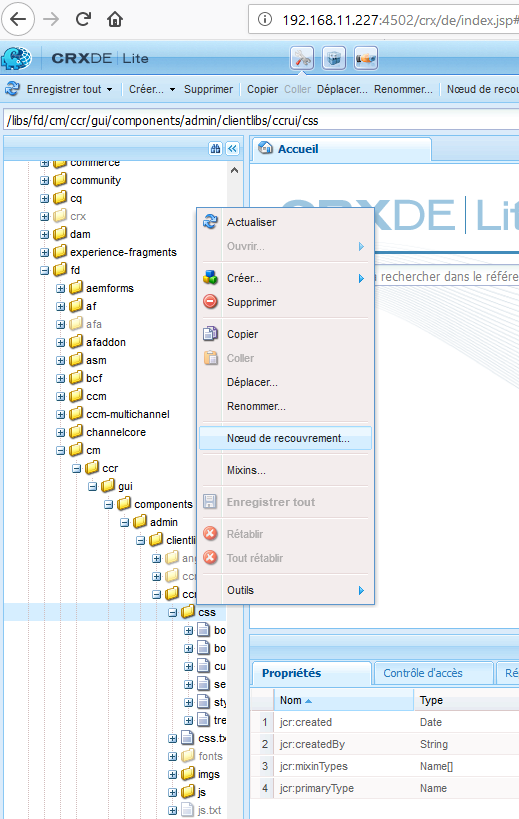
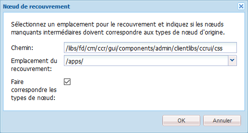
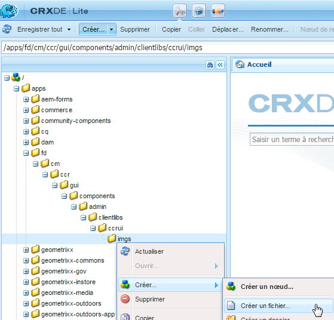
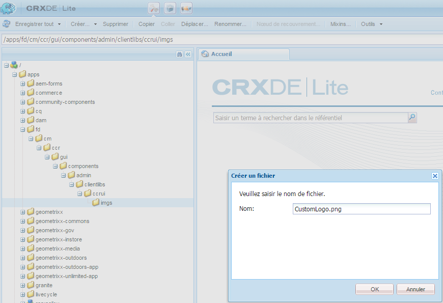
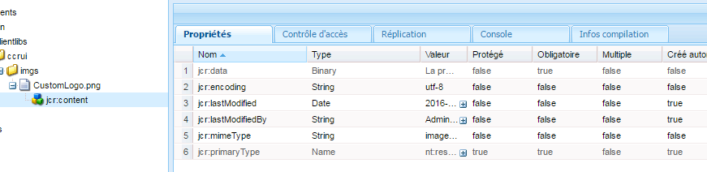

# Personnaliser l&#39;interface de création de correspondance{#customize-create-correspondence-ui}

## Présentation {#overview}

Correspondence Management vous permet d’adapter le modèle de solution à l’identité graphique de votre société afin de conserver la valorisation de votre marque. Le changement d&#39;identité graphique de l&#39;interface utilisateur comprend la modification du logo de la société, qui est affiché dans le coin supérieur gauche de l&#39;interface utilisateur de création de correspondance.

Vous pouvez changer le logo dans l&#39;interface utilisateur de création de correspondance pour le remplacer par le logo de votre entreprise.



L&#39;icône personnalisée dans l&#39;interface utilisateur de création de correspondance

### Modification du logo dans l&#39;interface utilisateur de création de correspondance {#changing-the-logo-in-the-create-correspondence-ui}

Pour configurer une image de logo de votre choix, procédez comme suit :

1. Create the appropriate [folder structure in CRX](#creatingfolderstructure).
1. [Téléchargez le nouveau fichier](#uploadlogo) de logo dans le dossier que vous avez créé dans CRX.

1. [Configurez le fichier CSS](#createcss) sur CRX pour faire référence au nouveau logo.
1. Clear the browser history and [refresh the Create Correspondence UI](#refreshccrui).

## Création de la structure de dossiers requise {#creatingfolderstructure}

Créez la structure de dossiers, comme expliqué ci-après, pour héberger l&#39;image de logo et la feuille de style personnalisées. La nouvelle structure de dossiers avec le dossier racine /apps est similaire à la structure de dossier /libs.

Pour une personnalisation, créez une structure de dossiers parallèle, comme expliqué ci-après, dans la branche /apps.

La branche /apps (structure de dossiers) :

* Garantit que vos fichiers sont sûrs en cas de mise à jour du système. En cas de mise à niveau, de feature pack ou de correctif, la branche /libs est mise à jour et si vous hébergez vos modifications dans la branche /libs, elles sont remplacées.
* Vous aide à ne pas toucher au système/à la branche actuels, que vous pouvez ébranler par erreur si vous utilisez les emplacements par défaut pour enregistrer les fichiers personnalisés.
* Aide vos ressources pour obtenir une priorité plus élevée si AEM recherche des ressources. AEM est configuré pour effectuer d’abord une recherche dans la branche /apps, puis dans la branche /libs pour trouver une ressource. Ce mécanisme signifie que le système utilise votre recouvrement (et les personnalisations qui y sont définies).

Suivez les étapes ci-dessous pour créer la structure de dossiers requise dans la branche /apps :

1. Go to `https://'[server]:[port]'/[ContextPath]/crx/de` and login as Administrator.
1. Dans le dossier des applications, créez un dossier nommé `css` dont le chemin d&#39;accès/la structure est similaire au dossier css (situé dans le dossier ccrui).

   Procédure de création du dossier css :

   1. Right-click the **css** folder at the following path and select **Overlay Node**: `/libs/fd/cm/ccr/gui/components/admin/clientlibs/ccrui/css`

      

   1. Assurez-vous que la boîte de dialogue du nœud de recouvrement possède les valeurs suivantes :

      **Chemin :** /libs/fd/cm/ccr/gui/components/admin/clientlibs/ccrui/css

      **Emplacement de l’incrustation :** /apps/

      **Faire correspondre les types de noeud :** Coché

      

      >[!NOTE]
      >
      >N&#39;apportez pas de modifications dans la branche /libs. Toutes les modifications que vous apportez risquent d’être perdues, car cette branche est exposée aux modifications chaque fois que vous :
      >
      >    
      >    
      >    * Effectuez une mise à niveau sur votre instance
      >    * Appliquez un correctif
      >    * Configurez un feature pack


   1. Cliquez sur **OK**. Le dossier CSS est créé au niveau du chemin d&#39;accès indiqué.


1. In the apps folder, create a folder named `imgs` with path/structure similar to the imgs folder (located in ccrui folder).

   1. Right-click the **imgs** folder at the following path and select **Overlay Node**: `/libs/fd/cm/ccr/gui/components/admin/clientlibs/ccrui/imgs`
   1. Assurez-vous que la boîte de dialogue du nœud de recouvrement possède les valeurs suivantes :

      **Chemin :** /libs/fd/cm/ccr/gui/components/admin/clientlibs/ccrui/imgs

      **Emplacement de l’incrustation :** /apps/

      **Faire correspondre les types de noeud :** Coché

   1. Cliquez sur **OK**.

      >[!NOTE]
      >
      >Vous pouvez également créer la structure de dossiers dans le dossier /apps manuellement.

1. Cliquez sur **Enregistrer tout** pour enregistrer les modifications sur le serveur.

## Télécharger le nouveau logo dans CRX {#uploadlogo}

Téléchargez votre fichier de logo personnalisé dans CRX. Les règles HTML standard régissent le rendu du logo. Les formats de fichier image pris en charge dépendent du navigateur utilisé pour accéder à AEM Forms. Tous les navigateurs prennent en charge les fichiers JPEG, GIF et PNG. Pour en savoir plus, reportez-vous à la documentation du navigateur sur les formats d&#39;image pris en charge.

* Les dimensions par défaut de l&#39;image de logo est de 48 px x 48 px. Assurez-vous que l&#39;image est de cette taille ou d&#39;une taille supérieure à 48 px * 48 px.
* Si la hauteur de l&#39;image de logo est de plus de 50 px, l&#39;interface utilisateur de création de correspondance réduit l&#39;image à une hauteur maximale de 50 px car il s&#39;agit de la hauteur de l&#39;en-tête. Lors de la réduction de l&#39;image, l&#39;interface utilisateur de création de correspondance conserve les proportions de votre image.
* L&#39;interface utilisateur de création de correspondance n&#39;agrandit pas votre image si elle est petite. Vous devez donc vous assurer que vous utilisez une image de logo d&#39;au moins 48 px de haut et d&#39;une largeur suffisante pour la clarté.

Suivez les étapes ci-dessous pour télécharger le fichier du logo personnalisé dans CRX :

1. Accédez à `https://'[server]:[port]'/[contextpath]/crx/de`. Le cas échéant, connectez-vous en tant qu’administrateur.
1. Dans CRXDE, faites un clic droit sur le dossier **imgs** au  niveau du chemin d&#39;accès suivant et sélectionez **Créer > Créer un fichier** :

   `/apps/fd/cm/ccr/gui/components/admin/clientlibs/ccrui/imgs/`

   

1. Dans la boîte de dialogue Créer un fichier, entrez le nom du fichier au format CustomLogo.png (ou le nom de fichier de votre logo).

   

1. Cliquez sur **Enregistrer tout**.

   Dans le nouveau fichier que vous avez créé (ici CustomLogo.png), la propriété jcr:content s&#39;affiche.

1. Cliquez sur jcr:content dans la structure de dossiers.

   Les propriétés de jcr:content s&#39;affichent.

   

1. Double-click the **jcr:data** property.

   La boîte de dialogue Edit jcr:data s&#39;affiche.

   Cliquez maintenant sur le dossier newlogo.png,  cliquez sur jcr:content (option dim) et définissez type nt:resource. Dans le cas contraire, créez une propriété du nom de jcr:content.

1. Dans la boîte de dialogue Edit jcr:data, cliquez sur **Parcourir** et sélectionnez le fichier image que vous souhaitez utiliser comme logo (ici, CustomLogo.png).

   Les formats de fichier image pris en charge dépendent du navigateur utilisé pour accéder à AEM Forms. Tous les navigateurs prennent en charge les fichiers JPEG, GIF et PNG. Pour en savoir plus, reportez-vous à la documentation du navigateur sur les formats d&#39;image pris en charge.

   

   Exemple : CustomLogo.png à utiliser comme logo personnalisé

1. Cliquez sur **Enregistrer tout**.

## Créer le CSS pour intégrer le logo à l&#39;interface utilisateur {#createcss}

L&#39;image de logo nécessite une feuille de style supplémentaire à charger dans le contexte du contenu.

Effectuez les étapes suivantes pour définir la feuille de style pour le rendu du logo :

1. Accédez à `https://'[server]:[port]'/[contextpath]/crx/de`. Le cas échéant, connectez-vous en tant qu’administrateur.
1. Créez un fichier nommé customcss.css (vous ne pouvez pas utiliser un autre nom de fichier) à l’emplacement suivant :

   `/apps/fd/cm/ccr/gui/components/admin/clientlibs/ccrui/css/`

   Procédure à suivre pour créer le fichier customcss.css :

   1. Faites un clic droit sur le dossier **css** et sélectionnez **Créer > Créer un fichier**.
   1. In the New File dialog, specify the name of the CSS as `customcss.css`(you cannot use a different filename), and click **OK**.
   1. Ajoutez le code suivant dans le fichier CSS que vous venez de créer. Dans la partie content:url du code, indiquez le nom de l&#39;image que vous avez téléchargée dans le dossier imgs dans CRXDE.

      ```css
      .logo, .logo:after {
      content:url("../imgs/CustomLogo.png");
      }
      ```

   1. Cliquez sur **Enregistrer tout**.

## Actualiser l&#39;interface utilisateur de création de correspondance pour voir le logo personnalisé {#refreshccrui}

Effacez la mémoire cache du navigateur, puis ouvrez l&#39;instance de l&#39;interface utilisateur de création de correspondance dans votre navigateur. Vous devez voir votre logo personnalisé.


L&#39;icône personnalisée dans l&#39;interface utilisateur de création de correspondance

