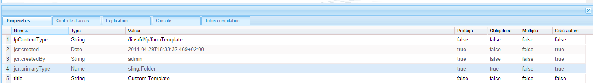

# Personnalisation de modèles pour les composants Forms Portal{#customizing-templates-for-forms-portal-components}

## Conditions préalables {#prerequisites}

[Gestion des métadonnées de formulaire](../../forms/using/manage-form-metadata.md)

Maîtrise du langage HTML et des feuilles de style CSS

## Présentation {#overview}

L’interface utilisateur des formulaires AEM permet d’ajouter des métadonnées à n’importe quel formulaire. Les métadonnées personnalisées peuvent améliorer l’expérience utilisateur lors de la création de liste et la recherche des formulaires de votre organisation.

Forms Portal permet d’utiliser des métadonnées personnalisées dans les listes de formulaires. Lors de la création de modèles personnalisés pour les ressources, vous pouvez modifier leur disposition et utiliser des métadonnées personnalisées dans votre jeu de styles CSS.

Pour créer un modèle personnalisé pour divers composants de Forms Portal, suivez la procédure ci-après.

## Création d’un modèle personnalisé {#creating-a-nbsp-custom-template}

1. Créez un nœud sling:Folder sous /apps

   Ajoutez une propriété « fpContentType ». Spécifiez les valeurs adéquates pour la propriété en fonction du composant pour lequel vous définissez le modèle personnalisé.

   * Composant Recherche et énumérateur : « /libs/fd/fp/formTemplate »
   * Composant Drafts &amp; Submissions :

      * Section Brouillons : /libs/fd/fp/draftsTemplate
      * Section Envois : /libs/fd/fp/submissionsTemplate
   * Component Lien : /libs/fd/fp/linkTemplate

   Ajoutez un titre que vous souhaitez afficher lors de la sélection des modèles de disposition.

   >[!NOTE]
   >
   >Le titre peut être différent du nom de noeud sling:Folder que vous avez créé.

   L’image ci-après illustre la configuration pour le composant Recherche et énumérateur.
   

1. Créez un fichier template.html dans ce dossier qui servira de modèle personnalisé.
1. Créez le modèle personnalisé et utilisez des métadonnées personnalisées comme indiqué ci-dessous.

## Exemple fonctionnel {#working-example}

Vous trouverez ci-dessous un exemple d’implémentation d’un modèle personnalisé dans lequel Forms Portal acquiert une disposition Geometrixx Gov Card Layout pour le composant Recherche et énumérateur.

```html
<div class="__FP_boxes-container __FP_single-color">
    <div class="boxes __FP_boxes __FP_single-color" data-repeatable="true">
 <div class="__FP_boxes-thumbnail">
     
        </div>
        <h3 class="__FP_single-color" title="${name}" tabindex="0">${name}</h3>
        <p>${description}</p>
        <div class="boxes-icon-cont __FP_boxes-icon-cont">
            <div class="op-dow">
                <a href="${formUrl}" target="_blank" class="__FP_button ${htmlStyle}" title="${config-htmlLinkText}">${localize-Apply}</a>
                <a href="${pdfUrl}" class="__FP_button ${pdfStyle}" title="${config-pdfLinkText}">${localize-Download}</a>
            </div>
        </div>
    </div>
</div>
```

## Spécifications techniques relatives aux modèles personnalisés {#technical-specifications-for-custom-templates}

Un modèle personnalisé pour tout composant Forms Portal comprend des entrées répétables et non répétables. Les entrées répétables sont les entités de base des listes. Les composants Recherche et énumérateur, Brouillons et envois et Lien sont des exemples d’entrées répétables.

Forms Portal fournit une syntaxe pour que les espaces réservés affichent des métadonnées personnalisées/prêtes à l’emploi. Les espaces réservés sont remplis après l’affichage des résultats des formulaires, des brouillons ou des envois.

To include a repeatable entry, configure the value of the attribute **data-repeatable** to **true**.

*Dans l’exemple présenté, deux éléments Div se trouvent dans la partie supérieure du modèle personnalisé. Le premier, avec la classe CSS &quot;__FP_boxes-container&quot;, fonctionne comme un élément conteneur pour les formulaires répertoriés. Le second, avec la classe CSS &quot;__FP_boxes&quot;, est un modèle pour les entités de base, à savoir un formulaire dans le cas présent. The **data-repeatable**attribute present in the Div element has the value **true**.*

Chaque espace réservé possède un jeu de métadonnées prêtes à l’emploi exclusif. To display custom metadata at a particular place on the form, add the **${metadata_prop} property** at the place.

*Dans cet exemple, la propriété des métadonnées est utilisée dans plusieurs instances. For example, it is used in **description**,**name**,**formUrl**,**htmlStyle**,**pdfUrl**,**pdfStyle**, and **path**in the prescribed manner.*

## Métadonnées prêtes à l’emploi {#out-of-the-box-metadata}

Les différents composants de Forms Portal fournissent des jeux exclusifs de métadonnées prêtes à l’emploi que vous pouvez utiliser pour les listes.

### Composant Search &amp; Lister {#search-amp-lister-component}

* **Title :** titre du formulaire
* **name** : nom du formulaire (il s’agit généralement du titre)
* **description** : description du formulaire.
* **formUrl**: URL permettant de générer le formulaire au format HTML
* **pdfUrl**: URL permettant de générer le formulaire au format PDF
* **assetType** : type de la ressource. Valid values include **Form**,**PDF Form**, **Print Form**, and **Adaptive Form**

* **htmlStyle** et **pdfStyle** : style d’affichage des icônes HTML et PDF utilisées pour le rendu. Valid values are “**__FP_display_none**” or blank.

>[!NOTE]
>
>Pensez à utiliser la classe __FP_display_none dans votre feuille de style personnalisée.

* **downloadUrl** : URL permettant de télécharger une ressource.

Prise en charge de la localisation et du tri et utilisation des propriétés de configuration de l’interface utilisateur (Recherche et énumérateur uniquement) :

1. **Prise en charge** des Localisations : Pour localiser un texte statique, utilisez l’attribut `${localize-YOUR_TEXT}` et rendez la valeur localisée disponible, si elle n’existe pas déjà.
   *Dans l’exemple présenté, les attributs`${localize-Apply}`et`${localize-Download}`sont utilisés pour localiser le texte Appliquer et Télécharger.*

1. **Prise en charge du tri** : cliquez sur l’élément HTML pour trier les résultats de la recherche. Pour mettre en œuvre le tri dans une disposition de tableau, ajoutez l’attribut « data-sortKey » à l’en-tête spécifique du tableau. Ajoutez en outre sa valeur en tant que métadonnées pour lesquelles vous souhaitez effectuer un tri.
Par exemple, pour l&#39;en-tête &quot;Title&quot; dans la vue Grille, la valeur de l&#39;en-tête &quot;data-sortKey&quot; est &quot;title&quot;. Cliquez sur l’en-tête pour trier les valeurs d’une colonne particulière.

1. **Utilisation des propriétés de configuration** : le composant Recherche et énumérateur possède plusieurs configurations que vous pouvez utiliser dans l’interface utilisateur. For example, to display HTML ToolTip text saved through the edit dialog, use the `${config-htmlLinkText}` attribute. **De même, pour le texte d’info-bulle PDF, utilisez l’** attribut `${config-pdfLinkText}` .

### Composant Link {#link-component}

* **Title :** titre du formulaire
* **formUrl**: URL permettant de générer le formulaire au format HTML
* **target** : attribut cible du lien. Les valeurs valides sont les suivantes : &quot;_blank&quot; » et &quot;_self&quot;.
* **linkText** : légende du lien.

### Composant Brouillons et envois {#drafts-amp-submissions-component}

* **Path** : chemin du nœud des métadonnées de bouillon/envoi. Utilisez-la avec l’extension .HTML comme URL pour ouvrir un brouillon ou un envoi.
* **contextPath** : chemin du contexte de l’instance AEM.
* **firstLetter** : première lettre (majuscule) du titre du formulaire adaptatif qui a été enregistré en tant que brouillon ou envoyé.
* **formName** : titre du formulaire adaptatif qui a été enregistré en tant que brouillon ou envoyé.
* **draftID** : identifiant du brouillon répertorié (à utiliser uniquement dans le modèle pour la section Brouillons).
* **submitID** : identifiant de l’envoi répertorié (à utiliser uniquement dans le modèle pour la section Envois).
* **status** : état du formulaire envoyé. (A utiliser uniquement dans le modèle pour la section Envois).
* **description** : description du formulaire adaptatif associé au brouillon ou à l’envoi.
* **diffTime** : différence entre l’heure actuelle et la dernière action d’enregistrement du brouillon. Il peut s’agir également de la différence entre l’heure actuelle et la dernière action d’envoi pour l’envoi.
* **iconClass** : classe CSS utilisée pour afficher la première lettre du brouillon/envoi. Forms Portal comprend les classes suivantes, qui fournissent divers arrière-plans colorés.
* **owner** : utilisateur ayant créé le brouillon/envoi.
* **Today** : date de création du brouillon ou de l’envoi au format JJ:MM:AAAA.
* **TimeNow** : heure de création du brouillon ou de l’envoi au format HH:MM:SS.

*Remarque :*

1. Pour l’option de suppression dans la section Brouillons sous le composant Brouillons et envois, appelez la classe CSS &quot;__FP_deleteDraft&quot;. In addition, include the attribute &quot;draftID&quot; with the value **${draftID}**, which is the draft id of corresponding draft.

1. While creating links to open drafts and submissions, you can specify **${path}.html** as the value of the **href** attribute for the anchor tag.


**A**. Elément conteneur

**B.** les métadonnées &quot;path&quot; avec une hiérarchie fixe pour obtenir la miniature stockée pour chaque formulaire.

**C.** Attribut répétable aux données utilisé pour la section de modèle de chaque formulaire

**D.** Pour localiser la chaîne &quot;Apply&quot;

**E.** Utilisation de la propriété de configuration pdfLinkText

**F.** Utilisation des métadonnées &quot;pdfUrl&quot;

## Conseils, astuces et problèmes connus {#tips-tricks-and-known-issues}

1. N’utilisez pas de guillemet simple (’) dans un modèle personnalisé.
1. For custom metadata, store this property on the **jcr:content/metadata** node only. Si vous le stockez à un autre emplacement, Forms Portal ne peut pas afficher les métadonnées.
1. Vérifiez que le nom d’une métadonnée personnalisée ou existante ne contient pas de signe deux-points ( : ). S’il en contient un, vous ne pouvez pas l’afficher dans l’interface utilisateur.
1. **data-repeatable** n’a aucune signification pour un composant **Link** . Adobe recommande d’éviter l’utilisation de cette propriété dans le modèle d’un composant Lien.

## Articles connexes

* [Activation des composants du portail de formulaires](/help/forms/using/enabling-forms-portal-components.md)
* [Créer une page du portail de formulaires](/help/forms/using/creating-form-portal-page.md)
* [Affichage de la liste des formulaires sur une page Web à l’aide d’API](/help/forms/using/listing-forms-webpage-using-apis.md)
* [Utiliser le composant Drafts and Submissions](/help/forms/using/draft-submission-component.md)
* [Personnalisation de l’enregistrement des brouillons et des formulaires envoyés](/help/forms/using/draft-submission-component.md)
* [Exemple d’intégration d’un composant brouillons &amp; envois à la base de données](/help/forms/using/integrate-draft-submission-database.md)
* [Personnalisation de modèles pour les composants Forms Portal](/help/forms/using/customizing-templates-forms-portal-components.md)
* [Présentation de la publication de formulaires sur un portail](/help/forms/using/introduction-publishing-forms.md)