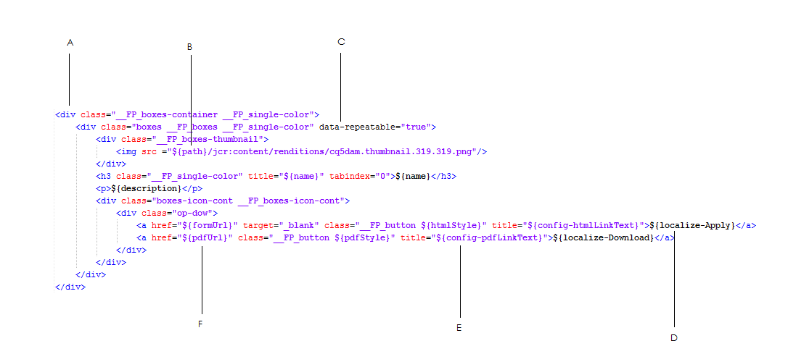

# Personnaliser des modèles pour les composants du portail Formulaires{#customizing-templates-for-forms-portal-components}

## Conditions préalables {#prerequisites}

[Gestion des métadonnées de formulaire](../../forms/using/manage-form-metadata.md)

Compréhension de base du HTML et du CSS

## Vue d’ensemble {#overview}

L’interface utilisateur des AEM Forms permet d’ajouter des métadonnées à n’importe quel formulaire. Les métadonnées personnalisées peuvent améliorer l’expérience client lors du listage et de la recherche de formulaires de votre entreprise.

Le portail Formulaires vous permet d’utiliser des métadonnées personnalisées dans les listes de formulaires. Lors de la création de modèles personnalisés pour les ressources, vous pouvez modifier leur disposition et utiliser des métadonnées personnalisées avec votre jeu de styles CSS.

Procédez comme suit pour créer un modèle personnalisé pour divers composants du portail Formulaires.

## Créer un modèle personnalisé {#creating-a-nbsp-custom-template}

1. Créez un nœud sling:Folder sous /apps

   Ajoutez une propriété « fpContentType ». Spécifiez les valeurs appropriées pour la propriété en fonction du composant pour lequel vous définissez le modèle personnalisé.

   * Composant Search &amp; Lister : « /libs/fd/fp/formTemplate »
   * Composant Brouillons et envois :

      * Section Brouillons : /libs/fd/fp/draftTemplate
      * Section Envois : /libs/fd/fp/submissionsTemplate

   * Composant Link : /libs/fd/fp/linkTemplate

   Ajoutez un titre à afficher lors de la sélection des modèles de disposition.

   >[!NOTE]
   >
   >Remarque : le titre peut être différent du nom du nœud sling:Folder que vous avez créé.

   L’image ci-après illustre la configuration pour le composant Recherche et énumérateur.
   

1. Créez un fichier template.html dans ce dossier afin qu’il puisse servir de modèle personnalisé.
1. Créez le modèle personnalisé et utilisez des métadonnées personnalisées comme décrit ci-dessous.

## Exemple de travail {#working-example}

Vous trouverez ci-dessous un exemple d’implémentation d’un modèle personnalisé dans lequel le portail Formulaires acquiert une disposition de carte Geometrixx Gov personnalisée pour le composant Search &amp; Lister.

```html
<div class="__FP_boxes-container __FP_single-color">
    <div class="boxes __FP_boxes __FP_single-color" data-repeatable="true">
 <div class="__FP_boxes-thumbnail">
     
        </div>
        <h3 class="__FP_single-color" title="${name}" tabindex="0">${name}</h3>
        <p>${description}</p>
        <div class="boxes-icon-cont __FP_boxes-icon-cont">
            <div class="op-dow">
                <a href="${formUrl}" target="_blank" class="__FP_button ${htmlStyle}" title="${config-htmlLinkText}">${localize-Apply}</a>
                <a href="${pdfUrl}" class="__FP_button ${pdfStyle}" title="${config-pdfLinkText}">${localize-Download}</a>
            </div>
        </div>
    </div>
</div>
```

## Spécifications techniques des modèles personnalisés {#technical-specifications-for-custom-templates}

Le modèle personnalisé de tout composant du Portail Formulaires comprend des entrées répétables et non répétables. Les entrées répétables sont des entités de base pour la liste. Les composants Search &amp; Lister, Drafts &amp; Submissions et Link sont des exemples d’entrées répétables.

Le portail Formulaires fournit une syntaxe permettant aux espaces réservés d’afficher des métadonnées personnalisées/prêtes à l’emploi. Les espaces réservés sont renseignés après l’affichage des résultats des formulaires, des brouillons ou des envois.

Pour inclure une entrée répétable, configurez l’attribut **data-repeatable** sur **true**.

*Dans l’exemple présenté, deux éléments Div se trouvent en haut du modèle personnalisé. La première, avec la classe CSS « __FP_boxes-container », fonctionne comme un élément conteneur pour les formulaires répertoriés. Le second, avec la classe CSS « __FP_boxes », est un modèle pour les entités de base, dans ce cas un formulaire. L’attribut **data-repeatable**qui figure dans l’élément Div a la valeur **true**.*

Chaque espace réservé possède un jeu de métadonnées prêtes à l’emploi exclusif. Pour afficher des métadonnées personnalisées à un emplacement spécifique du formulaire, ajoutez la **propriété ${metadata_prop}** à cet emplacement.

*Dans cet exemple, la propriété des métadonnées est utilisée dans plusieurs instances. Elle est utilisée par exemple de façon adéquate dans **description**,**name**,**formUrl**,**htmlStyle**,**pdfUrl**,**pdfStyle**et **path**.*

## Métadonnées prêtes à l’emploi {#out-of-the-box-metadata}

Plusieurs composants du portail Formulaires fournissent des ensembles exclusifs de métadonnées prêtes à l’emploi que vous pouvez utiliser pour les listes.

### Composant Search &amp; Lister {#search-amp-lister-component}

* **Title :** titre du formulaire
* **name** : nom du formulaire (généralement identique au titre)
* **description** : description du formulaire
* **formUrl** : URL permettant d’effectuer le rendu du formulaire au format HTML.
* **pdfUrl** : URL permettant d’effectuer le rendu du formulaire au format PDF.
* **assetType** : type de la ressource. Les valeurs valides sont les suivantes : **Formulaire**,**Formulaire PDF**, **Imprimer le formulaire** et **Formulaire adaptatif**.

* **htmlStyle** et **pdfStyle** : style d’affichage des icônes HTML et PDF utilisées pour le rendu. Les valeurs valides sont les suivantes : « **__FP_display_none** » ou vide.

>[!NOTE]
>
>Veillez à utiliser la classe __FP_display_none dans votre feuille de style personnalisée.

* **downloadUrl** : URL permettant de télécharger une ressource.

Prise en charge de la localisation et du tri et utilisation des propriétés de configuration de l’interface utilisateur (Recherche et énumérateur uniquement) :

1. **Prise en charge de la localisation** : pour localiser du texte statique, utilisez l’attribut `${localize-YOUR_TEXT}` et rendez la valeur localisée disponible, si elle ne l’est déjà.
   *Dans l’exemple présenté, les attributs `${localize-Apply}` et `${localize-Download}` sont utilisés pour localiser les termes Apply et Download.*

1. **Prise en charge du tri** : cliquez sur l’élément HTML pour trier les résultats de la recherche. Pour mettre en œuvre le tri dans une disposition de tableau, ajoutez l’attribut « data-sortKey » sur l’en-tête particulier du tableau. Ajoutez en outre sa valeur en tant que métadonnées pour lesquelles vous souhaitez effectuer un tri.
Par exemple, pour l’en-tête &quot;Title&quot; dans la vue Grille, la valeur de l’en-tête &quot;data-sortKey&quot; est &quot;title&quot;. Cliquez sur l’en-tête pour trier les valeurs d’une colonne particulière.

1. **Utilisation des propriétés de configuration** : le composant Recherche et énumérateur possède plusieurs configurations que vous pouvez utiliser dans l’interface utilisateur. Par exemple, pour afficher du texte d’info-bulle HTML enregistré dans la boîte de dialogue Modifier, utilisez l’attribut `${config-htmlLinkText}`. **De même, pour le texte d’info-bulle PDF, utilisez l’attribut** `${config-pdfLinkText}`.

### Composant Lien {#link-component}

* **Title :** titre du formulaire
* **formUrl** : URL permettant d’effectuer le rendu du formulaire au format HTML.
* **target** : attribut cible du lien. Les valeurs valides sont les suivantes : « _blank » et « _self ».
* **linkText** : légende du lien.

### Composant Brouillons et envois {#drafts-amp-submissions-component}

* **Path** : chemin d’accès au nœud de métadonnées de brouillon/envois. Utilisez-le avec l’extension .HTML en tant qu’URL pour ouvrir un brouillon ou un envoi.
* **contextPath** : chemin du contexte de l’instance AEM.
* **firstLetter** : première lettre (majuscule) du titre du formulaire adaptatif, enregistré en tant que brouillon ou envoyé.
* **formName** : titre du formulaire adaptatif, qui a été enregistré en tant que brouillon ou envoyé.
* **draftID** : identifiant du brouillon répertorié (à utiliser uniquement dans le modèle de la section Brouillon).
* **submitID** : identifiant de l’envoi répertorié (à utiliser uniquement dans le modèle de la section Envoi).
* **status** : statut du formulaire envoyé. (À utiliser uniquement dans le modèle pour la section Envoi.)
* **description** : description du formulaire adaptatif associé au brouillon ou à l’envoi.
* **diffTime** : différence entre l’heure actuelle et la dernière action d’enregistrement du brouillon. Vous pouvez également définir la différence entre l’heure actuelle et la dernière action envoyée pour l’envoi.
* **iconClass** : classe CSS utilisée pour afficher la première lettre du brouillon/envoi. Le portail Formulaires comprend les classes suivantes, qui fournissent divers arrière-plans colorés.
* **owner** : personne ayant créé le brouillon/envoi.
* **Today** : date de création du brouillon ou de l’envoi au format `DD:MM:YYYY`.
* **TimeNow** : heure de création du brouillon ou de l’envoi au format 24 heures `HH:MM:SS`.

*Remarque :*

1. Pour l’option de suppression de la section Brouillons sous le composant Brouillons et envois, nommez la classe CSS « __FP_deleteDraft ». En outre, incluez l’attribut « draftID » avec la valeur **${draftID}**, qui correspond à l’ID du brouillon correspondant.

1. Lors de la création de liens pour ouvrir les brouillons et les envois, vous pouvez spécifier **${path}.html** en tant que valeur de l’attribut **href** pour la balise d’ancrage.



**A**. Elément conteneur

**B.** Métadonnées « path » avec hiérarchie fixe pour obtenir la miniature stockée pour chaque formulaire.

**C.** Attribut « data-repeatable » utilisé pour la section du modèle de chaque formulaire.

**D.** Pour localiser la chaîne « Apply ».

**E.** Utilisation de la propriété de configuration pdfLinkText

**F.** Utiliser des métadonnées « pdfUrl ».

## Conseils, astuces et problèmes connus {#tips-tricks-and-known-issues}

1. N’utilisez pas de guillemet simple (’) dans un modèle personnalisé.
1. Pour les métadonnées personnalisées, stockez cette propriété uniquement sur le nœud **jcr:content/metadata**. Si vous l’enregistrez à un autre emplacement, le portail Formulaires ne peut pas afficher les métadonnées.
1. Vérifiez que le nom d’une métadonnée personnalisée ou existante ne contient pas de signe deux-points ( : ). S’il en contient un, vous ne pouvez pas l’afficher dans l’interface utilisateur.
1. L’attribut **data-repeatable** n’a aucune importance pour un composant **Link**. Adobe recommande d’éviter l’utilisation de cette propriété dans le modèle d’un composant Lien.

## Articles connexes

* [Activer des composants du portail Formulaires](/help/forms/using/enabling-forms-portal-components.md)
* [Créer une page du portail Formulaires](/help/forms/using/creating-form-portal-page.md)
* [Affichage de la liste des formulaires sur une page Web à l’aide d’API](/help/forms/using/listing-forms-webpage-using-apis.md)
* [Utiliser le composant Brouillons et Envois](/help/forms/using/draft-submission-component.md)
* [Personnaliser le stockage des brouillons de formulaires et des formulaires envoyés](/help/forms/using/draft-submission-component.md)
* [Exemple d’intégration du composant Brouillons et envois avec la base de données](/help/forms/using/integrate-draft-submission-database.md)
* [Personnaliser des modèles pour les composants du portail Formulaires](/help/forms/using/customizing-templates-forms-portal-components.md)
* [Présentation de la publication de formulaires sur un portail](/help/forms/using/introduction-publishing-forms.md)
