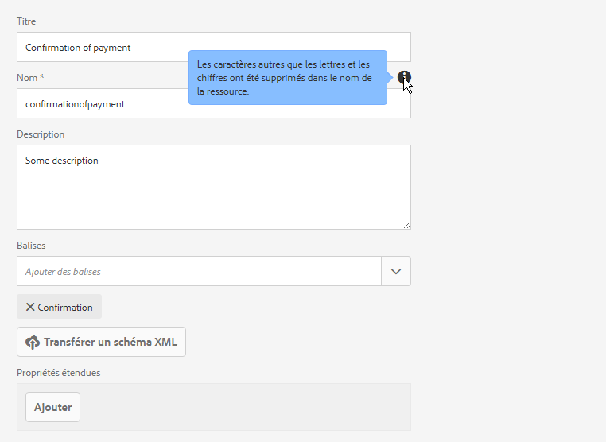
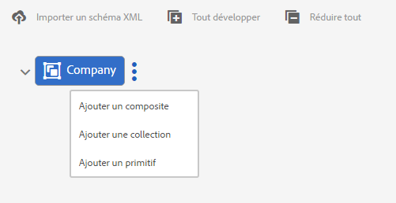
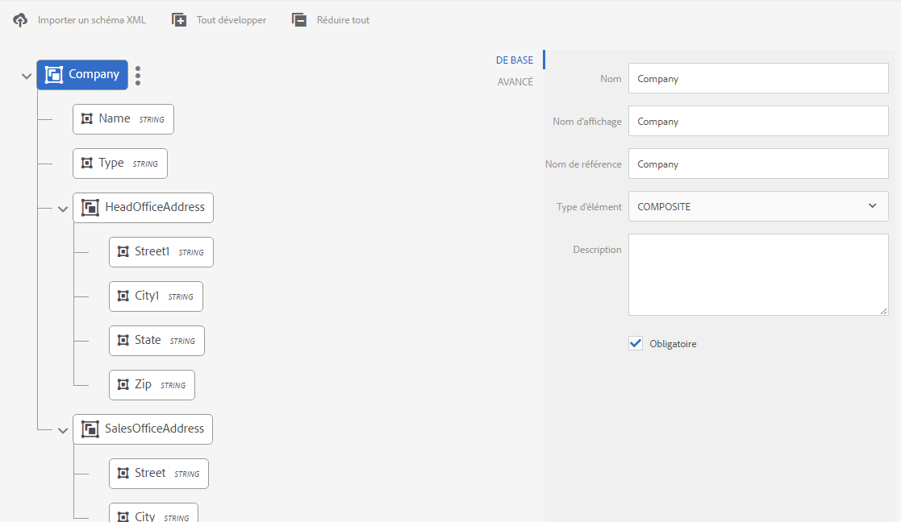
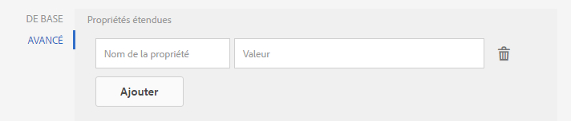
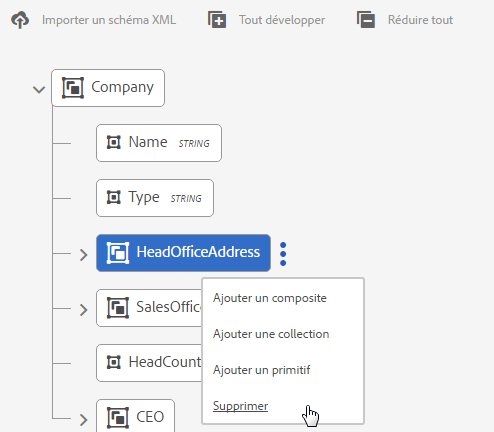
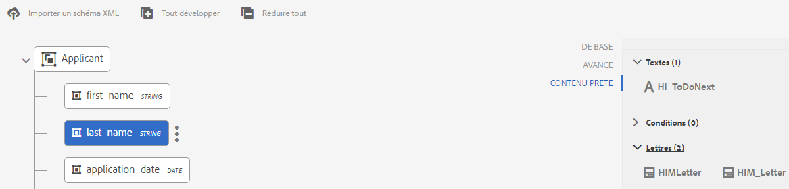

# Dictionnaire de données{#data-dictionary}

## Présentation {#introduction}

Un dictionnaire de données permet aux utilisateurs professionnels d’utiliser des informations provenant de sources de données en arrière-plan sans connaître les détails techniques de leurs modèles de données sous-jacents. Un dictionnaire de données est composé d’éléments de dictionnaire de données (DDE). Vous utilisez ces éléments de données pour intégrer des données principales sur les lettres comme entrées à utiliser dans la correspondance client.

Un dictionnaire de données est une représentation indépendante des métadonnées qui décrivent les structures des données sous-jacentes et leurs attributs associés. Un dictionnaire de données est créé à l’aide d’un vocabulaire métier. Il peut être mappé à un ou plusieurs modèles de données sous-jacents..

Le dictionnaire de données est composé d’éléments de trois types : simple, composite et de collection. Les DDE simples sont des éléments primitifs tels que des chaînes, des nombres, des dates et des valeurs booléennes qui contiennent des informations telles qu’un nom de ville. Un DDE composite contient d’autres éléments de dictionnaire de données qui peuvent être de type primitif, composite ou de collection. Par exemple, une adresse, qui se compose d’un nom de rue, d’une ville, d’une province, d’un pays et d’un code postal. Une collection est une liste de DDE simples ou composites similaires. Par exemple, un client avec plusieurs emplacements différents ou des adresses de facturation et de livraison différentes.

Correspondence Management utilise les données d’arrière-plan, client ou destinataire stockées selon la structure du dictionnaire de données pour créer de la correspondance destinée à différents clients. Par exemple, un document peut être créé avec des noms conviviaux, tels que « Cher/chère {Prénom} » ou « M. {Nom} ».

En règle générale, les utilisateurs professionnels n’ont pas besoin de connaître les représentations de métadonnées telles que le schéma XSD (schéma XML) et les classes Java. Cependant, ils ont le plus souvent besoin de l’accès à ces structures de données et à leurs attributs dans le but de créer des solutions.

### Flux de travaux de dictionnaire de données {#data-dictionary-workflow}

1. Un auteur [crée le Dictionnaire de données](#createdatadictionary) en chargeant un schéma ou à partir de rien.
1. L’auteur crée la lettre et les communications interactives en fonction du dictionnaire de données et associe les éléments de dictionnaire de données dans la lettre et les communications interactives là où cela est nécessaire.
1. Il peut télécharger le fichier XML de données d’exemple, qui repose sur le schéma d’un dictionnaire de données. L’auteur peut modifier le fichier XML de données d’exemple, qui peut être associé en tant que données de test au dictionnaire de données. Le même nœud est utilisé pendant l’aperçu de la lettre.
1. Durant [l’aperçu d’une lettre](../../forms/using/create-letter.md#p-types-of-linkage-available-for-each-of-the-fields-p), un auteur choisit de prévisualiser la lettre avec des données (Aperçu personnalisé). La lettre s’ouvre préremplie avec les données que l’auteur a fournies. Elle s’ouvre dans l’interface de création de correspondance. L’agent qui prévisualise cette lettre peut modifier le contenu, les données, les pièces jointes de la lettre et envoyer la lettre finale. Pour plus d’informations sur la création de lettres, voir[ Création de correspondance](../../forms/using/create-letter.md).

## Prérequis {#prerequisite}

Installez le [package de compatibilité](compatibility-package.md) pour vue l&#39;option **dictionnaires de données** sur la page **Forms**.

## Création d’un dictionnaire de données {#createdatadictionary}

Utilisez l’Éditeur du dictionnaire de données pour créer un dictionnaire de données ; vous pouvez également charger un fichier de schéma XSD pour créer un dictionnaire de données à partir de cela. Vous pouvez ensuite étendre le dictionnaire de données en ajoutant d’autres informations obligatoires, y compris des champs. Quelle que soit la façon dont le dictionnaire de données a été créé, le propriétaire du processus d’entreprise n’a pas besoin de connaître les systèmes en arrière-plan. Le propriétaire du processus d’entreprise n’a besoin de connaître que les objets du domaine et leurs définitions pour leur traitement.

>[!NOTE]
>
>Lorsque plusieurs lettres requièrent des éléments similaires, vous pouvez créer un dictionnaire de données commun. Un dictionnaire de données volumineux contenant un grand nombre d’éléments, toutefois, peut entraîner des problèmes de performances lors de son utilisation et du chargement des éléments, notamment dans les lettres et les fragments de document. Si vous rencontrez des problèmes de performances, essayez de créer les dictionnaires de données distincts pour chaque lettre.

1. Choisissez **Formulaires** > **Dictionnaires de données**.
1. Appuyez sur **Créer un dictionnaire de données**.
1. Dans l’écran de propriétés, ajoutez ce qui suit :

   * **Titre:** (Facultatif) Saisissez le titre du dictionnaire de données. Le titre ne doit pas être unique et peut contenir des caractères spéciaux et des caractères dans une autre langue que l’anglais. Des lettres et d’autres parties du document sont envoyées avec leur titre (le cas échéant), comme dans les vignettes et les propriétés de la ressource. Les dictionnaires de données sont référencés avec leurs noms et non pas avec leurs titres.
   * **Nom** : le nom unique du dictionnaire de données. Dans le champ Nom, vous pouvez entrer uniquement les caractères, les chiffres et les tirets d’anglais. Le champ Nom est automatiquement renseigné en fonction du champ Titre et les caractères spéciaux, les espaces, les chiffres et les caractères non anglais saisis dans le champ Titre sont remplacés par des tirets. Bien que la valeur du champ Titre soit automatiquement copiée dans Nom, vous pouvez la modifier.

   * **Description** : (Facultatif) Description du dictionnaire de données.
   * **Balises:** (Facultatif) Pour créer une balise personnalisée, entrez une valeur dans le champ de texte et appuyez sur Entrée. Vous pouvez afficher la balise sous le champ de texte des balises. Lorsque vous enregistrez ce texte, les balises nouvellement ajoutées sont également créées.
   * **Propriétés** étendues : (Facultatif) Appuyez sur  **Ajouter** champ pour spécifier les attributs de métadonnées pour votre dictionnaire de données. Dans la colonne Nom de la propriété, saisissez un nom de propriété unique. Dans la colonne Valeur, saisissez une valeur à associer à la propriété.

   

1. (Facultatif) Pour télécharger une définition de schéma XSD pour votre dictionnaire de données, dans le volet Structure du dictionnaire de données, appuyez sur **Télécharger le Schéma XML**. Accédez au fichier XSD, sélectionnez-le, puis appuyez sur **Ouvrir**. Un dictionnaire de données est créé en fonction du schéma XML chargé. Vous devez modifier les noms d’affichage et les descriptions des éléments du dictionnaire de données. Pour ce faire, sélectionnez les nom des éléments en cliquant dessus et modifiez leur description, leur nom d’affichage, ou d’autres détails dans les champs du panneau de droite.

   Pour plus d’informations sur les éléments de dictionnaire de données calculés, consultez la section [Eléments de dictionnaire de données calculés](#computedddelements).

   >[!NOTE]
   >
   >Vous pouvez ignorer le chargement du fichier de schéma et créer votre dictionnaire de données à partir de zéro dans l’interface utilisateur. Pour ce faire, ignorez cette étape et poursuivez en effectuant les étapes suivantes.

1. Appuyez sur **Next** (Suivant).
1. Dans l’écran Ajouter des propriétés, ajoutez des éléments au dictionnaire de données. Vous pouvez également ajouter ou supprimer des éléments et modifier leurs détails si vous avez chargé un schéma pour obtenir une structure de base du dictionnaire de données.

   Vous pouvez cliquer sur les trois points du côté droit d’un élément et ajouter un élément à la structure du dictionnaire de données.

   

   Sélectionnez Elément composite, Elément de collection ou Elément primitif.

   * Un DDE composite contient d’autres éléments de dictionnaire de données qui peuvent être de type primitif, composite ou de collection. Par exemple, une adresse, qui se compose d’un nom de rue, d’une ville, d’une province, d’un pays et d’un code postal.
   * Les DDE simples sont des éléments tels que des chaînes, des nombres, des dates et des valeurs booléennes qui contiennent des informations telles qu’un nom de ville.
   * Une collection est une liste de DDE simples ou composites similaires. Par exemple, un client avec plusieurs emplacements différents ou des adresses de facturation et de livraison différentes.

   Voici quelques règles pour créer un dictionnaire de données :

   * Seul le type composite est autorisé en tant que DDE de niveau supérieur dans un dictionnaire de données.
   * Le nom, le nom de référence et le type d’élément sont des champs obligatoires pour un dictionnaire de données et des DDE.
   * Le nom de référence doit être unique.
   * Un DDE parent (composite) ne peut pas avoir deux enfants ayant le même nom.
   * Les énumérations contiennent uniquement des types de chaînes primitifs.

   Pour plus d’informations sur les éléments composites, de collection et primitifs et l’utilisation des éléments du dictionnaire de données, voir [Mappage des éléments du dictionnaire de données au Schéma XML](#mappingddetoschema).

   Pour plus d’informations sur les validations dans le dictionnaire de données, voir [Validations de l’éditeur du dictionnaire de données](#ddvalidations).

   

1. (Facultatif) Après la sélection d’un élément, vous pouvez ajouter des propriétés dans l’onglet Avancé (attributs). Vous pouvez également appuyer sur **Ajouter le champ** et étendre les propriétés d’un élément DD.

   

1. (Facultatif) Vous pouvez supprimer n’importe quel élément en appuyant sur les trois points du côté droit d’un élément et en sélectionnant **Supprimer**.

   

   >[!NOTE]
   >
   >Une suppression d’un élément composite ou de collection avec des nœuds enfant supprime également les nœuds enfant.

1. (Facultatif) Sélectionnez un élément dans le volet Structure du dictionnaire de données et dans le volet Liste des champs et des variables. Modifiez ou ajoutez n’importe quels attributs requis associés à l’élément.
1. Appuyez sur **Enregistrer**.

### Créer des copies d’un ou de plusieurs dictionnaires de données {#create-copies-of-one-or-more-data-dictionary}

Pour créer rapidement un ou plusieurs dictionnaires de données avec des propriétés et éléments similaires aux dictionnaires de données existants, vous pouvez les copier et les coller.

1. Sélectionnez le dictionnaire de données approprié dans la liste des dictionnaires de données. L’interface utilisateur affiche l’icône Copier.
1. Appuyez sur Copier. L’interface utilisateur affiche l’icône Coller.
1. Appuyez sur Coller. La boîte de dialogue Coller s’affiche. Le système attribue automatiquement des noms et des titres aux nouveaux dictionnaires de données.
1. Si nécessaire, modifiez le titre et le nom sous lesquels vous souhaitez enregistrer la copie du dictionnaire de données.
1. Appuyez sur Coller. La copie du dictionnaire de données est créée. Vous pouvez désormais apporter les modifications requises à votre nouveau dictionnaire de données.

## Voir les fragments de document ou les documents qui font référence à un élément du dictionnaire de données.{#see-the-document-fragments-or-documents-that-refer-to-a-data-dictionary-element}

Au cours de la modification ou de l’affichage d’un dictionnaire de données, vous pouvez afficher les éléments du dictionnaire de données auxquels il est fait référence, ainsi que les textes, les conditions, les lettres et les communications interactives où ils se trouvent.

1. Procédez de l’une des manières suivantes pour modifier le dictionnaire de données :

   * Placez le pointeur de la souris sur un dictionnaire de données et appuyez sur Modifier.
   * Sélectionnez un dictionnaire de données, puis appuyez sur Modifier dans l’en-tête.
   * Passez la souris sur un dictionnaire de données et appuyez sur Sélectionner. Appuyez sur Modifier dans l’en-tête.

   Ou appuyez sur un dictionnaire de données pour l’afficher.

1. Dans le dictionnaire de données, appuyez sur un élément simple pour le sélectionner. Les éléments Composite et Collection ne possèdent pas de références.

   Avec les propriétés de base et avancées de l’élément, le contenu prêté s’affiche également.

1. Appuyez sur Contenu prêté.

   L’onglet Contenu prêté s’affiche avec ce qui suit : Textes, Conditions, Lettres et Communications interactives. Chacun de ces titres affiche également le nombre de références à l’élément sélectionné.

1. Appuyez sur un titre pour afficher le nom des actifs qui font référence à l’élément.

   

1. Pour afficher le contenu prêté pour un autre élément, appuyez sur l’élément.
1. Pour afficher une ressource qui fait référence à l’élément, appuyez sur son nom. Le navigateur affiche la ressource, la lettre ou la communication interactive.

## Utilisation des données de test {#working-with-test-data}

1. Sur la page Dictionnaires de données, appuyez sur **Sélectionner**.
1. Appuyez sur un dictionnaire de données pour lequel vous souhaitez télécharger les données de test, puis sur **Télécharger l’exemple de données XML**.
1. Appuyez sur **OK** dans le message d’alerte. Un fichier XML se télécharge.
1. Ouvrez le fichier XML avec le Bloc-notes ou un éditeur XML différent. Le fichier XML a la même structure que les chaînes de dictionnaire de données et d’espace réservé dans les éléments. Remplacer les chaînes d’espace réservé par celles avec lesquelles vous souhaitez tester une lettre.

   ```xml
   <?xml version="1.0" encoding="UTF-8" standalone="no"?>
   <Company>
   <Name>string</Name>
   <Type>string</Type>
   <HeadOfficeAddress>
   <Street>string</Street>
   <City>string</City>
   <State>string</State>
   <Zip>string</Zip>
   </HeadOfficeAddress>
   <SalesOfficeAddress>
   <Street>string</Street>
   <City>string</City>
   <State>string</State>
   <Zip>string</Zip>
   </SalesOfficeAddress>
   <HeadCount>1.0</HeadCount>
   <CEO>
   <PersonName>
   <FirstName>string</FirstName>
   <MiddleName>string</MiddleName>
   <LastName>string</LastName>
   </PersonName>
   <DOB>string</DOB>
   <CurrAddress>
   <Street>string</Street>
   <City>string</City>
   <State>string</State>
   <Zip>string</Zip>
   </CurrAddress>
   <DOJ>14-04-1973</DOJ>
   <Phone>1.0</Phone>
   </CEO>
   </Company>
   ```

   >[!NOTE]
   >
   >Dans cet exemple, XML crée de l’espace pour trois valeurs pour un élément de collection, mais le nombre de valeurs peut être augmenté/réduit selon les besoins.

1. Une fois les entrées de données réalisées, vous pouvez utiliser ce fichier XML lorsque vous prévisualisez une lettre avec des données de test.

   Vous pouvez ajouter ces données de test avec DD (sélectionnez DD, appuyez sur Télécharger les données de test et téléchargez ce fichier xml)
Par la suite, lorsque vous prévisualisation une lettre normalement (non personnalisée), ces données XML sont utilisées dans la lettre. Vous pouvez également cliquer sur Personnalisé et télécharger ce fichier XML.

## Exemples {#samples}

Les exemples de code suivants illustrent les détails d’implémentation pour le Dictionnaire de données.

### Exemple de schéma pouvant être chargé dans le Dictionnaire de données {#sample-schema-that-can-be-uploaded-to-the-data-dictionary}

```xml
<?xml version="1.0" encoding="utf-8"?>
<xs:schema xmlns="DCT" targetNamespace="DCT" xmlns:xs="https://www.w3.org/2001/XMLSchema"
  elementFormDefault="qualified" attributeFormDefault="unqualified">
  <xs:element name="Company">
    <xs:complexType>
      <xs:sequence>
        <xs:element name="Name" type="xs:string"/>
        <xs:element name="Type" type="xs:anySimpleType"/>
        <xs:element name="HeadOfficeAddress" type="Address"/>
        <xs:element name="SalesOfficeAddress" type="Address" minOccurs="0"/>
        <xs:element name="HeadCount" type="xs:integer"/>
        <xs:element name="CEO" type="Employee"/>
        <xs:element name="Workers" type="Employee" maxOccurs="unbounded"/>
      </xs:sequence>
    </xs:complexType>
  </xs:element>
  <xs:complexType name="Employee">
    <xs:complexContent>
      <xs:extension  base="Person">
        <xs:sequence>
          <xs:element name="CurrAddress" type="Address"/>
          <xs:element name="DOJ" type="xs:date"/>
          <xs:element name="Phone" type="xs:integer"/>
        </xs:sequence>
      </xs:extension>
    </xs:complexContent>
  </xs:complexType>
  <xs:complexType name="Person">
    <xs:sequence>
      <xs:element name="PersonName" type="Name"/>
      <xs:element name="DOB" type="xs:dateTime"/>
    </xs:sequence>
  </xs:complexType>
  <xs:complexType name="Name">
    <xs:sequence>
      <xs:element name="FirstName" type="xs:string"/>
      <xs:element name="MiddleName" type="xs:string"/>
      <xs:element name="LastName" type="xs:string"/>
    </xs:sequence>
  </xs:complexType>
  <xs:complexType name="Address">
    <xs:sequence>
      <xs:element name="Street" type="xs:string"/>
      <xs:element name="City" type="xs:string"/>
      <xs:element name="State" type="xs:string"/>
      <xs:element name="Zip" type="xs:string"/>
    </xs:sequence>
  </xs:complexType>
</xs:schema>
```

## Attributs communs associés à un DDE {#common-attributes-associated-with-a-dde}

Le tableau suivant récapitule les attributs communs liés à un DDE :

<table>
 <tbody>
  <tr>
   <td><strong>Attribut</strong></td>
   <td><strong>Type</strong></td>
   <td><strong>Description</strong></td>
  </tr>
  <tr>
   <td>Nom</td>
   <td>Chaîne</td>
   <td>Requis.<br /> Nom du DDE. Ce nom doit être unique.</td>
  </tr>
  <tr>
   <td>Nom de <br /> référence</td>
   <td>Chaîne</td>
   <td>Requis. Nom de référence unique pour le DDE permettant d’obtenir des références au DDE indépendantes des modifications apportées à la hiérarchie ou à la structure du dictionnaire de données. Les modules de texte sont mappés à l’aide ce nom.</td>
  </tr>
  <tr>
   <td>displayname</td>
   <td>Chaîne</td>
   <td>Nom convivial facultatif du DDE.</td>
  </tr>
  <tr>
   <td>description</td>
   <td>Chaîne</td>
   <td>Description du DDE.</td>
  </tr>
  <tr>
   <td>elementType</td>
   <td>Chaîne</td>
   <td>Requis. Le type de DDE : chaîne, nombre, date, booléen, composite, de collection.</td>
  </tr>
  <tr>
   <td>elementSubType</td>
   <td>Chaîne</td>
   <td>Sous-type pour le DDE : ENUM. Uniquement autorisée pour les types d’élément CHAINE et NOMBRE.</td>
  </tr>
  <tr>
   <td>Clé</td>
   <td>Booléen</td>
   <td>Champ de valeur booléenne pour indiquer si un DDE est un élément clé.</td>
  </tr>
  <tr>
   <td>Calculé</td>
   <td>Booléen</td>
   <td>Champ de valeur booléenne pour indiquer si un DDE est calculé. Une valeur de DDE calculée est une fonction d’autres valeurs de DDE. Par défaut, les expressions du langage  (Expression Language) JSP sont prises en charge.</td>
  </tr>
  <tr>
   <td>expression</td>
   <td>Chaîne</td>
   <td>Expression pour le DDE « calculé ». Le service d’évaluation d’expression fourni par défaut prend en charge les expressions EL JSP. Vous pouvez remplacer le service d’expression par une implémentation personnalisée.</td>
  </tr>
  <tr>
   <td>valueSet</td>
   <td>Liste</td>
   <td>Ensemble de valeurs autorisées pour un DDE de type Enum. Par exemple, le Type de compte ne peut comporter que les valeurs épargne et courant.</td>
  </tr>
  <tr>
   <td>extendedProperties</td>
   <td>objet</td>
   <td>Carte des propriétés personnalisées ajoutées au DDE (spécifique d’une interface utilisateur ou toute autre information).</td>
  </tr>
  <tr>
   <td>Requis</td>
   <td>Booléen</td>
   <td>Le drapeau indique que la source des données d’instance correspondant au dictionnaire de données doit contenir la valeur de ce DDE spécifique.</td>
  </tr>
  <tr>
   <td>Liaison</td>
   <td>Elément de liaison</td>
   <td>Liaison XML ou Java de l’élément.</td>
  </tr>
 </tbody>
</table>

### Eléments de dictionnaire de données calculés  {#computedddelements}

Un dictionnaire de données peut également contenir des éléments calculés. Un élément de dictionnaire de données calculé est toujours associé à une expression. Cette expression est évaluée pour obtenir la valeur d’un élément de dictionnaire de données au moment de l’exécution. Une valeur de DDE calculée est une fonction d’autres valeurs ou littéraux d’éléments de dictionnaire de données. Par défaut, les expressions du langage EL (Expression Language) JSP sont prises en charge. Les expressions EL utilisent les caractères ${ } et les expressions valides peuvent inclure des littéraux, des opérateurs, des variables (références d’élément de dictionnaire de données) ainsi que des appels de fonction. Tout en faisant référence à un élément de dictionnaire de données dans l’expression, le nom de référence de DDE est utilisé. Le chemin d’accès est unique pour chaque élément de dictionnaire de données au sein d’un dictionnaire de données.

Un DDE calculé de type PersonfullName peut être associé à une expression de concaténation EL telle que ${PersonFirstName} ${PersonLastName}.

## Mappage de type de données entre XSD et le dictionnaire de données {#data-type-mapping-between-xsd-and-data-dictionary-br}

L’exportation d’un schéma XSD nécessite un mappage de données spécifique, détaillé dans le tableau ci-dessous. La colonne DDI indique le type de la valeur DDE disponible dans la DDI.

<table>
 <tbody>
  <tr>
   <td>XSD <br /> </td>
   <td><p>Dictionnaire de données <br /> </p> </td>
   <td>DDI (valeur d’instance de type de données)<br /> </p> </td>
  </tr>
  <tr>
   <td><p>xs:élément de type - Type composite<br /> </p> </td>
   <td>DDE de type - COMPOSITE<br /> </p> </td>
   <td>java.util.Map<br /> </td>
  </tr>
  <tr>
   <td><p>xs:élément où maxOccurs &gt; 1<br /> </p> </td>
   <td>DDE de type - COLLECTION-<br /> Un nœud de DDE est créé en regard du DDE COLLECTION qui capture les informations à partir du nœud COLLECTION parent. Le même nœud est également créé pour les deux types de collection de données simples/composites. Pour chaque instance de COLLECTION de type composite, l’arborescence du dictionnaire de données capture les champs élémentaires dans les enfants du DDE créé pour la capture des informations de type.<br /> - DDE (COLLECTION)<br /> - DDE (COMPOSITE pour saisir des informations)<br /> - DDE (CHAÎNE) champ1<br /> - DDE (CHAÎNE) champ2<br /> <br /> </p> </td>
   <td>java.util.List<br /> </td>
  </tr>
  <tr>
   <td>Attribut de type xs:id <br /> </p> </td>
   <td>DDE de type CHAÎNE <br /> </td>
   <td>java.lang.String<br /> </td>
  </tr>
  <tr>
   <td>xs:attribut /xs:element de type xs:string</p> </td>
   <td>DDE de type CHAÎNE<br /> </td>
   <td>java.lang.String<br /> </td>
  </tr>
  <tr>
   <td>xs:attribute /xs:element de type xs:boolean <br /> </td>
   <td>DDE de type Boolean <br /> </td>
   <td>java.lang.Boolean<br /> </td>
  </tr>
  <tr>
   <td>xs:attribute /xs:element de type xs:date </td>
   <td>DDE de type DATE </td>
   <td>java.lang.String</td>
  </tr>
  <tr>
   <td>xs:attribute /xs:element de type xs:integer </td>
   <td>DDE de type NOMBRE </td>
   <td>java.lang.Double</td>
  </tr>
  <tr>
   <td>xs:attribute /xs:element de type xs:long</td>
   <td>DDE de type NOMBRE </td>
   <td>java.lang.Double</td>
  </tr>
  <tr>
   <td>xs:attribute /xs:element de type xs:double</td>
   <td>DDE de type NOMBRE </td>
   <td>java.lang.Double</td>
  </tr>
  <tr>
   <td>Elément de type enum et baseType xs:string</td>
   <td>DDE de <br /> type CHAÎNE<br /> et de sous-type ENUM <br /> valueSet - les valeurs autorisées pour ENUM<br /> </td>
   <td>java.lang.String</td>
  </tr>
 </tbody>
</table>

## Téléchargement d’un fichier de données d’exemple d’un dictionnaire de données  {#download-a-sample-data-file-from-a-data-dictionary}

Une fois que vous avez créé un dictionnaire de données, vous pouvez le télécharger en tant que fichier de données d’exemple XML pour y faire des entrées de texte.

1. Dans la page Dictionnaires de données, appuyez sur **Sélectionner**, puis sur un dictionnaire de données pour le sélectionner.
1. Sélectionnez **Télécharger l’exemple de données XML**.
1. Appuyez sur **OK** dans le message d’alerte.

   Correspondence Management crée un fichier XML basé sur la structure du dictionnaire de données sélectionné et le télécharge vers votre ordinateur avec le nom &lt;nom-du-dictionnaire-de-données>-SampleData. Vous pouvez maintenant modifier ce fichier dans un éditeur XML ou de texte pour créer des entrées de données lors de la création d&#39;une lettre [a1/>.](../../forms/using/create-letter.md)

## Internationalisation des métadonnées {#internationalization-of-meta-data}

Lorsque vous souhaitez envoyer la même lettre dans différentes langues à vos clients, vous pouvez localiser le nom, la description, et les valeurs d’énumération du dictionnaire de données et des Eléments du dictionnaire de données.

### Localisation du dictionnaire de données {#localize-data-dictionary}

1. Sur la page Dictionnaires de données, appuyez sur **Sélectionner**, puis sur un dictionnaire de données pour le sélectionner.
1. Appuyez sur **Télécharger les données de Localisation**.
1. Appuyez sur **OK** dans l’alerte. Correspondence Management télécharge un fichier zip sur votre ordinateur sous le nom DataDictionary-&lt;DDname>.zip.
1. Le fichier .zip contient un fichier .properties. Ce fichier définit le dictionnaire de données téléchargé. Le contenu du fichier de propriétés est semblable au contenu suivant :

   ```ini
   #Wed May 20 16:06:23 BST 2015
   DataDictionary.EmployeeDD.description=
   DataDictionary.EmployeeDD.displayName=EmployeeDataDictionary
   DataDictionaryElement.name.description=
   DataDictionaryElement.name.displayName=name
   DataDictionaryElement.person.description=
   DataDictionaryElement.person.displayName=person
   ```

   La structure du fichier de propriétés définit une ligne chacune pour la description et le nom d’affichage pour le dictionnaire de données et chaque élément du dictionnaire de données dans le dictionnaire de données. En outre, le fichier de propriétés définit une ligne pour une valeur d’énumération définie pour chaque élément du dictionnaire de données. Comme avec un dictionnaire de données, le fichier de propriétés correspondant peut avoir plusieurs définitions d’éléments de dictionnaire de données. En outre, le fichier peut contenir des définitions pour un ou plusieurs ensembles de valeur d’énumération.

1. Pour mettre à jour le fichier .properties dans une langue différente, mettez à jour le nom d’affichage et les valeurs de description dans le fichier. Créez plus d’instances du fichier pour chaque langue à localiser. Seuls le français, l’allemand, le japonais et l’anglais sont pris en charge.

1. Enregistrez les différents fichiers de propriétés mis à jour avec les noms suivants :

   _fr_FR.properties (français)

   _de_DE.properties (allemand)

   _ja_JA.properties (japonais)

   _en_EN.properties (anglais) 

1. Archivez le fichier .properties (ou les fichiers si vous avez plusieurs langues) dans un fichier .zip unique.

1. Dans la page du Dictionnaires de données, sélectionnez **Plus** > **Charger les données de localisation** et sélectionnez le fichier .zip contenant des fichiers de propriétés localisés.
1. Pour afficher les modifications de localisation, modifiez la langue de votre navigateur.

## Validations du Dictionnaire de données  {#ddvalidations}

L’Editeur du dictionnaire de données impose les validations suivantes lors de la création ou de la mise à jour d’un dictionnaire de données.

* Seul le type Composite est autorisé en tant qu’élément de niveau supérieur dans la définition du dictionnaire de données.
* Les éléments Composite et Collection ne sont pas autorisés au niveau de la feuille. Seuls les éléments de type primitif (chaîne, date, nombre, booléen) sont autorisés au niveau feuille. Cette validation permet de s’assurer qu’il n’existe aucun élément Composite et Collection sans DDE enfant.
* Lors du chargement d’un fichier XSD pour créer un dictionnaire de données, l’Éditeur du dictionnaire de données invite à importer un seul élément de niveau supérieur, s’il en existe plusieurs, afin de créer le dictionnaire de données.
* Le nom est le seul paramètre obligatoire pour un dictionnaire de données.
* Un DDE parent (composite) ne peut pas avoir deux enfants ayant le même nom.
* Fait en sorte qu’un DDE soit marqué comme calculé, dans le cas où il ne s’agit pas d’un paramètre obligatoire. Un élément obligatoire ne peut pas être calculé et un élément calculé ne peut pas être obligatoire. Aussi, les éléments Collection et Composite ne peuvent pas être des éléments calculés.
* L’Editeur du dictionnaire de données fait en sorte qu’un DDE soit marqué comme obligatoire uniquement lorsqu’il n’est pas calculé. Il s’assure également qu’il n’est pas l’élément de collection indiquant le type de collection (c’est à dire le seul enfant d’un élément de collection).
* Les clés vides ou dupliquées ne sont pas autorisées dans les propriétés étendues d’un dictionnaire de données ou d’un DDE.
* N’utilisez pas les caractères deux-points (:) ou de barre verticale (|) au sein de la clé ou la valeur d’une propriété étendue. Il n’existe aucune validation pour l’utilisation de ces caractères interdits.

Validations appliquées au niveau du Dictionnaire de données

* Le nom du dictionnaire de données ne doit pas être nul.
* Le nom du dictionnaire de données ne doit contenir que des caractères alphanumériques.
* La liste des éléments enfants dans le dictionnaire de données ne doit pas être nulle ou vide.
* Le dictionnaire de données ne doit pas contenir plus d’un élément de dictionnaire de données de niveau supérieur.
* Seul le type Composite est autorisé en tant qu’élément de niveau supérieur dans la définition du dictionnaire de données.

Validations appliquées au niveau de l’Elément du dictionnaire de données.

* Aucun nom de DDE ne doit être nul et contenir d’espaces.
* Tous les DDE doivent comporter un type d’élément « not null/non null ».
* Aucun nom de référence de DDE ne doit être nul.
* Tous les noms de référence de DDE doivent être uniques.
* Tous les noms de référence de DDE ne doivent contenir que des caractères alphanumériques et le signe « _ ».
* Tous les noms d’affichage de DDE ne doivent contenir que des caractères alphanumériques et le signe « _ ».
* Les éléments Composite et Collection ne sont pas autorisés au niveau de la feuille. Seuls les éléments de type primitif (chaîne, date, nombre, booléen) sont autorisés au niveau feuille. Cette validation permet de s’assurer qu’il n’existe aucun élément Composite et Collection sans DDE enfant.
* Un DDE composite parent ne doit pas avoir deux éléments enfants portant le même nom.
* Le sous-type ENUM est utilisé uniquement pour les éléments Chaîne et Nombre.
* Les éléments Collection et Composite ne peuvent pas être calculés.
* Un DDE ne peut pas être à la fois calculé et obligatoire.
* Les DDE calculés doivent contenir une expression valide.
* Les DDE calculés ne doivent pas comporter de liaison XML.
* Un DDE qui indique le type d’un DDE Collection ne peut pas être calculé ni obligatoire.
* Les DDE de sous-type ENUM ne doivent pas contenir d’ensembles de valeurs nuls ou vides.
* La liaison XML d’un DDE de collection ne doit pas correspondre à un attribut.
* La syntaxe de liaison XML doit être valide, par exemple, un seul @ s’affiche, le caractère @ n’est autorisé que lorsqu’il est suivi d’un nom d’attribut.

## Mappage des éléments du dictionnaire de données avec le schéma XML {#mappingddetoschema}

Vous pouvez créer un dictionnaire de données à partir d’un schéma XML ou le construire à l’aide l’Interface utilisateur du dictionnaire de données. Tous les éléments de dictionnaire de données (DDE) au sein d’un dictionnaire de données ont un champ de liaison XML pour stocker la liaison du DDE à un élément dans le schéma XML. La liaison dans chaque DDE dépend du DDE parent.

Les exemples de modèles et de codes indiquant les détails d’implémentation pour le Dictionnaire de données sont détaillés ci-dessous.

## Mappage des éléments simples (primitifs){#mapping-simple-primitive-elements}

Un DDE primitif représente un champ ou un attribut atomique par nature. Les DDE primitifs définis hors type complexe (DDE Composite) ou élément répété (DDE Collection) peuvent être stockés à n’importe quel emplacement au sein du schéma XML. L’emplacement des données correspondant à un DDE primitif ne dépend pas du mappage de son DDE parent. Les DDE primitifs utilisent les informations de mappage à partir du champ de liaison XML pour déterminer sa valeur et le mappage les traduit par l’un des objets suivants :

* un attribut ; 
* un élément ; 
* un contexte de texte ; 
* rien (un DDE ignoré). 

L’exemple suivant montre un schéma simple.

```xml
<?xml version="1.0" encoding="UTF-8"?>
<xs:schema xmlns:xs="https://www.w3.org/2001/XMLSchema">
  <xs:element name='age' type='integer'/>
  <xs:element name='price' type='decimal'/>
</xs:schema>
```

| **Elément du dictionnaire de données** | **Liaison XML par défaut** |
|---|---|
| age | /age |
| prix | /prix |

### Mappage des éléments composites  {#mapping-composite-elements}

La liaison n’est pas prise en charge pour les éléments composites ; si la liaison est fournie, elle est ignorée. La liaison pour tous les DDE enfants élémentaires de type primitif doit être absolue. L’autorisation de mappage absolu pour les éléments enfant d’un DDE composite offre plus de flexibilité en termes de liaison XPath. Le mappage d’un DDE composite à un type complexe d’élément de schéma XML limite la portée de la liaison pour ses éléments enfant.

L’exemple suivant illustre le schéma d’une note.

```xml
<xs:element name="note">
    <xs:complexType>
        <xs:sequence>
            <xs:element name="to" type="xs:string"/>
            <xs:element name="from" type="xs:string"/>
            <xs:element name="heading" type="xs:string"/>
            <xs:element name="body" type="xs:string"/>
        </xs:sequence>
    </xs:complexType>
</xs:element>
```

<table>
 <tbody>
  <tr>
   <td><strong>Elément du dictionnaire de données</strong></td>
   <td><strong>Liaison XML par défaut</strong></td>
  </tr>
  <tr>
   <td>remarque</td>
   <td>vide (nulle)<br /> </td>
  </tr>
  <tr>
   <td>vers</td>
   <td>/note/à</td>
  </tr>
  <tr>
   <td>de</td>
   <td>/note/de</td>
  </tr>
  <tr>
   <td>titre</td>
   <td>/note/titre</td>
  </tr>
  <tr>
   <td>corps</td>
   <td>/note/corps</td>
  </tr>
 </tbody>
</table>

### Mappage des éléments de collection  {#mapping-collection-elements}

Un élément Collection est uniquement mappé à un autre élément Collection de cardinalité > 1. Les DDE enfants d’un DDE Collection ont des liaisons XML relatives (locales) par rapport à la liaison XML de leur DDE parent. Etant donné que les DDE enfants d’un élément Collection doivent avoir la même cardinalité que celle du DDE parent, la liaison relative est chargée d’assurer la contrainte de cardinalité de sorte que le DDE enfant ne pointe pas vers un élément de schéma XML non répété. Dans l’exemple ci-dessous, la cardinalité de « TokenID » doit être la même que celle de « Tokens », son DDE Collection parent.

Lors du mappage d’un DDE de collection à un élément de schéma XML : 

* La liaison de la DDE correspondant à l’élément Collection doit être le XPath absolu.  

* Ne fournissez aucune liaison pour le DDE représentant le type d’élément Collection. Si une liaison est fournie, elle sera ignorée.

* La liaison pour tous les DDE enfants d’éléments de collection doit être relative à l’élément de collection parent.

Le schéma XML ci-dessous déclare un élément portant le nom Tokens et doté d’un attribut maxOccurs de type « unbounded » (illimité). Par conséquent, Tokens est un élément Collection.

```xml
<?xml version="1.0" encoding="utf-8"?>
<Root>
  <Tokens>
    <TokenID>string</TokenID>
    <TokenText>
      <TextHeading>string</TextHeading>
      <TextBody>string</TextBody>
    </TokenText>
  </Tokens>
  <Tokens>
    <TokenID>string</TokenID>
    <TokenText>
      <TextHeading>string</TextHeading>
      <TextBody>string</TextBody>
    </TokenText>
  </Tokens>
  <Tokens>
    <TokenID>string</TokenID>
    <TokenText>
      <TextHeading>string</TextHeading>
      <TextBody>string</TextBody>
    </TokenText>
  </Tokens>
</Root>
```

Le fichier Token.xsd associé à cet exemple serait :

```xml
<xs:element name="Root">
  <xs:complexType>
    <xs:sequence>
      <xs:element name="Tokens" type="TokenType" maxOccurs="unbounded"/>
    </xs:sequence>
  </xs:complexType>
</xs:element>

<xs:complexType name="TokenType">
  <xs:sequence>
    <xs:element name="TokenID" type="xs:string"/>
    <xs:element name="TokenText">
      <xs:complexType>
        <xs:sequence>
          <xs:element name="TextHeading" type="xs:string"/>
          <xs:element name="TextBody" type="xs:string"/>
        </xs:sequence>
      </xs:complexType>
    </xs:element>
  </xs:sequence>
</xs:complexType>
```

| **Elément du dictionnaire de données** | **Liaison XML par défaut** |
|---|---|
| Racine | vide (nulle) |
| Jetons | /Racine/Jetons |
| Composite | vide (nulle) |
| IDjeton | IDjeton |
| TexteJeton | vide (nulle) |
| TitreJeton | TexteJeton/TitreJeton |
| CorpsJeton | TexteJeton/CorpsTexte |

