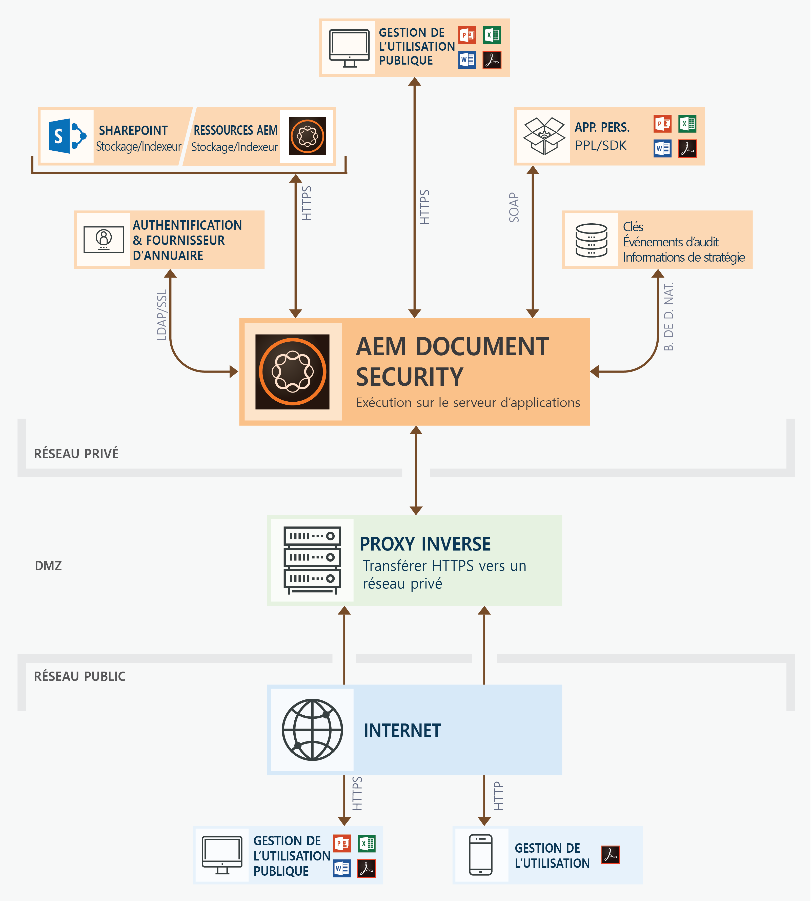
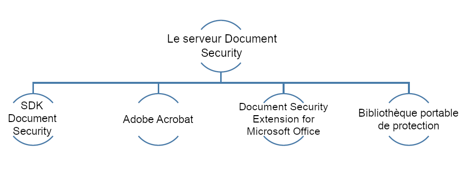

# Offres Document Security{#document-security-offerings}

La sécurité documentaire d’Adobe Experience Manager Forms garantit que seuls les utilisateurs autorisés peuvent utiliser vos documents. Document Security vous permet de distribuer en toute sécurité toute information enregistrée sous un format pris en charge. Les formats de fichiers pris en charge sont Adobe PDF (Portable Document Format), Microsoft Word, Excel et PowerPoint.

Vous pouvez protéger les documents à l’aide de stratégies. Les paramètres de confidentialité que vous spécifiez dans une stratégie déterminent la mesure dans laquelle un destinataire peut utiliser un document auquel vous appliquez cette stratégie. Par exemple, vous pouvez spécifier si les destinataires sont autorisés à imprimer ou copier du texte, effectuer des modifications ou ajouter des signatures et des commentaires dans des documents protégés.

Les stratégies sont stockées dans Document Security ; vous appliquez les stratégies aux documents par le biais de votre application cliente. Lorsque vous appliquez une stratégie à un document, les paramètres de sécurité spécifiés dans la stratégie protègent les informations que le document contient. Vous pouvez distribuer le document protégé par une stratégie, aux destinataires autorisés par la stratégie.

Le diagramme suivant illustre l’architecture standard pour AEM Forms Document Security :

## Clients Document Security {#document-security-clients}

Document Security fournit divers clients pour protéger des documents, afficher et modifier les documents protégés et des indexeurs pour activer la recherche de texte intégral sur les documents protégés. Vous pouvez sélectionner un client en fonction de vos besoins et des capacités du client.

Le serveur Document Security est le composant central par l’intermédiaire duquel Document Security effectue des transactions telles que l’authentification des utilisateurs, la gestion en temps réel des stratégies et l’application de la confidentialité. Le serveur joue également le rôle de référentiel central pour les stratégies, les enregistrements de contrôle et d’autres informations associées.

Le serveur Document Security fournit une interface Web (page Web) pour créer des stratégies, gérer des documents protégés par une stratégie et contrôler les événements associés aux documents protégés par une stratégie. Les administrateurs peuvent également configurer des options globales, telles que l’authentification des utilisateurs, le contrôle et l’envoi de messages aux utilisateurs invités et la gestion des comptes des utilisateurs invités.

Le serveur est inclus dans l’offre de module complémentaire de Document Security des AEM Forms. Vous pouvez contacter [l’équipe de ventes](https://www.adobe.com/products/request-consultation/marketing-cloud.html?s_osc=70114000002JNwKAAW&amp;s_iid=70114000002JHs3AAG) d’AEM Forms pour acheter le module complémentaire Document Security.

### Protection des documents {#protect-documents}

Document Security d’AEM Forms fournit divers outils qui permettent d’appliquer des stratégies de sécurité. Vous pouvez sélectionner un outil en fonction de vos besoins et de vos spécifications.

Vous pouvez utiliser SDK Document Security, Adobe Acrobat, Document Security Extension for Microsoft Office ou la bibliothèque portable de protection pour appliquer et suivre les stratégies de sécurité :

* **SDK Document Security :** SDK est un client riche en fonctionnalités. Vous pouvez utiliser SDK Document Security pour accéder aux fonctionnalités du serveur Document server, ouvrir des documents protégés par une stratégie et développer des extensions personnalisées, des modules externes ou des applications. Par exemple, vous pouvez développer des extensions pour protéger les formats de fichier personnalisé ou intégrer SDK avec des solutions de prévention de perte des données (DLP). Les extensions, applications et modules externes développés en utilisant le SDK Document Security envoient des documents à un serveur désigné d’AEM Forms et les stratégies sont à nouveau appliquées sur le serveur. Notez également que le SDK client Document Security AEM Forms (CSDK) ne peut pas annuler la protection des documents protégés à l’aide de la bibliothèque de protection portable (PPL) et inversement.

    Le SDK Document Security est disponible pour Java et C++. Le SDK Java est inclus dans l’offre AEM Forms Document Security et il est installé sur le déploiement d’AEM forms on JEE. Vous pouvez contacter [l’équipe d’assistance AEM](https://helpx.adobe.com/fr/marketing-cloud/contact-support.html) pour obtenir le SDK C++. Le SDK C++ peut être compilé avec Microsoft Visual Studio 2013. Vous pouvez consulter le site de [documentation d’API de Document Security](https://help.adobe.com/en_US/livecycle/11.0/Services/WS92d06802c76abadb76c48dfe12dbeb3e281-7ff0.2.html) pour apprendre à utiliser les fonctions du SDK.

* **Adobe Acrobat :** Vous pouvez utiliser Adobe Acrobat pour appliquer la stratégie de sécurité à des documents PDF créés à l’aide d’applications de bureau courantes, telles que Microsoft Office, des navigateurs Web ou toute application prenant en charge l’impression au format PDF.

   Vous pouvez acheter et télécharger Adobe Acrobat sur le [site Web d’Adobe](https://acrobat.adobe.com/fr/fr/free-trial-download.html). L’article Adobe Acrobat concernant la [configuration des stratégies de sécurité pour les fichiers PDF](https://helpx.adobe.com/fr/acrobat/using/setting-security-policies-pdfs.html) contient des informations détaillées sur la création et l’application de stratégies dans Adobe Acrobat.

* **Document Security Extension for Microsoft Office** : vous pouvez utiliser Document Security Extension for Microsoft Office pour appliquer des stratégies prédéfinies à vos fichiers Microsoft Office au sein même des programmes Microsoft Office. L’extension garantit que seules les personnes autorisées peuvent utiliser les fichiers Microsoft Word, Excel et PowerPoint protégés par une stratégie. Seuls les utilisateurs autorisés qui possèdent le module externe peuvent utiliser les fichiers protégés par une stratégie.

   L’extension Document Security est disponible sous forme de module externe Microsoft Office. Vous pouvez contacter [AEM équipe d’assistance](https://helpx.adobe.com/ca/marketing-cloud/contact-support.html) pour obtenir l’extension. Ultérieurement, vous pouvez consulter [Document Security Extension for Microsoft Office](https://helpx.adobe.com/aem-forms/aem-document-security/download-installer.html) pour découvrir comment installer, configurer et utiliser l’extension.

* **Bibliothèque portable de protection :** La bibliothèque portable de protection (PPL) protège un document localement sans l’envoyer vers le serveur AEM Forms. Seules les informations d’identification de sécurité et les détails de la stratégie transitent sur le réseau. PPL vous permet également de limiter l’accès à la récupération des stratégies aux seuls utilisateurs connectés. Vous pouvez récupérer des stratégies avec le contexte de l’utilisateur connecté à l’utilisateur AEM.

   Outre ce qui précède, la bibliothèque portable de protection dispose de toutes les fonctionnalités du SDK Document Security. Vous pouvez utiliser SDK Document Security pour accéder aux fonctionnalités du serveur Document server, ouvrir des documents protégés par une stratégie et développer des extensions personnalisées, des modules externes ou des applications. Notez également que la bibliothèque de protection portable (PPL) ne peut pas annuler la protection du SDK client Document Security AEM Forms (CSDK) et inversement.

   La bibliothèque portable de protection est disponible pour les langues de Java et C++ dans les versions 32 bits et 64 bits. Elle est également disponible en tant que bundle OSGi pour AEM Forms on OSGi. Le fichier PPL C++ peut être compilé avec Microsoft Visual Studio 2013. Si vous possédez un module complémentaire Document Security AEM Forms sous licence, vous pouvez contacter l’équipe d’assistance de [Document Security AEM Forms](https://helpx.adobe.com/marketing-cloud/contact-support.html) pour accéder à la bibliothèque portable de protection. Ultérieurement, vous pouvez utiliser l’aide de la bibliothèque portable de protection (fournie avec la bibliothèque) pour installer et utiliser la bibliothèque portable de protection.

### Affichage ou modification des documents protégés  {#view-or-edit-protected-documents}

* Pour les **documents PDF**, vous pouvez utiliser Adobe Acrobat DC, Acrobat Reader et Acrobat Reader Mobile pour afficher les documents PDF protégés. Acrobat Reader est souvent déjà installé sur le périphérique de la plupart des utilisateurs, qui n’ont donc pas besoin d’obtenir ou d’apprendre un nouveau logiciel pour afficher les documents protégés. Vous pouvez également télécharger Acrobat Reader à partir du [site Web de téléchargement d’Acrobat Reader](https://get.adobe.com/reader/).

* Pour les **documents Microsoft Office**, vous devez disposer de Microsoft Office et de l’extension Document Security for Microsoft Office AEM Forms. L’extension Document Security est disponible sous forme de module externe Microsoft Office. Vous pouvez télécharger l’extension depuis le site Web d’Adobe.

### Indexation des documents protégés  {#index-protected-documents}

Les moteurs de recherche de texte intégral de Microsoft Windows (serveur SharePoint Index) et Adobe Experience Manager (AEM) peuvent effectuer une recherche de texte intégral dans les formats de document courants tels que les fichiers texte brut, les documents Microsoft Office et les fichiers PDF. Vous pouvez utiliser des indexeurs Document Security pour permettre aux moteurs de recherche de texte intégral de rechercher les documents PDF protégés :

* **Indexeur iFilter :** Vous pouvez utiliser l’indexeur iFilter pour indexer des documents PDF protégés et permettre aux moteurs de recherche de texte intégral de Microsoft Windows (service d’indexation de bureau et serveur SharePoint Index) de rechercher les documents PDF protégés. Pour plus d’informations, reportez-vous à [AEM SharePoint IFilter pour documents protégés](assets/sharepoint-ifilter-doc-security.pdf).

* **Indexeur de Document Security AEM Forms :** Vous pouvez utiliser l’indexeur de Document Security AEM Forms pour indexer des documents PDF protégés et permettre à Adobe Experience Manager de rechercher les documents PDF protégés. Les indexeurs font partie de l’offre AEM Forms Document Security. Ils sont inclus dans les programmes d’installation AEM Forms sur JEE.
