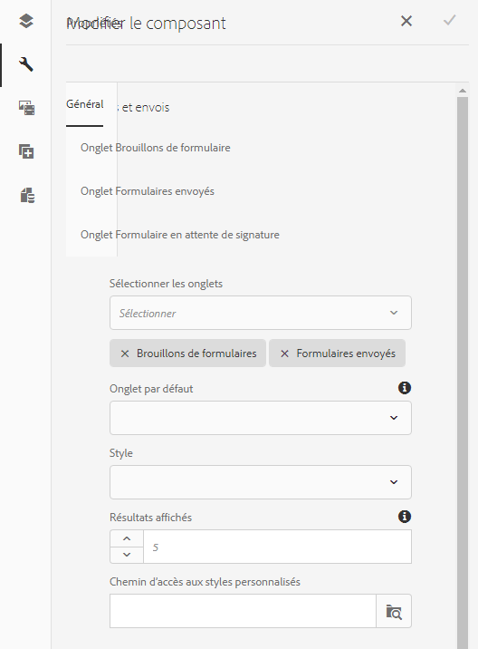

# Composant Drafts &amp; Submissions{#drafts-and-submissions-component}

Le composant Drafts &amp; Submissions dresse la liste de tous les formulaires qui sont à l’état de brouillon et des formulaires déjà envoyés. Le composant dispose de sections distinctes (onglets) pour les brouillons et les formulaires envoyés. Les utilisateurs peuvent afficher leurs brouillons et leurs formulaires envoyés uniquement.

## Configuration du composant {#configuring-the-component}

Le composant Drafts &amp; Submissions comporte deux onglets : Brouillons et envois.

Pour permettre l’envoi d’un formulaire adaptatif dans l’onglet des envois, définissez **Action d’envoi** sur **[Action d’envoi du portail Forms](../../forms/using/configuring-submit-actions.md). Vous pouvez également activer l’option d’envoi du portail Forms.** Lorsqu’un utilisateur envoie le formulaire, ce formulaire est ajouté à l’onglet des envois.

La fonctionnalité de brouillons est activée immédiatement. Lorsqu’un utilisateur clique sur **Enregistrer** sur un formulaire adaptatif, le formulaire est ajouté à l’onglet des brouillons.

Effectuez les étapes suivantes pour ajouter et configurer le composant Drafts &amp; Submissions :

1. Faites glisser le composant **Brouillons et envois** sous la catégorie Document Services dans le navigateur de composants sur votre page.
1. Appuyez sur le composant, puis sur  pour ouvrir la boîte de dialogue Modifier du composant.

   

1. Dans la boîte de dialogue Modifier, spécifiez les détails suivants et appuyez sur **Terminé** pour enregistrer les paramètres.

<table>
 <tbody>
  <tr>
   <th>Tabulation</th>
   <th>Configuration</th>
   <th>Description</th>
  </tr>
  <tr>
   <td>Général</td>
   <td>Résultat total</td>
   <td>Spécifie le nombre maximal de résultats à afficher. Si le nombre de résultats augmente la limite de résultat total, un lien <strong>Plus</strong> apparaît au bas du composant. Cliquez sur <strong>Plus </strong>pour afficher tous les formulaires. </td>
  </tr>
  <tr>
   <td> </td>
   <td>Type de style</td>
   <td>Indique le style du composant. Vous pouvez spécifier <strong>Aucun style</strong>, <strong>Style par défaut</strong> ou <strong>Style personnalisé</strong> pour répertorier les formulaires. Pour l’option Style personnalisé, vous pouvez spécifier le chemin du fichier CSS personnalisé dans le champ <strong>Chemin d’accès au style personnalisé</strong><strong>.</strong></td>
  </tr>
  <tr>
   <td> </td>
   <td>Chemin d’accès au style personnalisé</td>
   <td>Si vous sélectionnez l’option <strong>Style personnalisé</strong> dans le champ <strong>Type de style</strong>, utilisez le champ <strong>Chemin d’accès au style personnalisé</strong> pour spécifier le chemin du fichier CSS personnalisé. </td>
  </tr>
  <tr>
   <td> </td>
   <td>Options d’affichage :</td>
   <td>
Spécifie les onglets à afficher. Vous pouvez choisir d’afficher des brouillons de formulaires, des formulaires envoyés, ou les deux. 
 
<strong>Remarque </strong>:<em> Pour les <strong>Options d’affichage</strong>, si vous sélectionnez une option autre que <strong>Les deux</strong>, l’option du champ <strong>Tabulation par défaut</strong> n’est pas utilisée.</em>
 </td>
  </tr>
  <tr>
   <td> </td>
   <td>Tabulation par défaut</td>
   <td>Spécifie l’onglet à afficher au chargement de la page du portail de formulaires. Vous pouvez choisir entre <strong>l’onglet Brouillons de formulaires</strong> et <strong> l’onglet Formulaires envoyés</strong>.</td>
  </tr>
  <tr>
   <td>Configuration de l’onglet Brouillons de formulaires</td>
   <td>Titre personnalisé</td>
   <td>Spécifie le titre de l’onglet <strong>Brouillons de formulaires</strong>. La valeur par défaut est <strong>Brouillons de formulaires.</strong></td>
  </tr>
  <tr>
   <td> </td>
   <td>Modèle de mise en page</td>
   <td>Spécifie la mise en page à utiliser pour la liste Brouillons de formulaires.</td>
  </tr>
  <tr>
   <td>Configuration de l’onglet Formulaires envoyés</td>
   <td>Titre personnalisé </td>
   <td>Spécifie le titre de l’onglet <strong>Formulaires envoyés</strong>. La valeur par défaut est <strong>Formulaires envoyées.</strong></td>
  </tr>
  <tr>
   <td> </td>
   <td>Modèle de mise en page</td>
   <td>Spécifie l’affichage à utiliser pour la liste Formulaires envoyés.<strong></strong> </td>
  </tr>
 </tbody>
</table>

## Personnalisation du stockage {#customizing-the-storage}

Lorsque vous utilisez l’action d’envoi Forms Portal ou activez les données de stockage dans l’option de portail de formulaires dans un formulaire adaptatif, les données du formulaire sont stockées dans le référentiel AEM. Dans un environnement de production, il est recommandé de ne pas stocker des données de formulaire de brouillon ou envoyées dans le référentiel AEM. Au contraire, vous devez intégrer le composant de brouillons et d’envoi à un stockage sécurisé comme la base de données d’entreprise pour stocker des brouillons et des données de formulaires envoyés.

Le portail Forms vous permet de stocker des données dans un référentiel AEM local, un référentiel AEM distant ou dans une base de données. AEM Forms vous permet de personnaliser l’implémentation du stockage des données utilisateur pour les brouillons et les envois. Vous pouvez remplacer les méthodes par défaut pour spécifier la manière dont les données de brouillon et d’envoi sont stockées dans un espace de stockage de votre choix. Vous pouvez, par exemple, stocker les données dans un entrepôt de données implémenté au sein de votre entreprise.

Forms Portal fournit des services prêts à l’emploi (API) pour stocker des données sur le référentiel crx-repository des instances de publication AEM Forms locales et distantes. Vous pouvez remplacer les implémentations par défaut, décrites dans [Configuration des services de stockage pour les brouillons et les envois](/help/forms/using/configuring-draft-submission-storage.md) , par des implémentations personnalisées pour remplacer la fonctionnalité par défaut. Pour plus d’informations sur les méthodes requises dans une mise en oeuvre personnalisée pour stocker du contenu à un emplacement sécurisé, voir [Personnalisation des services de données Drafts and Submission](/help/forms/using/custom-draft-submission-data-services.md) et [Stockage personnalisé pour le composant Drafts and Submissions.](/help/forms/using/adding-custom-storage-provider-forms.md)

La documentation AEM Forms fournit un [exemple pour l’intégration du composant brouillons et envois à la base de données](integrate-draft-submission-database.md). Vous pouvez utiliser l’exemple de mise en oeuvre pour développer votre propre mise en oeuvre personnalisée.

## Articles connexes

* [Activation des composants de Forms Portal](/help/forms/using/enabling-forms-portal-components.md)
* [Page du portail de formulaires](/help/forms/using/creating-form-portal-page.md)
* [Affichage de la liste des formulaires sur une page Web à l’aide d’API](/help/forms/using/listing-forms-webpage-using-apis.md)
* [Utiliser le composant Drafts &amp; Submissions](/help/forms/using/draft-submission-component.md)
* [Personnalisation du stockage des brouillons et des formulaires envoyés](/help/forms/using/draft-submission-component.md)
* [Exemple d’intégration d’un composant brouillons &amp; envois à la base de données](/help/forms/using/integrate-draft-submission-database.md)
* [Personnalisation de modèles pour les composants Forms Portal](/help/forms/using/customizing-templates-forms-portal-components.md)
* [Présentation de la publication de formulaires sur un portail](/help/forms/using/introduction-publishing-forms.md)
