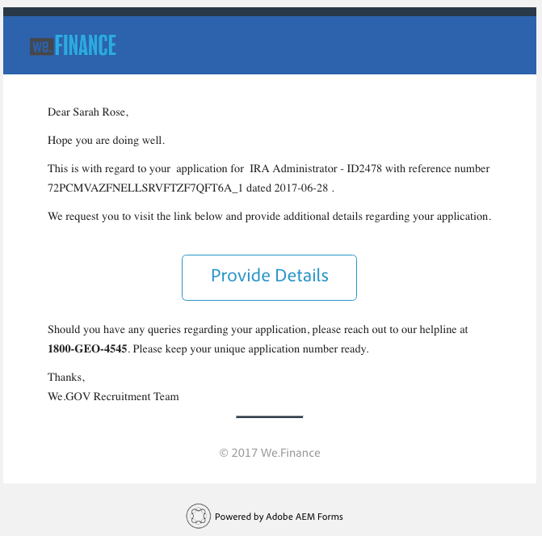

# Présentation du site de référence de recrutement des employé(e)s {#employee-recruitment-reference-site-walkthrough}

## Présentation {#overview}

We.Finance est une organisation qui permet aux candidats et candidates de postuler pour un emploi via le portail du site de référence. L’entreprise utilise également le portail pour gérer la planification et l’affichage des entretiens des candidats, et la communication interne. Le site gère les éléments suivants :

* Les candidats et candidates qui recherchent des emplois et postulent à des postes.
* Sélection et présélection des candidats et candidates
* Processus d’entretien
* Informations sur les groupes de candidats et candidates
* Vérification de la formation du candidat ou de la candidate
* Proposition d’offres aux candidats et candidates sélectionnés

>[!NOTE]
>
>Des cas d’utilisation de recrutement d’employés sont disponibles sur les sites de référence We.Finance et We.Gov. Les exemples, images et descriptions utilisés dans les présentations utilisent le site de référence We.Finance. Cependant, vous pouvez également exécuter ces cas d’utilisation et examiner les artefacts via We.Gov. Pour ce faire, remplacez **we-finance** par **we-gov** dans les URL mentionnées.

### Modèles de workflow impliqués {#workflow-models-involved}

Le cas d’utilisation du recrutement des employés implique deux workflows :

* Avant l’entretien : processus de recrutement des employés We Finance
* Avant l’entretien : processus après l’entretien de recrutement des employés We Finance

Ces entretiens sont créés dans AEM et sont disponibles à l’adresse :

`https://[authorHost]:[authorPort]/libs/cq/workflow/admin/console/content/models.html/etc/workflow/models/`

#### Workflow de recrutement des employés We Finance {#we-finance-employee-recruiting-workflow}

Voici le modèle du workflow de recrutement des employés We Finance suivi dans ce document.

#### Workflow de post-entretien de recrutement des employés We Finance {#we-finance-employee-recruiting-post-interview-workflow}

Voici le modèle du workflow de recrutement post-entretien des employés We Finance suivi dans ce document.

### Personnes {#personas}

Le scénario implique les personnages suivants :

* Sarah Rose, la candidate qui postule pour un emploi dans l’organisation
* John Jacobs, le recruteur
* Gloria Rios, la responsable des recrutements
* John Doe, le responsable des ressources humaines

## Sarah postule pour un emploi {#sarah-applies-for-a-job}

Sarah Rose recherche un poste dans l’entreprise. Elle se rend sur le portail web de l’entreprise et consulte les offres d’emploi répertoriées sur la page Carrières. Elle trouve une liste de postes qui lui correspondent et dépose une candidature.

Page d’accueil de We.Finance

Page Carrières de We.Finance

Sarah clique sur Postuler à une offre d’emploi. Le formulaire de candidature s’ouvre. Elle renseigne tous les détails de la candidature et l’envoie.

### Fonctionnement {#how-it-works}

La page d’accueil et la page Carrières de We.Finance sont des pages d’AEM Sites. La page Carrières comprend un formulaire adaptatif, qui utilise un panneau répétable pour récupérer les offres d’emploi à l’aide d’un service et les répertorier sur la page. Vous pouvez consulter le formulaire adaptatif à l’adresse `https://[authorHost]:[authorPort]/editor.html/content/forms/af/we-finance/employee/recruitment/jobs.html`.

### Démonstration {#see-it-yourself}

Accédez à `https://[publishHost]:[publishPort]/content/we-finance/global/en.html` et cliquez sur **[!UICONTROL Carrière]**. Cliquez sur **[!UICONTROL Rechercher]** pour renseigner la liste professionnelle puis sur **[!UICONTROL Postuler]** pour un emploi. Renseignez les détails du formulaire et envoyez la demande.

Assurez-vous de spécifier un ID d’e-mail valide dans la demande, car toute communication par le biais de cette procédure pas à pas est envoyée à l’ID d’e-mail spécifié.

## John Jacobs présélectionne le profil de Sarah Rose pour la sélection de la responsable des recrutements {#john-jacobs-shortlists-sarah-rose-s-profile-for-the-hiring-manager-s-screening}

L’entreprise reçoit la candidature envoyée par Sarah. John Jacobs, un recruteur, se voit attribuer la tâche de consultation du profil de Sarah. John consulte la candidature dans sa boîte de réception AEM, trouve que le profil correspond aux besoins du poste et clique sur Présélectionner. Le profil de Sarah est envoyé à Gloria Rios, la responsable des recrutements, pour approbation.

Boîte de réception AEM de John

John Jacobs présélectionne le profil de Sarah Rose pour la sélection de la responsable des recrutements

**Fonctionnement**

L’action d’envoi dans le formulaire de candidature déclenche un workflow qui crée une tâche de sélection de demande dans la boîte de réception de John Jacob. Lorsque John examine et présélectionne la demande, le workflow crée une tâche dans la boîte de réception de la responsable des recrutements, Gloria.

### Démonstration {#see-it-yourself-1}

Accédez à `https://[publishHost]:[publishPort]/content/we-finance/global/en/login.html?resource=/aem/inbox.html`et connectez-vous en utilisant jjacobs/password comme nom d’utilisateur/mot de passe pour John Jacobs. Ouvrez la tâche de consultation du profil de candidat(e) et sélectionnez le ou la candidat(e).

## Gloria consulte la demande et approuve la candidate pour un entretien {#gloria-reviews-the-application-and-approves-the-applicant-for-an-interview}

Gloria, la responsable des recrutements, reçoit le profil présélectionné comme tâche dans sa boîte de réception AEM. Elle la consulte et approuve la candidate Sarah Rose pour un entretien.

Boîte de réception AEM de Gloria

Gloria approuve Sarah Rose pour un entretien

**Fonctionnement**

Lorsque Gloria approuve la candidate pour un entretien, le workflow crée une tâche dans la boîte de réception AEM de John Doe, qui est un recruteur de We.Finance.

### Démonstration {#see-it-yourself-2}

Accédez à `https://[publishHost]:[publishPort]/content/we-finance/global/en/login.html?resource=/aem/inbox.html` et connectez-vous en utilisant jjacobs/password comme nom d’utilisateur/mot de passe pour John Jacobs. Ouvrez la tâche de consultation du profil du candidat et sélectionnez le candidat.

Accédez à sur `https://[publishHost]:[publishPort]/content/we-finance/global/en/login.html?resource=/aem/inbox.html` et connectez-vous en utilisant grios/password comme nom d’utilisateur/mot de passe pour Gloria Rios. Ouvrez la tâche de consultation du profil de la candidate et cliquez sur Planifier l’entretien.

## John Doe planifie un entretien {#john-doe-schedules-an-interview}

John Doe reçoit la tâche de planification d’un entretien dans sa boîte de réception. John Doe sélectionne et ouvre la tâche et définit la date et l’heure de l’entretien, le lieu et la personne des ressources humaines responsable de l’entretien : John Jacob. John Doe clique sur Envoyer un e-mail d’invitation. Un e-mail est envoyé à Sarah et une tâche est affectée à Gloria, la responsable des recrutements, pour l’entretien avec Sarah.

Boîte de réception AEM de John Doe

John Doe planifie l’entretien et envoie les détails à Sarah Rose

## Sarah Rose reçoit l’e-mail avec la planification de l’entretien {#sarah-rose-receives-the-email-with-interview-schedule}

Sarah Rose reçoit l’e-mail avec la planification de l’entretien, le lieu et d’autres détails. Elle clique sur Accepter pour signifier qu’elle est d’accord avec l’horaire et le lieu de l’entretien. Guidée par ces informations précises, Sarah se rend à l’entretien.

Sarah Rose reçoit la planification de l’entretien

## Après les entretiens, le responsable des recrutements présélectionne Sarah Rose {#after-the-interviews-the-hiring-manager-shortlists-sarah-rose}

Une fois que Sarah Rose a passé et terminé les entretiens, Gloria Rios, la responsable des recrutements, ouvre la tâche de sélection de candidat depuis sa boîte de réception et clique sur Sélectionner. La décision de Gloria Rios est transmise au responsable des ressources humaines, John Doe, pour la suite du traitement.

Boîte de réception AEM de Gloria

Gloria Rios choisit Sarah Rose après les entretiens

## John Doe demande plus d’informations {#john-doe-requests-more-information}

Avant qu’elle puisse rejoindre l’entreprise, les informations données par Sarah doivent être vérifiées. John Doe ouvre et consulte les informations du demandeur sélectionné et découvre que certaines informations relatives à ses études et son parcours professionnel ne sont pour le moment pas renseignées. John Doe clique sur Besoin de plus d’informations

 

John Doe demande davantage d’informations à Sarah Rose sur ses études et son expérience professionnelle

## Sarah Rose reçoit un e-mail lui demandant des informations supplémentaires {#sarah-rose-receives-an-email-requesting-further-information}

Elle reçoit un e-mail l’informant que des informations supplémentaires sont requises pour que sa candidature puisse être traitée. Cet e-mail comprend un lien vers le formulaire qui permet de saisir les informations requises.

Sarah Rose reçoit un e-mail l’informant que des informations supplémentaires sont requises pour que sa candidature puisse être traitée

Sarah clique sur le lien Fournir des détails dans l’e-mail. Un formulaire s’affiche. Sarah renseigne les informations requises relatives à ses études et son parcours professionnel comme demandé par John Doe et clique sur Envoyer.

Sarah ouvre le formulaire d’informations supplémentaires en cliquant sur le lien dans le courrier électronique

Sarah saisit des informations supplémentaires, comme l’a demandé John Doe, et clique sur Envoyer

## John Doe examine le profil de la candidate sélectionnée pour vérifier les informations supplémentaires fournies {#john-doe-reviews-the-selected-candidate-profile-for-the-additional-information-provided}

John Doe sélectionne la demande de consultation de la candidate et l’ouvre. John Doe estime que Sarah a renseigné toutes les informations nécessaires. Après avoir examiné la demande, John Doe clique sur Approuver. Sur approbation de John Doe, la demande de vérification du parcours de Sarah Rose est transférée à John Jacobs.

Boîte de réception AEM de John Doe

John Doe examine les informations supplémentaires fournies par Sarah et les approuve

## John Jacobs reçoit une demande de vérification de parcours {#john-jacobs-receives-a-background-check-request}

John Jacobs voit la demande de vérification de parcours dans la boîte de réception. John Jacobs ouvre la tâche et examine les informations fournies par Sarah Rose. Après avoir vérifié le parcours, John Jacobs clique sur Avancer pour indiquer que la vérification du parcours est concluante.

Boîte de réception AEM de John Jacobs

Après avoir vérifié le parcours, John Jacobs clique sur Avancer

## John Doe envoie la lettre de recrutement à Sarah Rose. {#john-doe-sends-out-the-joining-letter-to-sarah-rose}

John Doe reçoit une demande dans sa boîte de réception AEM pour l’envoi de la lettre de recrutement. John ouvre la demande et consulte les détails. John Doe joint le PDF de la lettre de recrutement, puis clique sur Joindre et envoyer la lettre de recrutement.

Boîte de réception AEM de John Doe

John Doe envoie la lettre de recrutement pour signature

## Sarah Rose reçoit et signe la lettre de recrutement {#sarah-rose-receives-and-signs-the-joining-letter}

Sarah Rose reçoit la lettre de recrutement pour signature. Sarah clique sur Cliquez ici pour consulter et signer la lettre de recrutement. Le fichier PDF de lettre de recrutement s’ouvre avec un champ pour signer le document.

Sarah Rose reçoit la lettre de recrutement pour signature.

Sarah peut choisir entre la saisie, la fonction d’écriture à la main, l’insertion d’une image de signature ou l’utilisation de l’écran tactile de son appareil mobile pour dessiner sa signature. Sarah saisit son nom, clique sur Cliquer pour signer et télécharge un exemplaire signé de la lettre de recrutement.

Sarah saisit son nom pour signer la lettre de recrutement

Sarah clique sur Cliquer pour signer pour terminer la procédure de signature de la lettre de recrutement
