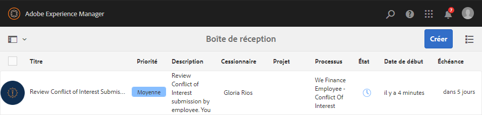
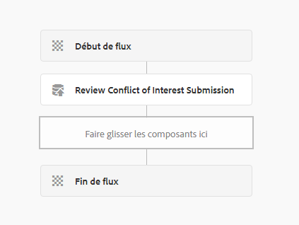
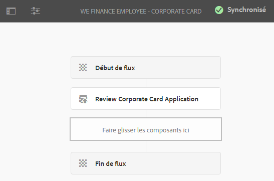
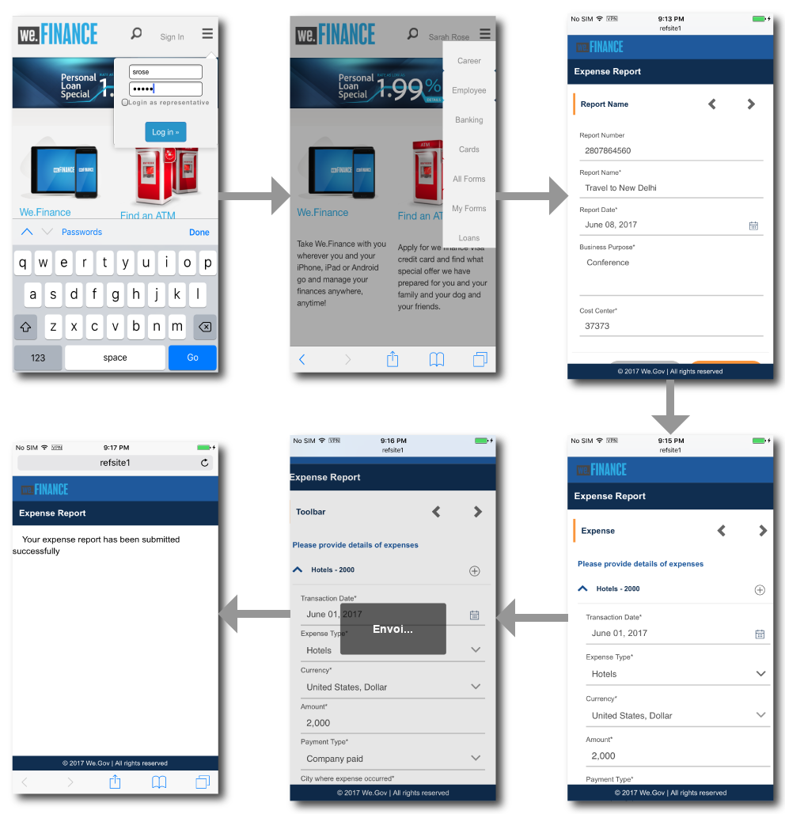
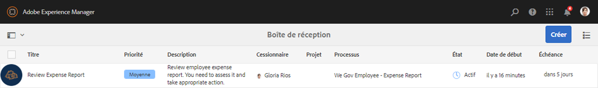
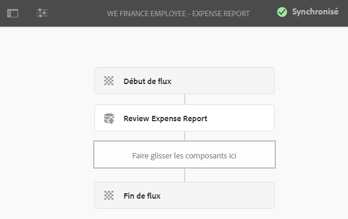
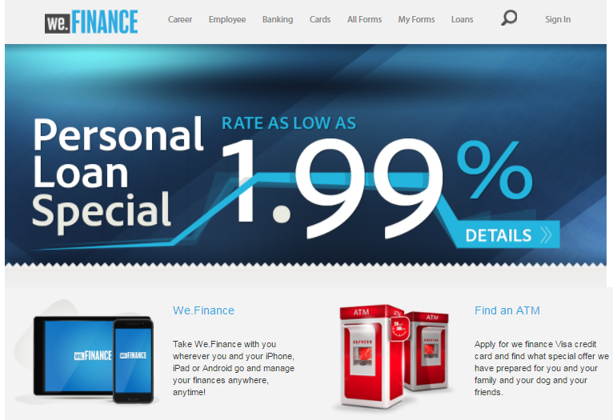
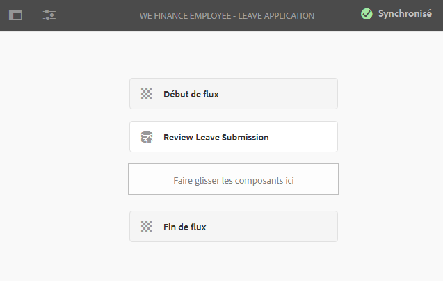

# Libre-service dédié aux employés reference site walkthrough{#employee-self-service-reference-site-walkthrough}

## Condition requise {#prerequisite}

Installez les sites de référence comme décrit dans [Installation et configuration des sites de référence d’AEM Forms](../../forms/using/setup-reference-sites.md).

## Présentation {#overview}

Les systèmes de libre-service dédié aux employés, généralement hébergés sur l’Intranet de l’entreprise, permettent aux salariés d’accéder à un certain nombre d’informations et de services qu’ils peuvent utiliser depuis leur bureau. Ils permettent et donnent le contrôle complet aux employés pour effectuer des actions telles qu’accéder aux informations sur leur poste, demander des jours de congés et envoyer des rapports de dépenses. Ils aident également les entreprises à améliorer l’efficacité des processus et à réduire les coûts tout en gardant les employés informés et impliqués.

Le site de référence de libre-service des employés montre comment vous pouvez utiliser AEM Forms pour mettre en place le système de libre-service destiné aux employés dans votre entreprise.

>[!NOTE]
>
>Les exemples, images et descriptions utilisés dans la présentation en libre-service des employés utilisent le site de référence Web.Finance.

## Présentation du questionnaire sur les conflits d’intérêt {#conflict-of-interest-questionnaire-walkthrough}

Les organisations demandent de temps à autre à leurs employés de soumettre un questionnaire sur les conflits d’intérêts afin d’identifier les activités extérieures ou les relations personnelles de leurs employés qui pourraient entrer en conflit avec leur organisation.

Le service de conformité de l’organisation de Sarah a demandé aux employés de soumettre le questionnaire sur les conflits d’intérêts.

### Sarah envoie le questionnaire sur les conflits d’intérêt {#sarah-submits-the-conflict-of-interest-questionnaire}

Sarah se rend sur le portail de son entreprise, se connecte et clique sur Employé pour accéder au tableau de bord des employés. Elle trouve le questionnaire sur les conflits d’intérêt dans le tableau de bord des employés et clique sur **[!UICONTROL Demander]**.

Portail de l’entreprise

Tableau de bord des employés

Sarah navigue dans le formulaire en utilisant le bouton Suivant et lit les sections Introduction et Définition. Elle répond aux questions dans la section dédiée. Enfin, elle signe et envoie le questionnaire.

Le portail de l’entreprise et le questionnaire sont réactifs et compatibles avec les appareils mobiles. Le processus suivant montre comment Sarah navigue dans le questionnaire et l’envoie depuis son appareil mobile.

**Fonctionnement**

Le portail de l’entreprise et le tableau de bord des employés sont des pages de sites AEM. Le tableau de bord répertorie plusieurs options de libre-service, telles que le questionnaire sur les conflits d’intérêt. Le bouton Demander est lié à un formulaire adaptatif.

Le formulaire adaptatif utilise des règles pour masquer ou afficher les informations en fonction de la réponse fournie dans l’onglet Questions. En outre, le formulaire utilise le composant Scribble pour la signature dans l’onglet Déclaration. Consultez le formulaire adaptatif à l’adresse `https://[authorHost]:[authorPort]/editor.html/content/forms/af/we-finance/employee/self-service/conflict-of-interest.html`.

**Démonstration**

Go to `https://[publishHost]:[publishPort]/content/we-finance/global/en/self-service-forms.html` and log in using `srose/srose` as username/password for Sarah. Cliquez sur **[!UICONTROL Employé]** pour accéder au tableau de bord, puis sur **[!UICONTROL Demander]** sur le questionnaire sur les conflits d’intérêt. Vérifiez et envoyez le questionnaire.

#### Gloria examine et approuve l’envoi du questionnaire sur les conflits d’intérêt {#gloria-reviews-and-approves-the-conflict-of-interest-questionnaire-submission}

Le questionnaire sur les conflits d’intérêt envoyé par Sarah est attribué à Gloria Rios pour examen. Gloria travaille en tant qu’agent de conformité dans l’entreprise. Gloria se connecte à sa boîte de réception AEM et passe en revue les tâches qui lui sont assignées. Elle approuve le questionnaire envoyé par Sarah et termine la tâche.

La boîte de réception de Gloria

Ouvrir la tâche

**Fonctionnement**

L’action d’envoi dans le questionnaire sur les conflits d’intérêt déclenche un processus qui crée une tâche dans la boîte de réception de Gloria pour approbation. Consultez le processus des formulaires à l’adresse `https://[authorHost]:[authorPort]/editor.html/conf/global/settings/workflow/models/we-finance/employee/self-service/we-finance-employee-conflict-of-interest.html`

**Démonstration**

Go to `https://[publishHost]:[publishPort]/content/we-finance/global/en/login.html?resource=/aem/inbox.html` and log in using `grios/password` as username/password for Gloria Rios. Ouvrez la tâche créée pour le questionnaire sur les conflits d’intérêt et approuvez-la.

## Présentation de la demande de la carte d’entreprise {#corporate-card-application-walkthrough}

Sarah voyage beaucoup pour les affaires et elle a besoin d’une carte de crédit d’entreprise pour payer ses factures lors de ses déplacements. Elle demande une carte d’entreprise via le portail des employés de son entreprise.

### Sarah envoie la demande Carte d’entreprise {#sarah-submits-the-corporate-card-application}

Sarah se rend sur le portail de son entreprise, se connecte et clique sur **[!UICONTROL Employé]** pour accéder au tableau de bord des employés. Elle trouve la demande Carte d’entreprise dans le tableau de bord des employés et clique sur **[!UICONTROL Demander]**.

Portail de l’entreprise

Tableau de bord des employés

Elle clique sur **[!UICONTROL Demander]** dans la demande Carte d’entreprise. Une demande d’une page s’ouvre. Elle renseigne toutes les informations et clique sur **[!UICONTROL Demander]** pour envoyer la demande.

**Fonctionnement**

Le portail de l’entreprise et le tableau de bord des employés sont des pages de sites AEM. Le tableau de bord répertorie plusieurs options de libre-service, telles que la demande de carte d’entreprise. Le bouton Demander sur la demande est lié à un formulaire adaptatif.

Le formulaire adaptatif pour la demande de carte d’entreprise est un formulaire adaptatif d’une page simple et réactif. Il utilise des composants basiques de formulaire adaptatif tels que le texte, le téléphone, la zone numérique et la procédure pas à pas numérique. Consultez le formulaire adaptatif à l’adresse suivante :\
`https://[authorHost]:[authorPort]/editor.html/content/forms/af/we-finance/employee/self-service/corporate-card.html`.

**Démonstration**

Go to `https://[publishHost]:[publishPort]/content/we-finance/global/en/self-service-forms.html` and log in using `srose/srose` as username/password for Sarah. Cliquez sur **[!UICONTROL Employé]** pour accéder au tableau de bord, puis sur **[!UICONTROL Demander]** sur la demande de carte d’entreprise. Renseignez les informations et envoyez la demande.

### Gloria examine et approuve la demande de carte d’entreprise {#gloria-reviews-and-approves-the-corporate-card-application}

La demande de carte d’entreprise envoyée par Sarah est attribuée à Gloria Rios pour examen. Gloria se connecte à sa boîte de réception AEM et passe en revue les tâches qui lui sont assignées. Elle approuve la demande envoyée par Sarah et termine la tâche.

La boîte de réception de Gloria

Ouvrir la tâche

**Fonctionnement**

Le processus d’envoi dans la demande de carte d’entreprise déclenche un processus Forms qui crée une tâche dans la boîte de réception de Gloria pour approbation. Consultez le processus des formulaires à l’adresse `https://[authorHost]:[authorPort]/editor.html/conf/global/settings/workflow/models/we-finance/employee/self-service/we-finance-employee-corporate-card.html`

**Démonstration**

Go to `https://[publishHost]:[publishPort]/content/we-finance/global/en/login.html?resource=/aem/inbox.html` and log in using `grios/password` as username/password for Gloria Rios. Ouvrez la tâche créée pour la demande de carte d’entreprise et approuvez-la.

## Présentation de l’envoi du rapport de dépenses {#expense-report-submission-walkthrough}

Sarah doit envoyer des rapports de dépenses pour approbation car ses déplacements professionnels engendrent des frais. L’option self-service dans son entreprise lui permet d’envoyer le rapport de dépenses en ligne.

### Sarah envoie la demande de rapport de dépenses {#sarah-submits-the-expense-report-application}

Sarah se rend sur le portail de son entreprise, se connecte et clique sur **[!UICONTROL Employé]** pour accéder au tableau de bord des employés. Elle trouve la demande Rapport de dépenses dans le tableau de bord des employés et clique sur **[!UICONTROL Demander]**.

Portail de l’entreprise

Tableau de bord des employés

Elle clique sur **[!UICONTROL Demander]** dans la demande Rapport de dépenses. Un formulaire de demande s’ouvre avec deux onglets : Nom du rapport et Détails du rapport. L’icône **+** dans l’onglet Détails du rapport lui permet d’ajouter plus de dépenses dans un rapport.

Le portail de l’entreprise et les demandes sont réactifs et compatibles avec les appareils mobiles. Le processus suivant montre comment Sarah navigue dans le rapport de dépenses et l’envoie depuis son appareil mobile.

**Fonctionnement**

Le portail de l’entreprise et le tableau de bord des employés sont des pages de sites AEM. Le tableau de bord répertorie plusieurs options de libre-service, telles que la demande de rapport de dépenses. Le bouton Demander est lié à un formulaire adaptatif.

Les onglets Nom du rapport et Détails du rapport du formulaire adaptatif sont des composants Panneau. Le panneau Détails du rapport contient le panneau Dépenses. Il s’agit d’un panneau répétable qui permet d’ajouter plusieurs dépenses dans le rapport. Consultez le formulaire adaptatif et ses configurations à l’adresse `https://[authorHost]:[authorPort]/editor.html/content/forms/af/we-finance/employee/expense-report.html`.

**Démonstration**

Go to `https://[publishHost]:[publishPort]/content/we-finance/global/en/self-service-forms.html` and log in using `srose/srose` as username/password for Sarah. Cliquez sur **[!UICONTROL Employé]** pour accéder au tableau de bord, puis sur **[!UICONTROL Demander]** sur la demande de rapport de dépenses. Renseignez les informations et envoyez la demande.

### Gloria examine et approuve le rapport de dépenses {#gloria-reviews-and-approves-the-expense-report}

Le rapport de dépenses envoyé par Sarah est attribué à Gloria Rios pour examen. Gloria se connecte à sa boîte de réception AEM et passe en revue les tâches qui lui sont assignées. Elle approuve la demande envoyée par Sarah et termine la tâche.

La boîte de réception de Gloria

Ouvrir la tâche

**Fonctionnement**

Le processus d’envoi dans la demande de rapport de dépenses déclenche un processus Forms qui crée une tâche dans la boîte de réception de Gloria pour approbation. Consultez le processus des formulaires à l’adresse `https://[authorHost]:[authorPort]/editor.html/conf/global/settings/workflow/models/we-finance/employee/self-service/we-finance-employee-expense-report-workflow.html`

**Démonstration**

Go to `https://[publishHost]:[publishPort]/content/we-finance/global/en/login.html?resource=/aem/inbox.html` and log in using `grios/password` as username/password for Gloria Rios. Ouvrez la tâche créée pour la demande de rapport de dépenses et approuvez-la.

## Présentation de la demande de congés {#leave-application-walkthrough}

Sarah prévoit des vacances en famille le mois prochain et veut demander une semaine de congé.

### Sarah envoie la demande de congés {#sarah-submits-the-leave-application}

Sarah se rend sur le portail de son entreprise, se connecte et clique sur **[!UICONTROL Employé]** pour accéder au tableau de bord des employés. Elle trouve la demande de congés dans le tableau de bord des employés et clique sur **[!UICONTROL Demander]**.

Portail de l’entreprise

Tableau de bord des employés

La demande de congés s’ouvre avec le nom de Sarah et son ID d’employée pré-renseignés dans le formulaire. Elle affiche également son nombre de jours de congé et l’historique. Elle remplit les informations du congé et envoie la demande pour approbation.

Le portail de l’entreprise et les demandes sont réactifs et compatibles avec les appareils mobiles. Le processus suivant montre comment Sarah navigue dans la demande et l’envoie depuis son appareil mobile.

**Fonctionnement**

Le portail de l’entreprise et le tableau de bord des employés sont des pages de sites AEM. Le tableau de bord répertorie plusieurs options de libre-service, telles que la demande de congés. Le bouton Demander est lié à un formulaire adaptatif.

Le formulaire adaptatif de la demande de congés est basé sur le modèle de données de formulaire de congés des employés. Dans la section Solde de congés, le tableau dédié est rempli à l’aide du service du modèle de données de formulaire `getLeavesOf`. Les champs Date de début et Date de fin utilisent des règles pour valider le fait que les valeurs de date sont égales ou ultérieures à la date actuelle. La durée du congé est calculée à l’aide de la fonction `calcBusinessDays`.

Vous pouvez consulter le formulaire adaptatif et le modèle de données de formulaire aux adresses suivantes :

`https://[authorHost]:[authorPort]/editor.html/content/forms/af/we-finance/employee/self-service/leave-application.html`

`https://[authorHost]:[authorPort]/aem/fdm/editor.html/content/dam/formsanddocuments-fdm/db`

**Démonstration**

Go to `https://[publishHost]:[publishPort]/content/we-finance/global/en/self-service-forms.html` and log in using `srose/srose` as username/password for Sarah. Cliquez sur **[!UICONTROL Employé]** pour accéder au tableau de bord, puis sur **[!UICONTROL Demander]** sur la demande de congés. Renseignez les informations et envoyez la demande.

#### Gloria examine et approuve la demande de congés {#gloria-reviews-and-approves-the-leave-application}

La demande de congés envoyée par Sarah est attribuée à Gloria Rios pour examen. Gloria se connecte à sa boîte de réception AEM et passe en revue les tâches qui lui sont assignées. Elle approuve la demande envoyée par Sarah et termine la tâche.

La boîte de réception de Gloria

Ouvrir la tâche

**Fonctionnement**

Le processus d’envoi dans la demande de congés déclenche un processus Forms qui crée une tâche dans la boîte de réception de Gloria pour approbation. Consultez le processus des formulaires à l’adresse `https://[authorHost]:[authorPort]/editor.html/conf/global/settings/workflow/models/we-finance/employee/self-service/we-finance-employee-leave-application.html`

**Démonstration**

Go to `https://[publishHost]:[publishPort]/content/we-finance/global/en/login.html?resource=/aem/inbox.html` and log in using `grios/password` as username/password for Gloria Rios. Ouvrez la tâche créée pour la demande de congés et approuvez-la.
