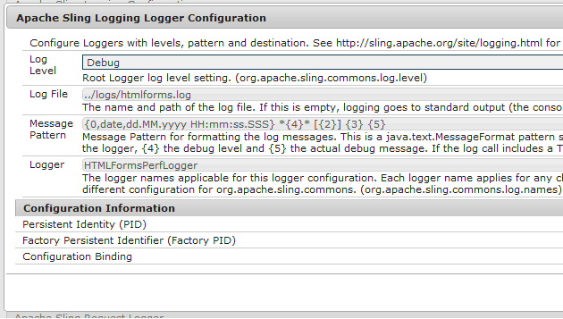

# Activation de la journalisation des formulaires au format HTML5{#enable-logging-for-html-forms}

Vous pouvez configurer l’utilitaire de journalisation pour créer des journaux pour les formulaires au format HTML5. L’utilitaire de journalisation possède plusieurs niveaux, vous pouvez définir le niveau selon vos besoins. Les formulaires HTML5 ont des composants de serveur et de client. Vous pouvez configurer des journaux pour chaque composant.

## Configuration de la journalisation côté serveur {#configuring-server-side-logging}

Effectuez les étapes suivantes pour configurer les journaux côté serveur :

1. Accédez à `https://'[server]:[port]'/system/console/configMgr`. Locate and open the *Apace Sling logging logger configuration* option. Une boîte de dialogue s’affiche:

   

   Option de configuration des journaux de journalisation Apache Sling

1. Remplacez le **Niveau de journal** par **Débogage**.

1. Spécifiez le chemin et le nom du **fichier journal**.

   >[!NOTE]
   >
   >Pour générer des journaux dans le répertoire de formulaires HTML5, ajoutez ../logs/ avant le nom de fichier.

1. Modifiez **Logger** en **HTMLFormsPerfLogger**. Cliquez sur **Save** (Enregistrer).

## Configuration de la journalisation du client {#configuring-client-logging}

Vous pouvez utiliser les méthodes suivantes pour activer la journalisation côté client des formulaires HTML5 :

* A l’aide du paramètre de requête nommé `log`
* A l’aide de CQ Configuration Manager

### Activation de la journalisation à l’aide du paramètre de requête {#enabling-logging-using-request-parameter}

Grâce à cette méthode, vous pouvez générer les journaux d’une requête particulière. Le nom du paramètre de requête est `log. L’URL du journal est la suivante :

`https://<server>:<port>/content/xfaforms/profiles/test.html?contentRoot=<path of the folder containing form xdp>&template=<name of the xdp>&log=<log configuration>.`

La configuration du journal comprend le niveau et la catégorie de journalisation.

#### Destination du journal {#log-destination}

<table>
 <tbody>
  <tr>
   <th><strong>Destination du journal</strong></th>
   <th><strong>Description</strong></th>
  </tr>
  <tr>
   <td>1</td>
   <td>Les journaux sont dirigés vers la <strong>Console</strong> du navigateur</td>
  </tr>
  <tr>
   <td>2</td>
   <td>Les journaux sont collectés dans un objet JavaScript côté client et peuvent être publiés sur le <strong>serveur</strong> </td>
  </tr>
  <tr>
   <td>3</td>
   <td>Les deux options ci-dessus  </td>
  </tr>
 </tbody>
</table>

#### Niveaux de journalisation {#log-levels}

<table>
 <tbody>
  <tr>
   <th>Niveau de journal</th>
   <th>Description</th>
  </tr>
  <tr>
   <td>0</td>
   <td>OFF  </td>
  </tr>
  <tr>
   <td>1</td>
   <td>FATAL  </td>
  </tr>
  <tr>
   <td>2</td>
   <td>ERREUR  </td>
  </tr>
  <tr>
   <td>3</td>
   <td>WARN  </td>
  </tr>
  <tr>
   <td>4</td>
   <td>INFO  </td>
  </tr>
  <tr>
   <td>5</td>
   <td>DEBUG  </td>
  </tr>
  <tr>
   <td>6</td>
   <td>TRACE  </td>
  </tr>
  <tr>
   <td>7</td>
   <td>ALL  </td>
  </tr>
 </tbody>
</table>

#### Catégories de journalisation {#logger-categories}

<table>
 <tbody>
  <tr>
   <th>Catégorie de journal</th>
   <th>Description</th>
  </tr>
  <tr>
   <td>une</td>
   <td>xfa (journaux liés au moteur de script)</td>
  </tr>
  <tr>
   <td>b</td>
   <td>xfaView (journaux liés au moteur de mise en page)  </td>
  </tr>
  <tr>
   <td>c</td>
   <td>xfaPerf (journaux liés aux performances)  </td>
  </tr>
 </tbody>
</table>

#### Configuration de la journalisation {#log-configuration}

Dans l’URL du journal, le paramètre de chaîne de requête de configuration de la journalisation est défini comme suit :

`{destination}-{a level}-{b level}-{c level}`

Par exemple :

<table>
 <tbody>
  <tr>
   <th>Configuration de la journalisation</th>
   <th>Description</th>
  </tr>
  <tr>
   <td>2-a4-b5-c6  </td>
   <td>Destination : serveur  niveau Xfa : INFO  niveau xfaView : DEBUG  niveau xfaPerf : TRACE</td>
  </tr>
 </tbody>
</table>

>[!NOTE]
>
>Le niveau de journalisation par défaut de chaque catégorie de journalisation a (xfa), b (xfaView) et c (xfaPerf) est de 2 (ERROR). En conséquence, pour configurer la journalisation 2-b6, les niveaux de journalisation des différentes catégories sont les suivants :
>a (xfa) : 2 (niveau par défaut ERROR)
>b (xfaView) : 6 (TRACE spécifié par l’utilisateur)
>a (xfaPerf) : 2 (niveau par défaut ERROR)

### Activation de la journalisation à l’aide de Configuration Manager {#enabling-logging-using-configuration-manager}

Si vous utilisez Configuration Manager pour activer la journalisation, des journaux sont générés pour chaque demande de rendu jusqu’à ce que la journalisation soit à nouveau désactivée.

1. Connectez-vous à CQ Configuration Manager à l’adresse `https://'[server]:[port]'/system/console/configMgr` et connectez-vous avec les informations d’identification d’administrateur.
1. Recherchez et cliquez sur **Configurations des formulaires mobiles**.
1. Dans la zone de texte Options de débogage, saisissez les configurations des journaux comme décrit dans la section précédente. Par exemple : **2-a4-b5-c6**

   

   Configuration de formulaires

## Téléchargement des journaux {#uploading-logs}

Si la destination est définie sur 1, tous les messages du journal de script du client sont dirigés vers la console. Si un administrateur a besoin de ces journaux avec les journaux du serveur, définissez le niveau de destination sur 2. At this level, all logs are collected in a JS object on client side and if form is rendered with default Profile then a **Send Logs** button appears to the left of **Highlight Existing Fields** button in toolbar. Lorsque l’utilisateur clique sur le lien, tous les journaux collectés sont publiés sur le serveur et consignés dans le fichier journal des erreurs configuré sur le serveur.

Par défaut, toutes les informations sont ajoutées dans le fichier error.log du répertoire /crx-repository/logs/.

Pour modifier l’emplacement et le nom du fichier journal :

1. Connectez-vous à Configuration Manager en tant qu’administrateur. The default URL of Configuration Manager is `https://'[server]:[port]'/system/console/configMgr`.
1. Cliquez sur **Configuration des journaux de journalisation Sling d’Apache** Une boîte de dialogue s’affiche.

   

1. Remplacez le **Niveau de journal** par Débogage.

1. Specify path and name of the **Log File**.

   >[!NOTE]
   >
   >Pour créer des journaux dans le répertoire où les autres fichiers journaux sont conservés, spécifiez ../logs/&lt;nom_fichier> dans la propriété Fichiers journaux.

1. Change the **Logger** to **HTMLFormsPerfLogger** and click **Save**.
