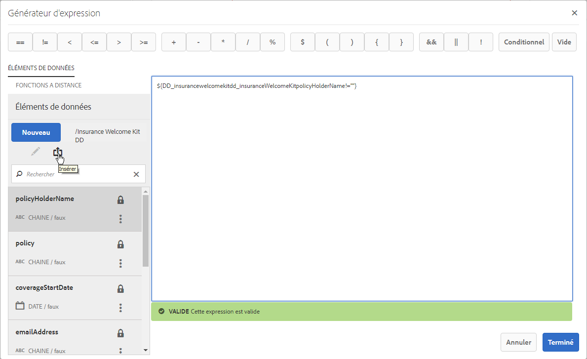
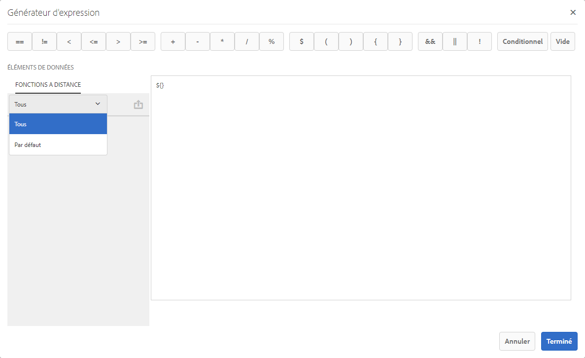

# Fonctions distantes du Générateur d’expression{#remote-functions-in-expression-builder}

Avec le Générateur d’expression, vous pouvez créer des expressions ou des conditions qui effectuent les calculs des valeurs de données fournies par le dictionnaire de données ou par les utilisateurs. Correspondence Management utilise le résultat de l’évaluation de l’expression pour sélectionner des actifs (par exemple, texte, images, listes, conditions) et les insérer dans la correspondance selon les besoins.

## Création d’expressions et de fonctions distantes avec Expression Builder {#creating-expressions-and-remote-functions-with-expression-builder}

Le créateur d’Expressions utilise en interne les bibliothèques EL JSP. L’expression adhère donc à la syntaxe JSPEL. Pour plus d’informations, voir [Exemples d’expressions](#exampleexpressions).



### Opérateurs   {#operators}

Les opérateurs pouvant être utilisées dans les expressions sont disponibles dans la barre supérieure du Générateur d’expression.

### Exemples d’expressions {#exampleexpressions}

Vous trouverez ci-dessous quelques exemples d’EL JSP couramment utilisés que vous pouvez utiliser dans votre solution Correspondence Management :

* Pour ajouter deux nombres : ${number1 + number2}
* Pour concaténer deux chaînes : ${str1} ${str2}
* Pour comparer deux nombres : ${age &lt; 18}

Vous trouverez plus d’informations dans [Spécification de l’EL JSP](https://download.oracle.com/otn-pub/jcp/jsp-2.1-fr-spec-oth-JSpec/jsp-2_1-fr-spec-el.pdf). Le gestionnaire d’expression côté client ne prend pas en charge certaines variables et fonctions de la spécification de l’EL JSP, plus précisément :

* Collection indexes and map keys (using the [] notation) are not supported in variable names for expressions evaluated on the client-side.
* Voici une liste des types de paramètre ou types de retour de fonctions utilisées dans les expressions :

   * java.lang.String
   * java.lang.Character
   * Caractère
   * java.lang.Boolean
   * Booléen
   * java.lang.Integer
   * Int
   * java.util.list
   * java.lang.Short
   * Court
   * java.lang.Byte
   * byte
   * java.lang.Double
   * Double
   * java.lang.Long
   * Long
   * java.lang.Float
   * Flottant
   * java.util.Calendar
   * java.util.Date
   * java.util.List

### Fonction distante {#remote-function}

Les fonctions distantes offrent la possibilité d’utiliser la logique personnalisée dans les expressions. Vous pouvez écrire une logique personnalisée à utiliser dans l’expression comme méthode dans Java et la même fonction peut être utilisée dans les expressions. Les fonctions distantes disponibles sont répertoriées sous l’onglet Fonctions distantes sur le côté gauche du gestionnaire d’expression.



#### Ajout de fonctions distantes personnalisées {#adding-custom-remote-functions}

Vous pouvez créer un regroupement personnalisé pour exporter vos propres fonctions distantes à utiliser dans les expressions. Pour créer un lot personnalisé afin d’exporter vos propres fonctions distantes, effectuez les tâches suivantes. Cet onglet indique comment créer une fonction personnalisée tirant parti de sa chaîne d’entrée.

1. Définissez une interface pour le service OSGi, contenant des méthodes à exporter pour l’utilisation par Expression Manager.
1. Déclarez les méthodes sur l’interface A et annotez-les avec l’annotation @ServiceMethod (com.adobe.exm.expeval.ServiceMethod). Expression Manager ignore les méthodes non annotées. L&#39;annotation ServiceMethod possède les attributs facultatifs suivants, qui peuvent également être spécifiés :

   1. **Enabled** : indique si la méthode est activée. Expression Manager ignore toute méthode désactivée.
   1. **familyId** : indique la famille (groupe) de méthodes. Si cet attribut n’est pas spécifié, Expression Manager présume que la méthode appartient à la famille par défaut. Il n’y a aucun registre de familles (à l’exception de celui par défaut) d’où sont sélectionnées les fonctions. Expression Manager crée le registre de façon dynamique en prenant en compte l’ensemble des ID de famille spécifiés par toutes les fonctions exportées par les différents lots. Assurez-vous que l’ID spécifié ici est raisonnablement lisible étant donné qu’il apparaît également dans l’interface utilisateur de création d’expression.
   1. **displayName** : nom intelligible de la fonction. Ce nom apparaît dans l’interface utilisateur de création. Si cet attribut n’est pas spécifié, Expression Manager crée un nom par défaut à l’aide du préfixe et du nom local de la fonction.
   1. **Description** : description détaillée de la fonction. Cette description apparaît dans l’interface utilisateur de création. Si l’attribut est vide, Expression Manager construit une description par défaut à l’aide du préfixe et du nom local de la fonction.

   ```java
   package mergeandfuse.com;
   import com.adobe.exm.expeval.ServiceMethod;
   
   public interface RemoteFunction {
    @ServiceMethod(enabled=true,displayName="Returns_all_caps",description="Function to convert to all CAPS", familyId="remote")
    public String toAllCaps(String name);
   
   }
   ```

   Les paramètres des méthodes peuvent également être annotés facultativement à l’aide de l’annotation @ServiceMethodParameter (com.adobe.exm.expeval.ServiceMethodParameter). Cette annotation est uniquement utilisée pour spécifier les noms intelligibles et les descriptions des paramètres de méthode à utiliser dans l’interface utilisateur de création. Assurez-vous que les paramètres et les valeurs renvoyées relatives aux méthodes d’interface correspondent à l’un des types suivants :

   * java.lang.String
   * java.lang.Character
   * Caractère
   * java.lang.Boolean
   * Booléen
   * java.lang.Integer
   * Int
   * java.lang.Short
   * Court
   * java.lang.Byte
   * byte
   * java.lang.Double
   * Double
   * java.lang.Long
   * Long
   * java.lang.Float
   * Flottant
   * java.util.Calendar
   * java.util.Date
   * java.util.List


1. Définissez l’implémentation de l’interface, configurez-la en tant que service OSGI et définissez les propriétés de service suivantes :

```jsp
@org.apache.felix.scr.annotations.Properties({
  @org.apache.felix.scr.annotations.Property(name = "connectors.jsoninvoker", boolValue = true),
  @org.apache.felix.scr.annotations.Property(name = "connectors.jsoninvoker.alias", value = "<service_id>"),
  @org.apache.felix.scr.annotations.Property(name = "exm.service", boolValue = true)})
```

L’entrée exm.service=true indique à Expression Manager que le service contient des fonctions distantes dont il peut se servir dans les expressions. La valeur &lt;service_id> doit être un identifiant Java valide (contenant uniquement des caractères alphanumériques ainsi que les symboles _ et $). Cette valeur, précédée du mot-clé REMOTE_, forme le préfixe utilisé au sein des expressions. Par exemple, une interface avec une méthode annotée bar() et un ID de service foo dans les propriétés de service peuvent être référencés dans les expressions à l’aide de la chaîne REMOTE_foo:bar().

```java
package mergeandfuse.com;

import org.apache.felix.scr.annotations.Component;
import org.apache.felix.scr.annotations.Service;

@Component(metatype = true, immediate = true, label = "RemoteFunctionImpl")
@Service(value = RemoteFunction.class)
@org.apache.felix.scr.annotations.Properties({
  @org.apache.felix.scr.annotations.Property(name = "connectors.jsoninvoker", boolValue = true),
  @org.apache.felix.scr.annotations.Property(name = "connectors.jsoninvoker.alias", value = "test1"),
  @org.apache.felix.scr.annotations.Property(name = "exm.service", boolValue = true)})
public class RemoteFuntionImpl implements RemoteFunction {

 @Override
 public String toAllCaps(String name) {
  System.out.println("######Got######"+name);
  
  return name.toUpperCase();
 }
 
}
```

Voici des exemples d’échantillons à utiliser :

* **GoodFunctions.jar.zip** est le fichier jar avec un lot contenant un exemple de définition de fonction distante. Téléchargez le fichier GoodFunctions.jar.zip et décompressez-le pour obtenir le fichier jar.
* **GoodFunctions.zip** est le package de code source pour définir une fonction distante personnalisée et créer un lot pour elle.

GoodFunctions.jar.zip

[Obtenir le fichier](assets/goodfunctions.jar.zip)

GoodFunctions.zip

[Obtenir le fichier](assets/goodfunctions.zip)
