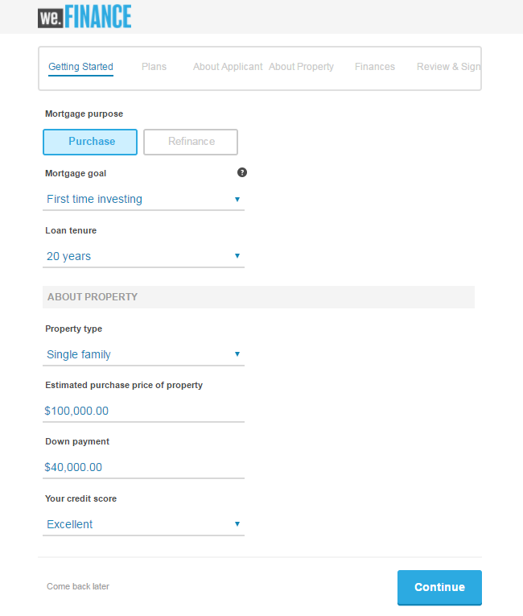
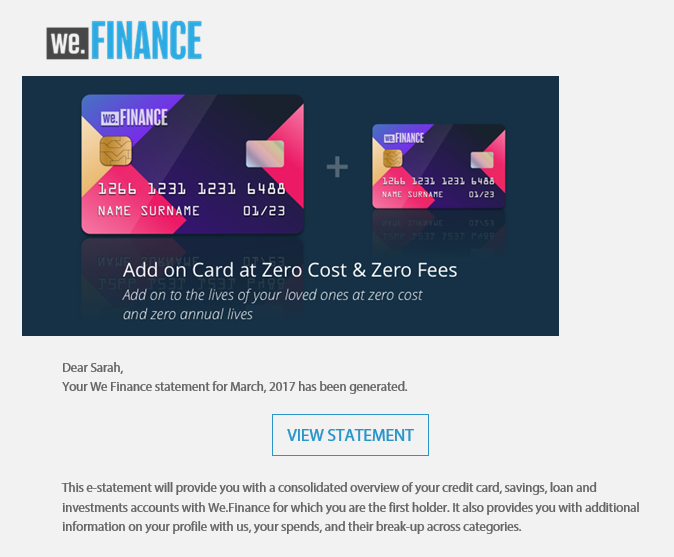

# Présentation du site de référence We.Finance{#we-finance-reference-site-walkthrough} 

## Conditions préalables {#pre-requisites}

Installez les sites de référence comme décrit dans [Installation et configuration des sites de référence d’AEM Forms](../../forms/using/setup-reference-sites.md).

## Cas de figure du site de référence We.Finance {#we-finance-reference-site-scenarios}

We.Finance est une organisation de premier plan dans le domaine des services financiers qui offre des solutions financières complètes et personnalisées pour répondre aux exigences de différents profils clients. Elle propose des cartes de crédit, des prêts immobiliers et des services d’assurance habitation.

Leur objectif est de toucher les clients existants et potentiels sur leur appareil préféré, d&#39;expliquer les avantages de leurs services et de les aider à s&#39;inscrire à leurs services. En outre, elle cherche à lancer davantage de produits financiers tels que les cartes ajoutées que les clients peuvent trouver intéressants.

Poursuivez la lecture de cet article pour obtenir des informations détaillées sur les cas d’utilisation de We.Finance et comprendre comment AEM Forms aide les organisations financières à atteindre leurs objectifs. Les procédures pas à pas suivantes sont abordées :

* [Présentation de la demande de carte de crédit](#credit-card-application-walkthrough)
* [Présentation de la demande de prêt immobilier](#home-mortgage-application-walkthrough)
* [Présentation de la demande de prêt immobilier avec Microsoft Dynamics](#home-mortgage-application-walkthrough-with-microsoft-dynamics)
* [Présentation de la demande d’assurance habitation](#home-insurance-application-walkthrough)
* [Présentation de la gestion du patrimoine](#wealthmanagementwalkthrough)
* [Présentation de la demande d&#39;assurance automatique](#autoinsuranceapplicationwalkthrough)

## Présentation de la demande de carte de crédit {#credit-card-application-walkthrough}

Ce cas de figure de demande de carte de crédit We.Finance met en scène les personnages suivants :

* Sarah Rose, une cliente de We.Finance
* Gloria Rios, responsable du département consacré aux cartes de crédit et aux prêts chez We.Finance

L’infographie suivante illustre le déroulement détaillé de la demande de carte de crédit.

Examinons le cas du site de référence pour comprendre comment AEM Forms aide We.Finance à atteindre ses objectifs.

### Sarah reçoit une newsletter de We.Finance et demande une carte de crédit {#sarah-receives-a-newsletter-from-we-finance-and-applies-for-a-credit-card}

Sarah Rose est déjà cliente de We.Finance. Elle reçoit une newsletter de We.Finance à propos d’une offre sur une nouvelle carte de crédit. Elle trouve l’offre intéressante et décide de demander une carte de crédit. Elle clique sur le bouton Demander maintenant dans la newsletter qui la redirige vers la demande de carte de crédit sur le portail We.Finance.

#### Fonctionnement {#how-it-works}

La newsletter envoyée à Sarah est une implémentation personnalisée qui déclenche l’envoi d’un courrier électronique à l’ID d’adresse électronique spécifié. Le bouton Demander maintenant dans le courrier électronique est lié à la demande de carte de crédit qui est un formulaire adaptatif sur une instance de publication.

#### Démonstration {#see-it-yourself}

Ouvrez l’URL suivante sur l’instance de publication pour déclencher un courrier électronique de newsletter. Ensure that you replace `[emailID]` with a valid email account to receive the newsletter. Ouvrez la newsletter et cliquez sur **[!UICONTROL Demander maintenant]** pour accéder à la demande de carte de crédit.

`https://[publishServer]:[publsihPort]/content/campaigns/we-finance/start.html?app=cc&email=[emailID]&givenName=Sarah&familyName=Rose`

### Sarah trouve l’offre intéressante et choisit d’y adhérer {#sarah-finds-the-offer-interesting-and-chooses-to-apply}

Sarah decides to apply for the credit card and taps **Apply Now** button on the email. Il redirige Sarah vers la demande de carte de crédit sur le portail We.Finance. Le formulaire de demande est organisé en différentes sections au moyen d’une mise en page de carte.

Sarah sélectionne une carte de crédit parmi les options disponibles et clique sur **[!UICONTROL Continuer]**.

Sur la page Informations personnelles, Sarah fournit son numéro de sécurité sociale. Une invite s’affiche pour se connecter avec ses informations d’identification.

Sarah est déjà cliente de We.Finance. Elle se connecte avec ses identifiants de compte We.Finance et ses données personnelles sont automatiquement renseignées dans le formulaire. Sarah continue à remplir le formulaire de demande et c’est là qu’un rappel s’affiche pour une réunion à laquelle elle doit assister. She clicks **[!UICONTROL Save my progress]** on the application form. Toutes les informations que Sarah a remplies jusqu’à présent sont enregistrées et une boîte de dialogue apparaît pour confirmer si elle souhaite recevoir un courrier électronique avec un lien vers son brouillon afin de le terminer plus tard.

Sarah clique sur **[!UICONTROL Envoyer un courrier]**. Elle reçoit un courrier électronique avec un lien pour reprendre sa demande de carte de crédit.

**Sarah accède à la demande de carte de crédit à partir de son périphérique mobile**

Si Sarah accède à la demande de carte de crédit à partir de son appareil mobile, la demande réactive s’ouvre dans une vue optimisée pour les appareils mobiles. Dans cette vue, le formulaire de demande affiche une section à la fois. Cela permet à Sarah d’afficher et de fournir des informations progressivement au fur et à mesure de son avancée dans la demande.

**Fonctionnement**

Le bouton **Demander maintenant** redirige Sarah vers la demande de carte de crédit. The application is an adaptive form, which you can review in the authoring instances at `https://[host]:'port'/editor.html/content/forms/af/we-finance/cc-app.html`.

Voici quelques fonctionnalités clés que vous pouvez consulter dans le formulaire adaptatif :

* Il est basé sur un schéma XSD.
* Il a été créé avec le thème A We.Finance pour le style et le modèle We.Finance pour la mise en page. En outre, il utilise une mise en page sans titre de panneau dans la mise en forme de l’en-tête de formulaire pour la navigation mobile. Il présente une mise en page mobile progressive lorsqu’il est ouvert depuis un appareil mobile. Vous pouvez consulter le modèle à l’adresse `https://[host]:'port'/libs/wcm/core/content/sites/templates.html/conf/we-finance` et le thème à l’adresse `https://[host]:'port'/editor.html/content/dam/formsanddocuments-themes/we-finance/we-finance-theme-a/jcr:content`.
* Il inclut des règles de formulaire adaptatif pour appeler les services de modèle de données de formulaire afin de préremplir les détails de l’utilisateur connecté. Il appelle également les services pour préremplir les informations selon le numéro de sécurité sociale ou l’adresse électronique fournie dans le formulaire. You can review the Form Data Models and their services at `https://[host]:'port'/aem/forms.html/content/dam/formsanddocuments-fdm`.
* Il utilise divers composants de formulaire adaptatif pour collecter les entrées et s’adapter aux réponses des utilisateurs. Il emploie également des composants tels que Courrier électronique qui prennent en charge les types d’entrée HTML5.
* Il utilise le composant Étape de signature pour afficher le formulaire rempli et permet la signature électronique dans le formulaire.
* Le bouton Enregistrer ma progression génère un identifiant unique de l’utilisateur et enregistre la demande partiellement remplie en tant que brouillon dans un nœud du référentiel AEM. En outre, il affiche une autorisation de recherche de boîte de dialogue pour envoyer un courrier électronique contenant un lien vers le nœud contenant le brouillon de la demande. Le bouton Envoyer un courrier dans la boîte de dialogue de confirmation déclenche un courrier électronique contenant un lien vers le nœud qui contient le brouillon.
* Il utilise l’action d’envoi Appeler le processus AEM pour déclencher le processus d’approbation de carte de crédit. You can review the workflow used in this form at `https://[host]:'port'/editor.html/conf/global/settings/workflow/models/we-finance-credit-card-workflow.html`

Il est recommandé de consulter le formulaire pour comprendre le schéma, les composants, les règles, les modèles de données de formulaire, le processus des formulaires et l’action d’envoi utilisée pour générer le formulaire.

Consultez également la documentation suivante pour plus d’informations sur les fonctionnalités utilisées dans le formulaire adaptatif de demande de carte de crédit :

* [Présentation de la création de formulaires adaptatifs](../../forms/using/introduction-forms-authoring.md)
* [Création de formulaires adaptatifs à l’aide d’un schéma XML](../../forms/using/adaptive-form-xml-schema-form-model.md)
* [Éditeur de règles](../../forms/using/rule-editor.md)
* [Thèmes](../../forms/using/themes.md)
* [Intégration de données](../../forms/using/data-integration.md)
* [Utilisation d’Adobe Sign dans les formulaires adaptatifs](../../forms/using/working-with-adobe-sign.md)
* [Processus basé sur l’utilisation de Forms sur OSGi](../../forms/using/aem-forms-workflow.md)

**Démonstration**

Lorsque vous êtes connecté en tant que Sarah Rose, cliquez sur le bouton **Demander maintenant** sur la demande de carte de crédit. Renseignez quelques champs, explorez divers composants du formulaire adaptatif, puis cliquez sur **Enregistrer ma progression** pour recevoir un courrier électronique avec un bouton **Reprendre** qui pointe vers le brouillon de la demande. Assurez-vous de spécifier votre ID d’adresse électronique dans le formulaire de demande pour recevoir le courrier électronique.

Consultez le thème We.Finance disponible à l’adresse :

`https://<host>:<AuthorPort>/editor.html/content/dam/formsanddocuments-themes/we-Finance/we-Finance-Theme-A/jcr:content`

Vous pouvez consulter le modèle We.Finance à l’adresse :

`https://<host>:<AuthorPort>/editor.html/conf/we-finance/settings/wcm/templates/we-finance-template/structure.html`

### Sarah reprend et envoie la demande {#sarah-resumes-and-submits-the-application}

Sarah revient plus tard et trouve un courrier électronique de la part de We.Finance. Elle clique sur le bouton **Reprendre** dans le courrier électronique qui la redirige vers le brouillon de sa demande de carte de crédit. Les informations qu’elle a renseignées plus tôt sont préremplies. Elle remplit la suite du formulaire de demande, signe la demande et l’envoie.

Elle peut également accéder au brouillon de sa demande sous **Mes formulaires** sur la page d’accueil de We.Finance.

#### Fonctionnement {#how-it-works-1}

Le bouton Reprendre dans le courrier électronique redirige Sarah vers le nœud contenant le brouillon de sa demande.

#### Démonstration {#see-it-yourself-1}

Vous devez avoir reçu un courrier électronique avec un lien vers le brouillon de la demande sur votre ID d’adresse électronique que vous avez spécifié lors du remplissage du formulaire de demande. Allez-y, renseignez les sections restantes dans la demande et envoyez-la.

### We.Finance reçoit et approuve la demande {#approving-the-application}

We.Finance reçoit la demande de carte de crédit envoyée par Sarah. Une tâche est assignée à Gloria Rios. Elle examine la tâche dans sa boîte de réception AEM et l’approuve.

#### Fonctionnement {#how-it-works-2}

Lorsque Sarah remplit et envoie la demande de carte de crédit, un processus de formulaire se déclenche et une tâche est créée dans la boîte de réception AEM de Gloria.

AEM Forms sur OSGi fournit des processus centrés sur des formulaires qui vous permettent de générer des processus basés sur des formulaires adaptatifs. Ces processus peuvent être utilisés pour la révision et l’approbation, les flux de processus d’entreprise, le démarrage de Documents Services, l’intégration du processus de signature Adobe Sign, etc. For more information, see [Forms-centric workflow on OSGi](../../forms/using/aem-forms-workflow.md).

L’image suivante illustre le processus AEM qui traite la demande de carte de crédit et génère une sortie PDF à partir de la demande.

#### Démonstration {#see-it-yourself-2}

Vous pouvez accéder à la boîte de réception AEM pour le site Web we.finance à l’adresse https://&lt;*hostname*>:&lt;*PublishPort*>/content/we-finance/global/en.html. Sur la page, appuyez sur **Se connecter**, cochez la case **Se connecter en tant que représentant** , connectez-vous à la boîte de réception AEM en utilisant `grios/password` comme nom d’utilisateur/mot de passe pour Gloria Rios, puis approuvez la demande de carte de crédit. For information about using AEM Inbox for forms-centric workflow tasks, see [Manage Forms applications and tasks in AEM Inbox](../../forms/using/manage-applications-inbox.md).

Lorsque vous approuvez la demande, Sarah reçoit un courrier électronique avec le kit de bienvenue.

### Sarah reçoit le kit de bienvenue et demande une carte ajoutée {#sarah-receives-the-welcome-kit-and-applies-for-an-add-on-card}

Lorsque la demande de carte de crédit de Sarah est approuvée, elle reçoit un courrier électronique contenant un lien vers le kit de bienvenue. Elle ouvre le kit de bienvenue, qui inclut les détails du compte de sa carte de crédit. Le kit de bienvenue affiche également des  promotionnelles  personnalisées pour Sarah. Lorsqu’elle parcourt la page, elle découvre que le kit de bienvenue contient un formulaire incorporé de demande de carte ajoutée. Sarah remplit rapidement les détails requis du kit de bienvenue et demande la carte ajoutée. Une boîte de dialogue de confirmation pour la demande de carte ajoutée s’affiche.

Le kit de bienvenue est personnalisé pour Sarah et affiche des informations la concernant. Il fournit une option pour télécharger une version PDF du kit de bienvenue.

Le kit de bienvenue comprend un autre formulaire de demande que Sarah peut remplir et envoyer pour demander une carte ajoutée depuis le kit de bienvenue, sans avoir à accéder au portail de We.Finance.

#### Fonctionnement {#how-it-works-3}

The welcome kit is an interactive communication included in the `cq-we-finance-content-pkg.zip` package. Les cartes interactives dans la version pour ordinateur, qui présentent les avantages de la carte de crédit dans le kit de bienvenue, sont une disposition personnalisée créée à l’aide de la carte de mise en page par défaut d’un fragment de document.

L’application de carte ajoutée est un formulaire adaptatif incorporé dans la communication interactive du kit de bienvenue.

#### Démonstration {#see-it-yourself-3}

Cliquez sur le bouton Reprendre dans le courrier électronique que vous avez reçu à l’étape précédente. Il ouvre le brouillon de la demande. Renseignez toutes les informations et envoyez la demande. Vous recevrez ensuite un kit de bienvenue. Examinez le kit de bienvenue.

Vous pouvez également voir le kit de bienvenue à l’adresse suivante :

https://&lt;*hôte*> : &lt;*port*>/content/aemforms-refsite/doclink.html?=/content/forms/af/we-finance/credit-card/creditcardwelcomekit&amp;customerId=197&amp;=web

Vous pouvez y accéder dans les instances d’auteur et de publication.

### Sarah reçoit un relevé de carte de crédit {#sarah-receives-a-credit-card-statement}

Comme Sarah commence à utiliser la carte de crédit, elle reçoit ensuite un autre courrier électronique de We.Finance comprenant son relevé de carte de crédit. Les illustrations suivantes montrent le courrier électronique contenant un lien vers un relevé de carte de crédit sur un appareil mobile.

Sarah clique sur Afficher le relevé dans le courrier électronique pour afficher le relevé de carte de crédit. Le relevé est une communication interactive. Il a des versions Web et d’impression (PDF). L’instruction s’intègre au modèle de données de formulaires pour récupérer des données, propres au client, de la base de données. Le relevé interactif est constitué de plusieurs éléments :

* Récapitulatif du relevé
* Rapport détaillé des dépenses
* Analyse graphique des dépenses
* Option pour effectuer un paiement pour le montant dû indiqué par le relevé
* Téléchargement du reçu de paiement

Sarah n’a pas besoin d’accéder au portail ni de rechercher dans ses courriels la version PDF du relevé de carte de crédit pour l’archivage hors ligne. Elle clique simplement sur Télécharger le relevé pour télécharger une version PDF du relevé.

L’instruction détaillée est présentée dans un tableau dynamique. Le relevé offre également la possibilité de payer une partie ou la totalité du montant dû à partir du relevé.

Sarah planifie le paiement à partir du relevé. Sarah peut également utiliser l’option Payer Flexi pour diviser le paiement en parts égales.

#### Fonctionnement {#how-it-works-4}

Le relevé de carte de crédit est une communication interactive. Le tableau détaillé des dépenses dans le relevé est un tableau dynamique. Le graphique du de  de dépenses est un composant de graphique qui lit le tableau de dépenses et génère le graphique circulaire.

#### Démonstration {#see-it-yourself-4}

Vous pouvez tester le relevé de carte de crédit interactif à l’adresse URL suivante :

https://&lt;*hostname*>:&lt;*port*>/content/aemforms-refsite/doclink.html?=/content/forms/af/we-finance/credit-card/credit-card-statement&amp;customerId=197&amp;=web

Vous pouvez y accéder dans les instances d’auteur et de publication.

Le relevé de carte de crédit affiche le  promotionnel  vers la fin du relevé. Vous pouvez intégrer les  Adobe à la communication interactive AEM Forms pour fournir des  de  promotionnelles ciblées en fonction de segments de clients spécifiques. Pour configurer votre communication interactive afin d’utiliser les  Adobe pour des  de personnalisés et ciblés, reportez-vous à la page [Création d’expériences](/help/forms/using/experience-targeting-forms.md)ciblées.

### We.Finance analyse les performances du formulaire de demande de carte de crédit {#we-finance-analyzes-the-performance-of-the-credit-card-application}

We.Finance, de temps à autre, examine les performances de son formulaire de demande de carte de crédit pour vérifier tous les problèmes que les clients peuvent rencontrer. Cette analyse lui permet de prendre les meilleures décisions concernant les modifications requises par la demande de carte de crédit afin d’améliorer l’expérience utilisateur, de réduire les taux d’abandon de formulaire et par conséquent, d’augmenter la conversion. Le site tire profit de l’intégration d’Adobe Analytics à AEM Forms pour son analyse. L’illustration suivante représente le tableau de bord des analyses.

Pour plus d’informations sur la façon d’interpréter le tableau de bord des analyses, reportez-vous à la section [Affichage et compréhension des rapports d’analyse AEM Forms](../../forms/using/view-understand-aem-forms-analytics-reports.md).

#### Fonctionnement {#how-it-works-5}

Les mesures de performances du formulaire de demande de carte de crédit font l’objet d’un suivi à l’aide d’Adobe Analytics. Pour plus d’informations sur la configuration d’Adobe Analytics et l’affichage des rapports, voir [Configuration des analyses de formulaires et documents](../../forms/using/configure-analytics-forms-documents.md).

#### Démonstration {#see-it-yourself-br}

Pour que vous puissiez afficher et explorer le rapport d’analyse, nous fournissons des données sources pour la demande de carte de crédit sur le site de référence. Avant d’utiliser des données source, voir [Configuration d’Analytics](../../forms/using/setup-reference-sites.md#configureanalytics). Effectuez les étapes suivantes dans l’instance d’auteur pour afficher le rapport avec les données source :

1. Go to **Forms &amp; Documents** UI at https://&lt;*hostname*>:&lt;*AuthorPort*>/aem/forms.html/content/dam/formsanddocuments.

1. Cliquez pour ouvrir le dossier **We.Finance**.
1. Sélectionnez **Demande de formulaire adaptatif Carte** de crédit, puis dans la barre d’outils, cliquez sur **[!UICONTROL Activer Analytics]**.

1. Sélectionnez de nouveau le formulaire adaptatif, puis cliquez sur Rapport **** Analytics dans la barre d’outils pour générer le rapport. Un rapport vierge s’affichera initialement.

Pour générer un rapport d’analyse avec des données de départ :

1. In the address browser of CRXDE lite, type: `/apps/we-finance/demo-artifacts/analyticsTestData/Credit card Analytics Test Data`
1. Les données de test sont sélectionnées dans la structure de répertoires de gauche.
1. Cliquez deux fois sur le fichier sélectionné pour ouvrir son contenu dans le panneau de droite.
1. Copiez tout le contenu du fichier de données d’origine.
1. In CRXDE, navigate to: `/content/dam/formsanddocuments/we-finance/cc-app/jcr:content/analyticsdatanode/lastsevendays`
1. In the **[!UICONTROL analyticsdata]** field under **[!UICONTROL Properties]**, paste the copied content of the seed data file.

1. Sélectionnez **Demande de formulaire adaptatif Carte** de crédit et cliquez sur Rapport **** Analytics dans la barre d’outils pour générer le rapport avec les données de base.

**Test A/B de la demande de carte de crédit**

En plus d’analyser les performances de la demande de carte de crédit et de l’améliorer constamment, We.Finance tire parti de l’intégration d’AEM Forms à Target pour créer des tests A/B. Cela lui permet de proposer des expériences différentes du formulaire de demande de carte de crédit et d’identifier l’expérience qui entraîne un meilleur taux de conversion en termes de remplissage et d’envoi du formulaire.

To configure Target in AEM Forms server, see [Set up and integrate Target in AEM Forms](../../forms/using/ab-testing-adaptive-forms.md#set%20up%20and%20integrate%20target%20in%20aem%20forms).

Effectuez les étapes suivantes pour expérimenter la création d’un test A/B pour le formulaire de demande de carte de crédit de We.Finance :

1. Go to **Forms &amp; Documents** at https://&lt;*hostname*>:&lt;*AuthorPort*>/aem/forms.html/content/dam/formsanddocuments.

1. Cliquez pour ouvrir le dossier **We.Finance**.
1. Sélectionnez le formulaire adaptatif **Demande de carte de crédit**.
1. Cliquez sur le bouton **Plus** dans la barre d’outils et sélectionnez **Configurer les tests A/B**. La page de configuration des tests A/B s’ouvre.

1. Spécifiez un **Nom d’activité**.
1. Dans la liste déroulante Public, sélectionnez un public auquel vous souhaitez proposer différentes expériences du formulaire. Par exemple, les **visiteurs utilisant Chrome**.
1. Dans les champs **Distribution d’expérience** pour les expériences A et B, spécifiez la répartition, sous forme de pourcentage, pour déterminer la répartition des expériences dans le public total. Par exemple, si vous spécifiez 40 et 60 pour les expériences A et B, respectivement, l’expérience A sera transmise à 40 % du public et les 60 % restant verront s’afficher l’expérience B.
1. Cliquez sur **Configurer**. Une boîte de dialogue s’affiche pour confirmer la création du test A/B.
1. Cliquez sur **Terminé**.
1. Select the **Application for Credit Card** form and click **Edit**. Vous obtenez une option pour ouvrir l’une des expériences. Cliquez sur **Expérience B**. Le formulaire s’ouvre en mode de modification.

1. Modifier le formulaire comme vous le souhaitez afin de créer une expérience différente de l’expérience A par défaut.
1. Accédez à l’interface utilisateur Formulaires et documents, sélectionnez le formulaire puis cliquez sur **Plus**, enfin sélectionnez **Démarrer le test A/B**.
1. Ouvrez maintenant le formulaire dans le navigateur Chrome plusieurs fois à l’aide de l’URL suivante :

   `https://[hostname]:[port]/content/dam/formsanddocuments/we-finance/cc-app/jcr:content?wcmmode=disabled`

   >[!NOTE] Supprimez le cookie nommé **mbox** de la liste de persistance des cookies dans le navigateur avant d’ouvrir le formulaire la fois suivante. Vous voyez l’expérience A et B du formulaire de manière aléatoire.

1. Sélectionnez le formulaire, cliquez sur **Plus**, et cliquez sur **Rapport de test A/B**. Vous ne trouverez pas beaucoup de données dans le rapport car vous venez de démarrage du test. Ajoutons maintenant quelques données sources pour voir à quoi ressemble le rapport de test A/B.
1. Ouvrez CRXDE Lite et prenez une copie du fichier suivant : /libs/fd/fmaddon/gui/components/admin/targetreport/clientlibs/targetreport/js/targetreport.js
1. Remplacez la définition de fonction `onReportLoadSuccess` dans le fichier mentionné ci-dessus par la définition de fonction dans le fichier suivant : /apps/we-finance/demo-artifacts/targetreport.js

   >[!NOTE]
   >
   >Ces modifications sont uniquement à titre de démonstration. Assurez-vous de restaurer le contenu du fichier après avoir terminé cette procédure.

1. Actualisez le rapport que vous avez généré et vous verrez quelque chose qui ressemble à ça : Examinez le tableau de bord de génération de rapports.

Pour mettre fin au test A/B, cliquez sur le bouton **Terminer le test A/B** du tableau de bord de génération de rapports. A ce stade, une boîte de dialogue vous invite à déclarer une expérience. Sélectionnez l’expérience la plus probante et confirmez la fin du test A/B.

Si vous choisissez l’expérience A comme la plus probante, le test A/B se termine et, à partir de ce moment, seule l’expérience A sera proposée à tous les publics, y compris ceux utilisant Chrome.

## Présentation de la demande de prêt immobilier {#home-mortgage-application-walkthrough}

Le cas de figure du prêt immobilier We.Finance met en scène les personnages suivants :

* Sarah Rose, une cliente de We.Finance
* Gloria Rios, responsable du département consacré aux cartes de crédit et aux prêts chez We.Finance
* John Doe, représentant du service client chez We.Finance

L’infographie suivante illustre le déroulement détaillé d’une demande de prêt immobilier.

À présent, étudions en détail les étapes du cas de figure du site de référence pour voir comment AEM Forms aide We.Finance à atteindre ses objectifs.

### Sarah se rend sur le site Web de We.Finance et demande un prêt immobilier {#sarah-visits-we-finance-website-and-applies-for-home-mortgage}

Sarah Rose envisage d’acheter une maison et cherche donc un prêt immobilier. Elle est cliente chez We.Finance et se rend donc sur le portail We.Finance pour découvrir les offres de prêt. Elle accède à la section des prêts et trouve un calculateur dédié sur le portail. Elle remplit les détails et clique sur Calculer mon prêt, qui renvoie une offre de prêt.

 

Calculateur de prêt

Résultat du calculateur de prêt

#### Fonctionnement {#how-it-works-6}

Le calculateur de prêt sur la page Prêts est un formulaire adaptatif intégré dans une page de sites AEM. You can review the Loans page in edit mode at `https://[authorHost]:[authorPort]/editor.html/content/we-finance/global/en/loan-landing-page.html`.

Le calculateur de prêt intégré, qui est un formulaire adaptatif, utilise des règles pour calculer le montant des mensualités en fonction des détails du prêt fournis dans les champs du calculateur. Vous pouvez consulter le formulaire adaptatif à l’adresse `https://[authorHost]:[authorPort]/editor.html/content/forms/af/we-finance/hm-calc.html`.

#### Démonstration {#see-it-yourself-5}

Go to We.Finance portal at `https://<publishHost>:<publishPort>/content/we-finance/global/en.html` and click **[!UICONTROL Loans]**. Fournissez des détails dans le calculateur de prêt et regardez les résultats.

### Sarah trouve l’offre intéressante et choisit d’effectuer une demande {#sarah-finds-the-offer-interesting-and-chooses-to-apply-1}

Sarah chooses to apply for home mortgage and clicks **[!UICONTROL Apply Now]** on home mortgage calculator results. Il ouvre la demande de prêt immobilier.

Si Sarah accède à la demande de prêt immobilier à partir de son appareil mobile, le formulaire de demande s’ouvre dans une vue optimisée pour l’affichage sur appareils mobiles. Dans cette vue, le formulaire de demande affiche une section à la fois. Cela permet à Sarah d’afficher et de fournir des informations progressivement au fur et à mesure de son avancée dans le formulaire de la demande.

Les illustrations suivantes présentent le processus qui se produit lorsque Sarah parcourt la demande de prêt immobilier sur son appareil mobile.

Si Sarah clique sur **Demander maintenant** à partir de son ordinateur, le formulaire de demande de prêt immobilier s’ouvre comme suit. Les informations que Sarah a fournies dans le calculateur de prêt sont préremplies dans le formulaire de demande. Sarah remplit les détails restants et clique sur **Continuer**.

En fonction des informations que Sarah a remplies dans le calculateur de prêt, quelques offres lui sont présentées. Elle choisit le plan qui convient à ses besoins et continue de remplir la demande. Elle signe, puis envoie la demande.

La demande envoyée est transmise à We.Finance pour approbation.

#### Fonctionnement {#how-it-works-7}

Le bouton **Demander maintenant** redirige Sarah vers la demande de prêt immobilier. The application is an adaptive form, which you can review in the authoring instances at `https://[host]:'port'/editor.html/content/forms/af/we-finance/hm-app.html`.

Voici quelques fonctionnalités clés que vous pouvez consulter dans le formulaire adaptatif :

* Il est basé sur un schéma XSD, `homeMortgageApplication.xsd`.
* Il a été créé avec le thème B We.Finance pour le style et le modèle We.Finance pour la mise en page. En outre, il utilise une mise en page sans titre de panneau dans la mise en forme de l’en-tête de formulaire pour la navigation mobile. Il présente une mise en page mobile progressive lorsqu’il est ouvert depuis un appareil mobile. Vous pouvez consulter le modèle et le thème utilisés dans le formulaire adaptatif aux emplacements suivants sur votre instance d’auteur AEM :

   * `https://[host]:'port'/libs/wcm/core/content/sites/templates.html/conf/we-finance`
   * `https://[host]:'port'/editor.html/content/dam/formsanddocuments-themes/we-finance/we-finance-theme-b/jcr:content`

* Le premier onglet Mise en route de l’application est un calculateur de prêt dynamique qui affiche les options en fonction de la sélection de l’utilisateur. Par exemple, les champs et les valeurs sont différents pour les options Achat et Refinancement. Cette fonctionnalité est réalisée en utilisant des règles afficher-masquer. En outre, lorsque vous cliquez sur Continuer et que l’onglet Plans est initialisé, il appelle un service Web configuré dans un modèle de données de formulaire pour récupérer et afficher les plans de prêt. You can review the Form Data Models and configured services at `https://[host]:'port'/aem/forms.html/content/dam/formsanddocuments-fdm`.
* Il utilise divers composants de formulaire adaptatif pour collecter les entrées et s’adapter aux réponses des utilisateurs. Il emploie également des composants tels que Courrier électronique qui prennent en charge les types d’entrée HTML5.
* Il utilise le composant Étape de signature pour afficher le formulaire rempli et permet la signature électronique dans le formulaire.
* Il emploie l’action d’envoi Appeler le processus AEM pour déclencher le processus AEM de prêt immobilier We.Finance. You can review the workflow used in this form at `https://[host]:'port'/editor.html/conf/global/settings/workflow/models/we-finance-home-mortgage-workflow.html`

Il est recommandé de consulter le formulaire pour comprendre le schéma, les composants, les règles, les modèles de données de formulaire, le processus des formulaires et l’action d’envoi utilisée pour générer le formulaire.

Consultez également la documentation suivante pour plus d’informations sur les fonctionnalités utilisées dans le formulaire adaptatif de demande de prêt immobilier :

* [Présentation de la création de formulaires adaptatifs](../../forms/using/introduction-forms-authoring.md)
* [Création de formulaires adaptatifs à l’aide d’un schéma XML](../../forms/using/adaptive-form-xml-schema-form-model.md)
* [Éditeur de règles](../../forms/using/rule-editor.md)
* [Thèmes](../../forms/using/themes.md)
* [Intégration de données](../../forms/using/data-integration.md)
* [Utilisation d’Adobe Sign dans les formulaires adaptatifs](../../forms/using/working-with-adobe-sign.md)
* [Processus basé sur l’utilisation de Forms sur OSGi](../../forms/using/aem-forms-workflow.md)

#### Démonstration {#see-it-yourself-6}

Go to `https://'[server]:[port]'/content/we-finance/global/en/all-forms.html` and click the **Apply now** button on Home Mortgage Application. Remplissez les détails dans l’onglet Mise en route, essayez différentes options et envoyez la demande.

Assurez-vous de spécifier un ID de courrier électronique valide dans la demande pour recevoir un accusé de réception dans votre boîte de réception.

### We.Finance reçoit la demande {#approving_the_application-1}

We.Finance reçoit la demande de prêt immobilier envoyée par Sarah. La tâche d’approbation ou de rejet de la demande est confiée à Gloria Rios. Elle examine la demande et constate qu’il manque une copie de la carte d’identité de Sarah.

Gloria ouvre la tâche, clique sur le bouton Besoin de plus d’informations et saisit un commentaire sur la copie manquante.

La tâche est désormais confiée à John Doe, un représentant du service client chez We.Finance. Il ouvre la tâche et lit le commentaire de Gloria. Il contacte Sarah et lui demande d’envoyer une copie de sa carte d’identité. Après avoir reçu une copie de la carte d’identité de Sarah, il la joint à la tâche et envoie la demande pour réévaluation.

La tâche est réassignée à Gloria. Elle examine la copie de la carte d’identité jointe et approuve la demande.

#### Fonctionnement {#how-it-works-8}

Lorsque Sarah remplit et envoie la demande de prêt, un processus de formulaire se déclenche et une tâche est créée dans la boîte de réception AEM de Gloria. Lorsque Gloria examine la demande et demande des informations supplémentaires, la tâche est assignée à John Doe. Lorsque John Doe joint la copie de la carte d’identité et envoie à nouveau la demande, elle est assignée à Gloria. Ce cas de figure est défini dans le processus AEM associé à la demande de prêt immobilier.

AEM Forms sur OSGi fournit des processus centrés sur des formulaires qui vous permettent de générer des processus basés sur des formulaires adaptatifs. Ces processus peuvent être utilisés pour la révision et l’approbation, les flux de processus d’entreprise, le démarrage de Documents Services, l’intégration du processus de signature Adobe Sign, etc. For more information, see [Forms-centric workflow on OSGi](../../forms/using/aem-forms-workflow.md).

L’image suivante illustre le processus AEM associé à la demande de prêt immobilier.

#### Démonstration {#see-it-yourself-7}

Vous pouvez accéder à la boîte de réception AEM à l’adresse `https://<hostname>:<AuthorPort>/content/we-finance/global/en/login.html?resource=/aem/inbox.html`. Connectez-vous à la boîte de réception AEM à l’aide des nom d’utilisateur/mot de passe `grios/password` pour Gloria Rios et `jdoe/jdoe` pour John Doe, et explorez le processus de demande de prêt immobilier.

For information about using AEM Inbox for forms-centric workflow tasks, see [Manage Forms applications and tasks in AEM Inbox](../../forms/using/manage-applications-inbox.md).

### Sarah reçoit le kit de bienvenue {#sarah-receives-the-welcome-kit}

Lorsque la demande de prêt immobilier de Sarah est approuvée, elle reçoit un courrier électronique contenant un lien vers le kit de bienvenue. Elle ouvre le kit de bienvenue, qui comprend un carrousel affichant des offres promotionnelles personnalisées pour Sarah.

Le kit de bienvenue est personnalisé pour Sarah et affiche des informations la concernant. Il fournit une option pour télécharger une version PDF du kit de bienvenue. Le bouton fléché au bas de l’écran permet à Sarah de faire défiler la page vers le bas et de parcourir d’autres sections du kit de bienvenue.

#### Fonctionnement {#how-it-works-9}

The welcome kit is an interactive communication included in the `cq-we-finance-content-pkg.zip` package. Les offres promotionnelles dans le kit de bienvenue sont fournies par le serveur d’Adobe Target. Les offres sont personnalisées et ciblées pour des segments de clientèle spécifiques. Le kit de bienvenue récupère les offres à partir d’un serveur Adobe Target préconfiguré pour un segment d’audience constitué de clientes - femmes.

Les cartes interactives dans la version pour ordinateur du kit de bienvenue utilisent une disposition personnalisée créée à l’aide de la mise en page de la carte par défaut d’un fragment de document.

#### Démonstration {#see-it-yourself-8}

Si vous avez fourni votre ID d’adresse électronique lorsque vous avez rempli la demande de prêt immobilier, vous devriez avoir reçu un courrier électronique contenant un lien vers le kit de bienvenue. Vérifiez votre boîte de réception et examinez le kit de bienvenue.

Vous pouvez l’afficher dans l’instance de publication AEM à l’adresse suivante :

`https://[host]:'port'/content/forms/af/we-finance/mortgage-loan-welcome-kit.html`

### Sarah reçoit un relevé de compte {#sarah-receives-an-account-statement}

Lorsque Sarah se sert du prêt et commence à effectuer des versements, elle reçoit un autre courrier électronique de We.Finance comprenant son relevé de compte mensuel.

Sarah clique sur Afficher le relevé dans le courrier électronique pour afficher le relevé de compte du prêt immobilier. Le relevé interactif est constitué de plusieurs éléments :

* Récapitulatif du relevé
* Détails du relevé

L’illustration suivante montre une partie différente du relevé de compte sur ordinateur.

Le relevé détaillé est présenté dans un tableau dynamique et offre la possibilité de payer une partie ou le montant dû complet indiqué dans le relevé.

#### Fonctionnement {#how-it-works-10}

Le relevé hypothécaire est une communication interactive. Il est généré avec le processus de traitement par lots JSON. Le tableau détaillé des dépenses dans le relevé est un tableau dynamique.

#### Démonstration {#see-it-yourself-9}

Vous pouvez consulter le relevé de compte de prêt immobilier interactif à l’adresse URL suivante :

https://&lt;*hostname*>:&lt;*port*>/content/forms/af/we-finance/mortgage-account-statement.html?wcmmode=disabled

Vous pouvez y accéder dans les instances d’auteur et de publication.

### We.Finance analyse les performances de la demande de prêt immobilier {#we-finance-analyzes-the-performance-of-the-mortgage-application}

We.Finance, de temps à autre, examine les performances de son formulaire de demande de prêt immobilier pour vérifier tous les problèmes que les clients peuvent rencontrer. Cette analyse lui permet de prendre les meilleures décisions concernant les modifications requises par la demande de prêt immobilier afin d’améliorer l’expérience utilisateur, de réduire les taux d’abandon de formulaire et par conséquent, d’augmenter la conversion. Le site tire profit de l’intégration d’Adobe Analytics à AEM Forms pour son analyse. L’illustration suivante représente le tableau de bord des analyses.

Pour plus d’informations sur la façon d’interpréter le tableau de bord des analyses, reportez-vous à la section [Affichage et compréhension des rapports d’analyse AEM Forms](../../forms/using/view-understand-aem-forms-analytics-reports.md).

#### Fonctionnement {#how-it-works-11}

Les mesures de performances du formulaire de demande de prêt immobilier font l’objet d’un suivi à l’aide d’Adobe Analytics. Pour plus d’informations sur la configuration d’Adobe Analytics et l’affichage des rapports, voir [Configuration des analyses de formulaires et documents](../../forms/using/configure-analytics-forms-documents.md).

#### Démonstration {#see-it-yourself-br-1}

Pour que vous puissiez afficher et explorer le rapport d’analyse, nous fournissons des données sources pour la demande de prêt immobilier sur le site de référence. Avant d’utiliser des données source, voir [Configuration d’Analytics](../../forms/using/setup-reference-sites.md#configureanalytics). Effectuez les étapes suivantes dans l’instance d’auteur pour afficher le rapport avec les données source :

1. Go to **Forms &amp; Documents** UI at https://&lt;*hostname*>:&lt;*AuthorPort*>/aem/forms.html/content/dam/formsanddocuments.

1. Cliquez pour ouvrir le dossier **we-finance**.
1. Sélectionnez le formulaire adaptatif **[!UICONTROL Demande de prêt immobilier]** , puis dans la barre d’outils, cliquez sur **[!UICONTROL Activer Analytics]**.

1. Sélectionnez de nouveau le formulaire, puis cliquez sur Rapport **** Analytics dans la barre d’outils pour générer le rapport. Un rapport vierge s’affichera initialement.

Pour générer un rapport d’analyse avec des données de départ :

1. In the address browser of CRXDE lite, type the following: `/apps/we-finance/demo-artifacts/analyticsTestData/HomeMortgageAnalyticsTestData`
1. Les données de test sont sélectionnées dans la structure de répertoires de gauche.
1. Cliquez deux fois sur le fichier sélectionné pour ouvrir son contenu dans le panneau de droite.
1. Copiez tout le contenu du fichier de données d’origine.
1. In CRXDE, navigate to: `/content/dam/formsanddocuments/we-finance/hm-app/jcr:content/analyticsdatanode/lastsevendays`
1. Dans le champ analyticsdata sous Properties, collez le contenu copié du fichier de données d’origine.
1. Générez à présent le rapport d’analyse pour le formulaire de demande de prêt immobilier. Le rapport s’affiche avec les données de base.

**Test A/B de la demande de prêt immobilier**

En plus d’analyser les performances de la demande de prêt immobilier et de l’améliorer constamment, We.Finance tire parti de l’intégration d’AEM Forms à Target pour créer des tests A/B. Cela lui permet de proposer des expériences différentes du formulaire de demande de prêt immobilier et d’identifier l’expérience qui entraîne un meilleur taux de conversion en termes de remplissage et d’envoi du formulaire.

To configure Target in AEM Forms server, see [Set up and integrate Target in AEM Forms](../../forms/using/ab-testing-adaptive-forms.md#set%20up%20and%20integrate%20target%20in%20aem%20forms).

Effectuez les étapes suivantes dans l’instance d’auteur pour expérimenter la création d’un test A/B pour le formulaire de demande de prêt immobilier de We.Finance :

1. Go to **Forms &amp; Documents** at https://&lt;*hostname*>:&lt;*AuthorPort*>/aem/forms.html/content/dam/formsanddocuments.

1. Cliquez pour ouvrir le dossier **We.Finance**.
1. Sélectionnez le formulaire adaptatif **Demande de prêt immobilier** .
1. Cliquez sur le bouton **Plus** dans la barre d’outils et sélectionnez **Configurer les tests A/B**. La page de configuration des tests A/B s’ouvre.

1. Spécifiez un **Nom d’activité**.
1. Dans la liste déroulante Public, sélectionnez un public auquel vous souhaitez proposer différentes expériences du formulaire. Par exemple, les **visiteurs utilisant Chrome**.
1. Dans les champs **Distribution d’expérience** pour les expériences A et B, spécifiez la répartition, sous forme de pourcentage, pour déterminer la répartition des expériences dans le public total. Par exemple, si vous spécifiez 40 et 60 pour les expériences A et B, respectivement, l’expérience A sera transmise à 40 % du public et les 60 % restant verront s’afficher l’expérience B.
1. Cliquez sur **Configurer**. Une boîte de dialogue s’affiche pour confirmer la création du test A/B.
1. Cliquez sur **Terminé**.
1. Sélectionnez le formulaire adaptatif **Demande de prêt immobilier** et cliquez sur **Modifier**. Vous obtenez une option pour ouvrir l’une des expériences. Cliquez sur **Expérience B**. Le formulaire s’ouvre en mode de modification.
1. Modifier le formulaire comme vous le souhaitez afin de créer une expérience différente de l’expérience A par défaut.
1. Accédez à l’interface utilisateur Formulaires et documents, sélectionnez le formulaire puis cliquez sur **Plus**, enfin sélectionnez **Démarrer le test A/B**.
1. Ouvrez maintenant le formulaire dans le navigateur Chrome plusieurs fois à l’aide de l’URL suivante :
   `https://[hostname]:[port]/content/dam/formsanddocuments/we-finance/hm-app/jcr:content?wcmmode=disabled`

   >[!NOTE]
   > Supprimez le cookie nommé **mbox** de la liste de persistance des cookies dans le navigateur avant d’ouvrir le formulaire la fois suivante. Vous voyez l’expérience A et B du formulaire de manière aléatoire.

1. Sélectionnez le formulaire, cliquez sur **Plus**, et cliquez sur **Rapport de test A/B**. Vous ne trouverez pas beaucoup de données dans le rapport car vous venez de démarrage du test. Ajoutons maintenant quelques données sources pour voir à quoi ressemble le rapport de test A/B.
1. Ouvrez CRXDE Lite et prenez une copie du fichier suivant : /libs/fd/fmaddon/gui/components/admin/targetreport/clientlibs/targetreport/js/targetreport.js
1. Remplacez la définition de la `onReportLoadSuccess` fonction dans le fichier mentionné ci-dessus par la définition de fonction dans le fichier suivant : /apps/we-finance/demo-artifacts/targetreport.js

   >[!NOTE]
   >
   >Ces modifications sont uniquement à titre de démonstration. Assurez-vous de restaurer le contenu du fichier après avoir terminé cette procédure.

1. Actualisez le rapport que vous avez généré et vous verrez quelque chose qui ressemble à ça : Examinez le tableau de bord de génération de rapports.

Pour mettre fin au test A/B, cliquez sur le bouton **Terminer le test A/B** du tableau de bord de génération de rapports. A ce stade, une boîte de dialogue vous invite à déclarer une expérience. Sélectionnez l’expérience la plus probante et confirmez la fin du test A/B.

Si vous choisissez l’expérience A comme la plus probante, le test A/B se termine et, à partir de ce moment, seule l’expérience A sera proposée à tous les publics, y compris ceux utilisant Chrome.

## Présentation de la demande de prêt immobilier avec Microsoft Dynamics {#home-mortgage-application-walkthrough-with-microsoft-dynamics}

Le cas de figure du prêt immobilier We.Finance avec Microsoft Dynamics met en scène les personnages suivants :

* Sarah Rose, une cliente de We.Finance
* L’administrateur de l’instance We.Finance Microsoft Dynamics

La présentation de l&#39;application Prêt immobilier avec Microsoft Dynamics montre comment un client Web.Finance peut utiliser le site pour demander un prêt immobilier lorsque le site de référence utilise Microsoft Dynamics pour l&#39;intégration des données. La présentation se termine par des données remplies par l’utilisateur et collectées par Microsoft Dynamics. Before you proceed with this scenario, you need to complete the [Microsoft Dynamics 365 configuration for the home mortgage workflow of the We.Finance reference site](/help/forms/using/ms-dynamics-configuration-home-mortgage.md).

### Sarah se rend sur le site Web de We.Finance et demande un prêt immobilier {#sarah-visits-we-finance-website-and-applies-for-home-mortgage-1}

Sarah Rose envisage d’acheter une maison et cherche donc un prêt immobilier. Elle est cliente chez We.Finance et se rend donc sur le portail We.Finance pour découvrir les offres de prêt. Elle accède à la section des prêts et trouve un calculateur dédié sur le portail. Elle remplit les détails et clique sur Calculer mon prêt, qui renvoie une offre de prêt.

 

Calculateur de prêt

Résultat du calculateur de prêt

#### Fonctionnement {#how-it-works-12}

Le calculateur de prêt sur la page Prêts est un formulaire adaptatif intégré dans une page de sites AEM. You can review the Loans page in edit mode at `https://[authorHost]:[authorPort]/editor.html/content/we-finance/global/en/loan-landing-page.html`.

Le calculateur de prêt intégré, qui est un formulaire adaptatif, utilise des règles pour calculer le montant des mensualités en fonction des détails du prêt fournis dans les champs du calculateur. Vous pouvez consulter le formulaire adaptatif à l’adresse `https://[authorHost]:[authorPort]/editor.html/content/forms/af/we-finance/ms-dynamics/home-mortgage-calculator.html`.

#### Démonstration {#see-it-yourself-10}

Go to We.Finance portal at `https://<publishHost>:<publishPort>/content/we-finance/global/en.html` and click **[!UICONTROL Loans]**. Fournissez des détails dans le calculateur de prêt et regardez les résultats.

### Sarah trouve l’offre intéressante et choisit d’effectuer une demande {#sarah-finds-the-offer-interesting-and-chooses-to-apply-2}

Sarah chooses to apply for home mortgage and clicks **[!UICONTROL Apply Now]** on home mortgage calculator results. Il ouvre la demande de prêt immobilier.

Si Sarah accède à la demande de prêt immobilier à partir de son appareil mobile, le formulaire de demande s’ouvre dans une vue optimisée pour l’affichage sur appareils mobiles. Dans cette vue, le formulaire de demande affiche une section à la fois. Cela permet à Sarah d’afficher et de fournir des informations progressivement au fur et à mesure de son avancée dans le formulaire de la demande.

Les illustrations suivantes présentent le processus qui se produit lorsque Sarah parcourt la demande de prêt immobilier sur son appareil mobile.

Si Sarah clique sur **Demander maintenant** à partir de son ordinateur, le formulaire de demande de prêt immobilier s’ouvre comme suit. Les informations que Sarah a fournies dans le calculateur de prêt sont préremplies dans le formulaire de demande. Sarah remplit les détails restants et clique sur **Continuer**.

En fonction des informations que Sarah a remplies dans le calculateur de prêt, quelques offres lui sont présentées. Elle choisit le plan qui convient à ses besoins et continue de remplir la demande. Elle signe, puis envoie la demande.

La demande envoyée est transmise à We.Finance pour approbation.

#### Fonctionnement {#how-it-works-13}

Le bouton **Demander maintenant** redirige Sarah vers la demande de prêt immobilier. The application is an adaptive form, which you can review in the authoring instances at `https://[host]:'port'/editor.html/content/forms/af/we-finance/ms-dynamics/application-for-home-mortgage.html`.

Voici quelques fonctionnalités clés que vous pouvez consulter dans le formulaire adaptatif :

* Il est basé sur un schéma XSD, `homeMortgageApplication.xsd`.
* Il a été créé avec le thème B We.Finance pour le style et le modèle We.Finance pour la mise en page. En outre, il utilise une mise en page sans titre de panneau dans la mise en forme de l’en-tête de formulaire pour la navigation mobile. Il présente une mise en page mobile progressive lorsqu’il est ouvert depuis un appareil mobile. Vous pouvez consulter le modèle et le thème utilisés dans le formulaire adaptatif aux emplacements suivants sur votre instance d’auteur AEM :

   * `https://[host]:'port'/libs/wcm/core/content/sites/templates.html/conf/we-finance`
   * `https://[host]:'port'/editor.html/content/dam/formsanddocuments-themes/we-finance/we-finance-theme-b/jcr:content`

* Le premier onglet Mise en route de l’application est un calculateur de prêt dynamique qui affiche les options en fonction de la sélection de l’utilisateur. Par exemple, les champs et les valeurs sont différents pour les options Achat et Refinancement. Cette fonctionnalité est réalisée en utilisant des règles afficher-masquer. En outre, lorsque vous cliquez sur Continuer et que l’onglet Plans est initialisé, il appelle un service Web configuré dans un modèle de données de formulaire pour récupérer et afficher les plans de prêt. You can review the Form Data Models and configured services at `https://[host]:'port'/aem/forms.html/content/dam/formsanddocuments-fdm`.
* Il utilise divers composants de formulaire adaptatif pour collecter les entrées et s’adapter aux réponses des utilisateurs. Il emploie également des composants tels que Courrier électronique qui prennent en charge les types d’entrée HTML5.
* Il utilise le composant Étape de signature pour afficher le formulaire rempli et permet la signature électronique dans le formulaire.

Il est recommandé de consulter le formulaire pour comprendre le schéma, les composants, les règles, les modèles de données de formulaire, le processus des formulaires et l’action d’envoi utilisée pour générer le formulaire.

### L’administrateur affiche les données envoyées dans l’instance Microsoft Dynamics {#the-administrator-views-the-submitted-data-in-the-microsoft-dynamics-instance}

We.Finance reçoit la demande de prêt immobilier envoyée par Sarah sur l’instance Microsoft Dynamics. L’administrateur appuie sur l’entrée dans la colonne principale pour accéder à l’enregistrement principal créé pour Sarah Rose.

## Présentation de la demande d’assurance habitation {#home-insurance-application-walkthrough}

Le cas de figure de l’assurance habitation We.Finance met en scène les personnages suivants :

* Sarah Rose, une cliente de We.Finance
* Gloria Rios, responsable du département consacré aux cartes de crédit et aux prêts chez We.Finance
* Frank De Costa, courtier d’assurance chez We.Finance

L’infographie suivante illustre le déroulement détaillé d’un cas de demande d’assurance habitation.

À présent, étudions en détail les étapes du cas de figure du site de référence pour voir comment AEM Forms aide We.Finance à atteindre ses objectifs.

### Sarah reçoit une newsletter de We.Finance et demande une assurance habitation {#sarah-receives-a-newsletter-from-we-finance-and-applies-for-home-insurance}

Sarah Rose a un prêt immobilier chez We.Finance et elle est à la recherche d’une bonne affaire pour une assurance habitation. Elle visite le portail We.Finance et consulte les plans d’assurance habitation. We.Finance l’a identifiée comme cliente actuelle et envoie une newsletter ciblée à son adresse électronique. La newsletter contient des offres d’assurance habitation.

#### Fonctionnement {#how-it-works-14}

La newsletter envoyée à Sarah est une implémentation personnalisée qui déclenche l’envoi d’un courrier électronique à l’ID d’adresse électronique spécifié. Le bouton Demander maintenant dans la newsletter est lié à la demande d’assurance habitation qui est un formulaire adaptatif sur une instance de publication.

#### Démonstration {#see-it-yourself-11}

Ouvrez l’URL suivante pour déclencher l’envoi d’un courrier électronique de newsletter. Ensure that you replace `[emailID]` with a valid email account to receive the newsletter. Open the newsletter and click **[!UICONTROL Apply Now]** to go to the home insurance application.

`https://[authorServer]:[authorPort]/content/campaigns/we-finance/start.html?app=ins&email=[emailID]&givenName=Sarah&familyName=Rose`

### Sarah trouve l’offre d’assurance habitation intéressante et choisit de déposer une demande {#sarah-finds-the-home-insurance-offer-interesting-and-chooses-to-apply}

Sarah trouve l’offre d’assurance habitation de la newsletter intéressante et décide de faire une demande. Elle clique sur Demander maintenant sur la newsletter, qui ouvre la demande d’assurance habitation sur le portail We.Finance. Le formulaire de demande est organisé en différentes sections au moyen d’une mise en page de carte.

Sur la page Informations personnelles, Sarah fournit son numéro de sécurité sociale. Une invite s’affiche pour se connecter avec ses informations d’identification.

Sarah est déjà cliente de We.Finance. Elle se connecte avec ses identifiants de compte We.Finance et ses données personnelles sont automatiquement renseignées dans le formulaire. Elle continue de renseigner les champs, puis elle envoie la demande.

Si Sarah envoie la demande depuis un appareil mobile, les écrans suivants s’affichent.

#### Fonctionnement {#how-it-works-15}

Le bouton **Demander maintenant** de la newsletter redirige Sarah vers la demande d’assurance habitation sur le portail We.Finance. The application is an adaptive form, which you can review in the authoring instance at `https://[host]:'port'/editor.html/content/forms/af/we-finance/insurance/application-for-insurance.html`.

Voici quelques fonctionnalités clés que vous pouvez consulter dans le formulaire adaptatif :

* Il est basé sur un schéma XSD, `insurance.xsd`.
* Il est créé avec le thème Assurance pour le style et utilise la mise en page sans titre de panneau dans la mise en forme de l’en-tête de formulaire pour la navigation mobile. Il présente une mise en page mobile progressive lorsqu’il est ouvert depuis un appareil mobile. Vous pouvez consulter le modèle à l’adresse `https://[host]:'port'/libs/wcm/core/content/sites/templates.html/conf/we-finance` et le thème à l’adresse `https://[host]:'port'/editor.html/content/dam/formsanddocuments-themes/we-finance/insurance/jcr:content`.

* Il inclut des règles de formulaire adaptatif pour appeler les services de modèle de données de formulaire afin de préremplir les détails de l’utilisateur connecté. Il appelle également les services pour préremplir les informations selon le numéro de sécurité sociale ou l’adresse électronique fournie dans le formulaire. You can review the Form Data Models and their services at `https://[host]:'port'/aem/forms.html/content/dam/formsanddocuments-fdm`.
* Il utilise divers composants de formulaire adaptatif pour collecter les entrées et s’adapter aux réponses des utilisateurs. Il emploie également des composants tels que Courrier électronique qui prennent en charge les types d’entrée HTML5.
* Le bouton Enregistrer ma progression génère un identifiant unique de l’utilisateur et enregistre la demande partiellement remplie en tant que brouillon dans un nœud du référentiel AEM. En outre, il affiche une autorisation de recherche de boîte de dialogue pour envoyer un courrier électronique contenant un lien vers le nœud contenant le brouillon de la demande. Le bouton Envoyer un courrier dans la boîte de dialogue de confirmation déclenche un courrier électronique contenant un lien vers le nœud qui contient le brouillon.
* Il utilise l’action d’envoi Appeler le processus AEM pour déclencher le processus d’approbation de l’assurance habitation. You can review the workflow used in this form at `https://[host]:'port'/editor.html/conf/global/settings/workflow/models/we-finance-insurance-workflow.html`

Il est recommandé de consulter le formulaire pour comprendre le schéma, les composants, les règles, les modèles de données de formulaire, le processus des formulaires et l’action d’envoi utilisée pour générer le formulaire.

Consultez également la documentation suivante pour plus d’informations sur les fonctionnalités utilisées dans le formulaire adaptatif de demande d’assurance habitation :

* [Présentation de la création de formulaires adaptatifs](../../forms/using/introduction-forms-authoring.md)
* [Création de formulaires adaptatifs à l’aide d’un schéma XML](../../forms/using/adaptive-form-xml-schema-form-model.md)
* [Éditeur de règles](../../forms/using/rule-editor.md)
* [Thèmes](../../forms/using/themes.md)
* [Intégration de données](../../forms/using/data-integration.md)
* [Utilisation d’Adobe Sign dans les formulaires adaptatifs](../../forms/using/working-with-adobe-sign.md)
* [Processus basé sur l’utilisation de Forms sur OSGi](../../forms/using/aem-forms-workflow.md)

#### Démonstration {#see-it-yourself-12}

Cliquez sur le bouton **Demander maintenant** dans la newsletter que vous devriez avoir reçue par courrier électronique. Alternatively, go to `https://[publishHost]:[publishPort]/content/we-finance/global/en/all-forms.html` and click **[!UICONTROL Apply]** on the insurance application. Indiquez `123456789` dans le champ Numéro de sécurité sociale. Lorsque vous y êtes invité, connectez-vous en utilisant les nom d’utilisateur / mot de passe `srose/srose`.

Renseignez les détails, explorez divers composants de formulaire adaptatif et envoyez l’application. Vous pouvez consulter le formulaire adaptatif à l’adresse `https://[authorHost]:[authorPort]/editor.html/content/forms/af/we-finance/insurance/application-for-insurance.html`.

### We.Finance approuve la demande et un contrat est signé {#we-finance-approves-the-application-and-a-contract-is-signed}

We.Finance reçoit la demande d’assurance habitation envoyée par Sarah. Une tâche est assignée à Gloria Rios. Elle examine la demande dans sa boîte de réception AEM et l’approuve.

Lorsque Gloria approuve la demande d’assurance habitation de Sarah, une tâche est créée dans la boîte de réception AEM de Frank De Costa. Frank examine la tâche. Il prépare un contrat de police d’assurance habitation pour Sarah, joint le contrat à sa demande et l’envoie à Sarah pour la signature du contrat. Le contrat, affiché ci-dessous dans l’interface utilisateur de l’agent, est la version papier de la communication interactive.

Sarah reçoit un courrier électronique avec un lien vers le contrat de police d’assurance habitation pour la signature. Sarah examine et signe le contrat.

#### Fonctionnement {#how-it-works-16}

Lorsque Sarah envoie la demande d’assurance habitation, un processus de formulaire se déclenche et une tâche est créée dans la boîte de réception AEM de Gloria. Lorsque Gloria examine la demande et l’approuve, la tâche est assignée à Frank De Costa. Le flux de tâches d’une personne à l’autre est défini dans le processus AEM associé à la demande d’assurance. For more information about workflows, see [Forms-centric workflow on OSGi](../../forms/using/aem-forms-workflow.md).

L’image suivante illustre le processus AEM associé à la demande d’assurance.

Frank utilise la gestion de la correspondance pour préparer un contrat de police d’assurance habitation. Il télécharge le contrat PDF, le joint à la demande de Sarah et clique sur Envoyer contrat. Le processus envoie un courrier électronique à Sarah avec le contrat de police d’assurance habitation pour signature.

#### Démonstration {#see-it-yourself-13}

Procédez comme suit :

1. Go to AEM Inbox, `https://[publishHost]:[publishPort]/content/we-finance/global/en/login.html?resource=/aem/inbox.html`, and log in with `grios/grios` as username password for Gloria&#39;s persona. Approuvez la tâche pour la demande d’assurance habitation de Sarah.

1. Ensuite, connectez-vous à la boîte de réception AEM avec les nom d’utilisateur/mot de passe `fdcosta/password` pour le personnage de Frank. Affichez la tâche.
1. Accédez maintenant à `https://[authorHost]:[authorPort]/aem/forms.html/content/dam/formsanddocuments/we-finance/insurance` et le modèle de lettre pour HomeInsuranceWelcomeKit.
1. Indiquez les informations dans le panneau Données. Cliquez sur **[!UICONTROL Aperçu]**, puis téléchargez le fichier PDF sur votre système de fichiers local. Assurez-vous que le fichier PDF est enregistré sous le nom de contract.pdf.
1. Accédez à la boîte de réception AEM de Frank, ouvrez la tâche, joignez le PDF du contrat téléchargé, puis cliquez sur **[!UICONTROL Envoyer contrat]**.
1. Ouvrez le courrier électronique avec le contrat et signez le document.

### Sarah reçoit un kit de bienvenue {#sarah-receives-a-welcome-kit}

Lorsque Sarah signe le contrat d’assurance habitation, elle reçoit un courrier électronique avec les détails de la police.

Peu après, elle reçoit un autre courrier électronique de We.Finance avec un kit de bienvenue pour sa police d’assurance. Sarah peut accéder aux documents de sa police et consulter les instructions depuis le kit de bienvenue.

#### Démonstration {#see-it-yourself-14}

Si vous avez spécifié votre ID de courrier électronique dans la demande, vous devriez avoir reçu un courrier électronique avec un lien vers le kit de bienvenue. Cliquez sur **[!UICONTROL Mon kit de bienvenue]** pour ouvrir le kit de bienvenue.

## Présentation du prospectus de gestion de la richesse {#wealth-management-prospectus-walkthrough}

Le scénario de gestion du patrimoine Web.Finance implique la personne suivante :

* Sarah Rose, une cliente chez We.Finance

La présentation de la gestion de la richesse montre comment un client Web.Finance peut utiliser le site pour en savoir plus sur un fonds commun de placement, le Blue Chip Growth Fund. Le site de référence utilise une communication interactive pour afficher des informations sur le fonds. Ces informations sont disponibles en format Web et PDF. La présentation se termine par un client qui envoie la version PDF des informations à son frère.

L’image suivante affiche le flux de travail de la présentation de la gestion de patrimoine :

### Sarah visite le site Web We.Finance et ouvre le prospectus du Fonds pour la croissance de la puce bleue {#sarah-visits-we-finance-website-and-opens-the-blue-chip-growth-fund-prospectus}

Sarah Rose prévoit d&#39;investir dans un fonds commun de placement. Elle est déjà cliente de We.Finance et visite donc le portail Web.Finance pour explorer les fonds communs de placement disponibles. Elle se rend à la section Gestion de la richesse et ouvre la page Fonds de croissance de la puce bleue de We.Finance. La page contient des liens vers le prospectus qui contiennent des détails sur les prix actuels et historiques, les performances mensuelles, la diversification sectorielle, les dépenses, les frais, les taxes et autres renseignements sur les fonds.

#### Fonctionnement {#how-it-works-17}

Le prospectus du Blue Chip Growth Fund est une communication interactive. Il utilise des textes, des images, des graphiques et des composants de tableau (fragments de  de) pour afficher le résumé du produit, le style de stock, les performances du fonds, les détails du fonds et d’autres informations connexes. Vous pouvez consulter la communication interactive en mode d’édition à l’adresse `https://[authorHost]:[ authorPort]/editor.html/content/forms/af/we-finance/wealth-management/wealth-management/channels/web.html`

Les graphiques et les tableaux récupèrent les données d’un modèle de données de formulaire. Le modèle de données de formulaire se connecte à des sources de données configurées, une base de données dans cette présentation, pour récupérer des informations spécifiques au fonds. Vous pouvez consulter le modèle de données de formulaire à l’adresse `https://[authorHost]:[authorPort]/aem/fdm/editor.html/content/dam/formsanddocuments-fdm/we-finance/wealth-management`

#### Démonstration  {#see-it-yourself-15}

Accédez au portail Web.Finance à `https://[publishHost]:[publishPort]/wefinance`, appuyez sur Gestion de la richesse, développez Fonds par catégorie d’actifs et appuyez sur We.Finance Blue Chip Growth Fund. Le prospectus du Fonds de croissance de la puce bleue We.Finance s&#39;ouvre.

### Sarah explore le prospectus du Fonds de croissance de la puce bleue pour en savoir plus sur le fonds {#sarah-explores-the-blue-chip-growth-fund-prospectus-to-learn-about-the-fund}

Sarah explore les onglets Aperçu, Prix et Performance, Gestion de portefeuille, Frais et minimum, Impôts et Paiement du prospectus pour connaître les prix courants et historiques, la croissance historique, la comparaison avec l’indice S&amp;P 500, la diversification sectorielle, les personnes qui gèrent le fonds et les dépenses liées au fonds. Les informations associées sont divisées en différents onglets. Le prospectus est une communication interactive. Les communications interactives ont une conception adaptée. Elle peut ouvrir la communication interactive sur un appareil de n’importe quelle taille d’écran et la communication interactive repositionne la conception en fonction du périphérique sous-jacent.

#### Fonctionnement {#how-it-works-18}

La communication interactive du Blue Chip Growth Fund utilise des panneaux parents et enfants pour séparer les informations connexes en différentes sections. Le panneau parent organise tous les panneaux enfants dans des onglets.

La disposition de l’onglet parent est définie sur Onglets en haut pour convertir tous les panneaux enfants en onglets. Vous pouvez consulter les panneaux de la communication interactive en mode d’édition à l’adresse `https://[authorHost]:[ authorPort]/editor.html/content/forms/af/we-finance/wealth-management/wealth-management/channels/web.html`.

#### Démonstration  {#see-it-yourself-16}

Allez à la communication interactive du Blue Chip Growth Fund à l&#39;adresse `https://[publishHost]:[ publishPort]/content/forms/af/we-finance/wealth-management/wealth-management/channels/web.html?wcmmode=disabled`. Explorez tous les onglets.

### Sarah  et envoie par e-mail la version PDF de la page du Fonds pour la croissance de la puce bleue {#sarah-views-and-emails-the-pdf-version-of-the-blue-chip-growth-fund-page}

Sarah se rend à la campagne le week-end. Elle a l&#39;intention de discuter avec son frère aîné du Fonds pour la croissance de la puce bleue. Son frère aîné travaille avec une banque et l&#39;aide dans les décisions liées à la finance. Sarah télécharge une copie de la version PDF de la page Blue Chip Growth Fund sur son ordinateur portable pour une lecture hors ligne. Elle envoie aussi par e-mail une copie de la version PDF à son frère.

#### Fonctionnement {#how-it-works-19}

Le prospectus du Blue Chip Growth Fund est une communication interactive. Il comporte un Web et PDF. La communication interactive s’intègre au AEM pour envoyer la version PDF par courrier électronique. Vous pouvez consulter le modèle de processus à l’adresse `https://[authorHost]:[ authorPort]/editor.html/conf/global/settings/workflow/models/wealthmanagement.html`.

#### Démonstration  {#see-it-yourself-17}

Pour télécharger la version PDF, accédez à la communication interactive Blue Chip Growth Fund `https://[publishHost]:[ publishPort]/content/forms/af/we-finance/wealth-management/wealth-management/channels/web.html`, appuyez sur Télécharger le PDF.

Pour envoyer un PDF par courrier électronique, accédez à la communication interactive du Fonds pour la croissance des puces bleues `https://[publishHost]:[ publishPort]/content/forms/af/we-finance/wealth-management/wealth-management/channels/web.html`, appuyez sur EMAIL PDF. Spécifiez le nom **complet** et l’adresse **de** courriel. Cliquez sur **Envoyer un courriel**.

## Présentation de la demande d&#39;assurance automatique {#auto-insurance-application-walkthrough}

Le scénario de la demande d&#39;assurance automobile We.Finance implique la personne suivante :

* Sarah Rose, une cliente chez We.Finance
* Conrad Simms, agent d&#39;assurance, We.Finance

Sarah Rose est déjà cliente chez We.Finance et a acheté une police d’assurance automobile. Elle doit renouveler sa police d’assurance aujourd’hui. Conrad Simms, agent d’assurance, We.Finance envoie un rappel à Sarah au sujet de son renouvellement de police. Le courrier électronique de rappel contient un PDF contenant les détails du renouvellement de la stratégie et un lien vers la version Web de la communication interactive. Les communications interactives ont une conception conviviale et adaptée aux mobiles. Elle peut ouvrir la communication interactive sur n&#39;importe quel appareil et la communication interactive est repositionnée en fonction de la taille d&#39;écran du périphérique sous-jacent. La version PDF de la communication interactive, jointe au courrier électronique, est utile pour la lecture hors ligne.

Sarah suit les instructions fournies dans le courrier électronique et renouvelle le processus avec succès. L’image suivante affiche le flux de travail de la présentation de la demande d’assurance automobile :  

### Conrad sends an insurance policy renewal communication from We.Finance {#conrad-sends-an-insurance-policy-renewal-communication-from-we-finance}

Conrad se connecte à l’instance AEM, ouvre le d’assurance automatique  spécifie l’ID **** client de Sarah, puis clique sur **Renouveler la stratégie**. L’interface utilisateur **de l’** agent s’ouvre avec les détails de stratégie de Sarah Rose déjà renseignée. Conrad a spécifié l’adresse électronique de Sarah et clique sur **Envoyer**. Sarah receives an email with the subject **Your Auto Insurance Renewal**.

#### Fonctionnement {#how-it-works-20}

La communication sur le renouvellement des polices d’assurance est une communication interactive. Conrad Simms utilise l’interface utilisateur de l’agent pour envoyer la communication de renouvellement de police d’assurance à Sarah. La communication comprend l&#39;impression (PDF) et le lien vers le Web  de la communication interactive. La communication interactive utilise AEM Workflow pour envoyer le courrier électronique. Vous pouvez consulter le flux de travaux à l’adresse `https://[authorHost]:[ authorPort]/editor.html/conf/global/settings/workflow/models/we-finance-auto-insurance-renewal.html`

#### Démonstration  {#see-it-yourself-18}

Connectez-vous à **We.Finance Auto Insurance** sous Conrad Simms (csimms/password). The URL is `https://[publishhost]:[publishport]/content/we-finance/global/en/login.html?resource=/content/we-finance/ccdashboard.html`. Spécifiez l’ID **** du client. L’ID client de Sarah Rose est 900001. Cliquez sur **Renouveler la stratégie**. La communication interactive s’ouvre dans l’interface utilisateur de l’agent. Dans l’interface utilisateur de l’agent, saisissez une adresse électronique valide pour envoyer le courrier électronique avec le de stratégie en pièce jointe, puis cliquez sur **Envoyer**. Un message, Envoi initié, s’affiche à l’écran, puis, en quelques secondes, un autre message, Envoi réussi, s’affiche. Un courrier électronique contenant l’objet de **votre renouvellement** d’assurance automatique est envoyé à l’adresse électronique spécifiée. La politique proposée à Sarah Rose est une politique de prime.

La présentation de l&#39;assurance automobile contient également un autre client, Alison Jones. L’ID de client d’Alison Jones est 900002. Lorsque vous envoyez la communication interactive à Alison Jones, une stratégie standard est envoyée. La différence entre la politique standard et la politique de prime est la suivante :

* La stratégie Premium comporte une image de bannière et la stratégie standard ne contient que du texte sous le bloc d’adresse.
* La politique standard coûte moins cher que la politique de prime.
* La politique de prime a une récompense anti-vol et la politique standard a une récompense intelligente.

Les deux stratégies utilisent la même communication interactive. Les sections de la stratégie sont modifiées ou masquées en fonction de la condition de type de stratégie. Vous pouvez accéder à la communication interactive de renouvellement d&#39;assurance automobile et la consulter directement à partir de `https://[authorHost]: authorPort]/aem/formdetails.html/content/dam/formsanddocuments/we-finance/autoinsurance/auto-insurance-renewal`

**Utilisation de Microsoft Dynamics comme source de données**

Le site de référence fournit également une communication interactive qui utilise Microsoft Dynamics comme source de données pour le modèle de données de formulaire. Effectuez les étapes suivantes pour configurer la communication interactive pour la présentation de l’assurance auto :

1. Connectez-vous à `https://[author]:'port'/crx/de as an administrator`.
1. Open the `/apps/we-finance/components/ccrui/ccrui.jsp`file.
1. Définissez la valeur de `FormFieldRequestParameter`sur `/content/dam/formsanddocuments/we-finance/autoinsurance/auto-insurance-renewal-dynamics`
1. Appuyez sur **Tout enregistrer**. Le site de référence est configuré pour utiliser la communication interactive qui utilise MS Dynamics comme source de données.

Désormais, connectez-vous à **We.Finance Auto Insurance** sous Conrad Simms (csimms/password). The URL is `https://[publishhost]:[publishport]/content/we-finance/global/en/login.html?resource=/content/we-finance/ccdashboard.html`. Spécifiez l’ID **** du client. L’ID client de Sarah Rose est 900001. Cliquez sur **Renouveler la stratégie**. La communication interactive s’ouvre dans l’interface utilisateur de l’agent. Dans l’interface utilisateur de l’agent, saisissez une adresse électronique valide pour envoyer le courrier électronique avec le de stratégie en pièce jointe, puis cliquez sur **Envoyer**. Un message, Envoi initié, s’affiche à l’écran, puis, en quelques secondes, un autre message, Envoi réussi, s’affiche. Un courrier électronique contenant l’objet de **votre renouvellement** d’assurance automatique est envoyé à l’adresse électronique spécifiée.

>[!NOTE]
>
>Lorsque vous utilisez la communication interactive qui utilise Microsoft Dynamics comme source de données, les liens des courriers électroniques envoyés à Sarah pointent vers la communication interactive qui n’utilise pas Microsoft Dynamics. Pour résoudre ce problème, modifiez manuellement les liens dans les modèles de courrier électronique.

### Sarah reçoit une notification de renouvellement de police d’assurance de We.Finance et décide d’effectuer le renouvellement.{#sarah-receives-an-insurance-policy-renewal-communication-from-we-finance-and-decides-to-renew}

Sarah reçoit un e-mail avec une pièce jointe de We.Finance qui lui rappelle que sa police d’assurance automobile est sur le point d’expirer. La pièce jointe est la version imprimée des détails de renouvellement de sa police d&#39;assurance-automobile.

Sarah clicks **Renew Now** and is directed to the web version of her auto insurance letter. En plus de cette lettre, Sarah trouve qu’il lui reste un certain nombre de jours avant l’expiration de sa stratégie. La page fournit à Sarah un aperçu des détails de sa police d’assurance, tels que le numéro de police, le montant dû, ainsi que d’autres informations, telles que les  de remise  et les récompenses de fidélité. Sarah again clicks **Renew Now** at the bottom of the policy.

#### Fonctionnement  {#how-it-works-21}

Les sorties Web et papier de votre lettre d’assurance automobile sont créées à l’aide des fonctionnalités de  multi-d’Interactive Communications. **Le bouton Renouveler maintenant** dans le courrier électronique est lié à la demande de renouvellement d’assurance automobile, qui est une communication interactive sur une instance de publication.

#### Démonstration  {#see-it-yourself-19}

Vous devriez recevoir un courrier électronique avec un fichier PDF joint. Le PDF est une version imprimée de votre lettre d’assurance automobile. Click **Renew Now** to reach to the web version of the policy. Vérifiez vos informations personnelles et les détails de votre stratégie et cliquez sur **Renouveler maintenant**. Il vous emmène dans un formulaire adaptatif pour paiement.

The **Renew Now** button in the email directs Sarah to the web version of the policy. Vous pouvez consulter l’URL suivante :

`https://[publishServer]:[publishPort]/content/document.html?schema=fdm&documentId=/content/forms/af/we-finance/autoinsurance/auto-insurance-renewal/channels/web.html&customerId=900001`

You can check the detailed summary of your auto insurance renewal and click **Renew Now** at the bottom of the page.

### Sarah ouvre la page de paiement et effectue le paiement et termine le processus {#sarah-opens-the-payment-page-and-makes-the-payment-and-completes-the-process}

Lorsque Sarah clique sur **Renouveler maintenant** dans la version Web de la communication interactive, la page de paiements s’ouvre. Sarah vérifie à nouveau son numéro de police et sa date d’expiration avec ses enregistrements. Sur le côté droit de la page, elle vérifie le Sommaire des paiements de son renouvellement avec une réduction de 10 % sur le montant total. Sarah remplit ses informations de carte de crédit et clique sur **Effectuer un paiement**.

#### Fonctionnement  {#how-it-works-22}

Le bouton Renouveler maintenant dirige Sarah vers la page de paiement. La page de paiement est un formulaire adaptatif. Sarah remplit les détails de la carte de crédit et clique sur **Envoyer**. Son paiement par carte de crédit est traité et un message de remerciement configuré dans le formulaire adaptatif s’affiche à l’écran.

#### Démonstration  {#see-it-yourself-20}

Cliquez sur **Renouveler maintenant** pour accéder à la page de paiement. Fill in your Credit Card information, and click **Make Payment**. Vous pouvez accéder à la page de paiement dans l’instance de création à l’adresse suivante :

`https://[authorServer]:[authorPort]/content/document.html?documentId=/content/forms/af/we-finance/credit-card/ccbillpayment.html&schema=fdm&customerId=900001`

Le message de remerciement s’affiche après avoir cliqué sur le bouton Effectuer le paiement.
