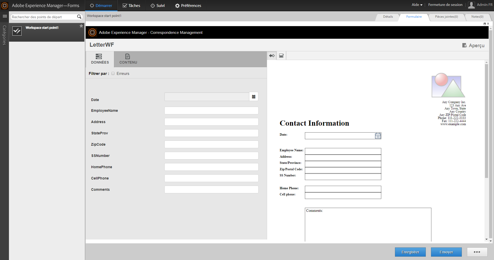

# Utilisation des jeux de formulaires dans l’espace de travail AEM Forms{#working-with-formsets-in-aem-forms-workspace}

Un jeu de formulaires est un assortiment de formulaires HTML5 regroupés et présentés comme un ensemble unique de formulaires aux utilisateurs finaux. Lorsque les utilisateurs finaux commencent à compléter un jeu de formulaires, ils passent facilement d’un formulaire à l’autre. Le jeu de formulaires peut ensuite être envoyé en un simple clic. For more info on formsets and how to set them up, see [Formset in AEM Forms](../../forms/using/formset-in-aem-forms.md).

L’espace de travail AEM Forms prend en charge les jeux de formulaires. Avec les jeux de formulaires, plusieurs formulaires associés à un service ou processus peuvent être regroupés pour automatiser un processus d’entreprise et présentés aux utilisateurs finaux. Dans ce cas, les utilisateurs peuvent remplir le jeu entier comme un seul et il n’est pas nécessaire de classer, envoyer et suivre des processus ou des formulaires individuels.

## Comment joindre un jeu de formulaires au point de départ dans l’application d’espace de travail AEM Forms {#attaching-a-formset-to-startpoint-in-an-aem-forms-workspace-app-br}

1. Créez un flux de processus d’entreprise dans Workbench. For more information, see [Workbench help](https://www.adobe.com/go/learn_aemforms_workbench_63).
1. From the process properties of the startpoint, select **Use A CRX Asset** in Presentation &amp; Data.

   

1. Click  (Browse) next to the CRX asset path. La boîte de dialogue Sélection de l’actif de formulaire s’affiche.

   

1. Click the **Formset** tab, select the relevant formset from the list, and then click **OK**.

1. Déployez l’application après avoir mis à jour d’autres propriétés de processus appropriées.

## Utilisation des jeux de formulaires dans l’espace de travail AEM Forms {#using-formset-in-nbsp-aem-forms-workspace}

Une fois qu’un jeu de formulaires est attaché à un point de départ, ce dernier peut être appelé, comme tout autre point de départ, à partir de l’espace de travail AEM Forms.

Les opérations prises en charge sur le jeu de formulaires via l’espace de travail AEM Forms sont les suivantes :

* Enregistrer en tant que brouillon
* Verrouiller
* Abandonner
* Envoyer
* Ajouter des pièces jointes
* Ajouter des remarques
* Se déplacer d’un formulaire à l’autre au sein d’un jeu de formulaires à l’aide des boutons Précédent et Suivant

>[!NOTE]
>
>Pour améliorer les performances durant le déplacement d’un formulaire à l’autre d’un jeu de formulaires, tous les boutons de l’espace de travail (Précédent, Suivant, Envoyer, etc.) sont désactivés jusqu’à ce que le formulaire approprié soit complètement rendu.

