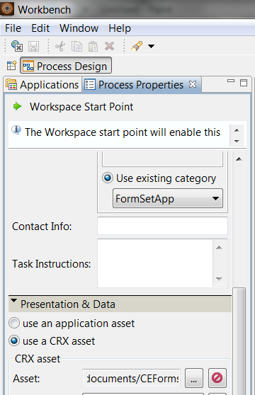

# Utiliser des jeux de formulaires dans l’espace de travail AEM Forms{#working-with-formsets-in-aem-forms-workspace}

Un jeu de formulaires est un ensemble de formulaires HTML5 regroupés et présentés aux utilisateurs finaux sous la forme d’un jeu unique de formulaires. Lorsque les utilisateurs finaux commencent à remplir un jeu de formulaires, ils passent facilement d’un formulaire à un autre. Le jeu de formulaires peut ensuite être envoyé en un seul clic. Pour plus d’informations sur les jeux de formulaires et la manière de les configurer, consultez [Jeux de formulaires dans AEM Forms](../../forms/using/formset-in-aem-forms.md).

L’espace de travail AEM Forms prend en charge les jeux de formulaires. Avec les jeux de formulaires, plusieurs formulaires associés à un service ou à un processus peuvent être regroupés pour automatiser un processus d’entreprise et présentés aux utilisateurs finaux. Dans ce cas, les utilisateurs peuvent remplir l’ensemble comme un seul et même ensemble et il n’est pas nécessaire de générer, d’envoyer et de suivre des formulaires ou processus individuels.

## Comment joindre un jeu de formulaires au point de départ dans l’application d’espace de travail AEM Forms {#attaching-a-formset-to-startpoint-in-an-aem-forms-workspace-app-br}

1. Créez un flux de processus d’entreprise dans Workbench. Pour plus d’informations, consultez l’[aide de Workbench](https://www.adobe.com/go/learn_aemforms_workbench_63_fr).
1. Dans les propriétés de processus du point de départ, sélectionnez **Utiliser une ressource CRX** dans Présentation et Données.

   

1. Cliquez sur  (Parcourir) à côté du chemin d’accès à la ressource CRX. La boîte de dialogue Sélection de l’actif de formulaire s’affiche.

   

1. Cliquez sur l’onglet **Jeu de formulaires**, sélectionnez le jeu de formulaires approprié dans la liste, puis cliquez sur **OK**.

1. Déployez l’application après avoir mis à jour les autres propriétés pertinentes du processus.

## Utilisation des jeux de formulaires dans l’espace de travail AEM Forms {#using-formset-in-nbsp-aem-forms-workspace}

Une fois qu’un jeu de formulaires est attaché à un point de départ, ce dernier peut être appelé, comme n’importe quel autre, depuis l’espace de travail d’AEM Forms.

Les opérations prises en charge sur le jeu de formulaires via l’espace de travail AEM Forms sont les suivantes :

* Enregistrer en tant que brouillon
* Verrouiller
* Abandonner
* Envoyer
* Ajouter des pièces jointes
* Ajouter des remarques
* Se déplacer d’un formulaire à l’autre au sein d’un jeu de formulaires à l’aide des boutons Précédent et Suivant

>[!NOTE]
>
>Pour améliorer les performances durant le déplacement d’un formulaire à l’autre d’un jeu de formulaires, tous les boutons de l’espace de travail (Précédent, Suivant, Envoyer, etc.) sont désactivés jusqu’à ce que le formulaire approprié soit complètement rendu.
