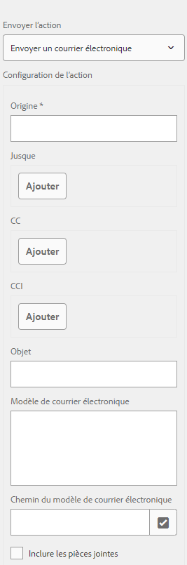

# Envoi d’un accusé de réception d’envoi de formulaire par courrier électronique {#sending-a-form-submission-acknowledgement-via-email}

## Envoi de données de formulaire adaptatif {#adaptive-form-data-submission}

Les formulaires adaptatifs fournissent plusieurs flux de travaux [d’actions Envoyer](../../forms/using/configuring-submit-actions.md) prêts à l’emploi pour envoyer les données de formulaire à différents points de terminaison.

For example, the **[!UICONTROL Send email]** submit action sends an email on successful submission of an adaptive form. Elle peut également être configurée pour envoyer les données de formulaire et le fichier PDF dans le courrier électronique.

Cet article décrit la procédure pour activer l’action Courrier électronique dans un formulaire adaptatif et les différentes configurations fournies.

>[!NOTE]
>
>You can also use the **[!UICONTROL Send PDF via email]** option to send the completed form by email as a PDF attachment. The configuration options available for this action are the same as the options available for the **[!UICONTROL Send email]** action. L’action PDF par courrier électronique est disponible uniquement pour les formulaires adaptatifs basés sur XFA.

## Action Envoyer un courrier électronique {#email-action}

L’action Envoyer un courrier électronique permet à un auteur d’envoyer automatiquement un courrier électronique à un ou plusieurs lors de l’envoi réussi d’un formulaire adaptatif.

>[!NOTE]
>
>To use the Send email action, you need to configure the AEM mail service as described in [Configuring the mail service](/help/sites-administering/notification.md#configuring-the-mail-service).

### Enabling Send email action on an adaptive form {#enabling-email-action-on-an-adaptive-form}

1. Open an adaptive form in **[!UICONTROL edit]** mode.

1. Dans l’onglet **[!UICONTROL Contenu]** , appuyez sur **[!UICONTROL de de]** formulaire et appuyez sur  pour  les propriétés du formulaire adaptatif.

1. In the **[!UICONTROL Submission]** section, select **[!UICONTROL Send email]** from the **[!UICONTROL Submit Action]** drop-down list.

   

1. Specify valid email IDs in the **[!UICONTROL To]**, **[!UICONTROL CC]**, and **[!UICONTROL BCC]** fields.

   Specify the subject and the body of the email in the **[!UICONTROL Subject]** and **[!UICONTROL Email Template]** fields, respectively.

   Vous pouvez également spécifier des espaces réservés aux variables dans les champs. Dans ce cas, les valeurs des champs sont traitées lorsque le formulaire est envoyé par un utilisateur final. Pour plus d’informations, voir [Utilisation des noms de champ de formulaire adaptatif pour créer dynamiquement le contenu d’un courrier électronique](../../forms/using/form-submission-receipt-via-email.md#p-using-adaptive-form-field-names-to-dynamically-create-email-content-p).

   Select **[!UICONTROL Include attachments]** if the form includes file attachments and you want to attach these files in the email.

   >[!NOTE]
   >
   >If you choose the **[!UICONTROL Send PDF via Email]** option, you must select the Include attachments option.

1. Click  to save the changes.

### Utilisation des noms de champ de formulaire adaptatif pour créer dynamiquement le contenu d’un courrier électronique {#using-adaptive-form-field-names-to-dynamically-create-email-content}

Dans un formulaire adaptatif, les noms de champ sont appelés espaces réservés. Ils sont remplacés par la valeur du champ après l’envoi du formulaire par un utilisateur.

In the **[!UICONTROL Send email]** action, you can use placeholders that are processed when the action is performed. It implies that the headers of the email (such as **[!UICONTROL To]**, **[!UICONTROL CC]**, **[!UICONTROL BCC]**, **[!UICONTROL Subject]**) are generated when the user submits the form.

Pour définir un espace réservé, spécifiez `${<field name>}` dans un champ après avoir sélectionné **[!UICONTROL Envoyer un courrier électronique]** comme action d’envoi.

For example, if the form contains the **[!UICONTROL Email address]** field, named `email_addr`, for capturing the email ID of a user, you can specify the following in the **[!UICONTROL To]**, **[!UICONTROL CC]**, or **[!UICONTROL BCC]** fields.

`${email_addr}`

Lorsqu’un utilisateur envoie le formulaire, un courrier électronique est envoyé à l’identifiant d’adresse électronique entré dans le champ `email_addr` du formulaire.

>[!NOTE]
>
>Vous pouvez trouver le nom d’un champ dans la boîte de dialogue **[!UICONTROL Modifier]** de ce champ.

Variable placeholders can also be used in the **[!UICONTROL Subject]** and **[!UICONTROL Email Template]** fields.

Par exemple :

`Hi ${first_name} ${last_name},`

`Your form has been received by our department. It usually takes ten business days to process the request.`

`Regards`

`Administrator`

>[!NOTE]
>
>Les champs des panneaux répétables ne peuvent pas être utilisés en tant qu’espaces réservés aux variables.

