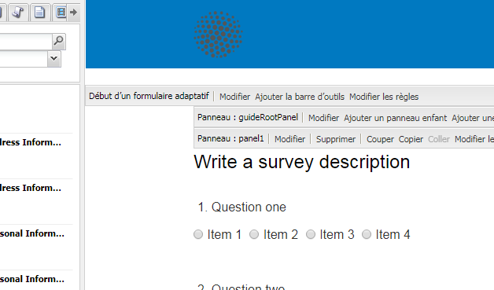

# Envoi d’un accusé de réception d’envoi de formulaire par courrier électronique{#sending-a-form-submission-acknowledgement-via-email}

## Envoi de données de formulaire adaptatif {#adaptive-form-data-submission}

Les formulaires adaptatifs fournissent plusieurs flux de travaux [d’actions Envoyer](../../forms/using/configuring-submit-actions.md) prêts à l’emploi pour envoyer les données de formulaire à différents points de terminaison.

For example, the **Email action** submit action sends an email on successful submission of an adaptive form. Elle peut également être configurée pour envoyer les données de formulaire et le fichier PDF dans le courrier électronique.

Cet article décrit la procédure pour activer l’action Courrier électronique dans un formulaire adaptatif et les différentes configurations fournies.

>[!NOTE]
>
>You can also use the **Email PDF action** to send the completed form by email as a PDF attachment. Les options de configuration disponibles pour cette action sont identiques à celles proposées pour l’action Courrier électronique. L’action PDF par courrier électronique est disponible uniquement pour les formulaires adaptatifs basés sur XFA.

## Action Courrier électronique {#email-action}

L’action Courrier électronique permet à un auteur d’envoyer automatiquement un courrier électronique à un ou plusieurs destinataires lors de l’envoi réussi d’un formulaire adaptatif.

>[!NOTE]
>
>Pour utiliser l’action Courrier électronique, vous devez configurer le service de messagerie AEM, comme décrit dans la section [Configuration du service de messagerie](/help/sites-administering/notification.md#configuring-the-mail-service).

### Activation de l’action Courrier électronique dans un formulaire adaptatif {#enabling-email-action-on-an-adaptive-form}

1. Ouvrez un formulaire adaptatif en mode d’édition.

1. Cliquez sur **Modifier** en regard de la barre d’outils **Début d’un formulaire adaptatif**.

   La boîte de dialogue Modifier le composant s’ouvre.

   

1. Select the **Submit actions** tab and choose **Email action** from the Submit action drop-down list.

   L’onglet affiche les options pour configurer l’action Courrier électronique pour le formulaire actif.

   

1. Spécifiez des identifiants d’adresse électronique valides dans les champs De, CC et Cci.

   Indiquez l’objet et le corps du message dans les champs respectifs Objet et Modèle de courrier électronique.

   Vous pouvez également spécifier des espaces réservés aux variables dans les champs. Dans ce cas, les valeurs des champs sont traitées lorsque le formulaire est envoyé par un utilisateur final. Pour plus d’informations, voir [Utilisation des noms de champ de formulaire adaptatif pour créer dynamiquement le contenu d’un courrier électronique](../../forms/using/form-submission-receipt-via-email.md#p-using-adaptive-form-field-names-to-dynamically-create-email-content-p).

   Cochez la case Inclure les pièces jointes si le formulaire contient des pièces jointes et si vous souhaitez joindre ces fichiers au courrier électronique.

   >[!NOTE]
   >
   >Si vous sélectionnez **Action PDF par courrier électronique**, vous devez sélectionner l’option Inclure les pièces jointes.

1. Pour enregistrer les modifications, cliquez sur **OK.**

### Utilisation des noms de champ de formulaire adaptatif pour créer dynamiquement le contenu d’un courrier électronique {#using-adaptive-form-field-names-to-dynamically-create-email-content}

Dans un formulaire adaptatif, les noms de champ sont appelés espaces réservés. Ils sont remplacés par la valeur du champ après l’envoi du formulaire par un utilisateur.

Sous l’onglet Action Courrier électronique, vous pouvez utiliser des espaces réservés qui sont traités lorsque l’action est effectuée. Cela implique que les en-têtes du courrier électronique (tels que De, CC, Cci et Objet) soient générés lorsque l’utilisateur envoie le formulaire.

To define a placeholder, specify `${<field name>}` in a field in the Submit actions tab.

Par exemple, si le formulaire contient le champ **Adresse électronique**, appelé `email_addr`, pour capturer l’identifiant d’adresse électronique d’un utilisateur, vous pouvez spécifier les valeurs suivantes dans les champs De, CC ou Cci.

`${email_addr}`

Lorsqu’un utilisateur envoie le formulaire, un courrier électronique est envoyé à l’identifiant d’adresse électronique entré dans le champ `email_addr` du formulaire.

>[!NOTE]
>
>Vous pouvez trouver le nom d’un champ dans la boîte de dialogue **Modifier** de ce champ.

Les espaces réservés aux variables peuvent également être utilisés dans les champs **Objet** et **Modèle de courrier électronique.**

Par exemple :

`Hi ${first_name} ${last_name},`

`Your form has been received by our department. It usually takes ten business days to process the request.`

`Regards`

`Administrator`

>[!NOTE]
>
>Les champs des panneaux répétables ne peuvent pas être utilisés en tant qu’espaces réservés aux variables.

