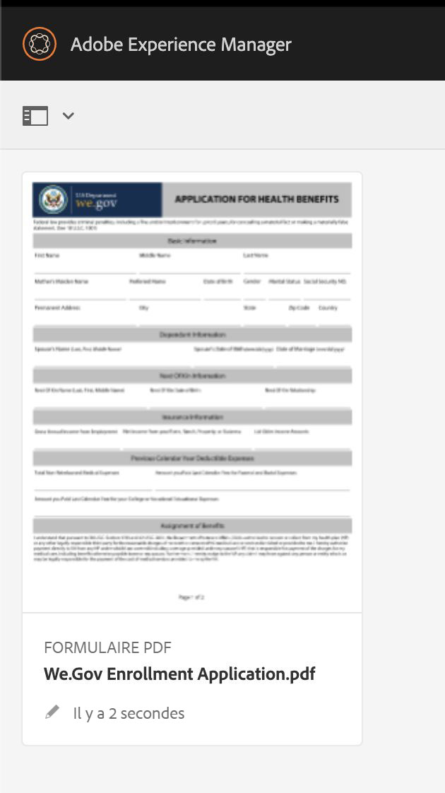
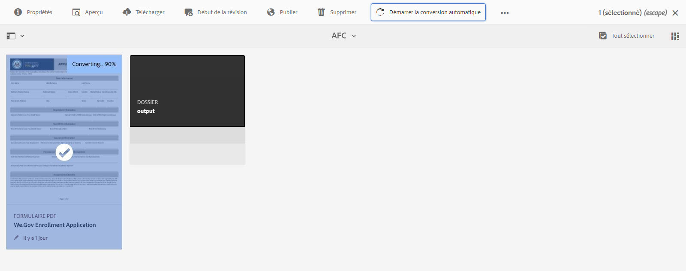
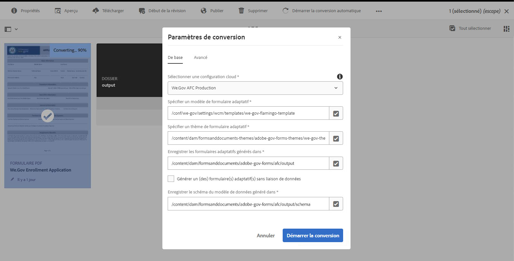
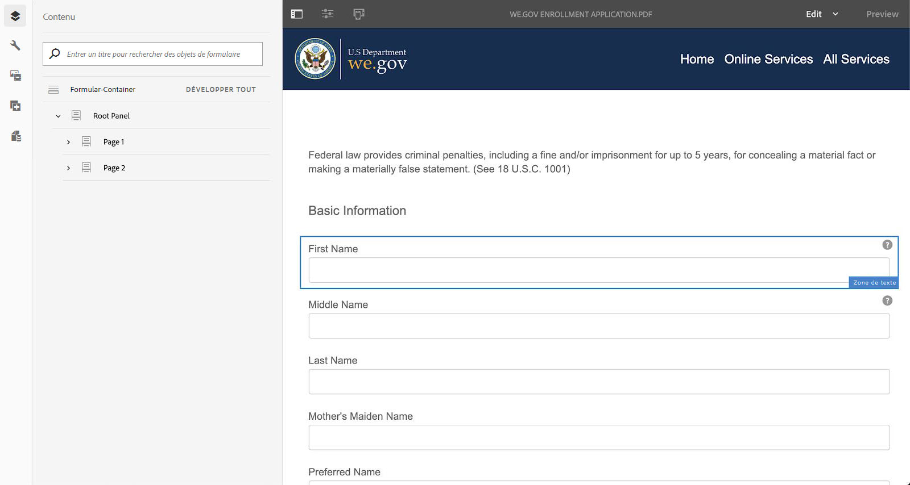
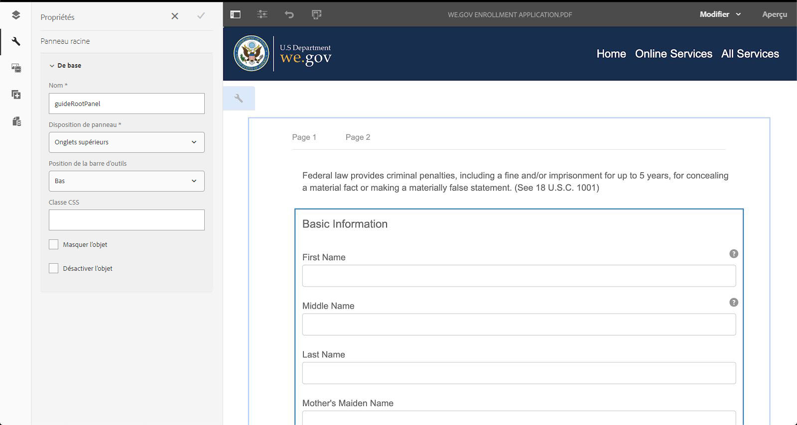
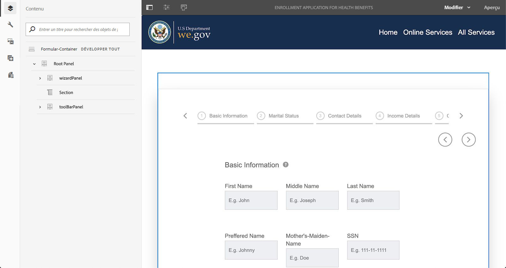
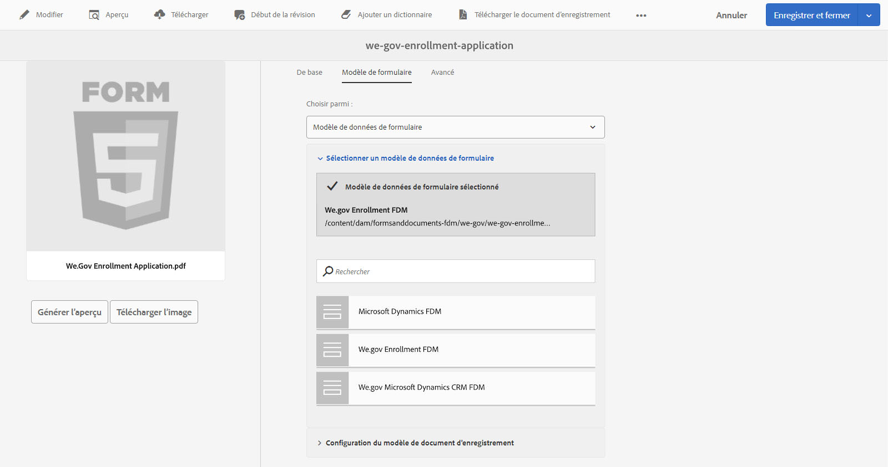
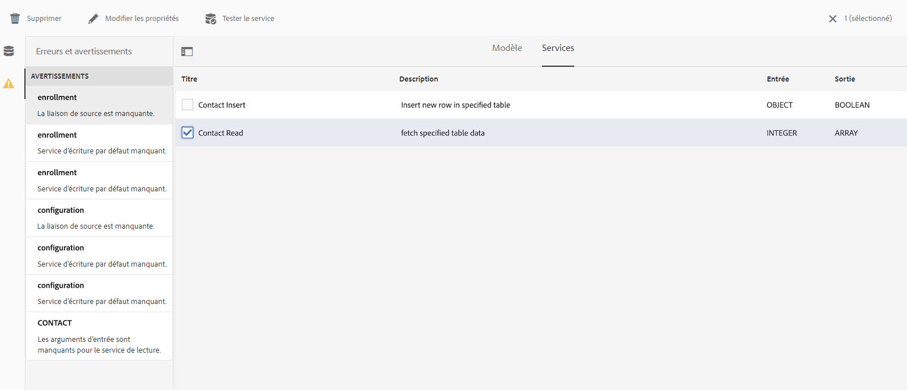
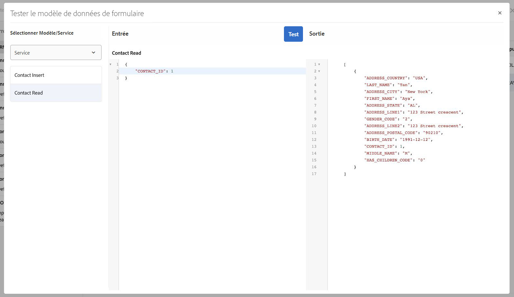

# Présentation du site de référence We.Gov {#we-gov-reference-site-walkthrough}

## Conditions préalables {#pre-requisites}

Set up the reference site as described in [Set up and configure We.Gov reference site](../../forms/using/forms-install-configure-gov-reference-site.md).

## Article utilisateur {#user-story}

* AEM Forms

   * Conversion de formulaires automatisée
   * Création  
   * Modèles de données de formulaire/Sources de données

* AEM Forms

   * Capture des données
   * (Facultatif) Intégration de données (MS Dynamics)
   * (Facultatif) Adobe Sign

* Workflow
* Notifications par e-mail
* (Facultatif) Communications client

   * Canal d’impression
   * Canal web

* Adobe Analytics
* Intégrations des sources de données

### Fictitious users and groups {#fictitious-users-and-groups}

Le paquet de démonstration We.Gov est fourni avec les utilisateurs fictifs intégrés suivants :

* **Aya Tan**: Citoyen éligible à un Service d&#39;une agence gouvernementale


* **George Lang**: Analyste d&#39;affaires de l&#39;agence We.Gov


* **Camila Santos**: Directeur CX de l&#39;agence We.Gov


Les groupes suivants sont également inclus :

* **Utilisateurs de We.Gov Forms**

   * George Lang (membre)
   * Camila Santos (membre)

* **Utilisateurs Web.Gov**

   * George Lang (membre)
   * Camila Santos (membre)
   * Aya Tan (membre)

### Légende des termes de présentation de la démonstration {#demo-overview-terms-legend}

1. **Se faire passer pour**: Utilisateurs et groupes définis dans AEM démonstration.
1. **Bouton**: Rectangle coloré ou flèche circulaire pour la navigation.
1. **Cliquez sur**: Pour exécuter une action dans l’article utilisateur.
1. **Liens**: Situé en haut du menu principal du site Web We.Gov.
1. **Instructions** utilisateur : Ensemble d’étapes numériques à suivre pour parcourir l’article de l’utilisateur.
1. **Portail** Forms : *https://&lt;aemserver>:&lt;port>/content/we-gov/formsportal.html*
1. **Vue** mobile : utilisateur We.Gov pour répliquer une vue mobile avec un navigateur redimensionné.
1. **Vue** de bureau : Démo de l&#39;utilisateur We.gov vers la vue sur un ordinateur portable ou un ordinateur de bureau.
1. **Formulaire** pré-écran : Formulaire sur la Page d&#39;accueil du site We.Gov.
1. **Formulaire** adaptatif : Formulaire de demande d&#39;inscription pour la démonstration We.gov.

   *https://&lt;aemserver>:&lt;port>/content/forms/af/adobe-gov-forms/enrollment-application-for-health-benefits.html*

1. **adobe Site** We.Gov : *https://&lt;aemserver>:&lt;port>/content/we-gov/home.html*
1. **Boîte de réception** Adobe : Icône [](assets/bell.svg) Bell située dans la barre de menu supérieure dans AEM backend.

   *https://&lt;aemserver>:&lt;port>/aem/start.html*

1. **Client** de messagerie : Moyen privilégié de vue de vos e-mails (Gmail, Outlook)
1. **DEC**: Appel à l&#39;action
1. **Naviguer**: Pour localiser un point de référence spécifique sur la page du navigateur.
1. **AFC**: Conversion Forms automatisée

## Conversion Forms automatisée (Camila) {#automated-forms-conversion}

**Cette section**: Camila the CX Lead dispose d’un formulaire PDF existant qui a été utilisé dans le cadre d’un processus papier. Dans le cadre d’un effort de modernisation, elle souhaite utiliser ce formulaire PDF pour créer automatiquement une nouvelle Forms adaptative moderne.

### Conversion automatisée de Forms - We.Gov (Camila) {#automated-forms-conversion-wegov}

1. Accédez à *https://&lt;aemserver>:&lt;port>/aem/start.html*

1. Connexion par :
   * **Utilisateur**: camila.santos
   * **Mot de passe** : password
1. Dans la page principale, sélectionnez Forms > Forms &amp; Documents > AEM Forms We.gov Forms > AFC.
1. Camila télécharge le PDF en AEM Forms.

   

1. Camilla sélectionne ensuite le formulaire PDF et clique sur Conversion **automatisée du** Début pour début du processus de conversion. Vous devrez peut-être cliquer sur **Remplacer la conversion** si vous avez converti le formulaire.

   >[!NOTE]
   >
   >Notez que les paramètres d&#39;AFC sont préconfigurés pour l&#39;utilisateur final, ce qui signifie qu&#39;ils ne doivent pas être modifiés.

   * **Facultatif**: Si vous souhaitez utiliser le thème Accessible Ultramarine, cliquez simplement sur le thème Spécifier un formulaire adaptatif et sélectionnez le thème Accessible-Ultramarine qui apparaît dans la liste des options.

   

   

   Le pourcentage d’achèvement de l’état s’affiche pendant la conversion. Une fois que l’état affiche **Converted**, cliquez sur le dossier **output** , sélectionnez le formulaire adaptatif et cliquez sur **Modifier** pour ouvrir le formulaire converti.

1. Camilla examine ensuite le formulaire et s’assure que tous les champs sont présents.

   

1. Camilla effectue ensuite des débuts pour modifier le formulaire. Elle sélectionne Panneau racine > Modifier (la clé à molette) > sélectionne Onglets en haut dans le menu déroulant Disposition du panneau > sélectionne la case à cocher.

   

1. Camilla ajoute ensuite toutes les transformations CSS et les modifications de terrain nécessaires pour produire le produit final.

   

### Modèle de données de formulaire et sources de données (Camila) {#data-sources}

**Cette section**: Une fois que le document a été converti et créé un formulaire adaptatif, Camila doit alors connecter le formulaire adaptatif à une source de données.

1. Camila ouvre les Propriétés sur le formulaire qui a été converti en Conversion [automatisée Forms - We.Gov](#automated-forms-conversion-wegov).

1. Camila sélectionne ensuite Modèle de formulaire > Sélectionne Modèle de données de formulaire dans la liste déroulante Sélectionner dans > Sélectionne l&#39;inscription We.gov FDM à partir de la liste de l&#39;option.

1. Cliquez sur le bouton Enregistrer et fermer.

   

1. Camila clique sur le dossier **output** , sélectionne le formulaire adaptatif et clique sur **Modifier** pour ouvrir le formulaire We.Gov rempli.
1. Camila sélectionne un champ de formulaire adaptatif et clique sur l&#39;icône Configurer. Elle crée une liaison avec les entités du modèle de données de formulaire à l’aide du champ Référence **de** liaison. Elle répète cette étape pour tous les champs du formulaire adaptatif.

### Test d’accessibilité des formulaires (Camila) {#form-accessibility-testing}

Camila valide également que le contenu créé est construit correctement et entièrement accessible selon les standards de l&#39;entreprise.

1. Camila clique sur le dossier **output** , sélectionne le formulaire adaptatif et clique sur **Prévisualisation** pour ouvrir le formulaire We.Gov complété.

1. Ouvre l’onglet Audit dans l’outil de développement Chrome.

1. Effectue une vérification de l’accessibilité afin de valider le formulaire adaptatif.

   

## Démo de la Vue mobile de formulaire adaptatif (Aya) {#mobile-view-demo}

**Cette section doit être exécutée avant la manifestation.**

**Instructions utilisateur :**

1. Accédez à : *https://&lt;aemserver>:&lt;port>/content/we-gov/home.html*
1. Connexion par :

   1. **Utilisateur**: aya.tan
   1. **Mot de passe** : password

1. Redimensionnez la fenêtre du navigateur ou utilisez l’émulateur du navigateur pour reproduire la taille d’un périphérique mobile.

### Site Web We.Gov (Aya) {#aya-user-story-we-gov-website}


**Cette section**: Aya est citoyenne. Elle apprend d&#39;une amie qu&#39;elle peut être admissible à recevoir un Service d&#39;une agence gouvernementale. Aya accède au site Web We.Gov à partir de son téléphone portable pour en savoir plus sur les services auxquels elle a droit.

### We.Gov Pre-Screener (Aya) {#aya-user-story-we-gov-pre-screener}

Aya répond à quelques questions pour confirmer son éligibilité en remplissant un court formulaire adaptatif sur son téléphone portable.

**Instructions utilisateur :**

1. Effectuez une sélection dans chaque champ déroulant.

   >[!NOTE]
   >
   >Si l’utilisateur gagne plus de 200 000 $ par année, il n’est pas admissible.

1. Cliquez sur &quot;**Suis-je éligible ?**” button.
1. Cliquez sur le bouton &quot;**Appliquer maintenant**&quot; pour continuer.

   

### Formulaire adaptatif We.Gov (Aya) {#aya-user-story-we-gov-adaptive-form}

Aya découvre qu&#39;elle est éligible et commence à remplir sa demande de service sur son appareil mobile.

Aya doit passer en revue certains documents à la maison avant de pouvoir remplir la demande de service. Elle enregistre et quitte l&#39;application depuis son appareil mobile.

**Instructions utilisateur :**

1. Renseignez les champs Informations de base, les champs et listes déroulantes obligatoires suivants sont requis :

   1. Informations de base

      1. Prénom
      1. Nom
      1. DOB
      1. Email

1. Utilisez la logique **** dynamique suivante pour démontrer la fonctionnalité dynamique à l’aide de la liste déroulante État **de la** famille :

   1. **Simple**: Afficher le prochain panneau de mise en page
   1. **Marié**: Afficher le panneau dépendant du mariage
   1. **Divorcé**: Afficher le prochain panneau de mise en page
   1. **veuf**: Afficher le prochain panneau de mise en page
   1. **Avez-vous des enfants ?**: (Oui/Non) pour afficher le panneau enfant à charge.

      1. (Ajouter/Supprimer) pour ajouter/supprimer plusieurs panneaux enfant dépendants.

1. Cliquez sur la flèche droite dans la barre de menus grise.
1. Cliquez sur le bouton Enregistrer en bas.

   

## Démo de bureau {#desktop-demo}

**Cette section :** De retour à la maison, Aya a trouvé les informations dont elle avait besoin et reprend l&#39;application depuis son bureau. Aya accède au portail de formulaires en ligne pour reprendre sa demande. Avec une personnalisation simple, les agences peuvent également générer automatiquement et envoyer par courrier électronique un lien pour reprendre l&#39;application.

### Formulaire adaptatif Continued (Aya) {#aya-user-story-continued-adaptive-form}

**Instructions utilisateur :**

1. Accédez à *https://&lt;aemserver>:&lt;port>/content/we-gov/home.html*
1. Dans la barre de navigation, sélectionnez &quot;Services **** en ligne&quot;.
1. Dans le panneau &quot;Version préliminaire de Forms&quot;, sélectionnez l’option existante &quot;Demande d’inscription pour les prestations de santé&quot;.

   

   L&#39;apparence est la même, et elle n&#39;a pas besoin de saisir à nouveau des données.

   **Instructions utilisateur :**

1. Cliquez sur Circle CTA à droite pour passer à la section suivante.

   

   Le formulaire est renseigné jusqu’au point de la dernière entrée d’Aya. Aya a entré toutes ses informations et est prête à les envoyer.

   

   >[!NOTE]
   >
   >Lorsqu&#39;Aya remplit le champ du numéro de téléphone, elle doit le remplir sous la forme d&#39;un numéro continu à 11 chiffres sans tirets, espaces ou traits d&#39;union.

   Après avoir envoyé Aya reçoit une page de remerciement. Il est possible qu&#39;elle reçoive également un courriel qu&#39;elle peut ouvrir pour signer le document d&#39;enregistrement par voie électronique avec Adobe Sign.

### Facultatif : adobe sign (Aya) {#adobe-sign}

**Instructions utilisateur :**

1. Accédez à votre client de messagerie et recherchez le courrier électronique Adobe Sign.
1. Cliquez sur le lien vers Adobe Sign.

   

**Instructions utilisateur :**

1. Cochez la case &quot;**Je suis d&#39;accord**&quot;.
1. Cliquez sur &quot;**Accepter**&quot;.
1. Faites défiler l’écran jusqu’au bas du document consulté.
1. Cliquez sur l&#39;onglet jaune surligné pour signer le document.

    

## Agent du gouvernement (George) {#government-agent-george}


**Cette section :** George est analyste d&#39;affaires à l&#39;agence gouvernementale Aya demande un service à . George a un tableau de bord unique où il peut voir toutes les demandes de service qui lui ont été assignées pour examen.

### Boîte de réception AEM (George) {#george-user-story-aem-inbox}

**Instructions utilisateur :**

1. Accédez à *https://&lt;aemserver>:&lt;port>/aem/start.html*
1. Cliquez sur l&#39;icône de l&#39;utilisateur (en haut à droite) et utilisez l&#39;option de menu &quot;**Se déconnecter**&quot; ou &quot;**Se faire passer pour**&quot; si vous êtes actuellement connecté avec un utilisateur administratif.

   1. Connexion par :

      1. **Utilisateur :** george.lang
      1. **Mot de passe :** password
   1. Ou s&#39;emprunt d&#39;identité :

      1. Tapez &quot;**George**&quot; dans le champ &quot;**Impersonate as**&quot;.

      1. Cliquez sur OK pour vous faire passer pour une identité.


1. Dans le coin supérieur droit, cliquez sur l’icône Notification (cloche).
1. Cliquez sur &quot;**Vue tout**&quot; pour accéder à la boîte de réception.
1. Dans la boîte de réception, ouvrez la dernière tâche &quot;**Health Benefits Application Review**&quot;.

   

### Facultatif : aem Boîte de réception et MS Dynamics (George) {#george-user-story-aem-inbox-and-ms-dynamics}

Grâce aux intégrations de données et aux workflows automatisés, l’application d’Aya apparaît, ainsi qu’un enregistrement CRM qui a été généré automatiquement lors de l’envoi des données.

**Instructions utilisateur :**

1. Ouvrez et examinez le formulaire adaptatif en lecture seule.
1. Cliquez sur le bouton &quot;**Ouvrir MS Dynamics**&quot; pour ouvrir l&#39;enregistrement MS Dynamics dans une nouvelle fenêtre.
1. Dans la gestion de la relation client, toutes les informations peuvent être mises à jour.

   1. Vous pouvez éventuellement ajouter des notes de révision directement dans Dynamics.

1. Fermez la boîte de réception et revenez à AEM.

   

### Retour à AEM boîte de réception (George) {#george-user-story-back-to-aem-inbox}

George approuve la demande d’Aya et, grâce à un processus automatisé existant, un courrier électronique de confirmation est également envoyé à Aya.

**Instructions utilisateur :**

1. Accédez au coin supérieur gauche et cliquez sur &quot;**Approuver**&quot; pour approuver la demande.
1. Dans le module modal, vous pouvez laisser un message pour la piste CX.
1. Cliquez sur Done (Terminé). 
1. (Rôle Citoyen) Ouvrez votre client de messagerie pour vue à l’e-mail envoyé à Aya.

   

## CX Lead (Camila) {#cx-lead-camila}


**Cette section :** Camila the CX Lead lance un appel téléphonique de bienvenue avec Aya pour expliquer comment utiliser les services gouvernementaux pour lesquels elle a été approuvée.

### (Facultatif) AEM boîte de réception et MS Dynamics {#camila-user-story-aem-inbox-ms-dynamics}

**Instructions utilisateur :**

1. Accédez à *https://&lt;aemserver>:&lt;port>/aem/start.html*
1. Cliquez sur l&#39;icône de l&#39;utilisateur (en haut à droite) et utilisez l&#39;option de menu &quot;**Se déconnecter**&quot; ou &quot;**Se faire passer pour**&quot; si vous êtes actuellement connecté avec un utilisateur administratif.

   1. Connexion par :

      1. **Utilisateur**: camila.santos
      1. **Mot de passe** : password
   1. Ou s&#39;emprunt d&#39;identité :

      1. Tapez &quot;**Camila**&quot; dans le champ &quot;**Impersonate as**&quot;.

      1. Cliquez sur OK pour vous faire passer pour une identité.


1. Dans le coin supérieur droit, cliquez sur l’icône Notification (sonnerie).
1. Cliquez sur &quot;**Vue tout**&quot; pour accéder à la boîte de réception.
1. Dans la boîte de réception, ouvrez la dernière tâche &quot;**Nouvelle approbation** de contact&quot;.


**(Facultatif) Instructions utilisateur :**

1. Ouvrez et examinez le formulaire adaptatif en lecture seule.
1. Cliquez sur le bouton &quot;**Ouvrir MS Dynamics**&quot; pour ouvrir l&#39;enregistrement MS Dynamics dans une nouvelle fenêtre.
1. Dans la gestion de la relation client, toutes les informations peuvent être mises à jour.

   1. Vous pouvez éventuellement ajouter une nouvelle activité d&#39;appel directement dans Dynamics.
   1. Ouvrez la section &quot;**Activités**&quot;.
   1. Cliquez sur l&#39;option &quot;**Nouvel appel** téléphonique&quot;.
   1. ajouter les détails de l&#39;appel téléphonique.
   1. Enregistrez et fermez la fenêtre.

1. De retour en AEM, accédez au coin supérieur gauche et cliquez sur &quot;**Envoyer**&quot; pour envoyer la demande.
1. Dans le module, vous pouvez laisser un message.
1. Cliquez sur Done (Terminé). 

    

## (Facultatif) Kit de bienvenue Citoyen (Aya) {#welcome-kit-citizen-aya}

**Cette section :** Aya reçoit un courriel qui contient un lien vers une communication interactive qui résume ses avantages et comprend également des champs de formulaire à remplir. Avec un énoncé des avantages PDF joint et un lien vers une lettre de communication interactive dans le courrier (avec le même thème/marque que la communication interactive).

### Notification client par courrier électronique (Aya) {#aya-user-story-email-client}

**Instructions utilisateur :**

1. Recherchez et ouvrez le courrier électronique du kit de bienvenue.
1. Faites défiler la page jusqu’à la pièce jointe PDF au bas de la page.
1. Cliquez sur pour ouvrir la pièce jointe PDF.
1. Faites défiler la page vers le haut dans votre client de messagerie et cliquez sur &quot;Kit de bienvenue **Vue en ligne**&quot;.

   1. Ceci ouvrira la version du canal Web du même document.

1. Pour obtenir une référence rapide au format PDF directement :

   *https://&lt;aemserver>:&lt;port>/aem/formdetails.html/content/dam/formsanddocuments/adobe-gov-forms/welcome-handbook/we-gov-welcome-handbook*

1. Pour une référence rapide à IC directement :

   *https://&lt;aemserver>:&lt;port>/content/dam/formsanddocuments/adobe-gov-forms/welcome-handbook/we-gov-welcome-handbook/jcr:content?canal=web&amp;mode=prévisualisation&amp;wcmmode=disabled*

    des avantages de bienvenue Lien de communication 

## Renouvellement du rappel citoyen (Aya) {#renewal-reminder-citizen-aya}

**Cette section :** Camila planifie aussi un rappel de communication un an plus tard. (Etape de flux de travail qui automatise/s’exécute et envoie des courriers électroniques).

### Notification client par courrier électronique (Aya) {#aya-user-story-email-client-updated}

**Instructions utilisateur :**

1. Accédez à votre client de messagerie.
1. Recherchez et ouvrez le courrier électronique Rappel de renouvellement.
1. Cliquez sur le bouton &quot;**Soumettre une nouvelle application**&quot; pour ouvrir le formulaire adaptatif.

   1. Cette section est volontairement laissée vide pour prendre en charge le préremplissage de données dans la phase 2.

   

## (Facultatif) Modèle de données de formulaire (Camila) {#form-data-model}

**Cette section**: Camila se rend à AEM Forms Data Integrations où elle peut exécuter un test rapide pour vérifier que les informations envoyées à la source de données externe via l’intégration du modèle de données de formulaire sont bien présentes.

### Modèle de données de formulaire (Camila) {#form-data-model-camila}

**Cette section**: Camila accède à la page Sources de données pour valider les données que le serveur a répliquées dans la base de données Derby.

1. Une fois l&#39;expérience utilisateur terminée et l&#39;envoi de l&#39;utilisateur terminé, Camila accède à l&#39;onglet Sources de données dans AEM Forms (**Forms** > **Data Integrations**).

1. Camila sélectionne ensuite AEM Forms **We.gov FDM** , puis modifie l&#39;inscription **We.gov FDM**.

1. Camila sélectionne ensuite le service **** Contact **>** Lecture à tester.

   

1. Camila fournit ensuite au service de test un ID de contact, puis clique sur le bouton Tester. Par exemple, 1 ou 2, si vous avez envoyé le formulaire. Si vous n’avez pas envoyé le formulaire, aucune donnée n’est renvoyée.

   

1. Camila peut ensuite vérifier que les données ont bien été insérées dans la source de données.

   * Les données du Derby DS ressemblent au format suivant :

   ```xml
      [
         {
         "ADDRESS_COUNTRY": "USA",
         "LAST_NAME": "Tan",
         "ADDRESS_CITY": "New York",
         "FIRST_NAME": "Aya",
         "ADDRESS_STATE": "AL",
         "ADDRESS_LINE1": "123 Street crescent",
         "GENDER_CODE": "2",
         "ADDRESS_LINE2": "123 Street crescent",
         "ADDRESS_POSTAL_CODE": "90210",
         "BIRTH_DATE": "1991-12-12",
         "CONTACT_ID": 1,
         "MIDDLE_NAME": "M",
         "HAS_CHILDREN_CODE": "0"
         }
   ]
   ```

## (Facultatif) Analyses (Camila) {#analytics-cx-lead-camila}

**Cette section :** Camila se rend dans un tableau de bord où elle peut voir à travers les indicateurs clés de performance de l&#39;agence, tels que le pourcentage de citoyens qui ont début à remplir un formulaire de demande de service et à abandonner, la durée moyenne entre la soumission de la demande et la réponse d&#39;approbation/refus, et les statistiques d&#39;engagement pour les manuels d&#39;avantages qu&#39;elle a envoyés aux citoyens.

### rapports de sites Adobe Analytics (Camila) {#camila-reviews-sites-reporting-we-gov-adobe-analytics}

1. Accédez à *https://&lt;aemserver>:&lt;port>/sites.html/content*
1. Sélectionnez &quot;Site **Web** AEM FormsGov&quot; pour vue des pages du site.
1. Sélectionnez l’une des pages du site (par exemple, Accueil), puis sélectionnez &quot;**Analytics &amp; Recommendations**&quot;.

   

1. Sur cette page, vous verrez les informations extraites d&#39;Adobe Analytics qui se rapportent à la page AEM Sites (REMARQUE : par conception, ces informations sont périodiquement actualisées à partir de l&#39;Adobe Analytics et ne sont pas affichées en temps réel).

   

1. De retour sur la page de vue de page (accessible à l’étape 3), vous pouvez également vue les informations de vue de page en modifiant le paramètre d’affichage en éléments de vue dans la &quot;Vue **de** Liste&quot;.
1. Recherchez le menu déroulant &quot;**Vue**&quot; et sélectionnez &quot;Vue **** Liste&quot;.

   

1. Dans le même menu, sélectionnez &quot;Paramètre **de** Vue&quot; et sélectionnez les colonnes à afficher dans la section &quot;**Analyses**&quot;.

   

1. Cliquez sur &quot;**Mettre à jour**&quot; pour rendre les nouvelles colonnes disponibles.

   

### rapports Adobe Analytics Forms (Camila) {#camila-reviews-forms-reporting-we-gov-adobe-analytics}

1. Accédez à .

   *https://&lt;aemserver>:&lt;port>/aem/forms.html/content/dam/formsanddocuments/adobe-gov-forms*

1. Sélectionnez le formulaire adaptatif &quot;Demande d’**inscription pour les avantages** pour la santé&quot; et sélectionnez l’option &quot;Rapport **** Analytics&quot;.

   

1. Attendez que la page se charge et vue les données du rapport Analytics.

   

