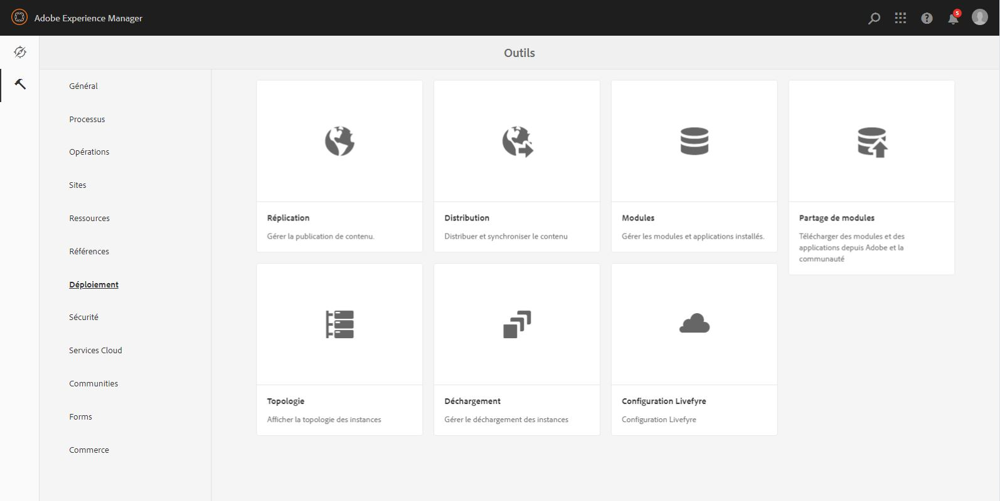
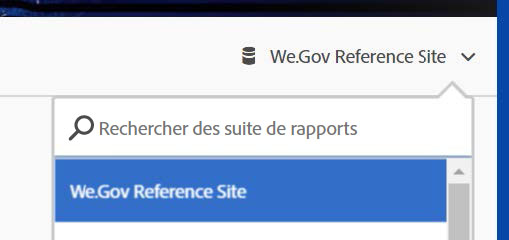
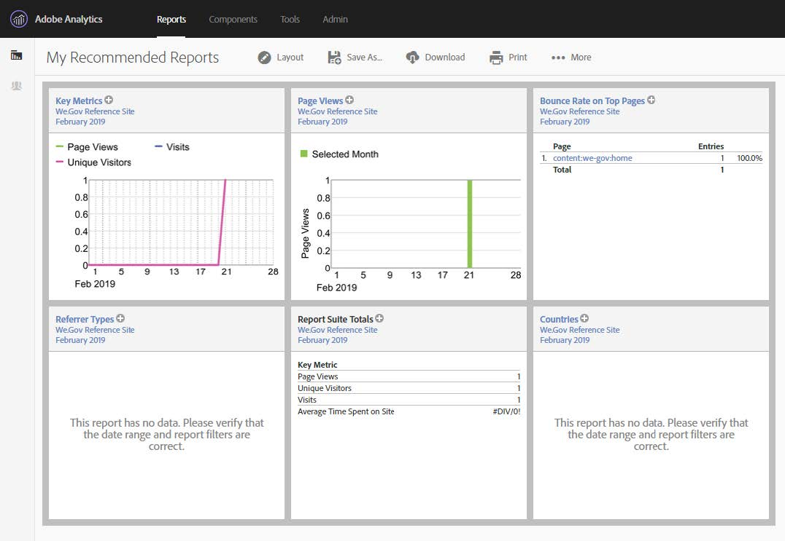

# Configuration du site de référence We.Gov{#set-up-and-configure-we-gov-reference-site}

## Détails du package de démonstration {#demo-package-details}

### Conditions préalables à l’installation {#installation-prerequisites}

Ce package a été créé pour **AEM Forms 6.4 OSGI Author**, a été testé et est donc pris en charge sur les versions de plateformes suivantes :

| VERSION AEM | VERSION DU PACKAGE AEM FORMS | ÉTAT |
|---|---|---|
| 6.4 | 5.0.86 | **Pris en charge** |
| 6.5 | 6.0.80 | **Pris en charge** |

Ce package contient une configuration de cloud qui prend en charge les versions de plateformes suivantes :

| FOURNISSEUR CLOUD | VERSION DU SERVICE | ÉTAT |
|---|---|---|
| Adobe Sign | API v5 | **Pris en charge** |
| Microsoft Dynamics 365 | 1710 (9.1.0.3020) | **Pris en charge** |

**Considérations relatives à l’installation du package :**

* Le paquet devrait être installé sur un serveur propre, sans les autres paquets de démonstration ni les versions antérieures des paquets de démonstration.
* Le package doit être installé sur un serveur OSGI, en mode Auteur.

### Qu’inclut ce package ? {#what-does-this-package-include}

Le package de démonstration AEM Forms We.Gov (**we-gov-forms.pkg.all-&lt;version>.zip**) est fourni sous la forme d’un package qui comprend plusieurs autres sous-packages et services. Le package comprend les modules suivants :

* **we-gov-forms.pkg.all-&lt;version>.zip** - Pack de démonstration *complet*

   * **we-gov-forms.ui.apps-&lt;version>.zip** *- contient tous les composants, bibliothèques client, exemples d’utilisateurs, modèles de flux de travail, etc.*

      * **we-gov-forms.core-&lt;version>.jar** - *contient tous les services OSGI, l’implémentation d’étape de flux de travail personnalisé, etc.*

      * **core.wcm.components.all-2.0.4.zip** - *Collection d’exemples de composants WCM*

      * **grid-aem.ui.apps-1.0-SNAPSHOT.zip** - Package de mise en page Grille de sites *AEM pour le contrôle de colonne de la page Sites*
   * **we-gov-forms.ui.content-&lt;version>.zip** - *contient tout le contenu, les pages, les images, les formulaires, les ressources de communication interactives, etc.*

   * **we-gov-forms.config.public-&lt;version>.zip** - *Contient tous les noeuds de configuration par défaut, y compris les configurations de cloud d’espace réservé pour éviter les modèles de données de formulaires et les problèmes de liaison de service.*

Les actifs inclus dans ce package sont les suivants :

* Pages du site AEM avec modèles modifiables
* Formulaires adaptatifs AEM Forms
* Communications interactives AEM Forms ( Impression et Web)
*  d’enregistrement XDP d’AEM Forms
* Modèle de données AEM Forms MS Dynamics Forms
* Intégration d’Adobe Sign
* Modèle de processus AEM
* Exemples d’images d’AEM Assets

## Options de configuration {#configuration-options}

Cette section comprend des détails sur les options de configuration. Actuellement, cette section est intentionnellement vide.

## Installation du package de démonstration {#demo-package-installation}

Cette section contient des informations sur l’installation du package de démonstration.

### From package share {#from-package-share}

1. Accédez à *https://&lt;aemserver>:&lt;port>/crx/packageshare/*

   Ou dans AEM, cliquez sur Déploiement et accédez à l’icône Package Share.

   

1. Connectez-vous à l’aide de votre Adobe ID.
1. Recherchez et recherchez le package **we-gov-forms.pkg.all-&lt;version>** .
1. Sélectionnez l’option &quot;Télécharger&quot; et acceptez les conditions générales.
1. Une fois téléchargé, sélectionnez l’option &quot;Téléchargé&quot; pour localiser le package dans Package Manager.
1. Sélectionnez l’option &quot;Installer&quot; pour installer le pack.

   

1. Autorisez le processus d’installation à se terminer.
1. Accédez à *https://&lt;aemserver>:&lt;port>/content/we-gov/home.html?wcmmode=disabled* pour vous assurer que l’installation a réussi.

### A partir d’un fichier ZIP local {#from-a-local-zip-file}

1. Téléchargez et localisez le fichier **we-gov-forms.pkg.all-&lt;version>.zip** .
1. Accédez à *https://&lt;aemserver>:&lt;port>/crx/packmgr/index.jsp*.
1. Sélectionnez l’option &quot;Télécharger le package&quot;.

   

1. Utilisez l’explorateur de fichiers pour accéder au fichier ZIP téléchargé et le sélectionner.
1. Cliquez sur &quot;Ouvrir&quot; pour télécharger.
1. Une fois le téléchargement effectué, sélectionnez l’option &quot;Installer&quot; pour installer le pack.

   

1. Autorisez le processus d’installation à se terminer.
1. Accédez à *https://&lt;aemserver>:&lt;port>/content/we-gov/home.html?wcmmode=disabled* pour vous assurer que l’installation a réussi.

### Installation des nouvelles versions des packages {#installing-new-package-versions}

Pour installer la nouvelle version du pack, suivez les étapes définies dans les versions 4.1 et 4.2. Il est possible d’installer une version de package plus récente alors qu’un autre package plus ancien est déjà installé, mais il est recommandé de désinstaller d’abord l’ancienne version de package. Pour ce faire, suivez les étapes ci-dessous.

1. Accédez à *https://&lt;aemserver>:&lt;port>/crx/packmgr/index.jsp*
1. Recherchez l’ancien fichier **we-gov-forms.pkg.all-&lt;version>.zip** .
1. Sélectionnez l’option &quot;Plus&quot;.
1. Dans la liste déroulante, sélectionnez l’option &quot;Désinstaller&quot;.

   

1. Sur confirmation, sélectionnez à nouveau &quot;Désinstaller&quot; et autorisez le processus de désinstallation à se terminer.

## Configuration du package de démonstration {#demo-package-configuration}

Cette section contient des détails et des instructions sur la configuration post-déploiement du pack de démonstration avant la présentation.

### Configuration fictive de l’utilisateur {#fictional-user-configuration}

1. Accédez à *https://&lt;aemserver>:&lt;port>/libs/granite/security/content/groupadmin.html*
1. Recherchez &quot;**workflow**&quot;.
1. Sélectionnez le groupe &quot;**Workflow-users**&quot; et cliquez sur &quot;Properties&quot;.
1. Accédez à l&#39;onglet &quot;Membres&quot;.
1. Entrez **wegov** dans le champ &quot;Sélectionner un utilisateur ou un groupe&quot;.
1. Sélectionnez &quot;Utilisateurs **de formulaire** We.Gov&quot; dans la liste déroulante.

   

1. Cliquez sur &quot;Enregistrer et fermer&quot; dans la barre de menus.
1. Répétez les étapes 2 à 7 en recherchant &quot;**Analytics**&quot;, en sélectionnant le groupe &quot;Administrateurs **d’** Analytics&quot; et en ajoutant le groupe &quot;Utilisateurs **de formulaires Google** We.Gov&quot; en tant que membre.
1. Répétez les étapes 2 à 7 en recherchant &quot;utilisateurs **de** formulaires&quot;, en sélectionnant le groupe &quot;utilisateurs **de formulaires** puissants&quot; et en ajoutant le groupe &quot;Utilisateurs **** de formulaires Web.Gov&quot; en tant que membre.
1. Répétez les étapes 2 à 7 en recherchant &quot;utilisateurs **de** formulaires&quot;, en sélectionnant le groupe &quot;utilisateurs **de** formulaires&quot; et en ajoutant cette fois le groupe &quot;Utilisateurs **de** Web.Gov&quot; en tant que membre.

### Configuration du serveur de messagerie {#email-server-configuration}

1. Vérification de la documentation de configuration [Configuration de la notification par courrier électronique](/help/sites-administering/notification.md)

1. Navigate to *https://&lt;aemserver>:&lt;port>/system/console/configMgr*
1. Recherchez et cliquez sur le service Service **de messagerie** Day CQ pour le configurer.

   

1. Configurez le service pour qu’il se connecte au serveur SMTP de votre choix :

   1. **Nom d’hôte** du serveur SMTP : par exemple (smtp.gmail.com)
   1. **Port** du serveur : par exemple (465) pour gmail utilisant SSL
   1. **Utilisateur SMTP :** demo@ &lt;nom_société>.com
   1. **Adresse**&quot;De&quot; : aemformsdemo@adobe.com
   

1. Cliquez sur &quot;Enregistrer&quot; pour enregistrer la configuration.

### Configuration SSL d’AEM {#aemsslconfig}

Cette section contient des détails sur la configuration de SSL sur l’instance AEM afin de pouvoir configurer la configuration d’Adobe Sign Cloud.

**Références:**

1. [SSL par défaut](/help/sites-administering/ssl-by-default.md)

**Notes:**

1. Accédez à https://&lt;aemserver>:&lt;port>/aem/inbox où vous pourrez terminer le processus décrit dans le lien de documentation de référence ci-dessus.
1. Le package **we-gov-forms.pkg.all-&lt;version>.zip** comprend un exemple de clé et de certificat SSL accessible en extrayant le dossier **we-gov-forms.pkg.all-&lt;version>.zip/ssl** qui fait partie du package.

1. Certificat SSL et détails de clé :

   1. émis à &quot;CN=localhost&quot;
   1. 10 ans de validité
   1. valeur de mot de passe de &quot;password&quot;

### Adobe Sign cloud configuration {#adobe-sign-cloud-configuration}

Cette section contient des informations et des instructions sur la configuration d’Adobe Sign Cloud.

**Références:**

1. [Incorporation d’Adobe Sign à AEM Forms](adobe-sign-integration-adaptive-forms.md)

#### Cloud configuration {#cloud-configuration}

1. **Vérifiez les conditions préalables. Voir Configuration[SSL](../../forms/using/forms-install-configure-gov-reference-site.md#aemsslconfig)AEM pour connaître la configuration SSL requise.**
1. Accédez à:

   *https://&lt;aemserver>:&lt;port>/libs/adobesign/cloudservices/adobesign.html/conf/we-gov*

   >[!NOTE]
   >
   >L’URL utilisée pour accéder au serveur AEM doit correspondre à l’URL configurée dans l’URI de redirection OAuth d’Adobe Sign afin d’éviter des problèmes de configuration (par exemple *https://&lt;aemserver>:&lt;port>/mnt/overlay/adobesign/cloudservices/adobesign/properties.html*).

1. Sélectionnez la configuration &quot;We.gov Adobe Sign&quot;.
1. Cliquez sur &quot;Propriétés&quot;.
1. Accédez à l&#39;onglet &quot;Paramètres&quot;.
1. Entrez l’URL d’authentification, par exemple : [https://secure.na1.echosign.com/public/oauth](https://secure.na1.echosign.com/public/oauth)
1. Indiquez l’ID de client et la clé secrète client configurés à partir de l’instance Adobe Sign configurée.
1. Cliquez sur &quot;Se connecter à Adobe Sign&quot;.
1. Une fois la connexion établie, cliquez sur &quot;Enregistrer et fermer&quot; pour terminer l’intégration.

### Configuration du cloud MS Dynamics {#ms-dynamics-cloud-configuration}

Cette section contient des détails et des instructions sur la configuration de MS Dynamics Cloud.

**Références:**

1. [Configuration du service OData de Microsoft Dynamics](https://docs.adobe.com/content/help/en/experience-manager-64/forms/form-data-model/ms-dynamics-odata-configuration.html)
1. [Configuration de Microsoft Dynamics pour AEM Forms](https://helpx.adobe.com/experience-manager/kt/forms/using/config-dynamics-for-aem-forms.html)

#### Service cloud MS Dynamics OData {#ms-dynamics-odata-cloud-service}

1. Accédez à:

   https://&lt;aemserver>:&lt;port>/libs/fd/fdm/gui/components/admin/fdmcloudservice/fdm.html/conf/we-gov

   1. Vérifiez que vous accédez au serveur à l’aide de la même URL de redirection que celle configurée dans l’enregistrement de l’application MS Dynamics.

1. Sélectionnez la configuration &quot;Service Cloud Microsoft Dynamics OData&quot;.
1. Cliquez sur &quot;Propriétés&quot;.

   

1. Accédez à l’onglet &quot;Paramètres d’authentification&quot;.
1. Saisissez les informations suivantes :

   1. **Racine du service :** par exemple https://msdynamicsserver.api.crm3.dynamics.com/api/data/v9.1/
   1. **Type d’authentification :** OAuth 2.0
   1. **Paramètres** d’authentification (voir Paramètres [de configuration du cloud](../../forms/using/forms-install-configure-gov-reference-site.md#dynamicsconfig) MS Dynamics pour recueillir ces informations) :

      1. ID client - également appelé 
      1. Secret client
      1. URL OAuth - par exemple [https://login.windows.net/common/oauth2/authorize](https://login.windows.net/common/oauth2/authorize)
      1. URL du jeton d’actualisation - [https://login.windows.net/common/oauth2/token](https://login.windows.net/common/oauth2/token)
      1. URL de  - [https://login.windows.net/common/oauth2/token, par exemple](https://login.windows.net/common/oauth2/token)
      1. Étendue de l&#39;autorisation - **openid**
      1. En-tête d&#39;authentification - **Auteur d&#39;autorisation**
      1. Ressource - [https://msdynamicsserver.api.crm3.dynamics.com, par exemple](https://msdynamicsserver.api.crm3.dynamics.com)
   1. Cliquez sur &quot;Se connecter à OAuth&quot;.

1. Après une authentification réussie, cliquez sur &quot;Enregistrer et fermer&quot; pour terminer l’intégration.

#### Paramètres de configuration du cloud MS Dynamics {#dynamicsconfig}

Les étapes détaillées dans cette section sont incluses pour vous aider à localiser l’ID client, la clé secrète client et les détails de votre instance MS Dynamics Cloud.

1. Accédez à [https://portal.azure.com/](https://portal.azure.com/) et connectez-vous.
1. Dans le menu de gauche, sélectionnez &quot;Tous les services&quot;.
1. Recherchez ou accédez à &quot;Enregistrement de l’application&quot;.
1. Créez ou sélectionnez un enregistrement d’application existant.
1. Copiez le **** à utiliser comme ID **** client OAuth dans la configuration du cloud AEM.
1. Cliquez sur &quot;Paramètres&quot; ou &quot;Manifeste&quot; pour configurer les URL de **réponse.**

   1. Cette URL doit correspondre à l’URL utilisée pour accéder à votre serveur AEM lors de la configuration du service OData.

1. Dans le de paramètres, cliquez sur &quot;Clés&quot; pour  créer une nouvelle clé (utilisée comme clé secrète client dans AEM).

   1. Veillez à conserver une copie de la clé car vous ne pourrez pas la  ultérieurement dans Azure ou AEM.

1. Pour localiser l’URL de ressource/URL racine du service, accédez au d’instance MS Dynamics.
1. Dans la barre de navigation supérieure, cliquez sur &quot;Ventes&quot; ou sur votre propre type d&#39;instance et sur &quot;Sélectionner les paramètres&quot;.
1. Cliquez sur &quot;Personnalisations&quot; et sur &quot;Ressources pour les développeurs&quot; en bas à droite.
1. Vous y trouverez l’URL racine du service : e.g

   *[https://msdynamicsserver.api.crm3.dynamics.com/api/data/v9.1/](https://msdynamicsserver.api.crm3.dynamics.com/api/data/v9.1/)*

1. Pour plus d’informations sur l’URL d’actualisation et de  de, voir :

   *[https://docs.microsoft.com/en-us/rest/api/datacatalog/authenticate-a-client-app](https://docs.microsoft.com/en-us/rest/api/datacatalog/authenticate-a-client-app)*

#### Test du modèle de données de formulaire {#testing-the-form-data-model}

Une fois la configuration du cloud terminée, vous pouvez tester le modèle de données de formulaire.

1. Accédez à .

   *https://&lt;aemserver>:&lt;port>/aem/forms.html/content/dam/formsanddocuments-fdm/we-gov*

1. Sélectionnez &quot;We.gov Microsoft Dynamics CRM FDM&quot; et &quot;Properties&quot;.

   

1. Accédez à l&#39;onglet &quot;Mettre à jour la source&quot;.
1. Assurez-vous que la configuration &quot;Context-Aware Configuration&quot; est définie sur &quot;/conf/we-gov&quot; et que la source de données configurée est &quot;ms-dynamic-odata-cloud-service&quot;.

   

1. Modifiez le modèle de données de formulaire.

   >[!NOTE]
   Veillez à cliquer sur **Annuler** au lieu de **Enregistrer et fermer** pour éviter les problèmes qui nécessitent une réinstallation.

1. Testez les services pour vous assurer qu’ils se connectent correctement à la source de données configurée.

   >[!NOTE]
   Il a été signalé qu’un redémarrage du serveur AEM était nécessaire pour que la source de données se connecte correctement à FDM.

### Configuration d’Adobe Analytics {#adobe-analytics-configuration}

Cette section contient des détails et des instructions sur la configuration d’Adobe Analytics Cloud.

**Références:**

* [Intégration à Adobe Analytics](../../sites-administering/adobeanalytics.md)

* [Connexion à Adobe Analytics et création de structures](../../sites-administering/adobeanalytics-connect.md)

* [Affichage des données d’analyse de page](../../sites-authoring/pa-using.md)

* [Configuration des analyses et des rapports](configure-analytics-forms-documents.md)

* [Consultation et compréhension des rapports d’analyse d’AEM Forms](view-understand-aem-forms-analytics-reports.md)

### Configuration du service cloud Adobe Analytics {#adobe-analytics-cloud-service-configuration}

Ce package est préconfiguré pour la connexion à Adobe Analytics. Les étapes ci-dessous permettent de mettre à jour cette configuration.

1. Accédez à *https://&lt;aemserver>:&lt;port>/libs/cq/core/content/tools/cloudservices.html*
1. Recherchez la section Adobe Analytics, puis sélectionnez le lien &quot;Afficher les configurations&quot;.
1. Sélectionnez la configuration &quot;We.Gov Adobe Analytics (configuration Analytics)&quot;.

   

1. Cliquez sur le bouton &quot;Modifier&quot; pour mettre à jour la configuration d’Adobe Analytics (vous devrez fournir le secret partagé). Cliquez sur &quot;Se connecter à Analytics&quot; pour vous connecter et sur &quot;OK&quot; pour terminer.

   

1. Dans la même page, cliquez sur &quot;We.Gov Adobe Analytics Framework (Analytics Framework)&quot; si vous souhaitez mettre à jour les configurations de la structure (voir [Activation de la création](../../forms/using/forms-install-configure-gov-reference-site.md#enableauthoring) AEM pour activer la création).

### Adobe Analytics {#adobe-analytics-reporting}

####  de sites Adobe Analytics {#view-adobe-analytics-sites-reporting}

1. Accédez à *https://&lt;aemserver>:&lt;port>/sites.html/content*
1. Sélectionnez &quot;Site Web AEM Forms We.Gov&quot; pour les pages du site.
1. Sélectionnez l’une des pages du site (par exemple, Accueil), puis sélectionnez &quot;Analyses et recommandations&quot;.

   

1. Sur cette page, vous verrez les informations extraites d’Adobe Analytics qui se rapportent à la page Sites AEM (remarque : par conception, ces informations sont régulièrement actualisées à partir d’Adobe Analytics et ne s’affichent pas en temps réel).

   

1. De retour sur la page de  de de la page (accessible à l’étape 3.), vous pouvez également les informations de la page en modifiant le paramètre d’affichage en éléments de dans le &quot;de la page&quot;.
1. Localisez le menu déroulant &quot;&quot; et sélectionnez &quot; &quot;.

   

1. Dans le même menu, sélectionnez &quot;Paramètre &quot; et sélectionnez les colonnes à afficher dans la section &quot;Analyses&quot;.

   

1. Cliquez sur &quot;Mettre à jour&quot; pour rendre les nouvelles colonnes disponibles.

   

####  Adobe Analytics forms {#view-adobe-analytics-forms-reporting}

1. Accédez à .

   *https://&lt;aemserver>:&lt;port>/aem/forms.html/content/dam/formsanddocuments/adobe-gov-forms*

1. Sélectionnez le formulaire adaptatif &quot;Demande d’inscription pour les avantages de santé&quot; et sélectionnez l’option &quot;Rapport Analytics&quot;.

   

1. Patientez jusqu’à ce que la page se charge et les données du rapport Analytics.

   

####  Adobe Analytics {#view-adobe-analytics-reporting}

Vous pouvez également accéder directement à Adobe Analytics pour afficher les données d’analyse.

1. Accédez à [https://my.omniture.com/login/](https://my.omniture.com/login/)
1. Connectez-vous à l’aide de vos informations d’identification :

   1. **:** Démo d’AEM Forms
   1. **Utilisateur :** &lt;disponible sur demande>
   1. **Mot de passe :** &lt;disponible sur demande>

1. Sélectionnez &quot;Site de référence We.Gov&quot; dans Report Suites.

   

1. Sélectionnez l’un des rapports disponibles pour afficher les données d’analyse de ce rapport.

   

## Personnalisation du package de démonstration {#demo-package-customizations}

Cette section comprend des instructions sur la personnalisation de la démonstration.

### Activation de la création AEM {#enableauthoring}

Ce package de démonstration comprend un fichier de configuration de service OSGI qui contrôle le comportement du service WCM Filter sur le serveur de l’auteur . Cette configuration fait fonctionner le serveur en mode d&#39;auteur désactivé (équivalent à ?wcmmode=disabled) afin d&#39;autoriser la démonstration. Pour mettre à jour cette configuration et activer la création, procédez comme suit :

1. Navigate to *https://&lt;aemserver>:&lt;port>/system/console/configMgr*
1. Recherchez et cliquez sur le service de filtrage **WCM** Day CQ pour le configurer.

   

1. Définissez la valeur de &quot;Mode **** WCM&quot; sur &quot;**Modifier**&quot;.
1. Click “**Save**” to apply the configuration.

### Personnalisation des modèles {#templates-customization}

Les modèles modifiables se trouvent à l’emplacement suivant :

*https://&lt;aemserver>:&lt;port>/libs/wcm/core/content/sites/templates.html/conf/we-gov*

Ces modèles comprennent les modèles Site AEM, Formulaire adaptatif et Communications interactives, créés et assemblés avec des composants disponibles à l’adresse suivante :

*https://&lt;aemserver>:&lt;port>/crx/de/index.jsp#/apps/we-gov/components*

#### Style system {#customizetemplates}

Ce site comporte également des bibliothèques-clients, dont l&#39;une importe Bootstrap 4 ( [https://getbootstrap.com/](https://getbootstrap.com/) ). Cette bibliothèque cliente est disponible à l’adresse

*https://&lt;aemserver>:&lt;port>/crx/de/index.jsp#/apps/we-gov/clientlibs/clientlib-base/css/bootstrap*

Les modèles modifiables inclus dans ce package sont également préconfigurés avec les stratégies de modèle/page qui utilisent les classes CSS Bootstrap 4 pour la pagination, la mise en forme, etc. Toutes les classes n’ont pas été ajoutées aux stratégies de modèle, mais toute classe prise en charge par Bootstrap 4 peut être ajoutée aux stratégies. Consultez la page de prise en main pour un de classes disponibles :

[https://getbootstrap.com/docs/4.1/getting-started/introduction/](https://getbootstrap.com/docs/4.1/getting-started/introduction/)

Les modèles inclus dans ce package prennent également en charge le système de style :

[Système de style](../../sites-authoring/style-system.md)

#### Logos de modèles {#template-logos}

Project DAM Assets inclut également des logos et des images We.Gov. Ces ressources sont disponibles à l’adresse suivante :

*https://&lt;aemserver>:&lt;port>/assets.html/content/dam/we-gov*

Lors de la modification des modèles de page et de formulaire, vous pouvez choisir de mettre à jour les logos de marque en modifiant les composants Navigation et Pied de page. Ces composants   une boîte de dialogue de marque et de logo configurable qui peut être utilisée pour mettre à jour les logos :

Pour plus d’informations, voir Modification du contenu d’une page :

[Modification du contenu de la page](../../sites-authoring/editing-content.md)

### Personnalisation des pages de sites {#sites-pages-customization}

Toutes les pages du site sont disponibles à partir de : *https://&lt;aemserver>:&lt;port>/sites.html/content/we-gov*

Ces pages de site utilisent également le package de grille AEM pour contrôler la mise en page de quelques composants.

#### Style system {#style-system}

Les pages incluses dans ce package prennent également en charge le système de style :

[Système de style](../../sites-authoring/style-system.md)

Vous pouvez également consulter le système [de style de personnalisation des](../../forms/using/forms-install-configure-gov-reference-site.md#customizetemplates) modèles pour obtenir de la documentation sur les styles pris en charge.

### Personnalisation des formulaires adaptatifs {#adaptive-forms-customization}

Tous les formulaires adaptatifs sont disponibles à partir de :

*https://&lt;aemserver>:&lt;port>/aem/forms.html/content/dam/formsanddocuments/adobe-gov-forms*

Ces formulaires peuvent être personnalisés en fonction de certains cas d’utilisation. Notez que certains champs et la logique d’envoi ne doivent pas être modifiés pour garantir le bon fonctionnement du formulaire. Cela inclut :

**Demande D&#39;Inscription Pour Les Prestations De Santé :**

* contact_id - Champ masqué utilisé pour recevoir l&#39;ID de contact MS Dynamics pendant l&#39;envoi
* Soumettre - La logique du bouton Envoyer nécessite une personnalisation pour prendre en charge les rappels. La personnalisation est documentée, mais un script volumineux était nécessaire pour envoyer le formulaire lors de l’exécution d’une opération POST et GET à MS Dynamics via le modèle de données de formulaires.
* Panneau racine : l’ Initialize permet d’ajouter un bouton MS Dynamics à la boîte de réception AEM de la manière la moins intrusive possible, car tous les composants de l’interface utilisateur Granite de la boîte de réception AEM ne peuvent pas être modifiés.

#### Style de formulaire adaptatif {#adaptive-form-styling}

Les formulaires adaptatifs peuvent également être mis en forme à l’aide de l’éditeur de style ou de thème :

* [Styles intégrés des composants de formulaire adaptatif](inline-style-adaptive-forms.md)
* [Création et utilisation des thèmes](themes.md)

### Personnalisation du processus {#workflow-customization}

Formulaire adaptatif d’inscription envoyé à un processus OSGI pour traitement. Ce flux de travaux se trouve à l’adresse *https://&lt;aemserver>:&lt;port>/conf/we-gov/settings/models/we-gov-process.html*.

En raison de certaines limitations, ce flux de travaux contient plusieurs scripts et étapes de processus OSGI personnalisés. Ces étapes de flux de travail ont été créées sous forme d’étapes génériques et n’ont pas été créées avec des dialogues de configuration. Actuellement, la configuration des étapes du processus repose sur des arguments de processus.

Tout le code Java de l’étape de flux de travail est contenu dans le lot **we-gov-forms.core-&lt;version>.jar** .

## Remarques concernant les démos et problèmes connus {#demo-considerations-and-known-issues}

Cette section contient des informations sur les fonctionnalités de démonstration et les décisions de conception qui peuvent nécessiter des considérations spéciales pendant le processus de démonstration.

### Remarques concernant les démos {#demo-considerations}

* Conformément à AGRS-159, assurez-vous que le nom (premier, milieu et dernier) du contact utilisé dans le formulaire adaptatif d’inscription est unique.
* Le formulaire adaptatif d’inscription envoie le courrier électronique Adobe Sign au courrier électronique spécifié dans le champ de courrier électronique du formulaire. Cette adresse électronique ne peut pas être la même que celle utilisée pour configurer la configuration du cloud Adobe Sign.
* Par défaut, le package de démonstration inclut plusieurs configurations de service OSGI pour contrôler le comportement global du serveur de  hébergeant la démonstration. Ces configurations incluent une configuration de service de filtre WCM qui, par défaut, rend le serveur opérationnel en mode auteur **** désactivé (équivalent à ?wcmmode=disabled). Voir [Activer la création](../../forms/using/forms-install-configure-gov-reference-site.md#enableauthoring) AEM pour autoriser la création de pages.

### Problèmes connus {#known-issues}

* (AGRS-120) Le composant Navigation dans le site ne prend actuellement pas en charge les pages enfants imbriquées d’une profondeur supérieure à 2 niveaux.
* (AGRS-159) L&#39;actuel MS Dynamics FDM doit effectuer 2 opérations pour commencer, envoyer les données du formulaire adaptatif d&#39;inscription à Dynamics, puis récupérer l&#39;enregistrement utilisateur afin de récupérer l&#39;ID de contact. Dans son état actuel, la récupération de l’ID de contact échoue si plus de deux utilisateurs portant le même nom sont présents dans Dynamics, ce qui n’autorise pas l’envoi du formulaire adaptatif d’inscription.

## Étapes suivantes {#next-steps}

Vous êtes maintenant prêt à explorer le site de référence We.Gov. Pour plus d&#39;informations sur le flux de travaux et les étapes du site de référence We.Gov, consultez la présentation [du site de référence](../../forms/using/forms-gov-reference-site-user-demo.md)We.Gov.
