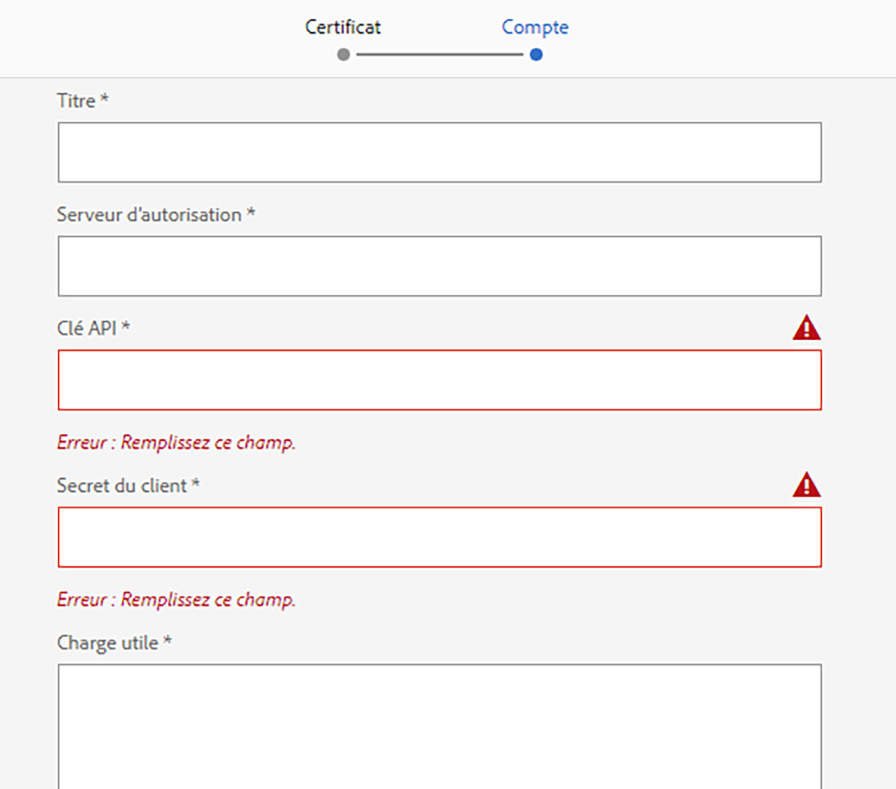

# Configuration du site de référence We.Gov {#set-up-and-configure-we-gov-reference-site}

## Détails du package de démonstration {#demo-package-details}

### Conditions préalables à l&#39;installation {#installation-prerequisites}

Ce paquet a été créé pour l&#39;auteur **OSGI 6.4** AEM Forms, a été testé et est donc pris en charge sur les versions de plateforme suivantes :

| VERSION AEM | VERSION DU PACKAGE AEM FORMS | ÉTAT |
|---|---|---|
| 6.4 | 5.0.86 | **Pris en charge** |
| 6.5 | 6.0.80 | **Pris en charge** |
| 6.5.3 | 6.0.122 | **Pris en charge** |

Ce package contient la configuration de cloud qui prend en charge les versions de plate-forme suivantes :

| FOURNISSEUR DE NUAGE | VERSION DU SERVICE | ÉTAT |
|---|---|---|
| Adobe Sign | API v5 | **Pris en charge** |
| Microsoft Dynamics 365 | 1710 (9.1.0.3020) | **Pris en charge** |
| Adobe Analytics | v1.4 Rest API | **Pris en charge** |
**Considérations relatives à l’installation du package :**

* Le paquet devrait être installé sur un serveur propre, sans les autres paquets de démonstration ni les versions antérieures des paquets de démonstration.
* Le package devrait être installé sur un serveur OSGI, s’exécutant en mode Auteur.

### Que comprend ce package {#what-does-this-package-include}

Le package de démonstration AEM Forms We.Gov (**we-gov-forms.pkg.all-&lt;version>.zip**) est fourni sous la forme d&#39;un package qui inclut plusieurs autres sous-packages et services. Le package comprend les modules suivants :

* **we-gov-forms.pkg.all-&lt;version>.zip** - Package de démonstration *complet*

   * **we-gov-forms.ui.apps-&lt;version>.zip** *- contient tous les composants, bibliothèques clientes, exemples d’utilisateurs, modèles de processus, etc.*

      * **we-gov-forms.core-&lt;version>.jar** - *Contient tous les services OSGI, l’implémentation d’étape de flux de travail personnalisé, etc.*

      * **we-gov-forms.derby&lt;version>.jar** - *contient tous les services OSGI, schéma de base de données, etc.*

      * **core.wcm.components.all-2.0.4.zip** - *Collection d’exemples de composants WCM*

      * **grid-aem.ui.apps-1.0-SNAPSHOT.zip** - Package de mise en page Grille *AEM Sites pour le contrôle de colonne de la page Sites*
   * **we-gov-forms.ui.content-&lt;version>.zip** - *contient tout le contenu, les pages, les images, les formulaires, les ressources de communication interactives, etc.*

   * **we-gov-forms.ui.analytics-&lt;version>.zip** - *contient toutes les données Analytics de formulaires We.Gov à stocker dans le référentiel.*

   * **we-gov-forms.config.public-&lt;version>.zip** - *contient tous les noeuds de configuration par défaut, y compris les configurations de cloud d’espace réservé, afin d’éviter les modèles de données de formulaires et les problèmes de liaison de service.*

Les actifs inclus dans ce package sont les suivants :

* Pages du site AEM avec des modèles modifiables
* Formulaires adaptatifs AEM Forms
* Communications interactives AEM Forms (Canal papier et Web)
* Document d&#39;enregistrement XDP AEM Forms
* AEM Forms Modèle de données MS Dynamics Forms
* Intégration de Adobe Sign
* Modèle de processus AEM
* Exemples d’images AEM Assets
* Exemple de base de données Apache Derby (en mémoire)
* Source de données Apache Derby (à utiliser avec le modèle de données de formulaire)

## Installation du package de démonstration {#demo-package-installation}

Cette section contient des informations sur l&#39;installation du package de démonstration.

### A partir de la distribution de logiciels {#from-software-distribution}

1. Distribution de logiciels ouverts. Vous avez besoin d&#39;un Adobe ID pour vous connecter à la distribution de logiciels.
1. Appuyez sur **[!UICONTROL Adobe Experience Manager]** disponible dans le menu d’en-tête.
1. In the **[!UICONTROL Filters]** section:
   1. Sélectionnez **[!UICONTROL Forms]** dans la liste déroulante **[!UICONTROL Solution]** .
   2. Sélectionnez la version et le type du package. Vous pouvez également utiliser l’option Téléchargements **[!UICONTROL de]** recherche pour filtrer les résultats.
1. Appuyez sur le nom du package **we-gov-forms.pkg.all-&lt;version>.zip** , sélectionnez **[!UICONTROL Accepter les termes]** du contrat de licence de l’utilisateur final et appuyez sur **[!UICONTROL Télécharger]**.
1. Ouvrez [Package Manager](https://docs.adobe.com/content/help/fr-FR/experience-manager-65/administering/contentmanagement/package-manager.html) et cliquez sur **[!UICONTROL Télécharger le package]** pour télécharger le package.
1. Select the package and click **[!UICONTROL Install]**.

   

1. Autoriser l’exécution du processus d’installation.
1. Accédez à *https://&lt;aemserver>:&lt;port>/content/we-gov/home.html?wcmmode=disabled* pour vous assurer que l’installation a réussi.

### A partir d’un fichier ZIP local {#from-a-local-zip-file}

1. Téléchargez et recherchez le fichier **we-gov-forms.pkg.all-&lt;version>.zip** .
1. Accédez à *https://&lt;aemserver>:&lt;port>/crx/packmgr/index.jsp*.
1. Sélectionnez l’option &quot;Télécharger le package&quot;.

   

1. Utilisez l’explorateur de fichiers pour naviguer jusqu’au fichier ZIP téléchargé et le sélectionner.
1. Cliquez sur &quot;Ouvrir&quot; pour télécharger.
1. Une fois le téléchargement effectué, sélectionnez l’option &quot;Installer&quot; pour installer le package.

   

1. Autoriser l’exécution du processus d’installation.
1. Accédez à *https://&lt;aemserver>:&lt;port>/content/we-gov/home.html?wcmmode=disabled* pour vous assurer que l’installation a réussi.

### Installation de nouvelles versions de package {#installing-new-package-versions}

Pour installer une nouvelle version de package, suivez les étapes définies dans les sections 4.1 et 4.2. Il est possible d&#39;installer une version de package plus récente alors qu&#39;un autre package plus ancien est déjà installé, mais il est recommandé de désinstaller d&#39;abord l&#39;ancienne version de package. Pour ce faire, suivez les étapes ci-dessous.

1. Accédez à *https://&lt;aemserver>:&lt;port>/crx/packmgr/index.jsp*
1. Recherchez le fichier **we-gov-forms.pkg.all-&lt;version>.zip** plus ancien.
1. Sélectionnez l’option &quot;Plus&quot;.
1. Dans la liste déroulante, sélectionnez l’option &quot;Désinstaller&quot;.

   

1. Sur confirmation, sélectionnez à nouveau &quot;Désinstaller&quot; et autorisez le processus de désinstallation à se terminer.

## Configuration du package de démonstration {#demo-package-configuration}

Cette section contient des détails et des instructions sur la configuration post-déploiement du pack de démonstration avant la présentation.

### Configuration utilisateur fictive {#fictional-user-configuration}

1. Accédez à *https://&lt;aemserver>:&lt;port>/libs/granite/security/content/groupadmin.html*
1. Connectez-vous en tant qu’administrateur pour effectuer les tâches ci-dessous.
1. Faites défiler la page jusqu’à la fin de la page pour charger tous les groupes d’utilisateurs.
1. Recherchez &quot;**workflow**&quot;.
1. Sélectionnez le groupe &quot;**Workflow-users**&quot; et cliquez sur &quot;Properties&quot; (Propriétés).
1. Accédez à l&#39;onglet &quot;Membres&quot;.
1. Saisissez **wegov** dans le champ &quot;Sélectionner un utilisateur ou un groupe&quot;.
1. Sélectionnez dans la liste déroulante &quot;Utilisateurs **de formulaires** We.Gov&quot;.

   

1. Cliquez sur &quot;Enregistrer et fermer&quot; dans la barre de menus.
1. Répétez les étapes 2 à 7 en recherchant &quot;**analyses**&quot;, en sélectionnant le groupe &quot;Administrateurs **** Analytics&quot; et en ajoutant le groupe &quot;Utilisateurs **de formulaires** We.Gov&quot; en tant que membre.
1. Répétez les étapes 2 à 7 en recherchant &quot;**Forms users**&quot; (utilisateurs **de formulaires), en sélectionnant le groupe &quot;** forms-power-users **&quot; (utilisateurs** de formulaires) et en ajoutant le groupe &quot;We.Gov Forms Users&quot; (Utilisateursde formulaires Google) en tant que membre.
1. Répétez les étapes 2 à 7 en recherchant &quot;**forms-users**&quot;, en sélectionnant le groupe &quot;**forms-users**&quot; et en ajoutant cette fois le groupe &quot;**We.Gov Users**&quot; en tant que membre.

### Configuration du serveur de messagerie {#email-server-configuration}

1. Consultez la documentation de configuration [Configuration de la notification par courrier électronique](/help/sites-administering/notification.md)
1. Connectez-vous en tant qu’administrateur pour effectuer cette tâche.
1. Navigate to *https://&lt;aemserver>:&lt;port>/system/console/configMgr*
1. Recherchez et cliquez sur le service Service **de messagerie** Day CQ pour configurer.

   

1. Configurez le service pour qu’il se connecte au serveur SMTP de votre choix :

   1. **Nom d’hôte** du serveur SMTP : par exemple (smtp.gmail.com)
   1. **Port** du serveur : par exemple (465) pour gmail utilisant SSL
   1. **Utilisateur SMTP :** demo@ &lt;nomsociété>.com
   1. **Adresse**&quot;De&quot; : aemformsdemo@adobe.com

   

1. Cliquez sur &quot;Enregistrer&quot; pour enregistrer la configuration.

### (Facultatif) Configuration SSL d’AEM {#aemsslconfig}

Cette section contient des informations détaillées sur la configuration de SSL sur l’instance AEM afin de pouvoir configurer la configuration de Adobe Sign Cloud.

**Références:**

1. [SSL par défaut](/help/sites-administering/ssl-by-default.md)

**Notes:**

1. Accédez à https://&lt;aemserver>:&lt;port>/aem/inbox où vous pourrez terminer le processus décrit dans le lien de la documentation de référence ci-dessus.
1. Le `we-gov-forms.pkg.all-[version].zip` package comprend un exemple de clé et de certificat SSL accessible en extrayant le `we-gov-forms.pkg.all-[version].zip/ssl` dossier qui fait partie du package.

1. Détails du certificat et de la clé SSL :

   1. délivré à &quot;CN=localhost&quot;
   1. 10 ans de validité
   1. valeur de mot de passe de &quot;password&quot;
1. La clé privée est la clé *localhostprivate.der*.
1. Le certificat est le *localhost.crt*.
1. Cliquez sur Suivant.
1. Le nom d’hôte HTTPS doit être défini sur *localhost*.
1. Le port doit être défini sur un port exposé par le système.

### (Optional) Adobe Sign cloud configuration {#adobe-sign-cloud-configuration}

Cette section contient des détails et des instructions sur la configuration du cloud Adobe Sign.

**Références:**

1. [Incorporation d’Adobe Sign à AEM Forms](adobe-sign-integration-adaptive-forms.md)

#### Cloud configuration {#cloud-configuration}

1. Vérifiez les conditions préalables. Voir Configuration [SSL d’](../../forms/using/forms-install-configure-gov-reference-site.md#aemsslconfig) AEM pour connaître la configuration SSL requise.
1. Accédez à:

   *https://&lt;aemserver>:&lt;port>/libs/adobesign/cloudservices/adobesign.html/conf/we-gov*

   >[!NOTE]
   >
   >L’URL utilisée pour accéder au serveur AEM doit correspondre à l’URL configurée dans l’URI de redirection OAuth de Adobe Sign pour éviter des problèmes de configuration (par exemple *https://&lt;aemserver>:&lt;port>/mnt/overlay/adobesign/cloudservices/adobesign/properties.html*).

1. Sélectionnez la configuration &quot;We.gov Adobe Sign&quot;.
1. Cliquez sur &quot;Propriétés&quot;.
1. Accédez à l&#39;onglet &quot;Paramètres&quot;.
1. Saisissez l’URL d’authentification, par exemple : [https://secure.na1.echosign.com/public/oauth](https://secure.na1.echosign.com/public/oauth)
1. Fournissez l’ID de client et la clé secrète client configurés à partir de l’instance Adobe Sign configurée.
1. Cliquez sur &quot;Se connecter à Adobe Sign&quot;.
1. Une fois la connexion établie, cliquez sur &quot;Enregistrer et fermer&quot; pour terminer l’intégration.

### Remplir et signer plusieurs formulaires {#fill-sign-multiple-forms}

Ce document explique les étapes nécessaires pour configurer la capacité de remplir et de signer plusieurs formulaires. Vous pouvez également essayer la [même fonctionnalité ici](https://forms.enablementadobe.com/content/dam/formsanddocuments/formsandsigndemo/refinanceform/jcr:content?wcmmode=disabled). Cet exemple stocke les données nécessaires pour cet exemple dans le référentiel AME. Cela permet de déployer sans difficulté des ressources de démonstration sur votre serveur local. Dans la vie réelle, nous stockerons les mêmes informations dans le SGDR de votre choix.

#### Conditions préalables {#pre-requisites-fill-sign-multiple-forms}

* [Configuration du service de messagerie Day CQ](https://docs.adobe.com/content/help/en/experience-manager-65/communities/administer/email.html)

* [Configuration de AEM Forms avec Adobe Sign](https://docs.adobe.com/content/help/en/experience-manager-65/forms/adaptive-forms-advanced-authoring/adobe-sign-integration-adaptive-forms.html)

#### Configuration de l’exemple sur le serveur local {#setup-sample-local-server}

Effectuez les étapes suivantes pour configurer l’exemple sur le serveur local :

1. Installez le package. Ce package contient les éléments suivants :
   * Formulaires adaptatifs. Les formulaires se trouvent dans le dossier **formsandsigndemo** .
   * Offres groupées OSGI personnalisées
   * Workflows   
1. Configurez le formulaire [de](http://localhost:4502/editor.html/content/forms/af/formsandsigndemo/consentform.html) consentement pour utiliser votre configuration Adobe Sign.
1. Configurez le formulaire de verrouillage [d’intérêt](http://localhost:4502/editor.html/content/forms/af/formsandsigndemo/multistateinterestratelock.html) à états multiples pour utiliser votre configuration Adobe Sign.
1. Open [Formsandsigningdemo](http://localhost:4502/editor.html/conf/global/settings/workflow/models/formsandsigningdemo.html) workflow model :
   1. Ouvrez l’étape Enregistrer les formulaires dans CRX.
   1. Remplacez localhost par l’adresse ip de votre serveur AEM.
   1. Enregistrez vos modifications.
   1. Synchronisez le processus pour générer le modèle d’exécution.

      

   1. Ouvrez le formulaire [de](http://localhost:4502/content/dam/formsanddocuments/formsandsigndemo/refinanceform/jcr:content?wcmmode=disabled)refinancement.
   1. Renseignez les champs obligatoires. Veillez à fournir une adresse électronique valide et sélectionnez un ou plusieurs formulaires à signer et envoyer.
Vous recevez un e-mail avec un lien pour remplir et signer les formulaires.

#### Résolution des incidents {#troubleshoot-sign-multiple-forms}

* Les journaux de débogage sont consignés dans `signingmultipleforms.log` le fichier du dossier de journalisation de votre serveur.

* Les formulaires à signer sont stockés sous `/content/formsforsigning`.

* Assurez-vous que tous les lots sont à l’état actif.

* Vérifiez la configuration de votre serveur de messagerie.

### (Facultatif) Configuration de MS Dynamics cloud {#ms-dynamics-cloud-configuration}

Cette section contient des détails et des instructions sur la configuration MS Dynamics Cloud.

**Références:**

1. [Configuration du service OData de Microsoft Dynamics](https://docs.adobe.com/content/help/en/experience-manager-64/forms/form-data-model/ms-dynamics-odata-configuration.html)
1. [Configuration de Microsoft Dynamics pour les AEM Forms](https://helpx.adobe.com/experience-manager/kt/forms/using/config-dynamics-for-aem-forms.html)

#### Service cloud MS Dynamics OData {#ms-dynamics-odata-cloud-service}

1. Accédez à:

   https://&lt;aemserver>:&lt;port>/libs/fd/fdm/gui/components/admin/fdmcloudservice/fdm.html/conf/we-gov

   1. Assurez-vous d&#39;accéder au serveur à l&#39;aide de la même URL de redirection que celle configurée dans l&#39;enregistrement de l&#39;application MS Dynamics.

1. Sélectionnez la configuration &quot;Cloud Service Microsoft Dynamics OData&quot;.
1. Cliquez sur &quot;Propriétés&quot;.

   

1. Accédez à l’onglet &quot;Paramètres d’authentification&quot;.
1. Saisissez les informations suivantes :

   1. **Racine du service :** par exemple https://msdynamicsserver.api.crm3.dynamics.com/api/data/v9.1/
   1. **Type d&#39;authentification :** OAuth 2.0
   1. **Paramètres** d&#39;authentification (voir Paramètres [de configuration de](../../forms/using/forms-install-configure-gov-reference-site.md#dynamicsconfig) MS Dynamics cloud pour collecter ces informations) :

      1. ID de client - également appelé ID de l&#39;application
      1. Secret client
      1. URL OAuth - par exemple, [https://login.windows.net/common/oauth2/authorize](https://login.windows.net/common/oauth2/authorize)
      1. Actualiser l’URL du jeton - par exemple, [https://login.windows.net/common/oauth2/token](https://login.windows.net/common/oauth2/token)
      1. URL du Jeton d&#39;accès - par exemple, [https://login.windows.net/common/oauth2/token](https://login.windows.net/common/oauth2/token)
      1. Portée de l&#39;autorisation - **openid**
      1. En-tête d&#39;authentification - **Détecteur d&#39;autorisation**
      1. Ressource - par exemple [https://msdynamicsserver.api.crm3.dynamics.com](https://msdynamicsserver.api.crm3.dynamics.com)
   1. Cliquez sur &quot;Se connecter à OAuth&quot;.

1. Après une authentification réussie, cliquez sur &quot;Enregistrer et fermer&quot; pour terminer l’intégration.

#### Paramètres de configuration de MS Dynamics cloud {#dynamicsconfig}

Les étapes détaillées dans cette section sont incluses pour vous aider à localiser l&#39;ID de client, la clé secrète client et les détails de votre instance MS Dynamics Cloud.

1. Accédez à [https://portal.azure.com/](https://portal.azure.com/) et connectez-vous.
1. Dans le menu de gauche, sélectionnez &quot;Tous les services&quot;.
1. Recherchez ou accédez à &quot;Inscription à l’application&quot;.
1. Créez ou sélectionnez un enregistrement d’application existant.
1. Copiez le **ID de l&#39;application** à utiliser comme ID **de** client OAuth dans la configuration du cloud AEM.
1. Cliquez sur &quot;Paramètres&quot; ou &quot;manifeste&quot; pour configurer les URL de **réponse.**

   1. Cette URL doit correspondre à l’URL utilisée pour accéder à votre serveur AEM lors de la configuration du service OData.

1. Dans la vue de paramètres, cliquez sur &quot;Clés&quot; pour créer une vue et créer une clé (cette clé est utilisée comme clé secrète client dans AEM).

   1. Veillez à conserver une copie de la clé car vous ne pourrez pas la vue ultérieurement dans Azure ou AEM.

1. Pour localiser l&#39;URL de ressource/URL racine du service, accédez au tableau de bord d&#39;instance MS Dynamics.
1. Dans la barre de navigation supérieure, cliquez sur &quot;Ventes&quot; ou sur votre propre type d&#39;instance et sur &quot;Sélectionner les paramètres&quot;.
1. Cliquez sur &quot;Personnalisations&quot; et &quot;Ressources du développeur&quot; en bas à droite.
1. Vous y trouverez l’URL racine du service : e.g

   *[https://msdynamicsserver.api.crm3.dynamics.com/api/data/v9.1/](https://msdynamicsserver.api.crm3.dynamics.com/api/data/v9.1/)*

1. Vous trouverez des informations détaillées sur l’URL d’actualisation et de Jeton d&#39;accès ici :

   *[https://docs.microsoft.com/en-us/rest/api/datacatalog/authenticate-a-client-app](https://docs.microsoft.com/en-us/rest/api/datacatalog/authenticate-a-client-app)*

#### Test du modèle de données de formulaires (Dynamics) {#testing-the-form-data-model}

Une fois la configuration du cloud terminée, vous pouvez tester le modèle de données de formulaire.

1. Accédez à .

   *https://&lt;aemserver>:&lt;port>/aem/forms.html/content/dam/formsanddocuments-fdm/we-gov*

1. Sélectionnez &quot;We.gov Microsoft Dynamics CRM FDM&quot; et sélectionnez &quot;Properties&quot;.

   

1. Accédez à l&#39;onglet &quot;Mettre à jour la source&quot;.
1. Assurez-vous que la &quot;configuration adaptée au contexte&quot; est définie sur &quot;/conf/we-gov&quot; et que la source de données configurée est &quot;ms-dynamic-odata-cloud-service&quot;.

   

1. Modifiez le modèle de données de formulaire.

1. Testez les services afin de vous assurer qu’ils se connectent correctement à la source de données configurée.

   >[!NOTE]
   Après avoir testé les services, cliquez sur **Annuler** pour vous assurer que les modifications involontaires ne sont pas propagées dans le modèle de données de formulaire.

   >[!NOTE]
   Il a été signalé qu’un redémarrage du serveur AEM était nécessaire pour que la source de données puisse se lier correctement à FDM.

#### Test du modèle de données de formulaires (Derby) {#test-fdm-derby}

Une fois la configuration du cloud terminée, vous pouvez tester le modèle de données de formulaires.

1. Accédez à *https://&lt;aemserver>:&lt;port>/aem/forms.html/content/dam/formsanddocuments-fdm/we-gov*

1. Sélectionnez l&#39;inscription **We.gov FDM** et sélectionnez **Propriétés**.

   

1. Accédez à l&#39;onglet **Mettre à jour la source** .

1. Assurez-vous que la configuration **** adaptée au contexte est définie sur `/conf/we-gov` et que la source de données configurée est **We.Gov Derby DS**.

   

1. Click on **Save and Close**.

1. [Testez les services](work-with-form-data-model.md#test-data-model-objects-and-services) pour vous assurer qu’ils se connectent correctement à la source de données configurée.

   * Pour tester la connexion, sélectionnez le **COMPTE HOMEMORTGAGEACCOUNT** et offrez-lui un service d&#39;obtention. Testez le service et les administrateurs système peuvent voir les données récupérées.

### Configuration d’Adobe Analytics (facultatif) {#adobe-analytics-configuration}

Cette section contient des informations détaillées et des instructions sur la configuration de Analytics Cloud d’Adobe.

**Références:**

* [Intégration à Adobe Analytics](../../sites-administering/adobeanalytics.md)

* [Connexion à Adobe Analytics et création de structures](../../sites-administering/adobeanalytics-connect.md)

* [Affichage des données d’analyse de page](../../sites-authoring/pa-using.md)

* [Configuration des analyses et des rapports](configure-analytics-forms-documents.md)

* [Consultation et compréhension des rapports d’analyse d’AEM Forms](view-understand-aem-forms-analytics-reports.md)

### Configuration du service cloud Adobe {#adobe-analytics-cloud-service-configuration}

Ce package est préconfiguré pour se connecter à Adobe Analytics. Les étapes ci-dessous sont fournies pour permettre la mise à jour de cette configuration.

1. Accédez à *https://&lt;aemserver>:&lt;port>/libs/cq/core/content/tools/cloudservices.html*
1. Localisez la section Adobe Analytics et sélectionnez le lien &quot;Afficher les configurations&quot;.
1. Sélectionnez la configuration &quot;We.Gov Adobe Analytics (Analytics Configuration)&quot;.

   

1. Cliquez sur le bouton &quot;Modifier&quot; pour mettre à jour la configuration Adobe Analytics (vous devrez fournir le Secret partagé). Cliquez sur &quot;Se connecter à Analytics&quot; pour vous connecter et sur &quot;OK&quot; pour terminer.

   

1. Dans la même page, cliquez sur &quot;We.Gov Adobe Analytics Framework (Analytics Framework)&quot; si vous souhaitez mettre à jour les configurations de la structure (voir [Activer la création](../../forms/using/forms-install-configure-gov-reference-site.md#enableauthoring) AEM pour activer la création).

#### Adobe Analytics Localisation des informations d’identification d’utilisateur {#analytics-locating-user-credentials}

Pour localiser les informations d’identification d’utilisateur d’un compte Analytics Adobe, l’administrateur de compte doit effectuer les tâches suivantes.

1. Accédez au portail Adobe Experience Cloud.
   * Connexion à l’aide de vos informations d’identification d’administrateur
1. Sélectionnez l’icône Adobe Analytics dans le tableau de bord principal.
   
1. Accédez à l’onglet Admin et sélectionnez l’élément Gestion utilisateur (hérité).
   
1. Select the **Users** tab.
   
1. Sélectionnez un utilisateur dans la liste des utilisateurs.
1. Faites défiler la page jusqu’au bas de la page et les informations d’authentification des utilisateurs s’affichent en bas de la page.
   
1. Le nom d’utilisateur et les informations de secret partagé s’affichent sur le côté droit de la zone d’autorisations.
1. Notez que le nom d&#39;utilisateur comporte un point-virgule dans le nom. Toutes les informations à gauche du point-virgule sont le nom d&#39;utilisateur et toutes les informations à droite du point-virgule sont le nom de la société.
   * En voici un exemple : *username : Nom de la société*

#### Configuration de l’authentification des utilisateurs dans Adobe Analytics {#setup-user-authentication}

Les administrateurs peuvent fournir aux utilisateurs des autorisations d’analyse AEM en exécutant les actions suivantes.

1. Accédez à l&#39;Adobe Admin Console.

1. Cliquez sur l’instance Analytics exposée à la console d’administration.

   * Il se trouve sur la page principale de la page d’administration.

1. Sélectionnez Accès administrateur complet Analytics.

1. Ajoutez un utilisateur au Profil.

   

1. Cliquez sur l’onglet permissions une fois que l’ID utilisateur a été mappé dans le profil.

1. Assurez-vous que toutes les autorisations sont mises en correspondance avec le profil.

   

1. Notez qu’une fois les autorisations mises en correspondance sur la capacité d’un utilisateur à se connecter peut prendre quelques heures.

### rapports Adobe {#adobe-analytics-reporting}

#### rapports des sites de Vue Adobe Analytics {#view-adobe-analytics-sites-reporting}

>[!NOTE]
Les données Analytics AEM Forms sont disponibles hors ligne ou sans configuration de cloud Adobe Analytics si le `we-gov-forms.ui.analytics-<version>.zip` package est installé, mais les données AEM Sites nécessitent une configuration de cloud active.

1. Accédez à *https://&lt;aemserver>:&lt;port>/sites.html/content*
1. Sélectionnez le &quot;Site Web.Gov AEM Forms&quot; pour vue des pages du site.
1. Sélectionnez l’une des pages du site (par exemple, Accueil) et choisissez &quot;Analytics &amp; Recommendations&quot;.

   

1. Sur cette page, vous verrez les informations extraites d&#39;Adobe Analytics qui se rapportent à la page AEM Sites (remarque : par conception, ces informations sont périodiquement actualisées à partir de Adobe Analytics et ne sont pas affichées en temps réel).

   

1. De retour sur la page de vue de page (accessible à l’étape 3), vous pouvez également vue les informations de vue de page en modifiant le paramètre d’affichage en éléments de vue dans la &quot;Vue de Liste&quot;.
1. Recherchez le menu déroulant &quot;Vue&quot; et sélectionnez &quot;Vue de Liste&quot;.

   

1. Dans le même menu, sélectionnez &quot;Paramètre de Vue&quot; et sélectionnez les colonnes à afficher dans la section &quot;Analytics&quot;.

   

1. Cliquez sur &quot;Mettre à jour&quot; pour rendre les nouvelles colonnes disponibles.

   

#### rapports de Vue Adobe Analytics Forms {#view-adobe-analytics-forms-reporting}

>[!NOTE]
Les données Analytics AEM Forms sont disponibles hors ligne ou sans configuration de cloud Adobe Analytics si le `we-gov-forms.ui.analytics-<version>.zip` package est installé, mais les données AEM Sites nécessitent une configuration de cloud active.

1. Accédez à .

   *https://&lt;aemserver>:&lt;port>/aem/forms.html/content/dam/formsanddocuments/adobe-gov-forms*

1. Sélectionnez le formulaire adaptatif &quot;Demande d&#39;inscription pour les prestations de santé&quot; et sélectionnez l&#39;option &quot;Rapport Analytics&quot;.

   

1. Attendez que la page se charge et vue les données du rapport Analytics.

   

### Activation de la configuration automatisée des formulaires Adobe {#automated-forms-enablement}

Pour installer et configurer des AEM Forms avec Adobe Forms, les utilisateurs de l’outil de conversion doivent disposer des éléments suivants.

1. Accès aux E/S Adobe.

1. Autorisation de créer une intégration avec le service de conversion Adobe Forms.

1. Service Pack le plus récent d’AEM 6.5 Adobe s’exécutant en tant qu’auteur.

Veuillez consulter les éléments suivants avant de lire d&#39;autres instructions :

* [Configurer le service de conversion automatisée de formulaires](https://docs.adobe.com/content/help/en/aem-forms-automated-conversion-service/using/configure-service.html)

#### Création d&#39;une configuration IMS Partie 1 {#creating-ims-config}

Pour configurer le service de manière à communiquer correctement avec l’outil de conversion de formulaires, les utilisateurs doivent configurer le service Identity Management System (IMS) pour pouvoir s’enregistrer auprès des E/S Adobe.

1. Accédez à https://&lt;aemserver>:&lt;port> > Cliquez sur Adobe ExperienceManager en haut à gauche > Outils > Sécurité > Configuration Adobe IMS.

1. Cliquez sur Créer.

1. Effectuez les actions dans l’image ci-dessous.

   

1. Veillez à télécharger le certificat.

1. Ne passez pas au reste de la configuration - passez en revue la section [Création de l&#39;intégration dans les E/S Adobe](#create-integration-adobeio)

>[!NOTE]
Le certificat créé dans cette section va être utilisé pour créer le service d&#39;intégration dans les E/S Adobe. Une fois les utilisateurs créés dans le service d’intégration, les utilisateurs peuvent utiliser ces informations d’E/S Adobe pour terminer la configuration.

#### Création de l&#39;intégration dans les E/S Adobe {#create-integration-adobeio}

Assurez-vous de pouvoir créer une intégration dans votre domaine Adobe si vous ne contactez pas votre administrateur système pour ce faire.

1. Accédez à la console [d&#39;E/S](https://console.adobe.io/)Adobe.

1. Cliquez sur Créer une intégration.

1. Sélectionnez Accéder à une API.

1. Assurez-vous que vous êtes dans le groupe correct (liste déroulante supérieure droite).

1. Dans la section Experience Cloud, sélectionnez l’outil de conversion de formulaires.

1. Cliquez sur Continuer.

1. Entrez le nom et la description de votre intégration.

1. L&#39;utilisation de la clé publique de la section 2.1 la place dans l&#39;intégration de la clé.

1. Sélectionnez un profil pour votre conversion automatisée de formulaires.

   

#### Création de la configuration IMS Partie 2 {#create-ims-config-part-next}

Maintenant que vous avez créé une intégration, nous allons terminer l&#39;installation de la configuration IMS.

1. Cliquez sur votre intégration dans les E/S Adobe afin d&#39;exposer les détails de la connexion.

1. Accédez à votre configuration IMS dans AEM (Outils > Sécurité > IMS).

1. Cliquez sur Suivant dans l’écran Configuration IMS.

1. Saisissez le serveur d’autorisation (valeur affichée dans la capture d’écran).

1. Saisissez la clé d&#39;API.

1. Entrez la clé secrète client (cliquez sur exposer sur l&#39;intégration dans Adobe E/S pour qu&#39;elle soit affichée).

1. Cliquez sur l&#39;onglet JWT dans les E/S Adobe pour obtenir la charge utile JWT et la coller dans la charge utile de la configuration IMS.

   

1. Une fois créé, cliquez sur Configuration IMS et sélectionnez Vérification d’intégrité, les utilisateurs doivent voir le résultat suivant.

   

#### Configuration de Cloud (production AFC We.Gov) {#configure-cloud-configuration}

Une fois la configuration IMS terminée, nous pouvons passer en revue la configuration de cloud dans AEM. Si la configuration n’existe pas, procédez comme suit pour créer la configuration cloud dans AEM :

1. Ouvrez votre navigateur et accédez à l’URL système https://&lt;nom_domaine>:&lt;port_système>

1. Cliquez sur Adobe Experience Manager dans le coin supérieur gauche de l’écran > Outils > Cloud Service > Configuration automatisée de la conversation dans les formulaires.

1. Sélectionnez le dossier de configuration dans lequel vous souhaitez placer la configuration.

1. Cliquez sur Créer.

1. Entrez les informations dans la capture d&#39;écran ci-dessous.

   

1. Fournissez à la configuration un titre et un nom.

1. L’URL de service du système est définie sur https://aemformsconversion.adobe.io/.

1. URL du modèle */conf/we-gov/settings/wcm/templates/we-gov-flamingo-template*.

1. URL du thème : */content/dam/formsanddocuments-thèmes/adobe-gov-forms-thèmes/we-gov-theme*

1. Cliquez sur Suivant.

1. Pour cette configuration, nous avons laissé les deux valeurs de case à cocher vides.

   * Pour en savoir plus sur ces options, voir [Configuration du service](https://docs.adobe.com/content/help/en/aem-forms-automated-conversion-service/using/configure-service.html#configure-the-cloud-service)cloud.

#### Configuration de Cloud (production AFC We.Finance) {#configure-cloud-configuration-wefinance}

Une fois la configuration IMS terminée, nous pouvons ensuite créer la configuration cloud dans AEM.

1. Ouvrez votre navigateur et accédez à l’URL système https://&lt;nom_domaine>:&lt;port_système>

1. Cliquez sur Adobe Experience Manager dans le coin supérieur gauche de l’écran > Outils > Cloud Service > Configuration automatisée de la conversation dans les formulaires.

1. Sélectionnez le dossier de configuration dans lequel vous souhaitez placer la configuration.

1. Cliquez sur Créer.

1. Entrez les informations dans la capture d&#39;écran ci-dessous.

   

1. Fournissez à la configuration un titre et un nom.

1. L’URL de service du système est définie sur https://aemformsconversion.adobe.io/.

1. URL du modèle : */conf/we-finance/settings/wcm/templates/we-finance-adaptive-form*

1. URL du thème : */content/dam/formsanddocuments-thèmes/adobe-finance-forms-thèmes/we-finance-theme*

1. Cliquez sur Suivant.

1. Pour cette configuration, nous avons laissé les deux valeurs de case à cocher vides.

   * Pour en savoir plus sur ces options, voir [Configuration du service](https://docs.adobe.com/content/help/en/aem-forms-automated-conversion-service/using/configure-service.html#configure-the-cloud-service)cloud.

#### Test de la conversion des formulaires (application d&#39;inscription We.Gov) {#test-forms-conversion}

Une fois la configuration configurée, les utilisateurs peuvent la tester en téléchargeant un document PDF.

1. Accédez au système AEM https://&lt;nom_domaine>:&lt;port_système>

1. Cliquez sur Formulaires > Formulaires et Documents > Formulaires We.gov AEM Forms > AFC.

1. Sélectionnez le fichier PDF de l&#39;application d&#39;inscription We.Gov.

1. Cliquez sur le bouton Conversion **automatisée du** Début dans le coin supérieur droit.

1. Les utilisateurs doivent pouvoir voir l’option comme illustré ci-dessous.

   

1. Une fois le bouton sélectionné, les utilisateurs auront accès aux options suivantes :

   * Assurez-vous que les utilisateurs sélectionnent la configuration de production *AFC* We.Gov

   

   

1. Sélectionnez Conversion de début une fois que vous avez configuré toutes les options que vous souhaitez utiliser.

1. Au début du processus de conversion, les utilisateurs doivent voir l’écran suivant :

   

1. Une fois la conversion terminée, l’écran suivant s’affiche pour les utilisateurs :

   

   Cliquez sur le dossier **Output** pour vue du formulaire adaptatif généré.

#### Problèmes et remarques connus {#known-issues-notes}

Le service de conversion automatisée des formulaires comprend certaines [bonnes pratiques, des modèles](https://docs.adobe.com/content/help/en/aem-forms-automated-conversion-service/using/styles-and-pattern-considerations-and-best-practices.html)complexes connus et des problèmes connus. Vérifiez ces informations avant de commencer à utiliser le service de conversion automatisée des formulaires AEM Forms.

1. Générez le formulaire avec Générer le ou les formulaires adaptatifs sans que les liaisons de données soient activées si vous souhaitez lier le formulaire à un FDM après la conversion.

1. Assurez-vous que jcr:read est activé pour tout le monde dans le dossier de modèles, sinon l’utilisateur du service ne pourra pas lire le modèle à partir du référentiel et la conversion échouera.

## Personnalisations du package de démonstration {#demo-package-customizations}

Cette section comprend des instructions sur la personnalisation de la démo.

### Personnalisation des modèles {#templates-customization}

Les modèles modifiables se trouvent à l’emplacement suivant :

*https://&lt;aemserver>:&lt;port>/libs/wcm/core/content/sites/templates.html/conf/we-gov*

Ces modèles incluent les modèles Site AEM, Formulaire adaptatif et Communications interactives, créés et assemblés avec des composants disponibles à l’adresse suivante :

*https://&lt;aemserver>:&lt;port>/crx/de/index.jsp#/apps/we-gov/components*

#### Style system {#customizetemplates}

Ce site contient également des bibliothèques-clients, dont l’une importe Bootstrap 4 ( [https://getbootstrap.com/](https://getbootstrap.com/) ). Cette bibliothèque cliente est disponible à l’adresse

*https://&lt;aemserver>:&lt;port>/crx/de/index.jsp#/apps/we-gov/clientlibs/clientlib-base/css/bootstrap*

Les modèles modifiables inclus dans ce package sont également préconfigurés avec des stratégies de modèle/page qui utilisent les classes CSS Bootstrap 4 pour la pagination, la mise en forme, etc. Certaines classes n&#39;ont pas été ajoutées aux stratégies de modèle, mais toute classe prise en charge par Bootstrap 4 peut être ajoutée aux stratégies. Consultez la page de prise en main pour obtenir une liste des classes disponibles :

[https://getbootstrap.com/docs/4.1/getting-started/introduction/](https://getbootstrap.com/docs/4.1/getting-started/introduction/)

Les modèles inclus dans ce package prennent également en charge le système de style :

[Système de style](../../sites-authoring/style-system.md)

#### Logos de modèles {#template-logos}

Les ressources DAM du projet incluent également des logos et des images We.Gov. Ces ressources sont disponibles à l’adresse suivante :

*https://&lt;aemserver>:&lt;port>/assets.html/content/dam/we-gov*

Lors de la modification des modèles de page et de formulaire, vous pouvez choisir de mettre à jour les logos de marque en modifiant les composants Navigation et Pied de page. Ces composants offre une boîte de dialogue de marque et de logo configurable qui peut être utilisée pour mettre à jour les logos :

Voir Modification du contenu de la page pour plus d’informations :

[Modification du contenu de la page](../../sites-authoring/editing-content.md)

### Personnalisation des pages de sites {#sites-pages-customization}

Toutes les pages du site sont disponibles à partir de : *https://&lt;aemserver>:&lt;port>/sites.html/content/we-gov*

Ces pages de site utilisent également le package AEM Grid pour contrôler la mise en page de quelques composants.

#### Style system {#style-system}

Les pages incluses dans ce package prennent également en charge le système de style :

[Système de style](../../sites-authoring/style-system.md)

Vous pouvez également consulter le système [de style de personnalisation des](../../forms/using/forms-install-configure-gov-reference-site.md#customizetemplates) modèles pour obtenir de la documentation sur les styles pris en charge.

### Personnalisation des formulaires adaptatifs {#adaptive-forms-customization}

Tous les formulaires adaptatifs sont disponibles à partir de :

*https://&lt;aemserver>:&lt;port>/aem/forms.html/content/dam/formsanddocuments/adobe-gov-forms*

Ces formulaires peuvent être personnalisés en fonction de certains cas d’utilisation. Notez que certains champs et la logique d’envoi ne doivent pas être modifiés pour garantir le bon fonctionnement du formulaire. Cela inclut :

**Demande D&#39;Inscription Aux Prestations De Santé :**

* contact_id - Champ masqué utilisé pour recevoir l&#39;ID de contact MS Dynamics pendant l&#39;envoi
* Soumettre - La logique du bouton Envoyer nécessite une personnalisation pour prendre en charge les rappels. La personnalisation est documentée, mais un script volumineux était nécessaire pour envoyer le formulaire lors de l&#39;exécution d&#39;une opération POST et GET à MS Dynamics via le modèle de données de formulaires.
* Panneau racine : le événement Initialize permet d’ajouter un bouton MS Dynamics à la boîte de réception AEM de la manière la moins intrusive possible, car tous les composants de l’interface utilisateur Granite de la boîte de réception AEM ne peuvent pas être modifiés.

#### Style de formulaire adaptatif {#adaptive-form-styling}

Les formulaires adaptatifs peuvent également être mis en forme à l’aide de l’éditeur de style ou de l’éditeur de thème :

* [Styles intégrés des composants de formulaire adaptatif](inline-style-adaptive-forms.md)
* [Création et utilisation des thèmes](themes.md)

### Personnalisation du processus {#workflow-customization}

Le formulaire adaptatif d’inscription est envoyé à un processus OSGI pour traitement. Ce flux de travaux se trouve à l’adresse *https://&lt;aemserver>:&lt;port>/conf/we-gov/settings/models/we-gov-process.html*.

En raison de certaines limitations, ce flux de travaux contient plusieurs scripts et étapes de processus OSGI personnalisés. Ces étapes de processus ont été créées en tant qu’étapes génériques et n’ont pas été créées avec des dialogues de configuration. Actuellement, la configuration des étapes du processus repose sur des arguments de processus.

Le code Java de toutes les étapes du processus est contenu dans le **lot we-gov-forms.core-&lt;version>.jar** .

## Considérations relatives aux démonstrations et problèmes connus {#demo-considerations-and-known-issues}

Cette section contient des informations sur les fonctions de démonstration et les décisions de conception qui peuvent nécessiter des considérations spéciales pendant le processus de démonstration.

### Considérations relatives aux démonstrations {#demo-considerations}

* Conformément à AGRS-159, veillez à ce que le nom (premier, intermédiaire et dernier) du contact utilisé dans le formulaire adaptatif Inscription soit unique.
* Le formulaire adaptatif d’inscription envoie le courrier électronique Adobe Sign à l’adresse électronique indiquée dans le champ de courrier électronique du formulaire. Cette adresse électronique ne peut pas être identique à celle utilisée pour configurer la configuration du cloud Adobe Sign.

### Problèmes connus {#known-issues}

* (AGRS-120) Le composant Navigation du site ne prend actuellement pas en charge les pages enfants imbriquées d’une profondeur supérieure à 2 niveaux.
* (AGRS-159) L&#39;actuel MS Dynamics FDM doit effectuer 2 opérations dans un premier temps, envoyer les données du formulaire adaptatif d&#39;inscription à Dynamics, puis récupérer l&#39;enregistrement utilisateur afin de récupérer l&#39;ID de contact. Dans son état actuel, la récupération de l&#39;ID de contact échoue si plus de deux utilisateurs portant le même nom sont présents dans Dynamics, ce qui n&#39;autorise pas l&#39;envoi du formulaire adaptatif d&#39;inscription.

## Configuration des tests d’accessibilité {#configure-accessibility-testing}

### Activation du test d’accessibilité Ajouté sur Chrome {#enable-chrome-add-on}

Pour effectuer d’abord des tests d’accessibilité, vous devez installer le module externe Chrome, [ici](https://chrome.google.com/webstore/detail/accessibility-developer-t/fpkknkljclfencbdbgkenhalefipecmb?hl=en).

Une fois installé, chargez la page que vous souhaitez tester dans le navigateur Chrome (Remarque : L’ouverture de plusieurs onglets peut avoir une incidence sur votre score ; il est préférable de n’ouvrir qu’un seul onglet). Une fois la page chargée **avec le bouton droit de la souris, cliquez** sur la page et sélectionnez l&#39;onglet **Vérifications** . Certains développeurs peuvent sélectionner le type de contrôle à effectuer par le module externe Accessibilité. Une fois toutes les options sélectionnées, l’utilisateur peut sélectionner le bouton Générer le rapport. Cela génère un document PDF qui indique la note globale d’accessibilité et ce qui peut être utilisé pour augmenter la note globale d’accessibilité.

Une fois le rapport exécuté, les utilisateurs peuvent s’attendre à ce que les éléments suivants s’affichent :

Le nombre affiché devant les utilisateurs correspond à la cote d’accessibilité globale qu’ils ont acquise. Il y a aussi une description de la façon dont cela a été calculé après le score.

Si l&#39;utilisateur souhaite exporter ce fichier, il peut cliquer sur les trois boutons à droite de l&#39;écran et choisir parmi les options supplémentaires que le module externe offre.

### Ultramarine Theme {#ultramarine-theme}

Le thème Ultramarine, accessible au public et géré par Adobe, est intégré dans les`we-gov-forms.pkg.all-<version>.zip` fichiers ZIP installables. Une fois ce package installé à l’aide de CRX.

Package Manager, les utilisateurs peuvent accéder au thème Ultramarine en AEM Forms en accédant à **Forms** > **Thèmes** > Thèmes **de** référence > **Ultramarine-Accessible.**

## Options de configuration {#configuration-options}

Les utilisateurs peuvent configurer différentes options de service de flux de travail, notamment les suivantes :

1. Entrée Microsoft Dynamics
1. Adobe Sign
1. Gestion des communications personnalisées AEM
1. Adobe Analytics

Pour les configurer afin qu’ils soient activés dans le flux de travail, les utilisateurs doivent effectuer les tâches suivantes.

1. Accédez à https://&#39;[server]:[port]&#39;/system/console/configMgr.

1. Recherchez les configurations ** WeGov.

1. Ouvrez la définition de service et activez l’appel des services sélectionnés dans le processus.

>[!NOTE]
Juste parce qu’un utilisateur active le service dans la page Configuration Manager, les utilisateurs doivent toujours configurer une configuration de service pour communiquer avec les services externes demandés.

1. Une fois terminé, cliquez sur le bouton Enregistrer pour enregistrer les paramètres.

## Étapes suivantes {#next-steps}

Vous êtes maintenant prêt à explorer le site de référence We.Gov. Pour plus d&#39;informations sur le processus et les étapes du site de référence We.Gov, consultez la présentation [du site de référence](../../forms/using/forms-gov-reference-site-user-demo.md)We.Gov.
