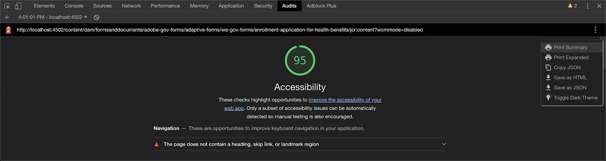

# Installation et configuration du site de référence We.Gov et We.Finance {#set-up-and-configure-we-gov-reference-site}

## Détails du package de démonstration {#demo-package-details}

### Conditions préalables à l’installation {#installation-prerequisites}

Ce module a été créé pour **AEM Forms 6.4 OSGI Author**, a été testé et est donc pris en charge sur les versions de plateforme suivantes :

| AEM VERSION | VERSION DU PACKAGE AEM FORMS | ÉTAT |
|---|---|---|
| 6.4 | 5.0.86 | **Pris en charge** |
| 6.5 | 6,0.80 | **Pris en charge** |
| 6.5.3 | 6.0.122 | **Pris en charge** |

Ce package contient la configuration cloud qui prend en charge les versions de plateforme suivantes :

| FOURNISSEUR CLOUD | VERSION DU SERVICE | ÉTAT |
|---|---|---|
| Adobe Sign | API v5 | **Pris en charge** |
| Microsoft Dynamics 365 | 1710 (9.1.0.3020) | **Pris en charge** |
| Adobe Analytics | API REST v1.4 | **Pris en charge** |
**Considérations relatives à l’installation du package :**

* Le package doit être installé sur un serveur propre, sans les autres packages de démonstration ou les anciennes versions de package de démonstration.
* Le package doit être installé sur un serveur OSGI, s’exécutant en mode création

### Qu’est-ce que ce module inclut {#what-does-this-package-include}

Le [package de démonstration AEM Forms We.Gov](https://experience.adobe.com/#/downloads/content/software-distribution/en/aem.html?package=/content/software-distribution/en/details.html/content/dam/aem/public/adobe/packages/cq650/featurepack/we-gov-forms.pkg.all-2.0.2.zip) (**we-gov-forms.pkg.all-&lt;version>.zip**) est fourni sous la forme d’un package comprenant plusieurs autres sous-packages et services. Le package comprend les modules suivants :

* **we-gov-forms.pkg.all-&lt;version>.zip**  -  *Package de démonstration complet*

   * **we-gov-forms.ui.apps-&lt;version>.zip** *: contient tous les composants, bibliothèques clientes, exemples d’utilisateurs, modèles de workflow, etc.*

      * **we-gov-forms.core-&lt;version>.jar**  :  *contient tous les services OSGI, l’implémentation des étapes de workflow personnalisées, etc.*

      * **we-gov-forms.derby&lt;version>.jar**  -  *contient tous les services OSGI, le schéma de base de données, etc.*

      * **core.wcm.components.all-2.0.4.zip**  -  *Collection d’exemples de composants WCM*

      * **grid-aem.ui.apps-1.0-SNAPSHOT.zip**  - Package de mise en page Grille  *AEM Sites pour le contrôle des colonnes de pages Sites*
   * **we-gov-forms.ui.content-&lt;version>.zip**  -  *contient tout le contenu, les pages, les images, les formulaires, les ressources de communication interactive, etc.*

   * **we-gov-forms.ui.analytics-&lt;version>.zip**  -  *Contient toutes les données d’analyse Forms We.Gov à stocker dans le référentiel.*

   * **we-gov-forms.config.public-&lt;version>.zip**  -  *contient tous les noeuds de configuration par défaut, y compris les configurations cloud d’espace réservé, afin d’éviter le modèle de données de formulaires et les problèmes de liaison de services.*

Les ressources incluses dans ce module sont les suivantes :

* AEM de pages de site avec des modèles modifiables
* Forms adaptatif AEM Forms
* Communications interactives AEM Forms (canal d’impression et web)
* Document d’enregistrement AEM Forms XDP
* Modèle de données Forms AEM Forms MS Dynamics
* Intégration Adobe Sign
* AEM modèle de processus
* Exemples d’images AEM Assets
* Exemple de base de données Apache Derby (en mémoire)
* Source de données Apache Derby (à utiliser avec le modèle de données de formulaire)

## Installation du package de démonstration {#demo-package-installation}

Cette section contient des informations sur l’installation du package de démonstration.

### À partir de Distribution logicielle {#from-software-distribution}

1. Ouvrez la [Distribution de logiciels](https://experience.adobe.com/downloads). Vous avez besoin d’un Adobe ID pour vous connecter à la Distribution de logiciels.
1. Appuyez sur **[!UICONTROL Adobe Experience Manager]** disponible dans le menu d’en-tête.
1. Dans la section **[!UICONTROL Filtres]** :
   1. Sélectionnez **[!UICONTROL Formulaires]** dans la liste déroulante **[!UICONTROL Solution]**.
   2. Sélectionnez la version et le type du package. Vous pouvez également utiliser l’option **[!UICONTROL Téléchargements de recherche]** pour filtrer les résultats.
1. Appuyez sur le nom du package **we-gov-forms.pkg.all-&lt;version>.zip**, sélectionnez **[!UICONTROL Accepter les termes du CLUF]** et appuyez sur **[!UICONTROL Télécharger]**.
1. Ouvrez [Package Manager](https://docs.adobe.com/content/help/fr/experience-manager-65/administering/contentmanagement/package-manager.html) et cliquez sur **[!UICONTROL Télécharger le package]** pour télécharger le package.
1. Sélectionnez le package et cliquez sur **[!UICONTROL Installer]**.

   

1. Autorisez le processus d’installation à se terminer.
1. Accédez à *https://&lt;aemserver>:&lt;port>/content/we-gov/home.html?wcmmode=disabled* pour vous assurer que l’installation a réussi.

### À partir d’un fichier ZIP local {#from-a-local-zip-file}

1. Téléchargez et recherchez le fichier **we-gov-forms.pkg.all-&lt;version>.zip**.
1. Accédez à *https://&lt;aemserver>:&lt;port>/crx/packmgr/index.jsp*.
1. Sélectionnez l’option &quot;Télécharger le package&quot;.

   

1. Utilisez l’explorateur de fichiers pour accéder au fichier ZIP téléchargé et le sélectionner.
1. Cliquez sur &quot;Ouvrir&quot; pour charger.
1. Une fois le téléchargement effectué, sélectionnez l’option &quot;Installer&quot; pour installer le package.

   

1. Autorisez le processus d’installation à se terminer.
1. Accédez à *https://&lt;aemserver>:&lt;port>/content/we-gov/home.html?wcmmode=disabled* pour vous assurer que l’installation a réussi.

### Installer de nouvelles versions de package {#installing-new-package-versions}

Pour installer une nouvelle version de package, suivez les étapes définies dans les versions 4.1 et 4.2. L&#39;installation d&#39;une version de package plus récente alors qu&#39;un autre package plus ancien est déjà installé est possible, mais il est recommandé de d&#39;abord désinstaller l&#39;ancienne version de package. Pour ce faire, procédez comme suit.

1. Accédez à *https://&lt;aemserver>:&lt;port>/crx/packmgr/index.jsp*
1. Recherchez l’ancien fichier **we-gov-forms.pkg.all-&lt;version>.zip**.
1. Sélectionnez l’option &quot;Plus&quot;.
1. Dans la liste déroulante, sélectionnez l’option &quot;Désinstaller&quot;.

   

1. Sur confirmation, sélectionnez à nouveau &quot;Désinstaller&quot; et autorisez le processus de désinstallation à se terminer.

## Configuration du package de démonstration {#demo-package-configuration}

Cette section contient des informations détaillées et des instructions sur la configuration post-déploiement du package de démonstration avant sa présentation.

### Configuration de l’utilisateur fictif {#fictional-user-configuration}

1. Accédez à *https://&lt;aemserver>:&lt;port>/libs/granite/security/content/groupadmin.html*
1. Connectez-vous en tant qu’administrateur pour effectuer les tâches ci-dessous.
1. Faites défiler la page jusqu’à la fin de la page pour charger tous les groupes d’utilisateurs.
1. Recherchez &quot;**workflow**&quot;.
1. Sélectionnez le groupe &quot;**workflow-users**&quot; et cliquez sur &quot;Propriétés&quot;.
1. Accédez à l’onglet &quot;Membres&quot;.
1. Saisissez **wegov** dans le champ &quot;Select User or Group&quot;.
1. Sélectionnez dans la liste déroulante &quot;**Utilisateurs de Forms We.Gov**&quot;.

   

1. Cliquez sur &quot;Enregistrer et fermer&quot; dans la barre de menus.
1. Répétez les étapes 2 à 7 en recherchant &quot;**analytics**&quot;, en sélectionnant le groupe &quot;**Administrateurs Analytics**&quot; et en ajoutant le groupe &quot;**Utilisateurs Forms We.Gov**&quot; en tant que membre.
1. Répétez les étapes 2 à 7 en recherchant &quot;**forms users**&quot;, en sélectionnant le groupe &quot;**forms-power-users**&quot; et en ajoutant le groupe &quot;**We.Gov Forms Users**&quot; en tant que membre.
1. Répétez les étapes 2 à 7 en recherchant &quot;**forms-users**&quot;, en sélectionnant le groupe &quot;**forms-users**&quot;, puis en ajoutant le groupe &quot;**We.Gov Users**&quot; en tant que membre.

### Configuration du serveur de messagerie {#email-server-configuration}

1. Consultez la documentation de configuration [Configuration de la notification électronique](/help/sites-administering/notification.md)
1. Connectez-vous en tant qu’administrateur pour effectuer cette tâche.
1. Accédez à *https://&lt;aemserver>:&lt;port>/system/console/configMgr*
1. Recherchez et cliquez sur le service **Day CQ Mail Service** à configurer.

   

1. Configurez le service pour vous connecter au serveur SMTP de votre choix :

   1. **SMTP Server hostname** : par exemple (smtp.gmail.com)
   1. **Port** du serveur : par exemple (465) pour gmail utilisant SSL
   1. **Utilisateur SMTP :** demo@  &lt;companyname> .com
   1. **Adresse** &quot;De&quot; : aemformsdemo@adobe.com

   

1. Cliquez sur &quot;Enregistrer&quot; pour enregistrer la configuration.

### (Facultatif) Configuration de SSL AEM {#aemsslconfig}

Cette section contient des informations détaillées sur la configuration du protocole SSL sur l’instance AEM afin de pouvoir configurer la configuration du cloud Adobe Sign.

**Références:**

1. [SSL par défaut](/help/sites-administering/ssl-by-default.md)

**Remarques:**

1. Accédez à https://&lt;aemserver>:&lt;port>/aem/inbox où vous pourrez terminer le processus décrit dans le lien de documentation de référence ci-dessus.
1. Le package `we-gov-forms.pkg.all-[version].zip` comprend un exemple de clé et de certificat SSL, accessible en extrayant le dossier `we-gov-forms.pkg.all-[version].zip/ssl` qui fait partie du package.

1. Certificat SSL et informations de clé :

   1. émis sur &quot;CN=localhost&quot;
   1. Validité 10 ans
   1. valeur de mot de passe de &quot;password&quot;
1. La clé privée est la clé *localhostprivate.der*.
1. Le certificat est le *localhost.crt*.
1. Cliquez sur Suivant.
1. Le nom d’hôte HTTPS doit être défini sur *localhost*.
1. Le port doit être défini sur un port exposé par le système.

### (Facultatif) Configuration cloud Adobe Sign {#adobe-sign-cloud-configuration}

Cette section contient des informations détaillées et des instructions sur la configuration du cloud Adobe Sign.

**Références:**

1. [Incorporation d’Adobe Sign à AEM Forms](adobe-sign-integration-adaptive-forms.md)

#### Configuration du cloud {#cloud-configuration}

1. Vérifiez les conditions préalables. Voir [Configuration SSL AEM](../../forms/using/forms-install-configure-gov-reference-site.md#aemsslconfig) pour connaître la configuration SSL requise.
1. Accédez à:

   *https://&lt;aemserver> :&lt;port>/libs/adobesign/cloudservices/adobesign.html/conf/we-gov*

   >[!NOTE]
   >
   >L’URL utilisée pour accéder au serveur AEM doit correspondre à l’URL configurée dans l’URI de redirection OAuth d’Adobe Sign afin d’éviter des problèmes de configuration (par exemple, *https://&lt;aemserver>:&lt;port>/mnt/overlay/adobesign/cloudservices/adobesign/properties.html*)

1. Sélectionnez la configuration &quot;We.gov Adobe Sign&quot;.
1. Cliquez sur &quot;Propriétés&quot;.
1. Accédez à l’onglet &quot;Paramètres&quot;.
1. Saisissez l’URL oAuth, par exemple : [https://secure.na1.echosign.com/public/oauth](https://secure.na1.echosign.com/public/oauth)
1. Indiquez l’identifiant du client et le secret du client configurés à partir de l’instance Adobe Sign configurée.
1. Cliquez sur &quot;Se connecter à Adobe Sign&quot;.
1. Une fois la connexion établie, cliquez sur &quot;Enregistrer et fermer&quot; pour terminer l’intégration.

### (Facultatif) Configuration cloud MS Dynamics {#ms-dynamics-cloud-configuration}

Cette section contient des détails et des instructions sur la configuration du cloud MS Dynamics.

**Références:**

1. [Configuration du service OData de Microsoft Dynamics](https://docs.adobe.com/content/help/en/experience-manager-64/forms/form-data-model/ms-dynamics-odata-configuration.html)
1. [Configuration de Microsoft Dynamics pour AEM Forms](https://helpx.adobe.com/experience-manager/kt/forms/using/config-dynamics-for-aem-forms.html)

#### Service cloud OData MS Dynamics {#ms-dynamics-odata-cloud-service}

1. Accédez à:

   https://&lt;aemserver>:&lt;port>/libs/fd/fdm/gui/components/admin/fdmcloudservice/fdm.html/conf/we-gov

   1. Vérifiez que vous accédez au serveur à l’aide de la même URL de redirection que celle configurée dans l’enregistrement de l’application MS Dynamics.

1. Sélectionnez la configuration &quot;Cloud Service OData Microsoft Dynamics&quot;.
1. Cliquez sur &quot;Propriétés&quot;.

   

1. Accédez à l’onglet &quot;Paramètres d’authentification&quot;.
1. Saisissez les informations suivantes :

   1. **Racine du service :** par exemple, https://msdynamicsserver.api.crm3.dynamics.com/api/data/v9.1/
   1. **Type d’authentification :** OAuth 2.0
   1. **Paramètres d’authentification**  (voir  [Paramètres de configuration du cloud ](../../forms/using/forms-install-configure-gov-reference-site.md#dynamicsconfig) MS Dynamics pour collecter ces informations) :

      1. ID client - également appelé ID d’application
      1. Secret client
      1. URL OAuth - par exemple [https://login.windows.net/common/oauth2/authorize](https://login.windows.net/common/oauth2/authorize)
      1. Actualiser l’URL du jeton - par exemple [https://login.windows.net/common/oauth2/token](https://login.windows.net/common/oauth2/token)
      1. URL du jeton d’accès : par exemple, [https://login.windows.net/common/oauth2/token](https://login.windows.net/common/oauth2/token)
      1. Portée de l’autorisation - **openid**
      1. En-tête d’authentification - **Porteur d’autorisation**
      1. Ressource - par exemple [https://msdynamicsserver.api.crm3.dynamics.com](https://msdynamicsserver.api.crm3.dynamics.com)
   1. Cliquez sur &quot;Se connecter à OAuth&quot;.

1. Après une authentification réussie, cliquez sur &quot;Enregistrer et fermer&quot; pour terminer l’intégration.

#### Paramètres de configuration du cloud MS Dynamics {#dynamicsconfig}

Les étapes détaillées dans cette section sont incluses pour vous aider à localiser l’ID client, le secret client et les détails de votre instance MS Dynamics Cloud.

1. Accédez à [https://portal.azure.com/](https://portal.azure.com/) et connectez-vous.
1. Dans le menu de gauche, sélectionnez &quot;Tous les services&quot;.
1. Recherchez ou accédez à &quot;Enregistrement de l’application&quot;.
1. Créez ou sélectionnez un enregistrement d’application existant.
1. Copiez l’**ID de l’application** à utiliser comme **ID du client OAuth** dans la configuration de cloud AEM
1. Cliquez sur &quot;Paramètres&quot; ou &quot;manifeste&quot; pour configurer les **URL de réponse.**

   1. Cette URL doit correspondre à l’URL utilisée pour accéder à votre serveur AEM lors de la configuration du service OData.

1. Dans la vue Paramètre, cliquez sur &quot;Clés&quot; pour afficher la création d’une clé (celle-ci est utilisée comme secret client dans AEM ).

   1. Veillez à conserver une copie de la clé, car vous ne pourrez pas la visualiser ultérieurement dans Azure ou AEM.

1. Pour localiser l’URL de ressource/l’URL racine du service, accédez au tableau de bord de l’instance MS Dynamics.
1. Dans la barre de navigation supérieure, cliquez sur &quot;Ventes&quot; ou sur votre propre type d’instance et &quot;Sélectionner les paramètres&quot;.
1. Cliquez sur &quot;Personnalisations&quot; et &quot;Ressources pour les développeurs&quot; en bas à droite.
1. Vous y trouverez l’URL racine du service : e.g

   *[https://msdynamicsserver.api.crm3.dynamics.com/api/data/v9.1/](https://msdynamicsserver.api.crm3.dynamics.com/api/data/v9.1/)*

1. Vous trouverez des informations détaillées sur l’URL du jeton d’accès et d’actualisation ici :

   *[https://docs.microsoft.com/en-us/rest/api/datacatalog/authenticate-a-client-app](https://docs.microsoft.com/en-us/rest/api/datacatalog/authenticate-a-client-app)*

#### Test du modèle de données Forms (Dynamics) {#testing-the-form-data-model}

Une fois la configuration du cloud terminée, vous pouvez tester le modèle de données de formulaire.

1. Accédez à . 

   *https://&lt;aemserver> :&lt;port>/aem/forms.html/content/dam/formsanddocuments-fdm/we-gov*

1. Sélectionnez &quot;We.gov Microsoft Dynamics CRM FDM&quot; et sélectionnez &quot;Propriétés&quot;.

   

1. Accédez à l’onglet &quot;Mettre à jour la source&quot;.
1. Assurez-vous que la &quot;configuration contextuelle&quot; est définie sur &quot;/conf/we-gov&quot; et que la source de données configurée est &quot;ms-dynamics-odata-cloud-service&quot;.

   

1. Modifiez le modèle de données de formulaire.

1. Testez les services pour vérifier qu’ils se connectent à la source de données configurée.

   >[!NOTE]
   Après avoir testé les services, cliquez sur **Annuler** pour vous assurer que les modifications involontaires ne sont pas propagées au modèle de données de formulaire.

   >[!NOTE]
   Il a été signalé qu’un redémarrage du serveur AEM était nécessaire pour que la source de données soit correctement liée à FDM.

#### Test du modèle de données Forms (Derby) {#test-fdm-derby}

Une fois la configuration du cloud terminée, vous pouvez tester le modèle de données de formulaires.

1. Accédez à *https://&lt;aemserver>:&lt;port>/aem/forms.html/content/dam/formsanddocuments-fdm/we-gov*

1. Sélectionnez le **FDM d’inscription We.gov** et sélectionnez **Propriétés**.

   

1. Accédez à l’onglet **Mettre à jour la source** .

1. Assurez-vous que la **configuration contextuelle** est définie sur `/conf/we-gov` et que la source de données configurée est **We.Gov Derby DS**.

   

1. Cliquez sur **Enregistrer et fermer**.

1. [Testez les ](work-with-form-data-model.md#test-data-model-objects-and-services) services pour vérifier qu’ils se connectent à la source de données configurée.

   * Pour tester la connexion, sélectionnez **HOMEMORTGAGEACCOUNT** et fournissez-lui un service get. Testez le service et les administrateurs système peuvent voir les données en cours de récupération.

### Configuration Adobe Analytics (facultatif) {#adobe-analytics-configuration}

Cette section contient des informations détaillées et des instructions sur la configuration de Adobe Analytics Cloud.

**Références:**

* [Intégration à Adobe Analytics](../../sites-administering/adobeanalytics.md)

* [Connexion à Adobe Analytics et création de structures](../../sites-administering/adobeanalytics-connect.md)

* [Affichage des données d’analyse de page](../../sites-authoring/pa-using.md)

* [Configuration des analyses et des rapports](configure-analytics-forms-documents.md)

* [Consultation et compréhension des rapports d’analyse d’AEM Forms](view-understand-aem-forms-analytics-reports.md)

### Configuration du service cloud Adobe Analytics {#adobe-analytics-cloud-service-configuration}

Ce package est préconfiguré pour se connecter à Adobe Analytics. Les étapes ci-dessous sont fournies pour permettre la mise à jour de cette configuration.

1. Accédez à *https://&lt;aemserver>:&lt;port>/libs/cq/core/content/tools/cloudservices.html*
1. Recherchez la section Adobe Analytics et cliquez sur le lien &quot;Afficher les configurations&quot;.
1. Sélectionnez la configuration &quot;We.Gov Adobe Analytics (configuration Analytics)&quot;.

   

1. Cliquez sur le bouton &quot;Modifier&quot; pour mettre à jour la configuration Adobe Analytics (vous devrez fournir le secret partagé). Cliquez sur &quot;Se connecter à Analytics&quot; pour vous connecter et sur &quot;OK&quot; pour terminer.

   

1. Sur la même page, cliquez sur &quot;We.Gov Adobe Analytics Framework (Analytics Framework)&quot; si vous souhaitez mettre à jour les configurations de structure (voir [Activer la création AEM](../../forms/using/forms-install-configure-gov-reference-site.md#enableauthoring) pour activer la création).

#### Adobe Analytics Localisation des informations d’identification d’utilisateur {#analytics-locating-user-credentials}

Pour localiser les informations d’identification d’utilisateur d’un compte Adobe Analytics, l’administrateur de compte doit effectuer les tâches suivantes.

1. Accédez au portail Adobe Experience Cloud.
   * Connexion à l’aide des informations d’identification de l’administrateur
1. Sélectionnez l&#39;icône Adobe Analytics dans le tableau de bord principal.
   
1. Accédez à l’onglet Admin et sélectionnez l’élément Gestion des utilisateurs (héritée) .
   
1. Sélectionnez l’onglet **Utilisateurs** .
   
1. Sélectionnez un utilisateur dans la liste des utilisateurs.
1. Faites défiler la page jusqu’au bas de la page pour afficher les informations d’authentification des utilisateurs.
   
1. Le nom d’utilisateur et les informations secrètes partagées s’affichent sur le côté droit de la zone d’autorisations.
1. Notez que le nom d’utilisateur aura un deux-points dans le nom. Toutes les informations à gauche du deux-points sont le nom d’utilisateur et toutes les informations à droite du deux-points sont le nom de la société.
   * Voici un exemple : *nom d’utilisateur : nom de la société*

#### Configuration de l’authentification des utilisateurs dans Adobe Analytics {#setup-user-authentication}

Les administrateurs peuvent accorder aux utilisateurs des autorisations AEM Analytics en procédant comme suit.

1. Accédez à Adobe Admin Console.

1. Cliquez sur l’instance Analytics exposée à la console d’administration.

   * Celui-ci se trouve sur la page principale de la page d’administration.

1. Sélectionnez Accès administrateur complet dans Analytics.

1. Ajoutez un utilisateur au profil.

   

1. Cliquez sur l’onglet Autorisations une fois que l’ID utilisateur a été mappé dans le profil.

1. Assurez-vous que toutes les autorisations sont mises en correspondance avec le profil.

   

1. Notez qu’une fois les autorisations mappées sur la capacité d’un utilisateur à se connecter peut prendre quelques heures.

### Rapports Adobe Analytics {#adobe-analytics-reporting}

#### Affichage des rapports de sites Adobe Analytics {#view-adobe-analytics-sites-reporting}

>[!NOTE]
Les données AEM Forms Analytics sont disponibles hors ligne ou sans configuration de cloud Adobe Analytics si le package `we-gov-forms.ui.analytics-<version>.zip` est installé, mais les données AEM Sites nécessitent une principale configuration de cloud.

1. Accédez à *https://&lt;aemserver>:&lt;port>/sites.html/content*
1. Sélectionnez &quot;AEM Forms We.Gov Site&quot; pour afficher les pages du site.
1. Sélectionnez l’une des pages du site (par exemple Accueil), puis &quot;Analytics et Recommendations&quot;.

   

1. Sur cette page, vous verrez les informations récupérées d’Adobe Analytics qui se rapportent à la page AEM Sites (remarque : par conception, ces informations sont régulièrement actualisées à partir d’Adobe Analytics et ne s’affichent pas en temps réel).

   

1. De retour sur la page vue (accessible à l’étape 3.), vous pouvez également afficher les informations de page vue en modifiant le paramètre d’affichage afin d’afficher les éléments en &quot;mode Liste&quot;.
1. Recherchez le menu déroulant &quot;Affichage&quot; et sélectionnez &quot;Mode Liste&quot;.

   

1. Dans le même menu, sélectionnez &quot;Paramètre d’affichage&quot; et sélectionnez les colonnes que vous souhaitez afficher dans la section &quot;Analytics&quot;.

   

1. Cliquez sur &quot;Mettre à jour&quot; pour rendre les nouvelles colonnes disponibles.

   

#### Affichage des rapports Adobe Analytics forms {#view-adobe-analytics-forms-reporting}

>[!NOTE]
Les données AEM Forms Analytics sont disponibles hors ligne ou sans configuration de cloud Adobe Analytics si le package `we-gov-forms.ui.analytics-<version>.zip` est installé, mais les données AEM Sites nécessitent une principale configuration de cloud.

1. Accédez à . 

   *https://&lt;aemserver> :&lt;port>/aem/forms.html/content/dam/formsanddocuments/adobe-gov-forms*

1. Sélectionnez le formulaire adaptatif &quot;Demande d’inscription pour les prestations de santé&quot; et sélectionnez l’option &quot;Rapport Analytics&quot;.

   

1. Patientez jusqu’au chargement de la page et affichez les données du rapport Analytics.

   

### Activation de la configuration automatisée de Forms Adobe {#automated-forms-enablement}

Pour installer et configurer AEM Forms avec Adobe Forms, les utilisateurs de l’outil de conversion doivent disposer des éléments suivants.

1. Accès à l’Adobe I/O.

1. Autorisation de créer une intégration avec le service de conversion Forms Adobe.

1. Adobe AEM Service Pack le plus récent version 6.5 s’exécutant en tant qu’auteur.

Avant de lire d’autres instructions, veuillez consulter les éléments suivants :

* [Configurer le service de conversion automatisée de formulaires](https://docs.adobe.com/content/help/en/aem-forms-automated-conversion-service/using/configure-service.html)

#### Création d’une configuration IMS Partie 1 {#creating-ims-config}

Pour configurer le service afin qu’il communique correctement avec l’outil de conversion de formulaires, les utilisateurs doivent configurer le service Identity Management System (IMS) pour pouvoir s’enregistrer auprès d’Adobe I/O.

1. Accédez à https://&lt;aemserver>:&lt;port> > Cliquez sur Adobe Experience
Gestionnaire en haut à gauche > Outils > Sécurité > Adobe de la configuration IMS.

1. Cliquez sur Créer.

1. Exécutez les actions dans l’image ci-dessous.

   

1. Veillez à télécharger le certificat.

1. Ne passez pas au reste de la configuration - passez en revue la section [Création de l’intégration dans Adobe I/O](#create-integration-adobeio)

>[!NOTE]
Le certificat créé dans cette section va être utilisé pour créer le service d&#39;intégration dans Adobe I/O. Une fois que les utilisateurs ont créé dans le service d’intégration, ils peuvent utiliser ces informations depuis Adobe I/O pour terminer la configuration.

#### Création de l’intégration dans Adobe I/O {#create-integration-adobeio}

Assurez-vous que vous avez la possibilité de créer une intégration dans votre domaine d’Adobe si vous ne contactez pas votre administrateur système pour ce faire.

1. Accédez à la [console Adobe I/O](https://console.adobe.io/).

1. Cliquez sur Créer une intégration.

1. Sélectionnez Accéder à une API .

1. Assurez-vous que vous vous trouvez dans le bon groupe (liste déroulante en haut à droite).

1. Dans la section Experience Cloud, sélectionnez l’outil de conversion Forms.

1. Cliquez sur Continuer.

1. Saisissez le nom et la description de votre intégration.

1. L’utilisation de la clé publique de la section 2.1 la place dans l’intégration de la clé.

1. Sélectionnez un profil pour votre automated forms conversion.

   

#### Création de la configuration IMS Partie 2 {#create-ims-config-part-next}

Maintenant que vous avez créé une intégration, nous allons terminer l&#39;installation de la configuration IMS.

1. Cliquez sur votre intégration dans Adobe I/O afin d’exposer les détails de connexion.

1. Accédez à votre configuration IMS dans AEM (Outils > Sécurité > IMS).

1. Cliquez sur Suivant dans l’écran Configuration IMS.

1. Saisissez le serveur d&#39;autorisation (valeur affichée dans la capture d&#39;écran).

1. Saisissez la clé API.

1. Saisissez le secret client (cliquez sur exposer dans l’Adobe I/O Intégration pour qu’il soit affiché).

1. Cliquez sur l’onglet JWT dans Adobe I/O afin d’obtenir la charge utile JWT et de la coller dans la charge utile de la configuration IMS.

   

1. Une fois créés, cliquez sur Configuration IMS et sélectionnez Contrôle de l’intégrité. Les utilisateurs doivent voir le résultat suivant.

   

#### Configuration du cloud (production AFC We.Gov) {#configure-cloud-configuration}

Une fois la configuration IMS terminée, nous pouvons passer en revue la configuration cloud dans AEM. Si la configuration n’existe pas, procédez comme suit pour créer la configuration cloud dans AEM :

1. Ouvrez votre navigateur et accédez à l’URL système https://&lt;nom_domaine>:&lt;port_système>

1. Cliquez sur Adobe Experience Manager dans le coin supérieur gauche de l’écran > Outils > Cloud Services > Configuration de la conversation Forms automatisée.

1. Sélectionnez le dossier de configuration dans lequel vous souhaitez placer la configuration.

1. Cliquez sur Créer.

1. Saisissez les informations dans la capture d’écran ci-dessous.

   

1. Fournissez un titre et un nom à la configuration.

1. L’URL du service pour le système est définie sur https://aemformsconversion.adobe.io/.

1. URL du modèle */conf/we-gov/settings/wcm/templates/we-gov-flamingo-template*.

1. URL du thème : */content/dam/formsanddocuments-themes/adobe-gov-forms-themes/we-gov-theme*

1. Cliquez sur Suivant.

1. Pour cette configuration, nous avons laissé les deux valeurs de case à cocher vides.

   * Pour en savoir plus sur ces options, voir [Configuration du service cloud](https://docs.adobe.com/content/help/en/aem-forms-automated-conversion-service/using/configure-service.html#configure-the-cloud-service).

#### Configuration du cloud (production AFC We.Finance) {#configure-cloud-configuration-wefinance}

Une fois la configuration IMS terminée, nous pouvons procéder à la création de la configuration cloud dans AEM.

1. Ouvrez votre navigateur et accédez à l’URL système https://&lt;nom_domaine>:&lt;port_système>

1. Cliquez sur Adobe Experience Manager dans le coin supérieur gauche de l’écran > Outils > Cloud Services > Configuration de la conversation Forms automatisée.

1. Sélectionnez le dossier de configuration dans lequel vous souhaitez placer la configuration.

1. Cliquez sur Créer.

1. Saisissez les informations dans la capture d’écran ci-dessous.

   

1. Fournissez un titre et un nom à la configuration.

1. L’URL du service pour le système est définie sur https://aemformsconversion.adobe.io/

1. URL du modèle : */conf/we-finance/settings/wcm/templates/we-finance-adaptive-form*

1. URL du thème : */content/dam/formsanddocuments-themes/adobe-finance-forms-themes/we-finance-theme*

1. Cliquez sur Suivant.

1. Pour cette configuration, nous avons laissé les deux valeurs de case à cocher vides.

   * Pour en savoir plus sur ces options, voir [Configuration du service cloud](https://docs.adobe.com/content/help/en/aem-forms-automated-conversion-service/using/configure-service.html#configure-the-cloud-service).

#### Test de la conversion de formulaires (application d’inscription We.Gov) {#test-forms-conversion}

Une fois la configuration configurée, les utilisateurs peuvent la tester en téléchargeant un document PDF.

1. Accédez au système AEM https://&lt;nom_domaine>:&lt;port_système>

1. Cliquez sur Forms > Forms &amp; Documents > AEM Forms We.gov Forms > AFC.

1. Sélectionnez le fichier PDF de l’application d’inscription We.Gov.

1. Cliquez sur le bouton **Démarrer la conversion automatisée** dans le coin supérieur droit.

1. Les utilisateurs doivent pouvoir voir l’option comme illustré ci-dessous.

   

1. Une fois le bouton sélectionné, les options suivantes sont présentées aux utilisateurs :

   * Assurez-vous que les utilisateurs sélectionnent la configuration *We.Gov AFC Production*

   

   

1. Sélectionnez Démarrer la conversion une fois que vous avez configuré toutes les options que vous souhaitez utiliser.

1. Au début du processus de conversion, les utilisateurs doivent voir l’écran suivant :

   

1. Une fois la conversion terminée, l’écran suivant s’affiche pour les utilisateurs :

   

   Cliquez sur le dossier **Output** pour afficher le formulaire adaptatif généré.

#### Problèmes connus et notes {#known-issues-notes}

Le service Automated forms conversion comprend certaines [bonnes pratiques, modèles complexes connus](https://docs.adobe.com/content/help/en/aem-forms-automated-conversion-service/using/styles-and-pattern-considerations-and-best-practices.html) et [problèmes connus](https://docs.adobe.com/content/help/en/aem-forms-automated-conversion-service/using/known-issues.html). Consultez-les avant de commencer à utiliser le service AEM Forms Automated forms conversion.

1. Générez le formulaire avec Générer le ou les formulaires adaptatifs sans liaison de données activée si vous souhaitez lier le formulaire à un FDM après la conversion.

1. Assurez-vous que jcr:read est activé pour toutes les autorisations du dossier de modèles, sinon l’utilisateur du service ne pourra pas lire le modèle à partir du référentiel et la conversion échouera.

## Personnalisations du package de démonstration {#demo-package-customizations}

Cette section comprend des instructions sur la personnalisation de la démonstration.

### Personnalisation des modèles {#templates-customization}

Les modèles modifiables se trouvent à l’emplacement suivant :

*https://&lt;aemserver> :&lt;port>/libs/wcm/core/content/sites/templates.html/conf/we-gov*

Ces modèles incluent les modèles Site AEM, Formulaire adaptatif et Communications interactives, créés et assemblés avec des composants qui se trouvent à l’adresse :

*https://&lt;aemserver> :&lt;port>/crx/de/index.jsp#/apps/we-gov/components*

#### Système de style {#customizetemplates}

Ce site comprend également des bibliothèques clientes, dont l’une importe le Bootstrap 4 ( [https://getbootstrap.com/](https://getbootstrap.com/) ). Cette bibliothèque cliente est disponible à l’adresse

*https://&lt;aemserver> :&lt;port>/crx/de/index.jsp#/apps/we-gov/clientlibs/clientlib-base/css/bootstrap*

Les modèles modifiables inclus dans ce package sont également préconfigurés avec des stratégies de modèle/page qui utilisent les classes CSS Bootstrap 4 pour la pagination, le style, etc. Toutes les classes n’ont pas été ajoutées aux stratégies de modèle, mais toute classe prise en charge par le Bootstrap 4 peut être ajoutée aux stratégies. Consultez la page de prise en main pour obtenir la liste des classes disponibles :

[https://getbootstrap.com/docs/4.1/getting-started/introduction/](https://getbootstrap.com/docs/4.1/getting-started/introduction/)

Les modèles inclus dans ce module prennent également en charge le système de style :

[Système de style](../../sites-authoring/style-system.md)

#### Logs du modèle {#template-logos}

Les ressources DAM du projet incluent également des logos et des images We.Gov. Ces ressources sont disponibles à l’adresse suivante :

*https://&lt;aemserver> :&lt;port>/assets.html/content/dam/we-gov*

Lors de la modification des modèles de page et de formulaire, vous pouvez choisir de mettre à jour les logos de la marque en modifiant les composants Navigation et Pied de page . Ces composants offrent une boîte de dialogue de marque et de logo configurable qui peut être utilisée pour mettre à jour les logos :

Voir Modification du contenu de la page pour plus d’informations :

[Modification du contenu de la page](../../sites-authoring/editing-content.md)

### Personnalisation des pages de sites {#sites-pages-customization}

Toutes les pages du site sont disponibles à partir de : *https://&lt;aemserver>:&lt;port>/sites.html/content/we-gov*

Ces pages de site utilisent également le module AEM Grille pour contrôler la mise en page de quelques composants.

#### Système de style {#style-system}

Les pages incluses dans ce module prennent également en charge le système de style :

[Système de style](../../sites-authoring/style-system.md)

Vous pouvez également consulter [Système de style de personnalisation des modèles](../../forms/using/forms-install-configure-gov-reference-site.md#customizetemplates) pour obtenir de la documentation sur les styles pris en charge.

### Personnalisation des formulaires adaptatifs {#adaptive-forms-customization}

Tous les formulaires adaptatifs sont disponibles à partir de :

*https://&lt;aemserver> :&lt;port>/aem/forms.html/content/dam/formsanddocuments/adobe-gov-forms*

Ces formulaires peuvent être personnalisés pour répondre à certains cas d’utilisation. Notez que certains champs et la logique d’envoi ne doivent pas être modifiés pour garantir le bon fonctionnement du formulaire. Cela inclut :

**Demande D’Inscription Pour Les Avantages De Santé :**

* contact_id : champ masqué utilisé pour recevoir l’ID de contact MS Dynamics lors de l’envoi.
* Envoyer : la logique du bouton Envoyer nécessite une personnalisation pour prendre en charge les rappels. La personnalisation est documentée, mais un script volumineux était nécessaire pour envoyer le formulaire lors de l’exécution d’une opération de POST et de GET à MS Dynamics via le modèle de données Forms.
* Panneau racine : l’événement Initialize permet d’ajouter un bouton MS Dynamics à la boîte de réception d’AEM de la manière la moins intrusive possible, car tous les composants de l’interface utilisateur Granite de la boîte de réception d’AEM ne peuvent pas être modifiés.

#### Style de formulaire adaptatif {#adaptive-form-styling}

Les formulaires adaptatifs peuvent également être stylisés à l’aide de l’éditeur de style ou de thème :

* [Styles intégrés des composants de formulaire adaptatif](inline-style-adaptive-forms.md)
* [Création et utilisation des thèmes](themes.md)

### Personnalisation des workflows {#workflow-customization}

Le formulaire adaptatif d’inscription est envoyé à un processus OSGI pour traitement. Ce workflow se trouve à l’adresse *https://&lt;aemserver>:&lt;port>/conf/we-gov/settings/models/we-gov-process.html*.

En raison de certaines limitations, ce workflow contient plusieurs scripts et étapes de processus OSGI personnalisées. Ces étapes de workflow ont été créées sous la forme d’étapes génériques et n’ont pas été créées avec des boîtes de dialogue de configuration. Actuellement, la configuration des étapes du workflow repose sur des arguments de processus.

Tout le code Java de l’étape du workflow est contenu dans le lot **we-gov-forms.core-&lt;version>.jar**.

## Considérations relatives aux démonstrations et problèmes connus {#demo-considerations-and-known-issues}

Cette section contient des informations sur les fonctionnalités de démonstration et les décisions de conception qui peuvent nécessiter des considérations spéciales pendant le processus de démonstration.

### Remarques concernant la démonstration {#demo-considerations}

* Selon AGRS-159, assurez-vous que le nom (premier, intermédiaire et dernier) du contact utilisé dans le formulaire adaptatif d’inscription est unique.
* Le formulaire adaptatif d’inscription enverra le courrier électronique Adobe Sign à l’adresse électronique spécifiée dans le champ de courrier électronique du formulaire. Cette adresse électronique ne peut pas être la même que celle utilisée pour configurer la configuration cloud Adobe Sign.

### Problèmes connus {#known-issues}

* (AGRS-120) Le composant Navigation du site ne prend actuellement pas en charge les pages enfants imbriquées de plus de 2 niveaux.
* (AGRS-159) Le FDM MS Dynamics actuel doit effectuer 2 opérations pour commencer, POST les données du formulaire adaptatif d’inscription à Dynamics, puis récupération de l’enregistrement de l’utilisateur afin de récupérer l’ID de contact. Dans son état actuel, la récupération de l’ID de contact échoue si plus de deux utilisateurs portant le même nom sont présents dans Dynamics, ce qui n’autorise pas l’envoi du formulaire adaptatif d’inscription.

## Configuration des tests d’accessibilité {#configure-accessibility-testing}

### Activation du test d’accessibilité Ajout de Chrome sur {#enable-chrome-add-on}

Pour effectuer d’abord des tests d’accessibilité, vous devez installer le module externe Chrome. Vous pouvez le trouver [ici](https://chrome.google.com/webstore/detail/accessibility-developer-t/fpkknkljclfencbdbgkenhalefipecmb?hl=en).

Une fois installé, chargez la page que vous souhaitez tester dans le navigateur Chrome (Remarque : L’ouverture de plusieurs onglets peut avoir une incidence sur votre score. Il est préférable de n’ouvrir qu’un seul onglet.) Une fois la page chargée
**cliquez avec le bouton droit de la souris** sur la page et sélectionnez l’onglet **Audits** . Les développeurs peuvent sélectionner le type d’audit à effectuer par le module externe Accessibilité . Une fois toutes les options sélectionnées, l’utilisateur peut cliquer sur le bouton Générer le rapport . Cela génère un document PDF qui indique la note d’accessibilité globale et ce qui peut être utilisé pour augmenter la note d’accessibilité globale.

Une fois le rapport exécuté, les utilisateurs peuvent s’attendre à voir les éléments suivants :

Le nombre affiché devant les utilisateurs est la note d’accessibilité globale qu’ils ont acquise. Il existe également une description de la façon dont ce calcul a été effectué en fonction du score.

Si les utilisateurs souhaitent l’exporter, ils peuvent cliquer sur les trois boutons situés à droite de l’écran et choisir parmi les autres options proposées par le module externe.

### Thème Ultramarine {#ultramarine-theme}

Le thème Ultramarine, accessible au public et géré par Adobe, est intégré au
`we-gov-forms.pkg.all-<version>.zip` fichier ZIP installable. Une fois ce package installé à l’aide de CRX.

Gestionnaire de modules, les utilisateurs peuvent accéder au thème Ultramarine dans AEM Forms en accédant à **Forms** > **Thèmes** > **Thèmes de référence** > **Ultramarine-accessible**.

## Options de configuration {#configuration-options}

Les utilisateurs peuvent configurer différentes options de service de workflow, notamment :

1. Entrée Microsoft Dynamics
1. Adobe Sign
1. AEM Gestion des communications personnalisées
1. Adobe Analytics

Pour les configurer afin qu’ils soient activés dans le workflow, les utilisateurs doivent effectuer les tâches suivantes.

1. Accédez à https://&#39;[server]:[port]&#39;/system/console/configMgr.

1. Recherchez les *Configurations WeGov*.

1. Ouvrez la définition de service et activez les services sélectionnés à appeler dans le workflow.

   >[!NOTE]
   Tout simplement parce qu’un utilisateur active le service dans la page Configuration Manager, les utilisateurs doivent toujours configurer un service pour communiquer avec les services externes demandés.

   

1. Une fois l’opération terminée, cliquez sur le bouton Enregistrer pour enregistrer les paramètres.

## Étapes suivantes {#next-steps}

Vous êtes maintenant prêt à explorer le site de référence We.Gov. Pour plus d’informations sur le workflow et les étapes du site de référence We.Gov, consultez la [présentation du site de référence We.Gov](../../forms/using/forms-gov-reference-site-user-demo.md).
