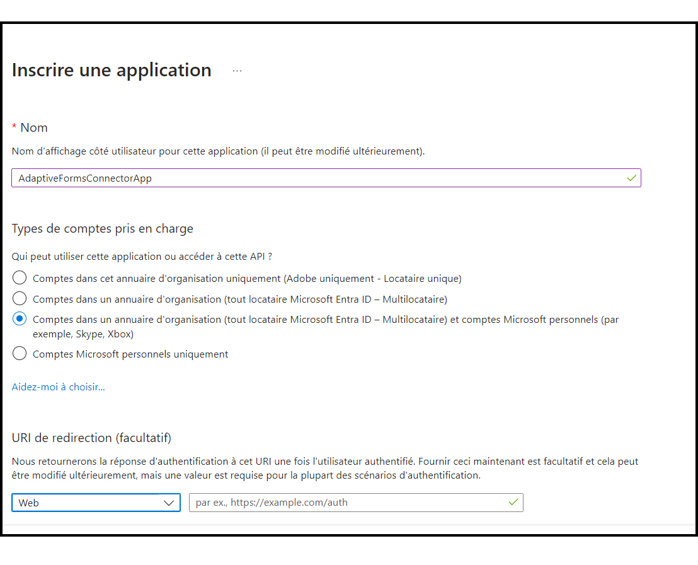
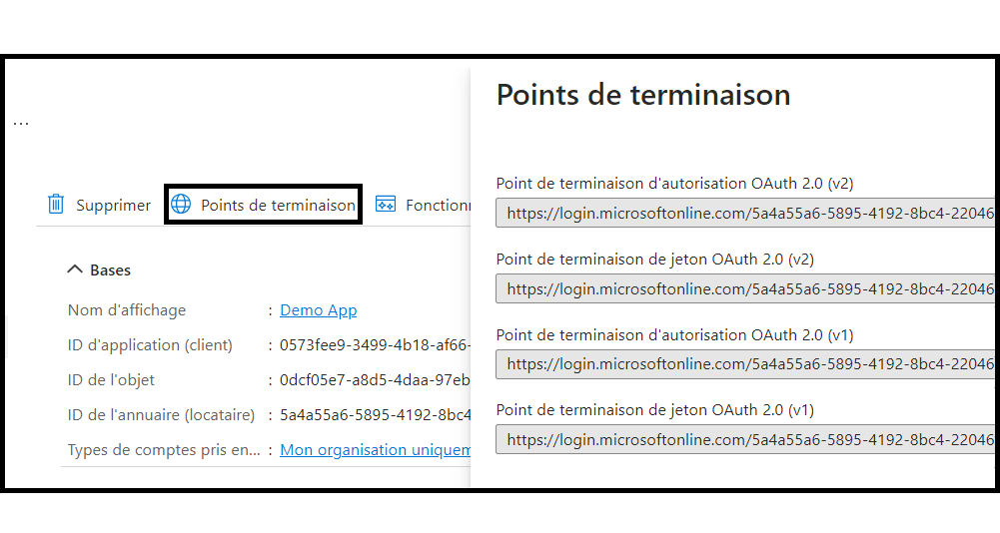
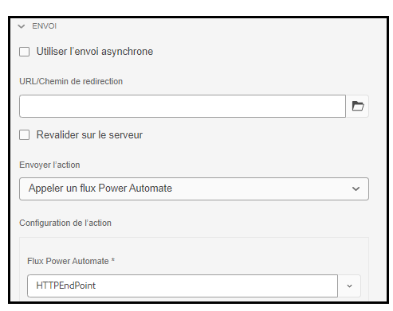

# Connecter et envoyer des données de formulaire adaptatif à Microsoft® Power Automate {#connect-adaptive-form-with-power-automate}

| Version | Lien de l’article |
| -------- | ---------------------------- |
| AEM 6.5 | Cet article |
| AEM as a Cloud Service | [Cliquez ici](https://experienceleague.adobe.com/en/docs/experience-manager-cloud-service/content/forms/integrate/set-submit-action/forms-microsoft-power-automate-integration) |

Vous pouvez configurer un formulaire adaptatif pour exécuter un flux cloud Power Automate lors de l’envoi. Le formulaire adaptatif configuré envoie les données capturées, les pièces jointes et le document d’enregistrement au flux Cloud Power Automate pour traitement. Il vous permet de créer une expérience de capture de données personnalisée tout en tirant parti de la puissance de Microsoft® Power Automate pour élaborer des logiques commerciales autour des données capturées et automatiser les workflows client. Voici quelques exemples de ce que vous pouvez faire après l’intégration d’un formulaire adaptatif à Microsoft® Power Automate :

* Utiliser des données de formulaires adaptatifs dans des processus d’entreprise Power Automate
* Utilisez Power Automate pour envoyer des données capturées à plus de 500 sources de données ou à toute API publique
* Exécuter des calculs complexes sur les données capturées
* Enregistrer des données de formulaires adaptatifs dans les systèmes de stockage selon un planning prédéfini

L’éditeur de formulaires adaptatifs fournit l’action d’envoi **Appeler un flux Microsoft® Power Automate** pour envoyer des données de formulaires adaptatifs et des pièces jointes, et un document d’enregistrement est envoyé au flux de cloud Power Automate. Pour utiliser l’action Envoyer afin d’envoyer les données capturées à Microsoft® Power Automate, [connectez votre instance de création AEM Forms à Microsoft® Power Automate](#connect-your-aem-forms-instance-with-microsoft&reg;-power-automate).

## Conditions préalables

Les éléments suivants sont requis pour connecter un formulaire adaptatif à Microsoft® Power Automate :

* Licence Premium Microsoft® Power Automate
* [Flux Microsoft® Power Automate](https://learn.microsoft.com/fr-fr/power-automate/create-flow-solution) avec le déclencheur `When an HTTP request is received` pour accepter les données d’envoi de formulaire adaptatif
* Utilisateur ou utilisatrice Experience Manager disposant de droits de [création](/help/forms/using/forms-groups-privileges-tasks.md) et d’[administration](/help/forms/using/forms-groups-privileges-tasks.md) de formulaires
* Compte utilisé pour se connecter à Microsoft® Power Automate étant propriétaire du flux Power Automate configuré pour recevoir des données du formulaire adaptatif


## Connecter votre instance AEM Forms à Microsoft® Power Automate {#connect-forms-server-with-power-automate}

Effectuez les actions suivantes pour connecter votre instance de création AEM Forms à Microsoft® Power Automate :

1. [Créer une Microsoft](#ms-power-automate-application)
1. [Créer Microsoft](#microsoft-power-automate-dataverse-cloud-configuration)
1. [Créer Microsoft](#create-microsoft-power-automate-flow-cloud-configuration)
1. [Publier Microsoft](#publish-microsoft-power-automate-dataverse-cloud-configuration)

### Créer une application Microsoft® Azure Active Directory {#ms-power-automate-application}

1. Connectez-vous au [Portail Azure](https://portal.azure.com/).
1. Sélectionnez [!UICONTROL Azure Active Directory] dans le volet de navigation de gauche.
1. Sur la page Répertoire par défaut, sélectionnez [!UICONTROL Enregistrement des applications] dans le panneau de gauche.
1. Sur la page Enregistrements des applications, cliquez sur Nouveaux enregistrements.
1. Spécifiez le nom, les types de compte pris en charge et l’URI de redirection sur la page. Dans l’URI de redirection, spécifiez ce qui suit et cliquez sur Enregistrer.
   * `https://[AEM Forms Author instance]/libs/fd/powerautomate/content/dataverse/config.html`
   * `https://[AEM Forms Author instance]/libs/fd/powerautomate/content/flowservice/config.html`

   

   >[!NOTE]
   >Vous pouvez également spécifier des URI de redirection supplémentaires, si nécessaire, à partir de la page Authentification.
   > Pour les types de compte pris en charge, sélectionnez un client unique, plusieurs clients ou un compte Microsoft® personnel, selon votre cas d’utilisation.


1. Sur la page Authentification, activez les options suivantes, puis cliquez sur Enregistrer.


   * Jetons d’accès (utilisés pour les flux implicites)
   * Jetons d’ID (utilisés pour les flux implicites et hybrides)

1. Sur la page des autorisations d’API, cliquez sur Ajouter une autorisation.
1. Sous les API Microsoft®, sélectionnez le service de flux, puis les autorisations suivantes.
   * Flows.Manage.All
   * Flows.Read.All

   Cliquez sur Ajouter des autorisations pour enregistrer les autorisations.
1. Sur la page des autorisations d’API, cliquez sur Ajouter une autorisation. Sélectionnez les API utilisées par mon entreprise et recherchez `DataVerse`.
1. Activez user_impersonation et cliquez sur Ajouter des autorisations.
1. (Facultatif) Sur la page Certificats et secrets, cliquez sur Nouveau secret client. Dans l’écran Ajouter un secret client, fournissez une description et un délai d’expiration du secret, puis cliquez sur Ajouter. Une chaîne secrète est générée.
1. Conservez une note spécifique à l’[URL de l’environnement Dynamics](https://docs.microsoft.com/fr-fr/power-automate/web-api#compose-http-request) de votre organisation.

### Créez une configuration cloud de Dataverse de Microsoft® Power Automate. {#microsoft-power-automate-dataverse-cloud-configuration}

1. Dans l’instance de création AEM Forms, accédez à **[!UICONTROL Outils]**  > **[!UICONTROL Général]** > **[!UICONTROL Navigateur de configuration]**.
1. Sur la page du **[!UICONTROL navigateur de configuration]**, sélectionnez **[!UICONTROL Créer]**.
1. Dans la boîte de dialogue **[!UICONTROL Créer une configuration]**, indiquez un **[!UICONTROL titre]** pour la configuration, activez **[!UICONTROL Configurations cloud]** et sélectionnez **[!UICONTROL Créer]**. Un conteneur de configurations pour Cloud Services est ainsi créé. Vérifiez que le nom du dossier ne contient aucun espace.
1. Accédez à **[!UICONTROL Outils]**  > **[!UICONTROL Services cloud]** > **[!UICONTROL Dataverse de Microsoft® Power Automate]** et ouvrez le conteneur de configuration que vous avez créé à l’étape précédente.

   >[!NOTE]
   >
   >Lorsque vous créez un formulaire adaptatif, indiquez le nom du conteneur dans le champ **[!UICONTROL Conteneur de configurations]**.

1. Sur la page de configuration, sélectionnez **[!UICONTROL Créer]** pour créer une configuration [!DNL Microsoft®® Power Automate Flow Service] dans AEM Forms.
1. Sur la page **[!UICONTROL Configurer le service Dataverse pour Microsoft® Power Automate]**, indiquez l’**[!UICONTROL ID client]** (également appelé ID de l’application), le **[!UICONTROL Secret client]**, l’**[!UICONTROL URL OAuth]** et l’**[!UICONTROL URL de l’environnement Dynamics]**. Utilisez l’ID client, le secret client, l’URL OAuth et l’URL de l’environnement Dynamics de [l’application Microsoft® Azure Active Directory](#ms-power-automate-application) que vous avez créée dans la section précédente. Utilisez l’option Points d’entrée de l’interface utilisateur de l’application Microsoft® Azure Active Directory pour trouver l’URL OAuth.

   

1. Sélectionnez **[!UICONTROL Connexion]**. Si cela vous est demandé, connectez-vous à votre compte Microsoft® Azure. Sélectionnez **[!UICONTROL Enregistrer]**.

### Créer la configuration cloud du service de flux de Microsoft® Power Automate {#create-microsoft-power-automate-flow-cloud-configuration}

1. Accédez à **[!UICONTROL Outils]**  > **[!UICONTROL Services cloud]** > **[!UICONTROL Service de flux de Microsoft® Power Automate]**, puis ouvrez le conteneur de configuration que vous avez créé à l’étape précédente.

   >[!NOTE]
   >
   >Lorsque vous créez un formulaire adaptatif, indiquez le nom du conteneur dans le champ **[!UICONTROL Conteneur de configurations]**.
1. Sur la page de configuration, sélectionnez **[!UICONTROL Créer]** pour créer une configuration [!DNL Microsoft®® Power Automate Flow Service] dans AEM Forms.
1. Sur la page **[!UICONTROL Configurer le Dataverse pour Microsoft® Power Automate]**, indiquez l’**[!UICONTROL ID client]** (également appelé ID de l’application), le **[!UICONTROL Secret client]**, l’**[!UICONTROL URL OAuth]** et l’**[!UICONTROL URL de l’environnement Dynamics]**. Utilisez l’ID client, le secret client, l’URL OAuth et l’ID d’environnement Dynamics. Utilisez l’option Points d’entrée dans l’interface utilisateur de l’application Microsoft® Azure Active Directory pour trouver l’URL OAuth. Ouvrez le lien [Mes flux](https://powerautomate.microsoft.com/fr-fr/) et sélectionnez Mes flux pour utiliser l’ID répertorié dans l’URL en tant qu’ID d’environnement Dynamics.
1. Sélectionnez **[!UICONTROL Connexion]**. Si cela vous est demandé, connectez-vous à votre compte Microsoft® Azure. Sélectionnez **[!UICONTROL Enregistrer]**.

### Publiez les configurations cloud du Dataverse de Microsoft® Power Automate et du Service de flux de Microsoft® Power Automate. {#publish-microsoft-power-automate-dataverse-cloud-configuration}

1. Accédez à **[!UICONTROL Outils]**  > **[!UICONTROL Services cloud]** > **[!UICONTROL Dataverse de Microsoft® Power Automate]**, ouvrez le conteneur de configuration que vous avez créé lors de la section [Créer une configuration cloud du Dataverse de Microsoft® Power Automate](#microsoft-power-automate-dataverse-cloud-configuration) précédente.
1. Sélectionnez la configuration `dataverse` puis choisissez **[!UICONTROL Publier]**.
1. Sur la page de Publication, sélectionnez **[!UICONTROL Toutes les configurations]** et choisissez **[!UICONTROL Publier]**. Publiez les configurations cloud du Dataverse de Power Automate et du service de flux de Power Automate.

Votre instance de création AEM Forms est maintenant connectée à Microsoft® Power Automate. Vous pouvez désormais envoyer des données de formulaires adaptatifs à un flux Power Automate.

## Utilisez l’action d’envoi Appeler un flux Microsoft® Power Automate pour envoyer des données à un flux Power Automate. {#use-the-invoke-microsoft-power-automate-flow-submit-action}

Après la [connexion de votre instance de création AEM Forms à Microsoft® Power Automate](#connect-forms-server-with-power-automate), effectuez l’action suivante pour configurer votre formulaire adaptatif afin d’envoyer les données capturées à un flux Microsoft® lors de la soumission du formulaire.

1. Connectez-vous à votre instance de création, sélectionnez votre formulaire adaptatif et cliquez sur **[!UICONTROL Propriétés]**.
1. Dans le conteneur de configuration, recherchez et sélectionnez le conteneur créé dans la section [Créer une configuration cloud du Dataverse de Microsoft® Power Automate](#microsoft-power-automate-dataverse-cloud-configuration), puis choisissez **[!UICONTROL Enregistrer et fermer]**.
1. Ouvrez le formulaire adaptatif pour le modifier et accéder à la section **[!UICONTROL Envoi]** des propriétés du Conteneur de formulaires adaptatifs.
1. Dans le conteneur de propriétés, pour **[!UICONTROL Envoyer des actions]**, sélectionnez l’option **[!UICONTROL Appeler un flux Power Automate]**. Une liste des flux Power Automate disponibles se trouve désormais dans l’option **[!UICONTROL Flux Power Automate]**. Sélectionnez le flux requis afin que les données de formulaires adaptatifs lui soient soumises lors de l’envoi.

   

>[!NOTE]
>
> Avant d’envoyer le formulaire adaptatif, assurez-vous que le déclencheur `When an HTTP Request is received` avec le schéma JSON en-dessous est ajouté à votre flux Power Automate.

```
        {
            "type": "object",
            "properties": {
                "attachments": {
                    "type": "array",
                    "items": {
                        "type": "object",
                        "properties": {
                            "filename": {
                                "type": "string"
                            },
                            "data": {
                                "type": "string"
                            },
                            "contentType": {
                                "type": "string"
                            },
                            "size": {
                                "type": "integer"
                            }
                        },
                        "required": [
                            "filename",
                            "data",
                            "contentType",
                            "size"
                        ]
                    }
                },
                "templateId": {
                    "type": "string"
                },
                "templateType": {
                    "type": "string"
                },
                "data": {
                    "type": "string"
                },
                "document": {
                    "type": "object",
                    "properties": {
                        "filename": {
                            "type": "string"
                        },
                        "data": {
                            "type": "string"
                        },
                        "contentType": {
                            "type": "string"
                        },
                        "size": {
                            "type": "integer"
                        }
                    }
                }
            }
        }
```

## Voir également,

* [Créer un formulaire adaptatif](create-an-adaptive-form-core-components.md)
* [Configurer une action d’envoi](configuring-submit-actions.md)
* [Connecteur Adobe Experience Manager pour Microsoft® Power Automate](https://learn.microsoft.com/en-us/connectors/adobeexperiencemanag/)
